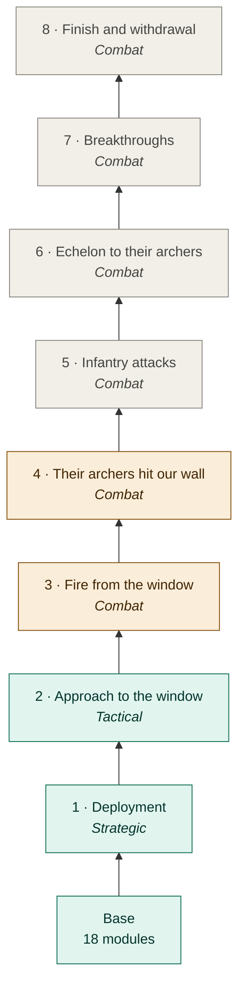

# Documentation

[← Back](../../README.md) · [Project](../../README.md) · **English** | [Русский](../ru/README.md)

## The AI tree — start here

Everything the battle AI does, by phases and branches, with diagrams and examples — **[The AI tree](tree/README.md)**.

<!-- generated:tree:trunk -->

<!-- /generated -->

- [All nodes and switches](tree/README.md#all-nodes) · [Module map by level](tree/modules.md) · [How to keep the docs](architecture/documentation.md)

## Architecture

- [Project structure and layers](architecture/overview.md) — folders, app layers, dependency rules, the tick flow.
- [List of apps](architecture/apps.md) — what each app does and where it came from.
- [Errors and unknown values](architecture/error_handling.md) — `known/unknown`, error codes, guarded callbacks.

## Environment and launch

- [Setup and configuration](environment/setup.md) — Python, `.venv`, `config/local.json`, game path.
- [Building a pack](launch/build.md) — `duel`, `arena`, `map-capture` targets, module bundler, PFH5 format.
- [Running a battle and results](launch/run.md) — launcher, safety rules, result folders, True Sight mod.
- [Battle viewer](launch/viewer.md) — a battle from the game and the simulation on a page in real time: layers, presets, side by side on one clock.

## Testing

- [Tests without the game](testing/tests.md) — pytest + lupa, fake `bm`, how to write tests.
- [Simulator](testing/simulator.md) — a battle without the game: the same logic, walking like the engine, checked against the game.

## Apps (`src/apps`)

| App | Purpose |
|---|---|
| [core](apps/core.md) | Value checks, JSON, error codes, time |
| [battle](apps/battle.md) | Sides, armies, units, attacker/defender roles |
| [map](apps/map.md) | Radar frame, grid, heights, ground, objects |
| [navigation](apps/navigation.md) | Point reachability for a specific unit |
| [units](apps/units.md) | Own unit state, missile range, formation width |
| [intel](apps/intel.md) | Enemy visibility and last known position |
| [orders](apps/orders.md) | Command contract and verified order calls |
| [deployment](apps/deployment.md) | Initial placement `deployment-placement-v2` |
| [ai](apps/ai.md) | Profiles, decision contract, policies |
| [observation](apps/observation.md) | One side's view — AI input without hidden data |
| [sandbox](apps/sandbox.md) | Restricted loading of external policies |
| [telemetry](apps/telemetry.md) | JSONL events, state files, post-battle samples |
| [Entries](apps/entries.md) | `duel`, `arena`, `map_capture` — apps wired into a battle |

## Game knowledge

- [What is verified in WH3](game/README.md) — map, units, map catalogue.
- [Readout catalogue](game/readouts.md) — what can be collected about units and the battle, what we already collect.
- [Visual atlas](game/atlas.md) — the key research images.

## Research

- [Research archive](research/README.md) — map-data and launch reports, evidence and legacy scripts.
