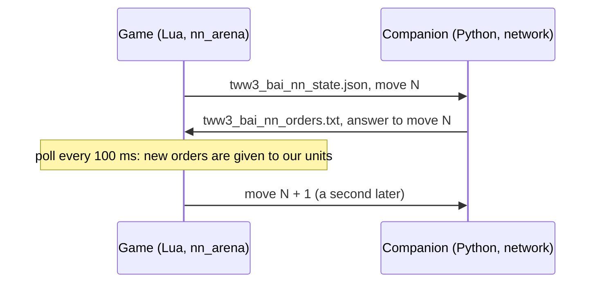

# bridge

[← Back](README.md) · [Documentation](../README.md) · [Apps](../architecture/apps.md) · [Русский](../../ru/apps/bridge.md)

The bridge to the network: our side of a real battle is commanded by the network running in the
companion, a program outside the game (`tools/nn/companion/`). The game and the companion talk
through two files in the game folder. Code: `src/apps/bridge/`. How to launch and watch:
[watching the network](../launch/watch.md).



## How it works

- Every **decision** (`decide_ms`, 1 s by default, battle time) the game writes the state of every
  unit of both sides with the next **move number**.
- The companion builds the network's input from it. What a human would not see is hidden there
  (the observation, [model](../training/model.md)): the game writes everything, the companion's
  observation hides the rest.
- The companion answers with orders for that move. The game reads the file every 100 ms of battle
  time (`poll_ms`) and gives each of our units its order.
- **Only a changed order is given again**: another kind, another target, run instead of walk, or a
  point more than 5 m away. Otherwise a unit would restart its path every second.
- **No answer by the next decision** — the orders in force stay; the event `nn_miss`.
  A late answer (for an earlier move) is still taken; `lag` in the event says how late.
- Routing, shattered and dead units get no orders: they take care of themselves.

Orders are given through the verified recipes of [orders](orders.md):

| Order | Engine calls |
|---|---|
| `hold` | `halt()`, `fire_at_will(true)` |
| `move` | `fire_at_will(true)`, `goto_location(point, run)` |
| `withdraw` | `fire_at_will(true)`, `goto_location(point, true)` — a run out of the fight |
| `attack` | a shooter with ammunition: `attack_ranged`; everyone else: `attack_melee` |
| `keep` | nothing: the order in force goes on; a unit without one yet stands as it was taken |

Every unit of our side is under script control (`take_control`) from the start of the battle. Until
the first answer it stands and shoots at will.

## The files

Both files are written to a temp file first (`.tmp`) and then renamed, so the reader never sees half a
file. Windows cannot rename over an existing file: the game removes the old one first, and for that
moment the file is missing (the companion waits). If the game cannot rename, it writes in place; the
companion then simply reads again when the JSON is not complete.

**State** `tww3_bai_nn_state.json` (game → companion), JSON:

| Field | What it is |
|---|---|
| `batch` | The battle's id; a new batch — the companion's memory starts afresh |
| `move` | Move number: 1, 2, 3… |
| `t` | Battle time since the start, ms |
| `done` | `true` in the last state, at the end of the battle |
| `attacker` | Side that attacks (2: the game's AI attacks) |
| `factions` | `{own, enemy}` |
| `decide_ms` | Time between decisions, ms |
| `units` | Every unit: the fields of the recorded `nn_sample` ([nn_arena](entries.md#nn_arena)) plus `side`, `key` (unit key) and `v` (visible to the other side) |

**Orders** `tww3_bai_nn_orders.txt` (companion → game), text, one line per unit:

```
tww3_bai_nn_orders 1
move 17
batch 20260930T203912-nn-12
think_ms 2.7
unit own_lord hold
unit own_spear_1 move -120.5 33.2 1
unit own_spear_2 attack enemy_spear_3 0
unit own_archer_1 withdraw -300.0 0.0 1
unit own_archer_2 keep
end
```

`move` / `withdraw`: point x, z in metres and run 1 / 0; `attack`: the enemy's script name and run;
`keep`: no new order (the network chose to go on with the one in force).
Without the last line `end` the game takes nothing. A unit without a line keeps its order.

## services — pure rules

| Function | What it does |
|---|---|
| `parse_orders(text)` | The orders file → `{move, batch, think_ms, orders}`, or `nil` and the reason (`incomplete`, `bad kind`…) |
| `changed(old, new)` | Is the order different (kind, target, run, point further than `REPEAT_M` = 5 m) |
| `state_document(meta, move, t, units, done)` | The state as a table for JSON |
| `real_ms(a, b)` | Milliseconds between two `os.clock()` readings |

## exchange_adapter — files

`write(path, text)` (temp file, remove, rename; returns `renamed` or `direct`), `read(path)`,
`remove(path)`.

## adapter — the bridge

`start(opts)` takes our units under control, removes the files of an earlier battle and returns
`decide()`, `poll()`, `finish()`, `stats()`. The entry [nn_arena](entries.md#nn_arena) with
`--own-ai net` calls them on its timers.

## Events

| Event | Fields |
|---|---|
| `nn_orders` | `move`, `lag` (moves written since), `wait_model_ms` and `wait_real_ms` (from writing the state to giving the orders), `think_ms` (the network's time in the companion), `orders` (given: `u`, `k`, `x`, `z`, `tg`, `run`, `status`), `kept` (the same order again: not given), `keeps` (units told `keep`), `skipped` |
| `nn_miss` | `move` that got no answer by the next decision, `answered` |
| `result` (added) | `nn_moves`, `nn_answered`, `nn_missed`, `nn_orders_given`, `nn_keeps`, `nn_bad_files`, `nn_write_mode` |

Tests: `tests/apps/bridge/test_bridge.py` (the orders file as the game reads it, what counts as a
new order), `tests/entries/test_entries.py` (`test_net_...`: state, answer, orders given, a miss,
the last state), `tests/tools/test_nn_companion.py` (the companion's side).
