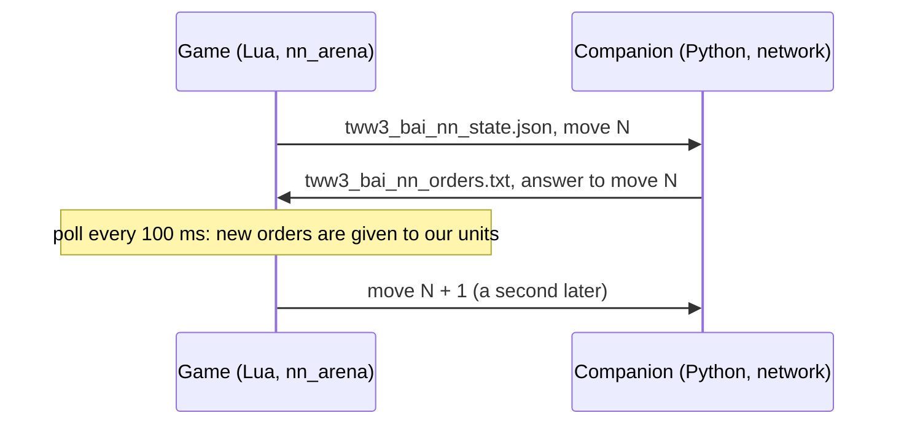

# bridge

[← Back](README.md) · [Documentation](../README.md) · [Apps](../architecture/apps.md) · [Русский](../../ru/apps/bridge.md)

The bridge to the network: our side of a real battle is commanded by the network running in the
companion, a program outside the game (`tools/nn/companion/`). The game and the companion talk
through two files in the game folder. Code: `src/apps/bridge/`. How to launch and watch:
[watching the network](../launch/watch.md).



## How it works

- Every **decision** (`decide_ms`, 1 s by default, battle time) the game writes the state of every
  unit of both sides with the next **move number**.
- The companion builds the network's input from it. What a human would not see is hidden there
  (the observation, [model](../training/model.md)): the game writes everything, the companion's
  observation hides the rest.
- **Order point** (`ox`, `oz` of our units): the companion replaces the game's reading with the
  simulator's (`exchange.order_points`, from the orders it gave): a holding unit's own place, an
  attacking unit's target, a move's point. The game's `ordered_position` is a move's point too, but
  ~10 m from the unit for a hold or an attack (gate it2: median 9.8 m from the unit, not at the
  target). Fed that, the network did not recognise its own order in force and re-decided: replaying
  the gate's recordings offline gave the game's 15.6 order changes a unit-minute (sampled and
  greedy alike, so not the bridge); the simulator with the game's point gave 30 instead of its own
  5.5. Recordings (`nn_sample`) keep the game's raw value.
- **Running** (`f`): the companion replaces the game's reading with the simulator's
  (`exchange.running_by_speed`): moving (`mv`) and faster than the unit's walk (passport) + 0.3 m/s,
  the speed measured between the previous state and this one; nobody runs in a battle's first state.
  The game's `f` is `unit:is_moving_fast()`, the unit's run mode, not its speed: in a gate of
  8 battles it was on in 74 % of the unit-seconds a unit stood still (< 0.3 m/s) in melee
  and in 99 % of the game AI's melee seconds; the simulator's `f` is on in 3-4 % of melee seconds.
  Measured by speed, the game AI's units in melee run 9 % of the time, as the simulator's. Recordings
  keep the game's raw value (the replay uses it as the run order).
- **Target** (`t` of our units, the network's `has_target`): the companion replaces the game's reading
  with the simulator's (`exchange.engaged_targets`): a unit has a target exactly while it fights or shoots (the
  engine's target). A fighting unit gets the simulator's: the nearest standing enemy it touches (the formations'
  rectangles by the passport and the layout's width, edges overlapping 2.5 m, a lone man 1 m, 2 m more when either
  is already in melee: `contact.reach_m`, `lord_reach_m`, `hold_m`); touching nobody by that geometry while the
  game says melee, the engine's target if it is a present enemy, else the nearest one. Before, a fighting unit took
  the engine's target, and in the game that is the attack order's target (kept ~25 s), not the enemy it fights: the
  enemy's `ai_like` script "saw" its unit fighting our shooter it had sent it onto and kept the order (62 % of
  re-orders held 5 s, the twin 7 %, `build/bench2/o_revert_p1.txt`). The network's side (`loop.Brain`) reads the
  same input - fixed for both.
  The game's `t` is the engine's target: an attack order's target from the moment it is given (99 % of
  free units under an attack), none for most units fighting under a hold (74 %) or a move (100 %). In
  a gate: the same shift put into the simulator cut the network's trade against `ai_like` by 0.105
  a battle and moved its orders to the game's mix (hold 0.73 -> 0.63, attack 0.17 -> 0.24, move 0.10 ->
  0.13; in the game 0.61 / 0.23 / 0.16). Recordings keep the game's raw value.
- The companion answers with orders for that move. The game reads the file every 100 ms of battle
  time (`poll_ms`) and gives each of our units its order.
- **Only a changed order is given again**: another kind, another target, run instead of walk, or a
  point more than 5 m away. Otherwise a unit would restart its path every second.
- **No answer by the next decision** — the orders in force stay; the event `nn_miss`.
  A late answer (for an earlier move) is still taken; `lag` in the event says how late.
- **Routing, shattered and dead units get no orders**: they take care of themselves. The companion
  writes no line for them (the network's HOLD for a unit that takes no orders is only a filler), and
  the bridge takes no order from an answer to a state in which the unit was down (`down_at`; counted
  in `skipped`). Without that, the filler HOLD reached units that rallied between the state and the answer
  and halted them: the first order after 42 of 102 rallies in one gate.
- **A rallied unit goes on with the order it had.** The engine drops the order of a unit that
  routs; the simulator keeps it, and the unit goes on with it the moment it rallies. So the bridge
  keeps the order a unit had when it broke and gives it again at once when the unit stands again
  (checked every poll; event `nn_rally`, counted in `nn_regiven`); an attack on a target that is gone
  becomes hold, as in the simulator. Without it the unit stands until the network's next answer, and the
  network, seeing it stand far from its target, often held it (replayed offline: HOLD 0.41-0.43
  standing, 0.11-0.12 when seen walking back to the target as in the simulator).
- **What the bridge does not change:** a held unit far from the enemy stays held. The network
  (`test5/it6/m40`) keeps an own unit under HOLD with no enemy near on HOLD (offline: 0.999-1.0;
  moving its order point onto an enemy: attack 0.82-0.98; morale, fatigue and health change nothing),
  and units rally 75-255 m from the nearest enemy. In a gate of 8 battles: of 102 rallies 37
  ended in a hold of 30 s or more (17 held before the rout as well); 48 % of rallied units' decisions
  were HOLD (78 % of them idle) against 10 % for units that never routed. The simulator shows the
  same habit, weaker: rallied units under HOLD 24 % of their time, 38 % of it idle (6 battles against
  ai_like). That is for training, not for the bridge.
- **A held shooter shoots as in the simulator.** The simulator's held shooter shoots
  the nearest enemy in range (into melee too). The game's fire at will does not: a halted shooter
  picks a target itself, often one just out of range, keeps it and stands (gate it4, 8 battles:
  standing shooters with an enemy in range by the simulator's measure fired within 10 s in 40 % of
  the seconds under hold, 98 % under an attack order, 90-97 % for the game's AI; one slinger unit
  stood 155 s with full ammunition). So once per decision the bridge picks the target of each held
  shooter (`services.hold_target`: nearest standing visible enemy within range + `HOLD_REACH_M` = 10 m
  centre to centre, else the nearest routing one; the pick is kept while it qualifies) and gives it
  as an attack order's target, walking, under the same duty (`fire_freely`, `missile_duty`). A held
  shooter that walks under it for `HOLD_WALK` = 2 decisions is halted to fire at will for `FREE_MIN`
  decisions (`services.hold_guard`): hold never walks. Event `nn_hold` (`aim`, `none`, `halt`);
  `nn_hold_aims`, `nn_hold_halts` in the result.
- **An order the engine dropped is given again.** The engine forgets a unit's attack (or move)
  after a fight it was drawn into: the unit stands where the fight ended, while the bridge still
  holds the order as in force and gives nothing for the same order (gate it5: our lord under an
  attack on slingers 80-170 m away stood 92 s after beating off the enemy lord, another time 14 s).
  So a unit under a melee attack whose target is further than `STALL_M` = 20 m (centre to centre),
  or under a move whose point is further than `STALL_POINT_M` = 15 m, that stands — not moving, not
  in melee, not shooting, not losing health — for `STALL_AFTER` = 3 decisions is given the order
  again (`services.order_stalled`; a shooter's attack is left to its duty). Event `nn_stall`;
  `nn_stalls` in the result.
- **The companion's log counts units that take no orders as `out`.** The network gives dead,
  routing and shattered units HOLD (the game gives them nothing); the line "hold 15 attack 5" late in
  a gate battle was ~13 such units. The real hold share of units that take orders in gate it4 was
  7.6 % (the simulator's evaluation 5.5 %).
- **A shooter that cannot shoot its target is released to fire at will.** In the game a shooter
  that holds an explicit target it cannot hit (the target is in melee with our units, out of sight)
  stands and picks no other target: 722 unit-seconds with the target in melee and 149 with a free
  target in range in one gate battle; the firing share of our archers was 0.39-0.80 against
  0.94-0.99 for the game AI's slingers. So:
  - an attack order on a target that stands in melee within the shooter's range (centre to
    centre) is given as fire at will, not as an explicit target (`services.fire_freely`);
  - once per decision the bridge checks each shooter under an attack order
    (`services.missile_duty`): standing idle (not moving, not in melee, not firing, with
    ammunition) for `RELEASE_AFTER` = 4 decisions — released to fire at will. The count goes on
    across the network's new targets: it changes a shooter's target every ~5 s, and a count that
    restarted with each order never reached 4 (the first try in the game: 742 idle unit-seconds
    left);
  - fire at will is `halt()` + `fire_at_will(true)`: the game picks the target, as its own AI's
    shooters do. The ordered target is given again once it is out of melee, after at least
    `FREE_MIN` = 10 decisions (event `nn_duty`). The network's order stays the same all along: the
    same order again is not new. If the engine has no suitable target, `nn_reaim` recovery below
    takes precedence before this wait expires.

  In the game, without and with these rules (battle 4 of the gate, seed 1000900008; another sampled battle each time):

  | | Before | After |
  |---|---|---|
  | Our archers moving under an attack order with run = 1 | 1.46 m/s (median) | 3.01 m/s |
  | Our archers' firing share after the first shot | 0.59 (0.41-0.80) | 0.75 (0.38-0.97) |
  | Idle under an attack order (standing, ammunition, not firing), unit-s per battle second | 1.43 | 0.78 |
  | The first order after a rally | up to 77 s (128 s in battle 2) | within 0.4 s; 0 idle seconds |

- **A shooter already firing at its target is not given it again.** In the game any order restarts a
  shooter's aim: a unit that shot in the 3 s before, standing with an enemy in range, given an attack
  order shoots in 0.35 / 0.26 of its next 10 s (arrows / slings) against 0.47 / 0.42 given none
  (sim task 2, 04.10.2026). On target (`services.on_target`): standing (not moving, not in melee),
  the engine's target (row `t`) is that unit, and it fires now or fired within `FIRE_RECENT` = 3
  decisions (the fire flag is off 1-3 s between volleys: 104 of 116 gaps). Then:
  - an attack (the network's, a duty's `resume`, a held shooter's pick) on that unit gives the engine
    nothing (status `kept`, event `nn_aim_kept`); a run flag that changed alone is not given either;
  - a HOLD keeps the engine's target as the held shooter's pick instead of `halt()` when
    `hold_target` would pick it too (event `nn_hold` `keep`); a held shooter with no pick takes the
    unit it is firing at while that qualifies;
  - an attack on a target in melee within range (fire at will) does not halt a shooter that shoots
    standing already (`services.firing`; event `nn_duty` `free_kept`);
  - once the engine is off that target (another target, no fire for `FIRE_RECENT` decisions) the
    order is given for real (event `nn_duty` `engine_off`).

  Gate 20261004-071805 (8 battles, 210 shooter-minutes), its recorded orders through these rules
  offline: orders to our standing shooters while they fire 1.53 a shooter-minute → 1.03 (the
  battles of 04.10 afternoon, 139 shooter-minutes: 2.38 → 1.44); the drift check adds 0.01. All
  engine orders to our shooters 14.7 → 14.2 a shooter-minute: 77 % of them are new move points to
  shooters already walking (the network's point moves with the unit, > 5 m a second), which do not
  touch aiming; what stays for firing shooters is the network's own choice (another target 0.44,
  a move 0.39, a held shooter's new pick 0.13 a minute), which the simulator charges since sim
  task 2 (`missile.aim_reset_on_order`).

- **A targetless shooter receives an explicit target within 3 decisions.** Under ATTACK or HOLD,
  the bridge counts decisions when the unit is standing with ammo, is neither in melee nor firing,
  and the engine has no suitable target. At `REAIM_AFTER` = 3 decisions (at most 3 s with the usual
  `decide_ms = 1000`), it picks the network's target if visible and in range, otherwise the nearest
  visible living, non-shattered enemy; routing enemies can also be shot. Range is strictly between
  centres, without `HOLD_REACH_M`. No enemy resets the count; network target changes do not.
  Explicit `attack_ranged` bypasses `fire_freely`, even while the enemy remains in melee:
  `melee(false)`, `fire_at_will(true)`, `attack_unit(enemy, true, run)` supply the engine with a
  target to turn toward and shoot. HOLD uses walk. Recovery also works during the cooldown after
  halting a walking shooter; the existing walk guard remains. A firing unit and its valid target
  between volleys are kept. If the engine does not accept the target, another attempt requires
  the next 3 decisions. MOVE and WITHDRAW retain their behavior.
- **ATTACK with zero ammunition is a melee attack.** A new order immediately calls `melee(true)`,
  `attack_unit(enemy, false, true)`. When ammo runs out under an existing attack, the bridge clears
  ranged duty and issues the same attack in melee on the next decision, including an unchanged
  ATTACK or a KEEP reply. Normal `nn_rally` and `nn_stall` apply thereafter. Each such order emits
  `nn_empty_melee`; target recovery emits `nn_reaim`.

Orders are given through the verified recipes of [orders](orders.md):

| Order | Engine calls |
|---|---|
| `hold` | `halt()`, `fire_at_will(true)`; a held shooter is then aimed by the bridge (below) |
| `move` | `fire_at_will(true)`, `goto_location(point, run)` |
| `withdraw` | `fire_at_will(true)`, `goto_location(point, true)` — a run out of the fight |
| `attack` | a shooter with ammunition: `attack_ranged(uc, enemy, run, true)` — `melee(false)`, `fire_at_will(true)`, `attack_unit(enemy, true, run)`; everyone else, including a shooter with ammo 0: `attack_melee` — `melee(true)`, `attack_unit(enemy, false, true)`; an existing attack switches when ammo runs out |
| ATTACK / HOLD target recovery | `nn_reaim`: explicit `attack_ranged` after 3 decisions without a suitable target, including enemies in melee; HOLD walks |
| `keep` | nothing: the order in force goes on; a unit without one yet stands as it was taken |

Every unit of our side is under script control (`take_control`) from the start of the battle. Until
the first answer it stands and shoots at will.

**Abilities.** The network decides itself when its lord uses an ability, like a player. An
`ability <unit> <key>` line of the answer is used once, at once, beside the unit's order:

- the unit must stand (not routing, shattered or dead) and `unit:can_perform_special_ability(key)`
  must say yes; then `uc:perform_special_ability(key, unit)` — on the lord himself (self-cast:
  the network is offered only abilities that need no target; the recipe verified in battle,
  [commands](../game/units/commands.md));
- each request is logged (`nn_ability`: `used`, `not_ready`, `down`, `unknown_unit`, `error`);
- the state carries `abilities_used` (each ability's last use, battle ms) and, for every unit of
  both sides, `fx`: the phases active on it now, as its card shows them (CCO
  `ActiveEffectList.At(i).PhaseRecordContext.Key`, verified in battle, [states](../game/units/states.md)).
  The companion counts the timers from the use and the passport (active for `active_s`, ready
  again `recharge_s` later; `config/nn/abilities.json`) and trusts the card over the count: a use
  whose phase is not on the lord 1.5 s later did not take (ready again). It shows an enemy ability
  as active while its phase is on the unit and the unit is seen.
- once per decision, changes only: `nn_ability_ready` (`can_perform_special_ability` of each own
  active ability) and `nn_effects` (a unit's active phases).

**In the game** (run `20261001-105336`: arena `whole_emp_v_skv`, ×3, 240 s of battle,
Normal difficulty, the untrained network `build/nn-train/random.pt` with a fresh ability head):

| What | Result |
|---|---|
| Uses | 6 asked, 6 `used`, 0 refused, no Lua errors: Stand Your Ground at 1.2, 111.2, 221.2 s; Foe Seeker at 2.1, 88.2, 176.2 s |
| Our General's card (`fx`) | the phase appears by the next state (≤ 1 s) and is gone after 18 s (Stand Your Ground: 2.0 → 20.0 s) and 25 s (Foe Seeker: 3.0 → 28.0 s): the passports' `active_s` |
| Recharge | the companion's count asked again at 86 s (Foe Seeker, passport 25 + 60) and 110 s (Stand Your Ground, 18 + 90) after the first use; every use took |
| `can_perform_special_ability` | **true all battle**, active and recharging alike: it says the lord owns the ability, not that it is ready. So the bridge cannot refuse a use in recharge; the companion's count and the card decide readiness |
| The enemy's cards | readable: Strength in Numbers shows on every Skaven unit from 1 s. The Warlord stood behind his army all battle and used nothing, so an enemy active ability was not seen |
| Passives on the card | Hold the Line shows on the General; Single Entity and Scurry Away never show (conditional) |

## The files

Both files are written to a temp file first (`.tmp`) and then renamed, so the reader never sees half a
file. Windows cannot rename over an existing file: the game removes the old one first, and for that
moment the file is missing (the companion waits). If the game cannot rename, it writes in place; the
companion then simply reads again when the JSON is not complete.

**State** `tww3_bai_nn_state.json` (game → companion), JSON:

| Field | What it is |
|---|---|
| `batch` | The battle's id; a new batch — the companion's memory starts afresh |
| `move` | Move number: 1, 2, 3… |
| `t` | Battle time since the start, ms |
| `done` | `true` in the last state, at the end of the battle |
| `attacker` | Side that attacks (2: the game's AI attacks) |
| `factions` | `{own, enemy}` |
| `decide_ms` | Time between decisions, ms |
| `units` | Every unit: the fields of the recorded `nn_sample` ([nn_arena](entries.md#nn_arena)) plus `side`, `key` (unit key), `v` (visible to the other side) and `fx` (phase keys active on it; missing when the card cannot be read); without the recording-only `sv`, `pcr`, `phr`, `mge` (and the sample's `bop`), which `nn_arena` reads for the simulator's calibration, not for the network |
| `abilities_used` | `{unit: {ability key: battle ms of its last use by the bridge}}` (`{}` before any) |

**Orders** `tww3_bai_nn_orders.txt` (companion → game), text, one line per unit:

```
tww3_bai_nn_orders 1
move 17
batch 20260930T203912-nn-12
think_ms 2.7
unit own_lord hold
unit own_spear_1 move -120.5 33.2 1
unit own_spear_2 attack enemy_spear_3 0
unit own_archer_1 withdraw -300.0 0.0 1
unit own_archer_2 keep
ability own_lord wh_main_character_abilities_stand_your_ground
end
```

`move` / `withdraw`: point x, z in metres and run 1 / 0; `attack`: the enemy's script name and run;
`keep`: no new order (the network chose to go on with the one in force); `ability`: the unit and the
ability key to use now (any number of lines; a file without them is as before, the format stays
`tww3_bai_nn_orders 1`).
Without the last line `end` the game takes nothing. A unit without a line keeps its order.

## The enemy under the simulator's script

To tell the engine's difference from the opponent's, the enemy in the game can be commanded by the very
script the network trains against in the simulator (`ai_like`, `tools/nn/train/opponents.py`):
`tools.build nn-arena --own-ai net --enemy-ai ai_like` (in the build `enemy_ai = 'companion'`,
`enemy_script = 'ai_like'`). Then:

- `nn_arena` takes the enemy army from the game's AI and starts a **second bridge** for side 2 with its own
  files: `tww3_bai_nn_state_enemy.json` and `tww3_bai_nn_orders_enemy.txt` (the same format). The state is
  ours, at the same moment (rows read once a decision), plus `control: 2`, `script` and `layout` (each
  unit's slot and frontage from the build: widths and lords as the twin has them). The rules are our
  side's: routing units are the game's, the order again after a rally, shooters, a dropped order given
  again, abilities through `perform_special_ability`. The second bridge's events are `en_*` for `nn_*`, its
  `result` counters `en_*`.
- The companion (`--enemy-script ai_like`, `tools/nn/companion/script.py`) answers both every move: the
  network first, then the script. The script sees everything, as in the simulator: the game's state is laid
  over a simulator state built once a battle (`sim/scenario.build`: the same slots, passports, widths). What
  the game does not give is made the simulator's way: `r` = routing or shattered; `target` - the enemy
  fought or shot at; the order in force and its point (`order_kind`, `order_target`, `ox`, `oz`) - the
  script's own orders and the network's orders in force before this move; the speed `vx`, `vz` from the
  last two states; `contact_s` (through gaps shorter than `contact.reset_s`) and `rout_s` from the game's
  flags.
- The enemy lord's abilities fire by the simulator's game-AI rule (`sim/abilities.py`): ready (the
  companion's count of the bridge's uses and the card), not switched off, its trigger (`melee`, `near`,
  `waver`, `ready`) and `friends_min`. The `losing` trigger has no reading in the game: never (no ability
  has it now).

The check without the game (`tests/tools/test_nn_companion_script.py`): a simulated battle written move by
move as the bridge writes it; the companion's orders to side 2 against `ai_like` on the simulator's own
state - 3 seeds of 240 s: the order's kind the same in 99.2 / 100 / 100 %, the attack's target in
100 / 100 / 99.9 %, a move's point and run in 100 %. The differences: the flank wrap (a move's point
against an attack) where the game's speed and melee clock are seen once a second.

The check battle in the game (seed 1000900014, network it20 against `ai_like`, x20): both sides commanded
the whole battle; the enemy (attacking) marched as a line (centre 168 -> 14 m in 90 s), melee from 62 s,
its lord used Foe-Seeker and Stand Your Ground 11 times, none refused; 714 moves, 1 answer missed; the
enemy's answer waited 400 model ms (median) against the network's 300 - it is written after the network's.
`ai_like` won.

## services — pure rules

| Function | What it does |
|---|---|
| `parse_orders(text)` | The orders file → `{move, batch, think_ms, orders, abilities}`, or `nil` and the reason (`incomplete`, `bad kind`, `ability without a unit or a key`…) |
| `changed(old, new)` | Is the order different (kind, target, run, point further than `REPEAT_M` = 5 m) |
| `state_document(meta, move, t, units, done, used)` | The state as a table for JSON (`used` → `abilities_used`) |
| `active_effects(read)` | The phase keys active on a unit from its card (`read(field)` → the CcoBattleUnit value), or `nil` when the list cannot be read |
| `real_ms(a, b)` | Milliseconds between two `os.clock()` readings |
| `fire_freely(me, target, range)` | Give an attack as fire at will: the target stands in melee within range |
| `shooter_idle(row)` | A shooter stands idle: standing, not moving, not in melee, not firing, with ammunition |
| `missile_duty(duty, me, target)` | One decision of a shooter under an attack order: `release`, `resume` or `nil` (`RELEASE_AFTER`, `FREE_MIN`) |
| `firing(me, recent)` | Shoots standing: up, not moving, not in melee, the fire flag on now or within `FIRE_RECENT` decisions (`recent`) |
| `on_target(me, target, recent)` | `firing` and the engine's target (`t`) is that unit: giving it again would restart the aim |
| `reaim_target(watch, me, rows, range, preferred, recent)` | After `REAIM_AFTER` = 3 decisions without a suitable target: the network's in-range target (even a routing one), otherwise the nearest standing enemy, a routing one only when no standing enemy is in range (as the simulator's `choose_target`); the engine's current target is kept unless it routs while a standing enemy is in range; before, the nearest enemy was taken even when routing, and both sides' shooters in the game (the network's and `ai_like`'s) were turned onto a fleeing mob; `nil` when no intervention is needed; count in `watch.n` |

## exchange_adapter — files

`write(path, text)` (temp file, remove, rename; returns `renamed` or `direct`), `read(path)`,
`remove(path)`.

## adapter — the bridge

`start(opts)` takes our units under control, removes the files of an earlier battle and returns
`decide()`, `poll()`, `finish()`, `stats()`. `opts.cco(unit, field)` (optional) reads a unit's
card: with it every row gets `fx`. The entry [nn_arena](entries.md#nn_arena) with
`--own-ai net` calls them on its timers.

## Events

| Event | Fields |
|---|---|
| `nn_orders` | `move`, `lag` (moves written since), `wait_model_ms` and `wait_real_ms` (from writing the state to giving the orders), `think_ms` (the network's time in the companion), `orders` (given: `u`, `k`, `x`, `z`, `tg`, `run`, `status`: `given`, `kept` — nothing given to a shooter on that target, `unknown_target`), `kept` (the same order again: not given), `keeps` (units told `keep`), `skipped` (orders to units down now or in the state answered) |
| `nn_rally` | `u`, `k`, `x`, `z`, `tg`, `run`, `status` — the order a unit had when it broke, given again as it rallied (`hold` if the attack's target is gone) |
| `nn_duty` | `u`, `action` (`free` — an attack on a target in melee given as fire at will, `free_kept` — the same, the shooter shooting standing already: no halt, `release` — idle: to fire at will, `resume` — the ordered target again, `engine_off` — a kept aim given for real), `tg` |
| `nn_aim_kept` | `u`, `tg` — an attack on the unit the shooter fires at already: nothing given |
| `nn_reaim` | `u`, `k` (`attack`, `hold`), `tg` — explicit target replacing a missing or unsuitable engine target |
| `nn_empty_melee` | `u`, `tg` — melee attack issued to a shooter with zero ammunition |
| `nn_miss` | `move` that got no answer by the next decision, `answered` |
| `nn_hold` | `u`, `action` (`aim`, `none`, `halt`, `keep` — a HOLD left the engine's target as the pick, no halt), `tg` — a held shooter's target |
| `nn_stall` | `u`, `k` (`attack`, `move`, `withdraw`), `tg` — an order the engine dropped, given again |
| `nn_ability` | `move`, `u`, `key`, `status`: `used`, `not_ready` (`can_perform_special_ability` said no: in the game only for an ability not owned), `down` (the unit is not standing), `unknown_unit` (not ours), `error` |
| `nn_ability_ready` | `u`, `key`, `ready` (`can_perform_special_ability`), when it changes |
| `nn_effects` | `u`, `fx` (the phases on the unit, or `unknown`), when they change |
| `result` (added) | `nn_moves`, `nn_answered`, `nn_missed`, `nn_orders_given`, `nn_keeps`, `nn_bad_files`, `nn_write_mode`, `nn_regiven` (orders given again at a rally), `nn_released`, `nn_resumed`, `nn_abilities_used`, `nn_abilities_refused`, `nn_hold_aims`, `nn_hold_halts`, `nn_stalls`, `nn_reaims`, `nn_empty_melees`, `nn_aims_kept` (orders not given: the shooter was on that target already) |

The result also includes `nn_reaims` and `nn_empty_melees`, counting these interventions.
`tools/nn/gate.py` copies them into `battles[].nn.reaims` and `battles[].nn.empty_melees`.

Tests: `tests/entries/test_bridge_recovery.py` (explicit aim within 3 s under ATTACK/HOLD, fallback
target, walk cooldown, preserved firing, zero ammo and normal attack recovery);
`tests/apps/bridge/test_bridge.py` (the orders file as the game reads it, what counts as a
new order, a shooter's duty), `tests/entries/test_entries.py` (`test_net_...`: state, answer, orders
given, a miss, the last state; a ranged attack runs, a rout and a rally, a shooter released and taken back), `tests/entries/test_bridge_abilities.py` (ability lines, the card's active effects, a use once, refused when not ready, down or not ours; the state's uses; a held shooter aimed, a shooter firing at its target given nothing for an attack or a hold and the order given once the engine leaves it, a shooter shooting standing not halted for fire at will, a dropped attack given again, a rallied unit going on with its order and taking no filler HOLD), `tests/tools/test_nn_companion.py` (the companion's side, the ability timers and lines, no line for units that take no orders).
