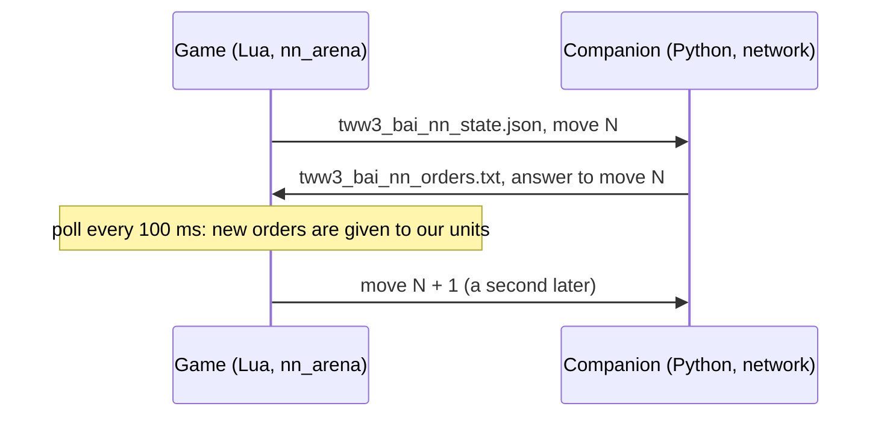

# bridge

[← Back](README.md) · [Documentation](../README.md) · [Apps](../architecture/apps.md) · [Русский](../../ru/apps/bridge.md)

The bridge to the network: our side of a real battle is commanded by the network running in the
companion, a program outside the game (`tools/nn/companion/`). The game and the companion talk
through two files in the game folder. Code: `src/apps/bridge/`. How to launch and watch:
[watching the network](../launch/watch.md).



## How it works

- Every **decision** (`decide_ms`, 1 s by default, battle time) the game writes the state of every
  unit of both sides with the next **move number**.
- The companion builds the network's input from it. What a human would not see is hidden there
  (the observation, [model](../training/model.md)): the game writes everything, the companion's
  observation hides the rest.
- **Order point** (`ox`, `oz` of our units): the companion replaces the game's reading with the
  simulator's (`exchange.order_points`, from the orders it gave): a holding unit's own place, an
  attacking unit's target, a move's point. The game's `ordered_position` is a move's point too, but
  ~10 m from the unit for a hold or an attack (gate it2: median 9.8 m from the unit, not at the
  target). Fed that, the network did not recognise its own order in force and re-decided: replaying
  the gate's recordings offline gave the game's 15.6 order changes a unit-minute (sampled and
  greedy alike, so not the bridge); the simulator with the game's point gave 30 instead of its own
  5.5 (02.10.2026). Recordings (`nn_sample`) keep the game's raw value.
- The companion answers with orders for that move. The game reads the file every 100 ms of battle
  time (`poll_ms`) and gives each of our units its order.
- **Only a changed order is given again**: another kind, another target, run instead of walk, or a
  point more than 5 m away. Otherwise a unit would restart its path every second.
- **No answer by the next decision** — the orders in force stay; the event `nn_miss`.
  A late answer (for an earlier move) is still taken; `lag` in the event says how late.
- **Routing, shattered and dead units get no orders**: they take care of themselves. The companion
  writes no line for them (the network's HOLD for a unit that takes no orders is only a filler), and
  the bridge takes no order from an answer to a state in which the unit was down (`down_at`; counted
  in `skipped`). Before 02.10.2026 that filler HOLD reached units that rallied between the state and
  the answer and halted them: the first order after 42 of 102 rallies in the gate of 02.10.2026.
- **A rallied unit goes on with the order it had.** The engine drops the order of a unit that
  routs; the simulator keeps it, and the unit goes on with it the moment it rallies. So the bridge
  keeps the order a unit had when it broke and gives it again at once when the unit stands again
  (checked every poll; event `nn_rally`, counted in `nn_regiven`); an attack on a target that is gone
  becomes hold, as in the simulator. Before, the unit stood until the network's next answer, and the
  network, seeing it stand far from its target, often held it (replayed offline: HOLD 0.41-0.43
  standing, 0.11-0.12 when seen walking back to the target as in the simulator). (Before 01.10.2026
  a rallied unit stood up to 128 s under an order the bridge thought was in force.)
- **What the bridge does not change:** a held unit far from the enemy stays held. The network
  (`test5/it6/m40`) keeps an own unit under HOLD with no enemy near on HOLD (offline: 0.999-1.0;
  moving its order point onto an enemy: attack 0.82-0.98; morale, fatigue and health change nothing),
  and units rally 75-255 m from the nearest enemy. Gate 02.10.2026 (8 battles): of 102 rallies 37
  ended in a hold of 30 s or more (17 held before the rout as well); 48 % of rallied units' decisions
  were HOLD (78 % of them idle) against 10 % for units that never routed. The simulator shows the
  same habit, weaker: rallied units under HOLD 24 % of their time, 38 % of it idle (6 battles against
  ai_like). That is for training, not for the bridge.
- **A held shooter shoots as in the simulator** (02.10.2026). The simulator's held shooter shoots
  the nearest enemy in range (into melee too). The game's fire at will does not: a halted shooter
  picks a target itself, often one just out of range, keeps it and stands (gate it4, 8 battles:
  standing shooters with an enemy in range by the simulator's measure fired within 10 s in 40 % of
  the seconds under hold, 98 % under an attack order, 90-97 % for the game's AI; one slinger unit
  stood 155 s with full ammunition). So once per decision the bridge picks the target of each held
  shooter (`services.hold_target`: nearest standing visible enemy within range + `HOLD_REACH_M` = 10 m
  centre to centre, else the nearest routing one; the pick is kept while it qualifies) and gives it
  as an attack order's target, walking, under the same duty (`fire_freely`, `missile_duty`). A held
  shooter that walks under it for `HOLD_WALK` = 2 decisions is halted to fire at will for `FREE_MIN`
  decisions (`services.hold_guard`): hold never walks. Event `nn_hold` (`aim`, `none`, `halt`);
  `nn_hold_aims`, `nn_hold_halts` in the result.
- **An order the engine dropped is given again.** The engine forgets a unit's attack (or move)
  after a fight it was drawn into: the unit stands where the fight ended, while the bridge still
  holds the order as in force and gives nothing for the same order (gate it5: our lord under an
  attack on slingers 80-170 m away stood 92 s after beating off the enemy lord, another time 14 s).
  So a unit under a melee attack whose target is further than `STALL_M` = 20 m (centre to centre),
  or under a move whose point is further than `STALL_POINT_M` = 15 m, that stands — not moving, not
  in melee, not shooting, not losing health — for `STALL_AFTER` = 3 decisions is given the order
  again (`services.order_stalled`; a shooter's attack is left to its duty). Event `nn_stall`;
  `nn_stalls` in the result.
- **The companion's log counts units that take no orders as `out`.** The network gives dead,
  routing and shattered units HOLD (the game gives them nothing); the line "hold 15 attack 5" late in
  a gate battle was ~13 such units. The real hold share of units that take orders in gate it4 was
  7.6 % (the simulator's evaluation 5.5 %).
- **A shooter that cannot shoot its target is released to fire at will.** In the game a shooter
  that holds an explicit target it cannot hit (the target is in melee with our units, out of sight)
  stands and picks no other target: 722 unit-seconds with the target in melee and 149 with a free
  target in range in one gate battle; the firing share of our archers was 0.39-0.80 against
  0.94-0.99 for the game AI's slingers. So:
  - an attack order on a target that stands in melee within the shooter's range (centre to
    centre) is given as fire at will, not as an explicit target (`services.fire_freely`);
  - once per decision the bridge checks each shooter under an attack order
    (`services.missile_duty`): standing idle (not moving, not in melee, not firing, with
    ammunition) for `RELEASE_AFTER` = 4 decisions — released to fire at will. The count goes on
    across the network's new targets: it changes a shooter's target every ~5 s, and a count that
    restarted with each order never reached 4 (the first try in the game: 742 idle unit-seconds
    left);
  - fire at will is `halt()` + `fire_at_will(true)`: the game picks the target, as its own AI's
    shooters do. The ordered target is given again once it is out of melee, after at least
    `FREE_MIN` = 10 decisions (event `nn_duty`). The network's order stays the same all along: the
    same order again is not new.

  In the game (battle 4 of the gate, seed 1000900008, 01.10.2026; another sampled battle each time):

  | | Before | After |
  |---|---|---|
  | Our archers moving under an attack order with run = 1 | 1.46 m/s (median) | 3.01 m/s |
  | Our archers' firing share after the first shot | 0.59 (0.41-0.80) | 0.75 (0.38-0.97) |
  | Idle under an attack order (standing, ammunition, not firing), unit-s per battle second | 1.43 | 0.78 |
  | The first order after a rally | up to 77 s (128 s in battle 2) | within 0.4 s; 0 idle seconds |

Orders are given through the verified recipes of [orders](orders.md):

| Order | Engine calls |
|---|---|
| `hold` | `halt()`, `fire_at_will(true)`; a held shooter is then aimed by the bridge (below) |
| `move` | `fire_at_will(true)`, `goto_location(point, run)` |
| `withdraw` | `fire_at_will(true)`, `goto_location(point, true)` — a run out of the fight |
| `attack` | a shooter with ammunition: `attack_ranged(uc, enemy, run, true)` — `melee(false)`, `fire_at_will(true)`, `attack_unit(enemy, true, run)`; everyone else: `attack_melee` (always runs) |
| `keep` | nothing: the order in force goes on; a unit without one yet stands as it was taken |

Every unit of our side is under script control (`take_control`) from the start of the battle. Until
the first answer it stands and shoots at will.

**Abilities.** The network decides itself when its lord uses an ability, like a player. An
`ability <unit> <key>` line of the answer is used once, at once, beside the unit's order:

- the unit must stand (not routing, shattered or dead) and `unit:can_perform_special_ability(key)`
  must say yes; then `uc:perform_special_ability(key, unit)` — on the lord himself (self-cast:
  the network is offered only abilities that need no target; the recipe verified in battle,
  [commands](../game/units/commands.md));
- each request is logged (`nn_ability`: `used`, `not_ready`, `down`, `unknown_unit`, `error`);
- the state carries `abilities_used` (each ability's last use, battle ms) and, for every unit of
  both sides, `fx`: the phases active on it now, as its card shows them (CCO
  `ActiveEffectList.At(i).PhaseRecordContext.Key`, verified in battle, [states](../game/units/states.md)).
  The companion counts the timers from the use and the passport (active for `active_s`, ready
  again `recharge_s` later; `config/nn/abilities.json`) and trusts the card over the count: a use
  whose phase is not on the lord 1.5 s later did not take (ready again). It shows an enemy ability
  as active while its phase is on the unit and the unit is seen.
- once per decision, changes only: `nn_ability_ready` (`can_perform_special_ability` of each own
  active ability) and `nn_effects` (a unit's active phases).

**In the game** (run `20261001-105336`, 01.10.2026: arena `whole_emp_v_skv`, ×3, 240 s of battle,
Normal difficulty, the untrained network `build/nn-train/random.pt` with a fresh ability head):

| What | Result |
|---|---|
| Uses | 6 asked, 6 `used`, 0 refused, no Lua errors: Stand Your Ground at 1.2, 111.2, 221.2 s; Foe Seeker at 2.1, 88.2, 176.2 s |
| Our General's card (`fx`) | the phase appears by the next state (≤ 1 s) and is gone after 18 s (Stand Your Ground: 2.0 → 20.0 s) and 25 s (Foe Seeker: 3.0 → 28.0 s): the passports' `active_s` |
| Recharge | the companion's count asked again at 86 s (Foe Seeker, passport 25 + 60) and 110 s (Stand Your Ground, 18 + 90) after the first use; every use took |
| `can_perform_special_ability` | **true all battle**, active and recharging alike: it says the lord owns the ability, not that it is ready. So the bridge cannot refuse a use in recharge; the companion's count and the card decide readiness |
| The enemy's cards | readable: Strength in Numbers shows on every Skaven unit from 1 s. The Warlord stood behind his army all battle and used nothing, so an enemy active ability was not seen |
| Passives on the card | Hold the Line shows on the General; Single Entity and Scurry Away never show (conditional) |

## The files

Both files are written to a temp file first (`.tmp`) and then renamed, so the reader never sees half a
file. Windows cannot rename over an existing file: the game removes the old one first, and for that
moment the file is missing (the companion waits). If the game cannot rename, it writes in place; the
companion then simply reads again when the JSON is not complete.

**State** `tww3_bai_nn_state.json` (game → companion), JSON:

| Field | What it is |
|---|---|
| `batch` | The battle's id; a new batch — the companion's memory starts afresh |
| `move` | Move number: 1, 2, 3… |
| `t` | Battle time since the start, ms |
| `done` | `true` in the last state, at the end of the battle |
| `attacker` | Side that attacks (2: the game's AI attacks) |
| `factions` | `{own, enemy}` |
| `decide_ms` | Time between decisions, ms |
| `units` | Every unit: the fields of the recorded `nn_sample` ([nn_arena](entries.md#nn_arena)) plus `side`, `key` (unit key), `v` (visible to the other side) and `fx` (phase keys active on it; missing when the card cannot be read); without the recording-only `sv`, `pcr`, `phr`, `mge` (and the sample's `bop`), which `nn_arena` reads for the simulator's calibration, not for the network |
| `abilities_used` | `{unit: {ability key: battle ms of its last use by the bridge}}` (`{}` before any) |

**Orders** `tww3_bai_nn_orders.txt` (companion → game), text, one line per unit:

```
tww3_bai_nn_orders 1
move 17
batch 20260930T203912-nn-12
think_ms 2.7
unit own_lord hold
unit own_spear_1 move -120.5 33.2 1
unit own_spear_2 attack enemy_spear_3 0
unit own_archer_1 withdraw -300.0 0.0 1
unit own_archer_2 keep
ability own_lord wh_main_character_abilities_stand_your_ground
end
```

`move` / `withdraw`: point x, z in metres and run 1 / 0; `attack`: the enemy's script name and run;
`keep`: no new order (the network chose to go on with the one in force); `ability`: the unit and the
ability key to use now (any number of lines; a file without them is as before, the format stays
`tww3_bai_nn_orders 1`).
Without the last line `end` the game takes nothing. A unit without a line keeps its order.

## services — pure rules

| Function | What it does |
|---|---|
| `parse_orders(text)` | The orders file → `{move, batch, think_ms, orders, abilities}`, or `nil` and the reason (`incomplete`, `bad kind`, `ability without a unit or a key`…) |
| `changed(old, new)` | Is the order different (kind, target, run, point further than `REPEAT_M` = 5 m) |
| `state_document(meta, move, t, units, done, used)` | The state as a table for JSON (`used` → `abilities_used`) |
| `active_effects(read)` | The phase keys active on a unit from its card (`read(field)` → the CcoBattleUnit value), or `nil` when the list cannot be read |
| `real_ms(a, b)` | Milliseconds between two `os.clock()` readings |
| `fire_freely(me, target, range)` | Give an attack as fire at will: the target stands in melee within range |
| `shooter_idle(row)` | A shooter stands idle: standing, not moving, not in melee, not firing, with ammunition |
| `missile_duty(duty, me, target)` | One decision of a shooter under an attack order: `release`, `resume` or `nil` (`RELEASE_AFTER`, `FREE_MIN`) |

## exchange_adapter — files

`write(path, text)` (temp file, remove, rename; returns `renamed` or `direct`), `read(path)`,
`remove(path)`.

## adapter — the bridge

`start(opts)` takes our units under control, removes the files of an earlier battle and returns
`decide()`, `poll()`, `finish()`, `stats()`. `opts.cco(unit, field)` (optional) reads a unit's
card: with it every row gets `fx`. The entry [nn_arena](entries.md#nn_arena) with
`--own-ai net` calls them on its timers.

## Events

| Event | Fields |
|---|---|
| `nn_orders` | `move`, `lag` (moves written since), `wait_model_ms` and `wait_real_ms` (from writing the state to giving the orders), `think_ms` (the network's time in the companion), `orders` (given: `u`, `k`, `x`, `z`, `tg`, `run`, `status`), `kept` (the same order again: not given), `keeps` (units told `keep`), `skipped` (orders to units down now or in the state answered) |
| `nn_rally` | `u`, `k`, `x`, `z`, `tg`, `run`, `status` — the order a unit had when it broke, given again as it rallied (`hold` if the attack's target is gone) |
| `nn_duty` | `u`, `action` (`free` — an attack on a target in melee given as fire at will, `release` — idle: to fire at will, `resume` — the ordered target again), `tg` |
| `nn_miss` | `move` that got no answer by the next decision, `answered` |
| `nn_hold` | `u`, `action` (`aim`, `none`, `halt`), `tg` — a held shooter's target |
| `nn_stall` | `u`, `k` (`attack`, `move`, `withdraw`), `tg` — an order the engine dropped, given again |
| `nn_ability` | `move`, `u`, `key`, `status`: `used`, `not_ready` (`can_perform_special_ability` said no: in the game only for an ability not owned), `down` (the unit is not standing), `unknown_unit` (not ours), `error` |
| `nn_ability_ready` | `u`, `key`, `ready` (`can_perform_special_ability`), when it changes |
| `nn_effects` | `u`, `fx` (the phases on the unit, or `unknown`), when they change |
| `result` (added) | `nn_moves`, `nn_answered`, `nn_missed`, `nn_orders_given`, `nn_keeps`, `nn_bad_files`, `nn_write_mode`, `nn_regiven` (orders given again at a rally), `nn_released`, `nn_resumed`, `nn_abilities_used`, `nn_abilities_refused`, `nn_hold_aims`, `nn_hold_halts`, `nn_stalls` |

Tests: `tests/apps/bridge/test_bridge.py` (the orders file as the game reads it, what counts as a
new order, a shooter's duty), `tests/entries/test_entries.py` (`test_net_...`: state, answer, orders
given, a miss, the last state; a ranged attack runs, a rout and a rally, a shooter released and taken back), `tests/entries/test_bridge_abilities.py` (ability lines, the card's active effects, a use once, refused when not ready, down or not ours; the state's uses; a held shooter aimed, a dropped attack given again, a rallied unit going on with its order and taking no filler HOLD), `tests/tools/test_nn_companion.py` (the companion's side, the ability timers and lines, no line for units that take no orders).
