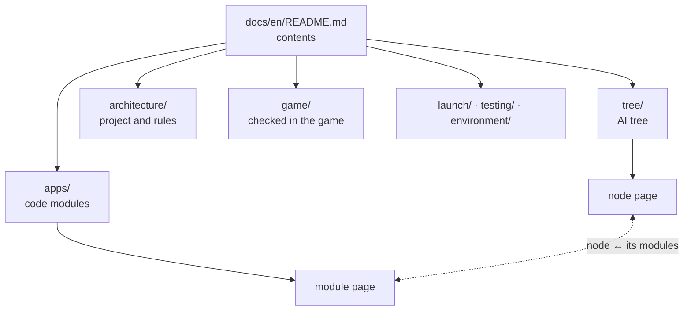

# How the documentation is built and kept

[← Back](README.md) · [Documentation](../README.md) › [Architecture](README.md) › Documentation · [Русский](../../ru/architecture/documentation.md)

Rules (user's decision 28.09.2026), checked by `tests/docs/`. Aim: easy to read —
short pages, pictures instead of walls of text, always clear where you are and how to go back.

## Structure



- **Two languages mirror each other**: `docs/ru/…` and `docs/en/…` with the same paths.
  Reference pages exist in both; working drafts (AI design, battle theory, strategies,
  tasks, research) are Russian only, by a list in the test.
- **Nesting is folders**; every folder has a hub `README.md` listing its pages.
- **The AI tree** (`tree/`) is the main map; **modules** (`apps/`) describe the code;
  a node page links to its modules and back.

## Navigation line

The third line of every page:

```text
[← Back](parent) · [Documentation](root) › [Section](hub) › Page · [Русский](mirror)
```

"← Back" goes to the parent hub, like a browser's back button but always to the same
place; breadcrumbs show the nesting; the last link is the other language.

## Pictures and examples

| To show | With | Rule |
|---|---|---|
| The tree, levels | Mermaid `flowchart BT` (bottom up) | phase — solid arrow up; branch — dashed line and frame |
| How a node works | Mermaid `flowchart LR` / `TB` | diamond — condition, box — action |
| Order in time | Mermaid `sequenceDiagram` | — |
| A real battle, formation, map | PNG from the simulator or the game in `docs/assets/<section>/` | caption: which run |
| Numbers | a table | units in the header |

Status colours on every diagram: green — done, yellow — started, grey — planned;
a thick frame — "you are here". Every node and module page has at least one diagram and one example.

## Generated or written

Everything that can come from the code is **generated** (between
`<!-- generated:NAME -->` and `<!-- /generated -->`, never edited by hand):
`tree:diagram`, `tree:table`, `tree:here:<node>`, `tree:card:<node>`, `tree:modules`,
`docs:index`. Update: `python -m tools.docs.tree_doc`. Written by hand: "How it
works" (a diagram), "Example" (numbers or a picture), "Checks".

## What the test checks (`tests/docs/`)

- every page has its mirror (except the Russian-only list); every page has "← Back" to an existing file;
- every relative link and picture exists; generated blocks match the code;
- every module has a page in both languages; every tree node has a page with its card and place; a node's module page links to the node.
