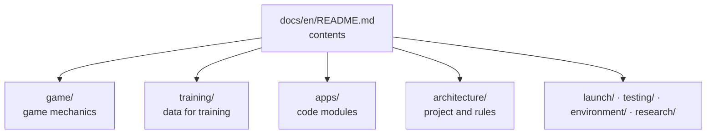
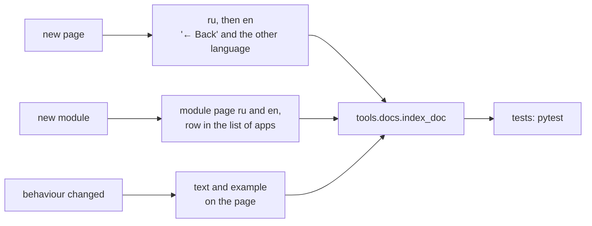

# How the documentation is built and kept

[← Back](README.md) · [Documentation](../README.md) › [Architecture](README.md) › Documentation · [Русский](../../ru/architecture/documentation.md)

Rules (user's decision 28.09.2026), checked by `tests/docs/`. Aim: easy to read —
short pages, plain language, diagrams and tables instead of walls of text, always clear
where you are and how to go back.

## Structure



- **Two languages mirror each other**: `docs/ru/…` and `docs/en/…` with the same paths.
  The Russian page is the master: write it first, then the English one. Only the research
  archive `research/` is Russian only (a list in the test).
- **Nesting is folders**; every folder has a hub `README.md` listing its pages. A section
  inside a section is a subfolder with its own hub.
- **Links only to what exists.** A link to a removed page or picture fails the test.

## Navigation line

The third line of every page (after the title):

```text
[← Back](parent) · [Documentation](root) › [Section](hub) › Page · [Русский](mirror)
```

- **"← Back"** goes to the parent — the folder's hub (for a hub, the hub one level up),
  like a browser's back button but always to the same place.
- **Breadcrumbs** `›` show the nesting; the last one is the current page, not a link.
- **Language** — a link to the same page in the other language.

## Pictures and examples

| To show | With | Rule |
|---|---|---|
| Steps, conditions, who calls what | Mermaid `flowchart LR` / `TB` | diamond — condition, box — action |
| Order in time (game ↔ script) | Mermaid `sequenceDiagram` | — |
| A real battle, formation, map | PNG from the game in `docs/assets/<section>/` or next to the research | caption: where from, which run |
| Numbers | a table | units in the header |

A module page is short: what, why, how; an example (numbers from a run, a call or a
picture). Analysis output (json, csv) does not go into Git — only pictures and text.

## Generated or written

The list of pages in a hub is **generated** from the pages' titles and first
sentences, otherwise it goes stale:

| Block | From | Where |
|---|---|---|
| `docs:index` — the folder's pages and subfolders | each page's title and first sentence | hubs `README.md` |

The block sits between `<!-- generated:docs:index -->` and `<!-- /generated -->` and is
never edited by hand. Update: `python -m tools.docs.index_doc`. Everything else is written by hand.

Hubs without such a block are written wholly by hand, because they need their
own order and notes: the root `docs/<language>/README.md`, `game/map/`,
`game/units/catalog/`, `research/` and `training/`. Their links to pages and
section hubs are set by hand and checked with every new page.

## When to update what



## What the test checks (`tests/docs/`)

- every page has its mirror in the other language (except `research/`);
- every page has "← Back", and it leads to an existing file;
- every relative link and picture exists;
- generated blocks match the pages;
- every `src/apps` module has a page in both languages.
