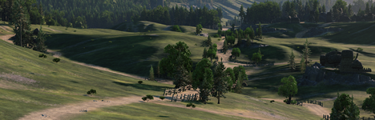
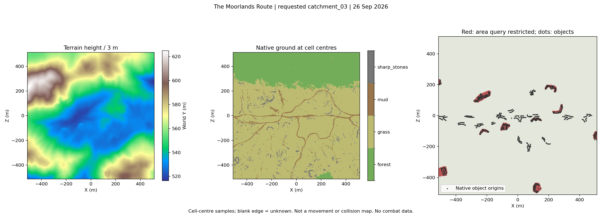
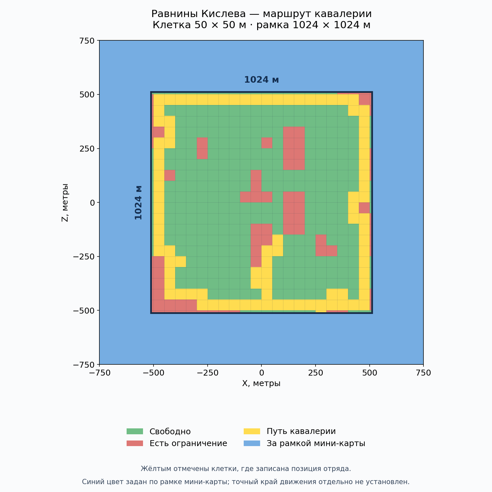

# Visual atlas

[← Back](README.md) · [Game knowledge](README.md) · [Русский](../../ru/game/atlas.md)

## Maps

### Moorlands Route

Details: [Moorlands Route](maps/moorlands-route.md).

### Kislev heights

Method and limits: [heights](map/heights.md).

### Grid and route

Details: [boundaries](map/boundaries.md), [sampling](map/sampling.md),
[Kislev plains (Russian)](../../ru/research/map-data/kislev-plains-check.md).

### Water, passages and bridges

Details: [water and ground](map/water-ground.md), [passages](map/passages.md),
[bridges](map/bridges.md).

### Forest and objects

Details: [vegetation](map/vegetation.md), [objects](map/objects.md).

### Slopes

Details: [slopes](map/slopes.md).

## Units

### State and morale

Details: [indicators](units/state-sensors.md), [fields](units/state-fields.md),
[states](units/states.md).

### Commands and pursuit

Details: [commands](units/commands.md), [evidence](units/evidence.md).

### Formations

Details: [deployment](units/deployment.md), [missile range](units/missile-range.md).
