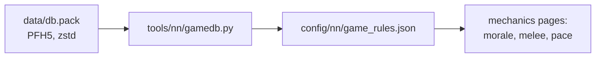

# The game's database

[← Back](README.md) · [Documentation](../README.md) › [Game knowledge](README.md) › The game's database · [Русский](../../ru/game/database.md)

The battle rules live in the game's database: morale, fatigue, hit chance,
leadership, arrows. We read them straight from the game's files so we do not
have to guess numbers.

**Formulas are in the engine, numbers are in the database.** For example, the
database has 35, 8 and 90; that hit chance = 35 + attack − defence within
8–90 % is how the engine uses these numbers. So every formula is checked against
battle recordings ([morale](units/morale.md), [melee](units/melee.md)).

## Where it is

- File: `<game folder>/data/db.pack`.
- Format: PFH5 — the same as our packs ([build](../launch/build.md)), but the
  entries are zstd-compressed: 4 bytes of uncompressed size, then a zstd frame.
- Needs Python 3.14 or newer (the `compression.zstd` module).

## How to read it

```bash
py -3.14 -m tools.nn.gamedb
```

`tools/nn/gamedb.py` finds the game through `config/local.json`, reads the
tables it needs and writes `config/nn/game_rules.json`. Checked on v9.0.1,
build 50381 (30.09.2026).



## Which tables

| Table | What it holds | In `game_rules.json` |
|---|---|---|
| `_kv_rules_tables` | battle rules: hit chance, a blow every 4 s, armour, flank and rear, charge, shields, arrows, difficulty | `battle`, 276 keys |
| `_kv_morale_tables` | morale: the lord's aura, his death, casualties, flanks, fire, combat, thresholds, timers, difficulty | `morale`, 131 keys |
| `_kv_fatigue_tables` | fatigue: what each activity adds, thresholds | `fatigue`, 29 keys |
| `land_units_tables` | attack, defence and leadership of the arena's units | `units`, 3 units |
| `unit_experience_bonuses_tables` | what a rank adds: leadership, attack, defence, accuracy, reload | `experience_bonus`, 5 rows |
| `unit_experience_thresholds_tables` | experience for ranks 1–9 | `experience_levels`, 9 rows |
| `projectiles_tables`, `missile_weapons_tables` | the unit's missile weapon and its projectile: range, damage, reload | no — the archers' arrow was read separately on 30.09.2026 ([missile damage](units/missile-damage.md)) |

`_source` in the file is the path to the `db.pack` that was read.

## How the tables are laid out

- **Key–value** (`_kv_*`): a header, the row count (4 bytes), then rows of
  "name (2-byte length + UTF-8) — float32 number".
- **`land_units_tables`**: after the unit's key, a byte flag and two strings
  (skeleton, blood kind) come three int32 — attack, defence, leadership.
- **`unit_experience_bonuses_tables`**: a stat, an int32 flag and two float32
  `a`, `b` per rank. For leadership `b` = 1.06 — what one rank adds.
- **`unit_experience_thresholds_tables`**: the level name and an int32 —
  experience.

## Not checked

- What the keys mean that did not show up in battle recordings (there are many).
- Tables of other factions and units: `gamedb.py` takes only the arena's three
  units.
