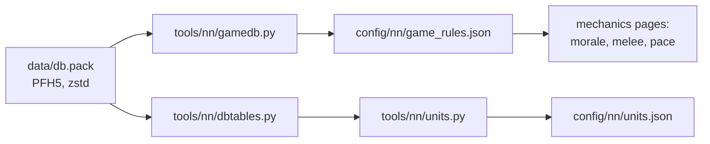

# The game's database

[← Back](README.md) · [Documentation](../README.md) › [Game knowledge](README.md) › The game's database · [Русский](../../ru/game/database.md)

The battle rules live in the game's database: morale, fatigue, hit chance,
leadership, arrows. We read them straight from the game's files so we do not
have to guess numbers.

**Formulas are in the engine, numbers are in the database.** For example, the
database has 35, 8 and 90; that hit chance = 35 + attack − defence within
8–90 % is how the engine uses these numbers. So every formula is checked against
battle recordings ([morale](units/morale.md), [melee](units/melee.md)).

## Where it is

- File: `<game folder>/data/db.pack`.
- Format: PFH5 — the same as our packs ([build](../launch/build.md)), but the
  entries are zstd-compressed: 4 bytes of uncompressed size, then a zstd frame.
- Needs Python 3.14 or newer (the `compression.zstd` module).

## How to read it

```bash
py -3.14 -m tools.nn.gamedb     # rules → config/nn/game_rules.json
py -3.14 -m tools.nn.units      # units → config/nn/units.json
```

Both find the game through `config/local.json`. `tools/nn/gamedb.py` writes the
battle rules, `tools/nn/units.py` the [unit passports](../training/units.md).
The unit tables are read by `tools/nn/dbtables.py`. Checked on v9.0.1, build
50381 (30.09.2026).



## Which tables

| Table | What it holds | Where to |
|---|---|---|
| `_kv_rules_tables` | battle rules: hit chance, a blow every 4 s, armour, flank and rear, charge, shields, arrows, difficulty | `game_rules.json`: `battle`, 276 keys |
| `_kv_morale_tables` | morale: the lord's aura, his death, casualties, flanks, fire, combat, thresholds, timers, difficulty | `game_rules.json`: `morale`, 131 keys |
| `_kv_fatigue_tables` | fatigue: what each activity adds, thresholds | `game_rules.json`: `fatigue`, 29 keys |
| `unit_experience_bonuses_tables` | what a rank adds: leadership, attack, defence, accuracy, reload | `game_rules.json`: `experience_bonus`, 5 rows |
| `unit_experience_thresholds_tables` | experience for ranks 1–9 | `game_rules.json`: `experience_levels`, 9 rows |
| `main_units_tables` | the unit as it is recruited: men, cost, link to `land_units` | `units.json` |
| `land_units_tables` | the unit in battle: attack, defence, leadership, charge, armour, shield, weapons, ammo, figure | `units.json`; attack, defence and leadership of the arena's three units also in `game_rules.json` (`units`) |
| `battle_entities_tables` | a man's figure: health, mass, speeds, height, size class | `units.json` |
| `melee_weapons_tables` | melee weapon: damage, armour-piercing damage, bonuses, hitting several | `units.json` |
| `missile_weapons_tables` | missile weapon → its projectile | `units.json` |
| `projectiles_tables` | projectile: range, damage, reload, flight | `units.json` |
| `unit_armour_types_tables` | armour: key → number | `units.json` |
| `unit_shield_types_tables` | shield: key → chance to block an arrow | `units.json` |
| `unit_spacings_tables` | formation template (`land_units.spacing`): spacing across the front and between ranks, scatter, chaotic formation | `units.json` (`spacing`) |
| `unit_attributes_to_groups_junctions_tables` | the unit's attributes (`expendable`, `encourages`…) | `units.json` |
| `land_units_to_unit_abilites_junctions_tables` | the unit's abilities (keys) | `units.json` |

`_source` in the files is the path to the `db.pack` that was read.

## How the tables are laid out

- **Key–value** (`_kv_*`): a header, the row count (4 bytes), then rows of
  "name (2-byte length + UTF-8) — float32 number".
- **The other tables**: a header with a version number, one byte, the row count
  (4 bytes), then the rows one after another. A row is always the same sequence
  of fields: int32, float32, flag (1 byte), text (2-byte length + UTF-8) and
  optional text (a flag, then text when the flag is 1). There is no schema
  inside: we worked out the order and types of the fields ourselves.
- The worked-out layouts are `LAYOUTS` in `tools/nn/dbtables.py`. Each reads
  the **whole** table to the last byte; every text is readable text and every
  flag is 0 or 1. If the game updates a table and a layout no longer fits,
  reading stops with an error (version, bytes left over or "not text") instead
  of reading shifted numbers.

| Table | Version | Fields | Rows |
|---|---:|---:|---:|
| `land_units` | 54 | 60 | 2679 |
| `main_units` | 7 | 45 | 2802 |
| `battle_entities` | 39 | 58 | 1339 |
| `melee_weapons` | 25 | 20 | 1280 |
| `missile_weapons` | 12 | 6 | 863 |
| `projectiles` | 53 | 58 | 1093 |
| `unit_armour_types` | 6 | 4 | 106 |
| `unit_shield_types` | 6 | 5 | 24 |
| `unit_spacings` | 7 | 19 | 164 |
| `unit_attributes_to_groups_junctions` | 2 | 3 | 8559 |
| `land_units_to_unit_abilites_junctions` | 1 | 3 | 9686 |

- **Field names.** `land_units` and `main_units` have the game's own names: all
  60 and 45 columns of the three Empire units equal the decode with a schema from
  26.09.2026 (local archive `research/evidence/units/empire-20260926`). The old
  `land_units` read "three numbers after the key and two strings" is replaced by
  reading the whole table.
- In the other tables we gave the names. Checked against unit cards in battle:
  health, mass, walk and run (`battle_entities`), damage and armour-piercing damage
  (`melee_weapons`, `projectiles`), a projectile's range and reload, the armour
  number ([unit passports](../training/units.md#checked-against-the-cards)).
- Inferred from the values, not checked in battle: acceleration, deceleration,
  charge speed, radius, height, size class (`battle_entities`); bonuses against
  large and infantry, time between blows, hitting several (`melee_weapons`); the
  projectile's flight (`projectiles`); the shield's chance (`unit_shield_types`); the close formation's spacing (`unit_spacings`: nine numbers come
  before the key - that way the table reads to its last byte; the first three are the spacing across the front h,
  the scatter and the spacing between ranks v; checked on the roster: the game's front (files - 1) x h within ~1 %,
  files = floor(width / h)).
  Why: [what we inferred](../training/units.md#what-we-inferred).
- Inferred from the values and checked by the melee probe (`build/meleetests`): the charge distances
  `battle_entities` `charge_distance_commence_run` / `_adopt_charge_pose` / `_pick_target` (30 / 25 / 25 m for
  infantry, 35 / 30 / 30 for lords; under an attack order a unit covers the last 30 m at its charge speed); an
  ability's initial recharge `unit_special_abilities.initial_recharge` (0 for the lords' active abilities, 3 s
  Strength of the Penitent, 5 s Single Entity; Gate of Khorne 60 = fandom).
- Fields whose meaning we do not know are named by number: `f12`, `f15`…
- **`unit_experience_bonuses_tables`**: a stat, an int32 flag and two float32
  `a`, `b` per rank. For leadership `b` = 1.06 — what one rank adds.
- **`unit_experience_thresholds_tables`**: the level name and an int32 —
  experience.

## Not checked

- What the keys mean that did not show up in battle recordings (there are many).
- The columns we named from their values (above) and the `f<number>` columns.
- A projectile bonus against large and infantry: no column found
  ([unit passports](../training/units.md#what-is-not-there-and-why)).
- What abilities and attributes do: the `special_ability_*` tables are not decoded.
