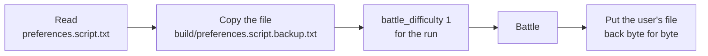

# Battle difficulty

[← Back](README.md) · [Documentation](../README.md) › [Game knowledge](README.md) › Battle difficulty · [Русский](../../ru/game/difficulty.md)

**All battles against the game's AI are at Normal difficulty** (the user's
decision, 30.09.2026). At a higher difficulty the game's AI gets bonuses, and
the battle is no longer fair.

## Where it is set

The file `%APPDATA%\The Creative Assembly\Warhammer3\scripts\preferences.script.txt`,
line `battle_difficulty`:

| Value | 0 | 1 | 2 | 3 | 4 |
|---|---|---|---|---|---|
| Difficulty | easy | **normal** | hard | very hard | legendary |

The user's own game is set to 3, Very Hard.

## What a higher difficulty gives the AI

Numbers from the game's database ([the game's database](database.md),
`config/nn/game_rules.json`, 30.09.2026):

| Table | Key | Value |
|---|---|---|
| `_kv_morale_tables` | `difficulty_modifier_player_easy` / `_normal` / `_hard` / `_very_hard` | +4 / 0 / −2 / −4 morale points for the player |
| `_kv_morale_tables` | `difficulty_modifier_ai_extra_multiplier_high` / `_low` | 0.8 / 0.4 |
| `_kv_rules_tables` | `difficulty_mod_ai_reload_extra_multiplier_high` / `_low` | 2.0 / 1.0 — the AI reloads faster |
| `_kv_rules_tables` | `difficulty_mod_ai_normal_multiplier` / `_hard_multiplier` | 0.5 / 0.75 |
| `_kv_rules_tables` | `difficulty_mod_ai_min_stats_range` / `_max_stats_range` | 0.9 / 1.1 |

The database does not say how the engine applies the multipliers (formulas are
in the engine).

**What the battle recordings show.** The starting `MoralePercent` does not
tell the difficulty. The arena recordings of 30.09.2026 (18 battles at Normal,
19 at Very Hard), 2 s after the start, are the same at both difficulties:

| Unit | Ours | The game's AI |
|---|---|---|
| Lord | 1.057 | 1.057 |
| Spearmen | 1.067 | 1.067, 1.1 in some units |
| Archers | 1.08 | usually 1.12 |

The difference between the sides over the first 14 s is also the same at both
difficulties. How the difficulty bonuses change a battle is not yet visible in the
recordings ([morale](units/morale.md)).

## How the launcher keeps it

- The launcher sets `battle_difficulty 1` only for its own run and puts the
  user's file back byte for byte after the battle.
- If a run is interrupted, the copy stays in `build/preferences.script.backup.txt`,
  and the next launch puts it back first.
- The run's `launch.json` keeps `battle_difficulty` and `user_battle_difficulty`,
  `status.json` keeps `preferences_restored`.

More in [running a battle](../launch/run.md#fair-difficulty).

## How to check fairness in the data

- The only check is the field `battle_difficulty` = 1 in the run's
  `launch.json` (`tools.nn.gamedata.difficulty()`). Runs without this field
  were before the rule, at Very Hard (3). The starting morale cannot tell a fair
  battle from an unfair one (see above).
- The arena loader takes only fair battles: `tools.nn.gamedata.runs()`
  (`fair_only=True` by default; [data for training](../training/README.md)).

## Who wins

Arena battles on 30.09.2026 (`build/nn-arena/runs`, `python -m tools.nn.gamedata`):
CA's planner for our side against the game's AI, the same armies
([the game's own AI](game-ai.md)). "Time out" is our limit of 900 s of game
time (`--timeout 900`), no winner.

| Difficulty | We attack, the game's AI defends | We defend, the game's AI attacks |
|---|---|---|
| Normal (18 battles) | 10 battles: the game's AI won 9, time out 1 | 8 battles: we won 6, the game's AI 1, time out 1 |
| Very Hard (19 battles) | 10 battles: the game's AI won 9, we won 1 | 9 battles: the game's AI won 7, we won 2 |

At Normal **the defender almost always wins**. On Very Hard the game's AI wins
when attacking too.
