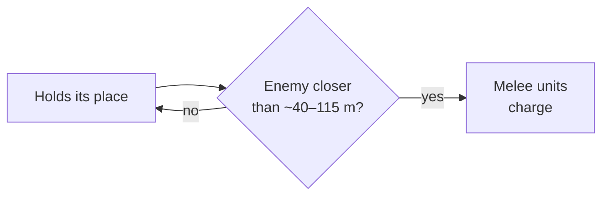

# The game's own battle AI

[← Back](README.md) · [Documentation](../README.md) › [Game knowledge](README.md) › The game's own AI · [Русский](../../ru/game/game-ai.md)

How the game's own AI fights. Almost all observations come from arena battles on
30.09.2026: the first 13 fair battles at Normal difficulty, the same armies (a
lord, 4 spearmen, 2 archers of the Empire), an empty flat map
([Crossroads flat](maps/crossroads-flat.md)). The defender turning to face the
attacker, how the defence deploys and how it meets an approach come from
battles on 27–28.09.2026 ([below](#the-games-ai-defending-turns-to-face-us));
what CA themselves told about their AI is [at the end](#what-ca-published-about-their-ai).

## Two AIs

- **The game's AI** — the engine's battle AI. It leads the side that no script
  controls (side 2 in the arena).
- **CA's planner** — `script_ai_planner` from CA's script library
  (`lib_battle_script_ai_planner.lua`). It hands units to the same engine AI, but
  with a task: "attack the enemy army" or "defend a place". We lead our side
  with it in recordings ([orders](../apps/orders.md)).

Who attacks and who defends is set by the battle file: the defender is the
alliance that wins when time runs out ([attacker and defender](battle-roles.md)).

## The game's AI defending

It holds its place; its melee units charge when an enemy comes within about
40–115 m.

## The game's AI defending turns to face us

Four battles on 28.09.2026 on [The Moorlands Route](maps/moorlands-route.md),
runs `20260928-145558`, `-150511`, `-150819`, `-151022`, ×20. The game's AI
defends (a lord, 8 spearmen, 6 archers of the Empire); our army (a lord,
6 spearmen, 8 archers) approaches it. Difficulty Very Hard: the battles were
before the [fair difficulty](difficulty.md) rule. The enemy's units were
recorded every 2 s.

| What | Number |
|---|---|
| At deployment | it faces 238°, while we stand at 90° |
| A minute later, as the approach begins | it already faces our army: 3.6° off at 556 m |
| When we are 180–270 m away (between army centres) | it turns towards us in jerks of 10–36 s, 6–15° per jerk |
| Between jerks | it stands for 32–174 s |
| Its army centre per jerk | moves only 0.1–3.4 m: it turns in place |
| The whole turn over a battle | 278° → 318°, 40°, every time towards us |
| A battle where our army did not move (`20260928-151022`) | it did not turn once in 250 s |

So when defending, the game's AI holds its place but turns its line towards the
attacker while the attacker moves. Where it faces at deployment says nothing
about the battle: a minute later it already faces us.

## How the game's AI deploys and meets an approach in defence

`enemy-layout` runs on 27–28.09.2026: six armies of 5 to 20 units; after
deployment the game's AI is told to "defend the place where it stands"
(`script_ai_planner:defend_position`, radius 80 m). The reaction to an approach
comes from one battle on 28.09.2026 on a flat strip. Difficulty Very Hard: the
battles were before the [fair difficulty](difficulty.md) rule. Details: the
[enemy-layout analysis](../../../research/analysis/enemy-layout/README.md) (in Russian).

| What | Number |
|---|---|
| Formation | lines: spearmen in front, archers in the second line; units of one line side by side, 2–6 m apart |
| Between the lines | about 20 m (20.2–21.5 m in all six armies) |
| After the "defend" task | the army steps forward about 35 m and stands |
| Our front came within about 101 m (our archers had not fired yet) | its whole army stepped forward 15–28 m in ≈ 10 s (archers 4–21 m) and stood |
| 30–60 s later | two spearmen units charged from about 110 m |

A note of 29.09.2026 about earlier battles at Very Hard (it does not name the
runs; the note is in the former document `docs/ru/architecture/battle-theory.md`,
which can be read in the Git history, commit `242c3b1`): the defenders' melee
units charged one unit at a time, spread over up to 50 s.

## The game's AI attacking

- Runs forward with the whole army at once.
- Each spearmen unit takes the enemy unit opposite.
- The lord goes for the enemy lord.
- Archers stop at about 130 m (their range) and shoot.
- Leads its units back into battle after they rally.
- Under arrows its units stand idle only 0–3 % of the time they are shot at.

## The game AI's lord in a duel

Is a lord under the game's AI stronger than a plain lord? No. Measured 06.10.2026, Normal difficulty, the
True Sight mod ([lord_ai](../apps/entries.md#lord_ai), `build/lord-ai/`): two lords of one type alone on
the field, ours under one attack order with no abilities, theirs under the game's AI (6 battles a type)
or the same order (the control, 4 battles a type). The rate: a lord's health lost a second while both
are in melee and neither routs, %/s.

| | Empire General | Skaven Warlord |
|---|---|---|
| Theirs on ours: AI / control | 0.71 / 0.70 — **1.02** [0.83, 1.25] | 0.26 / 0.34 — **0.75** [0.57, 0.99] |
| First 30 s of the duel: AI / control | 0.69 / 0.75 — 0.93 [0.53, 1.96] | 0.35 / 0.43 — 0.81 [0.41, 1.66] |
| Ours on theirs: AI / control | 0.60 / 0.63 — 0.94 | 0.28 / 0.23 — 1.22 |
| Duel seconds: AI / control | 627 / 454 | 1449 / 868 |
| The AI's abilities | Foe-Seeker only (speed x1.25): 0-1 s after contact, again as soon as ready (85-86 s later); Stand Your Ground never | Verminous Valour only (speed x1.25, +8 morale): 0-1 s after contact, again every 77-78 s; Deadly Onslaught and Rally never |

In brackets the 95 % bootstrap interval over battles. Both types together: 0.87 [0.73, 1.04].

- **The same stats.** The AI lord's card (CCO `UnitDetailsContext.StatList`) at the start equals ours to
  the number: rank 1, experience 0, health 4068; the General armour 85, attack 55, defence 45, damage 430,
  charge 40, morale 70; the Warlord 90, 50, 55, 400, 35, 60. Normal difficulty does not change the AI's
  stats. Later the card changes alike for the AI and the control (fatigue, morale, Hold the Line +5
  defence). The CCO card refreshes about every 40 s, so a short buff cannot be caught on it - abilities
  show in the active effects (`nn_effects`); `can_perform_special_ability` stays true on an AI unit.
- **The AI's abilities are speed only.** They add no damage, and the rate on ours with them on is the same
  (the General 0.70 with Foe-Seeker, the Warlord 0.33 with Valour).
- **Behaviour.** The AI Warlord leaves melee and comes back more often (5.2 times a battle, the control
  1.5) and in the end hits less. The AI does not go round to our lord's rear (share of seconds with the
  rear threatened <= 0.01).

**What it means for the simulator.** The extra x1.4 of the AI lord's damage on the network's lord in
the gate battles is not an AI advantage. The same duel in the simulator (a replay of these 20 battles,
8 copies each) gave General v General 0.38-0.40 %/s both ways against 0.60-0.71 in the game
(x0.56-0.63), Warlord v Warlord 0.33-0.36 against 0.23-0.34. The cause is the hit chance: the blows,
counted as health drops, follow CA's formula exactly (the General hits 41 %, the Warlord 19 %), while the
simulator gave both a flat ~35 %. Now a lord against a lord hits by the formula
([simulator](../training/simulator.md#lords)): General x0.8 of the game, Warlord x1.2.

**When the AI fires its lord's abilities in whole battles** (139 gate battles, 926 uses,
`build/lordduel/abilities/`): Foe Seeker and Verminous Valour in melee (at contact or the moment they are
ready again; some a few seconds before contact); Stand Your Ground in melee with a friendly unit within
35 m; Rally in melee next to two friends (the loosest rule: 69 of 157 uses); Deadly Onslaught never. The
lord's health does not matter. The simulator's scripted opponents now fire them the same way
([simulator](../training/simulator.md#lords)).

## CA's planner weaknesses and our fixes

Found in arena recordings, fixed in `apps/orders/planner_adapter.lua`
([orders](../apps/orders.md)):

| Weakness | What happened | Fix |
|---|---|---|
| A unit routs and rallies — the planner no longer leads it | stood idle to the end of the battle | `check_rallies()`: take the unit out of the planner, put it back and repeat the last order |
| A unit stands idle under arrows: not moving, no target, not in melee, losing health | 15–75 % of the time under fire (the game's AI 0–3 %) | `check_idle()`: after 6 s back into the planner; if it again stands 6 s under fire, but no sooner than 15 s after the first kick, a planner of its own attacking the nearest enemy |

## Who wins

At Normal the defender almost always wins — whether the game's AI or CA's
planner defends. Numbers: [battle difficulty](difficulty.md#who-wins).

## What CA published about their AI

Not our measurements: the developers' public talks and articles (retold from
the former AI design document `docs/ru/architecture/ai-design.md`, commit `242c3b1`). Useful for training a network: what the
game's AI already does and what CA themselves warn about.

- **Levels.** Total War's AI is split into a unit level (keep formation and
  position) and a battle level (group units, choose formations and targets);
  above them the army and the campaign.
- **Goal-oriented planning (GOAP)** in Empire: Total War (2009): the AI holds
  several goals at once (attack a unit and cover a flank), re-weighs them as the
  situation changes and returns to an interrupted goal after a distraction.
- **CA's lesson:** Empire's AI could be "paralysed by indecision" — goals fought
  each other and the AI dithered between them.
- **A learned model of a 1-on-1 combat outcome:** autoresolve uses it to count
  results, and the battle AI uses it to decide whether to engage or pull back
  (AIIDE).
- **Siege AI** in Total War: Warhammer (GDC 2016): a separate high-level AI with
  unit roles and duties and threat analysis for the defender.

Sources:

- [The Road To War — The AI of Total War (Part 1)](https://www.gamedeveloper.com/programming/the-road-to-war-the-ai-of-total-war-part-1-)
- [Evolution of War — The AI of Total War (Part 2)](https://www.gamedeveloper.com/design/evolution-of-war-the-ai-of-total-war-part-2-)
- [Learning Combat Outcomes in Creative Assembly's Total War (AIIDE)](https://ojs.aaai.org/index.php/AIIDE/article/view/36830)
- [Siege Battle AI in Total War: Warhammer (GDC 2016)](https://gdcvault.com/browse/gdc-16/play/1023363)

## Not checked

Other armies, maps with cover and heights, cavalry, artillery.
