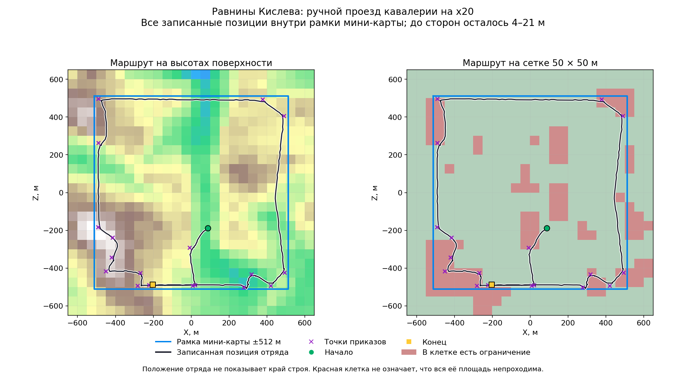

# Radar frame: how we recover the boundary candidate

[← Back](README.md) · [Map guide](README.md) · [Русский](../../../ru/game/map/boundaries.md)

The verified result is a **radar frame**, not a universal playable-area getter.
The game exposes a world-to-radar transformation:

```lua
local u, v = common.get_context_value(
    "BattleRadarPosition(ToVector4(100,0,0,0))")
```

It returns four separate numeric values; we use the first two. Radar corners have
U/V coordinates `(0,0)`, `(1,0)`, `(1,1)`, `(0,1)`. Outside points can return values
below zero or above one: the tested function does not simply clamp to the radar.

## Algorithm

1. Query world X/Z `(0,0)`, `(100,0)` and `(0,100)` with Y=0.
2. Derive the affine mapping `u=a*x+b*z+u0`, `v=c*x+d*z+v0`.
3. Invert its 2×2 matrix to obtain world coordinates of the four radar corners.
4. Query those corners again. Require agreement within `1e-5` in normalized radar coordinates.
5. Save bounds, dimensions, centre and validation results with the loaded scenario.

The module rejects singular transforms and rotated/mirrored orientations that we
have not tested. It supports the measured orientation: U grows with X, V decreases
with Z. This conservative check is not a claim that other orientations cannot exist.

## Measured frames

| Loaded landscape | X bounds, m | Z bounds, m | Size, m |
|---|---|---|---|
| Crossroads Flat | −768…768 | −800…736 | 1536 × 1536 |
| Kislev Plains test | −512…512 | −512…512 | 1024 × 1024 |

For Kislev: `u=0.5+x/1024`, `v=0.5-z/1024`. These constants describe that run;
**do not hardcode them as global map dimensions**. Crossroads is historical evidence;
the user chose to stop using it as the active test map.

The manual Kislev route approached all four sides. All 1088 recorded positions
were inside; closest distances to individual sides were 3.73–20.68 m. A formation
position is not its outer edge, and rejected clicks were not recorded. The route
is consistent with the frame but does not prove the exact movement limit.



The archived illustration uses Russian labels. Blue is the measured radar frame;
the dark line is the recorded route. It is supporting evidence, not unit logic.

Large-area `is_area_clear` probes, repeated terrain heights outside a central area,
and the size of our explicitly supplied deployment zones did **not** establish a
reliable boundary. The exported battle XML did not supply a usable `playable_area`
in these runs. Do not substitute those methods for the measured radar transform.

Sources: [CCO](https://chadvandy.github.io/tw_modding_resources/WH3/cco/documentation.html),
[common.get_context_value](https://chadvandy.github.io/tw_modding_resources/WH3/battle/common.html#function:common:get_context_value),
[saved experiments](evidence.md). No new internet-only capabilities are included here.
