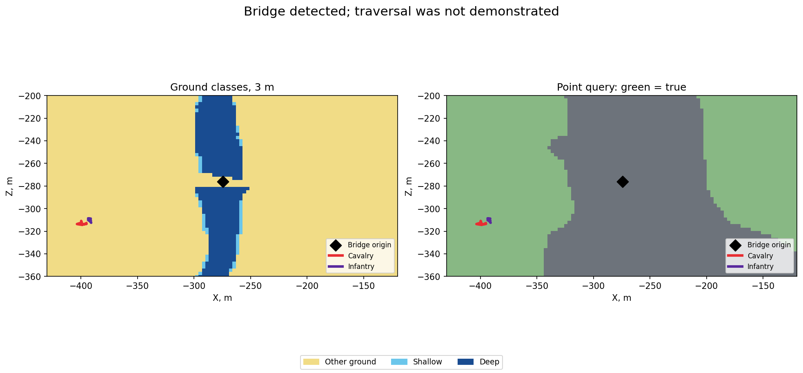

# Bridge identification and the height-layer check

[← Back](README.md) · [Map guide](README.md) · [Русский](../../../ru/game/map/bridges.md) · [Objects](objects.md) · [Verified fords](passages.md)

## Identify the object

On the Cathay farmland terrain at the explicitly requested tile position `(0.578125,0.5)`, the native list contained **2,696 objects**, including one `cth_bridge_110m_01` with category `bridge`. This was a `land_normal` battle with `IsSiege=false`; it was not a settlement test. The custom position is not proof of equivalence to a named default menu variant.

The bridge origin was approximately **X −274.438, Y 150.675, Z −276.252 m**. Its reported central Y was **139.601 m**. These are object transforms, not measured deck heights or bridge endpoints.

The separate CCO list contained one entry. Its `IsBridge=true`, category and position agreed with the native bridge record. Its name was localized UI text (`Мост`), not the stable native key. The other thousands of props were absent from this list.

The [object module](../../../../src/apps/map/) now exposes both lists:

```lua
local rows, next_index, done, total = objects.read_structure_contexts(common, 0, 64)
-- Zero-based CCO indices, independent of native building indices.
```

Each context row preserves `Name`, `CategoryType`, `IsBridge`, destruction flags, missile-weapon flag, `CanUpdateAbilities`, local/global effect text, ability count, and position X/Y/Z/W. Empty text and a zero count are retained as returned. Names/descriptions depend on game language; they are not numeric effect rules. The wrapper was compared live with direct calls, and native enumeration matched **2,696/2,696 records** in the same run.

`Validation` (local archive: `research/evidence/map/field-20260925/bridge-check/bridge-validation.json`) · `Raw events` (local archive: `research/evidence/map/field-20260925/bridge-check/tww3_bai_map_capture_events.jsonl.gz`) · `Scenario` (local archive: `research/evidence/map/field-20260925/bridge-check/map_probe.xml`)

## A detected bridge is not yet a verified crossing

At the bridge origin X/Z, `get_terrain_height` returned **113.147 m**, distinct from both object heights. A local 61 × 61 grid at 3 m spacing was queried three times: at each point's terrain height, at the bridge's central Y, and at its origin Y. That is **11,163 queries** per recorded property.

Across those layers, **none** of the ground classes, area-clearance answers or either unit's point-reachability answers changed. The origin remained `grass`, restricted, and unreachable for both tested units. This does not prove that all such APIs ignore Y in every situation; it establishes that changing Y did not recover a bridge-deck layer in this experiment.

Cavalry and infantry were then given a midpoint order and an opposite-bank order. **All four stages timed out after about 120 simulated seconds. No bridge traversal was demonstrated.** The opposite-bank query returned true, which was insufficient to establish a usable route from the teleported formation. The experiment did not isolate whether the limiting cause was this map placement, navigation setup, formation placement or another condition.

Use the bridge flag to annotate an object. Do not add a traversable connection, invent endpoints, infer capacity from `110m` in its key, or substitute object Y for a walkable surface. The three separately [verified fords](passages.md) remain the demonstrated bank-to-bank connections.



## Structure effects observed here

The bridge returned empty local/global effect text, `CanUpdateAbilities=false`, and zero special abilities. This verifies readable fields and an empty result for this object; it does not demonstrate an active aura or establish that no other field structure has one.

The `whole-map capture` (local archive: `research/evidence/map/field-20260925/bridge-navigation/summary.json`) and its `CSV` (local archive: `research/evidence/map/field-20260925/bridge-navigation/tww3_bai_map_capture_grid.csv.gz`) are separate from the local three-layer test. Keep their coordinate origins and sample sets distinct.
