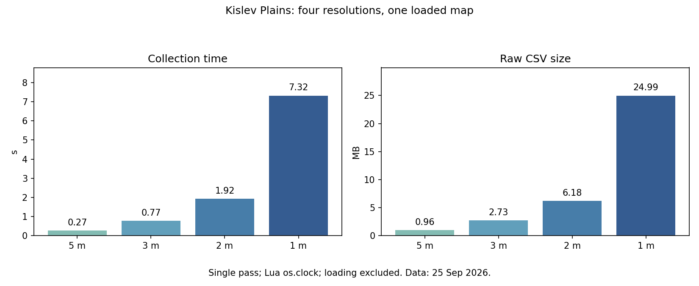

# Evidence, illustrations and scope of the result

[← Back](README.md) · [Map guide](README.md) · [Русский](../../../ru/game/map/evidence.md)

Measured on 25 September 2026 in the locally installed vanilla game, using our
isolated diagnostic packs. The earlier detailed reports are in Russian; their
raw CSV/JSONL/XML and hashes are shared evidence for both languages.

## Visual reference

The [forest and tree guide](vegetation.md) contains two separate 3 m matrices,
the resource-placement method and its measured limits. Green has different meanings
in those images: forest ground classification versus selected tree placement origins.

See the separate [height-map guide](heights.md) for the measured 1 m height map,
numeric matrix layout and offline reproduction. Its colours represent world Y,
not the area-query flags in the pictures below.

The simple 50 m map below uses green for a positive area query, red for a negative
one, blue outside the measured radar frame and yellow for the recorded route.
Yellow overrides the base colour and is not a measured formation footprint.

[Four resolutions](../../../../research/evidence/map-data/kislev-scales-evidence/comparison.png) ·
[Same enlarged area](../../../../research/evidence/map-data/kislev-scales-evidence/comparison-zoom.png) ·
Full maps: [5 m](../../../../research/evidence/map-data/kislev-scales-evidence/route-5m.png),
[3 m](../../../../research/evidence/map-data/kislev-scales-evidence/route-3m.png),
[2 m](../../../../research/evidence/map-data/kislev-scales-evidence/route-2m.png),
[1 m](../../../../research/evidence/map-data/kislev-scales-evidence/route-1m.png).

These plots come from the original four-resolution experiment. Do not apply its
times to a different runner or treat the selected examples as performance guarantees.

## Evidence index

| Verified observation | Primary saved evidence |
|---|---|
| Verified bridge object; traversal not confirmed | [Bridge check](bridges.md), `raw validation` (local archive: `research/evidence/map/field-20260925/bridge-check/bridge-validation.json`) |
| Complete feature runner matches 116,964 rows and 2,696 objects | `Validation` (local archive: `research/evidence/map/field-20260925/feature-runner/validation.json`) |
| Verified bridge object; traversal not confirmed | [Bridge check](bridges.md), `raw validation` (local archive: `research/evidence/map/field-20260925/bridge-check/bridge-validation.json`) |
| Complete feature runner matches 116,964 rows and 2,696 objects | `Validation` (local archive: `research/evidence/map/field-20260925/feature-runner/validation.json`) |
| Shallow/deep water and complete two-unit reachability on Cathay | [Water guide](water-ground.md), `raw grid` (local archive: `research/evidence/map/field-20260925/cathay-navigation/tww3_bai_map_capture_grid.csv.gz`) |
| Three ford candidates crossed by two units | `Crossing validation` (local archive: `research/evidence/map/field-20260925/cathay-crossings/summary.json`), [passage method](passages.md) |
| Native objects and reachability modules agree with direct calls | `Live comparison` (local archive: `research/evidence/map/field-20260925/module-validation/validation.json`), `all field evidence hashes` (local archive: `research/evidence/map/field-20260925/hashes.json`) |
| Offline slope and neighbour-height matrices from Kislev samples | `Summary` (local archive: `research/evidence/map/slopes-kislev-20260925/summary.json`), `analytic checks` (local archive: `research/evidence/map/slopes-kislev-20260925/validation.json`) |
| Kislev 3 m forest mask and 5,168 resource tree placements checked against terrain heights | `Summary` (local archive: `research/evidence/map/forest-trees-20260925/summary.json`), [matrices](vegetation.md), `hashes` (local archive: `research/evidence/map/forest-trees-20260925/hashes.json`), `cleanup` (local archive: `research/evidence/map/forest-trees-20260925/cleanup.json`) |
| Crossroads radar frame 1536 × 1536 m | `Summary and 30 points` (local archive: `research/evidence/map-data/crossroads-radar-evidence/summary.json`) |
| Kislev radar frame 1024 × 1024 m and 900-cell surface grid | `Summary` (local archive: `research/evidence/map-data/kislev-plains-evidence/summary.json`), `CSV` (local archive: `research/evidence/map-data/kislev-plains-evidence/grid.csv`) |
| Manual route consistent with the frame, not an exact edge proof | `Route summary` (local archive: `research/evidence/map-data/kislev-plains-evidence/path-summary.json`) |
| Four fine grid resolutions, runtime, sizes and differences | `Summary` (local archive: `research/evidence/map-data/kislev-scales-evidence/summary.json`), `events` (local archive: `research/evidence/map-data/kislev-scales-evidence/tww3_bai_kislev_scales_events.jsonl`) |
| Extracted module matches all 42,025 baseline cells at 5 m | `Comparison` (local archive: `research/evidence/map/module-check-20260925/comparison.json`), `source hashes` (local archive: `research/evidence/map/module-check-20260925/manifest.json`), `cleanup` (local archive: `research/evidence/map/module-check-20260925/cleanup.json`) |

Fine grid raw evidence: gzip CSV `5 m` (local archive: `research/evidence/map-data/kislev-scales-evidence/grid-5m.csv.gz`),
`3 m` (local archive: `research/evidence/map-data/kislev-scales-evidence/grid-3m.csv.gz`),
`2 m` (local archive: `research/evidence/map-data/kislev-scales-evidence/grid-2m.csv.gz`),
`1 m` (local archive: `research/evidence/map-data/kislev-scales-evidence/grid-1m.csv.gz`).
Fields: `ix,iz,height,clear,ground_id`. Ground IDs are resolved through that run's
summary; origin is (−512,−512), step is specified by the file name and events.
The extracted capture tool instead writes explicit X/Z and ground strings.

## What remains unproven

- Exact universal playable/movement boundaries and behavior on other map types.
- A complete terrain mesh, obstacle shapes, object inventory or navigation mesh.
- Why an individual area query fails; reachability or clearance for a moving formation.
- Native minimum terrain resolution, airborne navigation and stacked surfaces.
- Reuse across different catchments, upgrades, environmental conditions or game versions.

The original Kislev input requested `catchment_04`; the exported Kislev XML contains tile position
`(0.5625,0.4375)` and does not identify the applied catchment by name. Our deployment
zones and lighting were specified by the test. The results describe the loaded
scenario, not proven equivalence with every default menu setting for that map.

Do not identify maps solely by a display name or assume cached data remains valid.
Preserve input and exported XML, module/pack hashes, frame, grid settings, raw
measurements, timestamps and game conditions. The 900-point match was a useful
check for this repeated test, not a universal cache-validation algorithm.
