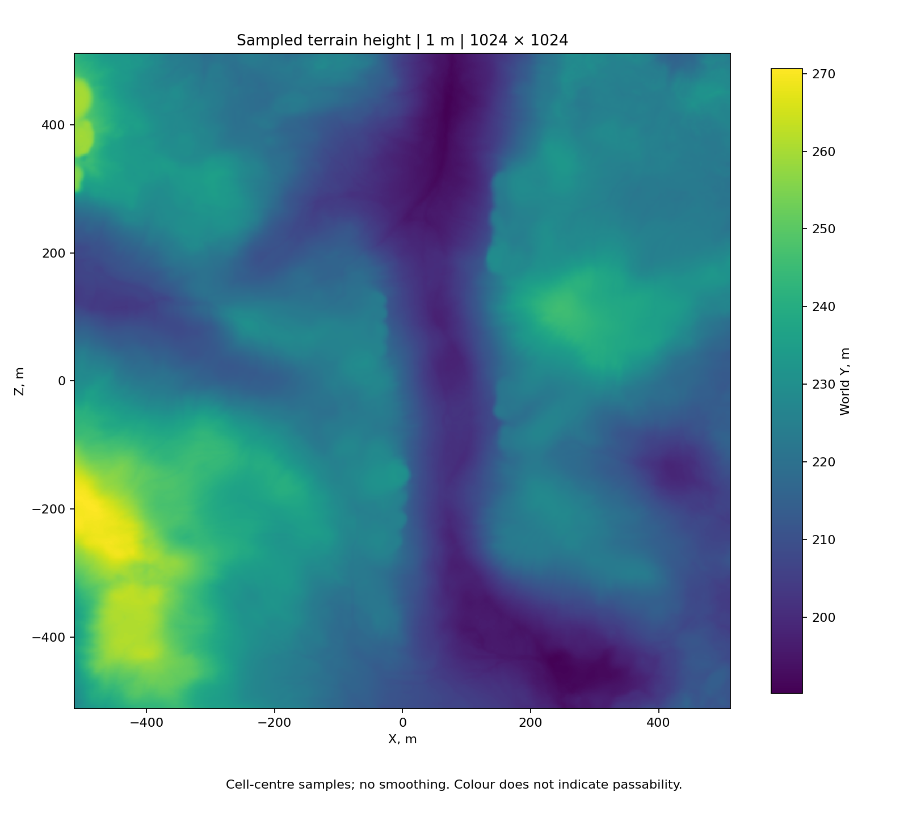

# Terrain heights and height maps

[← Back](README.md) · [Map guide](README.md) · [Русский](../../../ru/game/map/heights.md)

**We already read terrain height from the game.** A height map arranges these
numbers by their X/Z positions. Reading heights is verified; what heights mean for
a battle (positions, movement, sight) was not studied here.

## 1. Read a point from the game

```lua
local x, z = reader.cell_center(grid, ix, iz)
local y = bm:get_terrain_height(x, z)
```

X and Z locate the point horizontally; the returned number is world Y in metres.
It is not height above a unit, the lowest point on the map or an established sea
level. Keep the returned value. Negative values are not automatically errors;
missing, nonnumeric or nonfinite values are errors, not zero-height ground.

This exact call is inside [reader.read_batch](../../../../src/apps/map/).
That function also creates a vector at `(x,y,z)` for the separate ground-type
and area queries. It reads cells in batches; the existing capture runner uses
4,096 cells per callback in paused Deployment. Its timing includes all three
queries and CSV output, **not an isolated height-query benchmark**.

## 2. Arrange the samples

Read the radar frame and choose a step `s` as described in
[coordinates](coordinates.md) and [boundaries](boundaries.md). For zero-based indices:

```text
x = min_x + (ix + 0.5) * s
z = min_z + (iz + 0.5) * s
H[iz, ix] = terrain_height(x, z)
```

`H` has `rows` rows along Z and `columns` columns along X. Row zero starts at
`min_z`; column zero at `min_x`. A height is measured at the **cell centre**.
Painting a whole square with that value does not prove the square is flat.

Our original gzip CSV stores `ix,iz,height,clear,ground_id`; the newer capture
CSV includes explicit X/Z and ground strings. Both store height with six decimal
places. This is file precision, not proof of micrometre terrain accuracy.
Store bounds, origin, step, dimensions, scenario and source hashes alongside it.
CSV indices alone cannot recover the map's position or scale.

For the saved Kislev 1 m grid, bounds are X/Z `[-512,512]`, dimensions `1024×1024`,
and centre coordinates run from `-511.5` to `511.5`. These numbers belong to this
scenario. Do not reuse them as global map constants.

## 3. Draw the map offline

[heightmap.py](../../../../tools/analysis/heightmap.py) reads the saved CSV or
gzip CSV. It checks indices, duplicate/missing cells and finite heights; when
X/Z columns exist, it checks their agreement with the supplied grid. Bounds and
step must come from that capture's metadata, not a guess. Legacy CSV without X/Z
cannot independently confirm those parameters.

The renderer writes a float64 `height.npy` matrix, a JSON description with source
and output hashes, and English/Russian PNGs. The matrix preserves the CSV numbers;
it does not recover precision discarded by CSV formatting.

The image places X to the right and Z upwards (`origin="lower"`), uses the full
query-grid extent and clips the visible area to the radar frame. Each sample is
coloured by world Y with a labelled scale. No smoothing/interpolation is applied
between samples (`interpolation="nearest"`). At overview size, the display may
show fewer pixels than the grid: read the matrix for individual cells.

Colour is **height only**: dark is lower, light is higher. It does not mean water,
forest, safe movement or blocked ground. The scale is chosen per dataset; use a
shared numeric scale before comparing colours from different captures.

## 4. Reproduce the saved example without launching WH3

From the repository root, with the project's Python (`numpy`, `matplotlib` from `requirements-dev.txt`);
the source grid is in the local archive:

```bash
.venv/Scripts/python -m tools.analysis.heightmap --csv research/evidence/map-data/kislev-scales-evidence/grid-1m.csv.gz --bounds -512 512 -512 512 --step 1 --output build/map-research/heightmap-1m
```

The renderer also works with a completed capture's `tww3_bai_map_capture_grid.csv`;
provide that run's frame and step. It neither starts the game nor issues Lua orders.
Outputs, including the regenerable NPY, stay in the ignored `build/`.



Verified offline against the saved 25 September 2026 capture:

| Measurement | Result |
|---|---:|
| Samples | 1,048,576 |
| Minimum sampled Y | 190.216110 m |
| Maximum sampled Y | 270.624084 m |
| Difference | 80.407974 m |

These are extrema of the samples, not proven extrema between them. All matrix
entries were compared against their CSV indices and heights; the source hash
matches the archived experiment. `Metadata` (local archive: `research/evidence/map/heightmap-kislev-1m/heightmap.json`)
and `validation` (local archive: `research/evidence/map/heightmap-kislev-1m/validation.json`) preserve the result.
No new game measurement was needed.

## 5. Rules for future agents

- Use numeric heights and metre coordinates, not PNG colours, for decisions.
- The height difference between two sampled positions is `y2-y1`. A slope
  estimate can be derived as `atan2(y2-y1, horizontal_distance)`. This is the
  average incline between samples, not a game-returned movement penalty or the
  maximum slope between them. No slope-to-speed model is verified here.
- A 1 m step is sampling density, not a guaranteed native mesh resolution.
- A single Y per X/Z cannot represent stacked walkable surfaces, bridge decks
  versus ground beneath them, roofs, overhangs or airborne routes.
- Heights do not identify trees, obstacle volumes, water depth or visibility.
  A low strip on this plot must not be classified as a river from colour alone.
- Queries can return heights outside the radar frame; this is not a boundary test.
- Keep height, ground type and area-query results separate. Never infer
  passability, line of sight or combat bonuses from height alone.
- Reuse applies only to the recorded scenario until checked. Dynamic terrain,
  different map variants and other game versions have not been validated.
