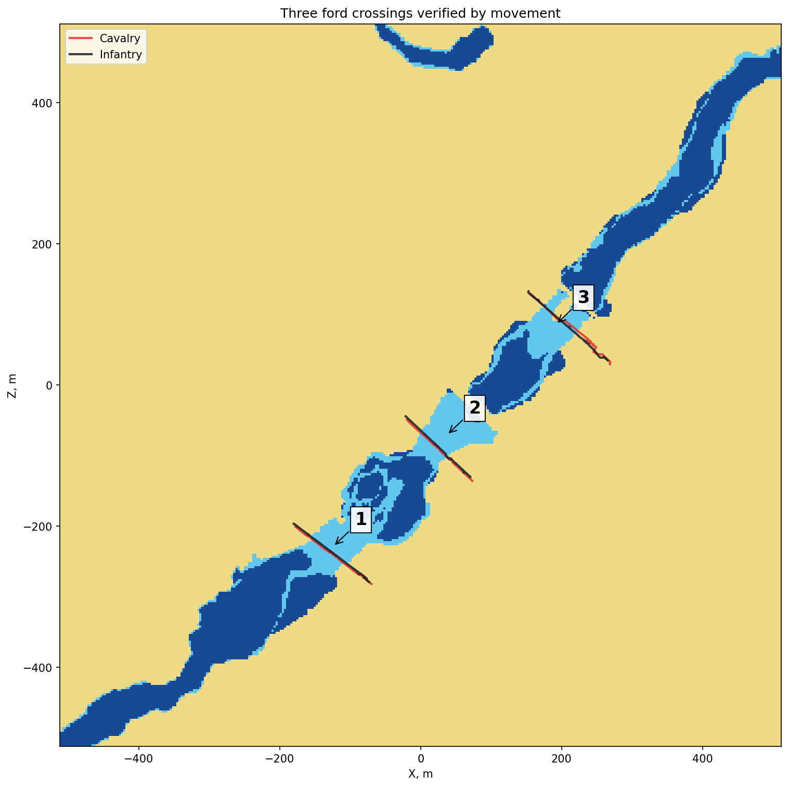

# Point reachability and verified fords

[← Back](README.md) · [Map guide](README.md) · [Русский](../../../ru/game/map/passages.md) · [Water data](water-ground.md)

## Ask about a specific unit

`unit:can_reach_position(vector)` was exercised on the Cathay field scenario for Winged Lancers and Kossars. The query must be interpreted in its battle phase: in Deployment, most sampled points were rejected; after Deployed, many became reachable. Both units could reach their own origins in both phases. Deployment answers are not a general navigation map.

The [read-only module](../../../../src/apps/navigation/) requires `Deployed` and accepts units plus cells already returned by the [surface reader](../../../../src/apps/map/):

```lua
local result = reachability.read_cells(bm, battle_vector, {cavalry, infantry}, cells)
-- result[i].reachable[j] is a boolean for unit j.
-- Outside-frame cells retain inside_radar=false and an empty reachable table.
```

It was validated live on 203 points for both units against direct calls. A separate full 3 m capture covered 116,281 inside-frame centres. Each unit reported **70,199 reachable points**, and their answers matched everywhere. The query loop plus CSV logging and scheduled batches took **2.456 s** by Lua `os.clock()`, separate from initial surface capture and loading. It ran paused after deployment.

`Full CSV` (local archive: `research/evidence/map/field-20260925/cathay-navigation/tww3_bai_map_capture_grid.csv.gz`) · `Navigation events` (local archive: `research/evidence/map/field-20260925/cathay-navigation/tww3_bai_map_capture_events.jsonl.gz`) · `Module validation` (local archive: `research/evidence/map/field-20260925/module-validation/validation.json`)

These are the game's point-reachability answers for each recorded unit under the recorded conditions. It does not supply a route, prove that the straight segment is clear, measure formation clearance, guarantee a short route or establish universal behaviour for flying/large/artillery units. Recheck when relevant battle state changes.

## Derive crossing candidates, then validate movement

The [offline passage tool](../../../../tools/analysis/passages.py) separates reachable dry cells from reachable shallow-water cells and labels four-neighbour connected components. It finds shallow-water components touching at least two dry-land components of at least 100 cells each. This 100-cell filter is an analysis setting, not a game rule. No diagonal corner-cutting is used.

On this grid it found **three connections** between two major banks (30,818 and 38,158 cells). They contain **368, 519 and 292** shallow-water centres. A 44-cell island is not treated as a major bank. This is useful topology for crossing candidates; it is not a general detector of every dry-land narrow pass, exact channel width or bridge.

Both complete units were then ordered through every candidate in one loaded battle at requested x20. Each of the **six trajectories** includes the source bank, `shallow_water`, and the opposite dry bank; no soldiers were lost. Only the reported unit centre was recorded, not every soldier's path.



The original 8 m order-arrival criterion succeeded for infantry. Cavalry crossed and became stationary about 12 m from the order coordinate, so that criterion timed out. The saved result retains these three timeouts; bank-to-bank crossing is a separate verified observation. Teleports between trials applied on a later engine tick, so stale initial samples from the previous trial were excluded by the first observed source-bank point.

`Crossing validation and caveats` (local archive: `research/evidence/map/field-20260925/cathay-crossings/summary.json`) · `Raw trajectory events` (local archive: `research/evidence/map/field-20260925/cathay-crossings/tww3_bai_map_capture_events.jsonl.gz`) · `Start/target coordinates` (local archive: `research/evidence/map/field-20260925/cathay-navigation/ford-movement-cases.json`) · `Connection components` (local archive: `research/evidence/map/field-20260925/cathay-navigation/connections.json`)

## Reproduce candidates without the game

```bash
.venv/Scripts/python -m tools.analysis.passages --csv research/evidence/map/field-20260925/cathay-navigation/tww3_bai_map_capture_grid.csv.gz --step 3 --output build/map-research/passages
```

The tool requires explicit reachability columns, grid indices, X/Z, ground and inside-frame flags. It validates complete unique indices and coordinate spacing. Output `components.npz` contains land/shallow component labels (−1 outside that layer) and the selected reachability intersection; `connections.json` preserves source/tool hashes, grid metadata, filter and component bounds. The extracted tool reproduced all three measured component sizes and bank IDs.

Adjacent reachable samples alone do not prove the full connecting segment or collision clearance. Retain candidates until a suitable movement check is available. A bridge deck and underlying ground cannot both be represented by one sampled height. A physical bridge was subsequently [identified through both native and CCO lists](bridges.md), but traversal there failed. A true point query did not guarantee movement from a teleported formation. No general narrow-pass width service has been validated.
