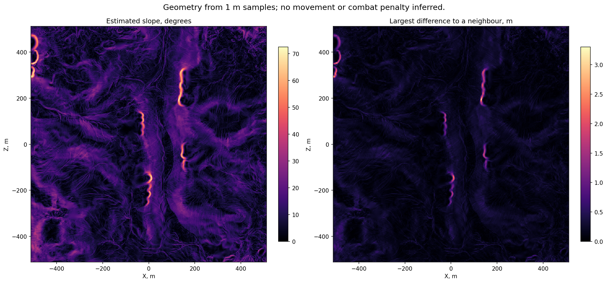

# Slopes and height differences

[← Back](README.md) · [Map guide](README.md) · [Русский](../../../ru/game/map/slopes.md) · [Height source](heights.md)

We can derive numeric geometric slopes from the terrain heights already read from WH3. This is an offline calculation, not a Lua-returned movement penalty or a complete cliff detector. It works with the recorded height samples and needs no game launch.

## Data and calculation

For spacing `s` metres and height matrix `H[iz,ix]`:

```text
gx = (H[iz,ix+1] - H[iz,ix-1]) / (2*s)
gz = (H[iz+1,ix] - H[iz-1,ix]) / (2*s)
slope_degrees = atan(sqrt(gx*gx + gz*gz)) * 180/pi
```

`gx` and `gz` are signed rise/run (m/m). Positive means uphill toward increasing X/Z. The estimated incline in a horizontal direction `(dx,dz)` of unit length is `atan(gx*dx + gz*dz)`. This is a local geometric estimate; it is not the speed/fatigue model used by the engine.

The [offline tool](../../../../tools/analysis/slopes.py) also preserves signed height changes to the next X/Z sample and the largest absolute change to the four cardinal neighbours. The outer row/column of the central slope has no complete neighbourhood and is `NaN`, not flat ground.

A sharp crest can have zero central slope because the two sides cancel. The neighbour-difference matrix preserves that discontinuity. Neither representation proves what happens between samples or whether a cliff blocks a unit.

## Measured example

Derived from the verified Kislev 1 m height capture, 1024 × 1024 samples:

| Quantity | Result |
|---|---:|
| Median estimated incline | 9.462° |
| 95th percentile | 21.052° |
| Maximum estimated incline | 72.445° |
| Largest adjacent sampled height difference | 3.29956 m over 1 m horizontally |
| Undefined border cells | 4,092 |

These are sample-derived values; the finite-difference baseline for the central slope is 2 m. A 1 m grid is not proof of the native terrain resolution. No movement, fatigue, combat or visibility effect was measured by this calculation.



`Numeric arrays` (local archive: `research/evidence/map/slopes-kislev-20260925/slopes.npz`) · `Summary and source hashes` (local archive: `research/evidence/map/slopes-kislev-20260925/summary.json`) · `Validation` (local archive: `research/evidence/map/slopes-kislev-20260925/validation.json`)

The NPZ keys are `gradient_x`, `gradient_z`, `slope_degrees`, `max_neighbor_delta_m`, `delta_x_m`, `delta_z_m`. The first four match H's shape. `delta_x_m` has one fewer column; `delta_z_m` has one fewer row. Array order remains `[iz,ix]`.

## Reproduce

First run the [height-map recipe](heights.md), then:

```bash
.venv/Scripts/python -m tools.analysis.slopes --height build/map-research/heightmap-1m/height.npy --metadata build/map-research/heightmap-1m/heightmap.json --output build/map-research/slopes
```

The tool verifies the height file's hash and dimensions before computing. Validation used an analytic tilted plane (including axis signs and metre spacing), constant height, a crest that defeats a central gradient, undefined borders and rejection of missing heights.

The single-height surface cannot represent a bridge deck and ground beneath it together. Preserve the source scenario and sampling step with every derived matrix.
