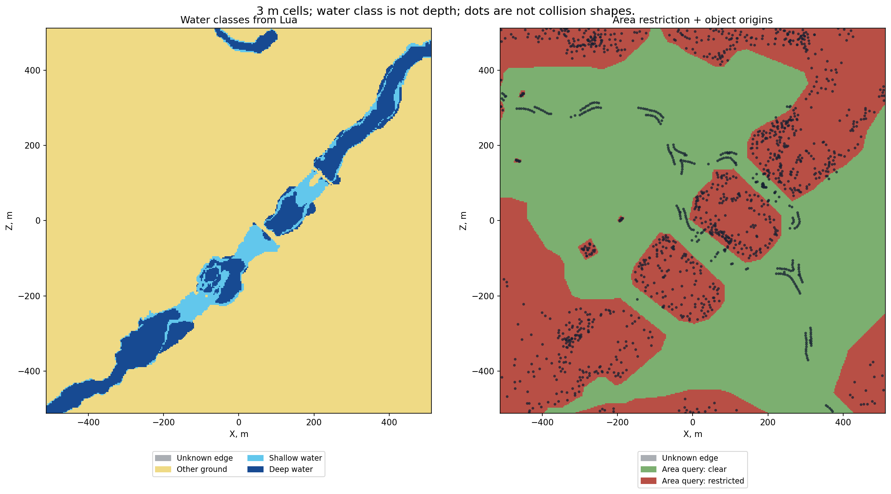

# Water classes and ground modifiers

[← Back](README.md) · [Map guide](README.md) · [Русский](../../../ru/game/map/water-ground.md) · [Movement and crossings](passages.md)

## What the game returned

The existing `bm:ground_type(position)` query returned both `shallow_water` and `deep_water` on the official Cathay farmland terrain. The vector uses `bm:get_terrain_height(x,z)` for Y. These are ground-class strings: they do not give water depth, surface height, flow or a river identifier.

The scenario requested `wh3_cth_farms_and_rivers_01_01` / `catchment_01` at tile position `(0.5,0.5)`. The `exported XML` (local archive: `research/evidence/map/field-20260925/cathay-navigation/tww3_bai_map_capture_ready.xml`) is the authoritative description of the loaded variant; do not identify it solely by a menu name. This is a normal field battle, not a siege or settlement test. Game build: `v9.0.0 Build 50218.4334952`; the isolated diagnostic pack accounts for the `(modded)` version suffix.

Inside the 1024 × 1024 m radar frame, with 3 m samples:

| Class | Cell centres | Reachable by each tested unit after deployment |
|---|---:|---:|
| Shallow water | 3,306 | 1,179 |
| Deep water | 7,522 | 0 |

The units were 60 Winged Lancers and 120 Kossars. Reachability is specific to those units, their origins and the battle state. It is not a global claim that every shallow-water cell is traversable or every `deep_water` class on every map is blocked. Both masks contain an unknown last-centre strip outside the radar frame; do not count it as sampled land.

`Masks and heights` (local archive: `research/evidence/map/field-20260925/cathay-navigation/surface-masks.npz`) · `Raw queries including both reachability columns` (local archive: `research/evidence/map/field-20260925/cathay-navigation/tww3_bai_map_capture_grid.csv.gz`) · `Summary` (local archive: `research/evidence/map/field-20260925/cathay-navigation/summary.json`)

NPZ `water[iz,ix]`: −1 unknown, 0 other ground, 1 shallow, 2 deep. `restricted`: −1 unknown, 0 clear area query, 1 restricted area query. `height` stores sampled world Y. Keep these layers separate.

On the separately tested [bridge-position variant](bridges.md), **14 `deep_water` centres returned true** for both unit queries. This is a measured counterexample to replacing the navigation layer with a rule that every deep-water label is inaccessible. Traversal of those 14 points was not checked.

## Rocky ground and scrub

`rock` was already captured on Kislev and was independently returned at 1,080 inside-frame points on the tested Wood Elf field terrain. `sharp_stones` is a different class. A ground class is not an individual rock's collision volume.

`scrub` exists in the installed vanilla tables, but it was not returned in the captured Kislev, Cathay and Wood Elf grids. The inspected texture mapping associates it with `wefcity`. That is not evidence that ordinary bushes use this ground class, and no settlement was launched to obtain it. A runtime scrub mask is **not yet verified**.

## Verified static records, not measured final effects

The installed `db.pack` tables were decoded and re-encoded byte-for-byte. Selected records from `ground_type_to_stat_effects`:

| Ground | Affected stat | Affected group | Stored multiplier |
|---|---|---|---:|
| `deep_water` | `scalar_speed` | null / unspecified | 0.7 |
| `rock` | `scalar_speed` | null / unspecified | 0.95 |
| `rock` | `scalar_speed` | `ethereal` | 1.0 |
| `scrub` | `scalar_speed` | null / unspecified | 0.95 |
| `scrub` | `scalar_speed` | `ethereal` | 1.0 |
| `shallow_water` | `scalar_speed` | `small`, `small_forest_strider`, `elves_wef` | 0.8 |
| `shallow_water` | `stat_melee_attack` | `aquatic_small`, `aquatic_large` | 1.2 |
| `shallow_water` | `stat_melee_attack` | `small`, `small_forest_strider`, `elves_wef` | 0.8 |
| `shallow_water` | `stat_melee_defence` | `aquatic_small`, `aquatic_large` | 1.2 |

Numbers are rounded representations of stored float32 values. The captured `sharp_stones` rows have multiplier 1.0. These records are verified file data, not measurements of actual unit speed or combat. Group selection, attributes, formation coverage and modifier precedence have not been resolved into a final-effect calculator. The source is `db.pack`; this is not a universal pack override audit.

`All modifier records, fields, source and hash` (local archive: `research/evidence/map/field-20260925/static-records/ground_type_to_stat_effects_tables.json`) · `Ground types` (local archive: `research/evidence/map/field-20260925/static-records/ground_types_tables.json`) · `Groups` (local archive: `research/evidence/map/field-20260925/static-records/ground_type_stat_effect_groups_tables.json`) · `Texture mapping` (local archive: `research/evidence/map/field-20260925/static-records/ground_type_to_texture_groups_tables.json`)

API reference: [CA battle-query documentation mirror](https://chadvandy.github.io/tw_modding_resources/WH3/battle/battle.html#section:battle:Querying). Runtime evidence is linked above; no water-depth getter is established by this test.
