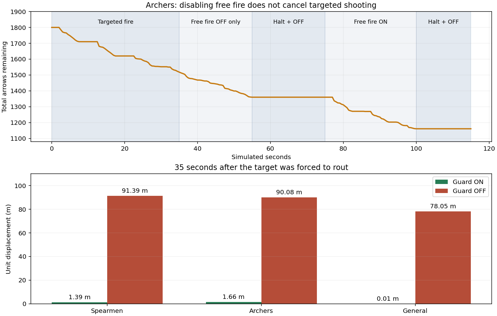
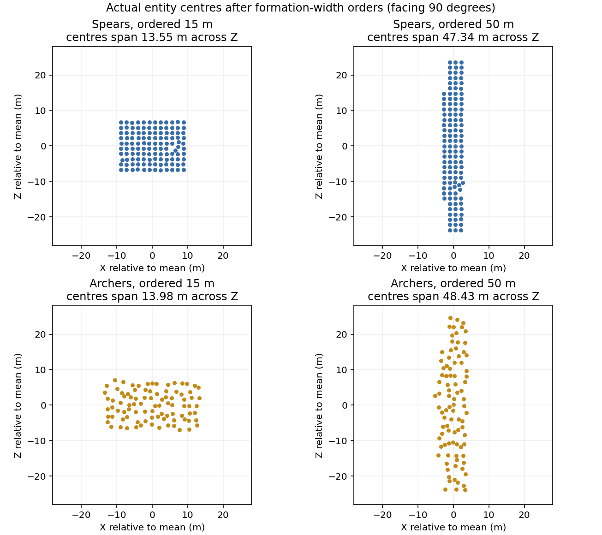

# Live experiments and reproducibility

[← Back](README.md) · [Units](README.md) · [Русский](../../../ru/game/units/evidence.md)

Ten completed automatic runs, **55,356 samples**, with raw orders/state transitions and verified cleanup records. Every promoted run has `probe_done`, no `probe_error`, and its game was closed. Development failures are not used as successful capability evidence.

| Dataset | Original run | Launch through capture, wall seconds | Samples |
|---|---|---:|---:|
| `basic` (local archive: `research/evidence/units/empire-20260926/basic/analysis.json`) | `run-20260926-083330` | 87.74 | 13,977 |
| `basic-repeat` (local archive: `research/evidence/units/empire-20260926/basic-repeat/analysis.json`) | `run-20260926-083541` | 87.58 | 13,977 |
| `passives` (local archive: `research/evidence/units/empire-20260926/passives/analysis.json`) | `run-20260926-083836` | 48.36 | 4,344 |
| `guard-on` (local archive: `research/evidence/units/empire-20260926/guard-on/analysis.json`) | `run-20260926-083936` | 34.64 | 1,083 |
| `guard-off` (local archive: `research/evidence/units/empire-20260926/guard-off/analysis.json`) | `run-20260926-084011` | 34.51 | 1,083 |
| `charge-still` (local archive: `research/evidence/units/empire-20260926/charge-still/analysis.json`) | `run-20260926-084047` | 32.47 | 720 |
| `charge-moving` (local archive: `research/evidence/units/empire-20260926/charge-moving/analysis.json`) | `run-20260926-084120` | 33.48 | 720 |
| `withdraw-rank1` (local archive: `research/evidence/units/empire-20260926/withdraw-rank1/analysis.json`) | `run-20260926-084451` | 38.74 | 2,271 |
| `basic-rank1` (local archive: `research/evidence/units/empire-20260926/basic-rank1/analysis.json`) | `run-20260926-084530` | 86.02 | 13,410 |
| `passives-rank1` (local archive: `research/evidence/units/empire-20260926/passives-rank1/analysis.json`) | `run-20260926-084657` | 46.05 | 3,771 |

Timings include loading; they are not isolated command-performance benchmarks. Requested battle speed was ×20 and completion events reported 20; this does not prove 20× effective wall-clock throughput. Sampling interval: 500 simulated milliseconds, with additional stage-end samples. Coordinates are metres and health is a fraction of initial total HP.

## Conditions and scope

- `basic-rank1`, `withdraw-rank1`: official `chokepoint_badlands_river`, dry daytime, no siege. `passives-rank1`: official `wh3_main_macro_ksl_plains_01`, specifically `catchment_04`. The full map selector matters; a different catchment has different forests.
- Final General: `is_commanding_unit() == true`, CCO `HasCharacterRank == true`, `CharacterRank == 1`, `ExperienceLevel == 0`. Earlier baselines, guard and charge comparisons used the same foot unit type but no general XML declaration: it reported noncommanding/rank 0. These baselines are labelled separately and do not prove a campaign character loadout.
- Three tested allied units plus an allied reserve; three enemy Spearmen targets plus an enemy General reserve. Charge comparisons replace targets with 60 Empire Knights each. Several isolated lanes are used in the same field battle. These are controlled command experiments, not competitive army-vs-army matches.
- Explicit script control on both sides, no enemy tactical AI. Fixture teleports place/separate units; only the guard comparison forcibly routes targets. No invincibility, HP/ammo/fatigue refill, attribute injection or invisibility override.
- Units are repositioned immediately after deployment because the engine can adjust XML positions. Combat stages use natural damage/morale. A single replay is not a statistical balance study. No deterministic random seed was fixed.
- Minimum graphics, Ultra unit size, diagnostic pack only. `modded` in the version string refers to that loaded pack.

## Direct measurements

### Shooting and guard

Top: `basic-rank1`. Arrow expenditure: targeted fire **282**, free-fire-off toggle while retaining target **158**, halt + off **0**, free fire **199**, final halt + off **0**. Earlier repetitions show a short 0–4-arrow completion tail; do not interpret this one run's zero tail as an instantaneous cancellation guarantee.

Bottom: `guard-on` versus `guard-off`. Endpoint displacement during 35 simulated seconds after target routing, not total distance travelled. Forced routing is logged explicitly as a fixture operation.

### Formation geometry

From `withdraw-rank1`: `ManList.Size` and `ManList.At(i).Position` returned individual soldier positions. The latter returned multiple numeric values (X,Y,Z), not a Lua vector object. A formation snapshot is taken at the end of each stage.

| Unit | Order 15 m: span along Z | Order 50 m: span along Z |
|---|---:|---:|
| 120 Spearmen | 13.553 m | 47.344 m |
| 90 Archers | 13.980 m | 48.427 m |
| General (ordered 5 m in both cases) | 0 | 0 |

Facing was 90°, so the measured transverse direction is Z. These spans enclose **entity centres**, excluding model radius, weapons and collision volumes. The requested width and the centre span are different quantities. Rearrangement is demonstrated; a universal occupied-area or collision-footprint model is not.

### Withdrawal and support

In `withdraw-rank1`, all three reported CCO `IsWithdrawing` by the first sample after the order (0.5 simulated seconds). Native `is_leaving_battle` became true after **63.5 / 113.5 / 70.5 seconds** for Spearmen/Archers/General. The probe stopped when all three reported leaving. This establishes the exit procedure and exposed flags; it does not determine campaign survival or post-battle losses. `withdraw(false)` also produced withdrawal in `passives-rank1`; only the running variant is used in the main recipe.

In `passives-rank1`, the far → near → far General sequence changed Spearmen's CCO morale fraction **1.0833 → 1.2167 → 1.0833**, Archers' **1.1000 → 1.1600 → 1.1000**. Nearby Spearmen received Hold the Line; Archers did not. These are readouts, not isolated bonus formulas.

## Saved data

`Run index` (local archive: `research/evidence/units/empire-20260926/runs.json`) · `SHA-256 inventory` (local archive: `research/evidence/units/empire-20260926/hashes.json`) · `Installed DB selection` (local archive: `research/evidence/units/empire-20260926/installed-db-selection.json`)

Every linked dataset directory contains `events.jsonl.gz`, `analysis.json`, exact executed `capture.lua`, input/exported XML, pack manifest, launch, status and cleanup records. Events include capabilities, fixture moves, stage boundaries, samples, ability orders and completion. Numeric-key Lua tables are encoded as JSON objects, not JSON arrays. `ms` is battle time; `elapsed` is stage-relative; `wall` is UTC with one-second resolution. The summary's first sample can represent the state at the command boundary; inspect the raw stage and elapsed time for finer analysis.

Static DB selection was extracted before live trials, with strict decode/re-encode verification. It is source-record evidence, not a measurement of damage coefficients. Game binaries and the proprietary packs themselves are not included. Builder/analyser/plot snapshots are preserved for traceability; the supported replay path below uses the **exact per-run script**, not a reconstruction with a later builder revision.

## How the experiments were replayed

The [replay builder](../../../../research/scripts/unit-actions/replay_tool.py) checked archived file hashes, compiled Lua 5.1, built the PFH5 pack, round-tripped its contents and required an **identical original pack hash**. It is kept as it was and refers to the old file layout: it does not run without fixing paths. It never installed or launched anything; the experiment labels are listed in the archive's `runs.json`.

Today a battle is started by the [launcher](../../../../tools/launcher/launch.ps1): it installs the pack, launches one battle, preserves outputs and closes only its own game process on completion, error or timeout ([running a battle](../../launch/run.md)). Unit orders in a live battle are checked now by the `move_probe` and `unit_readout` entries ([entries](../../apps/entries.md)).

In these experiments the map and unit probes shared one build folder and one private pack name. The placeholder grid CSV in unit runs was a launcher compatibility marker, not a map measurement.

An error or timeout can leave private files for diagnosis. Preserve partial output before removing them; do not treat a failed run as completed. The successful withdrawal probes stop early on the unit leave flags because battle timers can cease when the battle ends.

## Reference material

- [CA Unitcontroller API mirror](https://chadvandy.github.io/tw_modding_resources/WH3/battle/battle_unitcontroller.html) and [Unit API](https://chadvandy.github.io/tw_modding_resources/WH3/battle/battle_unit.html): candidate interfaces; runtime findings take precedence where signatures differ.
- [CCO reference](https://chadvandy.github.io/tw_modding_resources/WH3/cco/documentation.html): state-list and effect-list interfaces.
- [CA XML unit tags](https://wiki.totalwar.com/w/Total_War:_ATTILA_KIT_-_Unit_Tags) and [army tags](https://wiki.totalwar.com/w/Total_War:_ATTILA_KIT_-_Army_Tags): older engine documentation used to find general/withdrawal declarations, subsequently checked in WH3.
