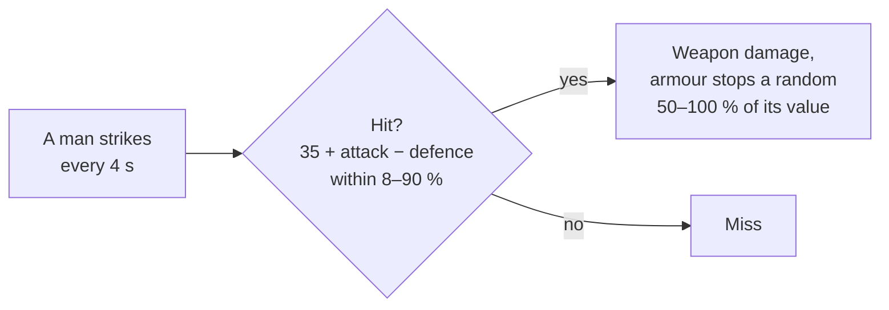

# Melee

[← Back](README.md) · [Documentation](../../README.md) › [Game knowledge](../README.md) › [Units](README.md) › Melee · [Русский](../../../ru/game/units/melee.md)

How the game counts blows in melee and how many men really fight. Sources:

- the battle rules table `_kv_rules_tables` and `land_units_tables` from the
  game's database (read 30.09.2026, [the game's database](../database.md),
  `config/nn/game_rules.json`);
- unit cards read in battle ([roster](roster.md), `data/roster/`);
- the first 13 fair arena battles on 30.09.2026 (`20260930-130637` …
  `-132200`, Normal difficulty), 7522 s of records; 5 more were recorded after
  the analysis ([data for training](../../training/README.md)).

Game v9.0.1, build 50381.

## The database rule

| Rule | Value | Key in `_kv_rules_tables` |
|---|---|---|
| Hit chance | 35 + attack − defence | `melee_hit_chance_base` 35 |
| Hit chance limits | 8–90 % | `melee_hit_chance_min`, `_max` |
| Blow | every 4 s | `melee_attack_interval` 4 |
| Armour | stops a random 50–100 % of its value | `armour_roll_lower_cap` 0.5 |
| Defence when hit in the flank / rear | ×0.6 / ×0.3 | `melee_defence_direction_penalty_coefficient_flank`, `_rear` |
| Charge | fades over 13 s | `charge_decay_duration` 13 |
| Formed defence bonus | 5 (when exactly it applies is not checked) | `melee_defence_formed_attack_bonus` |
| Shield | holds blows up to 60° from the front | `shield_defence_angle_melee` 60 |

The formula itself is in the engine; the database has only the numbers. How
well the formula matches battle was checked against recordings (below).

## The arena's units

Attack, defence — `land_units_tables`; weapon damage and armour — the card read
in battle ([roster](roster.md)).

| Unit | Attack | Defence | Weapon damage | Armour |
|---|---:|---:|---:|---:|
| Empire General | 55 | 45 | 430 | 85 |
| Spearmen (no shields) | 20 | 34 | 25 | 30 |
| Archers (no shields) | 14 | 17 | 24 | 20 |

Hit chance by the formula (computed, not measured):

| Who strikes → whom | Front | Flank | Rear |
|---|---:|---:|---:|
| Spearmen → spearmen | 21 % | 35 % | 45 % |
| Lord → spearmen | 56 % | 70 % | 80 % |
| Spearmen → lord | 10 % | 28 % | 42 % |
| Spearmen → archers | 38 % | 45 % | 50 % |
| Archers → spearmen | 15 % | 29 % | 39 % |

## What the recordings show

- **Not everyone fights.** If every man strikes, the formula greatly
  overestimates infantry-against-infantry losses. It matches the recorded
  health loss when 13–18 % of an infantry unit's men fight at once (0.13 by the
  target field, 0.176 by where the units touch). For 120 spearmen that is about
  16–21 men.
- **The lord.** Pairs with a lord match the formula when the lord strikes as one
  man and up to ~8 enemies reach that one man (the lord) (recorded to computed
  ratio 0.84–1.2).

## The charge: a measurement of 29.09.2026

A probe on [The Moorlands Route](../maps/moorlands-route.md) (south, open
ground), 4 runs `20260929-111203` … `-111923`, 16 lanes. In each lane two Empire
spearmen units (120 men each, 30 m front) start 80 m apart. The attacker runs
at the defender (3.27 m/s). By mode the defender stands, runs to meet it when
the enemy is 45 m or 15 m away, or both run at once. The modes moved between
lanes from run to run. Difficulty Very Hard: the measurement was before the
[fair difficulty](../difficulty.md) rule.

Men lost in the first 40 s after contact, on average:

| The defender | Lanes | Defender | Attacker |
|---|---:|---:|---:|
| stands | 4 | 7.5 | 1.25 |
| runs to meet it from 45 m | 4 | 7.5 | 6.75 |
| runs to meet it from 15 m | 4 | 9 | 8 |
| both run at once | 4 | 8.5 | 4.75 |

- The side that takes the charge standing loses more: 7.5 men against 1.25.
- The side that runs to meet it evens the losses: 8.25 against 7.4 on average
  over the 8 lanes.
- Even when both run, the attacker loses less. The attacker is the AI's side,
  which gets bonuses at this difficulty; the cause was not checked.

Caveats: 4 lanes per mode, only spearmen against spearmen, one map, differences
of a few men. The probe's entry point never reached Git. Only the local build
`build/charge-probe/` and the summary `research/analysis/charge-probe/summary.json`
are left (the data is not in Git). The probe's whole source code sits in the
bundled script `build/charge-probe/tww3_bai_charge_probe.lua`: module
`entries.charge_probe` (from line 877); the lane settings are in
`build/charge-probe/manifest.json`. The `build/` folder is not in Git: cleaning
it loses the probe's code.

## Not checked

- How armour and armour-piercing damage split a blow.
- The charge: how much it adds by the rules, at fair difficulty, for other units
  and on other maps (above is only a small measurement).
- Shields in melee (the arena's spearmen and archers have no shields).
