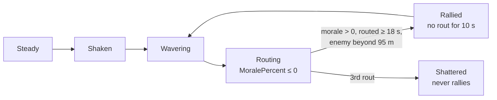

# Morale

[← Back](README.md) · [Documentation](../../README.md) › [Game knowledge](../README.md) › [Units](README.md) › Morale · [Русский](../../../ru/game/units/morale.md)

Morale decides when a unit runs. Here are the rules from the game's database and
what battle recordings show. Sources:

- the game's database tables `_kv_morale_tables`, `land_units_tables`,
  `unit_experience_bonuses_tables`, `unit_experience_thresholds_tables`
  (read 30.09.2026, [the game's database](../database.md), `config/nn/game_rules.json`);
- the first 13 fair arena battles on 30.09.2026 (`20260930-130637` …
  `-132200`, Normal difficulty), 7522 s of records; 5 more were recorded after
  the analysis ([data for training](../../training/README.md)).

Game v9.0.1, build 50381.

## In short

- Morale is points. The base is the unit's leadership; the effects in the table
  below add to it or take from it.
- The game shows `MoralePercent`: current morale divided by the unit's effective
  leadership. Lua can read it: `cco.MoralePercent`
  ([state fields](state-fields.md)).
- A unit routs when `MoralePercent` falls to 0.

State thresholds from the database (`ums_<state>_threshold_lower` / `_upper`),
numbers as they are:

| State | Lower threshold | Upper threshold |
|---|---:|---:|
| `impetuous` | 1.1 | — |
| `eager` | 0.9 | 1.1 |
| `confident` | 0.65 | 1.0 |
| `steady` | 30 | 0.8 |
| `shaken` | 12 | 32 |
| `wavering` | 0 | 16 |
| `broken` (routing) | −50 | 0 |

**The unit of these thresholds is not checked.** Whole numbers (0, 12, 16, 30,
32, −50) sit next to fractions (0.65–1.1), and steady's upper threshold 0.8 is
below its lower one, 30. Perhaps some are points and some are fractions of
`MoralePercent`; they were not compared with the recordings. Neighbouring bands
overlap.

## Leadership

From `land_units_tables` (the arena's units, rank 0):

| Unit | Leadership | Effective leadership from recordings |
|---|---:|---:|
| Empire General (`wh_main_emp_cha_general_0`) | 70 | 77 |
| Spearmen (`wh_main_emp_inf_spearmen_0`) | 60 | 73 |
| Archers (`wh2_dlc13_emp_inf_archers_0`) | 50 | 63 |

- Each experience rank adds **+1.06** leadership (`unit_experience_bonuses_tables`,
  `stat_morale`).
- Experience for ranks 1–9 (`unit_experience_thresholds_tables`): 700, 1500,
  2400, 3400, 4600, 7000, 10600, 15500, 22000.
- All arena units are rank 0 (`<unit_experience level="0"/>` in the scenario).

## What changes morale

All numbers are morale points from `_kv_morale_tables`. When each holds: the in-game morale probe (below,
["The morale probe"](#the-morale-probe-in-the-game)) and the game's labels in the recordings (`build/morale_spec`).

| Cause | Points | When it holds |
|---|---:|---|
| The lord near: within 70 m | +4 | fading to 0 at 105 m; not to the lord himself |
| The lord died: first, the whole army (45 s) | −16 | |
| The lord died: then the whole army, to the battle's end | −10 | |
| The lord fled recently: left the map (~120 s; a rout on the field costs only the aura) | −16 | |
| Attacked in the flank / rear | −6 / −14 | while an enemy strikes from that side (the rear instead of the flank); it ends when that enemy leaves |
| One flank exposed / several | −3 / −6 | an enemy threatens the flank |
| Flanks secure | +5 | no standing enemy within ~146 m (centre to centre) **or** friendly units (not the lord) at both sides within ~40 m; one neighbour, a neighbour in front or the lord near do not secure |
| Under fire | −5 | 15 s more after the last hit |
| Winning the fight: slightly / yes / significantly | +3 / +6 / +8 | in melee **and by shooting**: a shooter hitting without an answer gets +8 while it shoots; only once the enemy has lost ≥ 10 % of its health |
| Losing the fight: yes / significantly | −3 / −8 | in melee and under a shooting enemy's fire; only once the unit itself has lost ≥ 10 % of its health |
| The charge | +15 | in 6 s blocks: the first when a unit under an attack order comes within ~25 m of its target (the charge pose), the second right after; ~12 s in all, from ~6 s before contact to ~6 s after |
| A strong enemy near (by its combat power) | −3 to −24 | the label "superior in strength and speed"; a much stronger enemy (the probe: worth 3 times as much or more), speed not needed; grows as it comes closer |
| Very tired / exhausted | −2 / −6 | |
| Very Hard difficulty — for the player | −4 ([difficulty](../difficulty.md)) | |

Routing friendly units within 100 m also lower morale (weight 3).

**Casualties over the whole battle** — the share of health lost (the table
switches on "count by hit points, not by men"):

| Lost | 10 % | 20 % | 30 % | 40 % | 50 % | 60 % | 70 % | 80 % | 90 % |
|---|---|---|---|---|---|---|---|---|---|
| Points | −2 | −4 | −7 | −11 | −16 | −22 | −32 | −47 | −74 |

**Recent casualties:**

| Lost recently | 6 % | 10 % | 15 % | 33 % | 50 % |
|---|---|---|---|---|---|
| Points | −6 | −12 | −20 | −44 | −80 |

The table does not say how many seconds count as "recent".

**Timers:** after the third rout the unit is shattered (`shatter_after_rout_count` 3), at the floor of
−50 points (`ums_broken_threshold_lower`) at once;
a rallied unit cannot rout again for 10 s (`post_rally_no_rout_timer`);
`waver_base_timeout` 25 s; morale changes smoothly (`percent_update_per_tick` 0.15).

## What the recordings show

13 arena battles, Normal difficulty, 30.09.2026:

- **The rules explain the recording.** The database rules explain the recorded
  `MoralePercent` of standing units with r² = 0.80 (82 395 samples) when the
  effective leadership is 77 for the lord, 73 for spearmen, 63 for archers. The
  fit also needs a starting reserve above leadership: ours 6/6/11 points, the
  game's AI 13/6/7 (lord/spearmen/archers). This is a fitted number, not a game
  rule. In the recording 2 s after the start, `MoralePercent` of the lords is
  the same on both sides (1.057), of the spearmen 1.067 (1.1 in some of the
  game's AI spearmen). The archers differ: ours 1.08, the game's AI usually
  1.12. At Very Hard (19 battles) the picture is the same
  ([difficulty](../difficulty.md)).
- **Rout.** A unit routs when `MoralePercent` reaches 0 (median just before the
  rout 0.00). Its health at that moment: median 19 % (9 to 43 % in 80 % of
  routs).
- **Rally.** A routing unit rallies after 45 s (median; 25–83 s); the morale probe
  showed the rule (below). All recordings: any living enemy within 95 m, a routing one too, nearly
  forbids the rally (0.9 % of 4285 such seconds rallied within 1 s, with none 12.6 % of 17,319); and
  without one the rally is not at once — from the first second the conditions hold, median 7 s (p25 4, p75 12).
- **Shattering.** All 92 + 61 shatters on the run of a 1st / 2nd rout (221 battles, army-destruction waves
  excluded) met one of the conditions: points at the floor −50 or health below 0.05 / 0.10 of the start;
  rallied units reached them in 0.000–0.003 of 3205.
- **How often.** 243 routs and 132 rallies in 13 battles — about 19 routs and 10
  rallies a battle. Units often rout and rally several times; the winner chases
  routers for a long time, a battle lasts 350–900 s of game time.

## The morale probe in the game

06.10.2026, 7 battles at Normal (`tools/nn/morale_probe.py`, `src/entries/morale_probe.lua`): 3–5 lanes a
battle, the side under test with normal morale, the enemy fearless; every 0.5 s `MoralePercent` and the label
of the strongest effect (`MoraleGreatestEffect`). Data: `build/morale`.

- **Flanks secure.** Standing spearmen, an enemy closing by steps: +5 at 150–310 m, gone between 148 and
  144 m (centre to centre). One friend 32 m at the side, a friend 30 m in front or the lord 30 m away give
  no +5. In melee with two friends at both sides (34 m) +5 holds (65 points against 60 without them).
- **A flank / rear attack.** The label "attacked in the rear" holds all the time the unit behind strikes
  (~29 s) and goes when it leaves; morale then rises by 19 points. A flank attack hides behind "taking
  losses" (−8); +9 when it leaves.
- **The charge.** Four lanes (attack at a run from 150 and 40 m, at a walk from 80 m, a walk to 10 m then an
  attack): the label "charge" starts 4.5–6.5 s before contact, at an edge-to-edge gap of 25–28 m (the
  database's `charge_distance_adopt_charge_pose` 25 m), and lasts 6 + 6 s in all four.
- **Winning by shooting.** Archers hitting without an answer: "winning" +8 from the second their target has
  lost 10 % of its health to 1.5–2 s after the shooting ends (10 s between volleys without a break).
  Spearmen under slings: nothing after the first volley (6 %), −8 from the second (12 %) to the end of the
  fire. Spearmen in melee: −3 or −8 appears exactly as they pass 10 % lost.
- **A strong enemy.** An enemy stops at 65, 45 and 30 m: archers next to the Warlord (worth 1.5×, faster) or
  Night Runners and spearmen next to clanrats — nothing; skavenslaves next to swordsmen (3×, slower) −3 / −4,
  next to the General (4.8×, slower) −7 at 65 m and −9 closer; the General's starts at ~120 m.
- **Rout and rally.** A router's morale follows its target as usual (−1 → +7 in 4 s → +9), enemy near or
  not. The rally: once the nearest enemy is beyond 94–96 m (at once) and not before 18.5 s into the rout;
  morale at the rally 0.26. Probe rally2 (5 lanes, `build/probes7`): the enemy 118–130 m away — the rally exactly
  18.5 s into the rout (the conditions held from 15 s); the enemy following at 82–95 m — at 21.0 s, as soon as it was
  92–96 m away. The "7 s after the conditions" wait (the whole-battle recordings' median) is not in the probe; what
  holds rallies back in whole battles is not found.
- **Strong enemy — the scale** (probe strong2, 2 battles: skavenslaves stand, a fearless enemy comes from 180 m in
  steps; points from the level 41 left after "flanks secure" goes at ~140 m):

  | Enemy (cost / the skavenslaves' cost) | 100 m | 80 m | 60 m | 40 m |
  |---|---:|---:|---:|---:|
  | spearmen (2.6) | 0 | 0 | 0 | 0 |
  | swordsmen (3.2) | 0 | 0 | −3 | −4 |
  | flagellants (5.0) | −3 | −4 | −5 | −6 |
  | greatswords (6.8) | 0 | 0 | 0 | 0 |
  | the General (7.6) | −5 (95 m) | −7 | −8 | −9 |
  | swordsmen + spearmen side by side | −4 | −5 | −6 | −10 |

  The penalty grows as the enemy comes and starts beyond 70 m (`enemy_effect_range`); greatswords (dearer than
  swordsmen and flagellants) give nothing, two weaker units together more than each. So the "combat power" is not the
  cost nor cost × health; no formula — OPEN.

## How to read it

- `cco.MoralePercent` is a number; it can be above 1, and under pressure it goes
  below 0 (down to −1.78 in a test, [state sensors](state-sensors.md)). Do not
  clip it to 0–1.
- `cco.MoraleState`, `is_wavering()`, `is_routing()`, `is_shattered()` — the
  state and flags ([state fields](state-fields.md)).
- The card's morale number, `cco.card.stat_morale.Value` / `ValueBase`, does
  change in battle (from −72 to 75, [state fields](state-fields.md); in
  deployment the card shows 0, [roster](roster.md)). How it relates to the
  effective leadership is not established. So we compute the morale points and
  the effective leadership from `MoralePercent` and the tables above.

## Not checked

- How exactly the engine adds up the effects: the formula is in the engine, the
  database has only the numbers.
- Ranks above 0, other units and factions.
- `charge_timeout` 60 is not a cooldown of the charge's morale (a unit gets +15 again after ~19 s); its
  meaning is not found. `shatter_after_first_rout_if_casulties_higher_than` 0.05 and `…_second_rout_…` 0.1 —
  by the recordings: a shatter below 0.05 / 0.10 of the starting health on the 1st / 2nd rout (above).
- The game's own rally clock: rout length to the rally peaks at 18–19 and 36–37 s (morale probe T-E).
- How the game computes the fight's balance (a ratio of what, over what window, the thresholds) and a strong
  enemy's "combat power".
