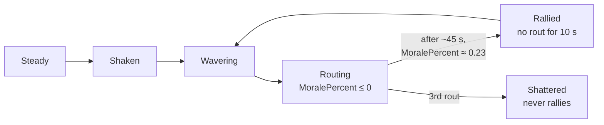

# Morale

[← Back](README.md) · [Documentation](../../README.md) › [Game knowledge](../README.md) › [Units](README.md) › Morale · [Русский](../../../ru/game/units/morale.md)

Morale decides when a unit runs. Here are the rules from the game's database and
what battle recordings show. Sources:

- the game's database tables `_kv_morale_tables`, `land_units_tables`,
  `unit_experience_bonuses_tables`, `unit_experience_thresholds_tables`
  (read 30.09.2026, [the game's database](../database.md), `config/nn/game_rules.json`);
- the first 13 fair arena battles on 30.09.2026 (`20260930-130637` …
  `-132200`, Normal difficulty), 7522 s of records; 5 more were recorded after
  the analysis ([data for training](../../training/README.md)).

Game v9.0.1, build 50381.

## In short

- Morale is points. The base is the unit's leadership; the effects in the table
  below add to it or take from it.
- The game shows `MoralePercent`: current morale divided by the unit's effective
  leadership. Lua can read it: `cco.MoralePercent`
  ([state fields](state-fields.md)).
- A unit routs when `MoralePercent` falls to 0.

State thresholds from the database (`ums_<state>_threshold_lower` / `_upper`),
numbers as they are:

| State | Lower threshold | Upper threshold |
|---|---:|---:|
| `impetuous` | 1.1 | — |
| `eager` | 0.9 | 1.1 |
| `confident` | 0.65 | 1.0 |
| `steady` | 30 | 0.8 |
| `shaken` | 12 | 32 |
| `wavering` | 0 | 16 |
| `broken` (routing) | −50 | 0 |

**The unit of these thresholds is not checked.** Whole numbers (0, 12, 16, 30,
32, −50) sit next to fractions (0.65–1.1), and steady's upper threshold 0.8 is
below its lower one, 30. Perhaps some are points and some are fractions of
`MoralePercent`; they were not compared with the recordings. Neighbouring bands
overlap.

## Leadership

From `land_units_tables` (the arena's units, rank 0):

| Unit | Leadership | Effective leadership from recordings |
|---|---:|---:|
| Empire General (`wh_main_emp_cha_general_0`) | 70 | 77 |
| Spearmen (`wh_main_emp_inf_spearmen_0`) | 60 | 73 |
| Archers (`wh2_dlc13_emp_inf_archers_0`) | 50 | 63 |

- Each experience rank adds **+1.06** leadership (`unit_experience_bonuses_tables`,
  `stat_morale`).
- Experience for ranks 1–9 (`unit_experience_thresholds_tables`): 700, 1500,
  2400, 3400, 4600, 7000, 10600, 15500, 22000.
- All arena units are rank 0 (`<unit_experience level="0"/>` in the scenario).

## What changes morale

All numbers are morale points from `_kv_morale_tables`.

| Cause | Points |
|---|---:|
| The lord near: within 70 m | +4 |
| The lord died: first, the whole army (45 s) | −16 |
| The lord died: then the whole army, to the battle's end | −10 |
| The lord fled recently: left the map (~120 s; a rout on the field costs only the aura) | −16 |
| Attacked in the flank / rear | −6 / −14 |
| One flank exposed / several | −3 / −6 |
| Flanks secure | +5 |
| Under fire | −5 |
| Winning the fight: slightly / yes / significantly | +3 / +6 / +8 |
| Losing the fight: yes / significantly | −3 / −8 |
| A strong enemy near (by its combat power) | −3 to −24 |
| Very tired / exhausted | −2 / −6 |
| Very Hard difficulty — for the player | −4 ([difficulty](../difficulty.md)) |

Routing friendly units within 100 m also lower morale (weight 3).

**Casualties over the whole battle** — the share of health lost (the table
switches on "count by hit points, not by men"):

| Lost | 10 % | 20 % | 30 % | 40 % | 50 % | 60 % | 70 % | 80 % | 90 % |
|---|---|---|---|---|---|---|---|---|---|
| Points | −2 | −4 | −7 | −11 | −16 | −22 | −32 | −47 | −74 |

**Recent casualties:**

| Lost recently | 6 % | 10 % | 15 % | 33 % | 50 % |
|---|---|---|---|---|---|
| Points | −6 | −12 | −20 | −44 | −80 |

The table does not say how many seconds count as "recent".

**Timers:** after the third rout the unit is shattered (`shatter_after_rout_count` 3);
a rallied unit cannot rout again for 10 s (`post_rally_no_rout_timer`);
`waver_base_timeout` 25 s; morale changes smoothly (`percent_update_per_tick` 0.15).

## What the recordings show

13 arena battles, Normal difficulty, 30.09.2026:

- **The rules explain the recording.** The database rules explain the recorded
  `MoralePercent` of standing units with r² = 0.80 (82 395 samples) when the
  effective leadership is 77 for the lord, 73 for spearmen, 63 for archers. The
  fit also needs a starting reserve above leadership: ours 6/6/11 points, the
  game's AI 13/6/7 (lord/spearmen/archers). This is a fitted number, not a game
  rule. In the recording 2 s after the start, `MoralePercent` of the lords is
  the same on both sides (1.057), of the spearmen 1.067 (1.1 in some of the
  game's AI spearmen). The archers differ: ours 1.08, the game's AI usually
  1.12. At Very Hard (19 battles) the picture is the same
  ([difficulty](../difficulty.md)).
- **Rout.** A unit routs when `MoralePercent` reaches 0 (median just before the
  rout 0.00). Its health at that moment: median 19 % (9 to 43 % in 80 % of
  routs).
- **Rally.** A routing unit rallies after 45 s (median; 25–83 s), when
  `MoralePercent` climbs to about 0.23.
- **How often.** 243 routs and 132 rallies in 13 battles — about 19 routs and 10
  rallies a battle. Units often rout and rally several times; the winner chases
  routers for a long time, a battle lasts 350–900 s of game time.

## How to read it

- `cco.MoralePercent` is a number; it can be above 1, and under pressure it goes
  below 0 (down to −1.78 in a test, [state sensors](state-sensors.md)). Do not
  clip it to 0–1.
- `cco.MoraleState`, `is_wavering()`, `is_routing()`, `is_shattered()` — the
  state and flags ([state fields](state-fields.md)).
- The card's morale number, `cco.card.stat_morale.Value` / `ValueBase`, does
  change in battle (from −72 to 75, [state fields](state-fields.md); in
  deployment the card shows 0, [roster](roster.md)). How it relates to the
  effective leadership is not established. So we compute the morale points and
  the effective leadership from `MoralePercent` and the tables above.

## Not checked

- How exactly the engine adds up the effects: the formula is in the engine, the
  database has only the numbers.
- Ranks above 0, other units and factions.
- The table also has `charge_bonus` 15, `shatter_after_first_rout_if_casulties_higher_than`
  0.05 and `…_second_rout_…` 0.1 — their meaning was not checked.
