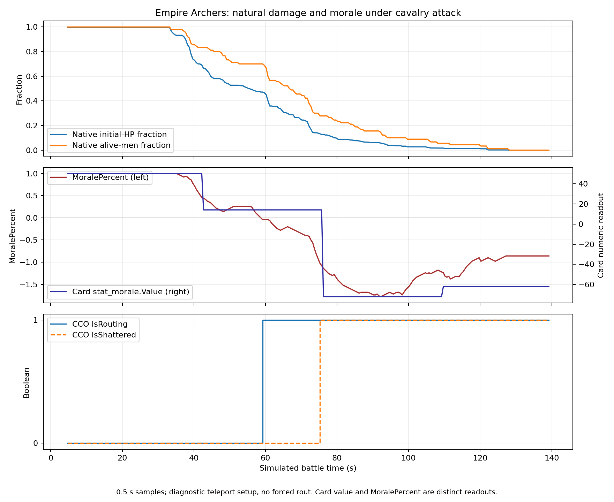

# Common unit state sensors

[← Back](README.md) · [Units](README.md) · [Русский](../../../ru/game/units/state-sensors.md) · [Complete field table](state-fields.md)

This is shared infrastructure knowledge: how to read a unit's changing condition. Faction tactics, unit balance statistics, abilities, equipment and special racial mechanics belong to separate research. Test subjects were the existing shieldless Spearmen, basic Archers and rank-1 foot Empire General; their fixture values are examples, not constants for algorithms.

## Scope and evidence

Three live diagnostics on official `chokepoint_badlands_river`, 26 September 2026, WH3 v9.0.0 build 50218.4334952, Ultra entities, requested ×20, minimum graphics. There are **7,926 own-unit samples** at roughly 0.5 simulated-second intervals. The final reader exposes **68 fields**, including duplicate channels and helper fields, not 68 independent mechanics. Six focused Lua 5.1 wrapper tests passed. All three owned game processes were closed.

`Handoff and measured comparisons` (local archive: `research/evidence/units/unit-state-20260926/handoff.json`) · `Machine-readable field catalogue` (local archive: `research/evidence/units/unit-state-20260926/field-catalog.json`) · `Archive hashes` (local archive: `research/evidence/units/unit-state-20260926/archive.json`). Raw logs are compressed JSONL in the `basic`, `charge` and `charge-extended` evidence directories. The archive preserves exact scripts, XML, source hashes, summaries and cleanup records. The operator produced the experiments; the coordinator checked hashes, sample counts and enemy-data withholding and approved publication.

## What we can read

Native names below mean `unit:method()`; CCO names mean `common.get_context_value('CcoBattleUnit', tostring(unit:unique_ui_id()), field)`.

| Mechanic | Reads and form | Interpretation |
|---|---|---|
| Health | `unary_hitpoints`: number; `HealthValue`, `HealthMax`: integers; `HealthPercent`: number | Native fraction of initial HP, raw CCO HP, and CCO fraction are distinct channels |
| Living entities | `number_of_men_alive`, `initial_number_of_men`, `unary_of_men_alive`; `NumEntities`, `NumEntitiesInitial` | Count and fraction; not a substitute for HP or a verified death counter |
| Ammunition | `ammo_left`, `starting_ammo`: totals; `PrimaryAmmoPercent`: fraction | Remaining projectiles, not volleys; starting zero must not become division by zero |
| Numeric leadership on the card | Enumerated `UnitDetailsContext.StatList` key `stat_morale`, then `Value`, `DisplayedValue`, `ValueBase` | Numbers are readable; they are not an established conversion of the live morale indicator |
| Morale condition | `MoralePercent`, `MoraleState`; `is_wavering`, `is_routing`, `is_shattered`; CCO equivalents | Preserve signed indicator, state and flags separately |
| Leaving/control | `is_leaving_battle`, `is_controllable`, `is_script_controlled`; `IsWithdrawing`, `IsAlive`, `IsAwaitingOrderAfterRally`, `IsOutOfControl`, `IsInLastStand` | Withdrawal, panic, removal and control are different conditions |
| Fatigue | `fatigue_state`: string; `FatigueState`: integer; `FatigueName`: text | Prefer native state keys; CCO and native samples can disagree during transitions |
| Position and orders | `position`, `ordered_position`: copied X/Y/Z; `bearing`, `ordered_bearing`, `ordered_width` | Actual reference position/facing versus commanded destination/facing/width |
| Movement | `is_moving`, `is_moving_fast`, `is_idle`: booleans; `slow_speed`, `fast_speed`: m/s | Reported movement state and speed parameters; not measured progress to destination |
| Combat/damage | `is_in_melee`, `is_under_missile_attack`; `IsFiringMissiles`, `IsUnderMissileAttack`, `IsTakingDamage`, `PercentHpLostRecently`, `DamageInflictedRecently`, `NumKills` | Melee, firing, incoming fire, recent damage and kills are separate signals |
| Target/flanks | `current_target`; three flank-threat booleans and `left_flank_threat`, `right_flank_threat`, `rear_threat` | Unit-returning reads become an opaque ID only after target visibility succeeds |
| Hiding/behaviours/statuses | `is_hidden`, `is_visible_to_alliance`; `is_behaviour_active` for defend/skirmish/fire_at_will/spacing; `StatusList` keys | Dynamic state; an inactive flag does not establish whether a unit supports a behaviour |

`MoraleName`, `MoraleGreatestEffect` and `FatigueName` are diagnostic display text. They may contain Russian localization, unresolved translation tokens and colour markup; do not use them as stable decision keys.

## Findings that change interpretation

- HP fell while entity count stayed constant in all three types. Example: Archers went from 6,188 to 6,058 HP with 90 entities. Counts alone miss injuries.
- While CCO `IsAlive=true`, `HealthValue/HealthMax` agreed with CCO `HealthPercent` within 3×10⁻⁸. Native and CCO fractions differed by up to 0.03591 in these runs. The cause was not isolated; reads are not a proven atomic snapshot.
- After voluntary exit, the General and Spearmen reported zero `HealthValue`, zero native living entities and `IsAlive=false`, while HP fractions remained positive and leaving/withdrawal flags were true. **Exit is not proof of death.** Do not derive casualties or total damage solely from these disappearing entities.
- The 90-entity Archer fixture began with 1,800 total projectiles. Native ammo ratio and CCO ammo percentage occasionally differed by up to 0.008333 during firing. This does not establish a universal per-soldier load or exact simultaneity.
- `MoralePercent` was above 1 in the basic run and reached −1.78 under pressure. Do not clamp it to [0,1] or label it a probability. The card's `stat_morale.Value` also changed, but with a different time series. No formula for the exact internal morale reserve or routing threshold is established.
- In `charge-extended`, Archers naturally first reported routing at probe timestamp **59.2 s**, then shattered at **75.2 s**. No forced rout command was used. This confirms transitions in this fixture; it does not establish universal thresholds/timings or prove that other types cannot rout.
- All three types returned to `threshold_fresh` during the 240-second rest stage; HP did not recover. This is an observation, not a universal rest timer.



Observed status keys: `braced`, `firing`, `hidden`, `melee`, `moving`, `moving_fast`, `routing`, `shaken`, `shattered`, `wavering`, `withdraw`. Several can coexist. The catalogue stores observed values, not an exhaustive enum for the game. Native fatigue readings included fresh, active, winded, tired and very tired; exhausted was not reached in these runs. Some booleans, including awaiting-rally-order and out-of-control, stayed false: their readout is checked, their trigger is not.

## Reader contract and use

[src/units/state.lua](../../../../src/apps/units/) is a **trusted own-unit reader**, separate from [policy API v1](../../apps/sandbox.md). Ownership must be established by the trusted caller; setting `owned=true` is not authentication or a sandbox. Enemy detail is withheld even when visible. The only enemy output is native visibility. Do not give untrusted policy code the unit handle, CCO callback or ownership option.

```lua
local snapshot = state.observe(own_unit, {
    owned = true,
    observer_alliance = own_alliance,
    cco = function(u, field)
        return common.get_context_value('CcoBattleUnit', tostring(u:unique_ui_id()), field)
    end,
    target_id = trusted_public_id -- optional trusted function; never return a game handle
})
local hp = snapshot.sensors['native.unary_hitpoints']
if hp.status == 'known' then
    -- hp.value may legitimately be zero.
end
```

Each sensor is `{status='known', value=...}` or `{status='unknown', reason=...}`. False and zero remain real values. Nil, read errors, wrong types and nonfinite numbers become unknown. Status arrays are bounded. A missing target is a known empty string; a hidden/unresolved target is unknown. Vectors are plain copies. The three threat methods return units, not numeric threat strength: the first probe's wrapper mistake is preserved and excluded from those catalogue aggregates; two subsequent probes verified the correction.

The wrapper does not connect new sensors to fighters or change their policies. Detailed enemy fields need a separately reviewed disclosure contract. Neither sampled damage fields nor these tests certify the global inactivity monitor. Flying, barriers, undead mechanics, abilities, siege and faction-specific stats are outside this study.

Rebuild a preserved probe with `python tools/unit-state/replay.py charge-extended`; this does not launch the game. An authorized operator can then run `tools/map-capture/launch.ps1 -TimeoutSeconds 180` (400 for `basic`). Exact pack hashes are checked; outcome determinism is not promised. [Tests](../../../../tests/apps/units/test_state_adapter.py): `python -m unittest discover -s tests -p test_unit_state.py -v`.

API references used to select probes: [native battle_unit documentation](https://chadvandy.github.io/tw_modding_resources/WH3/battle/battle_unit.html), [CCO documentation](https://chadvandy.github.io/tw_modding_resources/WH3/cco/documentation.html). Measured claims above come from the archived local runs.

Scripts under evidence are immutable snapshots with their original working paths. Use the portable tools/unit-state/replay.py entry point above, not the archived replay.py.
