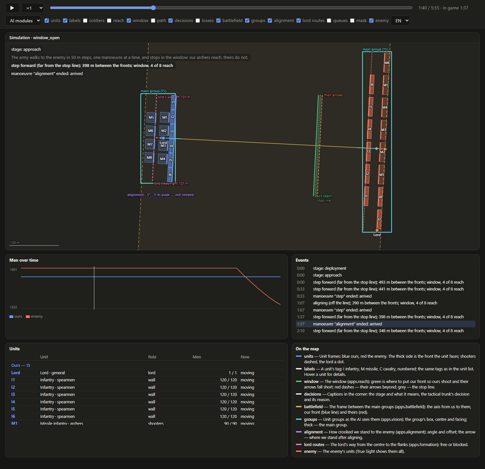
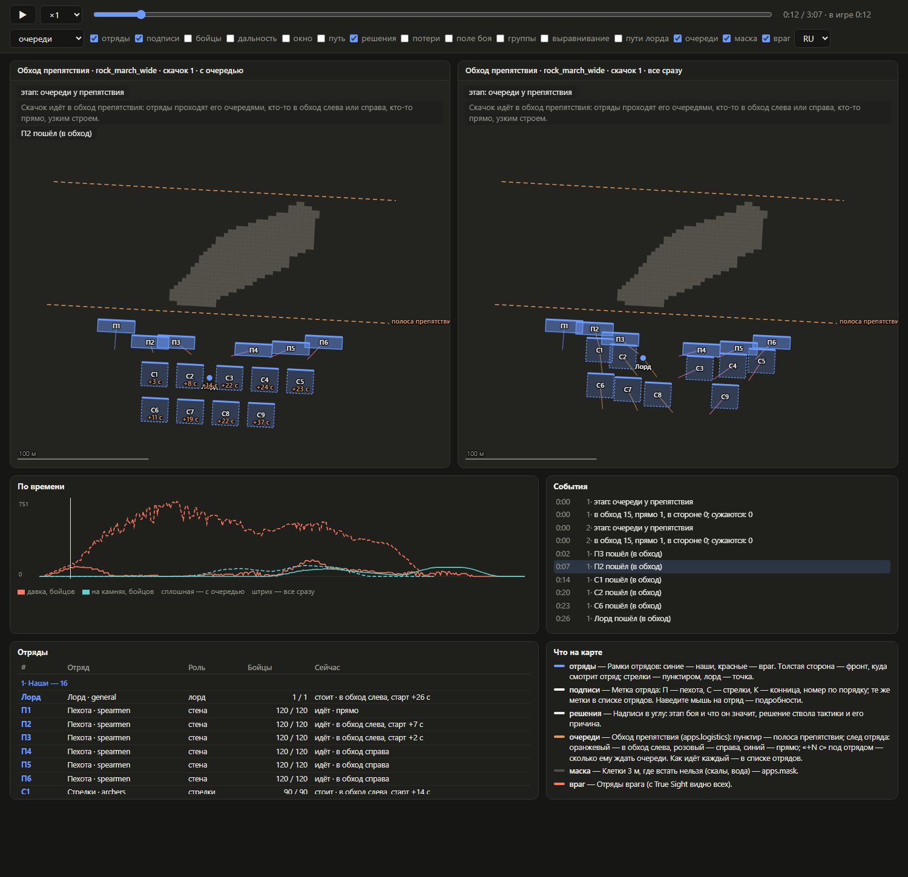
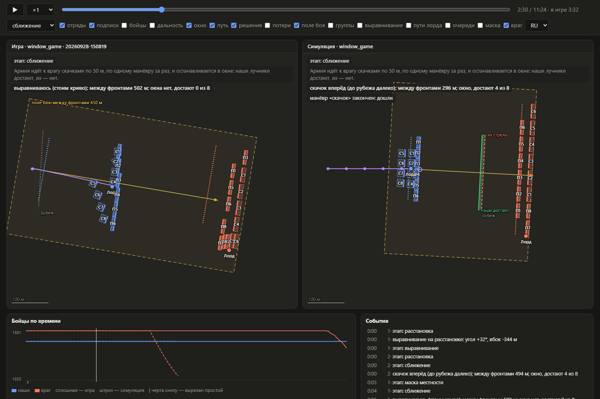
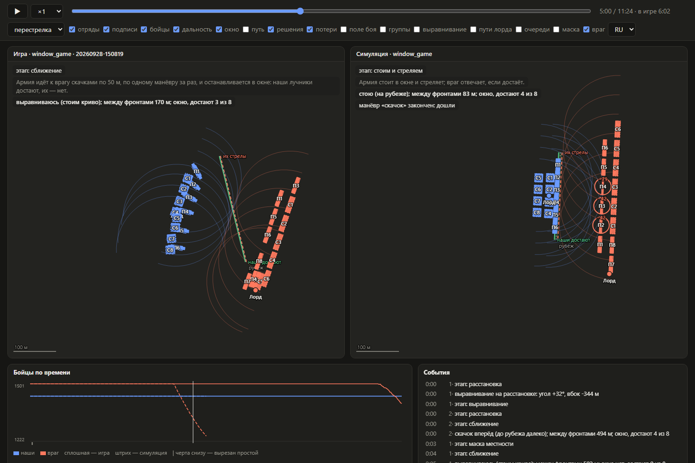
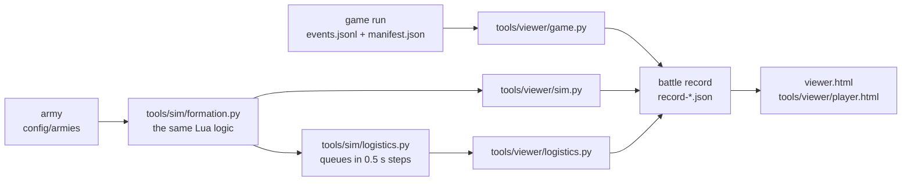

# Battle viewer

[← Back](README.md) · [Documentation](../README.md) › [Launch](README.md) › Battle viewer · [Русский](../../ru/launch/viewer.md)

A battle from the game or from the simulation, played on a web page in real time: pause, speed, scrubbing, layers to choose, what the AI's modules saw.



*Simulation `window_open`, preset "AI modules". Yellow dashes: the battlefield between the main groups
(`apps.battlefield`); the arrow is its axis. Teal boxes: groups as the AI sees them (`apps.vision`); the thick
one is the main group. Pink dashes: the lord's ways to the flanks (`apps.formation`). The purple caption: the
alignment (`apps.alignment`). Green and red lines: the window (`apps.reach`). Every unit has a tag: I
infantry, M missile. Below: events, the unit list and what each layer means.*

## How to run

```bash
python -m tools.viewer sim window_open --preset modules --lang en
```

| Command | What it does |
|---|---|
| `sim <army>` | a simulated army from `config/armies/` → `record-sim.json` and `viewer.html` |
| `game <run>` | a game run `build/<target>/runs/<run>` → `record-game.json` and `viewer.html` |
| `compare <run> [--army]` | the game and the simulation of its army side by side, on one clock |
| `logistics <army>` | every step of the army round an obstacle: with the queue and all at once side by side, a page per step (`step-1.html`, …) |
| `page <record.json> … --out <file>` | any records side by side on one page |

Common flags:
- `--out DIR` — where to write. The default is `research/analysis/viewer/<name>/`, which is kept out of Git.
- `--preset approach|modules|fire|logistics|debug` — the layers on opening.
- `--lang ru|en` — the language on opening; the page has an RU/EN switch.

For the game there is also `--idle-s 5`: stretches where nothing moved for longer than that shrink to a second.

`viewer.html` is a single file: the records are inside, no server is needed, and it opens with a double click.

## What is on the page

| Part | What it shows |
|---|---|
| Map | units and layers; every unit has a tag: I1…I6 infantry, M1…M8 missile, C cavalry, "Lord" |
| Corner captions | the stage, **what it means** in plain words, the tactical trunk's decision and its reason, a manoeuvre's end |
| Tooltip | hover a unit: type, name, side, role, men, moving or standing, reach, arrows, its place in the queue |
| Units | who takes part: every unit of both sides with its tag, type, role, men now and what it does; a row highlights the unit on the map |
| On the map | what each layer that is on means, with its colour |
| Chart | men of both sides over time; for queues, crowding and soldiers on blocked cells |
| Events | every event in time; a click scrubs to it |

## Controls

| What | How |
|---|---|
| Play and pause | the ▶ button or space |
| Speed | ×0.5 … ×20; ×1 is the battle's real time |
| Scrubbing | the slider, ← and → by 5 s, a click on the chart or an event |
| Zoom, pan | mouse wheel, drag; double click — the whole battle |
| Language | RU / EN at the top right |
| Link to a moment | `viewer.html#preset=fire&t=300&lang=en` — preset, second, language |

## Layers and presets

| Layer | What it draws | Module or source |
|---|---|---|
| units | unit frames, the thick side is the front; shooters dashed, the lord a dot | centre, facing, width; depth from the unit's shapes |
| labels | the unit's tag (I1, M3, Lord); in queues "+N s", the wait | type by unit class |
| soldiers | soldier dots | game: `soldiers_dm` snapshots; simulation and enemy: laid out evenly |
| reach | the first arrow's arcs in front of shooters | `apps.reach.first_arrow_m` (130 m → 126 m) |
| window | where our front will stand: "ours reach", "their arrows", the stop line | `apps.reach.window` in the trunk's decision |
| path | the army centre's trail, decision points, the step's target | frames and decisions |
| decisions | the stage and its meaning, decision and reason, a manoeuvre's end | `apps.tactics` |
| losses | "−n" above a unit; a red ring — it lost men in the last 3 s | men in the frames |
| battlefield | the frame between the main groups, its axis, our front and theirs | `apps.battlefield` |
| groups | group boxes, centre, facing; the main one thick | `apps.vision` |
| alignment | angle and offset, whether needed; the arrow — where we will stand | `apps.alignment` |
| lord routes | the lord's way from the centre to the flanks, length, free or not | `apps.formation` |
| queues | the obstacle band, each unit's trail: left, right or straight | `apps.logistics` |
| mask | 3 m cells where no unit can stand | `apps.mask` |
| enemy | the enemy's units (True Sight shows them all) | the run or the enemy's placement |

| Preset | Layers |
|---|---|
| approach | units, labels, path, window, decisions, enemy, battlefield |
| AI modules (`modules`) | units, labels, battlefield, groups, alignment, lord routes, window, decisions, enemy |
| fire | units, labels, soldiers, reach, window, losses, decisions, enemy |
| queues (`logistics`) | units, labels, queues, mask, decisions |
| everything (`debug`) | every layer |

The record keeps what the modules saw at every decision. The battlefield and the groups are stored at the
start of the approach and after every manoeuvre, so scrubbing shows how they changed. Game runs log the
battlefield and the alignment at deployment only, for now.

## Round an obstacle in queues

```bash
python -m tools.viewer logistics rock_march_wide --lang en
```



*A long wall (16 units) goes round a rock. Left: with the queue (`apps.logistics`). Units pass one by one;
shooters show "+N s", their wait. Right: all at once, and the units bunch up at the rock. The chart shows
crowding (soldiers of two units closer than 1 m) and soldiers on blocked cells; solid is with the queue,
dashes all at once.*

Here the motion is real, not a jump. `tools/sim/logistics.py` walks every unit in 0.5 s steps by the orders
of `apps.logistics`'s dispatcher, as in battle, and a frame is written every second. The enemy is not in
this record: it plays no part in the queue.

## Game and simulation side by side

```bash
python -m tools.viewer compare build/formation-probe/runs/20260928-150819
```



*One battle (`window_game`) on one clock: the game run on the left, the simulation on the right. In the game
the army is still aligning, because the enemy re-forms (task 26). In the simulation the army already walks
to the window in steps.*



*The same battle's exchange of fire. Solid lines on the chart are the game, dashes the simulation. The
simulation kills clearly more than the game: missile damage is yet to be calibrated (phase 3).*

## The battle record

One JSON per battle, the same for the game, the simulation and the queues (`tools/viewer/record.py`,
version 2). Everything a person reads is written in both languages: `{"ru": …, "en": …}`.

```text
format, version        "tww3-battle-record", 2
meta                   source (game | sim | logistics), name, title{ru,en}, army, strategy, skipped, duration_ms
units                  id (side:name), side, role (wall | arc | lord), kind (class), key, title,
                       type{ru,en}, tag{ru,en}, men_max, range_m, reach_m
frames[]               t_ms (the player's clock), game_ms (the battle's clock),
                       units[]: id, x, z (block centre), bearing, front_m, depth_m, men, moving, ammo
soldiers{id: [...]}    soldier snapshots: t_ms, pts — [across, forward, …] in decimetres in the unit's frame
events[]               stage | decision | manoeuvre | note: t_ms, text{ru,en}; a decision also gap_m, stop_gap_m, advance_m, window
overlays[]             what the modules saw: field | groups | alignment | routes | logistics, t_ms and data;
                       each holds until the next of its kind
series[]               chart lines: name{ru,en}, points [[t_ms, value], …]
mask                   the grid's frame and rows of cells ('#' — cannot stand) or null
```



**Game.** Frames come from every event with units (`stage_snapshot`, `approach_sample`, `approach_manoeuvre`,
`hold_sample`), about every 2 s. When an event has no enemy, the last one that had it is used. Between
frames the page moves the units evenly.

**Simulation.** Every manoeuvre is walked in time, as the engine would ([walker](../testing/simulator.md#walking-as-in-the-game):
round rocks, a block facing its way). A frame every second. The enemy stands still, as the game's AI did in
the test battle. The exchange of fire (`fire_s` in the army) is a frame a second from `apps.missile`.

**Unit tags** come from the unit class (`inf_mel`, `inf_mis`, `cav…`, `com`), not from unit keys, so any
army works. Numbers run in order within a side and a type.

## Checks

`tests/tools/test_viewer.py`:
- **Game run.** A small run becomes a valid record. The enemy is carried to frames that did not have it. A unit's depth comes from its shape. Still time is cut. Soldiers are kept in the unit's frame. A decision keeps its window and step.
- **Modules in the game.** The game's battlefield and alignment become overlays.
- **Units and languages.** Units have a type, a tag and a title. Everything a person reads is in both languages, and the check catches a text in one language.
- **Simulation.** A record of the same format. A manoeuvre takes its walking time. Block centres are the same as in the game. The battlefield and the groups are there at the start and after every manoeuvre. The lord's route starts where the lord stands.
- **Round an obstacle.** Two records: with the queue (someone waits) and all at once (nobody waits). A frame every second, no enemy.
- **Page.** It carries the records inside and opens without a server.
