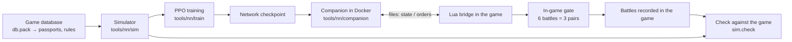

# Project summary

[← Back](README.md) · [Documentation](README.md) › Project summary · [Русский](../ru/summary.md)

This page is a short map of the whole project: what it does, its parts, the state of each part
and where to read the details. It is read first after a context loss; the detailed pages only
for the current task. The numbers here are the latest at the time of the edit; fresh numbers of
a training step come from the run card (`tools.ops.card`), fresh in-game numbers from
`build/nn-gate/<time>/summary.json`.

## What the project is

A neural network that commands an army in Total War: WARHAMMER III battles. It learns from
scratch in our battle simulator (PyTorch, thousands of battles at once on the GPU) and then plays
real battles in the game against the game's AI at Normal difficulty. Two factions for now: the
Empire and the Skaven, a flat empty map, a lord and up to 19 units a side. The goal is a network
that beats the game's AI in ≥ 97 % of battles and plays "in character" for its faction
([idea and readiness](training/network.md)).

The main problem now: **in the simulator the network beats our scripts, in the game it loses
every battle**. So the simulator still differs from the game noticeably, and the network learns
things that do not work in the game. Hence the work runs in a loop: fix the simulator at the
largest measured gap → train to a plateau → 6 battles in the game → analyse the recordings → the
next fix.

## Battle simulator

**What it does.** Plays a battle as the game does: every unit is one object (men, health,
place, facing, morale, fatigue, projectiles), not every soldier. A step is 0.5 s (the game's
morale tick). A step: orders, unit contacts, effects and abilities, blows and shots, losses,
morale, fatigue, movement, the end of the battle (a side with no standing units loses; after
60 minutes the defender wins). Speed: ~590 battles a second on an RTX 5070 Ti (4096 at once).

**Where the numbers come from.** The game's database first (`config/nn/game_rules.json`, unit
passports `config/nn/units.json`, effects `config/nn/effects.json`, abilities
`config/nn/abilities.json`). Where the game behaves otherwise, a number is fitted to
measurements, with its reason in `config/nn/sim.json`. Any change in `config/nn` or
`tools/nn/sim` changes the "simulator version": the next evaluation plays the scripts' battles
again — the baselines and the drill check scripts, ~8 min on the CPU beside the network's battles
(`tools/nn/train/refs.py`; ahead, while the previous step runs: `tools.ops.baselines --run`) — unless
the "canary" (the baseline's first 32 pairs) adopts the old ones.

**Already modelled:** speeds, formation, contact and leaving melee, hit chance (flat: slope 0.1
instead of the database's 1), damage and armour, charge and spear bracing, flank and rear
(fitted: flank costs more than rear), volley fire, friendly fire and spill, lords (at most 9
men hit them), morale with all main modifiers, rout, rally, army collapse (−120 by the
database's strategic strength), flank-threat flags, fatigue, units' innate effects, lord
abilities.

**Fatigue** (switched on by the latest change): 10 ticks a second; melee tires only a unit with
an attack order (single entity +19 a tick, formation 13.7), shooting 7.5, walking 3.4, idle −18.
Exhausted shares as in the game: own 16.8 % (game 17.3 %), enemy 28.7 % (game 28.6 %).

**Check against the game** (`python -m tools.nn.sim.check`): every battle recorded in the game
is replayed in the simulator from its recorded orders (8 copies with starts shifted up to 2 m,
the outcome by majority) and measured by the same code as the game. The set of recordings is
frozen. Three scores, higher is better:

| Score | Now |
|---|---:|
| Mechanics: unit pairs and shooting within 20 % of the game | 51 / 54 |
| Same winner: the game's AI against itself | 22 / 26 |
| Same winner: the network against the game's AI | 96 / 132 |

**Gate replay** — the in-game gate battles replayed in the simulator (both sides from the
recording). Gold trade at the game's end time: game −0.26…−0.41, simulator −0.05…−0.24 on the
same battles. **The simulator is too kind to the network** — the main measured gap.

**Known not to match the game** (details:
["What is missing"](training/simulator.md#what-is-missing)):

- the game AI's army routs twice as often in the simulator (1.9 times a battle against 0.92):
  it loses more health in melee (0.45 against 0.38);
- shooters in battle fire slower than on the range (0.05–0.07 projectiles per man per second
  against 0.087–0.091 in the simulator);
- the enemy lord breaks too easily (97 % of battles against 25 %), and our lords fall 130–145 s
  earlier than in the game;
- in the game fights are short and often break off (median 17 s), in the simulator they do not
  (21–112 s); what triggers leaving melee is unknown;
- morale right at contact and the open-flank flags match only partly;
- army collapse finds 58 of 65 onsets in the recordings, but in a free battle its time drifts;
- order delay in the game is 0.6–0.8 s in small battles, 0.36 s in the simulator;
- the second wave of units (Flagellants, Greatswords, militia, Skavenslaves, shielded Clanrats,
  Night Runners) is not checked against recordings;
- not modelled: terrain, forests, visibility (`vis` is always true), cavalry, monsters, magic,
  flying, artillery, experience ranks. Hit chance and the casualty window are fitted, not taken
  from the database ([conflict table](game/mechanics/README.md#conflicts-with-our-simulator)).

Pending: the flank attacker by its own front (right for a lone attacker, but worsens the early
trade and breaks the `counter` drill).

Details: [simulator](training/simulator.md) · [unit passports](training/units.md) ·
[in-game measurements](training/measurements.md) · [game mechanics](game/mechanics/README.md) ·
[game database](game/database.md).

## The network

One network for all factions and both roles (attack or defence is an input). It sees only what a
human would: own units fully, enemies while visible, and only their morale state, never the exact
percentage. Every unit is a "token" (a row of 149 numbers: the database passport, the state, the
effects). Then: a shared encoder → 3 attention layers with a distance bias → memory (GRU) →
"heads" for every own unit: order kind (hold / move / attack / withdraw / keep), point (16
directions × 8 distances), target (a pointer to an enemy), run, ability. The network never sees
the time to the battle's end. Sizes: `small` 0.85 M weights, `wide` 3.23 M. The chain is on
`wide` now; it was made from a trained `small` by widening, not from scratch.

Details: [inputs and model](training/model.md) · [idea](training/network.md).

## Training

**How it runs.** PPO in the MAPPO scheme: each unit is an agent, all units of a side share its
advantage, the critic (position evaluator) sees the whole field and never goes into the game.
1024 battles at once, a decision every second, orders arrive 0.36 s later on average, as in the
game. Speed ~9,900 s of battle per second of training. Battles are
[random armies](training/armies.md): equal budget (±5 %), a lord and 0–19 units, ¾ of armies
from the game AI's templates, numbers jittered ±15 %.

**Reward:** win ±1; gold trade every step (enemy gold we destroyed minus our own, over the
budget; a unit's loss counts once, at its worst state); lord fall 0.3 (a shattered lord counts
as dead); an idle cost for the attacker that grows while it deals no damage; small costs for
changing an order or a target (against jitter).

**Opponents** (chain shares): `nearest` 35 %, `ai_like` 30 % (a script fitted to the game's AI
on 110 battles), `hold_shoot` 15 %, past versions 10 %, `hold` 5 %, self-play 5 %. The game's AI
takes no part in training: it is the independent check.

**The chain.** Every step starts from the previous step's last checkpoint. A leash (a KL penalty
of 0.03 for drifting from the step's start) moves forward every 600 s: without a leash training
collapses. A step is 20–25 minutes, evaluated every 5–10 minutes. Standing options are in
`config/train-chain.json` (now also drills on 20 % of battles and the `auto` teacher in drills
and in normal battles). `tools.ops.step` builds a step's command, `tools.ops.card` shows its
result ([workflow](training/workflow.md)).

**Fair metrics** (the factions are unequal, so a bare win rate says little about the network):

| Metric | Meaning | Direction |
|---|---|---|
| Rating (logit) | one fit over all battles, corrected for the faction pair and the role; 0 — even, +0.4 ≈ 60 % | higher is better |
| Pair gold | every battle is played twice with the armies swapped; (destroyed by us − destroyed by the opponent) / budget | positive — we trade better with the same armies |
| Exchange | the same as a ratio | above 1 is better |

The last finished step before the new fatigue (`s5_threat`, 20 min): rating +0.47 ± 0.11, pair
gold against `ai_like` +0.14 (exchange ×1.22), against `nearest` +0.16, against `hold_shoot`
+0.19; the own lord dies in 0.28 of battles. The next step (`s6_fatigue`) is the first on the new
fatigue; the simulator version changed, so the scripts' battles were replayed.

Details: [training](training/training.md) · [workflow](training/workflow.md).

## Drills

A drill is battles for one skill. A **frame** is the battle's condition; every battle inside it
is generated from a seed (units, distances, place on the map). The drill's enemy is a script.

- **Frame check** (`drills/verify.py`): a naive script must clearly lose (≤ 0.25 wins), a
  skilled script must clearly win (≥ 0.75). Only passing drills are in `READY`: `kiting`
  (shooters run from infantry), `counter` (go for the enemy you beat), `hold_fire` (do not shoot
  into the melee around the enemy lord). Trained by default: `kiting` and `hold_fire`; `counter`
  hurts in normal battles. `pincer`, `defend`, `reserve` are not ready.
- **Three kinds of frames:** clean, broad (more extra units) and embedded (the situation inside
  a normal battle, so the network cannot tell a drill from a normal battle).
- **Teacher:** the skilled script labels actions and a weak imitation term is added to the PPO
  loss. The `auto` mode turns it on exactly as much as the network lags the script and off once
  it catches up. `teach-normal` does the same in normal battles, by the transfer gap.
- **Transfer to normal battles** (`drills/transfer.py`): winning a drill is not enough, the
  skill has to be applied in a normal battle. Applied share — higher is better; mistake share —
  lower is better; `ai_like` is the reference.

Now (`s5_threat`): the drills are won (kiting 0.95, counter 1.00, hold_fire 0.84). Applied share
in normal battles: kiting 0.46 against 0.70 for `ai_like` (0.003 before the teacher), counter
0.43 against 0.54, hold_fire 0.83 against 0.31 (here the network beats the reference).

Details: [drills](training/training.md#drills).

## Bridge and companion: how the network plays in the game

- **The bridge** is Lua inside the game (`src`, entry point `nn_arena`). Every second of battle
  it writes the state of all units to a file and checks the orders file every 100 ms. Files are
  written to a temporary name and renamed, so nobody reads half a file.
- **The companion** (`tools/nn/companion`, in the Docker container `snake-ai-trainer`) reads the
  state, brings it to the simulator's form (order point, running, target), builds one side's
  input, runs the network and writes orders. State to orders ~40 ms at ×20 speed, no misses.
- **What the network does:** hold, move, withdraw, attack a target, run, lord abilities. The game
  runs routing and shattered units. The bridge itself re-issues an order after a rally and when
  stuck, re-aims shooters, sends shooters without ammunition into melee.
- **Launching a battle:** the pack build (`tools.build`), the launcher sets **Normal**
  difficulty and restores the player's settings byte for byte; one battle per game launch
  (~2 min with loading). The True Sight mod is required.

Details: [bridge](apps/bridge.md) · [watch a network battle](launch/watch.md) ·
[run](launch/run.md) · [build](launch/build.md) · [in-game modules](apps/README.md) ·
[project layout](architecture/overview.md).

## In-game check (gate)

The network against the game's AI at Normal difficulty; armies from the generator on held-out
seeds the network never saw. Battles go in **pairs**: the same seed twice, in the second battle
the network takes the opponent's army. After every plateau — **6 battles = 3 pairs**
(`tools/launcher/gate.ps1 -Battles 6`; one pair is the big Skaven-vs-Empire battle). Reading a
pair: 2–0 — the network is smarter than the AI with both armies; 1–1 — the army decides, look at
pair gold; 0–2 — the AI is better with both armies, analyse the recordings. Pair gold is
computed from the units' final state × passport cost.

The latest gates — all three **0 of 6**, every pair lost both:

| Gate | Checkpoint | Wins | Pair gold (95 %) | Exchange |
|---|---|---:|---:|---:|
| 20261004-230630 | `s2_turn100/m15` | 0 / 6 | −0.62 (−1.01…−0.23) | ×0.41 |
| 20261005-031306 | `s3_incid/m20` | 0 / 6 | −0.69 (−0.94…−0.43) | ×0.37 |
| 20261005-071054 | `s4_collapse/m5` | 0 / 6 | −0.65 (−0.82…−0.48) | ×0.39 |

So the game's AI trades about 2.5 times better with the same armies. These gates' recordings
are the basis for finding the simulator's gaps (gate replay above).

Details: [in-game check](launch/gate.md) · [the game's own AI](game/game-ai.md) ·
[difficulty](game/difficulty.md).

## Where things are

| What | Where |
|---|---|
| Working rules | `CLAUDE.md` at the root |
| In-game code (Lua) | `src/apps`, `src/entries`; tests without the game — `tests/` (pytest + lupa) |
| Simulator, training, network, companion | `tools/nn/sim`, `tools/nn/train`, `tools/nn/model`, `tools/nn/companion` |
| Simulator numbers | `config/nn/` (part of the simulator version) |
| Chain options | `config/train-chain.json` (outside the version) |
| Runs, checkpoints, script baselines | `build/nn-train/` (not in Git) |
| Gates | `build/nn-gate/<time>/summary.json` (not in Git) |
| Orchestrator tools | `tools/ops`: `step`, `card`, `leftovers`, `wait.sh` |

All documentation sections: [contents](README.md) · [data for training](training/README.md) ·
[game knowledge](game/README.md) · [research archive](research/README.md).
