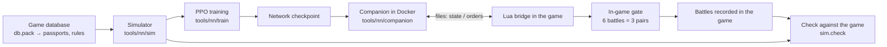

# Project summary

[← Back](README.md) · [Documentation](README.md) › Project summary · [Русский](../ru/summary.md)

This page is a short map of the whole project: what it does, its parts, the state of each part
and where to read the details. It is read first after a context loss; the detailed pages only
for the current task. The numbers here are the latest at the time of the edit; fresh numbers of
a training step come from the run card (`tools.ops.card`), fresh in-game numbers from
`build/nn-gate/<time>/summary.json`.

## What the project is

A neural network that commands an army in Total War: WARHAMMER III battles. It learns from
scratch in our battle simulator (PyTorch, thousands of battles at once on the GPU) and then plays
real battles in the game against the game's AI at Normal difficulty. Two factions for now: the
Empire and the Skaven, a flat empty map, a lord and up to 19 units a side (21 units and 2 lords in the pools:
since 07.10 the third wave - the Empire's handgunners and crossbowmen, the Skaven's clanrats, stormvermin and Night
Runners with throwing stars, [passports](training/units.md#handgunners-crossbowmen-clanrats-stormvermin-throwing-stars)). The goal is a network
that beats the game's AI in ≥ 97 % of battles and plays "in character" for its faction
([idea and readiness](training/network.md)).

The main problem now: **in the simulator the network beats our scripts, in the game it loses
every battle**. So the simulator still differs from the game noticeably, and the network learns
things that do not work in the game. Hence the work runs in a loop: fix the simulator at the
largest measured gap → train to a plateau → 6 battles in the game → analyse the recordings → the
next fix.

## Battle simulator

**What it does.** Plays a battle as the game does: every unit is one object (men, health,
place, facing, morale, fatigue, projectiles), not every soldier. A step is 0.5 s (the game's
morale tick). A step: orders, unit contacts, effects and abilities, blows and shots, losses,
morale, fatigue, movement, the end of the battle (a side with no standing units loses; after
60 minutes the defender wins). Speed: ~590 battles a second on an RTX 5070 Ti (4096 at once).

**Where the numbers come from.** The game's database first (`config/nn/game_rules.json`, unit
passports `config/nn/units.json`, effects `config/nn/effects.json`, abilities
`config/nn/abilities.json`). Where the game behaves otherwise, a number is fitted to
measurements, with its reason in `config/nn/sim.json`. Any change in `config/nn` or
`tools/nn/sim` changes the "simulator version": the next evaluation plays the scripts' battles
again — the baselines and the drill check scripts, ~8 min on the CPU beside the network's battles
(`tools/nn/train/refs.py`; ahead, while the previous step runs: `tools.ops.baselines --run`) — unless
the "canary" (the baseline's first 32 pairs) adopts the old ones.

**Already modelled:** speeds, formation (each unit's step from its formation template in the database),
contact and leaving melee (ordered away, a missile unit is held 5 s; a unit without a missile weapon walks
out unless it is chased; **the chase** - a unit with an attack order on the leaver follows it and strikes
it, so a chased unit stays in contact until the 24 s window, as in the game), pursuit of routers. **Melee
is by the game's formulas now** (the melee core): hit
chance 35 + attack − defence at weight 1 for everyone (a miss costs 0.5 s: a man lands p / (p × interval
+ 0.5) hits a second), damage — armour-piercing in full + base less the armour roll, overkill beyond a
man's health is lost (smoothed), melee kills — **the wounded pool** (the wounded among the living at most
the men in contact × the health a blow leaves; the rest is whole men), missile kills — hits
spread evenly over the living, each man with his own health, a lord's blow is divided by 4 and
hits an average of 2.07 men, flank and rear — defence ×0.6 / ×0.3 (the flank is an enemy beyond 45° of the
front, the rear beyond 135°, by CA), charge — only the charge bonus, on an attack order with a run-up
towards the target, 13 s on its own clock, spearmen's charge reflection ×2 for 3.9 s (not cut by the hold
share); no charge into a target already fighting our units (the path is blocked by friends); the fitted
"slope 0.1", "charge blow" and "bringing men in" are gone. Melee core 2 (the game's rules, no fitting):
**the first strike** - a unit coming into a fight moving or charging, and a standing unit an enemy
reaches, strike once at once with every man in contact (the interval runs only after a blow); **the
charge sprint** - under any attack order, at a walk too, the last 30 m (lords 35) at the database's
charge speed; abilities' initial recharge from the database. A formation under hold, or under a move while
in contact, strikes at 0.5 (fitted on the melee probe: no rule for the rate). Shooting by the game's rules ([missile probe](game/units/missile-probe.md), 10 battles): volleys once a cycle (archers 10 s = the database, sling 11.5, Night Runners 10.2, militia 10.8: measured), range centre to centre, each man's fire arc ±30° (militia ±35°), no turn when firing at will, 3 s after a target change and after taking a target "from none", re-aim: a man whose target died aims again, and the volley waits; hits from the database's spread model with no fitted number (spread in the plane across the line of fire, the calibration area an area in m²; the probe: error 0.096 against 0.171 with the old fitted k 1.1), a shield against small arms only, the line of fire with the True Sight mod; friendly fire and spill, lords (at most 6.5 men hit them, gathering over
20 s only when the lord himself ran into the formation; a lord without an order strikes in full; the lord as fragile as in the game: his own aura does not reach him, in melee he is
always 'losing' (−3), projectiles hit him whole in melee; he tires by the database (+19 a tick), Foe-Seeker restores 1 %
of the maximum vigour a second; Wounds - 5 s after 25 % health speed x0.9, damage x0.8 to the end; a lord duel: General v
General x0.8 of the game, Warlord v Warlord x1.2), morale with all main modifiers by the game's rules (the 4 s and 60 s casualty windows and 'under fire' 15 s; by the morale probe of 06.10: flank / rear −6 / −14 while struck; 'flanks secure' +5 with no enemy within 146 m or friends at both sides; the charge +15 in 6 + 6 s blocks; winning by shooting too, from 10 % lost; a strong enemy worth 3×; a router's morale follows its target, the rally with no living enemy (routing ones too) within 95 m, after at least 18 s of rout and for 7 s in a row (measured on the recordings), [simulator](training/simulator.md#morale-by-the-games-rules-the-morale-probe); a lord's death: his army
−16 for 45 s, then −10; his rout on the field: the aura only), rout, rally, a unit's shattering by the database's rules (the morale floor −50 —
always; on the 1st / 2nd rout below 0.05 / 0.10 health; at the 3rd rout), army collapse (−120; the strength is the database's combat potential:
melee_cp + the abilities' potential + missile_cp by the ammunition left, × health - as the recorded `strategic_value`),
turning on the move at the model's turn rate from the database (a formation about-faces where it stands and runs the
way it faces), leaving melee with the database's 24 s window (one still in contact drops its order and fights),
flank-threat flags, fatigue, units' innate effects (Strength of the Penitent fires by itself when ready, in melee;
its 3 s recharge stands only while the unit wins its melee; auras from a routing lord too and on routers; the edge centre to
centre 35 m, probe T-E2), lord
abilities (the game's AI fires them by a measured rule: the speed ones in melee, Stand Your Ground only
next to friends, Deadly Onslaught never; Stand Your Ground is laid at the cast - those that got it keep it 18 s
anywhere, Rally is an aura following the lord; the database's `update_targets`).

**Fatigue** (switched on by the latest change): 10 ticks a second; melee tires only a unit with
an attack order (single entity the database's +19 a tick, formation 13.7 - measured; a charge +34 for everyone only in
the first 2 s after the charge blow), shooting 7.5, walking 3.4, idle −18; Foe-Seeker −300 points/s while active.
Exhausted shares (replay of the 204 recordings): own 14.9 % (game 17.3 %), enemy 25.8 % (game 28.6 %);
lords 13.6 / 25.3 % (game 22.0 / 22.9 %).

**Check against the game** (`python -m tools.nn.sim.check`, ~12 min on 8 CPU cores): every battle recorded in
the game is replayed in the simulator from its recorded orders 19 times with starts shifted up to 2 m and
measured by the same code as the game. The 19 copies are the simulator's forecast. The main score is **the share
of game values inside the copies' 90 % interval** (`tools/nn/simskill.py`): 90 % for a simulator that matches the
game, its noise included. Beside it the CRPSS skill (how much better the copies are than "the typical game value":
0 no better, 100 % exact) and the old counts; in brackets — before the shooting, melee and whole-battle rules ([how it is computed, the worst
quantities, the old count's errors](training/simulator.md#the-checks-score-the-simulator-as-a-forecast)). The
set of recordings is frozen.

| Family | Inside 90 % | Skill | Old count |
|---|---:|---:|---|
| Mechanics: unit pairs and shooting (18 recordings) | 22 % (before the shooting, melee and whole-battle rules 20 %) | -65 % (-69 %) | 27 / 54 within 20 % (28 before probes P1–P4; 25 before these rules, without repeats 23 / 48; 24 before the charge fix; 51 before the melee core; core 2 - 37; shooting by the rules - 29; morale by the rules - 24) |
| The game's AI against itself (28) | 43 % (35 %) | -37 % (-52 %) | same winner 15 / 26 (39 % / -41 % before shooters released from routers; 16 before probes P1–P4; 16 before these rules; 20 before the core, the core 21, core 2 and shooting 18, morale 16, movement and lords 15) |
| The network against the game's AI (170) | 40 % (40 %) | +23 % (+24 %) | same winner 134 / 169 (137 and +24 % before shooters released from routers; 132 before even missile kills; 139 before probes P1–P4; 139 before these rules; 126 before the core, the core 127, core 2 and shooting 132, movement and lords 137) |
| Gates: the network itself against ai_like (10 battles, 8 copies) | 80 % (80 %) | +7 % (+7 %) | - |

Probes P1–P4 and the whole-battle probes (`build/probes7`, 12 battles in the game): pistol range by ranks, a rally without the 7 s wait, a move order through the enemy is not a melee exit; before them mechanics 22 % / -68 %, the game's AI 37 % / -31 %, the network 37 % / +22 %; without the exit rule the game's AI 39 % / -35 %, the network 38 % / +22 %. Missile kills — hits evenly over the living (`kills.missile_uniform`, `build/open2`): before them the game's AI 36 % / -42 %, the network 39 % / +23 %, mechanics the same.

By batch (shooting; melee and whole battle) and the worst quantities —
[the score by change](training/simulator.md#the-score-by-the-shooting-melee-and-whole-battle-changes). The
confidence intervals before the changes: mechanics 14-26, the game's AI battles 30-41, network battles 38-43,
gates 76-84.

The shortfall from 90 % comes mostly from the copies being too alike: their spread is a third of their miss (a
hundredth in mechanics): the game is noisy, the simulator computes averages. The "same winner" count of
coin-flip battles is noise: the same code on the GPU and the CPU gets different battles.

Mechanics dropped from 51 to 37 not because of winners (all 12 pairs are as in the game) but because of
pace: the first 15 s of formation contact are stronger in the game than the rule (the target loses
499–764 HP, the rule gives 396–446; the fitted "charge blow" used to cover this), and lords against one
unit hit 13–31 % harder than the game, ending their pairs sooner. The melee probe (11 in-game battles, the
same scenario in the simulator) found where the difference is: a volley in the first second of a charge's
contact, after which the pace is the rule's; an attack at a run and at a walk covers the last ~30 m at
charge speed; the bonus against infantry counts against a lord on foot. Melee core 2 put these in as rules:
the simulator's first second of a charge 107–429 HP (was 27–86, game 78–300), an attack at a walk is a
charge. The charge sprint cost three whole battles of the game's AI (Skaven against the Empire: 8 of 10
without it, 5 with it) - whole battles show no sprint before contact; OPEN. The other mismatches are OPEN
([melee](game/mechanics/melee.md#in-game-check-the-melee-probe)). The Empire's whole-battle losses
at 60 / 120 / 180 s are now as in the game: 0.25 / 0.43 / 0.55 (game 0.25 / 0.41 / 0.53; was 0.32 / 0.51 /
0.63).

**Gate replay** — the in-game gate battles replayed in the simulator (both sides from the
recording). Gold trade at the game's end time: game −0.26…−0.41, simulator −0.05…−0.24 on the
same battles. **The simulator is too kind to the network** — the main measured gap.

**Known not to match the game** (details:
["What is missing"](training/simulator.md#what-is-missing)):

- the game AI's army routs twice as often in the simulator (1.9 times a battle against 0.92):
  it loses more health in melee (0.45 against 0.38);
- shooters in battle fire slower than on the range (0.05–0.07 projectiles per man per second
  against 0.087–0.091 in the simulator before each man's arc and the target-change pause; skipping volleys as the
  target thins - now re-aim); hits on a thinned target fall more in the game than in the model (archers on slaves:
  model 0.73 a shot, game 0.50 - probe P1); a target running at the shooter takes x1.2 a shot (P3); the pistols'
  per-man range (P2) - open;
- the enemy lord breaks too easily (97 % of battles against 25 %), and our lords fall 130–145 s
  earlier than in the game;
- in the game fights are short and often break off (median 17 s), in the simulator they do not
  (21–112 s); what triggers leaving melee is unknown;
- morale right at contact and the open-flank flags match only partly;
- army collapse: the combat-potential strength catches the onset in the recordings in the same second in 0.94 of
  cases, but in the replay army destruction comes by the end in 0.15 of the battles against 0.96 in the game - the
  losing army in the replay loses health too slowly in the last two minutes;
- leaving melee: an unchased leaver in the simulator is out of contact ~2 s after the order (game ~4-4.5 s: during
  the about-face the formation turns as a rectangle); whether the chase holds missile units 5 s - open;
  a formation turning 90 deg on the move starts slower in the game (it re-forms);
  the Warlord on a facing order turns 75 deg/s against 180 in the database; a formation in melee tires ~110-120
  points/s for the first 50 s, then ~210/s, and the charge tires before contact too;
- rallied units rout again 10 / 45 s after the rally in 0.11 / 0.40 of cases (game 0.07 / 0.23; before the morale
  probe's rally rule 0.37 / 0.49); fewer routs a battle than in the game (16.8 against 22.5); the melee and
  whole-battle changes lowered the routs and rallies in the network's battles further (routs per unit 0.93, game
  1.30) - the cause is being measured; the game's own rally clock (rout length peaks at 18-19 and 36-37 s) - open
  (probe T-E);
- morale: the level of 'losing' in melee and the 'strong enemy' scale (the General next to slaves −9, ours −3) are open;
- melee: Stand Your Ground, fights with flagellants (both sides strike x1.4-2 the rule), the pair of CA's planner's
  spearmen - probes P1-P3; whether entering another unit's fight gives the charge bonus - a probe; CA's flank
  sectors are per man, ours a unit-level step;
- order delay in the game is 0.6–0.8 s in small battles, 0.36 s in the simulator;
- the second wave of units (Flagellants, Greatswords, militia, Skavenslaves, shielded Clanrats,
  Night Runners) is not checked against recordings; the third wave is checked by the missile probe
  ([results](game/units/missile-probe.md#the-third-waves-results-the-game--the-simulator-before--after-the-changes)): the
  handguns' and stars' reload and the stars' fire behind on the move are measured; open - handguns past the range (the
  game holds, the simulator's front ranks fire), fire past friends (the game fires at the full rate and hits its friends,
  the simulator holds) and fire into a melee at an angle (the share on friends three times the game's) - probes
  `rangenew`, `lofab` needed;
- not modelled: terrain, forests, visibility (`vis` is always true), cavalry, monsters, magic,
  flying, artillery, experience ranks. The casualty window is fitted, not taken from the database
  ([conflict table](game/mechanics/README.md#conflicts-with-our-simulator)).

Pending: the flank attacker by its own front (right for a lone attacker, but worsens the early
trade and breaks the `counter` drill).

Details: [simulator](training/simulator.md) · [unit passports](training/units.md) ·
[in-game measurements](training/measurements.md) · [game mechanics](game/mechanics/README.md) ·
[game database](game/database.md) · [indicator registry of our units](game/units/indicators.md) (the
game's rule and the simulator's status for every indicator; a new unit adds its own there).

## The network

One network for all factions and both roles (attack or defence is an input). It sees only what a
human would: own units fully, enemies while visible, and only their morale state, never the exact
percentage. Every unit is a "token" (a row of 150 numbers: the database passport, the state, the
effects, the fire arc). Then: a shared encoder → 3 attention layers with a distance bias → memory (GRU) →
"heads" for every own unit: order kind (hold / move / attack / withdraw / keep), point (16
directions × 8 distances), target (a pointer to an enemy), run, ability. The network never sees
the time to the battle's end. Sizes: `small` 0.85 M weights, `wide` 3.23 M. The chain is on
`wide` now; it was made from a trained `small` by widening, not from scratch.

Details: [inputs and model](training/model.md) · [idea](training/network.md).

## Training

**How it runs.** PPO in the MAPPO scheme: each unit is an agent, all units of a side share its
advantage, the critic (position evaluator) sees the whole field and never goes into the game.
1024 battles at once, a decision every second, orders arrive 0.36 s later on average, as in the
game. Speed ~9,900 s of battle per second of training. Battles are
[random armies](training/armies.md): equal budget (±5 %), a lord and 0–19 units, ¾ of armies
from the game AI's templates (shares by the game's template groups, the `group` rule since 07.10), numbers jittered
±15 %; rare rich battles above `budget_max` - option `budget_rare` (off).

**Reward:** win ±1; gold trade every step (enemy gold we destroyed minus our own, over the
budget; a unit's loss counts once, at its worst state); lord fall 0.3 (a shattered lord counts
as dead); an idle cost for the attacker that grows while it deals no damage; small costs for
changing an order or a target (against jitter).

**Opponents** (chain shares): `nearest` 35 %, `ai_like` 30 % (a script fitted to the game's AI
on 110 battles), `hold_shoot` 15 %, past versions 10 %, `hold` 5 %, self-play 5 %. The game's AI
takes no part in training: it is the independent check.

**The chain.** Every step starts from the previous step's last checkpoint. A leash (a KL penalty
of 0.03 for drifting from the step's start) moves forward every 600 s: without a leash training
collapses. A step is 20–25 minutes, evaluated every 5–10 minutes; the "before" evaluation is not played
again: it is the previous step's last one (the same network and code; [step speed](training/workflow.md#step-speed)).
Standing options are in
`config/train-chain.json` (now also drills on 20 % of battles and a teacher of kiting only, in normal
battles: `--teach-normal kiting`; the drills' teacher is off: [tried and rejected](training/training.md#the-drills-teacher-in-the-chain)). `tools.ops.step` builds a step's command, `tools.ops.card` shows its
result ([workflow](training/workflow.md)). A metric profile (`--profile`) picks what the evaluations
compute: always the rating, pair gold and lord deaths, the rest (drills, transfer, liveliness,
fatigue, capacity) by the run's question ([metric profiles](training/workflow.md#metric-profiles)).

**Fair metrics** (the factions are unequal, so a bare win rate says little about the network):

| Metric | Meaning | Direction |
|---|---|---|
| Rating (logit) | one fit over all battles, corrected for the faction pair and the role; 0 — even, +0.4 ≈ 60 % | higher is better |
| Pair gold | every battle is played twice with the armies swapped; (destroyed by us − destroyed by the opponent) / budget | positive — we trade better with the same armies |
| Exchange | the same as a ratio | above 1 is better |

The last finished step before the new fatigue (`s5_threat`, 20 min): rating +0.47 ± 0.11, pair
gold against `ai_like` +0.14 (exchange ×1.22), against `nearest` +0.16, against `hold_shoot`
+0.19; the own lord dies in 0.28 of battles. The next step (`s6_fatigue`) is the first on the new
fatigue; the simulator version changed, so the scripts' battles were replayed.

Details: [training](training/training.md) · [workflow](training/workflow.md).

## Drills

A drill is battles for one skill. A **frame** is the battle's condition; every battle inside it
is generated from a seed (units, distances, place on the map). The drill's enemy is a script.

- **Frame check** (`drills/verify.py`): a naive script must clearly lose (≤ 0.25 wins), a
  skilled script must clearly win (≥ 0.75). Only passing drills are in `READY`: `kiting`
  (shooters run from infantry), `counter` (go for the enemy you beat), `hold_fire` (do not shoot
  into the melee around the enemy lord). Trained by default: `kiting` and `hold_fire`; `counter`
  hurts in normal battles. `pincer`, `defend`, `reserve` are not ready.
- **Three kinds of frames:** clean, broad (more extra units) and embedded (the situation inside
  a normal battle, so the network cannot tell a drill from a normal battle).
- **Teacher:** the skilled script labels actions and a weak imitation term is added to the PPO
  loss. The `auto` mode turns it on exactly as much as the network lags the script and off once
  it catches up. `teach-normal` does the same in normal battles, by the transfer gap.
- **Transfer to normal battles** (`drills/transfer.py`): winning a drill is not enough, the
  skill has to be applied in a normal battle. Applied share — higher is better; mistake share —
  lower is better; `ai_like` is the reference.

Now (`s5_threat`): the drills are won (kiting 0.95, counter 1.00, hold_fire 0.84). Applied share
in normal battles: kiting 0.46 against 0.70 for `ai_like` (0.003 before the teacher), counter
0.43 against 0.54, hold_fire 0.83 against 0.31 (here the network beats the reference).

Details: [drills](training/training.md#drills).

## Bridge and companion: how the network plays in the game

- **The bridge** is Lua inside the game (`src`, entry point `nn_arena`). Every second of battle
  it writes the state of all units to a file and checks the orders file every 100 ms. Files are
  written to a temporary name and renamed, so nobody reads half a file.
- **The companion** (`tools/nn/companion`, in the Docker container `snake-ai-trainer`) reads the
  state, brings it to the simulator's form (order point, running, target), builds one side's
  input, runs the network and writes orders. State to orders ~40 ms at ×20 speed, no misses.
- **What the network does:** hold, move, withdraw, attack a target, run, lord abilities. The game
  runs routing and shattered units. The bridge itself re-issues an order after a rally and when
  stuck, re-aims shooters, sends shooters without ammunition into melee.
- **Launching a battle:** the pack build (`tools.build`), the launcher sets **Normal**
  difficulty and restores the player's settings byte for byte; one battle per game launch
  (~2 min with loading). The True Sight mod is required.

Details: [bridge](apps/bridge.md) · [watch a network battle](launch/watch.md) ·
[run](launch/run.md) · [build](launch/build.md) · [in-game modules](apps/README.md) ·
[project layout](architecture/overview.md).

## In-game check (gate)

The network against the game's AI at Normal difficulty; armies from the generator on held-out
seeds the network never saw. Battles go in **pairs**: the same seed twice, in the second battle
the network takes the opponent's army. After every plateau — **6 battles = 3 pairs**
(`tools/launcher/gate.ps1 -Battles 6`; one pair is the big Skaven-vs-Empire battle). Reading a
pair: 2–0 — the network is smarter than the AI with both armies; 1–1 — the army decides, look at
pair gold; 0–2 — the AI is better with both armies, analyse the recordings. Pair gold is
computed from the units' final state × passport cost.

The latest gates — all three **0 of 6**, every pair lost both:

| Gate | Checkpoint | Wins | Pair gold (95 %) | Exchange |
|---|---|---:|---:|---:|
| 20261004-230630 | `s2_turn100/m15` | 0 / 6 | −0.62 (−1.01…−0.23) | ×0.41 |
| 20261005-031306 | `s3_incid/m20` | 0 / 6 | −0.69 (−0.94…−0.43) | ×0.37 |
| 20261005-071054 | `s4_collapse/m5` | 0 / 6 | −0.65 (−0.82…−0.48) | ×0.39 |

So the game's AI trades about 2.5 times better with the same armies. These gates' recordings
are the basis for finding the simulator's gaps (gate replay above). After a gate `tools.ops.gapcard`
replays its battles in the simulator from the same starts (the network against `ai_like`) and prints
one game / sim table, marking the gaps beyond noise ([gap card](training/workflow.md#game-vs-sim-gap-card-toolsopsgapcardpy)).
It also shows the loss and the trade 30 s before the battle's end and "own army destroyed by the end" (the game
database's rule): in the game the network's army is almost always broken by the end (0.96 of the battles), in the
simulator rarely (0.10), the main gap in gold.

Details: [in-game check](launch/gate.md) · [the game's own AI](game/game-ai.md) ·
[difficulty](game/difficulty.md).

## Where things are

| What | Where |
|---|---|
| Working rules | `CLAUDE.md` at the root |
| In-game code (Lua) | `src/apps`, `src/entries`; tests without the game — `tests/` (pytest + lupa) |
| Simulator, training, network, companion | `tools/nn/sim`, `tools/nn/train`, `tools/nn/model`, `tools/nn/companion` |
| Simulator numbers | `config/nn/` (part of the simulator version) |
| Chain options | `config/train-chain.json` (outside the version) |
| Runs, checkpoints, script baselines | `build/nn-train/` (not in Git) |
| Gates | `build/nn-gate/<time>/summary.json` (not in Git) |
| Orchestrator tools | `tools/ops`: `step`, `card`, `gapcard`, `leftovers`, `wait.sh` |

All documentation sections: [contents](README.md) · [data for training](training/README.md) ·
[game knowledge](game/README.md) · [research archive](research/README.md).
