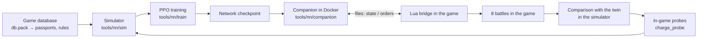

# Project summary

[← Back](README.md) · [Documentation](README.md) › Project summary · [Русский](../ru/summary.md)

A short map of the project: what it does, its parts, the state of each part and where to read the
details. It is read first after a context loss; the detailed pages only for the current task. Fresh
numbers of an iteration are in its logs (`build/steps/`, `build/compare/`); here only the main ones.

## What the project is

A neural network that commands an army in Total War: WARHAMMER III battles. It learns from scratch in
our battle simulator (PyTorch, thousands of battles at once on the GPU) and then plays real battles in
the game against the game's AI at Normal difficulty. Two factions for now - the Empire and the Skaven, a
flat empty map, a lord and up to 19 units a side (21 units and 2 lords in the pools,
[passports](training/units.md)). The goal is a network that beats the game's AI in ≥ 97 % of battles and
plays "in character" for its faction ([idea and readiness](training/network.md#readiness)).

## Where we are

- **In the game the network nearly always loses:** 0-3 wins of 8 in every iteration (the last five: 0, 1,
  1, 1, 0). The same 8 battles in the simulator (the "twin": the same armies, the network against the
  `ai_like` script) - 4-4.5 of 8. So the simulator is still kinder to the network than the game, and the
  network learns things that do not work in the game.
- **Where the gap is:** almost all of it in one pairing - "the network as the Empire against the AI's
  Skaven": twin 23.75 points of 24, game 4 of 24. The cause found: a worn unit (health below half) loses
  health in melee 1.2-1.8x faster in the simulator than in the game. The `dmgmelee` probe is analysing it.
- **Routs:** our units rout 1.6-1.8x more in the game than in the twin; the AI's units 0.5-0.7x the twin's.
- **The simulator on the game's recordings** (the replay of 72 battles, below): the loss curves match;
  routs and rallies remain.

## The working loop

One iteration is about an hour of training and battles; between iterations - a simulator fix at the
largest hole.

| Step | What | How |
|---|---|---|
| 1. Training | 30 min from the previous network, no checks in the simulator | `bash build/steps/v2_iter.sh NAME 30 INIT` (survives a crash: the next attempt starts from `latest.pt`) |
| 2. Battles in the game | 8 battles: 3 evaluation seeds + the armies of run 20261007-091416, each twice with the armies swapped | `build/steps/watch_set8.ps1 -Ckpt build/v2/itN.pt` |
| 3. Twin | the same 8 starts in the simulator (the network against `ai_like`, 4 copies); a "game / twin" table and the 3-5 largest behaviour gaps | `bash build/steps/compare_set.sh N` → `build/compare/set_vs_twin.py` |
| 4. Probe | the largest gap is staged as one mechanic in the game and in the simulator alike (lanes of units, everything recorded) | `tools/nn/charge_probe.py` + `src/entries/charge_probe.lua`, plans `--plan` ([probe](apps/entries.md#charge_probe---the-melee-probe-one-mechanic-game-and-simulator-alike)) |
| 5. Simulator fix | the game's rule from the probe, behind a switch in `config/nn/sim.json` | an agent; a test at once |
| 6. Replay of 72 battles | the sets' game battles replayed in the simulator by both sides' recorded orders, 19 copies; skill and bias per quantity | `build/shotgap/replay72.py`, `build/shotgap/replay_card.py` |

The loop's scripts live in `build/` (not in Git). Battles against the game's AI - only at Normal.

## Battle simulator

**What it does.** Each unit is one object (men, health, place, facing, morale, fatigue, ammunition),
not each soldier. Step 0.5 s (the game's morale tick). A battle ends when a side has no standing units;
after 60 minutes the defender wins. ~590 battles a second on an RTX 5070 Ti (4096 at once).

**Where the numbers come from.** The game's database (`config/nn/game_rules.json`, passports
`units.json`, effects `effects.json`, abilities `abilities.json`), community formulas, measurements of
in-game probes. Every rule is a switch in `config/nn/sim.json` with its reason. Any change to `config/nn`
or `tools/nn/sim` changes the simulator version (`tools/nn/train/version.py`).

**What is modelled** (details - [mechanics and their sources](training/simulator.md#mechanics-and-their-sources)):

- **Melee by the game's formulas:** hit chance 35 + attack − defence (weight 1), a miss costs 0.5 s;
  damage - armour-piercing whole + base minus the armour roll; the wound pool; flank / rear - defence
  ×0.6 / ×0.3; charge from a run-up and the charge-speed sprint; the first strike on entering a fight; the
  opening wave of a fight (`melee.wave`); a thinned formation keeps its width and only part of its men reach
  the enemy (`melee.front_fill_ranks` 1.5: the `dmgmelee` probe, a unit at 30 % struck 1.6-1.9x the game
  before); random blows (`noise.blows`: on in the replay and the twin, off in training).
- **Leaving melee and orders in a fight:** the 24 s window from the database; a move order in a fight is
  leaving in any direction; an attack on a target out of contact is leaving; a new attack in a fight
  strikes only its own target for 24 s; an unchased leaver is held 2 s; the chase has no charge sprint.
- **Shooting by the game's rules:** range centre to centre, a fire arc per man, the database's scatter
  model with no fitting, spill onto neighbours, fire past own men by the bullet's arc, firing on the move
  (militia, throwing stars); shooters in melee strike weakly, as in the game.
- **Morale by the game's rules:** casualty windows 4 / 60 s, "under fire", flank / rear, "flanks secure",
  charge, outnumbering, "losing the fight" (−3 / −8 by the combat ratio, as in the database), a strong
  enemy, the lord's death (−16 for 45 s, then −10), shattering of a unit and of the army; the rally is the
  measured process (`morale.rally_hazard`: a chance a second by the distance to the nearest enemy for routers with morale above 0; measured on the same condition over 360 game recordings).
- **Rout:** the first 7 s the router stays in contact; it is slowed in a crowd; it dodges its chaser at
  an angle; far from the enemy it flees from all standing enemies (weight 1 / distance), to its own edge
  only when none stands ([where a router runs](training/simulator.md#where-a-router-runs)).
- **Lords:** as fragile as in the game (no own aura, always "losing" in melee), a blow split over 4 men,
  the lord duel by the game's formula, abilities (the game's AI uses them by the measured rule), "Wounds".
- **Fatigue** by the database (10 ticks a second, melee tires under an attack order; the charge +34 on the sprint in,
  no surcharge after the blow; in melee without an attack — ready; shooting 11.4 — measured), units' innate
  effects, turning at the database's turn rate, formation by the database's template.
- **Not modelled:** terrain, forest, visibility, cavalry, monsters, magic, flight, artillery, experience.

**Checks against the game.** A recorded battle is replayed by its recorded orders 19 times with the start
shifted up to 2 m; the copies are the forecast, the game's record is the outcome. The main score is **the
share of the game's values inside the copies' 90 % interval** (90 % for a simulator matching the game),
next to it the **skill** CRPSS (0 - no better than "a typical game value", higher is better)
([how it is scored](training/simulator.md#the-checks-score-the-simulator-as-a-forecast)). The general
check is `python -m tools.nn.sim.check` ([checks](training/simulator.md#checks-against-the-game)); in the
loop - the replay of the network's 72 set battles.

**Replay of 72 battles** (the network against the game's AI, from the iterations' sets):

| Quantity | Simulator | Game |
|---|---:|---:|
| Skill, median over quantities | ≈ 0 % (was −24 %) | — |
| Our side's loss 60 / 120 / 180 s after first contact | 0.24 / 0.39 / 0.51 | 0.235 / 0.42 / 0.55 |
| Routs per unit | 0.79 | 1.19 |
| Rallies per unit | 0.40 | 0.60 |

**Known mismatches** (details - ["What is missing"](training/simulator.md#what-is-missing)):

- a worn unit in melee loses health faster than in the game (the `dmgmelee` probe is being analysed);
- fewer routs and rallies than in the game; in the twin our units rout less than in the game, the AI's
  more;
- "flanks secure" grows over ~45 s in the game (+1…+7), in the simulator +5 at once (the `rallysecure`
  probe);
- order delay 0.6-0.8 s in small battles in the game, 0.36 s in the simulator;
- the second wave of units is not fully checked against recordings.

The probes and what each gave - on the [simulator](training/simulator.md) and
[melee](game/mechanics/melee.md#in-game-check-the-melee-probe) pages; failed rules -
["Tried and rejected"](training/simulator.md#tried-and-rejected).

Details: [simulator](training/simulator.md) · [unit passports](training/units.md) ·
[in-game measurements](training/measurements.md) · [game mechanics](game/mechanics/README.md) ·
[game database](game/database.md) · [unit indicator register](game/units/indicators.md).

## Network v2

One network for both factions and both roles (attack or defence is an input). It sees only what a human
would: its own units in full, enemies while visible, and only the state of their morale
([visibility rule](training/model.md#the-rule-the-ai-sees-only-what-a-human-sees)). It never sees the time
to the end of the battle. Preset `v2`, 3.51 M weights, trained from scratch
([details](training/model.md#variant-v2-map-sectors-chained-heads-commitment)):

- **Unit tokens** (155 numbers each: passport, state, effects, fire arc, the order in force) → 3 attention
  layers with a distance bias → GRU memory.
- **Map sectors** 16 × 16 of 100 m: strength and count of own and visible enemy units, routers, the map
  edge; units look at the sectors through a separate attention layer.
- **Chained heads:** order kind (hold / move / attack / withdraw / keep) → target → sector → 25 m cell →
  term. Sampling by the Gumbel-max trick (no `torch.multinomial`), logits with a soft cap
  (30 × tanh(x / 30)).
- **Commitment:** each new order is held 2 / 4 / 8 / 16 s; events cut the term (melee, a flank threat,
  the target died or routs, own lord died).
- **"Eyes":** auxiliary heads learn from the simulator's truth (own losses in 10 / 30 s, an enemy's
  threat, a sector's danger); their predictions are fed back into the network.

The old presets `small` / `wide` and their checkpoints still work but are not trained.

Details: [input and design](training/model.md) · [idea](training/network.md).

## Training

**How it runs.** PPO as MAPPO: each unit is an agent, a side's units share its advantage, the critic sees
the whole field and does not go to the game. 1024 battles at once, a decision every second, orders
arrive after 0.36 s. v2 with eyes trains at ~3,300-3,900 battle-seconds a second. Battles -
[random armies](training/armies.md): equal budget, a lord and 0-19 units, ¾ of armies by the game AI's
templates, numbers jittered ±15 %.

**Reward v2** (`--reward v2`): win / loss + gold exchange (gold of the enemy destroyed minus our own, over
the budget) + a price for an order change 0.006 ("keep" and a repeat are free)
([reward](training/training.md#reward)).

**Opponents** (`--mix`): self-play 0.2, past versions 0.3 (pool 12), `ai_like` 0.3 (a script modelled on
the game's AI), `nearest` 0.2 (everyone runs at the nearest enemy)
([opponents](training/training.md#battles-and-opponents)). The game's AI takes no part in training - it is
the independent check.

**Off:** teachers and drills. The drills (`kiting`, `counter`, `hold_fire`, `direct_fire` and others) stay
in the code, but v2 does not use them ([drills](training/training.md#drills)).

The chain of steps with checks in the simulator (`tools.ops.step`, `test5`, `tools.ops.card`,
`config/train-chain.json`) remains but is not used in the v2 loop: the network is measured by battles in
the game ([workflow](training/workflow.md)).

Details: [training](training/training.md).

## Bridge and companion: how the network plays in the game

- **Bridge** - Lua inside the game (`src`, entry point `nn_arena`). Once a battle second it writes the
  state of all units to a file and reads the orders file every 100 ms (files are written to a temporary
  name and renamed).
- **Companion** (`tools/nn/companion`, Docker container `snake-ai-trainer`) brings the state to the
  simulator's form, builds the side's input, runs the network (with the same commitment as in training)
  and writes orders; ~40 ms from state to orders at speed ×20.
- **The network gives:** hold, move, withdraw, attack a target, run, lord abilities. Routing units are
  controlled by the game.
- **The enemy under `ai_like`:** the simulator's script the network trains against can command the
  enemy in the game (`--enemy-ai ai_like`, a second bridge, the same companion): only the engine's
  difference is left ([bridge](apps/bridge.md#the-enemy-under-the-simulators-script)).
- **Starting a battle:** pack build (`tools.build nn-arena`), the launcher sets Normal difficulty and
  restores the player's settings; one battle per game launch (~2 min). The True Sight mod is required.

Details: [bridge](apps/bridge.md) · [watch a network battle](launch/watch.md) · [run](launch/run.md) ·
[build](launch/build.md) · [in-game modules](apps/README.md) · [project design](architecture/overview.md).

## In-game check

The working check is **a set of 8 battles** after each iteration (`watch_set8.ps1`, above): 4 pairs, in
each the network plays both armies (2-0 - the network beats the AI with both armies; 1-1 - the army
decides; 0-2 - the AI is better). The set is compared with its twin at once - the main source of
simulator holes. The general check tool is
`tools/launcher/gate.ps1` (pairs on evaluation seeds, result in `build/nn-gate/<time>/summary.json`) and
the gap card `tools.ops.gapcard` ([gap card](training/workflow.md#game-vs-sim-gap-card-toolsopsgapcardpy)).

Details: [in-game check](launch/gate.md) · [the game's AI](game/game-ai.md) ·
[difficulty](game/difficulty.md).

## Where things are

| What | Where |
|---|---|
| Working rules | `CLAUDE.md` in the root |
| In-game code (Lua) | `src/apps`, `src/entries`; tests without the game - `tests/` (pytest + lupa) |
| Simulator, training, network, companion | `tools/nn/sim`, `tools/nn/train`, `tools/nn/model`, `tools/nn/companion` |
| Simulator numbers and rules | `config/nn/` (part of the simulator version), switches - `config/nn/sim.json` |
| In-game probes | `tools/nn/charge_probe.py`, `src/entries/charge_probe.lua` |
| Loop scripts | `build/steps/v2_iter.sh`, `watch_set8.ps1`, `compare_set.sh`; `build/compare/`, `build/shotgap/` (not in Git) |
| Iteration networks | `build/v2/itN.pt`, runs - `build/nn-train/runs/` (not in Git) |
| Game battle recordings | `build/nn-arena/runs/<time>/` (not in Git) |
| Orchestrator tools | `tools/ops`: `leftovers`, `wait.sh`, `baselines`, `gapcard`, `step`, `card` |

All documentation sections: [contents](README.md) · [training data](training/README.md) ·
[game knowledge](game/README.md) · [research archive](research/README.md).
