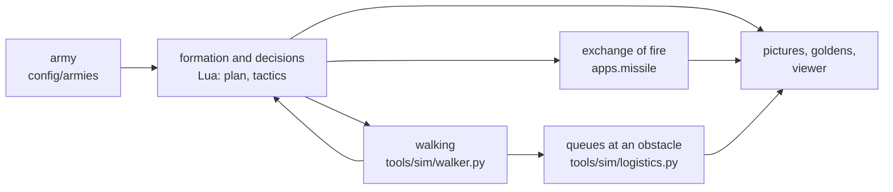
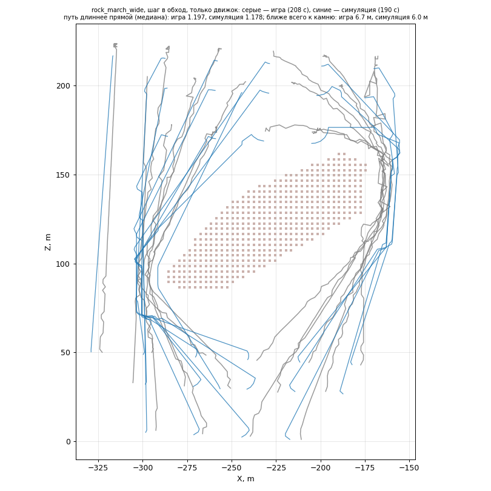

# Simulator

[← Back](README.md) · [Documentation](../README.md) › [Tests](README.md) › Simulator · [Русский](../../ru/testing/simulator.md)

A battle without the game: the same AI logic in Lua and, in place of the engine, a simple model tuned by measurements in the game.



| Part | What it does | Where |
|---|---|---|
| Formation, approach, window | the same code as in battle: `apps.plan`, `apps.tactics`, `apps.reach` | `tools/sim/formation.py` |
| Enemy | stands as the game's AI defended in the test battle | `tools/sim/enemy.py` |
| Map | the captured map's 3 m cells: where a unit can stand | `tools/sim/mapgrid.py` |
| **Walking** | like the engine: a way round obstacles, a block faces its way, a line deforms at an edge | `tools/sim/walker.py` |
| Queues | `apps.logistics`'s dispatcher orders in time, crowding | `tools/sim/logistics.py` |
| Arrows | `apps.missile` every second | `Planner.fire` |

## Walking as in the game

Since 28.09.2026 (task 27) every manoeuvre **is walked in time**, in 0.5 s steps: an approach step, an
alignment and the queues alike. Before, a manoeuvre was a jump and units passed through rocks.

| What | In the walker | Where the number comes from |
|---|---|---|
| Way | straight when clear; otherwise round on 3 m cells keeping half the block's front clear. A tighter but shorter way wins, as with the engine | game: paths at rocks |
| Facing | where it goes; at the place it turns to the ordered facing | game: median 3–4° |
| Turning | 20°/s | game: 90% of turns within 15–20°/s |
| Speed | 1.3 m/s | game: median while walking |
| Settling | 8 s at the place after arriving | game: 53 steps, 9.7 s + d / 1.37 m/s |
| Soldiers at an edge | a soldier on blocked ground moves to the nearest free cell | how the engine deforms a line |
| An order onto rock | the unit stops at the nearest free edge | — |
| Units with each other | do not push; crowding is counted | a limitation |

**Checked against the game:** the step round an obstacle on 5 grounds —
[report, in Russian](../../../research/analysis/walker/README.md). The paths are alike: 1.1–1.3 times
the straight line, as in the game. Time: 6 steps of 9 are within ±15%.



*The step round the rock, the engine alone. Grey lines are the units' paths in the game, blue ones in the simulation.*

## How to run

```bash
python -m tools.sim.formation rock_march_wide
```

| Command | What |
|---|---|
| `python -m tools.sim.formation <army>` | formation, approach, fire — picture `plan.png` |
| `python -m tools.sim.logistics <army>` | the step round an obstacle in queues and all at once — `walk_1.png` |
| `python -m tools.sim.golden` | compare with the goldens (`--update` writes new ones) |
| `python -m tools.analysis.walker_game` | the simulator's walking against the game's |
| `python -m tools.viewer sim <army>` | watch it in motion — [viewer](../launch/viewer.md) |

## Checks

- **Physics** (`tests/tools/test_sim_physics.py`). On 7 armies with a map, in every manoeuvre and in the queues: a unit's centre never on rock, no soldier on rock after squeezing, at most 30% of a block squeezed at an edge. The walker on a made-up map: straight in its time, round a rock, facing its way, stopping at an edge, squeezing soldiers.
- **Goldens** (`tests/golden/sim/`, 15 armies). Approach decisions, **the time of every decision and manoeuvre**, the window, the exchange of fire.
- **Tree branches** (`tests/tools/test_tree_branches.py`). A branch switched off behaves as its baseline.
