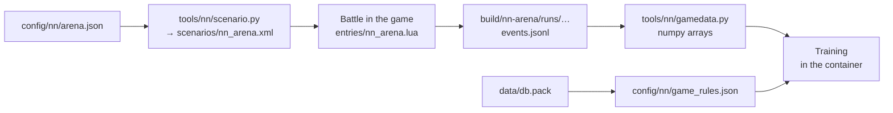

# Data for training the network

[← Back](../README.md) · [Documentation](../README.md) › Data for training · [Русский](../../ru/training/README.md)

Later we want to train a neural network from scratch. The project has no
network of its own now. This page says what data can already be collected and
how to use it.



## The arena

- `config/nn/arena.json` — the empty flat map [Crossroads flat](../game/maps/crossroads-flat.md);
  each side has a lord (`wh_main_emp_cha_general_0`), 4 spearmen
  (`wh_main_emp_inf_spearmen_0`, 120 each) and 2 archers
  (`wh2_dlc13_emp_inf_archers_0`, 90 each) of the Empire. The spearmen's fronts
  are 350 m apart (two bow ranges). Side 1 (ours) stands west facing east, side 2
  (the game's AI) east facing west.
- `tools/nn/scenario.py` writes `scenarios/nn_arena.xml` from it; the build does
  this itself.
- The `nn_arena` entry ([entries](../apps/entries.md#nn_arena)): CA's planner
  leads our side — `attack` or `defend`; side 2 is always the game's AI
  ([the game's own AI](../game/game-ai.md)). The defender is the side that wins
  when time runs out ([attacker and defender](../game/battle-roles.md)).

## How to record a battle

```powershell
.venv/Scripts/python -m tools.build nn-arena --own-ai attack --timeout 900    # or defend
powershell -NoProfile -ExecutionPolicy Bypass -File tools/launcher/launch.ps1 -Target nn-arena
```

- One battle takes about 2 minutes at ×20: loading ~90 s, the battle 25–45 s.
- The launcher sets the difficulty itself — Normal ([fair difficulty](../launch/run.md#fair-difficulty),
  [battle difficulty](../game/difficulty.md)).
- A battle ends with one side winning (`completed`), at our limit of game time
  (`timeout`: `--timeout 900` gives 900 s, as in the recorded battles; without it
  the build gives 600 s), or, if the battle stalls with no losses or real time
  runs out, `stalled` or `deadline`.

## What a recording holds

`build/nn-arena/runs/<YYYYMMDD-hhmmss>/` — **not in Git**:

| File | What |
|---|---|
| `manifest.json` | build and settings: `own_ai`, `enemy_role`, unit places |
| `launch.json` | the launch, `battle_difficulty` and `user_battle_difficulty` |
| `events.jsonl` | battle events |
| `status.json` | the run's outcome, `preferences_restored` |

Events: `ready`, `own_ai`, `start`, `nn_sample` every second of game time,
`rejoined` and `idle_kick` (the planner fixes), `nn_final` (the last snapshot),
`result` (`status`, `winner`, men and health of the sides).

`nn_sample` — every unit of **both** sides:

| Field | What |
|---|---|
| `n`, `side` | slot name (`own_lord`, `enemy_spear_1`, …) and side |
| `x`, `z`, `b` | position (m) and bearing (°) |
| `men`, `hp` | men alive and share of health (0–1) |
| `mp`, `ms` | `MoralePercent` and `MoraleState` ([morale](../game/units/morale.md)) |
| `r`, `s`, `w` | routing, shattered, wavering |
| `m`, `mv`, `f` | in melee, moving, running |
| `a`, `fire`, `t` | arrows left, firing, current target |
| `fat`, `k` | fatigue (a string), kills |
| `ox`, `oz` | the order's point |
| `lf`, `rf`, `bf` | threat to the left flank, right flank, rear |

This is a full research record. A network's input is only what one side sees
([observation](../apps/observation.md)).

## The loader

`tools/nn/gamedata.py` — numpy only, works outside the container too:

```python
from tools.nn import gamedata

for run in gamedata.runs():          # Normal difficulty only
    b = gamedata.load(run)
    b.t               # seconds, [T]
    b.f["hp"]         # [T, 14]: our 7 units, then the enemy's 7
    b.target          # [T, 14]: target index, -1 — none
    b.own_ai, b.enemy_role, b.winner, b.result
```

- Slot order: `lord`, `spear_1`…`spear_4`, `archer_1`, `archer_2` — ours first,
  then the enemy's.
- `runs(own_ai=None, since=None, fair_only=True)`: `fair_only` keeps only battles
  at Normal difficulty.
- `python -m tools.nn.gamedata` lists the battles.

As of 30.09.2026 there are 40 runs, 18 of them fair battles with a result. The
mechanics ([morale](../game/units/morale.md), [melee](../game/units/melee.md) and
the other pages below) were worked out from the first 13 of them:
`20260930-130637` … `20260930-132200`, 7522 s of records. 5 more battles
(`20260930-133202` … `20260930-133710`) were recorded after the analysis; all 18
together are 9886 s.

## The game's rules

The rule numbers come from the game's database: [the game's database](../game/database.md),
`config/nn/game_rules.json` (`py -3.14 -m tools.nn.gamedb`).

What is known about the mechanics:
[morale](../game/units/morale.md) ·
[melee](../game/units/melee.md) ·
[missile damage](../game/units/missile-damage.md) ·
[pace and fatigue](../game/units/pace.md) ·
[difficulty](../game/difficulty.md) ·
[the game's own AI](../game/game-ai.md) ·
[state fields](../game/units/state-fields.md).

## The training container

`tools/nn/dock.sh` runs a module of this repository in the Docker image
`snake-ai-trainer` (PyTorch + CUDA) on the GPU; the repository is mounted
at `/repo`:

```bash
bash tools/nn/dock.sh tools.nn.gamedata
```

Needs Docker with GPU access (`--gpus all`).
