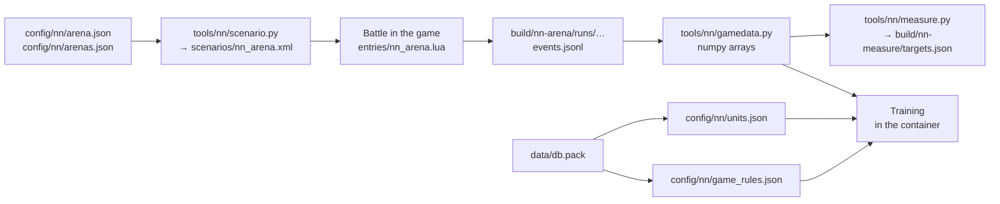

# Data for training the network

[← Back](../README.md) · [Documentation](../README.md) › Data for training · [Русский](../../ru/training/README.md)

Later we want to train a neural network from scratch. The project has no
network of its own now. This page says what data can already be collected and
how to use it. What the network itself will be, where it runs and when it is
ready: [network model](network.md). Its inputs and layers in code: [inputs and model](model.md).
How it is trained: [training](training.md).



## The arena

- `config/nn/arena.json` — the empty flat map [Crossroads flat](../game/maps/crossroads-flat.md);
  each side has a lord (`wh_main_emp_cha_general_0`), 4 spearmen
  (`wh_main_emp_inf_spearmen_0`, 120 each) and 2 archers
  (`wh2_dlc13_emp_inf_archers_0`, 90 each) of the Empire. The spearmen's fronts
  are 350 m apart (two bow ranges). Side 1 (ours) stands west facing east, side 2
  (the game's AI) east facing west.
- `tools/nn/scenario.py` writes `scenarios/nn_arena.xml` from it; the build does
  this itself.
- The `nn_arena` entry ([entries](../apps/entries.md#nn_arena)): CA's planner
  leads our side — `attack` or `defend`; side 2 is always the game's AI
  ([the game's own AI](../game/game-ai.md)). The defender is the side that wins
  when time runs out ([attacker and defender](../game/battle-roles.md)).
- `config/nn/arenas.json` — **named arenas** with an army per side: the same map
  and zones as `arena.json`, but each side its own faction and units, and the
  arena its own gap. They hold the [measurements](measurements.md): melee pairs,
  missile units against a target, whole battles Empire against Skaven.

## How to record a battle

```powershell
.venv/Scripts/python -m tools.build nn-arena --own-ai attack --timeout 900    # or defend
powershell -NoProfile -ExecutionPolicy Bypass -File tools/launcher/launch.ps1 -Target nn-arena
```

### Different armies

Pick a named arena with `--arena`; `--own-ai hold` leaves our side without
orders (it stands, a target), and the game's AI attacks it:

```powershell
.venv/Scripts/python -m tools.build nn-arena --arena whole_emp_v_skv --own-ai attack --timeout 1200
.venv/Scripts/python -m tools.build nn-arena --arena missile_archers_v_slave --own-ai hold --timeout 900
powershell -NoProfile -ExecutionPolicy Bypass -File tools/launcher/launch.ps1 -Target nn-arena
```

- A new army is a new entry in `config/nn/arenas.json`: `sides.own` and
  `sides.enemy`, each `faction` and `units` (`slot`, `key`, `men`, `forward`,
  `lateral`, `width`, `general` for the lord). Slots are unique within a side; a
  side has at most one general (none is allowed: the one-unit pairs have none).
- The run's manifest records `arena` and `factions`; the loader reads the units
  from it.

### Time and difficulty

- One battle takes about 2 minutes at ×20: loading ~90 s, the battle 25–45 s
  (a one-unit pair — under a minute in all).
- The launcher sets the difficulty itself — Normal ([fair difficulty](../launch/run.md#fair-difficulty),
  [battle difficulty](../game/difficulty.md)).
- A battle ends with one side winning (`completed`), at our limit of game time
  (`timeout`: `--timeout 900` gives 900 s, as in the recorded battles; without it
  the build gives 600 s), or, if the battle stalls with no losses or real time
  runs out, `stalled` or `deadline`.

## What a recording holds

`build/nn-arena/runs/<YYYYMMDD-hhmmss>/` — **not in Git**:

| File | What |
|---|---|
| `manifest.json` | build and settings: `arena`, `factions`, `own_ai`, `enemy_role`, unit places |
| `launch.json` | the launch, `battle_difficulty` and `user_battle_difficulty` |
| `events.jsonl` | battle events |
| `status.json` | the run's outcome, `preferences_restored` |

Events: `ready`, `own_ai`, `start`, `nn_sample` every second of game time,
`rejoined` and `idle_kick` (the planner fixes), `nn_final` (the last snapshot),
`result` (`status`, `winner`, men and health of the sides).

`nn_sample` — every unit of **both** sides:

| Field | What |
|---|---|
| `n`, `side` | slot name (`own_lord`, `enemy_spear_1`, …) and side |
| `x`, `z`, `b` | position (m) and bearing (°) |
| `men`, `hp` | men alive and share of health (0–1) |
| `mp`, `ms` | `MoralePercent` and `MoraleState` ([morale](../game/units/morale.md)) |
| `r`, `s`, `w` | routing, shattered, wavering |
| `m`, `mv`, `f` | in melee, moving, running |
| `a`, `fire`, `t` | arrows left, firing, current target |
| `fat`, `k` | fatigue (a string), kills |
| `ox`, `oz` | the order's point |
| `lf`, `rf`, `bf` | threat to the left flank, right flank, rear |

This is a full research record. A network's input is only what one side sees
([observation](../apps/observation.md)).

## The loader

`tools/nn/gamedata.py` — numpy only, works outside the container too:

```python
from tools.nn import gamedata

for run in gamedata.runs():          # Normal difficulty only
    b = gamedata.load(run)
    b.t               # seconds, [T]
    b.f["hp"]         # [T, N]: our units, then the enemy's (the mirror arena: 7 + 7 = 14)
    b.target          # [T, N]: target index, -1 — none
    b.names, b.keys, b.side   # [N]: script names, unit keys, side 1 or 2
    b.arena, b.own_ai, b.enemy_role, b.winner, b.result
```

- Unit order: as the run's manifest lists them, ours first. In the mirror arena:
  `lord`, `spear_1`…`spear_4`, `archer_1`, `archer_2`.
- `runs(own_ai=None, since=None, fair_only=True, arena=None)`: `fair_only` keeps
  only battles at Normal difficulty; `arena="arena"` — only the mirror arena. The
  runs of the dropped battle series (with `series.json`) are left out.
- `python -m tools.nn.gamedata` lists the battles.

As of 30.09.2026 there are 40 runs of the mirror arena, 18 of them fair battles with a result. The
mechanics ([morale](../game/units/morale.md), [melee](../game/units/melee.md) and
the other pages below) were worked out from the first 13 of them:
`20260930-130637` … `20260930-132200`, 7522 s of records. 5 more battles
(`20260930-133202` … `20260930-133710`) were recorded after the analysis; all 18
together are 9886 s. Then 28 battles of the [measurements](measurements.md) on
named arenas (`20260930-181821` … `20260930-184908`).

## The game's rules

The rule numbers come from the game's database: [the game's database](../game/database.md),
`config/nn/game_rules.json` (`py -3.14 -m tools.nn.gamedb`).

The units' numbers — [unit passports](units.md), `config/nn/units.json`
(`py -3.14 -m tools.nn.units`): men, health, speed, weapons, armour, shield and
shooting of the seven v1 units (Empire and Skaven), checked against their cards from battle.

Numbers from battles to check the simulator against — [measurements in the game](measurements.md)
(`python -m tools.nn.measure` → `build/nn-measure/targets.json`): melee one against one,
shooting at a unit that stands, whole battles of the Empire against the Skaven.

The simulator the network will train in — [battle simulator](simulator.md)
(`tools/nn/sim/`, `config/nn/sim.json`, `python -m tools.nn.sim.check`): thousands of battles
at once on the GPU, checked against these measurements and the recorded battles.

How the network learns in it — [training](training.md) (`tools/nn/train/`,
`bash tools/nn/dock.sh tools.nn.train.run`): PPO, battles against itself, its past versions and scripts.

The battles it learns and is checked on — [random armies](armies.md) (`tools/nn/armies/`,
`python -m tools.nn.armies`): an equal budget (Skaven 0.8 of it), a lord and 0–19 units a side, deployed for the
simulator and the game.

How the network is checked in the game against the game's AI — the [in-game check](../launch/gate.md)
(`tools/launcher/gate.ps1`): 4 generated battles on held-out seeds, at least 3 wins.

What is known about the mechanics:
[morale](../game/units/morale.md) ·
[melee](../game/units/melee.md) ·
[missile damage](../game/units/missile-damage.md) ·
[pace and fatigue](../game/units/pace.md) ·
[difficulty](../game/difficulty.md) ·
[the game's own AI](../game/game-ai.md) ·
[state fields](../game/units/state-fields.md).

## The training container

`tools/nn/dock.sh` runs a module of this repository in the Docker image
`snake-ai-trainer` (PyTorch + CUDA) on the GPU; the repository is mounted
at `/repo`:

```bash
bash tools/nn/dock.sh tools.nn.gamedata
```

Needs Docker with GPU access (`--gpus all`).
