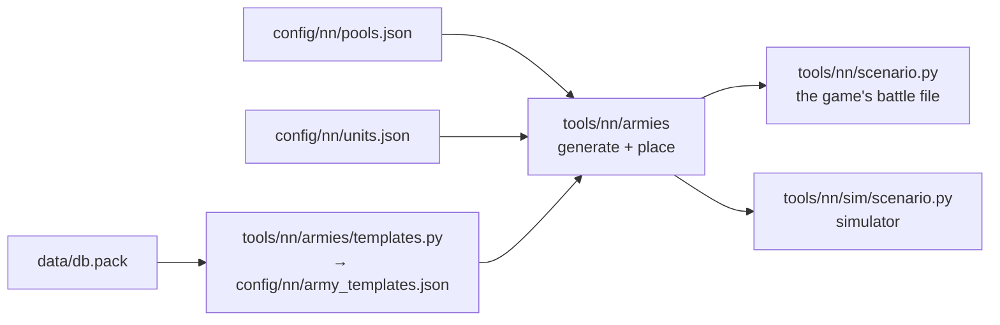

# Random armies

[← Back](README.md) · [Documentation](../README.md) › [Data for training](README.md) › Random armies · [Русский](../../ru/training/armies.md)

The random battle generator for training: two armies with an equal budget (a faction's
`budget_factor` can change its share, see below), each a lord and 0 to 19 units, already deployed. The same battle can be played both in the
[simulator](simulator.md) and in the game. The rules come from the
[network model](network.md#armies-and-battle-rules).

## How to get them

```bash
.venv/Scripts/python -m tools.nn.armies                       # 5 samples and a summary over 10,000 battles
.venv/Scripts/python -m tools.nn.armies --samples 3 --xml build/nn-armies   # + the game's battle file per sample
bash tools/nn/dock.sh tools.nn.armies --samples 8 --stats 0 --sim         # + the battles in the simulator (torch)
py -3.14 -m tools.nn.armies.templates                         # army templates from the game's database
```



## Files

| File | What |
|---|---|
| `config/nn/pools.json` | each faction's units for training, its budget factor (`budget_factor`), the share of template armies (`mix`), limits (`caps`) |
| `config/nn/army_templates.json` | the factions' army templates from the game's database (written by `templates.py`) |
| `tools/nn/armies/pools.py` | pools: unit passports, the generator's groups, template shares (`Template`), budgets |
| `tools/nn/armies/generate.py` | budget, buying units, a battle from a seed |
| `tools/nn/armies/place.py` | deployment |
| `tools/nn/armies/export.py` | the game's battle file, the `arenas.json` format, army descriptions for the simulator |
| `tests/tools/test_nn_armies.py` | tests (levels 1–2, numpy only) |

## How a battle is built

1. **Factions.** Each side takes a faction from the list independently, so there are both
   mirror battles and battles of different factions.
2. **Budget B.** Log-uniform between "the dearer lord and the cheapest unit" and what both
   factions can field in 1 lord and 19 units. The budget is drawn again until both sides
   can spend it.
   - **Budget factor.** A side's budget is B × its faction's `budget_factor` / the larger
     factor of the two sides (`config/nn/pools.json`, 1.0 by default). The bounds of
     B take the factor into account, so both sides can always spend their share. Every
     faction has 1.0: the faction imbalance (at an equal budget the Skaven won all 10 whole
     battles in the game: [measurements](measurements.md#whole-battles-empire-against-skaven))
     is handled by the fair metrics of [training](training.md#network-evaluation-fair-metrics)
     and by the Empire's shielded units ([unit passports](units.md#spearmen-with-shields-and-swordsmen)).
     The Skaven at 0.8 lost ~90% in the simulator
     ([tried and rejected](training.md#the-skaven-at-08-of-the-budget)).
   - **A faction's cap.** `budget_max` in a faction's entry caps what its side spends (B × its
     share). The Skaven's is 6700, their most before their wave (the Warlord and 19 clanrat
     spearmen): the Night Runners (450) and the clanrats with shields (350) would otherwise raise
     every battle with Skaven to richer armies. Their cheapest unit, the skavenslaves (125), lowers
     the least Skaven-mirror budget from 675 to 650.
   - **Rich battles** (`budget_rare` in `pools.json`: `share`, `max`; by default `share` 0 - none, and the
     generator draws no extra random number: every battle as before). That share of battles draws B log-uniform
     between the usual top (`budget_max` and the factions' caps) and `max` (at most what both sides can field with
     19 units and the lord). More gold - by the templates more dear units (greatswords, stormvermin); the limit of
     20 units as in the game. Raise it step by step: each step changes the simulator's version (`config/nn`), the
     scripts' baselines are played again ([steps](#rich-battles-steps)).
3. **Buying.** Each side spends 0.95 to 1 of its budget, the lord included, so sides with
   the same factor differ by at most 5%. A unit is taken only if the army can still end
   inside that window. For this
   there are numpy tables of what the pool can buy with k units. So a side never fails
   and never overspends.
   - **A template army** (75%, `mix.template`) follows one of its faction's templates from
     the game's database, the way the AI recruits. It buys by the template's shares while
     the budget lasts. The number of units comes out by itself. `caps` apply.
   - **A random army** (25%, `mix.random`) is what a human might build, stacks included.
     The number of units is drawn uniformly among those that fit the budget, and the
     preferences for units are random (Dirichlet, α = 0.7): a swarm of cheap units, a few
     dear ones, missile only. No limits.
4. **Deployment** — below.

A battle is set by its seed: `battle(seed)`. For training — seeds `TRAIN_SEEDS`
(0 … 10⁹ − 1), for evaluation — `EVAL_SEEDS` (10⁹ … 10⁹ + 10⁶ − 1). The ranges do not
overlap, so the network never sees the evaluation battles in training.

## Army templates from the game's database

The proportions of template armies come from the game's army generator
(`cdir_military_generator_*`, the "campaign director"). The tables are read whole to the
last byte (`tools/nn/dbtables.decode`). The field names are ours, from the values.

| Table | What it holds |
|---|---|
| `cdir_military_generator_template_priorities` | generator config → its templates and weight (`WH_Empire` → `WH_Empire_land` … `_4`) |
| `cdir_military_generator_template_ratios` | template → share per unit group (`..._melee_infantry_main_frontline_spears_high_quality` 20, …) |
| `cdir_military_generator_unit_qualities` | unit → group and quality step |
| `cdir_military_generator_unit_group_overrides` | group → parent group |

- The multiplayer army generator uses the same templates: config `WH_mp_Empire_land`
  leads to `WH_Empire_land` … `_4`.
- A faction's config is named in `pools.json` (`generator`), by name. A "faction →
  config" table in the database was not searched for.
- **How a template's shares reach the units** (`pools.json` `template_rule`, `group` since 07.10.2026). The
  generator's groups form a tree: `cdir_military_generator_unit_group_overrides` gives each group a parent
  (`..._frontline_spears_high_quality` → `..._frontline_spears` → `..._frontline` → `..._main` → `melee_infantry` →
  `melee_infantry_trash`). Units sit in the leaves, while the templates also ask general groups that hold no unit
  at all: `melee_infantry` 54 times in the whole database, `melee_infantry_main` 7, `ranged_infantry_main` 21. So a
  template's group stands for its whole subtree. The rule: a group's share goes to the pool's units in its subtree;
  if none of them can be bought (not in the pool, or no longer fitting the budget), the share goes to the parent's
  subtree, and so on up; a share that reaches nobody (artillery, cavalry, monsters) is dropped and the rest are
  normalised. Inside the group reached, an even split.
  - Ours, not the game's: "up to the parent" stands in for the units our pool lacks (the game has the faction's
    whole roster); "an even split" - the quality step (`unit_qualities`, "the recruitment priority within a group"
    by the modders) has no known rule in numbers; the shares are checked at every purchase (a unit that no longer
    fits the budget window passes its group's share up instead of losing it). When no kind of the template has a
    unit that can be bought, a unit is taken evenly among those that still fit (the market must spend the budget):
    this is how skavenslaves and slingers, which no Skaven template asks, get into the armies.
  - The former rule (`template_rule: family`, before 07.10.2026; kept as an option): a template's shares summed
    by the chain's root (all melee infantry `melee_infantry_trash`, missile infantry `ranged_infantry`) and split
    evenly over the pool's units of that root. It erased the high-quality groups: a stormvermin (950) got the same
    share as a slave (125).
- Not checked in the game: whether the campaign AI recruits exactly by these templates.

Template shares under the `group` rule (by number of units, lord not counted, when every unit can be bought):

| Template | Spearmen | Spearmen with shields | Swordsmen | Flagellants | Greatswords | Archers | Militia | Handgunners | Crossbowmen |
|---|---:|---:|---:|---:|---:|---:|---:|---:|---:|
| `WH_Empire_land` | 15% | 15% | 0 | 0 | 31% | 0 | 0 | 19% | 19% |
| `WH_Empire_land_2` | 17% | 17% | 0 | 8% | 25% | 2% | 2% | 15% | 15% |
| `WH_Empire_land_3` | 15% | 15% | 3% | 3% | 26% | 0 | 0 | 19% | 19% |
| `WH_Empire_land_4` | 14% | 14% | 3% | 3% | 24% | 4% | 4% | 18% | 18% |

Where from: high-quality spears (none in the Empire's pool) → plain spears: both spearmen; high-quality swords - the
greatswords; `main_flanking` - the flagellants; `ranged_infantry_main_light_backline` - crossbowmen and handgunners;
archers and militia (`ranged_infantry_trash`) only through the general `ranged_infantry`; swordsmen
(`frontline_swords`) only through the general `melee_infantry_main` / `melee_infantry`.

| Template | Clanrat spearmen | Clanrats | Clanrats with shields | Spearmen with shields | Stormvermin (halberds) | Stormvermin (sword, shield) | Night Runners (slings) | Night Runners (stars) | Slaves (both), slingers |
|---|---:|---:|---:|---:|---:|---:|---:|---:|---:|
| `WH_Skaven_land` | 4% | 4% | 4% | 4% | 27% | 19% | 19% | 19% | 0 |
| `WH_Skaven_land_2` | 6% | 6% | 6% | 6% | 22% | 22% | 15% | 15% | 0 |
| `WH_Skaven_land_3` | 6% | 6% | 6% | 6% | 22% | 22% | 17% | 17% | 0 |
| `WH_Skaven_land_4` | 8% | 8% | 8% | 8% | 23% | 23% | 12% | 12% | 0 |
| `WH_Skaven_land_5` | 4% | 4% | 4% | 4% | 19% | 27% | 19% | 19% | 0 |

Where from: high-quality spears / swords - the stormvermin with halberds / with swords; `main`, `main_flanking`,
`melee_infantry` - all six line units (clanrats and stormvermin); the Skaven templates' shooters are heavy
(`heavy_long_range`, `heavy_short_range`: jezzails, ratling guns - not in the pool) → up to `ranged_infantry_main` →
the Night Runners (`light_skirmisher`); skavenslaves (`melee_infantry_trash`, the root) and slingers
(`ranged_infantry_trash`) are asked by no Skaven template.

What the armies get (template armies, budgets as in training, share of units):

| | The former rule (`family`) | The `group` rule |
|---|---|---|
| Empire | spearmen 17%, with shields 13%, swordsmen 14%, flagellants 11%, greatswords 9%, archers 10%, militia 10%, handgunners 8%, crossbowmen 9% | spearmen 20%, with shields 15%, swordsmen 7%, flagellants 3%, greatswords 18%, archers 4%, militia 2%, handgunners 14%, crossbowmen 17% |
| Skaven | clanrat spearmen 8%, slave spearmen 12%, slingers 12%, skavenslaves 16%, with shields 8%, Night Runners (slings) 9%, clanrats 9%, spearmen with shields 8%, stormvermin 5% + 5%, Night Runners (stars) 8% | clanrat spearmen 8%, slave spearmen 5%, slingers 6%, skavenslaves 9%, with shields 7%, Night Runners (slings) 11%, clanrats 10%, spearmen with shields 7%, stormvermin 13% + 13%, Night Runners (stars) 12% |

Slaves and slingers stay (5–9%): they fill the budget when a kind of the template no longer fits. The armies cost
more per unit: 5.3 units a side on average against 7.3 before the third wave (the summary below).

## Limits

`caps` in `pools.json` apply to template armies only: missile units (`inf_ranged`) at most
60% of the army's units, the lord counted, rounded down but at least 1. With 20 units — at
most 12, with 5 — at most 3; a lord with a single unit may have it be a missile unit.

Why 60%: the game's templates give missile units 23–43%. A small army can drift from the
shares by chance, and 60% keeps at least 40% of the army in melee to screen the missile
units. Missile stacks stay in the random armies — the network must be able to play
against them too.

## Deployment

`place.py` puts a side's 1–20 units in lines, in the format of `config/nn/arenas.json`:
`forward` is towards the enemy, `lateral` to the right, a unit's point is the centre of
its front.

- Melee lines in front, missile lines behind them, the lord behind all in the centre.
- 6 m between units of a line (as the arena's spearmen: 30 m front, 36 m between
  centres). Between lines — the formation's depth plus 15 m. The dearest units stand in
  the middle of a line.
- A line is no wider than the deployment zone less 5 m at each edge (300 m → 290 m:
  8 units of 30 m).
- Everything is inside the deployment zone of `tools/nn/scenario.py`: `forward` from
  40 − 300 to 40, `lateral` ±150. The gap between the sides is that of `arena.json`
  (350 m). The deepest army (3 melee lines, 2 missile lines) ends with the lord at about
  −140 m.
- A unit's width comes from `pools.json` (as in the arenas: spearmen and slaves 30 m,
  archers 40, slingers 35; skavenslaves, clanrats with shields and Night Runners 30; handgunners 40, crossbowmen
  and the other units of the third wave 30), otherwise
  men / `rank_depth` × 1.5 m.

## Summary over 10,000 battles

`python -m tools.nn.armies`, seeds 5 … 10,004 (every `budget_factor` 1.0, the pools with the third wave, the
`group` template rule, budgets capped at `budget_max` 7725 and the Skaven's side at 6700, no rich battles):

| What | Value |
|---|---|
| Mirror battles | 50% |
| Armies: template / random | 75% / 25% |
| Budget B | 651 … 7725, median 2528 |
| Units per side (lord not counted) | mean 5.3 (7.3 before the third wave); 1–4: 52%, 5–9: 34%, 10–14: 11%, 15–18: 2%, 19: 0.5% |
| Cost difference between sides of equal budgets | mean 1.4%, at most 5.0% |
| Skaven cost / Empire cost | mean 1.004, 0.950 … 1.052 (4996 battles) |
| One side has x times the other's units | x ≥ 1.5: 37.3%; x ≥ 2: 18.7%; x ≥ 3: 5.9% |
| Missile share of a side | mean 31%; no missile: 28%; ≥ 50%: 30%; missile only: 4.3% |
| Empire template armies | spearmen 20%, with shields 15%, swordsmen 7%, flagellants 3%, greatswords 18%, archers 4%, militia 2%, handgunners 14%, crossbowmen 17% |
| Skaven template armies | clanrat spearmen 8%, slave spearmen 5%, slingers 5%, skavenslaves 8%, clanrats with shields 7%, Night Runners (slings) 12%, clanrats 8%, spearmen with shields 7%, stormvermin 13% + 14%, Night Runners (stars) 12% |

### Rich battles: steps

Today B is at most 7725 (the Empire; the Skaven 6700): the most of the armies before the second wave. In the game
custom and multiplayer battles run on funds the player sets; in WH1 the Domination mode raised the starting funds
from 9000 to 12,400 (a search excerpt, Steam discussions); the WH3 multiplayer standard is not confirmed by a source.
A campaign army is up to 20 units. Proposal: `share` 0.1 and `max` 10,000 → 12,400 → 15,000, a step after each
plateau; at each step watch the rating and the pair gold (dearer battles are longer, training is slower per battle).

The Empire's commonest unit is the plain spearmen (300, 20 %): they share the plain spears' share with the
shielded spearmen, but filling the budget when a dear kind no longer fits ends more often with the cheap one. The
many-cheap-against-few-elite battles are mostly Skaven against Empire.

An equal budget is not equal strength ([measurements](measurements.md): Skaven fielded 1601
men against the Empire's 661 and won all 10 whole battles); the fair metrics of training take
the matchup out of the network's score.

The first eight battles were run in the simulator (`--sim`: every unit attacks the
nearest enemy): all ended within 250–540 s. With the sides swapped, the same army wins in
13 battles of 16.

## For training

```python
from tools.nn.armies import generate, export
from tools.nn.sim import scenario

arenas = [generate.battle(seed) for seed in seeds]          # seeds from generate.TRAIN_SEEDS
armies = export.to_sim(arenas, "attack")                    # "defend": side 2 attacks
st = scenario.build(armies, per_side=generate.MAX_UNITS + 1)
```

- `generate.generate(rng, factions=None, budget_range=None, max_units=None, sides=None)` —
  the same with your own random generator. `max_units=5` and `budget_range` give small
  armies (training's `--small` share). `factions` is a list of factions, `sides` the sides'
  factions explicitly.
- `per_side` must be 20: a side can have that many units.
- `export.to_sim` writes the battles into a temporary `arenas.json` and calls
  `tools/nn/sim/scenario.from_arena`. Once `from_arena` takes an arena dict, the temporary
  file is not needed.
- A battle in the game: `export.scenario_xml(arena)` — the battle file,
  `export.write_arenas` — `arenas.json`. A build of the battle: `python -m tools.build nn-arena --army-seed N` ([build](../launch/build.md#options),
  [in-game check](../launch/gate.md)).

## A new unit or faction

0. The whole procedure (research of its special features, simulator, network inputs, card, tests):
   [how to add a unit](units.md#how-to-add-a-unit).
1. The unit's passport — in `config/nn/units.json` (`py -3.14 -m tools.nn.units --units …`).
2. An entry in `config/nn/pools.json`: `key`, `slot`, `width`; a new faction also needs
   `lord` and `generator`, and `budget_factor` if it is stronger or weaker than its price.
3. `py -3.14 -m tools.nn.armies.templates` — the unit needs a generator group.
4. A new category (cavalry, monsters) — its own limit in `caps` if wanted.
