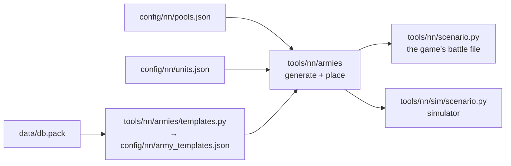

# Random armies

[← Back](README.md) · [Documentation](../README.md) › [Data for training](README.md) › Random armies · [Русский](../../ru/training/armies.md)

The random battle generator for training: two armies with an equal budget (the Skaven
get 0.8 of it, see below), each a lord and 0 to 19 units, already deployed. The same battle can be played both in the
[simulator](simulator.md) and in the game. The rules come from the
[network model](network.md#armies-and-battle-rules).

## How to get them

```bash
.venv/Scripts/python -m tools.nn.armies                       # 5 samples and a summary over 10,000 battles
.venv/Scripts/python -m tools.nn.armies --samples 3 --xml build/nn-armies   # + the game's battle file per sample
bash tools/nn/dock.sh tools.nn.armies --samples 8 --stats 0 --sim         # + the battles in the simulator (torch)
py -3.14 -m tools.nn.armies.templates                         # army templates from the game's database
```



## Files

| File | What |
|---|---|
| `config/nn/pools.json` | each faction's units for training, its budget factor (`budget_factor`), the share of template armies (`mix`), limits (`caps`) |
| `config/nn/army_templates.json` | the factions' army templates from the game's database (written by `templates.py`) |
| `tools/nn/armies/pools.py` | pools: unit passports, families, template shares |
| `tools/nn/armies/generate.py` | budget, buying units, a battle from a seed |
| `tools/nn/armies/place.py` | deployment |
| `tools/nn/armies/export.py` | the game's battle file, the `arenas.json` format, army descriptions for the simulator |
| `tests/tools/test_nn_armies.py` | tests (levels 1–2, numpy only) |

## How a battle is built

1. **Factions.** Each side takes a faction from the list independently, so there are both
   mirror battles and battles of different factions.
2. **Budget B.** Log-uniform between "the dearer lord and the cheapest unit" and what both
   factions can field in 1 lord and 19 units. The budget is drawn again until both sides
   can spend it.
   - **Budget factor.** A side's budget is B × its faction's `budget_factor` / the larger
     factor of the two sides (`config/nn/pools.json`, 1.0 by default). The Skaven have
     0.8: against the Empire they get 0.8·B, the Empire B; in a mirror both get B. Why:
     at an equal budget the Skaven won all 10 whole battles in the game
     ([measurements](measurements.md#whole-battles-empire-against-skaven)). The bounds of
     B take the factor into account, so both sides can always spend their share.
3. **Buying.** Each side spends 0.95 to 1 of its budget, the lord included, so sides with
   the same factor differ by at most 5%. A unit is taken only if the army can still end
   inside that window. For this
   there are numpy tables of what the pool can buy with k units. So a side never fails
   and never overspends.
   - **A template army** (75%, `mix.template`) follows one of its faction's templates from
     the game's database, the way the AI recruits. It buys by the template's shares while
     the budget lasts. The number of units comes out by itself. `caps` apply.
   - **A random army** (25%, `mix.random`) is what a human might build, stacks included.
     The number of units is drawn uniformly among those that fit the budget, and the
     preferences for units are random (Dirichlet, α = 0.7): a swarm of cheap units, a few
     dear ones, missile only. No limits.
4. **Deployment** — below.

A battle is set by its seed: `battle(seed)`. For training — seeds `TRAIN_SEEDS`
(0 … 10⁹ − 1), for evaluation — `EVAL_SEEDS` (10⁹ … 10⁹ + 10⁶ − 1). The ranges do not
overlap, so the network never sees the evaluation battles in training.

## Army templates from the game's database

The proportions of template armies come from the game's army generator
(`cdir_military_generator_*`, the "campaign director"). The tables are read whole to the
last byte (`tools/nn/dbtables.decode`). The field names are ours, from the values.

| Table | What it holds |
|---|---|
| `cdir_military_generator_template_priorities` | generator config → its templates and weight (`WH_Empire` → `WH_Empire_land` … `_4`) |
| `cdir_military_generator_template_ratios` | template → share per unit group (`..._melee_infantry_main_frontline_spears_high_quality` 20, …) |
| `cdir_military_generator_unit_qualities` | unit → group and quality step |
| `cdir_military_generator_unit_group_overrides` | group → parent group |

- The multiplayer army generator uses the same templates: config `WH_mp_Empire_land`
  leads to `WH_Empire_land` … `_4`.
- A faction's config is named in `pools.json` (`generator`), by name. A "faction →
  config" table in the database was not searched for.
- A group's **family** is the end of its parent chain: all melee infantry ends at
  `melee_infantry_trash`, missile infantry at `ranged_infantry`. A template's shares are
  summed over the families the pool has. The rest (artillery, cavalry, monsters, heroes)
  is dropped, then the shares are normalised.
- Inside a family the share is split **evenly** between the pool's units. Which unit of a
  family the game's AI takes depends on the quality step (`tier_1_step_2` for slaves,
  `tier_1_step_4` for clanrats) and on how rich the army is. How the generator picks the
  step is not in the tables. Here the budget decides cheap against dear.
- Not checked in the game: whether the campaign AI recruits exactly by these templates.
  They are the templates of the game's army generator.

Shares by number of units (lord not counted), per template:

| Faction | Template | Spearmen | Archers |
|---|---|---:|---:|
| Empire | `WH_Empire_land` | 62% | 38% |
| | `WH_Empire_land_2` | 67% | 33% |
| | `WH_Empire_land_3` | 62% | 38% |
| | `WH_Empire_land_4` | 57% | 43% |

| Faction | Template | Clanrats | Skavenslave spearmen | Skavenslave slingers |
|---|---|---:|---:|---:|
| Skaven | `WH_Skaven_land` | 31% | 31% | 38% |
| | `WH_Skaven_land_2` | 35% | 35% | 31% |
| | `WH_Skaven_land_3` | 33% | 33% | 33% |
| | `WH_Skaven_land_4` | 38% | 38% | 23% |
| | `WH_Skaven_land_5` | 31% | 31% | 38% |

## Limits

`caps` in `pools.json` apply to template armies only: missile units (`inf_ranged`) at most
60% of the army's units, the lord counted, rounded down but at least 1. With 20 units — at
most 12, with 5 — at most 3; a lord with a single unit may have it be a missile unit.

Why 60%: the game's templates give missile units 23–43%. A small army can drift from the
shares by chance, and 60% keeps at least 40% of the army in melee to screen the missile
units. Missile stacks stay in the random armies — the network must be able to play
against them too.

## Deployment

`place.py` puts a side's 1–20 units in lines, in the format of `config/nn/arenas.json`:
`forward` is towards the enemy, `lateral` to the right, a unit's point is the centre of
its front.

- Melee lines in front, missile lines behind them, the lord behind all in the centre.
- 6 m between units of a line (as the arena's spearmen: 30 m front, 36 m between
  centres). Between lines — the formation's depth plus 15 m. The dearest units stand in
  the middle of a line.
- A line is no wider than the deployment zone less 5 m at each edge (300 m → 290 m:
  8 units of 30 m).
- Everything is inside the deployment zone of `tools/nn/scenario.py`: `forward` from
  40 − 300 to 40, `lateral` ±150. The gap between the sides is that of `arena.json`
  (350 m). The deepest army (3 melee lines, 2 missile lines) ends with the lord at about
  −140 m.
- A unit's width comes from `pools.json` (as in the arenas: spearmen and slaves 30 m,
  archers 40, slingers 35), otherwise men / `rank_depth` × 1.5 m.

## Summary over 10,000 battles

`python -m tools.nn.armies`, seeds 5 … 10,004:

| What | Value |
|---|---|
| Mirror battles | 50% |
| Armies: template / random | 75% / 25% |
| Budget B | 676 … 6900, median 2971 |
| Units per side (lord not counted) | mean 9.1; 1–4: 24%, 5–9: 33%, 10–14: 21%, 15–18: 14%, 19: 7% |
| Cost difference between sides of equal budgets | mean 1.2%, at most 4.9% |
| Skaven cost / Empire cost | mean 0.801, 0.761 … 0.842 (4997 battles) |
| Skaven / Skaven, Empire / Empire | mean 1.000 and 1.001, 0.952 … 1.052 |
| One side has x times the other's units | x ≥ 1.5: 6.7%; x ≥ 2: 0.3%; x ≥ 3: 0.0% |
| Missile share of a side | mean 34%; no missile: 16%; ≥ 50%: 28%; missile only: 3.4% |
| Empire template armies | spearmen 64%, archers 36% |
| Skaven template armies | clanrats 35%, slaves 34%, slingers 31% |

Before the budget factor (Skaven at B too): budget median 2935, 9.5 units a side,
x ≥ 1.5: 27%, x ≥ 2: 6.1%, x ≥ 3: 0.8%. The many-cheap-against-few-elite battles were
mostly Skaven against Empire; at 0.8·B the Skaven field about as many units as the
Empire.

An equal budget was not equal strength ([measurements](measurements.md): Skaven fielded
1601 men against the Empire's 661 and won all 10 whole battles), hence the Skaven's 0.8.
Whether 0.8 evens them out is not yet measured in the game.

The first eight battles were run in the simulator (`--sim`: every unit attacks the
nearest enemy): all ended within 250–540 s. With the sides swapped, the same army wins in
13 battles of 16.

## For training

```python
from tools.nn.armies import generate, export
from tools.nn.sim import scenario

arenas = [generate.battle(seed) for seed in seeds]          # seeds from generate.TRAIN_SEEDS
armies = export.to_sim(arenas, "attack")                    # "defend": side 2 attacks
st = scenario.build(armies, per_side=generate.MAX_UNITS + 1)
```

- `generate.generate(rng, factions=None, budget_range=None, max_units=None, sides=None)` —
  the same with your own random generator. `max_units=5` and `budget_range` give small
  armies for the start of training. `factions` is a list of factions, `sides` the sides'
  factions explicitly.
- `per_side` must be 20: a side can have that many units.
- `export.to_sim` writes the battles into a temporary `arenas.json` and calls
  `tools/nn/sim/scenario.from_arena`. Once `from_arena` takes an arena dict, the temporary
  file is not needed.
- A battle in the game: `export.scenario_xml(arena)` — the battle file,
  `export.write_arenas` — `arenas.json`. A build of the battle: `python -m tools.build nn-arena --army-seed N` ([build](../launch/build.md#options),
  [in-game check](../launch/gate.md)).

## A new unit or faction

1. The unit's passport — in `config/nn/units.json` (`py -3.14 -m tools.nn.units --units …`).
2. An entry in `config/nn/pools.json`: `key`, `slot`, `width`; a new faction also needs
   `lord` and `generator`, and `budget_factor` if it is stronger or weaker than its price.
3. `py -3.14 -m tools.nn.armies.templates` — the unit needs a generator group.
4. A new category (cavalry, monsters) — its own limit in `caps` if wanted.
