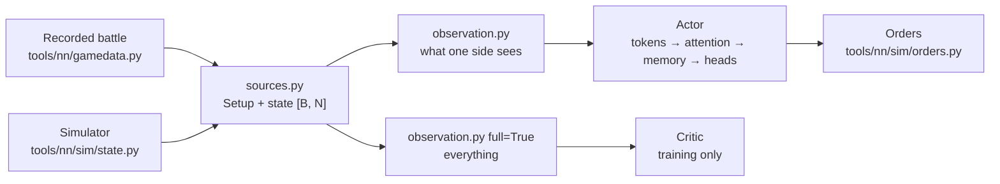
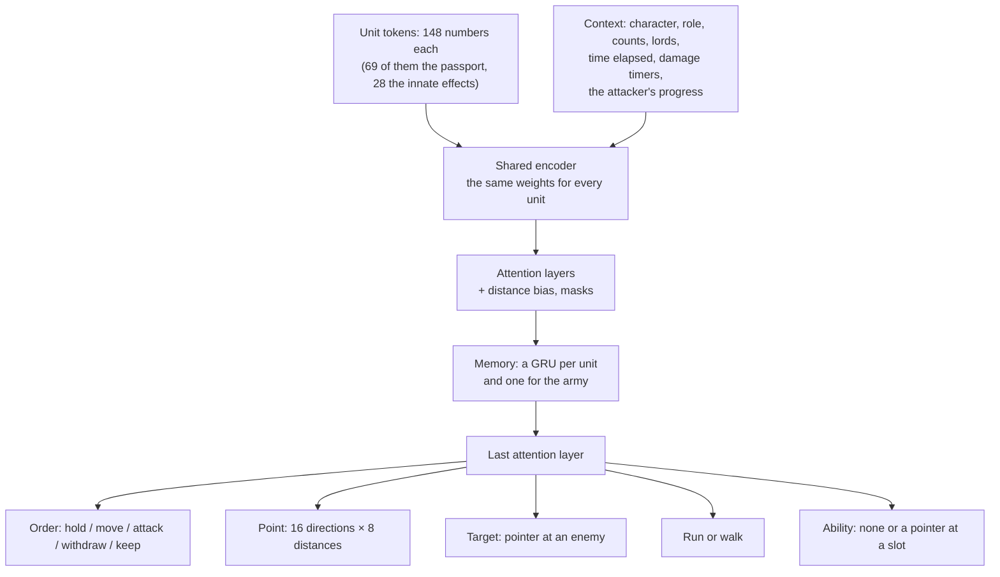

# The network's inputs and model

[← Back](README.md) · [Documentation](../README.md) › [Training data](README.md) › Inputs and model · [Русский](../../ru/training/model.md)

What the network gets as input and how it is built, in code, following the design in
[network model](network.md). There is no training yet: the weights are random. Code — `tools/nn/model/`
(PyTorch; the observation also works on plain numpy).

## The rule: the AI sees only what a human sees

`observation.observe(state, setup, side, memory)` builds the input of one side. The same code
takes a recorded battle and the simulator's batch: both have the fields of the recorded
`nn_sample` ([recordings](README.md#what-a-recording-holds)).

- **Own units** — everything, exact morale too.
- **Enemy units** — only while visible: place, facing, speed, men and health, what they do,
  and the morale **state**. The exact morale percent never reaches the input (a test checks it).
- **Enemy not visible** — the last seen place and how long ago. Never seen — only its passport
  (the enemy's army is shown before battle).
- **The side's frame.** The origin is the map's centre; "forward" points from the side's army
  to the enemy's army at the start; "lateral" is to the right. Turn the world by 180° and swap
  the sides — the input is the same (a test checks it). So one network plays both sides.
- **Visibility.** The simulator gives `vis` (visible to the other side). The recordings have
  no visibility: the map is flat and empty, so every unit is taken as visible.

### Before battle (static)

| Input | Who sees it | Scale |
|---|---|---|
| Passport of every unit, own and enemy ([passports](units.md)): men, health, mass, speeds, attack, defence, charge, weapon damage and bonuses, armour, shield, leadership, resistances, missile (range, ammo, damage, reload, accuracy; since 02.10.2026 at the end: direct fire, spread, muzzle velocity), cost, caste, size, attributes (unbreakable, fire whilst moving, …) | both sides | ~0–1; wide numbers (health, mass, cost, damage) on a log scale; caste, size, attributes as 0/1 |
| Experience rank | both sides | rank / 9 |
| Faction character (5 numbers, `config/nn/factions.json`) | own side | 0–1 as written |
| Role: attack or defend | own side | 0/1 |
| Lord level, own and enemy | both | level / 50 |
| Map size | both | m / 2000; each unit also gets the distance to the edge ahead, behind, right and left (m / 1000) |

The faction character values are **placeholders** (Empire and Skaven); the owner picks the final
ones by lore.

### In battle (each unit, every decision)

| Input | Own unit | Enemy, visible | Enemy, not visible | Scale |
|---|---|---|---|---|
| Place (forward, lateral) | yes | yes | last seen | m / 500 |
| Facing | yes | yes | — | cos, sin of the angle to "forward" |
| Speed (forward, lateral) | yes | yes | — | m/s / 5, from two decisions |
| Men, health | yes | yes | — | share of the start |
| Morale state: steady, wavering, routing, shattered | yes | yes | — | 0/1 |
| In melee, moving, running, firing | yes | yes | — | 0/1 |
| Distance to the map's edges | yes | yes | from the last seen place | m / 1000 |
| Exact morale (`MoralePercent`) | yes | **no** | — | / 2, clipped to ±1.5 |
| Detailed morale state 1–7 | yes | **no** | — | 0/1 |
| Ammunition, kills | yes | no | — | share of the start; kills / 200 |
| Fatigue state (6), known or not | yes | no | — | 0/1 |
| Order point, has an order, has a target | yes | no | — | m / 500; 0/1 |
| Threat to the left flank, right flank, rear | yes | no | — | 0/1 |
| Own or enemy, visible now, ever seen, age of the sighting | yes | yes | yes | 0/1; age s / 60, up to 1 |
| Fought in melee lately, routed lately | yes | yes (seen then) | — | 1 now, down to 0 after 120 s; 0 never |

Morale states 1–4 of the game (eager … shaken) are all "steady" for the enemy: telling them
apart would give away the exact morale.

Every decision also gets the side's context:

| Input (context) | Scale |
|---|---|
| Count of own living units and of known enemy units | / 20 |
| Own lord slain, how lately; the enemy lord the same | 0/1; 1 now, down to 0 after 120 s |
| Battle time elapsed (a fine clock for the first minutes) | log(1 + s / 30) / log(21): 0.23 at 30 s, 0.59 at 150 s, 1 from 10 minutes |
| We have dealt damage yet; seconds since we last did | 0/1; s / 300, up to 1 (0 before the first) |
| The enemy has dealt us damage yet; seconds since it last did | 0/1; s / 300, up to 1 (0 before the first) |
| The attacker's progress (both sides): its damage rate; it has reached 0.05 yet; seconds since it last was at 0.05 or more | rate / 0.05, up to 4; 0/1; s / 300, up to 1 (0 before) |

The game announces a general's death, so the enemy lord's counts even when he was not seen.

Nothing in the input (nor in the critic's) refers to the battle's time limit: a campaign battle
may have none. Only time elapsed is given; the earlier `t / 3600` column (the 60-minute limit in
disguise) was removed.

The damage timers (`observation.TIMERS`) follow what a player sees: his units fight, the kill
counters and the balance-of-power bar. A side has dealt damage when some unit of the other side
lost health (`hp` fell) since the previous decision: all units, seen or not (the bar shows the
totals); a unit whose health is not known (NaN) counts nothing until known again. The memory
keeps the previous health (`Memory.prev_hp`) and the time of each side's last damage
(`Memory.hit_t`), so the simulator, recorded battles (per-second samples) and the companion
(the states the game sends) are measured by one rule. In training it is the reward's attacker
damage (`reward.struck`, `rollout.Battles.last_hit`: the defender's health fell in the step):
the attacker sees it as "we dealt", the defender as "the enemy dealt".

The attacker's progress (`observation.PROGRESS`) is the clock of the reward's idle cost with
`--idle-rate` ([training](training.md)), so the actor and the critic see the state that cost
depends on. The attacker's damage rate is the defender's gold lost (`observation.gold_lost`: the
unit's cost × the share of its health lost; a routing unit loses half of what it has left besides,
a dead, shattered or gone one all of it; counted once, as `reward.gold_lost`: only beyond the unit's
worst so far, so a rally is not damage and a rout after a rally adds nothing new) as a share of the budget (the mean
of the two armies' cost) a minute, an exponential mean over 30 s; the input is that rate / 0.05 (1
at the threshold), whether it has reached 0.05 yet, and seconds since it last did (the reward's
`last_hit`: the idle multiplier m grows with it). Both sides see it. It is computed from every
unit's health and state (a unit whose health is not known counts nothing until known again) and
the passports' cost (`Setup.cost`), with the time between the observations, in the memory
(`Memory.prev_gold`: each unit's worst so far, `rate`, `rate_t`): the simulator's observation and the companion's (the
game's states; a unit gone from the map reads no men there, `gone` in the simulator) are one rule.
It is the reward's clock while `--idle-rate`, `--idle-window` and the rout share are 0.05, 30 s
and 0.5 (`observation.RATE_MIN`, `RATE_WINDOW`, `ROUT_SHARE`); `rollout.Battles` warns otherwise.

A checkpoint written before these inputs (with the `t / 3600` column) loads as it is
(`encoder.TokenEncoder`): that column's weights are dropped and the new inputs' weights start at
zero, so it acts exactly as it did with the battle time at 0. One written before the progress
inputs loads with zero weights for them (inserted after the damage timers; the critic's enemy
character keeps its weights) and acts exactly as it did. What dropping the real `t / 3600`
changes (01.10.2026, 24 simulated battles against `ai_like`, 20 minutes, the greedy choices of
every unit that takes orders every 5 s, each network with its own memory): `test5/t0_gold30/m20.pt`
order kind 99.92% the same (35 487 choices), attack target 99.92%, move point 99.96%;
`runs/long_ai/best.pt` 99.93%, 99.93%, 99.92%; the least by minute of battle 99.7% (m20, 6th minute).

The critic's view (`full=True`) fills every field for every unit, with no visibility, and adds
the enemy's character. It is for training only.

### Abilities (each unit, each of its ability slots)

An ability is known by what it does, never by its name: its **passport**
(`config/nn/abilities.json`, written by `py -3.14 -m tools.nn.abilities` from the game's database;
features in `tools/nn/model/abilities.py`). A new lord's ability needs a passport, not a new
network. A unit has up to 3 slots (`tools/nn/sim/abilities.py` `slot_keys`, the same for the
simulator): active abilities first, then passives that reach other units, then the rest, each
group by key. General: Foe Seeker, Stand Your Ground, Hold the Line; Warlord: Verminous Valour,
Deadly Onslaught, Rally.

| Input (per slot, `Obs.abil` [B, N, 3, 114]) | Own unit | Enemy, visible | Enemy, not visible | Scale |
|---|---|---|---|---|
| Owned | yes | yes | yes | 0/1 |
| Ready to use now | yes | no | no | 0/1 |
| Seconds until ready | yes | no | no | s / 60, up to 3 |
| Seconds active left | yes | no | no | s / 30, up to 2 |
| Active now | yes | yes | no | 0/1 |
| Passport: passive, active and recharge time, uses, range, self-cast, how many friends / enemies it reaches, targets (self, friends, enemies) | yes | yes | yes | s / 60, s / 120, m / 100, 0/1 |
| Passport: effects on allies (the owner and his friends) and on enemies: 28 stats of the database (speed, charge speed, melee attack and defence, damage and AP, charge bonus, leadership, armour, resistances, missile damage, reload, accuracy, range, bonus vs large / infantry, mass, …) and 15 attributes (unbreakable, immune to psychology, causes fear, …) | yes | yes | yes | multipliers as value − 1; additions / 50 or / 100; attributes 0/1 |
| Passport: when (02.10.2026, at the end): the game fires it itself (`auto`), on losing a melee / in melee, off out of melee / below half morale / when not wavering / below half health, another condition | yes | yes | yes | 0/1 |

Why the enemy's: a player sees the enemy army's cards before battle (the abilities are on them),
and in battle the game draws an active ability's effect on the unit and lists it among the
unit's active effects (CCO `ActiveEffectList`, read by the bridge). The enemy's timers are not
shown anywhere: they are not given. `Obs.abil_ok` [B, N, 3]: own abilities the network may use
now — owned, active (not passive), self-cast (used on the owner, no target to choose), ready
(not active, recharged) and the unit takes orders (alive, not routing). Without the timers in the
state (recordings) nothing is ready.

### Innate effects (each unit, each effect of the catalogue)

Every attribute and passive or game-fired ability of a unit is an innate effect of one catalogue
(`config/nn/effects.json`, [unit passports](units.md#innate-effects)); the token ends with a pair of
inputs per effect, in the catalogue's append-only `order` (14 effects, 28 inputs;
`tools/nn/model/effects.py`):

| Input (per effect) | Own unit | Enemy, visible | Enemy, not visible | Scale |
|---|---|---|---|---|
| Owned | yes | yes | yes | 0/1 |
| On now (its conditions hold: Strength in Numbers above half health, Scurry Away! while wavering, Frenzy above half morale, the Penitent's 20 s, an attribute always) | yes | yes | no | 0/1 |

Owned is on the unit's card (both armies' cards are seen before battle); the game lists a seen
unit's active effects (CCO `ActiveEffectList`). In the simulator "on" is its `fx_on`; in a recorded
battle or in the game (the companion) it is worked out from the token's own fields by the same
conditions (health, the morale state, melee; own morale for half-morale), and a timed effect whose
timer is not known (the Penitent) counts as off. A new effect appends its pair at the token's end:
an older network loads with zero weights for it (`encoder.pad_inputs`) and acts as before.

## Model

- **Tokens.** One token per unit, own and enemy, with the same encoder: a new unit is known by
  its passport, not by its name. The context (character, role, timers) is added to every token
  and is a token of its own. Each ability slot goes through one small shared network
  (`AbilityEncoder`); the sum over the unit's owned slots is added to its token, so the slots'
  order does not matter. Its last layer starts at zero: an actor trained before abilities sees
  exactly what it saw.
- **Attention** (3–4 layers): every unit looks at the others. Masks: padding, own dead units and
  enemies seen destroyed are never looked at. A learned bias per head by the distance between
  two units (16 buckets, 0 to ~1500 m) makes "who is near" easy. Invisible enemies stay in the
  attention with their last seen place.
- **Memory: a GRU per token**, before the last attention layer. Training runs it through chunks
  of 64 decisions (64 s of battle at the game's cadence of a decision a second; 32 s before 03.10) ([training](training.md)). Chosen over attention to the
  last frames because the cost of a decision does not grow with the memory; the state is one
  vector per unit, easy to carry and the same on every computer in co-op; the 10–20 s horizon
  (20–80 decisions at 2–4 per second) is learned, not fixed by a buffer.
- **Heads** for every own unit that takes orders (alive, not routing):
  - order kind; "attack" only when a visible living enemy exists; "keep" — no new order, the one
    in force goes on (the network does not jerk a unit every decision);
  - point for move and withdraw: one of 16 directions in the side's frame (0 = towards the
    enemy) × 8 distances from the unit, 10–400 m on a log scale, clipped to the map. Bins,
    not a normal distribution: the choice can have several peaks ("left flank or right flank"),
    survives int8, and the best bin is found without randomness;
  - target: a pointer at a visible living enemy (the unit's query against each enemy's key),
    as in AlphaStar;
  - run or walk;
  - ability: "none" or a pointer at one of the unit's slots (the unit's query against a key made
    from each slot's state and passport), only slots in `abil_ok`. It is independent of the
    order kind (a lord can move and use an ability at once). Permuting the slots permutes the
    choice; an ability never seen before still gets a valid choice (tests). Sampled only when
    asked (`heads.sample(..., abilities=True)`; `decide.act` asks): until training knows the head,
    `Action.ability` is `None` and `log_prob` leaves it out.
- **Loading an older actor.** `Actor.load_state_dict` accepts a state without the ability parts
  (`policy.ABILITY_PARAMS`): they start fresh — the encoder adds nothing, the head picks at random
  among ready abilities.
- **No adapters.** The LoRA adapters per pair "faction + role" (never switched on) were removed on
  03.10.2026; a checkpoint of their time (layers saved as `qkv.base.weight`) loads as it was
  (`encoder.Block`).
- **Critic** (training only): its own encoder and attention on the full view, pooled own and
  enemy units and the context token → the value of the battle for the side.

Orders go out in the simulator's format (`tools/nn/sim/orders.py`): `kind`, `x`, `z`,
`target`, `run` [B, N] in the state's slots, and `ability` [B, N] (the slot to use now, −1 none;
optional: orders made without it get −1). Units of the other side, dead and routing units
hold and use nothing.

**In training** (`tools/nn/train/rollout.py`, `ppo.py`; [training](training.md#lord-abilities-01102026)):
the learner and the past version choose abilities (`heads.sample(..., abilities=True)`), the
rollout keeps `Action.ability` and the update counts it in the log-probability; the `ai` flag is
true only for the scripted opponents' sides (`tools/nn/sim/abilities.py` `set_rule`, again after
every restart: the bank's rows bring `scenario.build`'s default, side 2); the LiveSetup carries
`abil`, `abil_owned`, `abil_use`. A stored transition keeps only the slots' state (5 numbers) and
the battle's bank row; `rollout.full_obs` puts the passports back for the update.

## Sizes

`tools/nn/model/config.py`, count with `bash tools/nn/dock.sh tools.nn.model.bench`:

| Preset | Width | Attention layers | Actor | Critic (training only) |
|---|---:|---:|---:|---:|
| `small` | 128 | 3 | 0.84 M | 0.69 M |
| `target` | 512 | 4 | 15.49 M | 20.30 M (6 layers) |

## Speed

One decision of one side, 20 vs 20 units, random weights, median of 50
(`bash tools/nn/dock.sh tools.nn.model.bench`, 30.09.2026). "Decision" = observation + network +
sampling + orders; "network" = the network alone.

| Where | `small`: decision / network | `target`: decision / network |
|---|---:|---:|
| CPU, 1 thread | 3.5 / 1.4 ms | 16.9 / 14.6 ms |
| CPU, 4 threads | 3.2 / 0.9 ms | 7.6 / 5.2 ms |
| GPU RTX 5070 Ti, 1 battle | 13.3 / 2.0 ms | 12.8 / 4.6 ms |
| GPU, 256 battles at once (training) | 13.0 ms (51 µs per battle) | 28.8 ms (113 µs per battle) |

- In the game, one battle at a time: the GPU is no faster than the CPU, it waits for its many
  small launches. The `target` network on 4 CPU threads takes ~8 ms per decision: at 4
  decisions a second that is ~3% of those threads' time, and the GPU is not needed.
  On the GPU the same load is ~5% of the time, and the GPU is mostly idle even then:
  well within the ≤ 20% budget.
- In training the GPU pays off: 256 battles in 29 ms.

## Determinism in co-op: int8

Co-op needs every computer to get exactly the same order ([network model](network.md#co-op)).
An int8 export of the actor looks practical; not done yet:

- the heavy part is matrix products (Linear, attention, GRU): int8 weights and activations
  with int32 sums give the same result on any processor;
- LayerNorm, softmax, GELU, sigmoid and tanh need integer versions (lookup tables or
  polynomials, as in I-BERT, Kim et al., 2021). That is the main work;
- the heads are discrete (order kind, point bin, pointer, run), so a small rounding difference
  changes a choice only at an exact tie; ties go to the lowest index;
- randomness: sampling from integer logits with a seed from `bm:random_number()`;
- the memory (GRU state) must be kept in integers too, or it drifts between computers over
  a long battle.

## Tests

- `tests/tools/test_nn_observation.py` (numpy, runs in `.venv`): frame, scaling, padding;
  the enemy's exact morale never reaches the input; invisible enemies keep only the last seen
  place; side symmetry; unit order; recorded battles; abilities: the own bar, the enemy's only
  active and seen, nothing ready without timers or for a routing lord; the damage timers restart
  at each damage, per side and per battle row, rising or unknown health is no damage, a new memory
  starts empty, a recording gives the same timers as the same states observed one by one; the
  context does not depend on time beyond the fine clock (no time limit); the attacker's progress:
  the cost is the passports', the rate follows the defender's gold lost (blows, a rout, a rally, a rout again counted once,
  unknown health, death and shattering), both sides see it, the defender's blows do not count.
- `tests/tools/test_abilities.py` (numpy): reading the ability tables, passports, the cards'
  check, the saved numbers, features and slots.
- `tests/tools/test_nn_model.py` (torch; skipped in `.venv`, run in the container): numpy and
  torch give the same input; only visible living enemies can be targets; swapping units swaps
  the outputs; memory; adapters; log-probabilities; points inside the map; the critic; the
  presets' sizes; recorded battles and the simulator's state → orders; the ability head: only
  ready own abilities, permuting slots permutes the choice, an unseen passport still gives a
  valid choice, log-probability only when chosen, an older actor loads; the damage timers on
  numpy and torch; networks with the older context (the `t / 3600` column) load and give the same
  logits, greedy actions, memory and values, also the trained `test5/t0_gold30/m20.pt` and
  `runs/long_ai/best.pt` (skipped without them); networks saved before the progress inputs (and
  `test5/r1_idleprog/m15.pt`) load and give the same outputs; the innate effects: owned as the catalogue says,
  numpy and torch the same, "on" follows its conditions and is shown for seen enemies only, the
  simulator's `fx_on` and the observed fields agree, networks saved before them (and the chain's
  `test5/it5/m20.pt`) load and give the same outputs, the same with the effect inputs zeroed, and
  the new inputs get a gradient.
- `tests/tools/test_nn_train.py`: in the simulator the attacker's row sees `rollout.last_hit` as
  "we dealt", the defender's as "the enemy dealt", per battle, cleared on restart; both sides'
  rows see the attacker's progress as `rollout.Battles.hit_rate` / `last_hit` with `--idle-rate`
  0.05 (blows, scratches, a rout, a rally, a rout again counted once, a unit leaving the map, restarts), and the companion,
  given the same states as the game's rows, computes the same; training
  continues from `m20.pt` (one PPO update).

The `snake-ai-trainer` image has no pytest. The torch tests were run with the pure-Python
pytest of `.venv` put on `PYTHONPATH` in the container.
