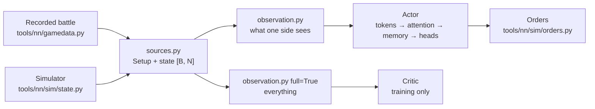
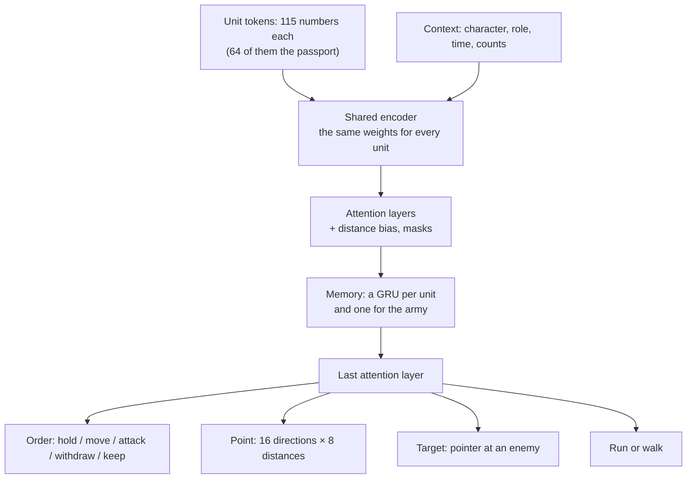

# The network's inputs and model

[← Back](README.md) · [Documentation](../README.md) › [Training data](README.md) › Inputs and model · [Русский](../../ru/training/model.md)

What the network gets as input and how it is built, in code, following the design in
[network model](network.md). There is no training yet: the weights are random. Code — `tools/nn/model/`
(PyTorch; the observation also works on plain numpy).

## The rule: the AI sees only what a human sees

`observation.observe(state, setup, side, memory)` builds the input of one side. The same code
takes a recorded battle and the simulator's batch: both have the fields of the recorded
`nn_sample` ([recordings](README.md#what-a-recording-holds)).

- **Own units** — everything, exact morale too.
- **Enemy units** — only while visible: place, facing, speed, men and health, what they do,
  and the morale **state**. The exact morale percent never reaches the input (a test checks it).
- **Enemy not visible** — the last seen place and how long ago. Never seen — only its passport
  (the enemy's army is shown before battle).
- **The side's frame.** The origin is the map's centre; "forward" points from the side's army
  to the enemy's army at the start; "lateral" is to the right. Turn the world by 180° and swap
  the sides — the input is the same (a test checks it). So one network plays both sides.
- **Visibility.** The simulator gives `vis` (visible to the other side). The recordings have
  no visibility: the map is flat and empty, so every unit is taken as visible.

### Before battle (static)

| Input | Who sees it | Scale |
|---|---|---|
| Passport of every unit, own and enemy ([passports](units.md)): men, health, mass, speeds, attack, defence, charge, weapon damage and bonuses, armour, shield, leadership, resistances, missile (range, ammo, damage, reload, accuracy), cost, caste, size, attributes | both sides | ~0–1; wide numbers (health, mass, cost, damage) on a log scale; caste, size, attributes as 0/1 |
| Experience rank | both sides | rank / 9 |
| Faction character (5 numbers, `config/nn/factions.json`) | own side | 0–1 as written |
| Role: attack or defend | own side | 0/1 |
| Lord level, own and enemy | both | level / 50 |
| Map size | both | m / 2000; each unit also gets the distance to the edge ahead, behind, right and left (m / 1000) |

The faction character values are **placeholders** (Empire and Skaven); the owner picks the final
ones by lore.

### In battle (each unit, every decision)

| Input | Own unit | Enemy, visible | Enemy, not visible | Scale |
|---|---|---|---|---|
| Place (forward, lateral) | yes | yes | last seen | m / 500 |
| Facing | yes | yes | — | cos, sin of the angle to "forward" |
| Speed (forward, lateral) | yes | yes | — | m/s / 5, from two decisions |
| Men, health | yes | yes | — | share of the start |
| Morale state: steady, wavering, routing, shattered | yes | yes | — | 0/1 |
| In melee, moving, running, firing | yes | yes | — | 0/1 |
| Distance to the map's edges | yes | yes | from the last seen place | m / 1000 |
| Exact morale (`MoralePercent`) | yes | **no** | — | / 2, clipped to ±1.5 |
| Detailed morale state 1–7 | yes | **no** | — | 0/1 |
| Ammunition, kills | yes | no | — | share of the start; kills / 200 |
| Fatigue state (6), known or not | yes | no | — | 0/1 |
| Order point, has an order, has a target | yes | no | — | m / 500; 0/1 |
| Threat to the left flank, right flank, rear | yes | no | — | 0/1 |
| Own or enemy, visible now, ever seen, age of the sighting | yes | yes | yes | 0/1; age s / 60, up to 1 |
| Fought in melee lately, routed lately | yes | yes (seen then) | — | 1 now, down to 0 after 120 s; 0 never |

Morale states 1–4 of the game (eager … shaken) are all "steady" for the enemy: telling them
apart would give away the exact morale.

Every decision also gets the battle time (s / 3600, the 60-minute limit), the count of own
living units and of known enemy units (/ 20), and whether the own and the enemy lord is slain and
how lately (1 now, down to 0 after 120 s). The game announces a general's death, so the enemy
lord's counts even when he was not seen.

The critic's view (`full=True`) fills every field for every unit, with no visibility, and adds
the enemy's character. It is for training only.

## Model

- **Tokens.** One token per unit, own and enemy, with the same encoder: a new unit is known by
  its passport, not by its name. The context (character, role, time) is added to every token
  and is a token of its own.
- **Attention** (3–4 layers): every unit looks at the others. Masks: padding, own dead units and
  enemies seen destroyed are never looked at. A learned bias per head by the distance between
  two units (16 buckets, 0 to ~1500 m) makes "who is near" easy. Invisible enemies stay in the
  attention with their last seen place.
- **Memory: a GRU per token**, before the last attention layer. Training runs it through chunks
  of 64 decisions (32 s of battle) ([training](training.md)). Chosen over attention to the
  last frames because the cost of a decision does not grow with the memory; the state is one
  vector per unit, easy to carry and the same on every computer in co-op; the 10–20 s horizon
  (20–80 decisions at 2–4 per second) is learned, not fixed by a buffer.
- **Heads** for every own unit that takes orders (alive, not routing):
  - order kind; "attack" only when a visible living enemy exists; "keep" — no new order, the one
    in force goes on (the network does not jerk a unit every decision);
  - point for move and withdraw: one of 16 directions in the side's frame (0 = towards the
    enemy) × 8 distances from the unit, 10–400 m on a log scale, clipped to the map. Bins,
    not a normal distribution: the choice can have several peaks ("left flank or right flank"),
    survives int8, and the best bin is found without randomness;
  - target: a pointer at a visible living enemy (the unit's query against each enemy's key),
    as in AlphaStar;
  - run or walk.
- **LoRA adapters** per pair "faction + role" on the attention and feed-forward layers
  (`lora_rank`, off by default). An adapter starts as "no change"; `lora.freeze_base` leaves only
  the adapters to train.
- **Critic** (training only): its own encoder and attention on the full view, pooled own and
  enemy units and the context token → the value of the battle for the side.

Orders go out in the simulator's format (`tools/nn/sim/orders.py`): `kind`, `x`, `z`,
`target`, `run` [B, N] in the state's slots. Units of the other side, dead and routing units
hold.

## Sizes

`tools/nn/model/config.py`, count with `bash tools/nn/dock.sh tools.nn.model.bench`:

| Preset | Width | Attention layers | Actor | Critic (training only) | One LoRA adapter, rank 8 |
|---|---:|---:|---:|---:|---:|
| `small` | 128 | 3 | 0.78 M | 0.69 M | 0.05 M |
| `target` | 512 | 4 | 14.98 M | 20.30 M (6 layers) | 0.26 M |

## Speed

One decision of one side, 20 vs 20 units, random weights, median of 50
(`bash tools/nn/dock.sh tools.nn.model.bench`, 30.09.2026). "Decision" = observation + network +
sampling + orders; "network" = the network alone.

| Where | `small`: decision / network | `target`: decision / network |
|---|---:|---:|
| CPU, 1 thread | 3.5 / 1.4 ms | 16.9 / 14.6 ms |
| CPU, 4 threads | 3.2 / 0.9 ms | 7.6 / 5.2 ms |
| GPU RTX 5070 Ti, 1 battle | 13.3 / 2.0 ms | 12.8 / 4.6 ms |
| GPU, 256 battles at once (training) | 13.0 ms (51 µs per battle) | 28.8 ms (113 µs per battle) |

- In the game, one battle at a time: the GPU is no faster than the CPU, it waits for its many
  small launches. The `target` network on 4 CPU threads takes ~8 ms per decision: at 4
  decisions a second that is ~3% of those threads' time, and the GPU is not needed.
  On the GPU the same load is ~5% of the time, and the GPU is mostly idle even then:
  well within the ≤ 20% budget.
- In training the GPU pays off: 256 battles in 29 ms.

## Determinism in co-op: int8

Co-op needs every computer to get exactly the same order ([network model](network.md#co-op)).
An int8 export of the actor looks practical; not done yet:

- the heavy part is matrix products (Linear, attention, GRU): int8 weights and activations
  with int32 sums give the same result on any processor;
- LayerNorm, softmax, GELU, sigmoid and tanh need integer versions (lookup tables or
  polynomials, as in I-BERT, Kim et al., 2021). That is the main work;
- the heads are discrete (order kind, point bin, pointer, run), so a small rounding difference
  changes a choice only at an exact tie; ties go to the lowest index;
- randomness: sampling from integer logits with a seed from `bm:random_number()`;
- the memory (GRU state) must be kept in integers too, or it drifts between computers over
  a long battle.

## Tests

- `tests/tools/test_nn_observation.py` (numpy, runs in `.venv`): frame, scaling, padding;
  the enemy's exact morale never reaches the input; invisible enemies keep only the last seen
  place; side symmetry; unit order; recorded battles.
- `tests/tools/test_nn_model.py` (torch; skipped in `.venv`, run in the container): numpy and
  torch give the same input; only visible living enemies can be targets; swapping units swaps
  the outputs; memory; adapters; log-probabilities; points inside the map; the critic; the
  presets' sizes; recorded battles and the simulator's state → orders.

The `snake-ai-trainer` image has no pytest. The torch tests were run with the pure-Python
pytest of `.venv` put on `PYTHONPATH` in the container.
