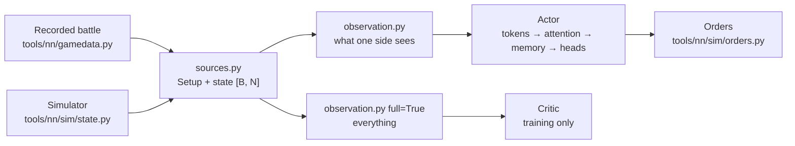
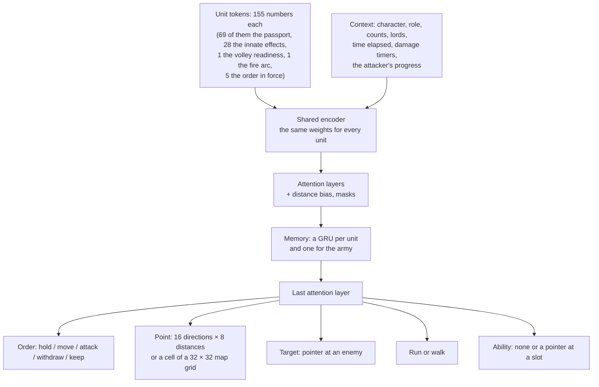
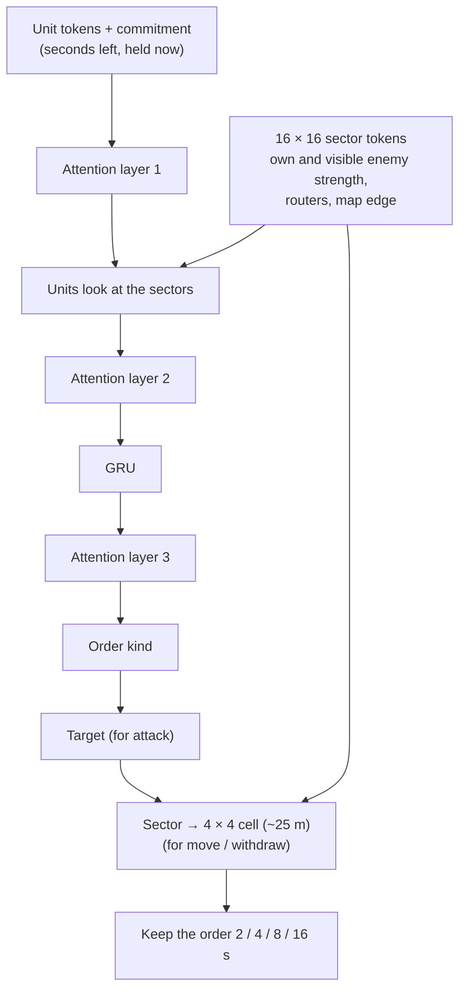

# The network's inputs and model

[← Back](README.md) · [Documentation](../README.md) › [Training data](README.md) › Inputs and model · [Русский](../../ru/training/model.md)

What the network gets as input and how it is built, in code, following the design in
[network model](network.md); it is trained in the simulator ([training](training.md)). Code — `tools/nn/model/`
(PyTorch; the observation also works on plain numpy).



## The rule: the AI sees only what a human sees

`observation.observe(state, setup, side, memory)` builds the input of one side. The same code
takes a recorded battle and the simulator's batch: both have the fields of the recorded
`nn_sample` ([recordings](README.md#what-a-recording-holds)).

- **Own units** — everything, exact morale too.
- **Enemy units** — only while visible: place, facing, speed, men and health, what they do,
  and the morale **state**. The exact morale percent never reaches the input (a test checks it).
- **Enemy not visible** — the last seen place and how long ago. Never seen — only its passport
  (the enemy's army is shown before battle).
- **The side's frame.** The origin is the map's centre; "forward" points from the side's army
  to the enemy's army at the start; "lateral" is to the right. Turn the world by 180° and swap
  the sides — the input is the same (a test checks it). So one network plays both sides.
- **Visibility.** The simulator gives `vis` (visible to the other side). The recordings have
  no visibility: the map is flat and empty, so every unit is taken as visible.

### Before battle (static)

| Input | Who sees it | Scale |
|---|---|---|
| Passport of every unit, own and enemy ([passports](units.md)): men, health, mass, speeds, attack, defence, charge, weapon damage and bonuses, armour, shield, leadership, resistances, missile (range, ammo, damage, reload, accuracy; at the end: direct fire, spread, muzzle velocity), cost, caste, size, attributes (unbreakable, fire whilst moving, …) | both sides | ~0–1; wide numbers (health, mass, cost, damage) on a log scale; caste, size, attributes as 0/1 |
| Fire arc (after the volley readiness; [below](#fire-arc-both-sides)) | both sides | the arc each side / 180 deg: 1.0 for the Night Runners' throwing stars, 0.17 for bows, slings, crossbows, handguns; 0 without a missile weapon |
| Order in force (the token's end; [below](#order-in-force-own-units-the-tokens-last-inputs)) | own side only | its kind (hold / move / attack / withdraw) 0/1; how long it has been in force, s / 60, at most 1 |
| Experience rank | both sides | rank / 9 |
| Faction character (5 numbers, `config/nn/factions.json`) | own side | 0–1 as written |
| Role: attack or defend | own side | 0/1 |
| Lord level, own and enemy | both | level / 50 |
| Map size | both | m / 2000; each unit also gets the distance to the edge ahead, behind, right and left (m / 1000) |

The faction character values are **placeholders** (Empire and Skaven); the owner picks the final
ones by lore.

### In battle (each unit, every decision)

| Input | Own unit | Enemy, visible | Enemy, not visible | Scale |
|---|---|---|---|---|
| Place (forward, lateral) | yes | yes | last seen | m / 500 |
| Facing | yes | yes | — | cos, sin of the angle to "forward" |
| Speed (forward, lateral) | yes | yes | — | m/s / 5, from two decisions |
| Men, health | yes | yes | — | share of the start |
| Morale state: steady, wavering, routing, shattered | yes | yes | — | 0/1 |
| In melee, moving, running, firing | yes | yes | — | 0/1 |
| Distance to the map's edges | yes | yes | from the last seen place | m / 1000 |
| Exact morale (`MoralePercent`) | yes | **no** | — | / 2, clipped to ±1.5 |
| Detailed morale state 1–7 | yes | **no** | — | 0/1 |
| Ammunition, kills | yes | no | — | share of the start; kills / 200 |
| Volley ready: seconds since the ammunition last fell (the last volley) / the passport's reload ([below](#volley-readiness-own-units)) | yes | no | — | 0–1; 1 before the first shot; 0 without a missile weapon |
| Fatigue state (6), known or not | yes | no | — | 0/1 |
| Order point, has an order, has a target | yes | no | — | m / 500; 0/1 |
| Threat to the left flank, right flank, rear | yes | no | — | 0/1 |
| Own or enemy, visible now, ever seen, age of the sighting | yes | yes | yes | 0/1; age s / 60, up to 1 |
| Fought in melee lately, routed lately | yes | yes (seen then) | — | 1 now, down to 0 after 120 s; 0 never |

Morale states 1–4 of the game (eager … shaken) are all "steady" for the enemy: telling them
apart would give away the exact morale.

Every decision also gets the side's context:

| Input (context) | Scale |
|---|---|
| Count of own living units and of known enemy units | / 20 |
| Own lord slain, how lately; the enemy lord the same | 0/1; 1 now, down to 0 after 120 s |
| Battle time elapsed (a fine clock for the first minutes) | log(1 + s / 30) / log(21): 0.23 at 30 s, 0.59 at 150 s, 1 from 10 minutes |
| We have dealt damage yet; seconds since we last did | 0/1; s / 300, up to 1 (0 before the first) |
| The enemy has dealt us damage yet; seconds since it last did | 0/1; s / 300, up to 1 (0 before the first) |
| The attacker's progress (both sides): its damage rate; it has reached 0.05 yet; seconds since it last was at 0.05 or more | rate / 0.05, up to 4; 0/1; s / 300, up to 1 (0 before) |

The game announces a general's death, so the enemy lord's counts even when he was not seen.

Nothing in the input (nor in the critic's) refers to the battle's time limit: a campaign battle
may have none. Only time elapsed is given; the earlier `t / 3600` column (the 60-minute limit in
disguise) was removed.

The damage timers (`observation.TIMERS`) follow what a player sees: his units fight, the kill
counters and the balance-of-power bar. A side has dealt damage when some unit of the other side
lost health (`hp` fell) since the previous decision: all units, seen or not (the bar shows the
totals); a unit whose health is not known (NaN) counts nothing until known again. The memory
keeps the previous health (`Memory.prev_hp`) and the time of each side's last damage
(`Memory.hit_t`), so the simulator, recorded battles (per-second samples) and the companion
(the states the game sends) are measured by one rule. In training it is the reward's attacker
damage (`reward.struck`, `rollout.Battles.last_hit`: the defender's health fell in the step):
the attacker sees it as "we dealt", the defender as "the enemy dealt".

The attacker's progress (`observation.PROGRESS`) is the clock of the reward's idle cost with
`--idle-rate` ([training](training.md)), so the actor and the critic see the state that cost
depends on. The attacker's damage rate is the defender's gold lost (`observation.gold_lost`: the
unit's cost × the share of its health lost; a routing unit loses half of what it has left besides,
a dead, shattered or gone one all of it; counted once, as `reward.gold_lost`: only beyond the unit's
worst so far, so a rally is not damage and a rout after a rally adds nothing new) as a share of the budget (the mean
of the two armies' cost) a minute, an exponential mean over 30 s; the input is that rate / 0.05 (1
at the threshold), whether it has reached 0.05 yet, and seconds since it last did (the reward's
`last_hit`: the idle multiplier m grows with it). Both sides see it. It is computed from every
unit's health and state (a unit whose health is not known counts nothing until known again) and
the passports' cost (`Setup.cost`), with the time between the observations, in the memory
(`Memory.prev_gold`: each unit's worst so far, `rate`, `rate_t`): the simulator's observation and the companion's (the
game's states; a unit gone from the map reads no men there, `gone` in the simulator) are one rule.
It is the reward's clock while `--idle-rate`, `--idle-window` and the rout share are 0.05, 30 s
and 0.5 (`observation.RATE_MIN`, `RATE_WINDOW`, `ROUT_SHARE`); `rollout.Battles` warns otherwise.

A checkpoint written before these inputs (with the `t / 3600` column) loads as it is
(`encoder.TokenEncoder`): that column's weights are dropped and the new inputs' weights start at
zero, so it acts exactly as it did with the battle time at 0. One written before the progress
inputs loads with zero weights for them (inserted after the damage timers; the critic's enemy
character keeps its weights) and acts exactly as it did. What dropping the real `t / 3600`
changes (24 simulated battles against `ai_like`, 20 minutes, the greedy choices of
every unit that takes orders every 5 s, each network with its own memory): `test5/t0_gold30/m20.pt`
order kind 99.92% the same (35 487 choices), attack target 99.92%, move point 99.96%;
`runs/long_ai/best.pt` 99.93%, 99.93%, 99.92%; the least by minute of battle 99.7% (m20, 6th minute).

The critic's view (`full=True`) fills every field for every unit, with no visibility, and adds
the enemy's character. It is for training only.

### Abilities (each unit, each of its ability slots)

An ability is known by what it does, never by its name: its **passport**
(`config/nn/abilities.json`, written by `py -3.14 -m tools.nn.abilities` from the game's database;
features in `tools/nn/model/abilities.py`). A new lord's ability needs a passport, not a new
network. A unit has up to 3 slots (`tools/nn/sim/abilities.py` `slot_keys`, the same for the
simulator): active abilities first, then passives that reach other units, then the rest, each
group by key. General: Foe Seeker, Stand Your Ground, Hold the Line; Warlord: Verminous Valour,
Deadly Onslaught, Rally.

| Input (per slot, `Obs.abil` [B, N, 3, 114]) | Own unit | Enemy, visible | Enemy, not visible | Scale |
|---|---|---|---|---|
| Owned | yes | yes | yes | 0/1 |
| Ready to use now | yes | no | no | 0/1 |
| Seconds until ready | yes | no | no | s / 60, up to 3 |
| Seconds active left | yes | no | no | s / 30, up to 2 |
| Active now | yes | yes | no | 0/1 |
| Passport: passive, active and recharge time, uses, range, self-cast, how many friends / enemies it reaches, targets (self, friends, enemies) | yes | yes | yes | s / 60, s / 120, m / 100, 0/1 |
| Passport: effects on allies (the owner and his friends) and on enemies: 28 stats of the database (speed, charge speed, melee attack and defence, damage and AP, charge bonus, leadership, armour, resistances, missile damage, reload, accuracy, range, bonus vs large / infantry, mass, …) and 15 attributes (unbreakable, immune to psychology, causes fear, …) | yes | yes | yes | multipliers as value − 1; additions / 50 or / 100; attributes 0/1 |
| Passport: when (at the end): the game fires it itself (`auto`), on losing a melee / in melee, off out of melee / below half morale / when not wavering / below half health, another condition | yes | yes | yes | 0/1 |

Why the enemy's: a player sees the enemy army's cards before battle (the abilities are on them),
and in battle the game draws an active ability's effect on the unit and lists it among the
unit's active effects (CCO `ActiveEffectList`, read by the bridge). The enemy's timers are not
shown anywhere: they are not given. `Obs.abil_ok` [B, N, 3]: own abilities the network may use
now — owned, active (not passive), self-cast (used on the owner, no target to choose), ready
(not active, recharged) and the unit takes orders (alive, not routing). Without the timers in the
state (recordings) nothing is ready.

### Innate effects (each unit, each effect of the catalogue)

Every attribute and passive or game-fired ability of a unit is an innate effect of one catalogue
(`config/nn/effects.json`, [unit passports](units.md#innate-effects)); the token ends with a pair of
inputs per effect, in the catalogue's append-only `order` (14 effects, 28 inputs;
`tools/nn/model/effects.py`):

| Input (per effect) | Own unit | Enemy, visible | Enemy, not visible | Scale |
|---|---|---|---|---|
| Owned | yes | yes | yes | 0/1 |
| On now (its conditions hold: Strength in Numbers above half health, Scurry Away! while wavering, Frenzy above half morale, the Penitent's 20 s, an attribute always) | yes | yes | no | 0/1 |

Owned is on the unit's card (both armies' cards are seen before battle); the game lists a seen
unit's active effects (CCO `ActiveEffectList`). In the simulator "on" is its `fx_on`; in a recorded
battle or in the game (the companion) it is worked out from the token's own fields by the same
conditions (health, the morale state, melee; own morale for half-morale), and a timed effect whose
timer is not known (the Penitent) counts as off. A new effect appends its pair at the token's end
(before the volley input below): an older network loads with zero weights for it
(`encoder.pad_inputs`) and acts as before.

### Volley readiness (own units)

The kiting skill is "halt when the volley is ready, run while reloading", and nothing else in the
token tells when a missile unit has reloaded. One input (`volley_ready`, `observation.VOLLEY`,
03.10.2026): seconds since the unit's projectiles left (`a`) last fell between two observations
(its last volley), divided by the passport's `reload_s`, clipped to 0..1. 1 before the first shot,
0 for a unit without a missile weapon; own units only (the critic sees all).

It is worked out in `observation.observe` from `a` at the decisions only (the memory keeps the
last reading and the time of the last fall: `Memory.prev_ammo`, `volley_t`), so the simulator (its
ammunition counter, read at the network's 1 s cadence, not at its 0.5 s physics steps) and the
companion (the bridge's `ammo_left()` each second) compute it with the same code from the same kind of
samples; a reading that is missing changes nothing. The input is appended after the innate
effects: a checkpoint saved before it, small or wide, loads with zero weights for it and acts as
before (`encoder.pad_inputs`; the wide `test5/w3_kiting30/m15.pt` and `wide/w0.pt` and the small
`test5/r7_lostworst/m15.pt` checked).

What it shows differs a little between the two worlds, from their shooting, not from the input:

- the scale is the passport's reload (Night Runners 8 s), while the simulator's men load fully
  only after its measured reload (missile.py: 10.2 s for them): 1 means "the passport's reload
  has passed";
- in the simulator a unit that stands and shoots on fires the steady rate men / reload after its
  first volley (ammunition falls every second), so the input stays at 0 until it moves; the game
  fires whole-unit volleys one reload apart ([measurements](measurements.md)), so there it goes
  0 → 1 between volleys while standing too. While the unit runs (the kiting drill) both rise alike.

### Fire arc (both sides)

One input (`fire_arc`, `observation.ARC`, 07.10.2026): a man's fire arc each side from the passport
(`missile.fire_arc_deg`, the database's `battle_entities.fire_arc_close` / 2) over 180 deg. It is 1.0 for the Night
Runners' throwing stars, which shoot all round and on the move (the entity `..._fast_360`), 0.17 for bows, slings,
crossbows and handguns (±30 deg), 0.19 for the militia (±35 deg), 0 for a unit without a missile weapon. Without it
the network cannot tell stars from a sling by where the unit can shoot. It is on the unit's card: both sides see it.

The input stands at the very end of the token, after the volley readiness, not among the passport's features: the
columns before it keep their places, and a checkpoint saved before it loads with zero weights for it and acts as
before (`encoder.pad_inputs`; checked on `test5/s44_defonly/m20.pt`, the chain's last step before it - the same
logits, memory, orders and value, `tests/tools/test_nn_model.py`).

### Order in force (own units, the token's last inputs)

Five inputs (`observation.ORDER`, 07.10.2026): the kind of the order the unit has in force now (hold, move,
attack, withdraw - one 0/1 each), and how many seconds it has been in force, over 60 (at most 1). An order is new
as in the reward: another kind, another attack target or a point more than 10 m from the old one. The same order
again and "keep" do not reset the clock. Without these inputs the network did not know how long a unit had been
walking to its point, and re-issued "move ahead" every second (the drift, `build/drift`).

Where from: the state's fields `order_kind`, `order_target` (the simulator: the order in force; the companion: the
last order given, `exchange.order_points`) and the order point `ox`, `oz`; the clock is in the observation's memory
(`Memory.ord_*`). Without the fields (recorded battles) all five are 0. An older checkpoint loads with zero weights
for them and acts as before.

## Model



- **Tokens.** One token per unit, own and enemy, with the same encoder: a new unit is known by
  its passport, not by its name. The context (character, role, timers) is added to every token
  and is a token of its own. Each ability slot goes through one small shared network
  (`AbilityEncoder`); the sum over the unit's owned slots is added to its token, so the slots'
  order does not matter. Its last layer starts at zero: an actor trained before abilities sees
  exactly what it saw.
- **Attention** (3–4 layers): every unit looks at the others. Masks: padding, own dead units and
  enemies seen destroyed are never looked at. A learned bias per head by the distance between
  two units (16 buckets, 0 to ~1500 m) makes "who is near" easy. Invisible enemies stay in the
  attention with their last seen place.
- **Memory: a GRU per token**, before the last attention layer. Training runs it through chunks
  of 64 decisions (64 s of battle at the game's cadence of a decision a second) ([training](training.md)). Chosen over attention to the
  last frames because the cost of a decision does not grow with the memory; the state is one
  vector per unit, easy to carry and the same on every computer in co-op; the 10–20 s horizon
  (10–20 decisions at one a second) is learned, not fixed by a buffer.
- **Heads** for every own unit that takes orders (alive, not routing):
  - order kind; "attack" only when a visible living enemy exists; "keep" — no new order, the one
    in force goes on (the network does not jerk a unit every decision);
  - point for move and withdraw: one of 16 directions in the side's frame (0 = towards the
    enemy) × 8 distances from the unit, 10–400 m on a log scale, clipped to the map. Bins,
    not a normal distribution: the choice can have several peaks ("left flank or right flank"),
    survives int8, and the best bin is found without randomness;
  - **a map grid** (the model option `grid`, training `--grid 32`) instead of the bins: the point is the centre of
    one of 32 × 32 cells of a square ±800 m around the map's centre in the side's frame. The side's frame is fixed
    at the start of battle, so a cell is the same place on the map all battle: the same cell again is the same
    order, and the reward does not charge it. With the bins, "30 m ahead of me" every second was a new point 1-3 m
    from the old one each time (not counted as a change), and units walked off 1-2 km (the drift, `build/drift`).
    The cells' logits: the unit's query against a learned key per cell minus a learned weight of the unit
    (softplus, 1 at first) × the distance from the unit to the cell in cells - a fresh head prefers the near
    cells. A checkpoint of the bins loads into such a network (`run.with_grid`): everything but the point head
    comes from it, the grid head starts fresh. The anchor's KL is on the order kind and the target only, so the
    reference may have the bins. The teacher turns a script's point into the nearest cell. The companion needs no
    flag: the grid is in the checkpoint's config;
  - target: a pointer at a visible living enemy (the unit's query against each enemy's key),
    as in AlphaStar;
  - run or walk;
  - ability: "none" or a pointer at one of the unit's slots (the unit's query against a key made
    from each slot's state and passport), only slots in `abil_ok`. It is independent of the
    order kind (a lord can move and use an ability at once). Permuting the slots permutes the
    choice; an ability never seen before still gets a valid choice (tests). Sampled only when
    asked (`heads.sample(..., abilities=True)`; `decide.act` asks): until training knows the head,
    `Action.ability` is `None` and `log_prob` leaves it out.
- **Loading an older actor.** `Actor.load_state_dict` accepts a state without the ability parts
  (`policy.ABILITY_PARAMS`): they start fresh — the encoder adds nothing, the head picks at random
  among ready abilities.
- **No adapters.** One network for every faction and role (the role and the faction character are
  inputs). A checkpoint with the former LoRA wrapper layers (saved as `qkv.base.weight`, the adapters
  never switched on) loads as it was (`encoder.Block`).
- **Critic** (training only): its own encoder and attention on the full view, pooled own and
  enemy units and the context token → the value of the battle for the side.

Orders go out in the simulator's format (`tools/nn/sim/orders.py`): `kind`, `x`, `z`,
`target`, `run` [B, N] in the state's slots, and `ability` [B, N] (the slot to use now, −1 none;
optional: orders made without it get −1). Units of the other side, dead and routing units
hold and use nothing.

**In training** (`tools/nn/train/rollout.py`, `ppo.py`; [training](training.md#lord-abilities)):
the learner and the past version choose abilities (`heads.sample(..., abilities=True)`), the
rollout keeps `Action.ability` and the update counts it in the log-probability; the `ai` flag is
true only for the scripted opponents' sides (`tools/nn/sim/abilities.py` `set_rule`, again after
every restart: the bank's rows bring `scenario.build`'s default, side 2); the LiveSetup carries
`abil`, `abil_owned`, `abil_use`. A stored transition keeps only the slots' state (5 numbers) and
the battle's bank row; `rollout.full_obs` puts the passports back for the update.

## Variant v2: map sectors, chained heads, commitment

A new base of the network (preset `v2`, `tools/nn/model/config.py`: field `sectors` > 0). The same base as
`wide`: unit tokens by passport, 3 attention layers, a GRU memory. Three differences.



- **Map sectors** (`tools/nn/model/sectors.py`). The square ±800 m around the map's centre in the side's frame
  (fixed for the battle, as the `--grid` head's) is cut into 16 × 16 sectors of 100 m. A sector has 8 features, only
  from what the side sees: own strength (cost × share of health left, summed), own units, strength and number of
  the enemies visible now, strength of the enemies seen earlier (at their last place, cost only), whether an own
  unit / a visible enemy unit there routs, the share of its cells inside the map. A sector token = a learned
  embedding of its place + a small network of its features (width 64). The units look at the sectors with one
  attention layer after the first layer (2 heads, a learned bias for the distance from the unit to the sector's
  centre). Sectors do not look at each other: 256 × 256 a decision would cost more than all the units' attention.
  The geometry (the side frame's origin and axis, the map's bounds: 8 numbers, input `geo`) comes with a decision,
  so the network knows the cells beyond the map's edge and never picks them.
- **Chained heads** (`tools/nn/model/chain.py`): order kind → target pointer (for attack) → place (for move and
  withdraw): first a sector (the unit's query against the sector tokens; a fresh head prefers the near ones), then
  a 4 × 4 cell inside the chosen sector (the point: the cell's centre, 25 m) → the commitment's length. Every later
  part sees the earlier ones: condition = the unit's token + an embedding of the kind + the target's token. With the
  kinds as they are only an attack has a target and only move / withdraw have a place, so the place knows the
  kind and its target part is always empty. Run depends on the kind; the ability as before, apart. The parts are
  chosen in order, so the network samples itself (`Actor.act`); in training the logits are those under the
  choice made (`Actor.sequence(..., action)`).
- **Commitment** (`tools/nn/model/commit.py`). With every new order (hold, move, attack, withdraw) the unit chooses
  how long to keep it: 2, 4, 8 or 16 s. While it runs the unit's only allowed choice is keep (a mask: probability
  1, nothing to learn, entropy 0). It ends at once when: the unit comes into melee; an enemy comes to threaten its
  flank or rear (the threat flags: how an attack on the unit shows); the attack's target died, routs or is no
  longer seen; the unit routed or rallied; the own lord died. A keep chosen by the unit itself starts none. The
  network sees the seconds left (÷ 16) and whether the unit is held. All from the side's observation and the
  battle time: the simulator (`rollout.Battles.cstate`) and the companion (`loop.Brain.commit`, from the game's
  state) keep it the same way. The log's order-kind counter counts only the units that decide (not held ones).
- **Eyes** (`tools/nn/model/eyes.py`, field `eyes`, on in the `v2` preset). Auxiliary heads after the memory, before
  the last attention block and the decision heads; they learn from the simulator's truth with a loss of their own
  (squared error, the 4 heads summed × weight 5, `--eyes-weight`): an own unit — the share of its health it will lose
  in 10 s and in 30 s; an enemy unit — its "threat": the gold of our health it will destroy in 30 s (share of our
  army's cost × 10); a sector — its "danger": the sum of the health shares our units standing in it will lose in
  10 s (from the sector token and the sums of the own and enemy unit tokens in it). The predictions go back: through
  a small linear layer, added to the own / enemy unit's token and to the sector token (the place head reads it). They
  go back without a gradient (detach): the eyes learn only from the truth, PPO cannot turn them into a code of its
  own; the shared trunk under them gets both gradients. The truth comes from the rollout: at every decision the
  units' health and the simulator's `gold_out` counter (gold of enemy health destroyed; bookkeeping only, no effect
  on the battle) before and after its simulator steps; the target is the change over 10 / 30 decisions within the
  64-decision chunk; a battle that ended sooner — its end (nothing after); a window past the chunk's end — masked.
  Weight 5: on the first chunks against `nearest` the eyes' gradient at weight 1 was 0.05 of PPO's (0.004 vs 0.08),
  at 5 ~0.25. The log has each head's error and explained share (`eyes_<head>`, `eyes_ev_<head>`). Fresh heads start
  predicting about 0 (as almost every target is): from 0.5 the first error (~23, mostly the 256 sectors) gave the eyes
  a gradient 1000 × PPO's. The critic gets no eyes (it sees the whole field anyway). Picture: `build/v2/eyes_png.py`.
- **Reward v2** (`run.py --reward v2`): win / loss + the gold trade + order change cost 0.006 (keep and a
  repeated order free); lord, idle and retarget 0.
- **From scratch.** `--preset v2` without `--init` starts from `build/nn-train/random_v2.pt` (written if missing);
  it is also the untrained opponent in the pool (for test5: `--init build/nn-train/random_v2.pt`). No widening from
  `small`: one learning rate for every weight (`lr`, not divided by the width). No teachers with v2 (the rollout
  checks it).
- **Memory in training.** The sector branch's insides are not kept for the update but recomputed in the backward
  pass (activation checkpointing), and the minibatch is computed in 3 parts, not 2 as `wide`'s.
- **The old untouched.** `small`, `wide`, `target` and their checkpoints work as before; `Actor(cfg)` with
  `sectors` > 0 builds an `ActorV2` itself, so a v2 checkpoint loads everywhere (training, evaluation, companion).

Speed (RTX 5070 Ti, 1024 battles, a decision a second; `build/v2/bench_v2.py`):

| | `wide` (s46, grid 32) | `v2` |
|---|---:|---:|
| Actor, M weights | 3.37 | 3.51 |
| The network on one decision of 1024 rows (19 v 19), ms | 19.3 | 21.4 |
| Training: battle seconds per second | 4,690 | 4,320 |
| Collecting 64 decisions / the update, s | 5.1 / 9.1 (2 parts) | 4.5 / 11.1 (3 parts) |
| GPU memory peak at the update, GB | 11.7 | 9.5 |
| Updates / battles finished in 5 min | 22 / 3,438 | 20 / 1,435 |

v2 is ~8 % slower than `wide` (the goal: not more than 2 times). With the eyes (10 min of training): 3,920 battle seconds per second, collecting / update 5.0 / 11.9 s, peak 9.9 GB — ~9 % slower again; the eye heads' explained share went from −0.1 to 0.49–0.68 in 10 min. Fewer battles finish because an untrained
network's battles last longer, not because of the speed.

**Tried and rejected.** v2's minibatch in 2 parts without recomputing the sector branch: a 12.5 GB peak of 16, the
card spilled into shared memory, an update 10 s → 157 s. Recomputed in 2 parts: 11.9 GB (at the edge, like
`wide`); in 3 parts: 9.5 GB, the update +7 % time.

## Sizes

`tools/nn/model/config.py`, count with `bash tools/nn/dock.sh tools.nn.model.bench`:

| Preset | Width | Heads | Attention layers | Actor | Critic (training only) |
|---|---:|---:|---:|---:|---:|
| `small` | 128 | 4 | 3 | 0.85 M | 0.70 M |
| `wide` | 256 | 8 | 3 | 3.23 M | 2.75 M |
| `target` | 512 | 8 | 4 | 15.52 M | 20.32 M (6 layers) |
| `v2` | 256 | 8 | 3 + sectors | 3.51 M | 2.75 M |

`wide` is `small` × 2 in every width (the head width stays 32); it is made from a trained `small`
network by widening (below), not trained from scratch. `v2` is `wide`'s base + the map sectors, the chained heads and the
commitment (above); it is trained from scratch.

## Widening

`tools/nn/model/widen.py` makes a trained network k times wider so that it computes exactly what it
did; training then goes on from it as usual (`--init`, the self-anchor on it):

```bash
bash tools/nn/dock.sh tools.nn.model.widen --src build/nn-train/test5/r7_lostworst/m15.pt     --dst build/nn-train/wide/w0.pt --critic-src build/nn-train/runs/test5_r7_lostworst/latest.pt     --critic-dst build/nn-train/wide/w0_critic.pt --factor 2
# then: test5 --init build/nn-train/wide/w0.pt -- --critic-init build/nn-train/wide/w0_critic.pt
```

How to train it (the whole command; why it collapsed with a halved minibatch):
[training a widened network](training.md#training-a-widened-network).

What grows k times: the token width (128 → 256), the attention heads (4 → 8; new heads beside the
old ones), the feed-forward (512 → 1024), the GRU (128 → 256), the hidden layers of the unit,
context and ability encoders, of the ability key and of the critic's value, and the pointers'
width (64 → 128); the critic's width and heads the same. The depth stays.

The method (Net2WiderNet, Chen et al., 2016, with exact copies):

- **The token stream is copied**: x → [x, x]. A LayerNorm over [x, x] has the same mean and variance
  as over x, so with its gain and bias repeated it gives [y, y]. New channels at zero would not do:
  they change the LayerNorm's mean and variance, so its output.
- **Writers write every copy**: the rows of the encoders' last layers, attention out, feed-forward
  out and the GRU are repeated. A GRU unit and its copy get equal inputs and weights, so their states
  stay equal at every step.
- **Readers read each copy with half the weight plus a noise of zero sum**: (W/2 + E) y + (W/2 − E) y
  = W y exactly while the copies are equal. The noise (0.1 × the weights' std) breaks the symmetry:
  the copies get different gradients and grow apart in training.
- **New units** (feed-forward, the encoders', the ability key's and the value's hidden layers, the
  new heads' queries, keys and values): incoming weights small random (0.1 × the layer's weights'
  std), bias 0, **outgoing weights 0**; they add nothing until trained, and their outgoing weights
  get a gradient from the first update. New heads take the old heads' distance bias.
- **Pointers** (attack target, ability): q·k / √width. The new key dimensions are 0 (q·k is
  unchanged), the new query dimensions random, the old query × √k for the wider √width.

**The proof** (`--check-battles`, after every widening): 16 random armies (up to 19 units a side)
played by the small network against `ai_like` for 48 decisions, 8 256 unit decisions, the memory
carried through. In float64 (the small network and its widening in float64) the largest difference:
target logits 4·10⁻¹³, point 4·10⁻¹⁴, kind, run, ability ≤ 2·10⁻¹⁴, memory 8·10⁻¹⁵, value 1·10⁻¹⁵ —
the method is exact. The stored float32 checkpoint against the small one: kind 6·10⁻⁶, run 7·10⁻⁶,
ability 5·10⁻⁶, memory 4·10⁻⁶, value 1·10⁻⁶; point 2.3·10⁻⁵ and target 2.2·10⁻⁴ on logits up to
22 and 250 — the small network's own float32 error (its float32 against its float64) is the same:
1.9·10⁻⁵ and 2.3·10⁻⁴. Greedy choices 100% the same. Tests: `tests/tools/test_nn_widen.py`.

**Training the widened network.** A checkpoint carries its sizes (`config`), so `run.py`, `test5`,
the evaluation and the companion build the wide network from it; small checkpoints load as before.
`--preset` follows `--init`'s record. Past versions of another size in the pool (`random.pt`, a
`--pool-extra`) play with an actor of their own size. The optimizer is not in a checkpoint: every run
starts a fresh Adam. The minibatch is divided by the width (`run.sized`): the wide network with the
small one's minibatch (2 252 decisions at 40 slots) failed in its first policy update on the 16 GB
card; with 1 126 its peak is 10.9 GB. So a wide update takes twice the optimizer steps on half the
data (with the fresh Adam the KL stop at 0.05 ends some updates early).

Smoke, `test5` protocol, 2–3 minutes, RTX 5070 Ti, policy updates: `small` from `m15.pt` 8 700 s of
battle a second (collect 2.9 s, update 4.7 s), `wide` from `w0.pt` 5 900 (4.9 s, 7.6 s) — about 0.7×;
distance from the start after 13–14 updates: `small` 0.018, `wide` 0.031.

## Speed

One decision of one side, 20 vs 20 units, random weights, median of 50
(`bash tools/nn/dock.sh tools.nn.model.bench`, 03.10.2026). "Decision" = observation + network +
sampling + orders; "network" = the network alone.

| Where | `small`: decision / network | `wide`: decision / network | `target`: decision / network |
|---|---:|---:|---:|
| CPU, 1 thread | 4.8 / 1.8 ms | 7.4 / 4.3 ms | 19.7 / 16.6 ms |
| CPU, 4 threads | 4.8 / 1.3 ms | 5.7 / 2.1 ms | 9.8 / 6.0 ms |
| GPU RTX 5070 Ti, 1 battle | 18.7 / 2.9 ms | 16.7 / 2.8 ms | 16.3 / 2.9 ms |
| GPU, 256 battles at once (training) | 16.8 ms (66 µs per battle) | 19.5 ms (76 µs per battle) | 38.3 ms (150 µs per battle) |

- In the game, one battle at a time: the GPU is no faster than the CPU, it waits for its many
  small launches. The `wide` network on 4 CPU threads takes ~6 ms per decision, the `target` one
  ~10 ms: at a decision a second that is ≤ 1% of those threads' time, and the GPU is not needed.
  On the GPU a decision takes ~17 ms whatever the size (launches): ~2% of the time at a decision
  a second, well within the ≤ 20% budget.
- In training the GPU pays off: 256 battles in 17–38 ms.

## Determinism in co-op: int8

Co-op needs every computer to get exactly the same order ([network model](network.md#co-op)).
An int8 export of the actor looks practical; not done yet:

- the heavy part is matrix products (Linear, attention, GRU): int8 weights and activations
  with int32 sums give the same result on any processor;
- LayerNorm, softmax, GELU, sigmoid and tanh need integer versions (lookup tables or
  polynomials, as in I-BERT, Kim et al., 2021). That is the main work;
- the heads are discrete (order kind, point bin, pointer, run), so a small rounding difference
  changes a choice only at an exact tie; ties go to the lowest index;
- randomness: sampling from integer logits with a seed from `bm:random_number()`;
- the memory (GRU state) must be kept in integers too, or it drifts between computers over
  a long battle.

## Tests

- `tests/tools/test_nn_observation.py` (numpy, runs in `.venv`): frame, scaling, padding;
  the enemy's exact morale never reaches the input; invisible enemies keep only the last seen
  place; side symmetry; unit order; recorded battles; abilities: the own bar, the enemy's only
  active and seen, nothing ready without timers or for a routing lord; the damage timers restart
  at each damage, per side and per battle row, rising or unknown health is no damage, a new memory
  starts empty, a recording gives the same timers as the same states observed one by one; the
  context does not depend on time beyond the fine clock (no time limit); the attacker's progress:
  the cost is the passports', the rate follows the defender's gold lost (blows, a rout, a rally, a rout again counted once,
  unknown health, death and shattering), both sides see it, the defender's blows do not count.
- `tests/tools/test_abilities.py` (numpy): reading the ability tables, passports, the cards'
  check, the saved numbers, features and slots.
- `tests/tools/test_nn_model.py` (torch; skipped in `.venv`, run in the container): numpy and
  torch give the same input; only visible living enemies can be targets; swapping units swaps
  the outputs; memory; a checkpoint of the former LoRA wrapper; log-probabilities; points inside the map; the critic; the
  presets' sizes; recorded battles and the simulator's state → orders; the ability head: only
  ready own abilities, permuting slots permutes the choice, an unseen passport still gives a
  valid choice, log-probability only when chosen, an older actor loads; the damage timers on
  numpy and torch; networks with the older context (the `t / 3600` column) load and give the same
  logits, greedy actions, memory and values, also the trained `test5/t0_gold30/m20.pt` and
  `runs/long_ai/best.pt` (skipped without them); networks saved before the progress inputs (and
  `test5/r1_idleprog/m15.pt`) load and give the same outputs; the innate effects: owned as the catalogue says,
  numpy and torch the same, "on" follows its conditions and is shown for seen enemies only, the
  simulator's `fx_on` and the observed fields agree, networks saved before them (and the chain's
  `test5/it5/m20.pt`) load and give the same outputs, the same with the effect inputs zeroed, and
  the new inputs get a gradient; networks saved before the volley input (and the wide
  `test5/w3_kiting30/m15.pt`, `wide/w0.pt`, the small `test5/r7_lostworst/m15.pt`) load and give the
  same logits, memory, greedy orders and values while it takes values inside 0..1, and it gets a
  gradient.
- `tests/tools/test_nn_volley.py` (torch): the simulator's path (the training's `LiveSetup`, the
  state read at the decisions only, a volley between two of them) and the companion's
  (`loop.Brain` on the bridge's documents each second) give the same volley input on one
  projectiles-left trajectory, as worked out by hand; in the kiting drill with the skilled script
  the Night Runners' input is 1 before the first volley, 0 at each decision their ammunition fell,
  rises by 1 / reload a decision while they run, and goes 0 → 1 at least twice per unit.
- `tests/tools/test_nn_widen.py` (torch): a network widened ×2 and ×3 gives the same logits,
  greedy actions, memory (each copy) and value, decision after decision (float64 to 1e-10, float32 to
  1e-5); the wider config is the `wide` preset; the readers' copies differ and the writers' are
  equal, new units have zero outgoing weights and get a gradient, the copies get different
  gradients; a widened checkpoint loads (small ones as before) and trains with a small past version
  in the pool; the trained `test5/r7_lostworst/m15.pt` widened acts the same on simulator battles
  (skipped without it).
- `tests/tools/test_nn_train.py`: in the simulator the attacker's row sees `rollout.last_hit` as
  "we dealt", the defender's as "the enemy dealt", per battle, cleared on restart; both sides'
  rows see the attacker's progress as `rollout.Battles.hit_rate` / `last_hit` with `--idle-rate`
  0.05 (blows, scratches, a rout, a rally, a rout again counted once, a unit leaving the map, restarts), and the companion,
  given the same states as the game's rows, computes the same; training
  continues from `m20.pt` (one PPO update).
- `tests/tools/test_nn_v2.py` (torch): `Actor(cfg)` with sectors is an `ActorV2`; the sectors' cells are the same
  64 × 64 grid as `cell_centres`; the sector features count own and visible enemy units where they stand, hidden
  ones not; cells beyond the map's edge are never chosen, the point is the cell's centre; the logits when sampling
  and in training agree, the place depends on the kind, the cell on the sector; `log_prob` counts each part only
  where it matters; a held unit may only keep, its share is 0; a commitment starts with a new order, ends on time,
  keep starts none; each event (melee, threat, target gone or routing, lord, rally) ends it, the same flag
  unchanged does not; the companion keeps it between the game's states; a v2 checkpoint loads and acts the same;
  `sequence` = decisions one by one; in the rollout held units keep, a restarted battle and a narrowed batch
  clear / keep the commitment; one PPO step changes the chain's, the commitment's and the sector branch's
  weights; the evaluation plays v2 against a v1 past version; `run --preset v2 --reward v2` writes
  `random_v2.pt`, and the lord and idle terms are 0, `--keep-every` keeps copies; the eyes: the targets are the change over the window
  cut at the battle's end, masked past the chunk; fed back without a gradient, they learn only from their own loss;
  the simulator's `gold_out` equals the gold of health the other side lost.

The `snake-ai-trainer` image has no pytest. The torch tests were run with the pure-Python
pytest of `.venv` put on `PYTHONPATH` in the container.
