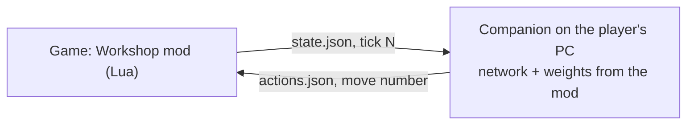

# The battle network model

[← Back](README.md) · [Documentation](../README.md) › [Training data](README.md) › Network model · [Русский](../../ru/training/network.md)

The design of the network and the project owner's decisions: what it is for, where it runs and how
we will know it is ready. The network as built: [inputs and model](model.md); how it learns:
[training](training.md).

## Goal

An interesting AI that depends on the faction and its lore. For example, orcs move
loosely and rush into the attack, while High Elves move in sync and keep neat lines.
The network is **one shared network** for all factions and both roles (attack and
defence); the faction character and the role are its inputs and set the differences.

## Where the network runs



- The network runs **outside the game**, in a companion program. The player installs
  it once besides the Workshop subscription. There will be no small fallback network in
  Lua: not worth the effort (owner's decision).
- The exchange goes through files: battle Lua can read and write them (`io.open`, see
  `src/apps/telemetry/adapter.lua`). The companion writes to a temporary file and
  renames it, so Lua never reads a half-written file.
- **Works in game:** the [bridge](../apps/bridge.md) and the companion
  `tools/nn/companion/` (for now in the training container). A decision a second, the answer
  within ~40 ms of real time at ×20, no misses ([watching the network](../launch/watch.md)).
- The weights live in the Workshop mod itself; the companion reads them from the
  subscription folder. A new network arrives as an ordinary mod update. The mod's size
  is not a limit: 1–5 GB is acceptable (owner's decision).
- **Budget:** up to ~20% of the GPU is acceptable if the AI works as intended; ~50% is
  definitely not. The real load is measured by tests.

For comparison: plain Lua 5.1 (the same interpreter as in our tests) spends ~2 ms on one
decision of a network with one attention layer at 7 vs 7 units and ~20 ms at 20 vs 20
(~33 k weights). With the companion the network can be hundreds of times larger.

## Network design

The inputs and the layers in code, with sizes and timings: [inputs and model](model.md).

```
every unit (own and enemy) → features: position, health, morale, fatigue, arrows
   + stats from the game's database (leadership, speed, charge, armour, range, reload)
      ↓ shared encoder (one set of weights for all units)
      ↓ 3–4 attention layers: each unit "looks" at the others
      ↓ memory of the last 10–20 s of battle
      ↓ + faction character (5–6 numbers) and role (attack / defence)
for every own unit: hold / move to a point / attack unit N / fall back, pace
```

- **One network.** It knows battle — melee, morale, shooting, flanks — once for all factions
  and both roles; one battle teaches it from both sides.

- **Per-unit input with shared weights** fits any army size. The network knows a new
  unit by its stats from the [game's database](../game/database.md), not by its name.
- **Attention** tells who is near, who threatens and whom it pays to hit. The target is
  picked by a pointer to an enemy unit, as in AlphaStar (DeepMind, StarCraft II).
- **Memory** is needed for style: "wait for the line, then strike together" or "break
  loose on seeing a weakness".
- Size: 5–20 M weights, 2–4 decisions a second — about 1–3% of a GPU. The rest of the
  budget can go to "thinking ahead": the network plays out a few options and picks the best.
- **Training:** PPO with a large critic that sees the whole field. The critic is used
  only in training and never ships to the game (the MAPPO scheme, Yu et al., 2021). The
  army plays against its own past versions. Training runs in the `snake-ai-trainer` container.
- A thin Lua layer only turns the network's decision into game orders. It has no
  tactics of its own.

### Rejected options

| Option | Why not |
|---|---|
| A network in Lua inside the game | Too small for a good AI; a fallback version is not worth the effort |
| A plain network with a fixed-size input | Breaks with a different number of units |
| Separate networks per faction and role | Each relearns the basics of battle; two networks for attack and defence were tried: the defence one did not carry over to new armies ([training](training.md#two-networks-attack-and-defence)) |
| LoRA adapters per "faction + role" | Built and never switched on; removed. The role and the character are inputs of the one network |
| Learning only in the game | ~30 battles an hour, hundreds of thousands are needed |
| Only copying the game's AI | No style, repeats its mistakes ([the game's AI](../game/game-ai.md)) |

## Faction character

The character works on three levels.

1. **Numbers at the network's input.** They can change without retraining. The values
   below are examples; the owner chooses the final ones by lore:

   | Trait | Orcs | Empire | High Elves |
   |---|---|---|---|
   | Keep formation (line of units) | 0.2 | 0.6 | 0.95 |
   | Synchrony (start together) | 0.1 | 0.5 | 0.9 |
   | Aggression | 0.9 | 0.5 | 0.4 |
   | Patience | 0.1 | 0.5 | 0.8 |
   | Wilfulness (random dashes) | 0.7 | 0.2 | 0.05 |

2. **A style reward in training.** Every reward is measurable. Elves: a straight line
   (deviation in metres), a simultaneous strike (all engaged within N s), even gaps.
   Orcs: an early charge, a penalty for waiting and falling back. The main reward for
   all is victory and enemy losses; style is an addition. GT Sophy (Sony, 2022) was
   trained the same way: it drove "politely" and still won.
3. **Randomness of choice.** Orcs choose "hotter" and break loose more often. Elves
   almost always take the best option.

The game itself gives part of the difference: orcs have lower leadership, so they rout
sooner. These numbers come from the game's database.

## Armies and battle rules

The network must be very flexible, so armies are random. The same generator builds the
check battles against the game's AI. The generator is ready: [random armies](armies.md)
(`tools/nn/armies/`).

- **Size:** 1 lord and 0 to 19 units. No reinforcements for now.
- **Equal budget.** Both sides get the same sum of unit prices (`multiplayer_cost` from
  the game's database, within ±5%), times the faction's `budget_factor` (1.0 for every faction:
  [random armies](armies.md#how-a-battle-is-built); the faction imbalance is handled by the fair
  metrics of [training](training.md#network-evaluation-fair-metrics)). The number and make-up of units differ. Otherwise one
  side is often stronger and a win says nothing about the network. Tiers are not needed:
  the budget evens out the price.
- **One faction per army:** units only from its recruitment list.
- **Three quarters of the armies — as the game's AI builds them.** The shares of infantry,
  missile, cavalry and monsters come from the army templates of the game's generator
  (`cdir_military_generator_*`, different per faction). Armies come out sensible and true
  to lore. A quarter of the armies are random within the pool and the budget, stacks
  included: what a human might build. The share is `mix` in `config/nn/pools.json`.
- **Small armies stay in the mix:** a share of every bank has at most 6 units a side.
- **The unit pool grows in steps** with the simulator: first 1–2 factions without magic,
  flying and artillery; each new category after a check against the game.
- **Battle limit — 60 minutes.** When it runs out the attacker loses (the game's rule: the
  defender wins on time). Dragging it out does not pay for the attacker.
- **Deployment.** `tools/nn/armies/place.py` puts a side's 1–20 units in lines: melee in
  front, missile behind, the lord at the back. The format is the arenas', so a battle
  runs both in the simulator and in the game.

## Co-op

Co-op is designed in from the start. From the game's own scripts (`data_script.pack`,
CA's co-op Survival battles):

- in a multiplayer battle the script runs **on every computer**; players do not send
  each other orders (lockstep). If one computer gets a different order, the game desyncs;
- only the battle model's time (`bm:callback`, `bm:repeat_callback`) and
  `bm:random_number()` are shared by all machines. `math.random` and `os.clock` are local;
- there is no "host sends to all" channel in battle: `CampaignUI.TriggerCampaignScriptEvent`
  exists only on the campaign map.

So **every computer must compute exactly the same order itself**.

| Source of divergence | Fix |
|---|---|
| Floating point on different hardware | The network computes in integers (int8/int16, int32 sums): such sums are equal on any CPU and GPU |
| Randomness (wilfulness) | The seed from `bm:random_number()` or the tick number |
| Different response times | The state is taken at tick N and the order is given exactly at tick N + 0.5 s of game time. If there is no answer, Lua waits: the frame hitches but nothing desyncs |
| Different weights | Weights from the mod; a co-op lobby has the same mod |
| "Thinking ahead" | A fixed number of options, no real-time limit |

Every player needs the companion. The check "companion alive, same weights version"
runs at deployment, before the battle. Multiplayer battles are currently disabled in the
code: `is_multiplayer` is in the unsupported list (`src/apps/battle/adapter.lua`).

**Not checked in the game:** `io.open` in a multiplayer battle, waiting on a tick
without a timeout drop, the mod check in a co-op lobby, which co-op battles the AI gets.
The check needs two computers or two Steam accounts.

## Path

1. **A new simulator** from the [game's database](../game/database.md) rules, checked
   against the recorded battles ([data](README.md)). Without it there is no training.
   Built: the [battle simulator](simulator.md) (step 1 — [unit passports](units.md),
   step 2 — [measurements](measurements.md)).
2. Optionally, a warm start on the recorded battles of the game's AI. It takes away
   the independence of the check against the game's AI (see "Readiness"), so by
   default we skip it.
3. PPO training in the simulator: the army against its own past versions, scripts and drills
   ([training](training.md)).
4. **One battle per game launch** (the standard way, ~30 battles an hour). A series of
   battles per load was tested and removed: the rematch replays the same armies, and a
   pool of armies in one scene changes the battle (research, Russian only:
   `docs/ru/research/launch/test-stand.md`).
5. A check in the game against the game's AI (below).

## Readiness

A proposal; the owner decides. The network is ready when all of these hold:

1. **It beats the game's AI in ≥ 97% of battles** at [Normal difficulty](../game/difficulty.md).
   The check runs at night, ~8 hours, about 200 battles (error ±2.4%); on the border a
   second night is added. Armies come from the generator with held-out seeds the network
   has not seen. A draw and the attacker's timeout are not wins. The breakdown by army
   size, faction, attack and defence is a hint where the weak spot is: with 200 battles a
   threshold per group proves nothing. The price of victory counts too: our losses.
   A quick check before the night one is the [in-game check](../launch/gate.md): 6 battles = 3 pairs
   (`tools/launcher/gate.ps1 -Battles 6`) after every training plateau, each pair judged (2–0 / 1–1 by
   pair gold / 0–2 — analyse); the same outcome rules and held-out seeds.
2. **The style shows in numbers:** elves keep a straighter line and strike more
   simultaneously than orcs, by the margin the character sets.
3. **The game's AI is an independent check.** The network learns only against itself;
   the game's AI takes no part in training. To keep it so:
   - no warm start on the recorded battles of the game's AI (step 2 of the path),
     or the check stops being independent;
   - if a network version or its settings are chosen by the result against the game's
     AI, keep a separate set of conditions (maps, armies) seen only in the final check.

   The game's AI is weak: it stands under fire and does not lead rallied units
   ([the game's AI](../game/game-ai.md)). So 90% against it is the lower bar "not bad",
   not "strong". The upper bar is checked by playing the owner.
4. **The simulator does not lie:** battle outcomes in the simulator and in the game are close.
5. **Resources ≤ 20% of the GPU.**
6. **Co-op without desync** on two computers.
