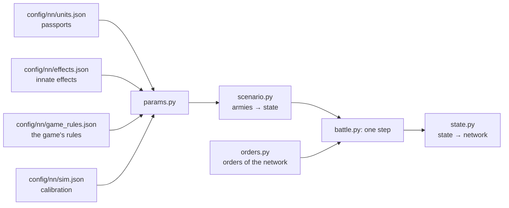

# Battle simulator

[← Back](README.md) · [Documentation](../README.md) › [Data for training](README.md) › Battle simulator · [Русский](../../ru/training/simulator.md)

Step 3 of the path ([network model](network.md)): a simulator of the game's battle in which
the network trains. It plays thousands of battles at once on the GPU. Each unit is one
object (men, health, place, facing, morale, fatigue, projectiles), not every soldier. The
numbers come from the [unit passports](units.md) and the [game's rules](../game/database.md);
where the game behaves differently, they are calibrated to the [measurements](measurements.md).
It covers the units of the training pools on a flat empty map.

## How to run it

```bash
bash tools/nn/dock.sh tools.nn.sim.check                     # all checks against the game (CPU and GPU)
bash tools/nn/dock.sh tools.nn.sim.check --device cuda --only battles
.venv/Scripts/python -m pytest -q tests/tools/test_sim_layout.py   # without torch
```

- The code is `tools/nn/sim/` (PyTorch). It needs torch, which is in the `snake-ai-trainer`
  container; the project's `.venv` has none, so `tests/tools/test_sim.py` is skipped there.
  The image has no pytest: to run the tests there, put a copy of pytest (from `.venv`) on
  `PYTHONPATH` and run `python -m pytest -q tests/tools/test_sim.py`.
- The check writes `build/nn-sim/check.json` (not in Git).

```python
from tools.nn.sim import battle, replay, scenario

st = scenario.build([scenario.from_arena("whole_emp_v_skv", "attack")] * 1024, device="cuda")
battle.run(st, replay.nearest_attack)        # policy(state) -> orders, until every battle ends
st.winner, st.t, st.observation()            # [B], [B], dict of [B, N]
```

## What the simulator holds



**The state** (`tools/nn/sim/state.py`, the one source of truth): tensors `[B, N]` — B battles,
N unit slots of both sides (side 1 in the first half, side 2 in the second, a side's lord
first; `side` = 0 is an empty slot). Three groups:

- *observed* — the same fields and names as a recording's `nn_sample`
  ([what a recording holds](README.md#what-a-recording-holds)): `x`, `z`, `b`, `men`, `hp`,
  `mp`, `ms`, `r`, `s`, `w`, `m`, `mv`, `f`, `a`, `fire`, `target` (the recording's `t`),
  `fat` (the fatigue state 0–5), `k`, `ox`, `oz`, `lf`, `rf`, `bf`, `vis`; the battle time
  is `t` `[B]`. So recorded battles and the simulator feed the network the same way;
- *static* — the passport: men, health, speeds, attack, defence, weapon, armour, shield,
  leadership, projectiles, range, reload, cost; the unit's innate effects (`fx`, a bitmask over
  `config/nn/effects.json`'s order; `fxt0`, `fxt1`: its timed ones) and their rule flags;
- *internal* — what only the simulator needs: morale and fatigue points, timers (of the abilities
  and of the timed effects), `fx_on` (the innate effects on at the step's end).

**Orders** (`tools/nn/sim/orders.py`): per unit and decision step `kind` ∈ hold (0), move (1),
attack (2), withdraw (3), keep (4: no new order, the one in force goes on; a unit with no order
holds); the point `x`, `z` for move and withdraw (the unit's centre); `target` — the enemy's
slot for attack; `run` — run or walk; `ability` — the unit's ability slot to use now (−1 none;
optional: orders made without it get −1; independent of `kind`). All `[B, N]`. A unit in melee
leaves the fight on withdraw, or on a move to a point 10 m or more away (`contact.leave_m`, any
unit) when that point lies away from every enemy it touches (more than 90° off the way to its centre,
`contact.leave_away_only`): it strikes nobody, while the enemies in contact go on striking it. A move to a point
through the enemy (CA's planner gives such points 55–60 m on) is not a leave: the unit fights on (at the move-in-contact
share). Probe P3 (`build/probes7`): spearmen walking to a point 60 m through the clanrat spearmen attacking them dealt
213 / 317 / 521 HP at 0–5 / 5–15 / 15–30 s (the simulator had them leaving: 0 / 0 / 98). A missile unit is first held in
place for 5 s (`contact.pin_s`: standing in contact, struck), then it walks out. A unit without a missile
weapon is held 2 s (`contact.pin_melee_s`, probe `fatleave`: game 1.5 / 4.6 / 9.3 m at 2 / 4 / 6 s, twin 0 / 3.4 /
9.3 m; [melee](../game/mechanics/melee.md)), a lord is not held; then it about-faces and walks out unless it is
chased. **The chase**
(`contact.chase`): a unit with an attack order on a leaver that touches it does not stand in contact but
follows it (at most at its own run speed) and strikes it; so a chased unit stays in contact until the 24 s
window (below) drops its order. While a leaving unit is in contact it takes ×1.25 the blows (no missile
weapon) and ×0.55 (missile units) — `contact.leave_taken` (measured: ×1.23 and ×0.62 of what a unit of its
class takes attacking). The melee-exit probe (`build/movelords`): without a chaser the unit about-faces in
~1.5 s and is out of contact ~4 s after the order (22 HP lost); with one the chasers run 10–15 m behind it
(centre to centre), the leaver loses ~22 HP/s and strikes nothing for 24–26 s. 46 episodes of the network's
battles (`build/open_battle/leave2.py`): a leaver moves with or without a chaser (10–14 m in 6 s); chased it is
in melee for all of the first 6 s (1.00), unchased 0.75 at 4 s and 0.58 at 6 s. The older "stands in place for
~21 s" (163 network battles) came from short episodes: the network changes its order within 1–2 s. Before,
the simulator let a leaving unit fight on at full rate, and the network
learned to use that ([measurements](measurements.md#leaving-melee)). The exit window is 24 s
(`contact.breakoff`, the DB key `melee_breakoff_secs`): a unit still in contact 24 s after it began to leave (the
`exit_s` clock runs through gaps in contact while it keeps leaving) drops its order (HOLD from the next step) and
fights again (the melee-exit probe, `build/movelords`). A unit without a missile
weapon (a formation) standing in melee under hold (no attack order) strikes at `contact.hold_rate` 0.5 of its
rate, every enemy it touches: the melee probe - holding units strike at 0.49–0.52 of the rule, the network's
units 0.80 of the kills of the same unit attacking; no rule for the rate, the number is fitted. Shooters under hold
strike at the same share (`contact.hold_missile`; the `wavemiss`, `wavemiss2` probes: unordered shooters strike their
attackers at 0.45 HP/s a man within 3.15 m reach, the same shooters under an attack order 0.80 - 0.56 of it; the twin
without the rule gave the attackers 0.27 %/s against the game's 0.08, with it 0.13-0.15; players know the weak melee of
unordered shooters as the 'weapon switching' loop). A shooter fighting under an attack order does not step back from
the enemy as a formation does: the fronts stay 2.1-2.6 m apart (unordered shooters and formations 3.0-3.3 m), the
enemy's men within reach 10-90 s after contact 22.6 against 16.4 for the same shooters unordered - the men striking it
stay at least 1.38 of the steady level (`melee.wave` `missile_attack_floor`; the probes' twin: the shooters lose 0.63-0.71
%/s 20-90 s after contact, the game 0.60-0.73, without the rule 0.46-0.58). A formation
under a move order that is still in contact and not leaving (its point within 10 m; `contact.hold_move`)
strikes the same: blocked by the enemy, its men do not step into the gaps (the probe: move lanes 0.70 of the
same unit attacking; the target lost 345 HP in 5–15 s in the simulator, now 173, game 180). The first strike of
a standing unit and a braced reflector's blows are not cut by this share (below, "Men fighting", "Charge"). A lord under
hold strikes in full (in the game a lord without an order strikes at the rule). Before, holding in melee
struck at full rate and the network held 76 % of its melee seconds. An ability order fires a ready self-cast ability once (not passive,
not active, recharged); otherwise nothing happens. The network reads the abilities' timers from
`State.observation()` (`ab{k}_on`, `ab{k}_cd` [B, N], s) and the innate effects on now (`fx_on`).

## One step (0.5 s)

1. Take the orders (routing units ignore them).
2. Contacts: the units' rectangles (front × depth of the ranks the men fill) touch.
3. Innate effects (attributes, passives, game-fired timed passives) and cast abilities: their
   stats and rule flags hold for this step.
4. Blows in melee and shots.
5. Health, men, kills.
6. Morale: wavering, rout, rally, shattering.
7. Fatigue.
8. Movement: to the order's point or the target, fleeing for routers; the edge of the map.
9. Is the battle over: a side with no standing unit loses; at 60 minutes the defender wins.

## Mechanics and their sources

"DB" — the game's rules or a passport; "measured" — [measurements](measurements.md) and
recordings; "calibrated" — a number fitted so the simulator repeats the game (all of them are in
`config/nn/sim.json` with the reason).

| Mechanic | How | Source |
|---|---|---|
| Speed | walk, run, acceleration, deceleration of the passport; routing units run at 0.985 of the run with fatigue (before innate effects: a Skaven rout ×1.1 by Scurry Away!) | DB; the routing speed measured: routing / run divided by the database's fatigue multiplier — the Empire 0.989–1.000 in all 6 fatigue states, the Skaven 0.977 ([innate effects](#innate-effects)) |
| Formation | front of the ordered width: ranks = floor(width / h), front = ranks × h, depth = ceil(men / ranks) × v; h, v — the unit's formation-template step from the DB (`unit_spacings`: the Empire and lords 1.48 × 1.6 m, clanrats, Flagellants, militia 1.6 × 1.7, slaves 1.6 × 1.8, Greatswords 1.7 × 1.75, Stormvermin 1.8 × 1.9, archers 2.0 × 2.1, slingers and Night Runners 2.2 × 2.8); `formation.spacing_m` — only for a unit without a template; a lord is a circle of his radius | DB; checked against the roster (6 units, 15–80 m): the game's front (ranks − 1) × h to 1.3 % (median), depth (ranks − 1) × v to 14 % (`build/meleecore/spacing_check.py`) |
| Contact | own standing formations may stand in each other, nobody pushes them apart (`contact.friend_push` false; the recordings: own centres within 2 m in 0.2–0.3 % of pair-seconds, two still out of melee within 4 m keep their distance over 5 s - median 0.00 m); formations touch when they overlap by 2.5 m (`contact.reach_m` −2.5); a lord — at the formation's edge, within 1 m (`contact.lord_reach_m`); 2 m more for those already fighting; a unit leaves melee on withdraw or a move 10 m or more away (it strikes nobody, the enemies in contact strike it ×1.25, missile units ×0.55); a missile unit is held in place 5 s before it leaves, a unit without a missile weapon and a lord are not held; a unit with an attack order on the leaver follows it (at most at its own run speed) and strikes it (the chase, `contact.chase`); one still in contact 24 s after it began to leave drops its order and fights again (`contact.breakoff`, the DB key `melee_breakoff_secs`); the melee clock (`contact_s`) keeps running through gaps in contact shorter than 10 s (`contact.reset_s`) | measured: in the first second of contact the game's formations overlap by 2.5–4.8 m (centre distance in the pairs against half the sum of depths from the DB step: −2.1 / −2.9); leaving and the chase — the melee-exit probe and 46 episodes of the network's battles (above, "Orders"); missile units' 5 s — measured (254 episodes; whether the chase holds them — open); 10 s — gaps of 4–7 s in the game do not start the fight over (`build/cyclecharge`); 24 s — the melee-exit probe (`build/movelords`): chased swordsmen and spearmen strike nothing for 24–26 s, then fight on |
| Facing | a unit heading for a point off its facing turns to it at its men's turn rate from the DB (`battle_entities` turn_rate: infantry and the General 120°/s, archers and the Warlord 180, militia 240) and runs only the way it faces: its speed towards the point × cos of the angle between its facing and its way, none beyond 90° (`turn.move_turn`); a formation about-faces where it stands (the front rank becomes the back); a step of less than 10 m to its point a formation makes without turning; a formation in melee turns at most 2° a second (a lord turns at once); out of melee a standing formation turns in place at most `turn.formation_deg_s` 80°/s, a lord at his own turn rate from the DB | measured: infantry in melee turns 1°/s (median; mean 2.3), a free unit struck in the flank turns 8° in 5 s (median); standing missile units out of melee whose engine target appears 60° or more off their facing face it (within 20°) after 1 s (median; mean 1.6 s at 60–120°, 1.7 s at 120–180°; ≥ 64°/s with 1 s samples), standing turns of lords 40°/s (median of 440, 1 s samples; the old fit `single_deg_s`); the turning probe (`build/movelords`, 0.25 s, soldier places): spearmen sent at a run 150 m behind them about-face where they stand (each man's place along the front: correlation −0.98) and reach the run 2 s after the order; on a move order the General turns ~120°/s, the Warlord ~200°/s, both move off after 1.2 s |
| Order point | the game records the front's centre; the simulator goes to the unit's centre, half a depth behind | measured (spearmen 3.3–4.8 m, slaves 6.5–6.9 m) |
| Men fighting | 0.5 of the files in contact (a file is the contact length / the unit's step: h across the front and rear, v across the flank), more at the start of a fight - the opening wave: × (1 + 1.48·e^(−t/10.25 s)), t the pair's time in melee (the younger of the two clocks), formations only (`melee.wave`; the `wave`, `reform`, `defender` probes: the damage is proportional to the enemy's men within the database's reach - the formed combat distance 2.5 m + the model's radius 0.65 m = 3.15 m centre to centre, slope 1.06 / 0.81; there are 2.5x as many of them at contact as 20 s on - the fronts meet at 1.1-1.4 m and part to 3.0 m over ~20 s whatever the start and the approach; the curve is taken from the soldiers' places, not from the damage; the probes' twin matches the game in the 0-5 / 5-15 / 15-30 s windows); through the target's flank or rear the striker brings men by its own front, not by the target's short side (`melee.flank_face` "striker"; the `defender` probe: swordsmen turning in melee to leave or to attack another unit lose ~1.3x what attacking swordsmen do in the game, the clanrats within 2.5 m of them 47-71 against 12-39; the twin with the old rule gave them 0.5x - the striking clanrats fell from 9 men to 3 - with this 1.3x); a unit shares out to each side of its formation (front, left, right, back) no more than that side holds; and the units striking a target through one of its sides share that side's length (each takes its striking men × its own step / 0.5 m, together no more than the side or the longest single attacker; `melee.target_face_cap`; the recordings: two standing in each other strike the target 26.5 HP/s - as one, 26.9; two apart 32.5; three 29.0 / 39.4); at most 6.5 men strike a lord in all, however many units, their rates summed; they gather around him over 20 s from contact (`contact.lord_gather_s`) only when the lord himself ran into their formation, infantry running onto a standing lord strikes in full at once; with the enemy lord on him the infantry at 0.35; a unit attacking another enemy strikes a lord it touches at 0.4; a melee formation under hold, or under a move while in contact and not leaving, at 0.5 (a lord in full); **the first strike**: a unit coming into a fight moving or charging strikes once at once with every man in contact, then at the usual rate; so does a unit standing under hold that an enemy reaches, with its men in contact facing the enemy (within `contact.front_deg` 45° of its front; `contact.stand_first_strike`); the first strike is not cut by the 0.5 share (`contact.first_strike_full`: every man in reach swings); a router is struck by every man in contact at 0.43 of the rule, from the rear, without the charge; one that routed from melee stays in contact 7 s and is struck at 0.83 (`contact.rout_pin_s`, [below](#a-routers-exit-from-the-fight)) | fitted on the pairs (0.5, 6.5, 20 s); hold — the melee probe (0.49–0.52) and the kills of the network's units in the gate battles (above, "Orders"); a move in contact — the probe (0.70 of attacking, men within 2.5 m 0.73); the first strike — the game's rule (the interval runs only after a blow, CA Feature Focus #2; the probe: a burst in the first 0.5–1 s; the charger loses in the first second 106–194 HP to braced spearmen, 120 to swordsmen, 0 to a target facing away; the struck side's first-second error 1.05 → 0.41); the gather only when the lord ran in — the lord swarm probe (the first 15 s 1.11 × steady); per side — measured: a unit already fighting hits a newcomer on its flank 2.2× the rule in the first 15 s (with one shared front the simulator gave 1.2×); the sum — measured ([a lord surrounded](../game/units/lord-swarm.md)); 0.35, 0.4 — whole battles (below, "Lords fought by several units"); a router — measured (below, "Pursuit", "A router's exit from the fight") |
| Hit chance | 35 + attack + charge bonus × remaining charge + bonus vs type − defence × side, within 8–90 % (weight 1); defence ×0.6 from the flank, ×0.3 from the rear (against a lord: none, measured); the flank is the enemy's centre beyond 45° of the front, the rear beyond 135° (`contact.front_deg`, `rear_deg`); hits a second for a man in formation p / (p × interval + 0.5): the interval starts after a hit, a miss costs 0.5 s (`melee.miss_s`); lord against lord — p / interval | DB and CA (Feature Focus #2); the sectors — CA (forum 10108: the struck man's quarter, front ±45°, rear beyond 135°); the recordings (135k seconds, one standing formation against one): the damage rises smoothly from ~45° to ~85° (0–45° 0.93–0.97 of the pair's mean, 45–60° 1.07, 60–75° 1.23, 75–120° 1.34–1.39, 120–180° 1.27–1.30), no step at 60°; CA's rule is per man, ours a unit-level step — OPEN; 0.5 s — fitted on 121 recorded formation-vs-formation battles (`build/hitchance`); lord against lord — duels ([lords](#lords)) |
| Damage of a hit | AP in full + base × (1 − the mean armour roll: 0.75 × armour/100 up to 100, above — 2 − 100/A − A/400), then resistance (≤ 90 %); damage beyond a man's health is lost — smoothed: a unit loses hp / E[blows per man] per blow, the first blow exact, the rest a mean (`melee.per_hit`); a single entity (a lord) gets no overkill; the same for projectiles | DB, CA (the 50–100 % roll, overkill); smoothing — 121 battles (`build/damage/spec.md` D3) |
| Time between blows | `attack_interval_s` of the passport, after a hit (above) | DB |
| A lord's blow | divided by `splash` (4), hits an average of 2.07 men (`contact.lord_splash_struck`), each gets ¼, then armour and overkill; a single entity takes the whole blow | DB, CA 5.1.0 (divided); 2.07 — measured, 506 blows of the "lord surrounded" probe |
| Charge | an attack order and a run-up ≥ 10 m at ≥ 0.75 of run (`charge.min_runup_m`, `min_speed_share`; an attack order in the first 2 s of contact too, if there was a run-up) give the full charge bonus: + to attack (weight 1) and to damage at the AP share, fading to 0 over 13 s on its own clock from the first blow (leaving contact does not stop it); nothing more. The run-up counts only the speed towards the attack target (without one, towards the nearest enemy), not running away (`charge.runup_towards`). A unit with `charge_reflection` that is braced (under 0.5 m/s) deals the charger ×2 damage within 80° of its front while its charge is ≥ 0.7 (3.9 s); these blows are not cut by the hold share 0.5 (`contact.hold_reflect_full`). **The charge sprint**: under any attack order (at a run or a walk) a unit covers the last 30 m to its target (lords 35; the passport's `charge_distance`) at its charge speed - a charge; no sprint and no charge when the attack target is already in melee with another of our units — it comes in at a run (`charge.free_target_only`) | DB and CA (13 s, 80°, ×2, 0.7; charge distance and speed - `battle_entities`); the run-up and run share are ours (the game: "a run-up to play the animation"; lords give none after < 20 m or a burst at a walk; a Warlord that ran ~10 m off came back at 1.5 m/s and struck an ordinary blow); the reflection in full — the probe (braced spearmen 52 HP/s in 1–5 s after a charge = the rule ×2, held swordsmen 12 HP/s); the sprint - the melee probe (a run of 3.0 → the last 30 m at 3.65–3.88 m/s, an attack at a walk too); a target already fighting — CA (WH2: no charge when the path is blocked by one's own unit); the recordings of 221 battles: 2 s before contact 1.09–1.12 of the run into a free target of its own order, 0.79–0.86 into one already fighting; whether entering another unit's fight gives the charge bonus — open (probe) |
| Men lost | melee — **the wounded pool** (`kills.wound_pool`): the wounded among the living W = men × a man's health − the unit's health stay at most W* = its own men in contact × (a man's health − the health-weighted blow of its strikers) (a unit not striking back: the enemy men striking it); health lost beyond the pool is whole men; missiles — **even hits** (`kills.missile_uniform`): a man's hits are Poisson, the living share Q(K, tau), K = a man's health / HP a hit, tau from the unit's wounded (`melee.shot_kills`); a lord is one pool of health | CA: every model has its own health, damage beyond it is lost; the pool — the melee probe's health series (flagellants → clanrats: 4–7 men's worth wounded while 87 die; slaves 10–20): men killed at 15–30 s 1.00 → 1.10 of the game, at 60–90 s 0.82 → 1.15 (error 0.30 → 0.23); missiles — probe P1 (`build/open2/poisson_test.py`): with the game's own hits the rule gives its men (180 slaves at 41 / 80 / 120 s: 146 / 70 / 16 against 133 / 68 / 22); the probe twin after 720 arrows 42–44 men against 47–49 (was 86) |
| Shooting | from standing only; first shot 3.3 s (arrows) / 4.3 s (sling) after a halt; a new order (another kind or another attack target) makes it aim again (`missile.aim_reset_on_order`); **range centre to centre** (`missile.range_centre`; a shooter under an attack order walks until the target's centre is in range); direct fire (pistols) **by ranks** (`missile.per_man_range_direct`, `missile.rank_share`): the whole unit fires while the target's centre is within range of its front rank, beyond that only the ranks within range of the target's nearest men, and for units that fire on the move (militia, stars) at least half the men while the target's centre is within range + 25 m (`missile.fire_move_reach_m`, [probe](../game/units/missile-probe.md)); **each man's fire arc**: a man fires if part of the target is within his ±30° (militia ±35°; `battle_entities`, `missile.arc_share`), so a wide line shooting at a target off to one side fires with its near wing; firing at will a unit keeps its facing, to the target of an attack order beyond 45° (`missile.stand_fire_arc_deg`) it turns (Turning) until the target is within 10° (`missile.turn_done_deg`); it keeps its target while that is in range and stands (`missile.sticky_target`), else takes the nearest within 45°, then the nearest; a new target costs 3 s without fire (`missile.retarget_s`), and so does a target taken when there was none (`missile.retarget_from_none`); the men reload all the time (on the move too) and the unit fires once all are loaded (`missile.volley_load` 1): volleys every 10.0 s archers (= the database), 11.5 s sling (database 9), Night Runners 10.2, militia 10.8 (when the unit fires, all its men start reloading, those whose line is blocked or out of the arc too; the `fire` flag stays on between volleys); **the `fire` flag** (the network's input, as the game's `IsFiringMissiles`) is on while a standing unit aims at the target it took too (`missile.fire_flag_aiming`; the target is shown with it), the shot itself still waits aim_s — in the game's recordings the flag came on ~1.5 s after a halt, 4.5 s before the first shot, and a new order hardly put it out; **re-aim** (`missile.reaim`): a man keeps his target man, and if that man has died since his last shot he aims again (aim_s) — the unit's volley waits aim_s × the share of its men whose target died (state field `late`), so the interval is the reload + aim_s × that share; on a lone man (a lord) the reload alone | [missile probe](../game/units/missile-probe.md): re-aim — against a lord the volley stays whole all fight (0.8 of the men at once, the rest within 1.5 s), against a formation it turns into a stream from the first deaths; shots model / game at the end of the lanes without it: arrows 1.18–1.39, slings 1.05–1.13, Night Runners 1.03–1.16, with it 1.10–1.26 / 0.99–1.02 / 0.96–1.05 (arrows still ~10 % high — open); the first projectile at a target that ran into range — 1.5–2.5 s later; volley intervals 10.0 / 11.5 / 10.5 / 11.0 s, the first arrow at 129-131 m between centres for any target depth; militia (range 90, 7 ranks) on skavenslaves — full volleys at 85–90 m and 0.94–0.99 at 94.5 m (the front rank 89.4 m from the target centre), at 97.6 m a steady stream at 0.54 of the full rate for 200 s (the rank rule: 4 of 7 = 0.57; centre to centre: not a shot), the share of the men in a volley at a target 35° off 0.42 (narrow) and 0.93 (wide), 50° off 0.06, no turn; recordings: 3 s without fire after a target change, 99 % of volleys within 45° of the target; in battle a halt gives 0.55–0.76 projectiles a man in 12 s |
| Hits | the database's spread model with no fitted number (`missile.hit_chance`, `missile.accuracy.plane`): a projectile aims at the middle of a random man of the target and lands at a Gaussian offset in the plane across the line of fire at the target: σ² = calibration area × (d / calibration distance)² × (1 − (accuracy + marksmanship) / 100); on the ground the spread along the line is σ / sin(the angle it comes down at), the aim point lies h / (2 tan of the angle) beyond the man's feet; a man is hit within his radius or in his shadow h / tan of the angle; the men of a formation are not in exact files: a projectile passing over n ranks at head height meets a man with 1 − (1 − 2r / the front step)^n; a formation by its own files and ranks with the database's spacing (a loose or thinned one catches less); `accuracy.units` "rates" gives formations back the old 0.42 / 0.47 / 0.5 × the distance factor | the calibration area is an area in m² (modders: "valuated in square meters"; Empire: "area of calibration target in square metres"; accuracy "cuts the area by that percent"); the area read as σ × σ is ours (the 1 σ circle gives an error of 0.273); the law σ ~ d fits best; the probe, 27 standing lanes of full-strength targets, error (mean absolute log of model / game): 0.096 (arrows 0.101, pistols 0.104, slings 0.050, Night Runners 0.121) against 0.171 for the old ground model with the fitted k 1.1; archers at 50 m 0.88 (game 0.90); open — a thinned target (probe P1), a target running at the shooter ×1.2 (P3) |
| Shield, resistance | a shield blocks its share of small-arms projectiles (arrow, musket, sling, javelin, axe) within 60° of the front, in melee too; against a projectile missile and physical resistance together, at most 90 % (`missile.physical_resist`; the ward save `damage_mod_all` is in the physical) | DB; the rule — CA (Feature Focus "Damage"); the probe: a 35 % shield facing lets through 0.66, flank and back on it does nothing |
| A lord as a target | out of melee the spread model for a lone man (a circle of his radius and his shadow); in melee his share of the hits is lost (`missile.single_entity_in_melee` 0), the friendly-fire share goes to the shooter's units in contact with him, the misses by the spread geometry, as for a unit | the probe: the Warlord by arrows 0.13 a shot (model 0.13), the General by slings 0.09 (0.08); in melee: the gates' replay ([lords](#lords)) |
| Friendly fire | of the hits aimed at a unit in melee, 0.26 (arrows) / 0.56 (sling) land on the shooter's own units in contact with it, split by their men (a lord among them ×0.43, as a lone target) | measured: the HP those units lose beyond the melee rule while their own side shoots (1.5k + 1.3k seconds) |
| Spill | from the same spread as the hits (`missile.spill_geometry`): a shot aimed at a random man of the target lands at a Gaussian offset across (σ) and along the line (σ / sin of the angle it comes down at) and flies below head height over its last height / tan(angle) m; it hits the first man on its way - the target's or any other formation's of its side (ranks in that band: 1 − (1 − 2r / step)^ranks); the formation whose men in the band come first towards the shooter takes the shot first, interleaved men share it - so a target in a pile keeps less and its neighbours take their share | no fit: the database's spread; a Monte Carlo of real men (`build/routgap/spill_mc.py`) and the formula (`spill_analytic2.py`): a neighbour at 4 / 11 / 18 / 26 / 37 m takes 0.76–0.90 / 0.44–0.69 / 0.23–0.52 / 0.09–0.32 / 0.01–0.14 of the target's; the game (`spill_game.py`, all fair recordings, out of melee): 0.85 / 0.54 / 0.28 / 0.15 / 0.069 at 0–8 / 8–15 / 15–22 / 22–30 / 30–45 m; the twin of the 8 it5 battles with the rule 0.86 / 0.67 / 0.36 / 0.16 / 0.13; the old tables (0.115 within 30 m ..., `missile.spill`) gave 0.24 / 0.30 / 0.18 / 0.09 / 0.064 |
| Spill in melee (without `spill_geometry`) | of the hits aimed at a unit in melee, each unit of the target's side also in melee takes 0.19 within 15 m, 0.047 at 15–30 m, 0.035 at 30–60 m (centres) | measured (`build/nn-sim/flank/spill_melee.py`): HP of units in melee, not shot at themselves and whose side does not shoot their opponents, regressed on the melee rule and on the hits aimed at their neighbours in melee (74k seconds, 15k with a shot neighbour; 28 game-AI battles 0.23 / 0.09, net runs 0.19 / 0.05) |
| Target at will | the order's target if in range; else the last one while it is in range and stands; else the nearest standing enemy | as the game ([missile damage](../game/units/missile-damage.md)) |
| Line of fire (direct fire) | only for direct (flat) fire, the passport's `missile.direct` (trajectory `low`: the Free Company Militia's pistols); the shooter's men aim at the target's centre, a friendly unit between (nearer than the target's edge) blocks the lines passing through its width across the line; blocked men do not shoot; when the whole unit is blocked it takes the next target in range, or holds fire. Arrows and slings arc over friends; enemies in the way do not block; no fire over friends from higher ground (flat map) | DB with the True Sight mod every battle runs with: `projectile_friendly_fire_man_radius_coefficient` 1.0 (2.2 without it), `unit_firing_line_of_sight_considered_obstructed_ratio` 1.0 (0.75 without it); `config/nn/game_rules.json` `_mods`; the knowledge base ([missiles](../game/mechanics/missiles.md)); the geometry is ours, not measured |
| Fire whilst moving | a unit with `mounted_fire_move` (the militia) aims and shoots while it moves, at targets within `missile.move_fire_arc_deg` 90° of the way it walks | DB attribute; the arc measured (our militia on the move: 0.52 of its full rate toward the enemy, 0.31 across, 0.16 away) |
| Pistols | hits: the same spread model; reload 10.8 s, first shot 3.8 s | the probe: volley intervals 10.5–11.5 s; hits 0.87 / 0.63 / 0.53 / 0.47 at 41 / 60 / 82 / 98 m, the model 0.71 / 0.58 / 0.49 / 0.45 (the flat shot loses its height error over the heads); they fired at 97.5 m with range 90 too, and as a stream from the first volley — a per-man range is open (probe P2) |
| Morale | points: leadership + effects; MoralePercent = points / leadership; moves 1 point or 15 % of the gap per 0.5 s | DB; the step measured (+2 points a second in every recording) |
| Morale effects | lord +4 within 70 m, fading to 0 at 105 m (to his units, not himself: `morale.lord_own_aura`); lord killed (health 0): the others −16 for 45 s, then −10 to the end; routed off the map: −16 for 120 s; shattered or routing on the field: his aura only (`lord_fall`); flanks secure +5: no standing enemy within 146 m (centre to centre) or friendly units (not lords) within 40 m at both sides, and no flank threatened (`morale.secure`); casualties −2…−74; recent casualties −6…−80 (lost in the last 4 s, of the whole health); extended casualties −4…−60 (the last 60 s); winning / losing the fight +3/+6/+8, −3/−8 by the damage ratio in melee and by missiles (winning from 1.5 / 2.5 / 4; losing −3 once it takes more than it deals, −8 once it takes 2.5 times as much: `combat_ratio` `losing` / `losing_significantly`, Goumin's WH3 kv_rules guide 'losing if the enemy takes less damage', the morale probe - an HP balance of 0.32 showed −8 in the game) while the unit is in melee, shooting or shot at by an enemy; losing only once the unit has lost 10 % of its health, winning only once the enemy it fights has (`morale.combat_lost`); a single entity in melee always −3 (`morale.single_combat`); attacked in the flank −6, in the rear −14 while struck from that side; the charge +15 in 6 s blocks from the charge pose (an attack order, the target within `charge_pose` — 25 m, lords 30 m, the database), a second block right after the first if the unit still runs at its target or its charge has landed (`morale.charge`); the army beaten as a whole (enemy strength ≥ 2.6× own, own ≤ 0.22 of the start) −120; flanks exposed (an enemy threatens the left, right or rear: `lf`, `rf`, `bf`) −3, two or more −6; routing friends −3 each (a routing expendable unit scares only expendable units); routing enemies +2.5 each; under fire −5 (15 s more after the last hit); very tired −2, exhausted −6; an enemy worth 3 times as much or more (cost × health) within 70 m −3 (`morale.strong_ratio`); a router has no flanks secure, fight balance, flank / rear, flanks exposed or charge | DB points; the 4 and 60 s windows — DB, the 15 s under fire — probes ([below](#casualty-windows-and-under-fire)); when the flank / rear, flanks secure, the charge, winning by shooting and the 10 % threshold hold — the in-game morale probe ([below](#morale-by-the-games-rules-the-morale-probe)); the winning thresholds calibrated, the losing ones Goumin's guide and the morale probe; a lord's fall measured ([lords](#lords)) |
| States | wavering below 16 points, rout at 0; shattered (`morale.shatter_rules`): at the third rout; when its points reach the floor −50 (`ums_broken_threshold_lower`) — army destruction or not; a router on its 1st rout when its health is below 0.05 of the start, on its 2nd below 0.10; an unbreakable unit never; no ordinary rout within 10 s of a rally | DB (`shatter_after_first_rout_if_casulties_higher_than` 0.05, `…_second_…` 0.1, `use_hitpoints_instead_of_casualties` 1 — by health), Goumin's WH3 kv_rules guide; the recordings of 221 battles (1st and 2nd routs of infantry and missile units, army-destruction waves excluded): all 92 + 61 shatters on the run met one of the conditions (the floor 0.75 / 0.54, the health 0.46 / 0.84), the rallied 0.000–0.003 of 3205; the game never goes below −50 (shattered units sit at −48…−50); the gates' replay (5 gates, 28 battles × 4): shattered before the last 15 s 3.5 → 5.1 a battle (game 5.2) |
| Rally | a router's morale follows its target like any other's; it rallies once its morale is above 0, it has routed at least 18 s (`morale.rally_after_s`), no living enemy — routing ones too — is within 95 m (`morale.rally_free_m`, `rally_any_enemy`, centre to centre), the army is not collapsing; at once, no wait (`morale.rally_wait_s` 0). **Now** instead of the 95 m gate - a chance to rally a second by the nearest standing enemy's distance (`morale.rally_hazard`: 0 / 4.3 / 9.5 / 8.5 / 1.3 % within 95 / 95-110 / 110-125 / 125-150 / beyond 150 m; a routing enemy within 95 m still blocks) | the in-game morale probe: rallies when the enemy is beyond 94–96 m, and not before 18.5 s into the rout ([below](#morale-by-the-games-rules-the-morale-probe)); probe rally2 (`build/probes7`, 5 lanes): the enemy 118–130 m away — the rally exactly 18.5 s into the rout (the conditions held from 15 s), the enemy following at 82–95 m — at 21.0 s, as soon as it was 92–96 m away; the recordings (`build/open_battle/rally.py`): next to a routing enemy within 95 m 0.9 % of 4285 such seconds rallied within 1 s, with none 12.6 % of 17,319; from the first second the conditions hold to the rally, median 7 s (p25 4, p75 12) — the probe has no such wait; what holds rallies back in whole battles — OPEN |
| Fatigue | The calibration is ON (`fatigue.calibration.on=true`): 10 ticks/s, DB thresholds; melee tires only under an attack order (single entity the DB's +19 a tick, the charge +34 only in the first 2 s of a contact; formation 13.7); Foe-Seeker, while active, takes 1 % of the maximum a second (−300 points/s, the DB's `fatigue_change_ratio` −0.01), a move by its order's run flag (run +4, walk −1), routing +4, shooting 7.5, idle −18 with no standing enemy within 80 m, else ready −7 | A formation's rate fitted on the units' activities in 204 recordings; exhausted shares as in the game ([below](#fatigue-calibration)); a single entity and Foe-Seeker — the DB, checked by the probe ([lords](#lords)) |
| Lord abilities | the side the game's AI plays (`ai`, side 2 by default) fires its lord's active abilities by a rule; the network's side fires them by order (`Orders.ability`; a side the network plays should have `ai` false); passives are innate effects (below). Every number is the ability's passport (`config/nn/abilities.json`, the database; `sim.json` abilities says which are modelled and the AI's triggers); effects on the owner (phase targets self), his side's units within range (friends) and enemies within range (enemies): speed, charge speed, melee attack and defence, damage, AP, charge bonus, morale. Warlord: Deadly Onslaught (31 s, ready 90 s after: melee damage and AP ×1.25, charge bonus ×1.6) — never by the AI; Verminous Valour (17 s / 60 s: speed ×1.25, +8 morale points; its 25 m blast has no damage but throws the men around the Warlord back - the simulator has none, OPEN: probe T-E3, 2 s after the cast nobody within 6 m, in contact again after ~8 s) in melee; Rally (14 s / 60 s: +16 to friends within 35 m; an aura that follows the lord: each step on the friends within 35 m, one coming in gets it, one leaving loses it) in melee with at least two friendly units within 35 m. General: Stand Your Ground (18 s / 90 s: melee defence +24, +16 within 35 m; laid once at the cast on the friends within 35 m, who keep it 18 s wherever they go, later arrivals get nothing - the database field `update_targets` 0, Rally and Hold the Line 1; the recordings: of those that got it and went beyond 40 m 494 s on of 498, of later arrivals 0 of 768) in melee with a friendly unit within 35 m (`abilities.friends_min`; never in a lone duel); Foe Seeker (25 s / 60 s: speed and charge speed ×1.25) in melee. Each again as soon as it is ready, while its rule holds. Only a standing lord fires; an active one goes on when he routs (the recordings: Rally and Stand Your Ground from a routing lord on every second, as Hold the Line). At the start an ability is on cooldown for its passport's `initial_s` (the database's `initial_recharge`: 0 for the lords' actives, 3 s Strength of the Penitent) | DB (`config/nn/sim.json` abilities; owned per the game's roster readout); when the AI fires them: measured, 139 gate battles (926 uses by the AI's lords) and the lord duels ([below](#lords)) |
| Innate effects | every attribute and passive or game-fired ability of a unit (`config/nn/effects.json`), one mechanism: on while its conditions hold, its stats on the owner (an aura also on friends in range), its rules for the step. Unbreakable (Flagellants: morale never below leadership, never wavers or routs), Expendable (its rout scares only expendable units), Encourage (the lord's aura), Charge Reflection (bracing), Fire Whilst Moving; Strength in Numbers (Skaven infantry: +6 leadership, +8 melee defence, speed ×0.9 while health ≥ 50 %), Scurry Away! (speed ×1.1 while wavering or routing), Hold the Line! (+5 melee defence, +4 leadership to friends within 35 m of a living General - routing too, and on routing friends: the recordings 1312 of 1312 s and 2017 of 2017 s), Frenzy (+10 melee attack, ×1.1 damage, AP and charge while morale ≥ half of leadership), Strength of the Penitent (fired by the game itself whenever ready, in melee: 20 s of +14 melee defence, +15 % physical resistance, ends out of melee; its 3 s recharge stands only while the unit wins its melee - the database's recharge context `losing_melee_combat` as the game acts on it: not winning, out of melee too; the initial 3 s always; the recordings: on 70 % of the melee seconds, gaps of exactly 3 s in 92 %; the recordings replayed in the simulator 0.64 - 0.13 before). Wounds (Single Entity, lords): 5 s (the DB's initial cooldown) after health first falls below 25 %, speed ×0.9, damage and AP ×0.8 to the end of the battle. Schema only (the network sees them): Charge Defence vs. Large, Vanguard Deployment, Hide (forest), Immune to Psychology | DB: the passports, `special_ability_to_auto_deactivate_flags`, `special_ability_to_recharge_contexts`; the attributes' rules: the knowledge base; measured: rout and running speeds, the morale drop at 50 % health ([below](#innate-effects)); Wounds — the recordings: the effect appears 5–6 s after 25 % in 170 of 170 lords and stays to the end, the card: damage ×0.80, speed ×0.90 |
| Map | a square ±1020 m; a routing unit that crosses the edge leaves the battle | measured |
| Visibility | everything is visible (`vis`, kept for later) | a flat empty map |

**Why the hit chance is almost flat.** By the database rule the four pairs would need 13 to 43
men striking at once, and a lord ~38 ([measurements](measurements.md)). With a flat ~35 % the
same losses need 12–17 men on a 30 m front in every pair and ~8 around a lord: one number fits
all. So attack − defence counts at 0.1 of the rule. The flank and rear, which the pairs do not
test, are fitted to the whole battles (below).

## Fatigue calibration

Fatigue follows the calibration `fatigue.calibration` (ON, `on=true`): the shares of exhausted units are as in the game. The legacy model (5 ticks/s, DB points, melee +19 for every engaged unit, ready −7 as rest, dead and departed slots still counted) is kept only for `on=false`. DB thresholds and effects apply in both. Threat geometry is ON (`threat.calibration.on=true`).

The rule (10 ticks/s, each unit in one activity):
- melee costs points only under an attack order: a single entity (`men0` ≤ 1) the DB's +19 a tick ([lords](#lords)), a formation 13.7 (measured; fatigue is not counted per man: formations with 1–2 % or 20 % of their men in contact tire alike — `build/movelords/fat`; the game's formation gains ~110–120 points/s for the first ~50 s, then ~210/s — why is open);
- an ability with vigour (Foe-Seeker: `special_ability_phases` fatigue_change_ratio −0.01) takes that share of the maximum (30,000) a second while active, on top of the activity; in melee without an attack order the unit walks if moving, else rests −18;
- charging +34 only with an attack order and only in the first 2 s after the first charge blow, for everyone (`charge_s`; after a running contact the game's units leave "fresh" after 17 s median over 456 contacts; +34 for all 13 s of the charge gave ~8 s);
- a move costs by its order's run flag whatever the speed: run +4, walk −1 (DB); a routing unit +4;
- shooting 7.5; a unit standing without unfinished movement, attack or aiming rests −18 when no standing enemy is within 80 m, otherwise ready −7; dead and departed slots are frozen.

Where the numbers come from. Each unit's activity in each second of the 204 fair recordings is put into a class, and the class points are fitted so that accumulating them over the same activities gives the game's recorded states (`build/fat/opus/classes.py`). A formation in melee with a target: 13.86 a tick, shooting 7.15; 25-resample bootstrap 13.6–14.5 / 6.5–7.6. A lord in melee fitted the DB +19 while his charge cost +34 for all 13 s (now 15 and a 2 s charge: the time to the first tiredness and the lords' exhausted shares are closer to the game, [lords](#lords)); units in melee without a target recover; routing 5.1 a tick (running +4). Walking: clean walk spans of the game AI's units under a walk order (2925 s) cross 0 states up and 6 down — walking recovers at the DB −1; the earlier fitted +3.4 came from moves under a run order at low speed (`build/fat/opus/gate_check/walk_noflag.py`). Rest near an enemy: standing network units in the game recover at 0.48 / 0.62 / 0.79 / 1.00 of idle −18 with the nearest standing enemy at 40 / 40–80 / 80–150 / 150–300 m, the simulator without this rule at 0.9–1.1 (`build/agent_fatv3/near2.py`); the 80 m boundary comes from this measurement, the DB has none.

Simulator replay: both recorded order streams, one copy, no jitter, game-end cutoff (`build/agent_fatv3`).

| Exhausted share, % | Game | Calibration (current) | Legacy ×5 |
|---|---:|---:|---:|
| own, all 204 recordings | 17.34 | 17.06 | 5.66 |
| enemy, all 204 recordings | 28.61 | 29.05 | 9.17 |
| own, ≥240 s | 30.29 | 29.07 | 10.05 |

Late in a battle (gate 20261005-161910: network `s6_fatigue/m20` against `ai_like` from the gate's four starts, 4 copies; own alive units) fewer units are exhausted than in the game and some rest back to Fresh. Shares, % (exhausted / fresh):

| Time | Game | Calibration | Walk +3.4, no routing / near-enemy rule |
|---|---:|---:|---:|
| 0–120 s | 0.0 / 60.5 | 0.0 / 55.0 | 0.0 / 55.0 |
| 120–240 s | 2.0 / 1.6 | 5.6 / 0.5 | 6.5 / 0.1 |
| 240–360 s | 51.8 / 0.1 | 37.0 / 3.6 | 43.8 / 1.9 |
| 360+ s | 79.8 / 0.0 | 59.8 / 7.4 | 56.8 / 11.3 |

Standing units rest in the simulator at the game's pace (state drops per 100 s from states 2–5: 2.0–2.6 against the game's 1.9–2.8), but late in a battle our simulated units stand longer: 23 % of the seconds after 180 s against 13 % in the network's game recordings (still spans of 120 s or more start at state 3.4 on average in the simulator, 1.2 in the game). That is a difference of battle trajectories (who waits and how long), not of the fatigue rule. Replaying the recorded orders of the same four battles gives 24.1 / 25.8 % exhausted at 240–360 / 360+ s against the game's 51.8 / 79.8 % (before this rule 23.4 / 22.5 %).

The spearmen of `pair_warlord_v_spear` exhaust at 231/232/232 s (game 226/229/230 s; the legacy model never exhausted them).

The check against the game now (frozen set of recordings, higher is better): mechanics 51/54, game-AI winners 23/26, network battles 96/132 (with walk +3.4 by speed: 51/54, 22/26, 96/132); the legacy model had 51/54, 20/26, 100/132. In the network battles 6 outcomes are lost and 2 gained; most changed battles have a copy majority of 0.5–0.75. Trade at game end is a little further from the game on all four gates (table below). That is the calibration's cost; in return fatigue now builds up as in the game (the legacy model exhausted a third as often).

With the earlier fatigue trial (contact share, "Tried and rejected") and threats ON, closed-loop melee flag shares (left/right/rear): own 0.205/0.189/0.054, enemy 0.213/0.200/0.050; game 0.181/0.259/0.072 and 0.154/0.190/0.044. Same three checkpoints and 18 starts, one copy each; denominator is time-weighted standing non-lords on each trajectory.

Exhausted shares, %. First column: all original own inputs in 204 recordings. Second: game-standing units in `sol56` (18 battles, gates 230630/031306/071054). The latter denominator gives 16.7%; game-standing units across all 204 give 11.5%.

| Model | All inputs | Standing sol56 |
|---|---:|---:|
| game | 17.34 | 16.66 |
| final | 6.21 | 5.26 |
| incoming10 | 42.35 | 29.44 |
| contact_ready | 10.54 | 13.04 |
| contact_walk | 14.74 | 16.72 |
| clock6 | 13.45 | 9.25 |
| clock7 | 21.66 | 14.94 |
| attack order, walk +3.4 by speed | 16.83 | — |
| attack order, moves by the run flag (calibration) | 17.06 | — |

State shares over time, %. Cells are **game / incoming ×10 / contact+walk / final ×5**. Both recorded order streams, one copy, no jitter, game-end cutoff; identical game masks and seconds, terminal simulation frames held.

| Time | Fresh | Active | Winded | Tired | Very tired | Exhausted |
|---|---:|---:|---:|---:|---:|---:|
| <120 s | 76.8 / 58.9 / 59.7 / 73.9 | 19.2 / 18.1 / 22.3 / 21.1 | 3.9 / 16.9 / 17.3 / 5.0 | 0.1 / 6.1 / 0.7 / 0.0 | 0.0 / 0.1 / 0.0 / 0.0 | 0.0 / 0.0 / 0.0 / 0.0 |
| 120–240 s | 28.1 / 4.7 / 6.4 / 6.8 | 19.5 / 3.2 / 9.1 / 16.3 | 23.0 / 14.0 / 53.9 / 52.6 | 17.7 / 21.9 / 17.9 / 22.3 | 10.3 / 38.4 / 10.1 / 1.9 | 1.4 / 17.8 / 2.7 / 0.0 |
| ≥240 s | 17.0 / 4.2 / 5.7 / 3.3 | 8.8 / 1.2 / 3.4 / 2.6 | 10.4 / 3.7 / 15.2 / 14.3 | 13.5 / 5.0 / 20.0 / 29.0 | 20.0 / 17.5 / 30.5 / 39.6 | 30.3 / 68.4 / 25.1 / 11.0 |
| all | 32.5 / 16.3 / 17.7 / 19.6 | 13.4 / 5.3 / 8.8 / 9.7 | 11.7 / 8.8 / 24.1 / 20.6 | 11.5 / 8.9 / 15.3 / 21.2 | 13.5 / 18.2 / 19.4 / 22.7 | 17.3 / 42.4 / 14.7 / 6.2 |

Frozen check, higher is better. Incoming whole-unit ×10: 49/54, 22/26, 101/132; original ×5: 51/54, 23/26, 99/132. Contact_walk alone received mechanics/game-AI checks; the selected threat geometry additionally received the 132-battle network check. Both ON is reported above.

| Model | Mechanics | Game-AI | Network |
|---|---:|---:|---:|
| contact_walk | 49/54 | 22/26 | — |
| threat ON, legacy fatigue | 51/54 | 20/26 | 100/132 |
| threat OFF, legacy fatigue | 51/54 | 23/26 | 99/132 |
| attack order, walk +3.4 by speed | 51/54 | 22/26 | 96/132 |
| attack order, moves by the run flag (calibration, current) | 51/54 | 23/26 | 96/132 |

Trade at game end: positive is better for our side; four copies, seed 1, both recorded order streams.

| Gate | Game | Incoming ×10 | Contact+walk | Threat ON, legacy fatigue | Final OFF | Attack order (current) |
|---|---:|---:|---:|---:|---:|---:|
| 20261004-230630 | -0.306 | -0.075 | -0.081 | -0.067 | -0.069 | -0.047 |
| 20261004-071805 | -0.260 | -0.092 | -0.090 | -0.083 | -0.091 | -0.052 |
| 20261003-204730 | -0.407 | -0.289 | -0.276 | -0.271 | -0.255 | -0.243 |
| 20261005-031306 | -0.329 | -0.097 | -0.120 | -0.093 | -0.100 | -0.088 |

## Threat-flag calibration

`lf/rf/bf` are native `is_left_flank_threatened/is_right_flank_threatened/is_rear_flank_threatened`, passed unchanged through the companion. The simulator keeps these three observation channels and uses the same flags for exposed-flank −3/−6 morale. Attacked-from-flank/rear −6/−14 events depend separately on the incoming first-contact sector, not these threat flags.

48 range/sector/enemy-facing combinations were tested on 18 recorded battles and baseline replay trajectories. Candidate: 45 m, front boundary 60°, rear 150°, enemy facing the unit within 60°, geometry after movement/turning. No random observation thinning; the game adapter is unchanged.

Closed-loop network flag shares: **left / right / rear**. Baseline 108 replays (6 per start), trial 18 (1 per start), the same three checkpoints and 18 starts, CPU.

| Side / melee | Game | Before | Trial ON |
|---|---|---|---|
| 1/1 | 0.181 / 0.259 / 0.072 | 0.370 / 0.347 / 0.319 | 0.250 / 0.196 / 0.049 |
| 2/1 | 0.154 / 0.190 / 0.044 | 0.327 / 0.340 / 0.306 | 0.195 / 0.187 / 0.047 |
| 1/0 | 0.036 / 0.035 / 0.034 | 0.024 / 0.019 / 0.061 | 0.010 / 0.008 / 0.025 |
| 2/0 | 0.031 / 0.037 / 0.018 | 0.026 / 0.022 / 0.093 | 0.016 / 0.015 / 0.038 |

Threat geometry alone is enabled because it removes the main rear-input error (0.319/0.306 → 0.049/0.047 versus game 0.072/0.044). This is a decision based on direct measurement, not a claim of complete calibration: mechanics remains 51/54 and game-AI winners fall 23 → 20/26. Noise-level acceptance is unmet: on baseline trajectories, own-right melee is 0.177 versus game 95% interval 0.226–0.291; out-of-melee own left/right are 0.011/0.008 versus 0.029–0.041 / 0.025–0.049. Intervals use battle bootstrap. Artifacts: `build/agent-fatigue2`; combined checks and failure diagnostics: `build/agent-fatigue3`. Unobserved entity activities and replay inference for missing targets remain limitations; replay protocol was unchanged.

## Army destruction

`morale.army_collapse` applies `ume_concerned_army_destruction` (−120 points) when
enemy strength is ≥ 2.6× own and own strength is ≤ 0.22 of its start. Both thresholds
come from the database. A unit's strength is its combat potential from the database, as the recorded
`unit:strategic_value()`: (`main_units.melee_cp` + its abilities' potential + `missile_cp` × 1/(1 +
e^(−14 × (ammunition share − 0.25)))) × HP share (`morale.collapse.strength` "cp"). General 600 + 350 = 950,
Warlord 550 + 350 = 900, spearmen 325 at a cost of 300, archers 100 + 250; archers without arrows are worth
107. Routers count at half strength in the side's sum; shattered, dead and departed units do not. The check
(`build/movelords/cp`, 89 recorded battles, 1.06 M unit-seconds): at the start the potential equals the
recorded value for all 15 units; afterwards error 0.01 % (melee units), 0.00 % (lords), 0.04 % (shooters; a
linear ammunition share would miss by 11 %). The DB thresholds on this strength catch the start of army
destruction in the same second in 0.94 of cases (the old fit 0.89), within 1 s 0.90 (was 0.69), no false
triggers. The fits `lord_value_scale` 1.65 and the empty-quiver floors 0.32 / 0.57 are gone. Parameters and
evidence are in `sim.json morale.collapse`. The rule has no recording-end time or winner input. Open: in the
replay of the recordings army destruction comes by the end in 0.15 of the battles against 0.96 in the game
with either strength formula — the losing army in the replay loses health too slowly in the last two minutes
(at the game's onset it still holds 0.23 of its strength in the replay, 0.15 in the game).

Source: 175 completed fair battles (28 game-AI, 147 network), 69 with the newer CCO
fields. `MoraleGreatestEffect` identifies “Army losses” on 65 sides. Across all 350 sides,
the ≥0.4 MoralePercent drop in 60% of standing units within 3 s occurs on 135 sides;
actual routing/shattering of 60% within 3 s occurs on 80. The detector requires at least
two initially standing units and a complete three-second window.
The database thresholds on strategic value with routers weighted 0.5 locate 64/65 onsets within
5 s, median error 0 s. This strength reconstructs BalanceOfPowerPercent with mean
absolute error 0.00041 (full router weight: 0.0121). The simulator approximation
locates 58/65 onsets within 5 s, misses none, median error 0 s. Three additional
triggers occur only in the final frame after the last standing unit has routed. Of 275 units
standing just before onset, 271 show the effect, median delay 0 s. The median number
of non-expendable routing friends within 100 m is 0: propagation is army-wide.
Local routing-friend penalties retain their database −3 each, at most four, within 100 m.

Routers continue losing morale under army destruction and cannot rally away from
enemies. A unit whose points reach the floor −50 (`ums_broken_threshold_lower`) shatters regardless of its
rout count — during army destruction or not (`morale.shatter_rules`, the "States" row of the
[mechanics table](#mechanics-and-their-sources)): during army destruction all 274 recorded army-loss shatters
before a third rout crossed this threshold. Unbreakable units remain immune. (The floor alone outside army
destruction moved the trade of three gates by at most 0.001 — noise; the rule is taken from the recordings.) A routed lord costs only his aura
(`lord_fall`) and does not substitute for army destruction.

**Gate verification** (`build/collapse`, CPU, 4 copies, seed 1, up to 2 m jitter,
both recorded order streams, measured at the game end time). Gold loss is each unit's
worst state through that time, divided by budget; trade = AI loss minus own loss.
Each cell is **game / before / after**.

| Gate | Trade | Own gold lost | AI gold lost |
|---|---:|---:|---:|
| 20261004-230630 | -0.306 / -0.090 / -0.094 | 0.941 / 0.747 / 0.751 | 0.635 / 0.657 / 0.657 |
| 20261004-071805 | -0.260 / -0.080 / -0.088 | 0.920 / 0.787 / 0.794 | 0.660 / 0.707 / 0.706 |
| 20261003-204730 | -0.407 / -0.252 / -0.246 | 0.957 / 0.856 / 0.857 | 0.550 / 0.604 / 0.611 |

Mean absolute trade error across the three gates is 0.18356 → 0.18137, but the third
gate regresses: the requirement to improve all three is **not met**. At least 60% of
standing units breaking within 3 s (at least two initially standing): game 52/176 sides,
simulator 8/176 → 10/176. Mean absolute timing error among pairs with a detected event
is 55.8 → 28.1 s, but only 6 → 8 pairs are matched; this is not a complete timing score.
The broader MoralePercent-drop ≥0.4 detector gives game 64/176, simulator 11/176 → 11/176.
The denominator is 22 battles × 4 copies × 2 sides; game events are repeated per copy.
By game end the replay's strength often differs substantially: in the first copies,
only 3/22 own armies reach the measured conditions. A correct trigger on recorded states
does not remove accumulated combat divergence. The rule never uses the game end time.
`tools.nn.sim.check` on the unchanged recording set of the preceding check, CPU,
8 copies, seed 0, up to 2 m jitter:

| Check | Before | After |
|---|---:|---:|
| Same winner: game AI | 23/26 | 23/26 |
| Same winner: network | 98/132 | 99/132 |
| Mechanics within 20% | 51/54 | 51/54 |

The CPU harness skips already completed batch rows: every field was equal at each
of 400 validation steps, and all 28 baseline game-AI result rows matched ordinary execution.
Recordings and start jitter are identical before/after; new recordings from the running gate
were excluded. All 105 simulator tests passed. The morale change alters the simulator version
and baseline-evaluation cache key.

## Innate effects

`tools/nn/sim/effects.py`: one mechanism for every attribute and every passive or game-fired
ability of a unit. The catalogue is `config/nn/effects.json` (`python -m tools.nn.effects`, from the
passports; [unit passports](units.md#innate-effects)): per effect its stats, rules, conditions,
timers and whether the simulator acts on it (`modelled`). Nothing in the simulator knows a unit or
an effect by its key.

- **Owned.** `params.static` gives each unit `fx`, a bitmask of the effects the catalogue links to
  it, `fxt0` / `fxt1` (its timed effects) and the rule flags of its unconditional effects.
- **Conditions** (each step, from the state at its start): `in_melee` / `out_of_melee` (in contact
  with a standing enemy), `losing_melee` (the database's context `losing_melee_combat` as the game acts on it: not
  winning its melee - out of melee too; winning = the morale's fight balance of the last step > 0:
  `cmb`, the points of `morale.combat_points` - the morale's own rule, with its ratios and the 10 %
  losses gate), `morale_below_half` (points < half of leadership),
  `not_wavering`, `hp_below_half`
  (< 50 % of the start), `hp_below_quarter`. An effect is on while all its `needs` hold and none of
  its `off_when` does; an attribute always.
- **Timed** (Strength of the Penitent): fires by itself for a standing unit as soon as it is ready and
  no `off_when` holds (that is, in melee: the recordings - the first fire of 53 of 54 units at the
  contact, without losses too), lasts `active_s`, ends at once while an `off_when` holds. After a fire
  its `recharge_s` runs down only on steps where all its `recharge_needs` hold (the database's
  recharge context: `losing_melee`; CA hotfix 6.2.2 "recharges when losing"; the database calls 'losing' `losing_melee_combat`; the game acts so: the recharge stands only while the unit wins its melee (the morale's fight balance > 0) and runs while it loses, is even, and out of melee (probe T-E1: winners stall 70 s, losers and even ones exactly 3 s; the recordings: 249 of 270 gaps in a continuous melee exactly 3 s, the 21 long ones while dealing more than taking; after a fire ended by leaving melee the next one exactly 3 s later, out of melee too, 17 of 17)). The initial recharge (`initial_s`) runs always (`fxt{j}_used`: it has fired). The
  ability bar slot holding its ability (`ab{k}_on`, `ab{k}_cd`) shows the same timers, so the
  observation reads it as before. Not modelled: the engine starts the 'fight' 1-5 s before our
  contact - Penitent comes on there earlier (in the simulator at the contact).
- **Effects.** While on: multipliers multiply, additions add (melee attack, defence, damage, AP,
  charge, speed and charge speed, morale points, physical resistance to the 90 % cap) on the owner,
  and for an aura (`range_m` > 0, stats on friends: Hold the Line!) on the friends within range of a
  living owner, routing too, and on routing friends (the recordings: from a routing General 1312 of
  1312 s, on routing friends 2017 of 2017 s; the lord's +4 morale aura is another rule, a routing
  lord loses it). Rule flags (`unbreakable`, `expendable`, `encourages`, `reflect`, `fire_move`,
  `fatigue_immune`) hold for the step, read by morale, the aura, bracing, shooting and fatigue. An
  effect lies on a unit that is alive, routing too (Scurry Away! speeds a rout). All of it is undone
  at the step's end, as for the cast abilities and fatigue.
- **`fx_on`** (the network's input): the effects whose conditions hold now, whether the simulator
  acts on them or not (Hide (forest) counts as on: in the game it is). The step acts on the
  conditions at its start; `fx_on` is worked out again on the step's final state (in melee = `m`),
  so the network sees what a recording's fields give at the same moment (a unit that wavers in
  this step shows Scurry Away! now, not a step later).
- **Schema only** (`modelled` false, with the reason in the file): Charge Defence vs. Large (no
  large units in our pools), Vanguard Deployment (placements are the army generator's), Hide
  (forest) (no woods), Immune to Psychology (no fear or terror). `sim.json` effects.off leaves out an
  effect the catalogue could model (a calibration switch with its reason): Single Entity, whose
  "speed ×0.9, damage ×0.8 below 25 % health" (our reading of its recharge context) the recordings
  do not show (lords running out of melee: 0.84–0.85 of their run in every health band). A new effect whose stats, rules
  and conditions the simulator has works without code (a test gives the spearmen Perfect Vigour by
  the catalogue alone).

**The effects probe** (06.10.2026, 2 battles, Normal: `python -m tools.nn.morale_probe run --plan penitent,aura`; the
active effects list `ActiveEffectList` every 0.5 s; simulator twins on the same places, `build/effectsimpl/compare.md`).
Game / simulator before / after:
- T-E1, Strength of the Penitent, share of the melee seconds it is on: flagellants strike slaves in the rear (winning) -
  0.19 / 0.00 / 0.22 (in the game one fire at the contact and none for 70 s more: the recharge stands); stormvermin and
  clanrats attack them (losing) - 0.88 / 0.88 / 0.88, gaps of exactly 3 s; stormvermin in front - 0.88 / 0.88 / 0.88;
  without an enemy - never. In the game the winners' first fire comes 3 s before our contact (the engine's fight) - not
  modelled.
- T-E2, auras: six spearmen around the General, facing him and side-on. Hold the Line - at 32.7 and 34.8 m yes, at 40.1
  (side-on, its nearest men ~25 m away), 40.7, 45.5, 46.1 m no - in all three; the edge is centre to centre. Stand Your
  Ground: the unit leaving from 34 to 65 m keeps it - 1.0 / 0.04 / 1.0; the one arriving at 23 m gets none - 0 / 0.70 /
  0. Rally (an aura): at 35.5 and 35.9 m none - in all three; the one arriving gets it - 0.47 / 0.47 / 0.47. The aura
  twins start from the places at 3 s (the game's formations settle 1-4 m back within 2 s of the teleport) without the
  copies' start jitter: the edge lies within a metre.
- T-E3, Verminous Valour's blast (`python -m tools.nn.charge_probe run --plan vv`, 1 battle; the control: the Warlord
  on swordsmen of the `charge` plan): 2 s after the cast no swordsman within 6 m of the Warlord (35 before), the
  nearest 6.5-8.6 m away, in contact again after ~8 s; the Warlord lost nothing for 12 s (the control −71 HP in the
  same 8 s). The simulator has no knockback (the blast's force in `battle_vortexs` is not decoded) - MISSING.

**Measured** (all fair recordings with unit keys; speed over 1 s steps, at least 3 s
into a rout): routing Empire units run at 0.865 of their run (115k s), routing Skaven at 0.945 below
half health (186k s) and 0.866 above it (14k s); running in order, steady, above half health:
Empire 0.97, Skaven 0.88. Scurry Away!'s ×1.1 and Strength in Numbers' ×0.9 (above half health)
give exactly these ratios, but those routers carry their fatigue; divided by the database's fatigue multiplier they run at 0.98–1.0 of the run, so `morale.rout_speed` is 0.985 of the fatigued run ([below](#routing-speed)). Crossing 50 % health, Skaven
units drop 2.3 points more morale in the next 3 s than Empire units (7.7 against 5.5 over 1 039 and
951 crossings; at 40 % and 60 % both drop the same): Strength in Numbers' +6 switches off there.
The Skaven's former start bonus (`morale.faction_bonus` +6, fitted) was Strength in Numbers: it is 0
now.

## Flanks, rear and charges in whole battles

Measured in the 28 whole battles (18 mirror, 10 Empire-Skaven), and in the simulator's open-loop
replays of them by the same code (`build/nn-sim/flank/flank.py`, not in Git). A contact: an enemy
standing in melee whose formation edge (the simulator's rectangles at the recorded places,
bearings and men) is within 3 m; its sector is the angle of its centre off the unit's facing
(front within 60°, rear beyond 120° — the simulator's former bounds, now 45° / 135°). HP lost is set against the
simulator's frontal melee rule for the same contact.

| Infantry in melee, one contact, not shot at | The game | The simulator |
|---|---:|---:|
| Seconds with the worst contact front / flank / rear | 58 / 31 / 11 % | 72 / 23 / 6 % |
| HP lost from the flank, × from the front (10–90 % over runs) | 1.74 (1.56–1.89) | 1.55 |
| HP lost from the rear, × from the front | 1.31 (1.19–1.42) | 1.50 |
| Morale points while fought from the flank / rear (regression*) | −1.0 / −1.8 | −0.8 / −4.0 |
| … one / two or more of `lf`, `rf`, `bf` set | −3.9 / −8.1 | −4.3 / −7.0 |

\* Points − leadership against health lost (and its square), flank, rear, 2+ contacts, the
exposed flags, under fire; infantry melee seconds (the game 30k, the simulator 97k).

New contacts (infantry i struck by infantry j): HP i loses in the first 15 s over HP j loses.

| | Contacts in the game | The game | The simulator |
|---|---:|---:|---:|
| j charges, i stands, from the front | 102 | 0.82 | 1.44 |
| j charges, i runs at it too | 104 | 0.90 | 0.91 |
| j charges i's flank or rear, i free | 206 | 1.11 | 1.65 |
| j charges i's flank or rear, i already fighting | 24 | 1.30 | 2.22 |
| j walks into i's flank or rear, i already fighting | 77 | 1.23 | 1.34 |
| Morale points of i 15 s after it is charged standing | 102 | −6.5 | −11.3 |

- **In the game a charge buys little.** A unit charged while standing loses no more than its
  charger (0.82); braced spearmen (`charge_reflection`, 87 of the 102) 0.80, units without it
  about the same (1.02, 15 contacts). (The simulator in the table is the old fitted version: a charge
  impact of 1.5 and "a braced unit meets a charge with a charge"; charging and reflection are now by
  CA's rule, and whole battles have not been re-measured against it.)
- **In the game formations do not turn round in melee** (1°/s): an enemy on the flank or rear
  stays there. The simulator turns a unit in melee at 2°/s.
- **The flank costs more than the rear by this count** (1.74 against 1.31), against the database's
  defence ×0.6 / ×0.3; the simulator used to be fitted to it (lost-defence weights 2.0 / 0.25), now it
  is the database's rule at weight 1: a lone attacker in the recordings gives 1.53× / 1.92× (below), as
  in the database.
- **A lone attacker from the flank or rear, counted apart**
  ([measurements](measurements.md#flank-and-rear-a-lone-attacker): infantry only, nobody shooting,
  contacts older than 10 s) takes 1.53× (flank) and 1.92× (rear) of what a lone frontal one takes;
  the simulator gives 0.94× / 0.99× (a flank striker brings men by the target's short side, its
  depth: ~4.5 men for a 30 m front instead of 15). The fix is [pending](#pending-changes).
- **"Attacked in the flank / rear" is small in the recordings**: −1 / −2 points over the contact,
  the database's −6 / −14 being one 0.5 s tick at the first strike from that side (the simulator
  gives it so). "Flanks exposed" is there as in the database: −3.9 / −8.1 against −3 / −6.
- Still stronger than in the game: a charge into the flank or rear (1.65–2.22 against 1.1–1.3), and
  the morale drop after a charge (−11 against −6.5). `lf` / `rf` / `bf` are set 1.3–3× as often as
  the game's flags (the game's are noisy: 0.3–0.7 with an enemy within 60 m on that side).

Tactic scan against `nearest` (the training's scripts, `build/nn-sim/flank/scan.py`: 48 battles
per army, role and side; wins of the tactic; Empire / Skaven = the tactic plays that army in the
Empire-Skaven battle):

| Tactic | Mirror | Empire | Skaven |
|---|---:|---:|---:|
| `nearest` itself | 49 % | 26 % | 82 % |
| all on one target | 32 % | 1 % | 65 % |
| archers stand and shoot | 1 % | 1 % | 88 % |
| the lord waits 2 minutes | 18 % | 1 % | 80 % |
| attack at a walk | 0 % | 0 % | 0 % |
| enemies already engaged first | 32 % | 3 % | 46 % |
| a reserve waits until the enemy is engaged | 3 % | 0 % | 7 % |
| `hold_shoot` | 34 % | 5 % | 70 % |
| **flank**: melee units go for an enemy already fighting ours, via a point beside its flank | **69 %** | 17 % | 79 % |
| flank, with a reserve | 15 % | 1 % | 51 % |

The Skaven win the Empire-Skaven battle (`nearest` against `nearest`: 26 % for the Empire, 82 % for
the Skaven; in the game the Skaven won all 10 recorded ones). Flanking beats `nearest` in the
mirror (69 %). Waiting (a reserve, a walk) loses: the side that waits fights outnumbered.

## Lords

- **Fought by several units** (the [lord swarm probe](../game/units/lord-swarm.md), 3 battles in
  the game). A lord in a ring of 1–4 spear units loses the same HP/s however many units there are
  (General 7.8 / 8.3 / 8.7 / 7.4, Warlord 6.2 / 5.8 / 5.1 / 4.8); 4–5 enemy soldiers stand within
  2.5 m of him; his back and flanks give no extra. So at most `lord_max_attackers` (6.5 at the database hit chance) men
  strike a lord in all, summed; they gather around him over `lord_gather_s` 20 s only when the lord himself ran
  into the formation (infantry running onto a standing lord strikes in full at once: in the probe the first
  15 s = 1.11 x steady; the simulator's first 15 s 7.1-8.8 HP/s, game 4.9-9.7, with the gather it was 2.6-3.0);
  `lord_direction` 0; an enemy lord among the attackers keeps his blow; with
  the enemy lord on him the infantry counts at `lord_rival_others` 0.35; a unit told to attack
  another enemy strikes a lord it only touches at `lord_incidental` 0.4 (whole battles: 1.7 HP/s
  against 4.1 when he is its target), and an enemy unit it only touches at `unit_incidental` 1.0.
  This coefficient was reselected with contact-phase synchronisation (checks below); the old
  0.3 fit is rejected. The probe's
  trials replayed (`python -m tools.nn.lord_swarm --sim`; game / simulator): one spear unit 7.8 /
  7.7 and 6.2 / 6.1; four 7.4 / 8.0 and 4.8 / 6.3; halberds 21.5 / 17.1 and 11.2 / 11.7; the other
  lord and three units 29.8 / 21.8 and 27.6 / 22.4; mean error over the 24 layouts 18 %.
- **Lord against lord**: a lone man strikes a lone man by the database's hit chance (35 + attack −
  defence), one blow per interval (p / interval; the database's formula now applies to every blow, a
  miss in formation costs 0.5 s). Measured on duels of two lords of one type alone on the field ([the game AI's lord in a
  duel](../game/game-ai.md#the-game-ais-lord-in-a-duel), 28 battles, blows counted as health drops,
  `build/lordduel/hits.py`): General on General 0.103 blows a second of 245 HP (the passport exactly:
  140 AP + 290 × (1 − 0.75 × 85 %)), so 41 % of the blows every 4 s hit (database 40 %: attack 55 against
  defence 45 + 5 Hold the Line); Warlord on Warlord 0.047 blows of 223 HP, 19 % hit (database 30 % fresh,
  ~22 % with the card's fatigue). At slope 0.1 both hit ~35 %, so there was no difference between the
  types (in the game the General's rate is 2.4 times higher); one shared factor 0.73 cannot give it. Rate
  (% health a duel second, on ours / on theirs), game — before — now:

  | Duel | Game | Before (0.1 and ×0.73) | Now |
  |---|---|---|---|
  | General, the other under the AI (6 battles) | 0.71 / 0.60 | 0.40 / 0.38 | 0.54 / 0.51 |
  | General, both under order (8) | 0.59 / 0.61 | 0.39 / 0.37 | 0.50 / 0.50 |
  | Warlord, the other under the AI (6) | 0.26 / 0.28 | 0.36 / 0.33 | 0.33 / 0.31 |
  | Warlord, both under order (8) | 0.25 / 0.25 | 0.35 / 0.33 | 0.31 / 0.31 |

  Left: General ×0.8 (the simulator's duel lasts 165–180 s against 105–125 in the game; late in it the
  simulator's lords tire and strike weaker, while the game AI's General stays fresh: fatigue 1.3–1.5 against
  2–3.4), Warlord ×1.2 (hits less often than the database says, cause not found — perhaps his blow cycle is
  longer than 4 s). A lord's charge (+40 / +35 attack) at slope 1 gives the first 5 s ×1.5–2 the rate; the
  game shows no such burst for the General and a smaller one for the Warlord — kept for now.

  Together with the AI ability rule (below), the check on the CPU before / after: mechanics 51 / 51 of 54;
  game-AI battles 22 / 20 of 26 (seed 0; at seeds 1 and 2: 21 / 21 and 21 / 21 — two close battles, winner
  share 0.5–0.75), each rule alone 20 as well; network battles 122 / 125 of 163. Gap card of the gate
  20261006-052934 (8 copies; game — before — after): trade −0.241 — +0.006 — +0.021, our lord's loss a melee
  second 0.0068 — 0.0108 — 0.0100, the enemy lord's 0.0039 — 0.0036 — 0.0044, our lord dead 0.50 — 0.42 —
  0.46, the enemy's 0.17 — 0.06 — 0.12, routs a unit ours / theirs 1.48 / 0.96 — 1.11 / 1.10 — 1.15 / 1.21;
  all within the noise.
- **The lord as fragile as in the game** (four rules, each a switch in `config/nn/sim.json` with its reason).
  1. **His own aura does not reach the lord** (`morale.lord_own_aura` false): his units get +4, he does not.
     Measured: a lord at full health, calm, with a unit of his within 120 m stands at MoralePercent 1.129
     (Empire General, 106 battles: without his own aura (70 + 4 Hold the Line + 5) / 70 = 1.129, with it 1.186)
     and 1.083 (Skaven Warlord, 54 battles: 65 / 60 = 1.083 against 1.150).
  2. **A single entity in melee is always "losing"** (`morale.single_combat` "losing"): the DB's −3 whatever the
     HP balance. Measured: the game lords' morale in melee, net of the other terms, is −3.8 points (95 % CI
     −4.7…−3.0), independent of the balance; the damage-ratio rule gave a lord +4 / +5 through most of his
     melee.
  3. **In melee projectiles at the lord do not wound him** (`missile.single_entity_in_melee` 0; the
     friendly-fire share and the misses stay). Measured (`build/shotgap/lord_shot.py`, `lord_shot_where.py`; the
     game recordings of the sets it3 / it4 / it5): our lord with an enemy centre within 15 m, in the seconds the
     game AI spends ammo at him, loses −0.03 / 0.00 / +0.02 HP a shot over the same seconds without shots
     (438–612 seconds a set, 22–35 shots each; out of contact 0.10–0.18 HP a shot); the twin with the old 1
     0.24 a shot, 42–65 % of his losses in contact (the game 18–33 %: the melee in those seconds). The extra in
     those seconds goes on our units within 40 m and on his attackers, in the game and in the twin. The old 1
     was measured on the seconds with shooters aimed at him (the gates' replay: 0.62 / 0.82 % of his health a
     second against 0.47), which are also the hottest seconds of his fight.
  4. **The lord's fatigue follows the DB** (since 06.10.2026: +19 a tick, the fit `single_combat` 15 is gone; the
     charge +34 only in the first 2 s of a contact). The fit of 15 stood in for Foe-Seeker's missing vigour: it
     takes 1 % of the maximum a second (the DB's `fatigue_change_ratio` −0.01). The probe (`build/movelords`): the
     General fights clanrats, Foe-Seeker 50 s after contact — winded at 19.5 s, tired at 91.5 s; the rule (+190/s,
     −300/s for 25 s) gives 90.5 s, without the vigour ~51 s. Lone lords in melee in the probes gain 186–200
     points/s (= +19 a tick). Before (the fit of 15 and the 2 s charge, not all 13 s while the charge lasts). Measured:
     the game's lords first turn tired after 62 / 60 s of melee (ours / the AI's, median over the gates), the
     simulator before the rule after 37 / 47 s, with it 55 / 72 s. Replay of the 204 recordings, share of a
     lord's seconds "exhausted" (ours / AI): game 22.0 / 22.9 %, before 24.1 / 41.8 %, the 2 s charge alone
     17.3 / 34.1 %, and 12 a tick 8.5 / 15.9 %, and 15 13.6 / 25.3 % ("tired or worse": game 46.0 / 48.4 %,
     before 49.7 / 64.6 %, with 15 45.7 / 59.5 %). 15 is taken: the smallest sum of errors. The AI's lord stays
     more tired than in the game at any rate (he fights more in the replay). The exhausted share of all units
     in the same replay moved: own / enemy 14.9 / 25.8 % (before 16.4 / 28.2 %, game 17.3 / 28.6 %) — the lords
     and, indirectly, the units without lords: 15.6 / 26.8 → 15.1 / 25.9 % (game 16.9 / 29.2 %; the units'
     shift comes from rules 1–3, not the lord's fatigue).
  5. **Wounds are on** (Single Entity, since 06.10.2026): 5 s after a lord's health first falls below 25 %, his
     speed ×0.9, damage and AP ×0.8 to the end of the battle (`effects.py` `quarter_delay`, state `low_s`). The
     recordings (`build/movelords/lords`, 301 lords below 25 %): the effect is in the active list of 170 of 170
     lords who lived 6 s more, after 5 s (154) or 6 s (16), never above 25 %, and stays until death or leaving the
     map; the card: damage ×0.800 (3 of 3), speed ×0.90.
  6. **The General's first blow is not late.** In the melee probe he strikes in the very sample the contact
     starts in (60–118 HP, 1–2 men), then every 4.0–4.5 s; the old check's "0 HP in 0–1 s" was a window starting
     at the contact sample that missed this blow (now it starts at the sample before).
  7. **The other lord fits stay measurements**: `lord_max_attackers` 6.5, `lord_gather_s` 20, `lord_reach_m` 1,
     `lord_incidental` 0.4, `lord_rival_others` 0.35, `lord_direction` 0 — no game rule found online or in the DB
     (`sim.json contact.why`).

  Together, on the gates' replay our lord routs at least once in 0.44 of the battles (before 0.30, game 1.00),
  is dead at the recording's end in 0.06 (before 0.02, game 0.14), health left 0.30 (before 0.35, game 0.11).
  Check: mechanics 51 / 54 (as before), game-AI battles 21 → 22 of 26, network battles 114 → 118 of the same
  157 (163 recordings now: 122 / 163). Gap card of gate 20261005-161910 (8 copies): trade +0.078 → +0.037
  (game −0.385), routs per unit own / enemy 0.91 / 1.15 → 1.04 / 1.08 (game 1.52 / 0.58), own lord dead
  0.25 → 0.22 (game 0.75; noise 0.25).
- **A lord's fall** (`morale.lord_fall`). Any fall takes his aura. **Killed** (health 0): the other
  units of his army get "general died recently" (−16 from the database) for 45 s (`recent_s`), then
  "general dead" (−10) to the battle's end. **Routed off the map** (left alive): "general fled recently"
  (−16 from the database) for 120 s (`fled_s`), then nothing. **Shattered or routing on the field**: the
  aura only (`routed` 0).
  Measured in the game ([lord_fall](../apps/entries.md#lord_fall), 15 battles): at a death the units
  out of the aura and far from enemies lose −3 / −7 / −13.5 / −16 points 1 / 2 / 5 / 10 s later, hold
  −16, the effect turns into "general dead" at 45.5–46 s, and from ~50 s to the recording's end they
  stand at −10 — the same in all three factions; the ramp is the morale step itself, so the points
  are a step. At a rout (Empire, Skaven) the same units lose nothing; in all 75 recorded falls of the
  fair battles the lord shattered with 2–50 % of his health (none was killed), and his standing units
  lost −3 / −4.7 / −4.8 points 2 / 6 / 10 s later — about the aura. Leaving the map — from recorded
  battles (`build/prespec/specs.md`, section 1): a shattered lord who leaves the map (4 cases) gives
  "general fled recently", the standing units −14…−17 points within 10 s, the effect lasts ~120 s (2
  cases with a measured end — medium confidence), no "general dead" follows. Vampire Counts' routed lord
  crumbles and dies 8–8.5 s later, and the army gets the death's shock: `rout_death_s` 8 for the
  faction (the simulator's data has no Vampire Counts: config only). The same battles in the simulator
  (`build/lorddeath/sim_fall.py`, Empire and Skaven), points 1 / 2 / 5 / 10 / 20 / 40 / 60 s after
  the death:

  | | 1 | 2 | 5 | 10 | 20 | 40 | 60 |
  |---|---:|---:|---:|---:|---:|---:|---:|
  | out of the aura: game | −3 | −7 | −13.5 | −16 | −16 | −16 | −10 |
  | out of the aura: simulator | −4.4 | −7.6 | −14 | −16 | −16 | −16 | −10 |
  | out of the aura: simulator before the rule | 0 | 0 | 0 | 0 | 0 | 0 | 0 |
  | in the aura, in melee, net of the control: game | −6.4 | −9.3 | −16.5 | −16 | −16.9 | −19.1 | −13.5 |
  | the same: simulator | −5.5 | −9.6 | −16 | −20 | −20 | −20 | −14 |
  | the same: simulator before the rule | −2 | −4 | −4 | −4 | −4 | −4 | −4 |

  The army's collapse is the [army-destruction rule's](#army-destruction), not the lord's.
- **Lord abilities** (`tools/nn/sim/abilities.py`). When the game's AI fires them is measured from the
  active effects (`nn_effects`) of 139 gate battles (85 Generals, 54 Warlords, 926 uses;
  `build/lordduel/abilities/`): Foe Seeker and Verminous Valour in melee (the rule fits 218 of 318 and
  182 of 245 uses, 19 / 13 false seconds; the old 'enemy within 60 m' 160 / 119, false 2050 / 1537 s):
  ~30 % at contact, ~40 % the moment they are ready again, the rest a few seconds before contact (median
  12 m); Stand Your Ground in melee with a friendly unit within 35 m (136 of 206; without the friend 116,
  false 3014 s); Rally in melee with two friends within 35 m (69 of 157 — the loosest: a wavering friend
  near at only 27 % of its uses; the old 'a friend wavers' 24); Deadly Onslaught never ('in melee' held
  10,588 ready seconds in 53 of 54 battles). In one-on-one duels the AI fires only the speed abilities: at
  contact and again 77–86 s later. The lord's health changes none of them. CA's planner on side 1 of the
  recorded whole battles gets no actives. The network's side fires them by order.
- **Shots at a lord in a crowd.** The game's AI slingers shoot a General fighting among his own
  spearmen, and the misses fall on those spearmen: spill reaches the target's units in melee too
  (the table above). One recorded swarm replayed 8 times: ours lost 12.2k HP (the game 14.7k), the
  Warlord 2.5k (the game 1.6k).

## Pursuit, routing and casualty windows

Eight rules measured in the game's recordings (`build/prespec/batch2.md`, `build/prespec/specs.md` items 2
and 3). Each is a switch in `config/nn/sim.json` with its reason.

### Pursuit

A unit touching only routing enemies used to deal them **nothing**: the contact clock counts standing
enemies only, so its share of men brought to bear stayed 0. Now a router is struck by every man in
contact at `contact.pursuit_rate` **0.43** of the rule, from the rear, without the charge. Measured
(171 battles): a target chased by one unit (centres within 12 m) loses 18.1 HP/s routing (6,090 s)
against 28.4 standing in melee (54,292 s): 0.64 (95 % CI 0.56–0.75); the first 5 s of a pursuit hit as
hard as later (17.9 against 18.2), so no charge burst. Fitted with the same measure on the gate
battles in the simulator (8 copies, with every rule of this section): a share of 0.35 / 0.65 gives
0.55 / 0.90 of a standing target, linear between, so 0.43 gives 0.64. With the old routing speed 0.86 the
same 0.64 came at 0.65: routers now flee nearly as fast as their pursuers run, so the seconds within 12 m
are more often the first of a rout. The share is relative to the simulator's own melee (a standing target
loses 33 HP/s against the game's 28.4); in absolute HP/s the game's 18.1 comes already at 0.35.

### A router's exit from the fight

A formation (not a lord) that routs from melee stays in contact for `contact.rout_pin_s` **7 s**: the contact
test leaves out the way it has run since the rout began (`rpin_d`). The enemies it fought go on striking it, at
`contact.rout_pin_rate` **0.83** of the rule (from the rear, no charge), and it counts as in melee (the `m` flag).
It gathers speed by `contact.rout_pin_speed`: shares of its own free rout speed by second 0.41 / 0.66 / 0.77 /
0.81 / 0.87 / 0.92 / 0.97 / 1.0. After 7 s - the ordinary rout and pursuit (0.43, above). **A pursuer does not
sprint after a router** (`contact.pursuit_sprint` false): a unit with an attack order on a routing target takes no
charge sprint (the charge speed over the last 30 m) - it runs at its run speed and falls behind a faster router;
contact after the exit only if it really catches up. The routmob probe (`build/charge-probe/runs/20261009-062431`,
`-062605`; `build/fable/routmob_report.py`): spearmen (run 3.0) after routed skavenslaves (4.2) fall behind - centres
6.2 -> 10.9 -> 14.2 -> 17.6 m at 0 / 4 / 6 / 10 s after the rout, the router's loss after the 3rd second 0.00-0.02 % of
its health a second, the last man within 3 m of an enemy man at 12.5 s; the twin with the sprint stuck at 1.7 m for
40 s (3.8 against 4.1 x 0.84 in the crowd), striking 0.33-0.42 %/s. The router heads straight from its enemies
(`rout_dodge` off: the same probe, [below](#tried-and-rejected)).

Measured (`build/routgap/rout_exit_game.py`, `contact_after*.py`, `flag_rate*.py`; all fair recordings, 216
battles, 3,987 routs from melee): the game's melee flag stays on after the rout's start p10 / 25 / 50 / 75 / 90 =
2 / 5 / 7 / 12 / 25 s (mean 11.8; 0 s in 7 %), without a chase too (763 routs nobody chased in their first 5 s:
median 6 s, 4 s or more 0.73). 7 s is the median: the long tail (19 % over 15 s) is the chases, which the
simulator keeps by the pursuers' own contact. While the flag holds a router loses 0.239 % of its health a second,
0.77 of a standing unit's loss in melee (0.311 %/s); 0.83 is the share at which the twin of the 8 it3 battles
gives the same 0.77 (0.43 -> 0.54, 0.61 -> 0.63, 0.90 -> 0.81, linear between). The speed: the same sample
(2,013 routs), 1.43 / 2.25 / 2.60 / 2.80 / 2.97 / 3.01 / 3.14 / 3.19 m/s by second from the start, as shares of
its own free rout speed (s 15-30 of the rout, no enemy within 40 m) above. In the first second the simulator is
slower than the game (0 against 0.41: the router turns about first - `turn.move_turn`), from the third it agrees.
Before the rule a router left contact within 1 s (flag p90 1 s) and lost 0.005-0.007 of its health in the first
5 s against the game's 0.014.

### Routing speed

A routing unit runs at `morale.rout_speed` **0.985** of its run — the run **with fatigue**. The former
0.86 was the median of the recorded routers, nearly all tired: fatigue counted twice. Divided by the
database's fatigue multiplier, routing Empire units run at 0.989 / 1.000 / 0.994 / 0.997 / 0.992 / 0.990
of the run in each fatigue state (fresh to exhausted, 13–49k s each), Skaven at 0.977 of "run × Scurry
Away! × Strength in Numbers × fatigue" (132k s).

**A router in a crowd** (`morale.rout_crowd`). A routing formation among other formations is slowed by their men - the
soft collision of the models (no number in the database): its rout speed × a share by the standing formations (and
lords) whose centres are within 15 m: own 0 / 1 / 2+ - 1 / 0.73 / 0.46, enemy - 1 / 0.84 / 0.55; the lower one; not in
its rout's exit (that has its own ramp). Measured (`build/routgap/router_crowd.py`, all fair recordings, routers in s
3-30 of a rout, speed / card run, median): none near 0.93 / 0.94, one own 0.68, two+ 0.43, one enemy 0.79, two+ 0.51;
the shares are these over the free 0.93 / 0.94. Before the rule the twin of the it3-it5 sets gave 0.91 / 0.83 (own) and
0.84 / 0.79 (enemy): the network's routers were in a crowd 28-35 % of the time in the game and 13-14 % in the twin,
rallied after 54 s (Skaven, median) against 31 s, an enemy within 95 m 79 % of the time after 18 s of a rout against 48 %
(`build/routgap/rally_an.py`).

### Casualty windows and "under fire"

- **Recent casualties** — HP lost in exactly the last `morale.casualties_s` **4 s**; **extended
  casualties** — in the last `extended_s` **60 s** (sliding windows, `casualties_window` "sliding": the state
  keeps each step's losses for 60 s, `lost_hist`). The points are the database's (recent 6 / 10 / 15 / 33 /
  50 % → −6 … −80, extended 10 / 15 / 33 / 50 / 80 % → −4 … −60).
- **"Under fire"** (−5) holds `morale.under_fire_s` **15 s** after the last hit.

In-game probes (1 s samples): the game's "under missile attack" flag goes off exactly 15 s after the
last health loss in 9 barrages of 9, and morale starts to rise in that same second; "HP lost recently"
holds 3 samples after a volley, then drops to 0 — a flat window of ~4 s, as the database says. The
former single decaying 30 s window was fitted while "under fire" lasted 2 s and stood in for it. Only
together do the rules hold the shooting: the archers' target wavers 46 s after the first shot (game
39), with 15 s alone after 25 s; the slingers' target 173 s (game 154).

### Expendable units, resistance, a stronger enemy

- **Expendable units** (Skaven slaves): a routing expendable unit scares (−3, "routing friends") only
  other expendable units within 100 m (`morale.expendable_scares_expendable`), not the others. The
  database's attribute text; the recordings: an expendable unit next to a newly routing expendable one
  −3.0 points in 4 s (median, 350 cases), a normal one 0.0 (178).
- **Physical resistance against missiles** (`missile.physical_resist`): a projectile's damage is cut by
  missile and physical resistance together, at most 90 % (CA: physical resistance works against all
  non-magical damage). Today: the Night Runners (20 %) and Strength of the Penitent (+15 %).
- **"A stronger enemy within 70 m"**: the database's −3 (`enemy_morale_penalty_value_min`) when a standing
  enemy within 70 m is worth `morale.strong_ratio` 3 times the unit or more (cost × health); speed is not
  needed. The morale probe: archers next to the Warlord (1.5×) and Night Runners (1.3×), spearmen next to
  clanrats (1.2×) — 0; skavenslaves next to swordsmen (3×) −3 / −4, next to the General (4.8×, slower than
  them) −7 at 65 m and −9 at 45 / 30 m. The scale to −24 by "combat power" 4…32 and the reach beyond 70 m
  (the General's from ~120 m) are not modelled: no formula (searched 06.10.2026).

### Morale by the game's rules (the morale probe)

The morale batch of 06.10.2026 (`morale.py` `terms`, `battle.py`; numbers and the why — `sim.json` morale): every morale
term holds when it holds in the game, by the morale probe (7 battles at Normal, `tools/nn/morale_probe.py`,
[morale](../game/units/morale.md#the-morale-probe-in-the-game)); every lane has a simulator twin with the same places
and orders (`python -m tools.nn.morale_probe report --sim`). Removed fits: `attacked_event`, `attacked_flank`,
`attacked_rear`, `rally_rule`, `rally_mp`, `rally_rate`, `rally_gap_mp`, `rally_target_min_mp`, `rout_floor_mp`,
`strong_enemy_points` (["Tried and rejected"](#tried-and-rejected)). New measurements: `secure` 146 / 40 m, `charge`
6 s × 2, `combat_lost` 0.1, `rally_free_m` 95, `rally_after_s` 18, `strong_ratio` 3; from the database `charge_pose`
(`charge_distance_adopt_charge_pose`, the unit passport).

| Probe (points = MoralePercent × leadership) | Game | Simulator before | After |
|---|---|---|---|
| Spearmen in melee before the flank attack (5–18 s) / the same with two friends at the sides | 58–60 / 65 | 54 / 59 | 60 / 65 |
| A rear attack: points 8 s in / before it leaves / 20 s after | 28 / 28–33 / 47 | 43 / 41 / 44 | 29 / 27 / 44 |
| A flank attack: 8 s in / before it leaves | 36 / 36 | 43 / 43 | 37 / 37 |
| The charge: start before contact, length | −4.5…−6.5 s, 12 s | none | −5.5…−7.5 s, 12 s |
| Archers shooting without an answer, 15–30 s / 30–40 s / 40–50 s | 56–58 / 53 / 50 | 50 / 50 / 50 | 58 / 52 / 50 |
| Spearmen under slings, 15–30 s / 30–40 s | 48 / 45 | 49 / 44 | 43 / 42 |
| Flanks secure: enemy at 150 m / 130 m; one friend at the side at 130 m | 65 / 60; 60 | 60 / 60; 65 | 65* / 60; 60 |
| A router 10 s into the rout; the rally … s after the rout | +5…+9; 18.5–24.5 | −12; 23–35 | −5; 27–28 |
| A strong enemy: the General next to slaves (4.8×) / swordsmen (3×) / the Warlord next to archers (1.5×) | −9 / −3…−4 / 0 | −3 / −3 / −3 | −3 / −3 / 0 |

\* in the twin the enemy stops at 144 m (in the game at 150 m): no +5 there any more; the rule is 146 m.

The check (the same recordings): mechanics 29 → 24 of 54, the game-AI battles 18 → 16 of 26, the network's battles
132 → 132 of 165; routs / rallies a battle 19.6 / 11.9 → 16.8 / 9.4 (game 22.5 / 13.0), rally (median) 40 → 35 s
(game 44); health lost 60 / 120 / 180 s after contact: Empire 0.253 / 0.419 / 0.528 (game 0.246 / 0.413 / 0.528; was
0.259 / 0.424 / 0.543), Skaven 0.197 / 0.339 / 0.435 (game 0.212 / 0.342 / 0.421; was 0.202 / 0.353 / 0.453). The
gates' replay (4 gates × 6 copies, the AI's units): routed again 10 / 20 / 30 / 45 s after a rally 0.11 / 0.18 /
0.28 / 0.40 (game 0.07 / 0.13 / 0.16 / 0.23; was 0.37 / 0.41 / 0.44 / 0.49), rallies / re-routs per unit 0.61 / 0.45
(game 0.61 / 0.42; was 0.61 / 0.47), health at the rally 0.33 (game 0.32; was 0.24), MoralePercent 0 / 5 / 10 / 20 s
after a rally 0.18 / 0.23 / 0.29 / 0.30 (game 0.17 / 0.22 / 0.29 / 0.35).

**The movement, lords, army-destruction, fatigue and melee-exit batch (06.10.2026, `build/movelords`).** The check
(the same recordings, GPU): mechanics 24 → 24 of 54, the game-AI battles 16 → 15 of 26 (one arena whose copies were
split 0.5 went 0.62 the other way), the network's battles 132 → 137 of 165 (9 flipped: 7 to the game, 2 away);
routs a battle 16.8 → 17.0 (game 22.5), battle length 542 → 516 s (game 613); health lost 60 / 120 / 180 s after
contact: Empire 0.250 / 0.414 / 0.534, Skaven 0.192 / 0.339 / 0.439 (game 0.246 / 0.413 / 0.528 and 0.212 / 0.342 /
0.421). The probes' twins: the spearmen's about-face (run share in the 1st / 2nd s: game 0.26 / 0.88, was 0.75 / 1.0,
now 0.25 / 1.0), the General sent behind (0.20 / 0.58 / 0.93; was 0.44 / 0.94 / 1.0; now 0.15 / 0.74 / 1.0), the
chased melee exit (the leaving swordsmen's blows in 26–50 s: game 5 kills / 538 HP, was 0 / 0, now 3.7 / 384),
Foe-Seeker (winded to tired: game 72 s, was 40, now 71).

OPEN (no fitting): in the spearmen–clanrats pair, without the old −3 "strong enemy", the spearmen waver at 313 s (game
251) and the clanrats rout at 343 (they never do in the game) — the probe showed the game gives no such −3 (spearmen
next to clanrats 0; in melee 60 points flat until 10 % lost), the cause is elsewhere; the archers' target wavers at
21 s (game 39, was 32): the −8 "losing" under fire is right, but the simulator's archers deal 1.5× the game's damage
(open in shooting); the losing level (in one lane the game gives −8 at a balance of 0.32, the rule −3 above 1 / 4);
the strong enemy's scale to −24 and its reach beyond 70 m; the rally probe's slaves rout later than in the game (247
against 179–212 s) and lose more health (70 against 61 %), so their target in the rout is lower (−5 against +9).

### Replay: a pause in the melee flag

For the units of CA's planner and the game's AI (not leavers, not lords) a pause in the melee flag of
at most `replay.MELEE_GAP` 20 s, while the unit stays within `replay.STAY_M` 10 m of where the flag went
off, counts as melee: the replay attacks the nearest enemy instead of moving to a far point. In the
spearmen–clanrats pair the flag goes off for 18 s and 1 s while the spearmen stand in place, their order
point 23–26 m away (the same point the whole fight). The replay used to walk them out of the fight and
bring them back with a charge; with the 20 s hold they would have stood without striking (damage to the
clanrats 13.7 HP/s, game 20.6). With the rule — 18.9. Lords break off for real: their pauses stay
(otherwise the Warlord lost 6.8 HP/s against the game's 5.5).

### What changed in the checks

The same recordings before and after (26 game-AI battles, 157 decided network battles), CPU:

| | Before | After | Game |
|---|---|---|---|
| Mechanics: within 20 % | 51 / 54 | 51 / 54 | |
| Same winner: game-AI battles | 23 / 26 | 21 / 26 | |
| Same winner: network battles | 114 / 157 | 114 / 157 | |
| Spearmen–clanrats: clanrats lose, HP/s | 16.9 | 18.9 | 20.6 |
| Archers' target wavers / routs after the first shot, s | 35 / 69 | 46 / 69 | 39 / 71 |
| Slingers' target wavers / routs, s | 154 / 184 | 173 / 184 | 154 / 177 |
| Gate card 20261005-161910: rout onsets per unit, own / enemy | 0.95 / 1.12 | 0.91 / 1.15 | 1.52 / 0.58 |
| … gold trade | +0.062 | +0.078 | −0.385 |
| … health a router loses per rout, own / enemy | 0.075 / 0.085 | 0.068 / 0.075 | 0.11 / 0.14 |
| … routing / standing target, one pursuer | 0.15 | 0.70 | 0.64 |

On the gap card everything is within noise (rout onsets per unit: noise 0.3–0.4): these rules take away
what the network used for free in the simulator (leaving melee, unharmed routers), and the rout gap lies
elsewhere (below, "What is missing": the rally and the rout again). The fits (`hold_rate`, `unit_incidental`)
were not changed: the mechanics hold without them.

## Checks against the game

The synchronisation comparison below predates the strategic army-strength model.
Terminal-collapse checks before the fatigue change are in [Army destruction](#army-destruction);
the current check is in [Fatigue calibration](#fatigue-calibration).

`python -m tools.nn.sim.check`: every recorded run is replayed in the simulator from the recorded
start with the recorded orders (`tools/nn/sim/replay.py`: a target fought or shot →
attack it; in melee without a recorded target → attack the nearest enemy (CA's planner leaves the
target empty in ~70 % of its melee seconds, the game's AI in ~6 %), while the network's unit holds (the
engine target of its attack orders is recorded in 97 % of their melee seconds, so without one it is
under its hold); otherwise → move to the order's
point), written down once a second like a recording and measured by the same code as the game
(`tools/nn/measure.py`). A pair or shooting replay runs on its last recorded orders until a unit
routs; a whole battle stops when its recording ends and is compared then (if it is not over, the
side with more health left in standing units counts as the winner). Each recorded battle is played
19 times from starts moved by up to 2 m; the simulator's winner is the copies' majority (a tie counts
half); the main score is the share of game values inside the copies' 90 % interval
([below](#the-checks-score-the-simulator-as-a-forecast)). A unit in melee
without a recorded target whose recorded point is 10 m or more away moves there (it leaves the
fight) only if that point is a move order in force: the network's units and missile units; the
melee units of CA's planner and of the game's AI fight on. The network's battles against the game's
AI (the gate: generated armies) are reported apart; the attacker of a recorded battle comes from its
manifest's roles (`scenario.attacker_of`).

**Contact synchronisation.** Each unit and batch copy has its own recording clock. A run or
attack preceding recorded contact continues until actual simulated melee; once running starts,
its flag stays set until contact. The recorded route is preserved until contact is due. If contact
is late, the unit follows the opponent identified by the recorded fight instead of stopping at
that opponent's old position. The attack target stays fixed through this phase and the recorded
fight while that opponent stands. Ordinary shooting attacks never wait for melee. **Lords** (lone men)
keep no such clock: their recorded orders go by the recorded time, with no wait for contact or separation
(`replay.LORD_PHASES` False). The game's lords break off melee 1.3 times a minute and switch targets; a lord
whose clock waited went on with an old order on another unit in 0.28 of the seconds the game's enemy lord
fought ours. This is a rule of the replay (the check tool), not of the simulator.

**A shooter whose target routs only in the simulation** (`missile.replay_router_release` 1, a replay rule too): a
shooter's recorded ATTACK on a unit that routs in the simulation while in the recording it stood at that second is
released - the shooter picks its own target (HOLD: the nearest standing enemy in range, else a routing one). In the
game (`build/midfight/router_fire.py`, 170 network battles, 2430 routs of a shot target) a shooter is on another target
1 s after its target routs in 42 % of the cases, 3 s after in 60 %, 17-21 % stay on it; the game's AI fires at a
router with a standing enemy in range in 11 % of such seconds (621 of 5799). Where the target was routing in the
recording too (the controller chose to shoot a router) the order stays. Before, routing enemies in the network's
battles were shot 1.9-4.8x as long as in the game (0-180 s after the first contact: 888 / 1603 / 1332 s against 184 /
525 / 682). The check (19 copies): the game's AI's battles 39 -> 43 % / skill -41 -> -37 %, the network's 40 % / +24 ->
+23 % (same winner 137 -> 134 of 169), mechanics unchanged (22 % / -65 %). It did not remove the network battles'
excess at 60-180 s: a shooter released from a router strikes standing units, so the damage moves to them.

A recorded break-off waits for actual separation. The `leave_m` inference is unchanged: a far
point in recorded melee means leaving only for network units and missile units; other AI infantry
still attack. A MOVE first recorded after separation also waits for separation, without skipping
the subsequent route. A move cancelled before separation is not an exit phase. Routing or losing
the actor, or an unavailable target, releases the latch. Contact means the simulator's `m` flag,
including incidental opponents; game positions, health and outcomes are never imposed on the sim.

Ordinary orders keep their durations relative to these clocks. Comparisons use the original game
end time; extended replays attack the nearest enemy 120 s after the recording ends even if a phase
is stuck. `check` still cuts whole battles at the recording's end and continues pairs on their last
orders. Legacy order arrays without phase metadata remain clock-indexed.

Controlled comparison on three gates (`build/gap5/replay_task`): both sides replayed, 4 copies
per battle, identical start jitter up to 2 m, seed 1, existing ability rules and the 120 s grace
before nearest attack. Trade is enemy gold lost minus our gold lost, divided by budget; each
unit's loss is its worst state up to the measurement time, including routing, as in the gates.
Positive favours us; fidelity means closer to the game. Cells show **at game end / at sim end**:

| Gate | Game | Previous replay, 0.3 | Phases, 0.3 | Phases, 0.6 | Phases, 1.0 |
|---|---:|---:|---:|---:|---:|
| 20261004-230630, 6 battles | −0.306 | −0.010 / −0.043 | −0.036 / −0.081 | −0.057 / −0.095 | −0.090 / −0.152 |
| 20261004-071805, 8 battles | −0.260 | −0.060 / −0.032 | +0.054 / +0.089 | −0.034 / −0.038 | −0.080 / −0.086 |
| 20261003-204730, 8 battles | −0.407 | −0.190 / −0.254 | −0.156 / −0.174 | −0.209 / −0.235 | −0.252 / −0.280 |

The game AI on the first six battles: running entries / contacts per melee-second (pooled
numerators and denominators): game **97.8% / 0.0300**; previous replay **86.1% / 0.0241**;
phases at 0.3 **86.2% / 0.0275**, at 0.6 **87.1% / 0.0298**, at 1.0 **85.1% / 0.0300**.
At 1.0, cut at the game's end: **84.2% / 0.0308**. Mean duration overrun on these battles:
previously 243 s, phases at 0.3 263 s, at 0.6 267 s, at 1.0 238 s. The 98% running-entry
requirement is **not met**: at 1.0, 114 of 165 non-running entries already had a run order,
and 85 were met standing. Order latching alone is insufficient; this does not establish
that the simulator/game discrepancy is resolved.

The current `contact.unit_incidental` is **1.0**: it is closer to game trade on all three
gates and improves the overall check. The matched `sim.check` comparison uses 8 copies,
seed 0, up to 2 m jitter, CUDA battles and CPU mechanics. The network sample is frozen to
`build/p3/check_after_battles.json` (132 decided battles); later recordings are excluded.
The old replay control reproduces the original 22/26 and 81/132.

| Replay / unit_incidental | Same winner: game AI | Network | Mechanics within 20% |
|---|---:|---:|---:|
| Previous / 0.3 | 22/26 | 81/132 | 51/54 |
| Phases / 0.3 | 22/26 | 78/132 | 51/54 |
| Phases / 0.6 | 22/26 | 91/132 | 51/54 |
| **Phases / 1.0** | **23/26** | **98/132** | **51/54** |

Mean absolute trade error across the three gates at game end / sim end: previous replay
0.238 / 0.215; phases at 0.3: 0.278 / 0.269, at 0.6: 0.225 / 0.202, at 1.0:
**0.184 / 0.151**. This selects a coefficient from the combined checks; it does not establish
that game movement is reproduced or the 98% requirement is met. The replay and coefficient
changes alter the simulator version and its baseline evaluation cache.

### The check's score: the simulator as a forecast

**The point.** The simulator matches the game if the game behaves like one more copy of the replay. The
measure is the share of game values inside the copies' 90 % interval: a simulator that matches the game (its
noise included) scores 90 %. Now mechanics score 22 %, the game's AI battles 38 %, the network's battles 38 %, gates
80 % ([the score by change](#the-score-by-the-shooting-melee-and-whole-battle-changes)); before the shooting, melee and
whole-battle rules it was 20 % (14–26), 35 % (30–41), 40 % (38–43), 80 % (76–84) (95 % confidence interval in
brackets; the table below is that score). The main reason for the shortfall: the copies
are too alike - their spread is a third of their miss (in mechanics a hundredth: moving the start by 2 m hardly
changes a one-on-one pair). The game is noisy, the simulator computes averages, so the game often lands outside
all the copies at once.

**How it is computed** (`tools/nn/simskill.py`; `sim.check` prints it at the end, per family with the 10 worst
quantities; `python -m tools.nn.simskill build/nn-sim/check.json [--all]` rescores the saved cases without the
simulator):

- Every recorded battle is replayed 19 times from starts moved by up to 2 m, and the copies roll their blows: a pair's HP a
  step is a Poisson number of blows of the mean size (`noise.blows`: on in the replay and the twin card, off in training;
  the game's identical melee-probe lanes differ by 0.12 / 0.10 / 0.07 of the health lost at 15 / 30 / 60 s - just as
  independent blows do, `build/shotgap/noise_lanes.py`; without it the copies were nearly the same: 0.000 / 0.000 /
  0.003). The 19 copies are the simulator's
  forecast, the game's recording is the outcome. Quantities of a whole battle: did side 1 win (yes/no), the HP
  each side lost by the end and 60 / 120 / 180 s after the first contact, the share of a side's units that
  routed at least once, routs and rallies per unit, the time of the first contact. A pair: the fight's length,
  the winner, each side's charge damage and steady rate, the time to wavering. Shooting: time to the first
  shot, shots per man per second, the hit rate over all shots, damage per second, the target's wavering and
  rout. Gates: the numbers of the gap card (`tools/ops/gapcard.py`, 8 copies; there the network plays itself
  against ai_like).
- **Inside the 90 %.** The game's place among the copies: how many copies are below it. If the game is like one
  more copy, all 20 places among 19 copies are equally likely, and it is the extreme one (below or above all)
  with probability 2 / 20. So a matching simulator has it inside the copies' range 90 % of the time - the
  nonparametric prediction interval of order statistics; in weather forecasting the rank histogram (Hamill
  2001). Equal values (yes/no, counts) share their places evenly - the randomised PIT (Czado, Gneiting, Held
  2009) - so the expectation is exactly 90 % for any number of copies (the gates have 8). Printed apart: how
  often the game is below the copies' 5 % (the simulator overestimates) and above their 95 % (underestimates):
  5 % each when matching.
- **Skill (CRPSS).** The CRPS is a strictly proper score of a forecast (Gneiting & Raftery 2007): it rewards a
  right centre and an honest spread at once and cannot be gamed by spreading the copies. The copies' CRPS is the
  fair one (Ferro 2014: unbiased for few copies); for yes/no it is the Brier score. Skill = 1 - CRPS of the
  simulator / CRPS of "the typical game value" (the same quantity in the family's other battles), as ECMWF
  scores. 100 % exact, 0 no better than the typical value, below 0 worse. A family's skill is the median over
  its quantities: one quantity the game hardly varies (a share near 1 in every battle gives -700 ... -1300 % for
  a small error) decides the mean. Even a perfect simulator of a noisy game stays below 100 %, so the measure of
  correspondence is the coverage, the skill measures usefulness and guards against spread-out copies.
- **Spread / miss.** The copies' spread divided by the miss of their mean (Fortin et al. 2014): 1 for an honest
  forecast, below 1 the copies are too alike (the game then leaves them on both sides).
- **Confidence interval.** 95 % bootstrap over battles (Efron & Tibshirani 1993): battles drawn with
  replacement, all quantities of a battle together (they are related).
- Synthetic check (`tests/tools/test_nn_simskill.py`): a forecast from the outcome's own distribution scores
  90 % ± 2; one three times too narrow below 60 %, missing evenly on both sides; a shifted one on one side; one
  three times too wide above 95 % but with less skill.

The score before the shooting, melee and whole-battle rules (main 6a19a52; after them —
[below](#the-score-by-the-shooting-melee-and-whole-battle-changes)):

| Family | Battles | Inside 90 % (95 % CI) | Below / above | Skill, median (95 % CI) | Spread / miss | Old count |
|---|---:|---:|---:|---:|---:|---:|
| Mechanics: pairs and shooting | 18 | 20 % (14–26) | 41 / 40 % | −69 % (−108 to −7) | 0.01 | 25 / 54 within 20 % (without repeats 23 / 48) |
| The game's AI battles (CA's planner) | 28 | 35 % (30–41) | 33 / 32 % | −52 % (−67 to −18) | 0.34 | same winner 16 / 26 |
| The network against the game's AI | 170 | 40 % (38–43) | 26 / 34 % | 24 % (15–31) | 0.33 | same winner 139 / 169 |
| Gates (2 gap cards) | 10 | 80 % (76–84) | 11 / 9 % | 7 % (−11 to 33) | 0.66 | - |

Worst matching before these rules (the game outside the copies; game / simulator in brackets):

- Mechanics: the copies are all alike, so almost everything is outside. Biases one way: shooting is stronger
  than the game's (shots per man per second 0.089 / 0.108, hit rate 0.50 / 0.61, damage 51 / 75 HP/s: the game
  below all copies in 100 % of the runs), the archers' target wavers and routs sooner (96 / 69 and 124 / 90 s),
  pairs end sooner (291 / 262 s), a pair's loser loses faster (21.6 / 25.0 HP/s).
- The game's AI battles: own side (CA's planner) loses more 60 / 120 / 180 s after contact (0.21 / 0.25,
  0.35 / 0.43, 0.47 / 0.56; the game below the copies in 86-89 %); the enemy routs less (units routed 0.76 /
  0.41, routs per unit 1.45 / 1.10) and loses less by the end (0.74 / 0.63).
- The network's battles: losses 60-120 s after contact - the mean is right (0.25 / 0.25), but the copies spread
  4-5 times narrower than their miss, 14-30 % inside; fewer routs per unit (1.30 / 1.02, the game above the
  copies in 58 %), fewer own units routed (0.87 / 0.68).
- Gates: own gold kept by the end (0.94 / 0.69), the trade (-0.30 / +0.04), standing still (0.02 / 0.09).

### The score by the shooting, melee and whole-battle changes

Three batches of the game's rules (each rule a switch in `config/nn/sim.json` with its reason):

- **A — shooting:** spread in the plane across the line of fire with no fitted k, re-aim after a man's target
  dies, 3 s without fire also for a target taken when there was none.
- **B — melee:** the first strike of a standing unit, the first strike and charge reflection not cut by the
  hold share, a move in contact at the 0.5 share, the run-up only towards the target, the wounded pool.
- **C — whole battle:** shattering by the database's rules, the chase instead of holding a leaver 20 s, no
  charge into a target already fighting our units, sectors 45° / 135°, the rally — with any enemy beyond 95 m
  and after 7 s.

The same check, the same set of recordings, 19 copies. In each cell: **the share of game values inside the
copies' 90 % interval / CRPSS skill** (median over the quantities).

| Family | Before (main 6a19a52) | After shooting (A) | After all (A + B + C) | All + the lords' replay |
|---|---:|---:|---:|---:|
| Mechanics: pairs and shooting | 20 % / −69 % | 21 % / −69 % | 22 % / −70 % | 22 % / −68 % |
| The game's AI battles | 35 % / −52 % | 39 % / −47 % | 38 % / −32 % | 37 % / −31 % |
| The network against the game's AI | 40 % / +24 % | 42 % / +25 % | 38 % / +21 % | 37 % / +22 % |
| Gates | 80 % / +7 % | not rescored (no simulator) | 80 % / +7 % | 80 % / +7 % |

"The lords' replay" is a fix of the check tool, not of the simulator (`tools/nn/sim/replay.py` `LORD_PHASES`): a lord's orders keep the recorded time, his clock does not wait for a contact or a separation (before, the enemy lord in the replay still carried out an old order on another unit in 0.28 of the seconds of the game's lord duels).

The old counts, before → after all → with the lords' replay: mechanics within 20 % — 25 → 28 → 28 of 54; the
same winner in the game's AI battles — 16 → 17 → 16 of 26, in the network's battles — 139 → 135 → 139 of 169.

Worst after all the changes (the share of the game inside the 90 % in brackets):

- Mechanics: the archers' hit rate on slaves — 0.73 hits a shot against 0.50 in the game (was 0.61): the
  simulator hits a thinned target too easily (OPEN, the shooting probe P1); damage per second while shooting
  (`hp_per_s_while_shooting`).
- The game's AI battles: the time of the first contact (`first_contact_s`, 6 %); own losses at 180 s
  (`own.hp_lost_180s`, 11 %); routs per unit (`routs_per_unit`, 30 %, was 38 %; simulator 1.06, game 1.45).
- The network's battles: own losses by the end (`own.hp_lost_end`, 29 %, was 41 %; simulator 0.66, game 0.73);
  routs per unit (`routs_per_unit`, 30 %, was 40 %; simulator 0.95, game 1.30). Where from: without the morale
  rules C1 and C5 the network's battles are the same 38 % (routs 0.99), the game's AI battles 40 % / −26 % —
  these two rules of the game lower the routs and rallies, which the simulator already has fewer of than the
  game (rallies a unit 0.56–0.60 against 0.70–0.83); the network's battles' fall from 42 % (after A) comes
  from the melee B and C2–C4 (OPEN: which one; one cause — the simulator's leaver is out of contact ~2 s after
  the order, the game's after 4–4.5 s: the formation's footprint during the about-face).

### Errors of the old count

Fixed in `tools/nn/sim/check.py` and `tools/nn/measure.py` (no battle rule changed):

1. **A tie of the copies went to side 1.** `max((1, 2), key=votes.count)` gives 1 at 4 : 4: battle
   20261006-053128 (copies 4 : 4, the game side 2) counted as a miss. Now a tie counts half; 19 copies have no
   ties.
2. **A battle row's "simulator" numbers came from one copy.** Losses, routs, loss curves, rallies came from the
   first copy with the majority's winner - a sample picked by the winner. Now the mean of all copies.
3. **A pair's charge did not see the simulator's first strike.** The "first 15 s" window began at the first
   record with the melee flag, and the simulator's blow lands in that very second: in the contact second the
   simulator takes 103 HP (General - clanrats), 154 HP (Warlord - spearmen), 84 HP (spearmen - slaves), the game
   0 / 0 / 42. Now the charge damage counts from the record before contact (`measure.melee_pair`, new field
   `contact_s_hp_lost`), times as before. The Warlord's charge on the spearmen: simulator 445 -> 599 HP with the
   game at 459 (was "within 3 %", now +31 %); on the slaves 423 -> 507 with the game 675 -> 717.
4. **Repeats in the mechanics count.** `implied_reload_s` = 1 / `shots_per_man_per_s` (2 rows) and a pair
   loser's rout time = the fight's length (4 rows): 6 of 54 rows count one number twice. The count is printed
   without them too. The new measure has no repeats (nor a pair's "wavered at all" - the winner again).
5. **A recording was parsed up to 4 times.** To learn its arena, the family filter parsed the whole recording
   (mechanics: all 221 for 18). Now arena and role come from the manifest, each recording is parsed once.
6. **A batch waited for its longest battle.** A family ran as one batch to the end of its longest battle: a
   190 s network battle waited 1347 s, a battle of two units a side was computed in 20 slots. Now batches go by
   units a side and length, of about equal cost, in 8 processes of one thread (a torch operation on fewer than
   ~32 000 numbers runs on one thread anyway).
7. **"Same winner" is rounding noise.** The same code on the GPU and on the CPU gave 5 / 10 and 4 / 10 in whole
   battles, 10 / 16 and 11 / 16 on the arena; another split into batches changes 9 of 70 numbers (almost all by
   less than 0.1 %, one by 5 %: a long battle grows a rounding error into another course). A majority count of
   coin-flip battles is noise; the new measure takes the share of copies.
8. **Latent:** the `hit_rate` row took the last distance bin of the game and of the simulator separately - they
   could compare different distances. All 6 recordings have one bin (110-140 m), the numbers were not affected;
   the new measure takes the hit rate over all shots.

Not fixed: 5 network battles on the fixed arenas belong to no family; `check.ahead` gives a tie to side 1; the
battle's length is not compared (a copy is cut at the end of the game's recording, its length would be the
game's by construction); the replay follows the recorded orders after the simulated battle has gone another
way; the simulator has none of the game's noise (hit rolls), so the coverage mixes "a wrong average" and "no
noise" - telling them apart needs the game's spread over repeats of one battle.

**Speed of the check** (mechanics + battles + gates, CPU, 8 cores, training running alongside): 709 s at 19
copies (mechanics 32 s, the game's AI battles 115 s, the network's 561 s), peak memory ~5 GB. The old check at
8 copies did not finish in 1923 s: after the game's AI battles (4 min) it spent 27 min on the network's
battles as one batch and died without output, its container at 8.3 GB and growing (every second of every field
of all 1360 battles recorded; now only the needed fields, batch by batch). Per replay 7 times faster (1.2 s ->
0.17 s).

### Mechanics: the pairs and shooting

The detail behind the mechanics count (measured before the volley rule; the volley moves the
archers' target's wavering after the first shot to 22 s):

| Case | The game | The simulator |
|---|---|---|
| Spearmen — slaves: fight, s | 232 (208–252) | 208 |
| … slaves lose HP/s / spearmen | 22.7 / 12.4 | 25.7 / 10.7 |
| … first 15 s: slaves / spearmen, HP | 675 / 84 | 423 / 171 |
| … slaves waver / rout, s | 195 / 232 | 175 / 208 |
| Spearmen — clanrats: fight, s | 275 (219–353) | 320 |
| … spearmen lose / clanrats HP/s | 25.7 / 20.6 | 20.5 / 22.0 |
| … first 15 s: spearmen / clanrats, HP | 567 / 764 | 441 / 403 |
| … spearmen waver / rout, s | 251 / 275 | 280 / 320 |
| General — clanrats: fight, s | 348 (340–357) | 272 |
| … the General / clanrats lose HP/s | 8.2 / 21.8 | 7.7 / 24.8 |
| … first 15 s: the General / clanrats, HP | 38 / 500 | 48 / 396 |
| … clanrats waver / rout, s | 254 / 348 | 198 / 272 |
| Warlord — spearmen: fight, s | 309 (264–338) | 230 |
| … the Warlord / spearmen lose HP/s | 5.5 / 21.2 | 6.8 / 27.9 |
| … first 15 s: the Warlord / spearmen, HP | 45 / 459 | 46 / 446 |
| … spearmen waver / rout, s | 277 / 309 | 207 / 230 |
| Winner of each pair | 12 of 12 | 12 of 12 |
| Archers → slaves: reload, s / hit rate / HP/s | 11.0 / 0.42 / 66 | 11.6 / 0.43 / 62 |
| … the first shot after halting, s | 3.3 | 3.7 |
| … the target wavers / routs after the first shot, s | 39 / 71 | 41 / 74 |
| Slingers → spearmen: reload, s / hit rate / HP/s | 11.5 / 0.47 / 36 | 11.5 / 0.47 / 37 |
| … the target wavers / routs, s | 154 / 177 | 160 / 183 |

Current check (melee core 2): mechanics 37 of 54 within 20 %, the same winner in the game-AI battles 18 of 26,
in the network battles 132 of 165 (the melee core: 37 / 21 / 127; with the fits before it: 51 / 20 / 126). The
game-AI battles lost three whole battles of the Skaven against the Empire to the charge sprint (8 of 10 whole
without it, 5 with it; in the network battles the sprint changes nothing, the first strike gives +2). Outside
20 %: (1) the first 15 s of formation contact — the target loses 499–764 HP in the game, 396–446 by the rule
(the fitted 1.5 charge blow used to cover this); the first strike fires in the pairs, but the check does not
see it: "the first 15 s" count from the first recorded second with the melee flag, and the burst is already in
it (all of it in the simulator, part of it in the game) — fixed: the charge counts from the record before
contact ([Errors of the old count](#errors-of-the-old-count), item 3; mechanics 25 / 54 with it);
in the game slaves answer spearmen in the first 15 s at half the settled rate (84 against 171);
(2) lords hit 13 / 31 % harder than the game against one unit (2.07 hit — measured on 1–4 units around
him), ending their pairs 22–26 % sooner; infantry hits the Warlord 24 % harder (6.5 men on a lord is the
midpoint between the General and the Warlord); (3) the archers' slave target wavers 22 % later
(overkill: arrows deal 50 HP; `missile.hit_rate` is fitted without overkill, recalibrating it is part of
the shooting batch). The answer to (1) and (2) is in-game experiments (`build/charge/spec.md` section 7,
`build/damage/spec.md` section 4).

### Whole battles

| | The game | The simulator |
|---|---|---|
| Empire HP lost 60 / 120 / 180 s after the first contact | 0.25 / 0.41 / 0.53 | 0.25 / 0.43 / 0.55 |
| Skaven HP lost 60 / 120 / 180 s after the first contact | 0.21 / 0.34 / 0.42 | 0.19 / 0.34 / 0.44 |
| Mirror: HP lost by side 1 / side 2 at the end | 0.74 / 0.75 | 0.83 / 0.72 |
| Routs / rallies a battle | 22.5 / 13.0 | 18.6 / 11.7 |
| A rally takes (median), s | 44 | 39 |
| A battle lasts (mean), s | 613 | 556 (stopped at the recording's end) |

(Losses and routs — with the melee core; the mirror arena is measured before the leaving-melee and
volley rules. Before the melee core the Empire lost 0.32 / 0.51 / 0.63.)

**Friendly fire and spill** are why the whole battles cost the Skaven more than the pairs suggest.
Replaying the melee rule on the recorded seconds shows the Skaven infantry in whole battles losing
2–3× what the rule gives, the Empire's about 1×, while in the pairs both ~1×. Skaven infantry in
melee lose 3.2× the rule in the seconds their own slingers shoot at the enemy they fight, 1.5×
otherwise (Empire infantry in the mirror 2.2× and 1.15×); and shots at a unit hit its neighbours
(an infantry unit in a whole battle loses ~1.3× per shot aimed at it what the lone target of the
shooting arena does). With both, the casualty curves of both sides match the game within ~10 %.

### Speed

| Where | Battles at once | Battles a second |
|---|---:|---:|
| GPU, RTX 5070 Ti (`torch.compile`) | 4096 | ~590 |
| CPU in the container (no compile) | 1024 | 8 |

A battle here is the Empire-Skaven battle (40 slots) to its end, 430–620 s of game time. On the GPU
the step is compiled by `torch.compile` (about 10× faster); the container has no C++ compiler for
compiling on the CPU.

## Pending changes

Measured, ready as a switch, not in `config/nn/sim.json`: none now.

## What is missing

- **A rally and a rout again.** With the morale probe's rally rule (a router's morale follows its target; it
  rallies above 0, after 18 s of rout and with no standing enemy within 95 m; measured before the "any enemy"
  and "7 s in a row" rules) the gates' replay (both sides recorded,
  4 gates × 6 copies) gives: routed again 10 / 20 / 30 / 45 s after a rally 0.10 / 0.18 / 0.25 / 0.37 (game
  0.07 / 0.13 / 0.16 / 0.23; was 0.40 / 0.43 / 0.46 / 0.51), MoralePercent 0 / 5 / 10 / 20 s after a rally
  0.15 / 0.22 / 0.29 / 0.32 (game 0.17 / 0.22 / 0.29 / 0.35). Left: late re-routs more often than in the
  game; whole battles rally earlier (median 33 s, game 44 s).
- **The game AI's army routs more often than in the game.** On the 8 battles of gate 20261004-071805 a
  game-AI unit routs 0.92 times in the game, 1.9 in the simulator (both sides replaying the game's
  orders) and 1.65 (against network n3). Not morale: there is no AI morale extra at Normal (AI against
  AI, side 2 holds 0.15–0.2 more morale at equal health and the simulator, with no extra, gives the
  same; on the gate the AI's morale at equal health is the game's: 0.73 / 0.91 against 0.72 / 0.90 at
  health 0.4–0.6 / 0.6–0.8). The excess is health: over the recording the AI loses 0.45 of its health
  in melee against the game's 0.38 (24.5 against 21.3 HP a melee second; CA's planner battles 20.2
  against 22.9) — most one against one with our unit (+77 %) and where its own shooters fire into that
  melee (+30–55 %: friendly fire and spill in melee). And the simulator kills a quarter fewer of our men
  than the game for the same health (more wounded).
- **Shooters in battle fire slower than on the range.** Standing in range for 20 s and more, the
  game's shooters fire 0.05–0.07 projectiles a man a second (arrows 0.06–0.074, slings ~0.06), the
  simulator the range's 0.087–0.091; the first shot after a halt in battle comes 4–6 s after it (the
  range 2–3 s, on the same 1 s count). Partly modelled: each man's fire arc, no turn when firing at will, 3 s without fire after a target change and for a target taken when there was none, range from the centre, re-aim after a man's target dies (in the game 12–15 s a man over a fight against volley intervals of 10–11.5; [missile probe](../game/units/missile-probe.md)). ai_like does not hunt
  shooters as the game AI does (twice as often in the game), and the game AI's militia never shoots
  on the move (ours does; the simulator lets both).
- **The enemy lord breaks too easily.** In the sim it breaks in 97% of these battles (game 25%);
  chasers catch skirmishers 57% of the time (game 32%).
- **Order latency** is 0.6–0.8 s of game time in small battles; the sim uses a fixed 0.36 s.
- **The second Empire wave and the Skaven wave are not checked against the game.** Flagellants,
  Greatswords, Free Company Militia, Skavenslaves, Clanrats with shields and Night Runners use
  their passports and the database's rules; the pistol's hit rate is an estimate; the line of fire
  is our geometry; a blocked unit does not step aside to get a clear shot; an enemy in the way does
  not catch the shots; no accuracy loss while firing on the move. Recordings wanted:
  [units](units.md#flagellants-greatswords-free-company-militia).
- **Lords fall too soon** (network battles: 130–145 s earlier, at 4 % health against the game's
  16 %, in melee 53 % of their time against 45 %: the game's lords break off and shatter with health
  left). In the network's gate runs a lord fought by the enemy lord and one unit loses 20.9 HP/s
  against the game's 13.5: not the infantry, partly missile spill; the rest not found.
- **The army collapse.** [Army destruction](#army-destruction) uses a strategic-value approximation
  and the database thresholds. On recorded states it locates 58 of 65 army-loss onsets within 5 s;
  the others have larger timing errors. In open-loop replay its timing also depends on accumulated HP, ammunition and
  earlier-routing errors.
- **Morale at contact**: units that run into contact gain ~3 points over the last 6 s in the game
  and lose them fast after; the simulator keeps falling (−2) there. Before contact the simulator's
  units stand 6–10 points lower than the game's (its exposed-flank flags fire 1.5–3× as often: in
  melee `lf` / `rf` / `bf` 0.33 / 0.34 / 0.25 against 0.22 / 0.25 / 0.09; no simple
  distance-and-sector rule fits the game's flags, F1 ≤ 0.46).
- **The mirror battles**: in the game the defender wins 15 of 16; the simulator gets 10 of 16. Its
  side 1 (CA's planner) loses too much: its archers get caught in melee for 70 s a battle (21 s in
  the game).
- **Fights break off in the game, not in the simulator.** In whole battles a unit in melee leaves it
  (for 4 s or more, both standing) 0.013 times a second (infantry), 0.030 (lords), 0.033 (missile
  units); melee spells are short (median 17 s, the General's 9 s; in the simulator 21–112 s). In the
  one-against-one pairs it almost never happens. A move order is not the cause for infantry (0.013
  against 0.011 a second for those told to stay); what triggers it is not known.
- **Simulated battles end later**: 54–72 % are not over when their recording ends.
- **Open after the shooting, melee and whole-battle rules** (short in-game probes needed):
  - shooting: a thinned target — the game hits it less than a re-formed full one (between "re-formed" and
    "holes where the dead were": the dead are not replaced at once); with the spread in the plane the
    simulator hits a thinned target too easily (archers on slaves 0.73 a shot, game 0.50, was 0.61) — probe P1;
    a target running at the shooter — ×1.2 a shot in the game (P3); the pistols' per-man range and their
    stream of fire from the first volley (P2); the line-of-fire coefficients past friends with the True Sight
    mod (P4); arrows with re-aim still ~10 % more shots than the game;
  - melee: Stand Your Ground (game ×0.24 of the damage in 5–15 s, the rule ×0.62 — probe P1); fights with
    flagellants — both sides strike ×1.4–2 the rule (P2); the pair of CA's planner's spearmen — the exchange at
    60–120 s twice the simulator's in the game (P3); a new strike by every man after a pause in striking is not
    modelled;
  - whole battle: the game's own rally clock (rout length to the rally peaks at 18–19 and 36–37 s;
    `broken_finish_base_timeout` 180 = 18 s if in 0.1 s ticks — a guess; morale probe T-E); whether entering
    another unit's fight gives the charge bonus (probe); CA's sector rule is per man (the share of blows from
    the flank grows with the angle, the rear turns into a flank as the men turn), ours a unit-level step;
    whether the chase holds missile units for 5 s (`contact.pin_s`); the simulator's leaver is out of contact
    ~2 s after the order (game ~4–4.5 s): during the about-face the formation turns as a rectangle; the melee
    and whole-battle changes lowered routs and rallies in the network's battles (routs per unit 0.93 against
    the game's 1.30) — the cause is being measured.
- **Replay is open-loop**: the recorded orders do not react to a battle that went differently.
- **Fatigue:** the calibration (×10, melee under an attack order) reproduces the game's exhausted shares, but
  in the check gives network battles 96/132 versus 100/132 with the legacy model, and the gate trade is a little
  further from the game ([above](#fatigue-calibration)). Uphill is not modelled.
- **Not modelled**: terrain, a turn while walking (a moving unit faces where it goes at once),
  cavalry, monsters, magic, flying, artillery, experience ranks, the scaled "strong enemy near"
  (only −3 with an enemy worth 3 times as much: no combat-power formula), the database's `broken_finish_base_timeout` 180 and `charge_timeout` 60 (meaning not found).
- `vis` is always true: line of sight is not modelled.

## Tried and rejected

| What | Result | Why not |
|---|---|---|
| A router heads 60 deg off the line from its nearest enemy (`morale.rout_dodge`: in battles our router pulled away from its chaser at only 0.30 / 0.48 / 0.52 of its speed at 0-3 / 3-7 / 7-20 s) | the it7 twin: seconds with a chaser 0.09/0.05 -> 0.21/0.11 (game 0.19/0.13), losses while routing 0.023 -> 0.028 (game 0.07) | the `routmob` probe (4 lanes of skavenslaves v fearless spearmen, 2 chased): in a 1 v 1 the router runs **straight** at full speed - centres 6 -> 18 m in 10 s (+1.1 m/s = 4.2 x 0.985 - 3.0), loss ~0 after 3 s; the obliqueness in battles is the crowd and the home heading, not a dodge; no mechanism - off |
| A rally 7 s after the conditions hold (`morale.rally_wait_s` 7: the median of whole-battle recordings) | the gates' replay: rout to rally median 34 → 44 s (game 44) | probe rally2 (`build/probes7`, 5 lanes, one enemy): the rally comes at once — 18.5 s into the rout with the enemy 118–130 m away, 21.0 s as soon as the enemy is 92–96 m away; the number was fitted to whole battles, not the rule; what holds rallies back in whole battles — OPEN |
| Leaving melee on any move order beyond 10 m (`contact.leave_m` without a direction) | spearmen under a move to a point through the enemy struck nothing in the simulator (0 / 0 / 98 HP at 0–5 / 5–15 / 15–30 s) | probe P3: in the game they fight (213 / 317 / 521); now only a point away from the enemy is a leave (`contact.leave_away_only`) |
| Holding every unit leaving melee for 20 s (`contact.pin_melee_s` 20; 163 network battles: in melee 4 / 10 / 20 s later 0.94 / 0.84 / 0.51, out after 21 s, median) | the melee-exit probe (`build/movelords`): unchased, a unit in the game is out of contact after ~4 s and loses 22 HP, held 20 s - 22 s and 375 HP; 46 episodes of the network's battles: unchased in melee 0.75 at 4 s, 0.58 at 6 s | in the game only the chase holds it; "stands 21 s" came from short episodes (the network changes its order within 1–2 s); now the chase (`contact.chase`) |
| Not holding the leaver, but the chaser stands on touching | the 24 s window hardly fires (the contact breaks): the leaver's blows after 26 s 0.2 kills, 17 HP (game 5 and 538) | in the game the chasers run 10–15 m behind the leaver (centre to centre); now they follow it |
| Rally at MoralePercent 0.23 (`morale.rally_rule` "fixed", `rally_mp`), +2 points a second away from enemies (`rally_rate`), morale at most −0.3 of leadership when a rout begins (`rout_floor_mp`) | gates' replay: routed again 10 / 20 / 30 / 45 s after a rally 0.40 / 0.43 / 0.46 / 0.51 (game 0.07 / 0.13 / 0.16 / 0.23); morale after a rally 0.23 → 0.09 in 5 s (game 0.17 → 0.29) | fits: the router's morale stood still, the rally at one number; the morale probe showed the game's rule (morale follows the target, the rally by distance and rout time) |
| "Flanks secure" with any standing friend (lords too) within 120 m (`neighbour_effect_range`) | +5 nearly always, in melee too; agreement with the game's label in the recordings 73 % | the morale probe: only friends at both sides secure, or no enemy within 146 m (87 % in the recordings) |
| The flank / rear attack −6 / −14 for one 0.5 s tick at the first blow (`morale.attacked_event`) | a drop of 1.5 / 1.9 points over 1–2 s | the morale probe: "attacked in the rear" holds while struck (29 s), +19 points as the attacker leaves; now −6 / −14 all the time of the attack |
| "Strong enemy" −3 with any enemy worth more within 70 m (`morale.strong_enemy_points`) | nearly all the time in melee | it stood in for the +5 flanks secure the old rule gave in melee; the probe: 1.2–1.5× gives 0; now an enemy worth 3 times as much |
| Attack − defence weight 0.1 in formations, lost-defence flank / rear weights 2.0 / 0.25, charge blow `impact` 1.5, bringing men in `ramp_s` 20 s, `contact.lord_hit_slope` / `lord_v_lord` | mechanics 51 / 54, game-AI 20 / 26, network 126 / 165; but every addition to attack and defence worked ten times weaker, rear was cheaper than flank, the burst after contact 5.6–8.3× (game 1.3–2.2×), the "leave — return" cycle 2.1–2.6× (game 1.0×), the Empire lost 0.32 / 0.51 / 0.63 in whole battles (game 0.25 / 0.41 / 0.53) | not the game's rules: replaced by CA's and the database's formulas (the melee core) |
| The melee core without gathering around a lord (`lord_gather_s` 0) | a lord loses 130 / 119 HP in the first 15 s of a pair (game 38 / 45) | infantry does not surround a lord at once |
| The gather around a lord in every fight (before melee core 2) | the lord swarm probe's first 15 s: the simulator 2.6–3.0 HP/s, the game 4.9–9.7 (1.11 × steady) | infantry running onto a standing lord strikes in full at once; the gather only when the lord runs in (now 7.1–8.8) |
| A holding unit in full (no `hold_rate`; `build/melee2/spec.md` 3) | the probe's holding formations strike twice the game (clanrats lose 23 / 20 / 35 HP/s on braced spearmen / spearmen facing away / swordsmen, game 12 / 10 / 17) | in the game a holding formation strikes at 0.49–0.52 of the rule; only a lord without an order strikes in full |
| No charge sprint (`charge.rush_m` 0, a switch, off before melee core 2) | an attack at a walk walked in without a charge (contact at 63 s, game 48; the first second 35 HP, game 248) | whole battles show no sprint (0.90–0.98 of run, 3,729 + 2,801 approaches), but their orders are mixed; the probe's attack orders on one target show it |
| Charge reflection without lords (against formations only) | a lord's first 15 s: 45 / 44 against 48 / 46 HP with it (game 38 / 45) | the difference is small; the database's rule makes no exception |
| `contact.reach_m` −3.5 (from `build/mass/spec.md`) and one reach for everyone | lords barely touched infantry: their pairs 0.35–2.9 HP/s against 5.5–8.2 | a lord stops at the formation's edge (`lord_reach_m` 1.0); formations — −2.5 by half the sum of depths with the DB step (−3.5 and −2 do not tell the pairs apart) |
| `melee.fighting_files` 0.55 / 0.6 | 38 / 34 of 54; spearmen against clanrats −13 / −5 % and +18 / +28 %, against slaves −6 / +1 % and +25 / +36 % (own losses / enemy losses) | at 0.5 the error is more even: −20 / +7 %, −14 / +13 % |
| `contact.lord_max_attackers` 5.5 | the General loses −20 %, the Warlord +5 % (at 6.5: −6 / +24 %) | one number for both lords; 6.5 is the midpoint |
| The formation step from `build/mass/spec.md` (the Empire 1.65 × 1.75, slaves 1.8 × 1.8, archers 2.5 × 2.4) | the Empire's roster depth ×0.77–0.92, archers' at a narrow front ×0.67–0.81 | the numbers of the neighbouring `unit_spacings` row: in that row nine numbers come before the key (so the table reads down to the last byte) |
| Rally near the morale target (`morale.rally_rule` "target", off, see what is missing) | gates' replay, the AI's units: routed again 10 / 20 / 30 / 45 s after a rally 0.06 / 0.14 / 0.20 / 0.29 (game 0.07 / 0.13 / 0.16 / 0.23; now 0.40 / 0.43 / 0.46 / 0.51), within 60 s 0.41 (game 0.39; now 0.62); per unit rallies / re-routs / routs 0.27 / 0.16 / 0.55 (game 0.42 / 0.24 / 0.61; now 0.46 / 0.35 / 0.74); our routs 0.93 (game 1.57; now 1.09); mechanics 51 / 54; gap card of gate 20261005-161910: routs per unit own / enemy 0.85 / 0.84 (game 1.52 / 0.58; now 1.04 / 1.08), trade +0.022 (game −0.385; now +0.037); the whole check: routs / rallies a battle 13.0 / 5.9 (game 22.5 / 13.0; now 18.1 / 10.9), same winner game-AI 21 / 26 (now 22), network 123 / 163 (now 122) | a third fewer rallies than the game, half in whole battles; gaps 0.10 / 0.25 and "no later than 0.23" change almost nothing |
| The same, rallying with a target down to −0.17 of leadership | per AI unit rallies / re-routs / routs 0.35 / 0.24 / 0.63 (as the game), but routed again 10 s after 0.29 (game 0.07), within 60 s 0.58; card: routs 1.02 / 0.92, trade +0.009 | brings back the cliff at the 10th second |
| A single entity in melee without the winning bonus (melee points at most 0) instead of "always −3" | mechanics 51 / 54 | measured −3.8 in melee (CI −4.7…−3.0) whatever the balance: closer to −3 |
| The lord hit whole by projectiles out of melee too (the rule's first draft) | — | out of melee 0.43 is measured (~33k shots): the rule is for melee only |
| The lord's fatigue 12 a tick (with the 2 s charge) | lords' "exhausted" share ours / AI 8.5 / 15.9 % (game 22.0 / 22.9 %); first tired after 67 / 86 s of melee (game 62 / 60) | short late in the battle; 15 taken (13.6 / 25.3 %) |
| The calibration with the DB walking −1 and shooting +18 | Exhausted own/enemy 20.26/35.19% versus 17.34/28.61% | too many exhausted |
| Walking +3.4 by speed (moving slower than a run) | fitted on activities; clean walk spans of the game AI under a walk order cross 0 states up and 6 down; late on gate 20261005-161910 fresh 1.9 / 11.3 % at 240–360 / 360+ s against the game's 0.1 / 0.0 | the +3.4 came from run-order moves at low speed; moves now go by the run flag |
| Melee tiring without an attack order too (formation 13.7, single +19) | replay of 204 recordings: exhausted own/enemy 29.83/35.29% versus 17.34/28.61% | too many exhausted |
| Contact share ×10 (`F.sum / men` fighters +19, remainder ready / walking) | Exhausted 10.54/14.74% vs 17.34%; standing sol56 13.04/16.72% vs 16.66%; with threats: mechanics 49/54, game-AI 22/26, network 100/132; the warlord pair's spearmen stay active (game: exhausted at 226–230 s), lord HP loss 7.13/s versus game 5.50; mirror `20260930-131314` flips | the nine-attacker cap is not the tiring share |
| Global ×6 / ×7 with idle recovery | All inputs 13.45/21.66%; standing sol56 9.25/14.94% | neither jointly matches both shares; isolated activities need ×10 |
| Treat ×10 as a complete formation-fatigue calibration | All own inputs: 42.4% exhausted versus game 17.3%; late sol56 55.3% versus 54.8% | the pooled gate match fails the full-population check |
| Delaying defeat to shatter more routers | all 172 measured defeated sides end at the first frame with no standing units: delay 0 s | additional post-battle morale ticks are unsupported |
| Full strategic value for routers | balance-bar error 0.0121 versus 0.00041 at weight 0.5; gate trade −0.090/−0.081/−0.244 versus baseline −0.090/−0.080/−0.252 | the apparent 59/65 onset match often followed shattering rather than predicting it |
| Linear ammunition strength | mean strategic-value error / starting value 0.0240 versus sigmoid 0.00186 (exact starting values) | recorded strategic value is nonlinear in ammunition |
| Strength = cost × HP without lord value or ammunition | 41/65 onsets within 5 s, 2 false triggers, 11 misses | strategic value includes both contributions |
| `unit_incidental` 0.3 / 0.6 with contact synchronisation | mean trade error at game end 0.278 / 0.225 against 0.184 at 1.0; at sim end 0.269 / 0.202 against 0.151; network winners 78 / 91 against 98 of 132 | use 1.0; the old fit (game 19.6 HP/s, sim 33.9 at 1 and 22.3 at 0.3) used clock-indexed replay and may have compensated for its errors |
| A break-off at the measured rates, with the database's 10 s immunity (`melee_breakoff_total_immunity_secs`) | fights in the pairs twice as long | broke the pairs, did not help the mirror; the trigger is unknown |
| The database's casualty windows (4 s and 60 s, decaying) with "under fire" 2 s | 4 s: the archers' target wavered 90 % late, the slingers' never; 30 s + 60 s: the pairs wavered too early | taken as sliding windows together with "under fire" 15 s ([above](#casualty-windows-and-under-fire)) |
| "Under fire" 15 s with the old 30 s window | the archers' target wavers 25 s after the first shot (game 39), mechanics 50 of 54; with decaying 4 s and 60 s windows 66 s (50 of 54) | only together with the sliding 4 s and 60 s windows |
| "A stronger enemy within 70 m" 0 (the recordings out of melee: median 0 over 3,244 cases) | with the rest of the rules the mechanics check 51 → 50 of 54: in the spearmen–clanrats pair the spearmen waver at 287 s (game 251; with −3: 253) and rout at 302 (game 275; with −3: 291), the clanrats waver at 295 s, which they never do in the game | the database's −3 kept (`morale.strong_enemy_points`); in melee the −3 (or what it stands in for) shows |
| Not modelling the charge's +15 morale (DB `charge_bonus` 15 / `charge_timeout` 60) | after 3343 recorded charges morale over the next 1–4 s falls as after 1500 contacts met standing | a wrong reading: the +15 starts 4–6 s before contact and is smoothed (the morale probe: blocks of 6 + 6 s); modelled now |
| Flank and rear sectors 60° / 120° (`contact.front_deg` / `rear_deg`, fitted under the old melee core) | the recordings (135k seconds, one standing formation against one): the damage rises smoothly from ~45° to ~85°, no step at 60°; with 45° / 135° the game's AI battles 15 → 17 of 26 same winner, mechanics unchanged | CA's quarter of the struck man is front ±45°, rear beyond 135° (forum 10108); 45° / 135° taken |
| The ground spread model with the fitted k 1.1 (σ = 1.1 × calibration area × d / calibration distance × √(1 − accuracy / 100); fitted on 62k recorded shots) | the probe, 27 standing lanes of full-strength targets: error 0.171 (now 0.096); pistols almost flat with distance (0.68 → 0.65 against the game's 0.87 → 0.47); archers at 50 m 0.67 (game 0.90) | k does not follow from the definition; the calibration area is an area in m², the spread lies in the plane across the line of fire (`missile.accuracy.plane`) |
| Melee kills by an exponent (`kills.exponent` 0.5: men share = max(1 − g × (1 − health share), health share), g = hits to kill^−0.5) | the melee probe's health series: men killed at 15–30 s 1.00 of the game, at 60–90 s 0.82 (error 0.24 / 0.30): in a long fight the wounded stay wounded for ever, too few men die | in the game the wounded among the living stay within a pool (flagellants → clanrats: 4–7 men's worth while 87 die); the wounded pool gives 1.10 / 1.15 (0.20 / 0.23) |
| Missile kills by the exponent (`kills.exponent` 0.5, calibrated on the melee pairs) | probe P1 (archers on 180 skavenslaves): after 720 arrows the simulator had 86 men at 8 % health, the game 47–49 at 15 %: half the men killed for the same health, the wounded pile up for ever | in the game an arrow strikes one man and the hits fall evenly over the living (health steps 19 / 12); `kills.missile_uniform` gives 42–44 men, nothing fitted |
| Lord against lord at the flat slope 0.1 with one shared factor `lord_v_lord` 0.73 (fitted on whole battles 02.10: General 14.6 HP/s from a lord in the game, Warlord 10.0) | lord duels: General 0.39–0.40 / 0.37–0.38 %/s (game 0.59–0.71 / 0.60–0.61), Warlord 0.35–0.36 / 0.33 (game 0.25–0.26 / 0.25–0.28) | one factor for every lord cannot give the types' difference: it lies in attack against defence, which the flat slope erases; now `lord_hit_slope` 1 |
| The database's lord-fall morale (−16, then −10 to every unit) at every fall, routs too | the simulator routed 39 % of the army within 10 s of a fall (the game 21 %); the game's units lose −3 to −4.8 points — every recorded fall was a rout | a rout on the field is the aura only; −16 / −10 only at a death, −16 for 120 s on leaving the map (`lord_fall`, measured in the game) |
| A continuous "attacked in the flank / rear" −1 / −2 (`attacked_flank` / `attacked_rear`) | the recordings show a 1–2 s drop of 1.5 / 1.9 points | a regression on our geometric flag, not a rule; now the database's −6 / −14 while struck (the morale probe) |
| A charge impact of 2.5 and instant turning in melee | a unit charged standing lost 2.7× its charger (the game 0.82), a flank attack on a free unit lasted one step | everything left standing when charged lost; now 1.5, bracing and 2°/s |
| The lord rule "the strongest attacker's rate + 0.35 of the others'" (inferred from unit totals) | the lord, a lord and three units took half of what the lord alone took | the measured 9-men cap |
| A Skaven start morale bonus (`faction_bonus` +6, fitted) | it was Strength in Numbers in disguise (Skaven drop 2.3 points more crossing 50 % health) | the effect models it; the bonus is 0 |
| Single Entity's "speed ×0.9, damage ×0.8 below 25 % health" | lords running out of melee keep 0.84–0.85 of their run in every health band | left out (`effects.off`) |
| A lord as a target at 0.9 of the unit rule | its 2-second loss windows overlapped and counted each loss twice | 0.43 over ~33k shots |
| Leaving melee for missile units only | network units under a move away fought on at full rate (the game: ~6 % of the attack rate) | `contact.leave_m` 10 m for every unit |
| Hold in melee at the measured 0.75 (one against one: 0.66–0.80) | n3 against ai_like on the 8 gate battles +0.19 → +0.07 (the game −0.27), but held units still killed 0.26–0.27 a second against the game's 0.17 (they touch 2.3 enemies and strike each), both sides replayed −0.100 → −0.065 | 0.5: kills 0.18, n3 −0.08, replay −0.089 (same winner 7 of 8 in both) |
| Pinning every unit leaving melee for 5 s (melee units too), from 8 battles of one gate | melee units still in melee 3 s later 0.94 (the game 0.81; without the pin 0.82), escape 0.029 a second (game 0.041, without 0.048) | recounted on 163 network battles: the game 0.96 3 s later, out after 21 s (median) — the 20 s hold taken (`contact.pin_melee_s`; later replaced by the chase, above) |
| A replay pause of the melee flag up to 3 s for every non-leaver (lords too), without the place check | the Warlord lost 6.8 HP/s (game 5.5), mechanics 48 of 54; the spearmen's long pause (18 s) stayed a move | up to 20 s, formations standing in place only (above, "Replay") |

## Surprises

- A lord loses ~0.43 of the unit rule (his armour, shield, resistance) per projectile aimed at
  him while he is out of melee for the whole flight (~33k shots).
- Missile units hurt their own side: of the hits aimed at an enemy fighting their own infantry,
  0.26 (arrows) and 0.56 (sling) land on their own men. The Skaven slingers shooting over their
  line are why the Skaven lose more in the whole battles than the pairs suggest.
- The arena's close-range damage per arrow (~25 HP at 34 m) is more than an arrow's whole
  damage (19): melee losses are mixed in; the simulator takes the distance factor from the range
  test instead.
- Routing units run slower than their run (the Empire's 0.80–0.86, the Skaven's 0.85–0.96) because of
  fatigue: divided by its multiplier they run at 0.98–1.0 of the run.
