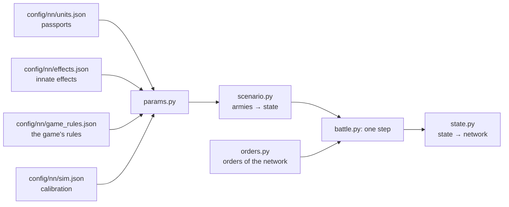

# Battle simulator

[← Back](README.md) · [Documentation](../README.md) › [Data for training](README.md) › Battle simulator · [Русский](../../ru/training/simulator.md)

Step 3 of the path ([network model](network.md)): a simulator of the game's battle in which
the network trains. It plays thousands of battles at once on the GPU. Each unit is one
object (men, health, place, facing, morale, fatigue, projectiles), not every soldier. The
numbers come from the [unit passports](units.md) and the [game's rules](../game/database.md);
where the game behaves differently, they are calibrated to the [measurements](measurements.md).
It covers the units of the training pools on a flat empty map.

## How to run it

```bash
bash tools/nn/dock.sh tools.nn.sim.check                     # all checks against the game (CPU and GPU)
bash tools/nn/dock.sh tools.nn.sim.check --device cuda --only battles
.venv/Scripts/python -m pytest -q tests/tools/test_sim_layout.py   # without torch
```

- The code is `tools/nn/sim/` (PyTorch). It needs torch, which is in the `snake-ai-trainer`
  container; the project's `.venv` has none, so `tests/tools/test_sim.py` is skipped there.
  The image has no pytest: to run the tests there, put a copy of pytest (from `.venv`) on
  `PYTHONPATH` and run `python -m pytest -q tests/tools/test_sim.py`.
- The check writes `build/nn-sim/check.json` (not in Git).

```python
from tools.nn.sim import battle, replay, scenario

st = scenario.build([scenario.from_arena("whole_emp_v_skv", "attack")] * 1024, device="cuda")
battle.run(st, replay.nearest_attack)        # policy(state) -> orders, until every battle ends
st.winner, st.t, st.observation()            # [B], [B], dict of [B, N]
```

## What the simulator holds



**The state** (`tools/nn/sim/state.py`, the one source of truth): tensors `[B, N]` — B battles,
N unit slots of both sides (side 1 in the first half, side 2 in the second, a side's lord
first; `side` = 0 is an empty slot). Three groups:

- *observed* — the same fields and names as a recording's `nn_sample`
  ([what a recording holds](README.md#what-a-recording-holds)): `x`, `z`, `b`, `men`, `hp`,
  `mp`, `ms`, `r`, `s`, `w`, `m`, `mv`, `f`, `a`, `fire`, `target` (the recording's `t`),
  `fat` (the fatigue state 0–5), `k`, `ox`, `oz`, `lf`, `rf`, `bf`, `vis`; the battle time
  is `t` `[B]`. So recorded battles and the simulator feed the network the same way;
- *static* — the passport: men, health, speeds, attack, defence, weapon, armour, shield,
  leadership, projectiles, range, reload, cost; the unit's innate effects (`fx`, a bitmask over
  `config/nn/effects.json`'s order; `fxt0`, `fxt1`: its timed ones) and their rule flags;
- *internal* — what only the simulator needs: morale and fatigue points, timers (of the abilities
  and of the timed effects), `fx_on` (the innate effects on at the step's end).

**Orders** (`tools/nn/sim/orders.py`): per unit and decision step `kind` ∈ hold (0), move (1),
attack (2), withdraw (3), keep (4: no new order, the one in force goes on; a unit with no order
holds); the point `x`, `z` for move and withdraw (the unit's centre); `target` — the enemy's
slot for attack; `run` — run or walk; `ability` — the unit's ability slot to use now (−1 none;
optional: orders made without it get −1; independent of `kind`). All `[B, N]`. A unit in melee
leaves the fight on withdraw, or on a move to a point 10 m or more away (`contact.leave_m`, any
unit): it strikes nobody and is not held in place, while the enemies in contact go on striking
it. A missile unit is first pinned: it stays where it is, in contact and struck, for `contact.pin_s`
5 s, then walks out (the game: our caught shooters told to move away get out after 6–7 s, still in
melee 3 s later 0.85; the simulator walked them out in ~2 s; melee units already stay as long as in
the game, their enemies follow them). As in the game: a melee unit moving away deals ~6 % of its attack rate and takes ~1.7× the
damage ([measurements](measurements.md#leaving-melee)); before, the simulator let a unit under
such a move fight on at full rate, and the network learned to use that. A unit without a missile
weapon standing in melee under hold (no attack order) strikes at `contact.hold_rate` 0.5 of its rate,
every enemy it touches: in the game only such a unit's men in contact fight (the network's units,
matched on own and enemy unit keys: 0.80 of the kills of the same unit attacking; with such a unit
touching 2.3 enemy units in the gate battles, calibrated on the kills). Before, holding in melee
struck at full rate and the network held 76 % of its melee seconds. An ability order fires a ready self-cast ability once (not passive,
not active, recharged); otherwise nothing happens. The network reads the abilities' timers from
`State.observation()` (`ab{k}_on`, `ab{k}_cd` [B, N], s) and the innate effects on now (`fx_on`).

## One step (0.5 s)

1. Take the orders (routing units ignore them).
2. Contacts: the units' rectangles (front × depth of the ranks the men fill) touch.
3. Innate effects (attributes, passives, game-fired timed passives) and cast abilities: their
   stats and rule flags hold for this step.
4. Blows in melee and shots.
5. Health, men, kills.
6. Morale: wavering, rout, rally, shattering.
7. Fatigue.
8. Movement: to the order's point or the target, fleeing for routers; the edge of the map.
9. Is the battle over: a side with no standing unit loses; at 60 minutes the defender wins.

## Mechanics and their sources

"DB" — the game's rules or a passport; "measured" — [measurements](measurements.md) and
recordings; "calibrated" — a number fitted so the simulator repeats the game (all of them are in
`config/nn/sim.json` with the reason).

| Mechanic | How | Source |
|---|---|---|
| Speed | walk, run, acceleration, deceleration of the passport; routing units run at 0.86 of the run (before innate effects: a Skaven rout ×1.1 by Scurry Away!) | DB; the routing speed measured (Empire 0.865; Skaven 0.945 below half health, 0.866 above: [innate effects](#innate-effects)) |
| Formation | front of the ordered width, ranks 1.5 m apart; a lord is a circle of his radius | measured: 120 spearmen, 30 m, 6 ranks |
| Contact | edges within 1 m (2 m more for those already fighting); a unit leaves melee on withdraw or a move 10 m or more away (it strikes nobody, the enemies in contact strike it) | measured: centre distance at the first contact; leaving — the network's runs ([measurements](measurements.md#leaving-melee)) |
| Facing | a moving unit faces where it goes, but a step of less than 10 m to its point goes without turning; a formation in melee turns at most 2° a second (a lord turns at once); out of melee a standing unit turns in place at most `turn.formation_deg_s` 80°/s (a lord, a single entity: `turn.single_deg_s` 40°/s) | measured: infantry in melee turns 1°/s (median; mean 2.3), a free unit struck in the flank turns 8° in 5 s (median); standing missile units out of melee whose engine target appears 60° or more off their facing face it (within 20°) after 1 s (median; mean 1.6 s at 60–120°, 1.7 s at 120–180°; ≥ 64°/s with 1 s samples), standing turns of lords 40°/s (median of 440) |
| Order point | the game records the front's centre; the simulator goes to the unit's centre, half a depth behind | measured (spearmen 3.3–4.8 m, slaves 6.5–6.9 m) |
| Men fighting | 0.75 of the files in contact; a unit shares out to each side of its formation (front, left, right, back) no more than that side holds; at most 9 men strike a lord in all, however many units, their rates summed; with the enemy lord on him the infantry at 0.35; a unit attacking another enemy strikes a lord it touches at 0.4; a melee unit under hold at 0.5 | calibrated; hold — on the kills of the network's units in the gate battles (above, "Orders"); per side — measured: a unit already fighting hits a newcomer on its flank 2.2× the rule in the first 15 s (with one shared front the simulator gave 1.2×); 9, the sum — measured ([a lord surrounded](../game/units/lord-swarm.md)); 0.35, 0.4 — whole battles (below, "Lords fought by several units") |
| Hit chance | 35 + 0.1 × (attack − defence), within 8–90 %; defence ×0.6 from the flank, ×0.3 from the rear; the defence lost counts 2.0× the rule from the flank, 0.25× from the rear (against a lord: none, measured) | DB numbers; the weights calibrated (see below and [flanks](#flanks-rear-and-charges-in-whole-battles)) |
| Damage of a hit | armour-piercing + base × (1 − 0.75 × armour/100), no more than a man's health | DB (armour stops a random 50–100 %) |
| Time between blows | `attack_interval_s` of the passport | DB |
| A lord's blow | hits up to `splash` (4) men | DB; agrees with the measured 0.36 kills a second |
| Charge | the charge bonus to attack and damage, fading over 13 s; a unit that meets the enemy running hits ×(1 + 1.5 × its speed share) for those 13 s; one that did not charge brings its men in over 20 s. Bracing: a unit with `charge_reflection` (spearmen, clanrats) standing still (under 0.5 m/s) meets an infantry charge within `bracing_attack_angle` (80°) of its front as a charge of the same speed | DB (13 s, 80°, the attribute); 1.5 fitted to the first 15 s of the whole battles and the pairs, 20 s to the pairs; bracing measured (whole battles: a braced unit charged head-on loses 0.8× what its charger loses) |
| Men lost | blows that do not kill wound: men share = max(1 − g × (1 − health share), health share), g = (hits to kill)^−0.5 | calibrated on men against health in the pairs |
| Shooting | from standing only; first shot 3.3 s (arrows) / 4.3 s (sling) after halting; a new order (another kind or another attack target) makes the unit aim again (`missile.aim_reset_on_order`); standing, it shoots only at targets within `missile.stand_fire_arc_deg` 45° of its facing: a target beyond that is turned to first (Facing) and aimed at only once within the arc; without an ordered target it takes the nearest within the arc, else turns to the nearest beyond it; the men reload all the time (moving too) and the unit shoots once they are all loaded (`missile.volley_load` 1): whole-unit volleys 11.0 / 11.5 s apart (every loaded man starts reloading when the unit fires, also those whose line is blocked; the `fire` flag stays on between volleys); range from the formation's edge | measured (the range; the battles: a halt gives 0.55–0.76 projectiles a man in the next 12 s, the old volley-then-trickle 1.5–1.7, volleys 1.0; a firing unit given a new order shoots 0.6–0.75 as much in the next 10 s; the arc: 99 % of the game's standing volleys are within 45° of the direction to the target, 95 % within 31°; a new target 60–180° off: the first volley 3 s later against 2 s at 0–40°) |
| Hits | 0.42 arrows, 0.47 sling at the edge of range; ×1.29 at 70 m, ×1.12 at 90 m | measured; the distance factor from the range test |
| Shield, resistance | a shield blocks its chance within 60° of the front; missile resistance of the passport | DB |
| A lord as a target | 0.43 of the unit rule | measured: ~33k shots at lords out of melee for the whole flight (General by arrows ~0.5, by sling ~0.37, Warlord by arrows ~0.32) |
| Friendly fire | of the hits aimed at a unit in melee, 0.26 (arrows) / 0.56 (sling) land on the shooter's own units in contact with it, split by their men (a lord among them ×0.43, as a lone target) | measured: the HP those units lose beyond the melee rule while their own side shoots (1.5k + 1.3k seconds) |
| Spill | of the hits aimed at a unit, each unit of the target's side out of melee takes 0.115 within 30 m, 0.034 at 30–60 m, 0.015 at 60–90 m | measured: HP of units nobody shoots at, next to a unit that is shot (15.6k seconds) |
| Spill in melee | of the hits aimed at a unit in melee, each unit of the target's side also in melee takes 0.19 within 15 m, 0.047 at 15–30 m, 0.035 at 30–60 m (centres) | measured (`build/nn-sim/flank/spill_melee.py`): HP of units in melee, not shot at themselves and whose side does not shoot their opponents, regressed on the melee rule and on the hits aimed at their neighbours in melee (74k seconds, 15k with a shot neighbour; 28 game-AI battles 0.23 / 0.09, net runs 0.19 / 0.05) |
| Target at will | the order's target if in range, else the nearest standing enemy | as the game ([missile damage](../game/units/missile-damage.md)) |
| Line of fire (direct fire) | only for direct (flat) fire, the passport's `missile.direct` (trajectory `low`: the Free Company Militia's pistols); the shooter's men aim at the target's centre, a friendly unit between (nearer than the target's edge) blocks the lines passing through its width across the line, widened by 1.2 man radii (friends count 2.2× wider); blocked men do not shoot; at 75 % blocked the unit takes the next target in range, or holds fire. Arrows and slings arc over friends; enemies in the way do not block; no fire over friends from higher ground (flat map) | DB (`projectile_friendly_fire_man_radius_coefficient` 2.2, `unit_firing_line_of_sight_considered_obstructed_ratio` 0.75, trajectory); the knowledge base ([missiles](../game/mechanics/missiles.md)); the geometry is ours, not measured |
| Fire whilst moving | a unit with `mounted_fire_move` (the militia) aims and shoots while it moves, at targets within `missile.move_fire_arc_deg` 90° of the way it walks | DB attribute; the arc measured (our militia on the move: 0.52 of its full rate toward the enemy, 0.31 across, 0.16 away) |
| Pistols (estimate) | hit rate 0.5 at the edge of range (×1.12–1.29 at 60–90 m), reload 10.8 s, first shot 3.8 s | estimate from the projectile's calibration area (2.0 m at 65 m against the arrow's 3.7 m at 95 m), not measured: `sim.json` missile.musket_why |
| Morale | points: leadership + effects; MoralePercent = points / leadership; moves 1 point or 15 % of the gap per 0.5 s | DB; the step measured (+2 points a second in every recording) |
| Morale effects | lord +4 within 70 m, fading to 0 at 105 m; lord killed (health 0): the others −16 for 45 s, then −10 to the end; routed off the map: −16 for 120 s; shattered or routing on the field: his aura only (`lord_fall`); neighbour within 120 m +5; casualties −2…−74; recent casualties −6…−80 (last 30 s, of the whole health); winning / losing the melee +3/+6/+8, −3/−8 (damage ratio 1.5 / 2.5 / 4); first struck in the flank −6, rear −14 for one 0.5 s tick; the army beaten as a whole (enemy strength ≥ 2.6× own, own ≤ 0.22 of the start) −120; flanks exposed (an enemy threatens the left, right or rear: `lf`, `rf`, `bf`) −3, two or more −6; routing friends −3 each; routing enemies +2.5 each; under fire −5; very tired −2, exhausted −6; a stronger enemy within 70 m −3 | DB points; window, ratios calibrated; attacked in the flank / rear measured ([flanks](#flanks-rear-and-charges-in-whole-battles)); a lord's fall measured: routs in 75 recorded falls, death in 15 in-game battles ([lords](#lords)) |
| States | wavering below 16 points, rout at 0, shattered at the third rout or below −50 points during army destruction; no ordinary rout within 10 s of a rally | DB; shattering below −50 during army losses measured |
| Rally | while the army is not collapsing and no standing enemy is within 90 m the router regains 2 points a second; rallies at MoralePercent 0.23 | measured: 0.23 and 90 m (365 rallies); 2 points calibrated (median rally 44 s) |
| Fatigue | The calibration is ON (`fatigue.calibration.on=true`): 10 ticks/s, DB thresholds; melee tires only under an attack order (single entity +19 a tick, formation 13.7), a move by its order's run flag (run +4, walk −1), routing +4, shooting 7.5, idle −18 with no standing enemy within 80 m, else ready −7 | Fitted on the units' activities in 204 recordings; exhausted shares as in the game ([below](#fatigue-calibration)) |
| Lord abilities | the side the game's AI plays (`ai`, side 2 by default) fires its lord's active abilities by a rule; the network's side fires them by order (`Orders.ability`; a side the network plays should have `ai` false); passives are innate effects (below). Every number is the ability's passport (`config/nn/abilities.json`, the database; `sim.json` abilities says which are modelled and the AI's triggers); effects on the owner (phase targets self), his side's units within range (friends) and enemies within range (enemies): speed, charge speed, melee attack and defence, damage, AP, charge bonus, morale. Warlord: Deadly Onslaught (31 s, ready 90 s after: melee damage and AP ×1.25, charge bonus ×1.6) in melee; Verminous Valour (17 s / 60 s: speed ×1.25, +8 morale points; its 25 m blast has no damage) with an enemy within 60 m; Rally (14 s / 60 s: +16 to friends within 35 m) when a friend there wavers. General: Stand Your Ground (18 s / 90 s: melee defence +24, +16 within 35 m) in melee; Foe Seeker (25 s / 60 s: speed ×1.25) with an enemy within 60 m | DB (`config/nn/sim.json` abilities; owned per the game's roster readout); when the AI fires them is an assumption |
| Innate effects | every attribute and passive or game-fired ability of a unit (`config/nn/effects.json`), one mechanism: on while its conditions hold, its stats on the owner (an aura also on friends in range), its rules for the step. Unbreakable (Flagellants: morale never below leadership, never wavers or routs), Expendable (its rout scares nobody), Encourage (the lord's aura), Charge Reflection (bracing), Fire Whilst Moving; Strength in Numbers (Skaven infantry: +6 leadership, +8 melee defence, speed ×0.9 while health ≥ 50 %), Scurry Away! (speed ×1.1 while wavering or routing), Hold the Line! (+5 melee defence, +4 leadership within 35 m of a standing General), Frenzy (+10 melee attack, ×1.1 damage, AP and charge while morale ≥ half of leadership), Strength of the Penitent (fired by the game when losing the melee: 20 s of +14 melee defence, +15 % physical resistance, ends out of melee, ready 3 s after). Schema only (the network sees them): Charge Defence vs. Large, Vanguard Deployment, Hide (forest), Immune to Psychology; left out by `sim.json` effects.off: Single Entity (lords: speed ×0.9, damage ×0.8 below 25 % health; no such speed drop in the recordings) | DB: the passports, `special_ability_to_auto_deactivate_flags`, `special_ability_to_recharge_contexts`; the attributes' rules: the knowledge base; measured: rout and running speeds, the morale drop at 50 % health ([below](#innate-effects)) |
| Map | a square ±1020 m; a routing unit that crosses the edge leaves the battle | measured |
| Visibility | everything is visible (`vis`, kept for later) | a flat empty map |

**Why the hit chance is almost flat.** By the database rule the four pairs would need 13 to 43
men striking at once, and a lord ~38 ([measurements](measurements.md)). With a flat ~35 % the
same losses need 12–17 men on a 30 m front in every pair and ~8 around a lord: one number fits
all. So attack − defence counts at 0.1 of the rule. The flank and rear, which the pairs do not
test, are fitted to the whole battles (below).

## Fatigue calibration

Fatigue follows the calibration `fatigue.calibration` (ON, `on=true`): the shares of exhausted units are as in the game. The legacy model (5 ticks/s, DB points, melee +19 for every engaged unit, ready −7 as rest, dead and departed slots still counted) is kept only for `on=false`. DB thresholds and effects apply in both. Threat geometry is ON (`threat.calibration.on=true`).

The rule (10 ticks/s, each unit in one activity):
- melee costs points only under an attack order: a single entity (`men0` ≤ 1) +19 a tick, a formation 13.7; in melee without an attack order the unit walks if moving, else rests −18;
- charging +34 only with an attack order;
- a move costs by its order's run flag whatever the speed: run +4, walk −1 (DB); a routing unit +4;
- shooting 7.5; a unit standing without unfinished movement, attack or aiming rests −18 when no standing enemy is within 80 m, otherwise ready −7; dead and departed slots are frozen.

Where the numbers come from. Each unit's activity in each second of the 204 fair recordings is put into a class, and the class points are fitted so that accumulating them over the same activities gives the game's recorded states (`build/fat/opus/classes.py`). A formation in melee with a target: 13.86 a tick, shooting 7.15; 25-resample bootstrap 13.6–14.5 / 6.5–7.6. A lord in melee fits the DB +19; units in melee without a target recover; routing 5.1 a tick (running +4). Walking: clean walk spans of the game AI's units under a walk order (2925 s) cross 0 states up and 6 down — walking recovers at the DB −1; the earlier fitted +3.4 came from moves under a run order at low speed (`build/fat/opus/gate_check/walk_noflag.py`). Rest near an enemy: standing network units in the game recover at 0.48 / 0.62 / 0.79 / 1.00 of idle −18 with the nearest standing enemy at 40 / 40–80 / 80–150 / 150–300 m, the simulator without this rule at 0.9–1.1 (`build/agent_fatv3/near2.py`); the 80 m boundary comes from this measurement, the DB has none.

Simulator replay: both recorded order streams, one copy, no jitter, game-end cutoff (`build/agent_fatv3`).

| Exhausted share, % | Game | Calibration (current) | Legacy ×5 |
|---|---:|---:|---:|
| own, all 204 recordings | 17.34 | 17.06 | 5.66 |
| enemy, all 204 recordings | 28.61 | 29.05 | 9.17 |
| own, ≥240 s | 30.29 | 29.07 | 10.05 |

Late in a battle (gate 20261005-161910: network `s6_fatigue/m20` against `ai_like` from the gate's four starts, 4 copies; own alive units) fewer units are exhausted than in the game and some rest back to Fresh. Shares, % (exhausted / fresh):

| Time | Game | Calibration | Walk +3.4, no routing / near-enemy rule |
|---|---:|---:|---:|
| 0–120 s | 0.0 / 60.5 | 0.0 / 55.0 | 0.0 / 55.0 |
| 120–240 s | 2.0 / 1.6 | 5.6 / 0.5 | 6.5 / 0.1 |
| 240–360 s | 51.8 / 0.1 | 37.0 / 3.6 | 43.8 / 1.9 |
| 360+ s | 79.8 / 0.0 | 59.8 / 7.4 | 56.8 / 11.3 |

Standing units rest in the simulator at the game's pace (state drops per 100 s from states 2–5: 2.0–2.6 against the game's 1.9–2.8), but late in a battle our simulated units stand longer: 23 % of the seconds after 180 s against 13 % in the network's game recordings (still spans of 120 s or more start at state 3.4 on average in the simulator, 1.2 in the game). That is a difference of battle trajectories (who waits and how long), not of the fatigue rule. Replaying the recorded orders of the same four battles gives 24.1 / 25.8 % exhausted at 240–360 / 360+ s against the game's 51.8 / 79.8 % (before this rule 23.4 / 22.5 %).

The spearmen of `pair_warlord_v_spear` exhaust at 231/232/232 s (game 226/229/230 s; the legacy model never exhausted them).

The check against the game now (frozen set of recordings, higher is better): mechanics 51/54, game-AI winners 23/26, network battles 96/132 (with walk +3.4 by speed: 51/54, 22/26, 96/132); the legacy model had 51/54, 20/26, 100/132. In the network battles 6 outcomes are lost and 2 gained; most changed battles have a copy majority of 0.5–0.75. Trade at game end is a little further from the game on all four gates (table below). That is the calibration's cost; in return fatigue now builds up as in the game (the legacy model exhausted a third as often).

With the earlier fatigue trial (contact share, "Tried and rejected") and threats ON, closed-loop melee flag shares (left/right/rear): own 0.205/0.189/0.054, enemy 0.213/0.200/0.050; game 0.181/0.259/0.072 and 0.154/0.190/0.044. Same three checkpoints and 18 starts, one copy each; denominator is time-weighted standing non-lords on each trajectory.

Exhausted shares, %. First column: all original own inputs in 204 recordings. Second: game-standing units in `sol56` (18 battles, gates 230630/031306/071054). The latter denominator gives 16.7%; game-standing units across all 204 give 11.5%.

| Model | All inputs | Standing sol56 |
|---|---:|---:|
| game | 17.34 | 16.66 |
| final | 6.21 | 5.26 |
| incoming10 | 42.35 | 29.44 |
| contact_ready | 10.54 | 13.04 |
| contact_walk | 14.74 | 16.72 |
| clock6 | 13.45 | 9.25 |
| clock7 | 21.66 | 14.94 |
| attack order, walk +3.4 by speed | 16.83 | — |
| attack order, moves by the run flag (calibration) | 17.06 | — |

State shares over time, %. Cells are **game / incoming ×10 / contact+walk / final ×5**. Both recorded order streams, one copy, no jitter, game-end cutoff; identical game masks and seconds, terminal simulation frames held.

| Time | Fresh | Active | Winded | Tired | Very tired | Exhausted |
|---|---:|---:|---:|---:|---:|---:|
| <120 s | 76.8 / 58.9 / 59.7 / 73.9 | 19.2 / 18.1 / 22.3 / 21.1 | 3.9 / 16.9 / 17.3 / 5.0 | 0.1 / 6.1 / 0.7 / 0.0 | 0.0 / 0.1 / 0.0 / 0.0 | 0.0 / 0.0 / 0.0 / 0.0 |
| 120–240 s | 28.1 / 4.7 / 6.4 / 6.8 | 19.5 / 3.2 / 9.1 / 16.3 | 23.0 / 14.0 / 53.9 / 52.6 | 17.7 / 21.9 / 17.9 / 22.3 | 10.3 / 38.4 / 10.1 / 1.9 | 1.4 / 17.8 / 2.7 / 0.0 |
| ≥240 s | 17.0 / 4.2 / 5.7 / 3.3 | 8.8 / 1.2 / 3.4 / 2.6 | 10.4 / 3.7 / 15.2 / 14.3 | 13.5 / 5.0 / 20.0 / 29.0 | 20.0 / 17.5 / 30.5 / 39.6 | 30.3 / 68.4 / 25.1 / 11.0 |
| all | 32.5 / 16.3 / 17.7 / 19.6 | 13.4 / 5.3 / 8.8 / 9.7 | 11.7 / 8.8 / 24.1 / 20.6 | 11.5 / 8.9 / 15.3 / 21.2 | 13.5 / 18.2 / 19.4 / 22.7 | 17.3 / 42.4 / 14.7 / 6.2 |

Frozen check, higher is better. Incoming whole-unit ×10: 49/54, 22/26, 101/132; original ×5: 51/54, 23/26, 99/132. Contact_walk alone received mechanics/game-AI checks; the selected threat geometry additionally received the 132-battle network check. Both ON is reported above.

| Model | Mechanics | Game-AI | Network |
|---|---:|---:|---:|
| contact_walk | 49/54 | 22/26 | — |
| threat ON, legacy fatigue | 51/54 | 20/26 | 100/132 |
| threat OFF, legacy fatigue | 51/54 | 23/26 | 99/132 |
| attack order, walk +3.4 by speed | 51/54 | 22/26 | 96/132 |
| attack order, moves by the run flag (calibration, current) | 51/54 | 23/26 | 96/132 |

Trade at game end: positive is better for our side; four copies, seed 1, both recorded order streams.

| Gate | Game | Incoming ×10 | Contact+walk | Threat ON, legacy fatigue | Final OFF | Attack order (current) |
|---|---:|---:|---:|---:|---:|---:|
| 20261004-230630 | -0.306 | -0.075 | -0.081 | -0.067 | -0.069 | -0.047 |
| 20261004-071805 | -0.260 | -0.092 | -0.090 | -0.083 | -0.091 | -0.052 |
| 20261003-204730 | -0.407 | -0.289 | -0.276 | -0.271 | -0.255 | -0.243 |
| 20261005-031306 | -0.329 | -0.097 | -0.120 | -0.093 | -0.100 | -0.088 |

## Threat-flag calibration

`lf/rf/bf` are native `is_left_flank_threatened/is_right_flank_threatened/is_rear_flank_threatened`, passed unchanged through the companion. The simulator keeps these three observation channels and uses the same flags for exposed-flank −3/−6 morale. Attacked-from-flank/rear −6/−14 events depend separately on the incoming first-contact sector, not these threat flags.

48 range/sector/enemy-facing combinations were tested on 18 recorded battles and baseline replay trajectories. Candidate: 45 m, front boundary 60°, rear 150°, enemy facing the unit within 60°, geometry after movement/turning. No random observation thinning; the game adapter is unchanged.

Closed-loop network flag shares: **left / right / rear**. Baseline 108 replays (6 per start), trial 18 (1 per start), the same three checkpoints and 18 starts, CPU.

| Side / melee | Game | Before | Trial ON |
|---|---|---|---|
| 1/1 | 0.181 / 0.259 / 0.072 | 0.370 / 0.347 / 0.319 | 0.250 / 0.196 / 0.049 |
| 2/1 | 0.154 / 0.190 / 0.044 | 0.327 / 0.340 / 0.306 | 0.195 / 0.187 / 0.047 |
| 1/0 | 0.036 / 0.035 / 0.034 | 0.024 / 0.019 / 0.061 | 0.010 / 0.008 / 0.025 |
| 2/0 | 0.031 / 0.037 / 0.018 | 0.026 / 0.022 / 0.093 | 0.016 / 0.015 / 0.038 |

Threat geometry alone is enabled because it removes the main rear-input error (0.319/0.306 → 0.049/0.047 versus game 0.072/0.044). This is a decision based on direct measurement, not a claim of complete calibration: mechanics remains 51/54 and game-AI winners fall 23 → 20/26. Noise-level acceptance is unmet: on baseline trajectories, own-right melee is 0.177 versus game 95% interval 0.226–0.291; out-of-melee own left/right are 0.011/0.008 versus 0.029–0.041 / 0.025–0.049. Intervals use battle bootstrap. Artifacts: `build/agent-fatigue2`; combined checks and failure diagnostics: `build/agent-fatigue3`. Unobserved entity activities and replay inference for missing targets remain limitations; replay protocol was unchanged.

## Army destruction

`morale.army_collapse` applies `ume_concerned_army_destruction` (−120 points) when
enemy strength is ≥ 2.6× own and own strength is ≤ 0.22 of its start. Both thresholds
come from the database. Strength approximates recorded `unit:strategic_value()`:
cost × HP share, lords worth ×1.65, missile units weighted by ammunition remaining.
Routers count at half strength; shattered, dead and departed units do not. A normalised sigmoid
(slope 14, midpoint 0.25 of initial ammunition) reduces missile value from 1 to 0.32
when empty, or 0.57 for direct fire. The latter is measured on Free Company; other
missile classes are unverified. Parameters and evidence are in `sim.json morale.collapse`.
The rule has no recording-end time or winner input.

Source: 175 completed fair battles (28 game-AI, 147 network), 69 with the newer CCO
fields. `MoraleGreatestEffect` identifies “Army losses” on 65 sides. Across all 350 sides,
the ≥0.4 MoralePercent drop in 60% of standing units within 3 s occurs on 135 sides;
actual routing/shattering of 60% within 3 s occurs on 80. The detector requires at least
two initially standing units and a complete three-second window.
The database thresholds on strategic value with routers weighted 0.5 locate 64/65 onsets within
5 s, median error 0 s. This strength reconstructs BalanceOfPowerPercent with mean
absolute error 0.00041 (full router weight: 0.0121). The simulator approximation
locates 58/65 onsets within 5 s, misses none, median error 0 s. Three additional
triggers occur only in the final frame after the last standing unit has routed. Of 275 units
standing just before onset, 271 show the effect, median delay 0 s. The median number
of non-expendable routing friends within 100 m is 0: propagation is army-wide.
Local routing-friend penalties retain their database −3 each, at most four, within 100 m.

Routers continue losing morale under army destruction and cannot rally away from
enemies. During army destruction, below −50 points (`ums_broken_threshold_lower`) a unit shatters regardless
of its rout count: all 274 recorded army-loss shatters before a third rout crossed
this threshold. Unbreakable units remain immune. A routed lord costs only his aura
(`lord_fall`) and does not substitute for army destruction.

**Gate verification** (`build/collapse`, CPU, 4 copies, seed 1, up to 2 m jitter,
both recorded order streams, measured at the game end time). Gold loss is each unit's
worst state through that time, divided by budget; trade = AI loss minus own loss.
Each cell is **game / before / after**.

| Gate | Trade | Own gold lost | AI gold lost |
|---|---:|---:|---:|
| 20261004-230630 | -0.306 / -0.090 / -0.094 | 0.941 / 0.747 / 0.751 | 0.635 / 0.657 / 0.657 |
| 20261004-071805 | -0.260 / -0.080 / -0.088 | 0.920 / 0.787 / 0.794 | 0.660 / 0.707 / 0.706 |
| 20261003-204730 | -0.407 / -0.252 / -0.246 | 0.957 / 0.856 / 0.857 | 0.550 / 0.604 / 0.611 |

Mean absolute trade error across the three gates is 0.18356 → 0.18137, but the third
gate regresses: the requirement to improve all three is **not met**. At least 60% of
standing units breaking within 3 s (at least two initially standing): game 52/176 sides,
simulator 8/176 → 10/176. Mean absolute timing error among pairs with a detected event
is 55.8 → 28.1 s, but only 6 → 8 pairs are matched; this is not a complete timing score.
The broader MoralePercent-drop ≥0.4 detector gives game 64/176, simulator 11/176 → 11/176.
The denominator is 22 battles × 4 copies × 2 sides; game events are repeated per copy.
By game end the replay's strength often differs substantially: in the first copies,
only 3/22 own armies reach the measured conditions. A correct trigger on recorded states
does not remove accumulated combat divergence. The rule never uses the game end time.
`tools.nn.sim.check` on the unchanged recording set of the preceding check, CPU,
8 copies, seed 0, up to 2 m jitter:

| Check | Before | After |
|---|---:|---:|
| Same winner: game AI | 23/26 | 23/26 |
| Same winner: network | 98/132 | 99/132 |
| Mechanics within 20% | 51/54 | 51/54 |

The CPU harness skips already completed batch rows: every field was equal at each
of 400 validation steps, and all 28 baseline game-AI result rows matched ordinary execution.
Recordings and start jitter are identical before/after; new recordings from the running gate
were excluded. All 105 simulator tests passed. The morale change alters the simulator version
and baseline-evaluation cache key.

## Innate effects

`tools/nn/sim/effects.py`: one mechanism for every attribute and every passive or game-fired
ability of a unit. The catalogue is `config/nn/effects.json` (`python -m tools.nn.effects`, from the
passports; [unit passports](units.md#innate-effects)): per effect its stats, rules, conditions,
timers and whether the simulator acts on it (`modelled`). Nothing in the simulator knows a unit or
an effect by its key.

- **Owned.** `params.static` gives each unit `fx`, a bitmask of the effects the catalogue links to
  it, `fxt0` / `fxt1` (its timed effects) and the rule flags of its unconditional effects.
- **Conditions** (each step, from the state at its start): `in_melee` / `out_of_melee` (in contact
  with a standing enemy), `losing_melee` (in melee and HP taken ≥ 1.5 × dealt recently: the morale
  rule's ratio), `morale_below_half` (points < half of leadership), `not_wavering`, `hp_below_half`
  (< 50 % of the start), `hp_below_quarter`. An effect is on while all its `needs` hold and none of
  its `off_when` does; an attribute always.
- **Timed** (Strength of the Penitent): fires by itself for a standing unit when its `fires_when`
  holds and it is ready, lasts `active_s`, ends at once while an `off_when` holds, ready again
  `recharge_s` after it ends. The ability bar slot holding its ability (`ab{k}_on`, `ab{k}_cd`) shows
  the same timers, so the observation reads it as before.
- **Effects.** While on: multipliers multiply, additions add (melee attack, defence, damage, AP,
  charge, speed and charge speed, morale points, physical resistance to the 90 % cap) on the owner,
  and for an aura (`range_m` > 0, stats on friends: Hold the Line!) on the friends within range of a
  standing owner. Rule flags (`unbreakable`, `expendable`, `encourages`, `reflect`, `fire_move`,
  `fatigue_immune`) hold for the step, read by morale, the aura, bracing, shooting and fatigue. An
  effect lies on a unit that is alive, routing too (Scurry Away! speeds a rout). All of it is undone
  at the step's end, as for the cast abilities and fatigue.
- **`fx_on`** (the network's input): the effects whose conditions hold now, whether the simulator
  acts on them or not (Hide (forest) counts as on: in the game it is). The step acts on the
  conditions at its start; `fx_on` is worked out again on the step's final state (in melee = `m`),
  so the network sees what a recording's fields give at the same moment (a unit that wavers in
  this step shows Scurry Away! now, not a step later).
- **Schema only** (`modelled` false, with the reason in the file): Charge Defence vs. Large (no
  large units in our pools), Vanguard Deployment (placements are the army generator's), Hide
  (forest) (no woods), Immune to Psychology (no fear or terror). `sim.json` effects.off leaves out an
  effect the catalogue could model (a calibration switch with its reason): Single Entity, whose
  "speed ×0.9, damage ×0.8 below 25 % health" (our reading of its recharge context) the recordings
  do not show (lords running out of melee: 0.84–0.85 of their run in every health band). A new effect whose stats, rules
  and conditions the simulator has works without code (a test gives the spearmen Perfect Vigour by
  the catalogue alone).

**Measured** (all fair recordings with unit keys; speed over 1 s steps, at least 3 s
into a rout): routing Empire units run at 0.865 of their run (115k s), routing Skaven at 0.945 below
half health (186k s) and 0.866 above it (14k s); running in order, steady, above half health:
Empire 0.97, Skaven 0.88. Scurry Away!'s ×1.1 and Strength in Numbers' ×0.9 (above half health)
give exactly these ratios, so `morale.rout_speed` is the Empire's 0.86. Crossing 50 % health, Skaven
units drop 2.3 points more morale in the next 3 s than Empire units (7.7 against 5.5 over 1 039 and
951 crossings; at 40 % and 60 % both drop the same): Strength in Numbers' +6 switches off there.
The Skaven's former start bonus (`morale.faction_bonus` +6, fitted) was Strength in Numbers: it is 0
now.

## Flanks, rear and charges in whole battles

Measured in the 28 whole battles (18 mirror, 10 Empire-Skaven), and in the simulator's open-loop
replays of them by the same code (`build/nn-sim/flank/flank.py`, not in Git). A contact: an enemy
standing in melee whose formation edge (the simulator's rectangles at the recorded places,
bearings and men) is within 3 m; its sector is the angle of its centre off the unit's facing
(front within 60°, rear beyond 120°), as the simulator counts it. HP lost is set against the
simulator's frontal melee rule for the same contact.

| Infantry in melee, one contact, not shot at | The game | The simulator |
|---|---:|---:|
| Seconds with the worst contact front / flank / rear | 58 / 31 / 11 % | 72 / 23 / 6 % |
| HP lost from the flank, × from the front (10–90 % over runs) | 1.74 (1.56–1.89) | 1.55 |
| HP lost from the rear, × from the front | 1.31 (1.19–1.42) | 1.50 |
| Morale points while fought from the flank / rear (regression*) | −1.0 / −1.8 | −0.8 / −4.0 |
| … one / two or more of `lf`, `rf`, `bf` set | −3.9 / −8.1 | −4.3 / −7.0 |

\* Points − leadership against health lost (and its square), flank, rear, 2+ contacts, the
exposed flags, under fire; infantry melee seconds (the game 30k, the simulator 97k).

New contacts (infantry i struck by infantry j): HP i loses in the first 15 s over HP j loses.

| | Contacts in the game | The game | The simulator |
|---|---:|---:|---:|
| j charges, i stands, from the front | 102 | 0.82 | 1.44 |
| j charges, i runs at it too | 104 | 0.90 | 0.91 |
| j charges i's flank or rear, i free | 206 | 1.11 | 1.65 |
| j charges i's flank or rear, i already fighting | 24 | 1.30 | 2.22 |
| j walks into i's flank or rear, i already fighting | 77 | 1.23 | 1.34 |
| Morale points of i 15 s after it is charged standing | 102 | −6.5 | −11.3 |

- **In the game a charge buys little.** A unit charged while standing loses no more than its
  charger (0.82); braced spearmen (`charge_reflection`, 87 of the 102) 0.80, units without it
  about the same (1.02, 15 contacts). Hence bracing and a charge impact of 1.5.
- **In the game formations do not turn round in melee** (1°/s): an enemy on the flank or rear
  stays there. The simulator turns a unit in melee at 2°/s.
- **The flank costs more than the rear by this count** (1.74 against 1.31), against the database's
  defence ×0.6 / ×0.3; the simulator is fitted to it (`flank_slope` 2.0, `rear_slope` 0.25).
- **A lone attacker from the flank or rear, counted apart**
  ([measurements](measurements.md#flank-and-rear-a-lone-attacker): infantry only, nobody shooting,
  contacts older than 10 s) takes 1.53× (flank) and 1.92× (rear) of what a lone frontal one takes;
  the simulator gives 0.94× / 0.99× (a flank striker brings men by the target's short side, its
  depth: ~4.5 men for a 30 m front instead of 15). The fix is [pending](#pending-changes).
- **"Attacked in the flank / rear" is small in the recordings**: −1 / −2 points over the contact,
  the database's −6 / −14 being one 0.5 s tick at the first strike from that side (the simulator
  gives it so). "Flanks exposed" is there as in the database: −3.9 / −8.1 against −3 / −6.
- Still stronger than in the game: a charge into the flank or rear (1.65–2.22 against 1.1–1.3), and
  the morale drop after a charge (−11 against −6.5). `lf` / `rf` / `bf` are set 1.3–3× as often as
  the game's flags (the game's are noisy: 0.3–0.7 with an enemy within 60 m on that side).

Tactic scan against `nearest` (the training's scripts, `build/nn-sim/flank/scan.py`: 48 battles
per army, role and side; wins of the tactic; Empire / Skaven = the tactic plays that army in the
Empire-Skaven battle):

| Tactic | Mirror | Empire | Skaven |
|---|---:|---:|---:|
| `nearest` itself | 49 % | 26 % | 82 % |
| all on one target | 32 % | 1 % | 65 % |
| archers stand and shoot | 1 % | 1 % | 88 % |
| the lord waits 2 minutes | 18 % | 1 % | 80 % |
| attack at a walk | 0 % | 0 % | 0 % |
| enemies already engaged first | 32 % | 3 % | 46 % |
| a reserve waits until the enemy is engaged | 3 % | 0 % | 7 % |
| `hold_shoot` | 34 % | 5 % | 70 % |
| **flank**: melee units go for an enemy already fighting ours, via a point beside its flank | **69 %** | 17 % | 79 % |
| flank, with a reserve | 15 % | 1 % | 51 % |

The Skaven win the Empire-Skaven battle (`nearest` against `nearest`: 26 % for the Empire, 82 % for
the Skaven; in the game the Skaven won all 10 recorded ones). Flanking beats `nearest` in the
mirror (69 %). Waiting (a reserve, a walk) loses: the side that waits fights outnumbered.

## Lords

- **Fought by several units** (the [lord swarm probe](../game/units/lord-swarm.md), 3 battles in
  the game). A lord in a ring of 1–4 spear units loses the same HP/s however many units there are
  (General 7.8 / 8.3 / 8.7 / 7.4, Warlord 6.2 / 5.8 / 5.1 / 4.8); 4–5 enemy soldiers stand within
  2.5 m of him; his back and flanks give no extra. So at most `lord_max_attackers` (9) men strike a
  lord in all, summed; `lord_direction` 0; an enemy lord among the attackers keeps his blow; with
  the enemy lord on him the infantry counts at `lord_rival_others` 0.35; a unit told to attack
  another enemy strikes a lord it only touches at `lord_incidental` 0.4 (whole battles: 1.7 HP/s
  against 4.1 when he is its target), and an enemy unit it only touches at `unit_incidental` 1.0.
  This coefficient was reselected with contact-phase synchronisation (checks below); the old
  0.3 fit is rejected. The probe's
  trials replayed (`python -m tools.nn.lord_swarm --sim`; game / simulator): one spear unit 7.8 /
  7.7 and 6.2 / 6.1; four 7.4 / 8.0 and 4.8 / 6.3; halberds 21.5 / 17.1 and 11.2 / 11.7; the other
  lord and three units 29.8 / 21.8 and 27.6 / 22.4; mean error over the 24 layouts 18 %.
- **Lord against lord** (`contact.lord_v_lord` 0.73): a lord fought by the enemy lord alone loses
  14.6 HP/s (General) and 10.0 (Warlord) in the game, 19.4 / 15.0 in the simulator without the
  factor.
- **A lord's fall** (`morale.lord_fall`). Any fall takes his aura. **Killed** (health 0): the other
  units of his army get "general died recently" (−16 from the database) for 45 s (`recent_s`), then
  "general dead" (−10) to the battle's end. **Routed off the map** (left alive): "general fled recently"
  (−16 from the database) for 120 s (`fled_s`), then nothing. **Shattered or routing on the field**: the
  aura only (`routed` 0).
  Measured in the game ([lord_fall](../apps/entries.md#lord_fall), 15 battles): at a death the units
  out of the aura and far from enemies lose −3 / −7 / −13.5 / −16 points 1 / 2 / 5 / 10 s later, hold
  −16, the effect turns into "general dead" at 45.5–46 s, and from ~50 s to the recording's end they
  stand at −10 — the same in all three factions; the ramp is the morale step itself, so the points
  are a step. At a rout (Empire, Skaven) the same units lose nothing; in all 75 recorded falls of the
  fair battles the lord shattered with 2–50 % of his health (none was killed), and his standing units
  lost −3 / −4.7 / −4.8 points 2 / 6 / 10 s later — about the aura. Leaving the map — from recorded
  battles (`build/prespec/specs.md`, section 1): a shattered lord who leaves the map (4 cases) gives
  "general fled recently", the standing units −14…−17 points within 10 s, the effect lasts ~120 s (2
  cases with a measured end — medium confidence), no "general dead" follows. Vampire Counts' routed lord
  crumbles and dies 8–8.5 s later, and the army gets the death's shock: `rout_death_s` 8 for the
  faction (the simulator's data has no Vampire Counts: config only). The same battles in the simulator
  (`build/lorddeath/sim_fall.py`, Empire and Skaven), points 1 / 2 / 5 / 10 / 20 / 40 / 60 s after
  the death:

  | | 1 | 2 | 5 | 10 | 20 | 40 | 60 |
  |---|---:|---:|---:|---:|---:|---:|---:|
  | out of the aura: game | −3 | −7 | −13.5 | −16 | −16 | −16 | −10 |
  | out of the aura: simulator | −4.4 | −7.6 | −14 | −16 | −16 | −16 | −10 |
  | out of the aura: simulator before the rule | 0 | 0 | 0 | 0 | 0 | 0 | 0 |
  | in the aura, in melee, net of the control: game | −6.4 | −9.3 | −16.5 | −16 | −16.9 | −19.1 | −13.5 |
  | the same: simulator | −5.5 | −9.6 | −16 | −20 | −20 | −20 | −14 |
  | the same: simulator before the rule | −2 | −4 | −4 | −4 | −4 | −4 | −4 |

  The army's collapse is the [army-destruction rule's](#army-destruction), not the lord's.
- **Lord abilities** (`tools/nn/sim/abilities.py`). When the game's AI fires them is assumed, not
  measured (only the Warlord's speed in the recordings, 5–6.5 m/s, shows Verminous Valour in use);
  CA's planner on side 1 of the recorded whole battles gets no actives. The network's side fires
  them by order.
- **Shots at a lord in a crowd.** The game's AI slingers shoot a General fighting among his own
  spearmen, and the misses fall on those spearmen: spill reaches the target's units in melee too
  (the table above). One recorded swarm replayed 8 times: ours lost 12.2k HP (the game 14.7k), the
  Warlord 2.5k (the game 1.6k).

## Checks against the game

The synchronisation comparison below predates the strategic army-strength model.
Terminal-collapse checks before the fatigue change are in [Army destruction](#army-destruction);
the current check is in [Fatigue calibration](#fatigue-calibration).

`python -m tools.nn.sim.check`: every recorded run is replayed in the simulator from the recorded
start with the recorded orders (`tools/nn/sim/replay.py`: a target fought or shot →
attack it; in melee without a recorded target → attack the nearest enemy (CA's planner leaves the
target empty in ~70 % of its melee seconds, the game's AI in ~6 %), while the network's unit holds (the
engine target of its attack orders is recorded in 97 % of their melee seconds, so without one it is
under its hold); otherwise → move to the order's
point), written down once a second like a recording and measured by the same code as the game
(`tools/nn/measure.py`). A pair or shooting replay runs on its last recorded orders until a unit
routs; a whole battle stops when its recording ends and is compared then (if it is not over, the
side with more health left in standing units counts as the winner). Each recorded battle is played
8 times from starts moved by up to 2 m; the simulator's winner is the majority's. A unit in melee
without a recorded target whose recorded point is 10 m or more away moves there (it leaves the
fight) only if that point is a move order in force: the network's units and missile units; the
melee units of CA's planner and of the game's AI fight on. The network's battles against the game's
AI (the gate: generated armies) are reported apart; the attacker of a recorded battle comes from its
manifest's roles (`scenario.attacker_of`).

**Contact synchronisation.** Each unit and batch copy has its own recording clock. A run or
attack preceding recorded contact continues until actual simulated melee; once running starts,
its flag stays set until contact. The recorded route is preserved until contact is due. If contact
is late, the unit follows the opponent identified by the recorded fight instead of stopping at
that opponent's old position. The attack target stays fixed through this phase and the recorded
fight while that opponent stands. Ordinary shooting attacks never wait for melee.

A recorded break-off waits for actual separation. The `leave_m` inference is unchanged: a far
point in recorded melee means leaving only for network units and missile units; other AI infantry
still attack. A MOVE first recorded after separation also waits for separation, without skipping
the subsequent route. A move cancelled before separation is not an exit phase. Routing or losing
the actor, or an unavailable target, releases the latch. Contact means the simulator's `m` flag,
including incidental opponents; game positions, health and outcomes are never imposed on the sim.

Ordinary orders keep their durations relative to these clocks. Comparisons use the original game
end time; extended replays attack the nearest enemy 120 s after the recording ends even if a phase
is stuck. `check` still cuts whole battles at the recording's end and continues pairs on their last
orders. Legacy order arrays without phase metadata remain clock-indexed.

Controlled comparison on three gates (`build/gap5/replay_task`): both sides replayed, 4 copies
per battle, identical start jitter up to 2 m, seed 1, existing ability rules and the 120 s grace
before nearest attack. Trade is enemy gold lost minus our gold lost, divided by budget; each
unit's loss is its worst state up to the measurement time, including routing, as in the gates.
Positive favours us; fidelity means closer to the game. Cells show **at game end / at sim end**:

| Gate | Game | Previous replay, 0.3 | Phases, 0.3 | Phases, 0.6 | Phases, 1.0 |
|---|---:|---:|---:|---:|---:|
| 20261004-230630, 6 battles | −0.306 | −0.010 / −0.043 | −0.036 / −0.081 | −0.057 / −0.095 | −0.090 / −0.152 |
| 20261004-071805, 8 battles | −0.260 | −0.060 / −0.032 | +0.054 / +0.089 | −0.034 / −0.038 | −0.080 / −0.086 |
| 20261003-204730, 8 battles | −0.407 | −0.190 / −0.254 | −0.156 / −0.174 | −0.209 / −0.235 | −0.252 / −0.280 |

The game AI on the first six battles: running entries / contacts per melee-second (pooled
numerators and denominators): game **97.8% / 0.0300**; previous replay **86.1% / 0.0241**;
phases at 0.3 **86.2% / 0.0275**, at 0.6 **87.1% / 0.0298**, at 1.0 **85.1% / 0.0300**.
At 1.0, cut at the game's end: **84.2% / 0.0308**. Mean duration overrun on these battles:
previously 243 s, phases at 0.3 263 s, at 0.6 267 s, at 1.0 238 s. The 98% running-entry
requirement is **not met**: at 1.0, 114 of 165 non-running entries already had a run order,
and 85 were met standing. Order latching alone is insufficient; this does not establish
that the simulator/game discrepancy is resolved.

The current `contact.unit_incidental` is **1.0**: it is closer to game trade on all three
gates and improves the overall check. The matched `sim.check` comparison uses 8 copies,
seed 0, up to 2 m jitter, CUDA battles and CPU mechanics. The network sample is frozen to
`build/p3/check_after_battles.json` (132 decided battles); later recordings are excluded.
The old replay control reproduces the original 22/26 and 81/132.

| Replay / unit_incidental | Same winner: game AI | Network | Mechanics within 20% |
|---|---:|---:|---:|
| Previous / 0.3 | 22/26 | 81/132 | 51/54 |
| Phases / 0.3 | 22/26 | 78/132 | 51/54 |
| Phases / 0.6 | 22/26 | 91/132 | 51/54 |
| **Phases / 1.0** | **23/26** | **98/132** | **51/54** |

Mean absolute trade error across the three gates at game end / sim end: previous replay
0.238 / 0.215; phases at 0.3: 0.278 / 0.269, at 0.6: 0.225 / 0.202, at 1.0:
**0.184 / 0.151**. This selects a coefficient from the combined checks; it does not establish
that game movement is reproduced or the 98% requirement is met. The replay and coefficient
changes alter the simulator version and its baseline evaluation cache.

### Mechanics: the pairs and shooting

The detail behind the mechanics count (measured before the volley rule; the volley moves the
archers' target's wavering after the first shot to 22 s):

| Case | The game | The simulator |
|---|---|---|
| Spearmen — slaves: fight, s | 232 (208–252) | 260 |
| … slaves lose HP/s / spearmen | 22.7 / 12.4 | 23.3 / 14.1 |
| … slaves waver / rout, s | 195 / 232 | 181 / 260 |
| Spearmen — clanrats: fight, s | 275 (219–353) | 290 |
| … spearmen lose / clanrats HP/s | 25.7 / 20.6 | 22.1 / 19.5 |
| … spearmen waver / rout, s | 251 / 275 | 269 / 290 |
| General — clanrats: fight, s | 348 (340–357) | 335 |
| … the General / clanrats lose HP/s | 8.2 / 21.8 | 6.9 / 22.9 |
| … clanrats waver / rout, s | 254 / 348 | 254 / 335 |
| Warlord — spearmen: fight, s | 309 (264–338) | 264 |
| … the Warlord / spearmen lose HP/s | 5.5 / 21.2 | 5.4 / 25.3 |
| … spearmen waver / rout, s | 277 / 309 | 229 / 264 |
| Winner of each pair | 12 of 12 | 12 of 12 |
| Archers → slaves: reload, s / hit rate / HP/s | 11.0 / 0.42 / 66 | 11.6 / 0.43 / 62 |
| … the first shot after halting, s | 3.3 | 3.7 |
| … the target wavers / routs after the first shot, s | 39 / 71 | 41 / 74 |
| Slingers → spearmen: reload, s / hit rate / HP/s | 11.5 / 0.47 / 36 | 11.5 / 0.47 / 37 |
| … the target wavers / routs, s | 154 / 177 | 160 / 183 |

Outside 20 %: the HP lost in the first 15 s of contact (the charge) — the clanrats against the
General (−28 %) and against the spearmen (−33 %), the Warlord (−22 %): the charge is noisy in the
game too; and in the spearmen–clanrats pair the clanrats waver on the last tick of one replay as
the spearmen rout (their Strength in Numbers' +6 is off below half health; the game's clanrats
reached 13 points there, below the 16 of wavering, without wavering).

### Whole battles

| | The game | The simulator |
|---|---|---|
| Empire HP lost 60 / 120 / 180 s after the first contact | 0.25 / 0.41 / 0.53 | 0.29 / 0.49 / 0.63 |
| Skaven HP lost 60 / 120 / 180 s after the first contact | 0.21 / 0.34 / 0.42 | 0.20 / 0.34 / 0.44 |
| Mirror: HP lost by side 1 / side 2 at the end | 0.74 / 0.75 | 0.83 / 0.72 |
| Routs / rallies a battle | 22.5 / 13.0 | 22.2 / 14.8 |
| A rally takes (median), s | 44 | 44 |
| A battle lasts (mean), s | 613 | 579 (stopped at the recording's end) |

(Measured with the flank rules, before the leave and volley rules.)

**Friendly fire and spill** are why the whole battles cost the Skaven more than the pairs suggest.
Replaying the melee rule on the recorded seconds shows the Skaven infantry in whole battles losing
2–3× what the rule gives, the Empire's about 1×, while in the pairs both ~1×. Skaven infantry in
melee lose 3.2× the rule in the seconds their own slingers shoot at the enemy they fight, 1.5×
otherwise (Empire infantry in the mirror 2.2× and 1.15×); and shots at a unit hit its neighbours
(an infantry unit in a whole battle loses ~1.3× per shot aimed at it what the lone target of the
shooting arena does). With both, the casualty curves of both sides match the game within ~10 %.

### Speed

| Where | Battles at once | Battles a second |
|---|---:|---:|
| GPU, RTX 5070 Ti (`torch.compile`) | 4096 | ~590 |
| CPU in the container (no compile) | 1024 | 8 |

A battle here is the Empire-Skaven battle (40 slots) to its end, 430–620 s of game time. On the GPU
the step is compiled by `torch.compile` (about 10× faster); the container has no C++ compiler for
compiling on the CPU.

## Pending changes

Measured, ready as a switch, not in `config/nn/sim.json`:

- **The flank / rear striker by its own front** (`melee.flank_face` "striker", `flank_slope` 3.8,
  `rear_slope` 5.5; the values in `build/sim-pending/flank.json`, the switch and its test in the
  code, default "min": the old rule). A unit striking through the target's flank brings men by its
  own front, not by the target's depth; the replay then gives 1.62× / 1.94× for a lone flank / rear
  attacker (the game 1.53× / 1.92×). On top of the current rules: game-AI battles 22 → 20 of 26
  (mirror 12 → 10), network's battles 47 → 52 of 93, mechanics 51 → 51, but the HP lost 60 s after
  contact got ~40 % less exact (network's 0.043 → 0.061, game-AI 0.049 → 0.071: the simulator went
  from 0.01 slow to 0.02–0.03 fast), and the `counter` drill stopped holding (its naive play won
  0.66). Left out until the early exchange is fixed with it; the `pincer` drill needs it.

## What is missing

- **The game AI's army routs more often than in the game.** On the 8 battles of gate 20261004-071805 a
  game-AI unit routs 0.92 times in the game, 1.9 in the simulator (both sides replaying the game's
  orders) and 1.65 (against network n3). Not morale: there is no AI morale extra at Normal (AI against
  AI, side 2 holds 0.15–0.2 more morale at equal health and the simulator, with no extra, gives the
  same; on the gate the AI's morale at equal health is the game's: 0.73 / 0.91 against 0.72 / 0.90 at
  health 0.4–0.6 / 0.6–0.8). The excess is health: over the recording the AI loses 0.45 of its health
  in melee against the game's 0.38 (24.5 against 21.3 HP a melee second; CA's planner battles 20.2
  against 22.9) — most one against one with our unit (+77 %) and where its own shooters fire into that
  melee (+30–55 %: friendly fire and spill in melee). And the simulator kills a quarter fewer of our men
  than the game for the same health (more wounded).
- **Shooters in battle fire slower than on the range.** Standing in range for 20 s and more, the
  game's shooters fire 0.05–0.07 projectiles a man a second (arrows 0.06–0.074, slings ~0.06), the
  simulator the range's 0.087–0.091; the first shot after a halt in battle comes 4–6 s after it (the
  range 2–3 s, on the same 1 s count). Not modelled: the range's numbers stay. ai_like does not hunt
  shooters as the game AI does (twice as often in the game), and the game AI's militia never shoots
  on the move (ours does; the simulator lets both).
- **The enemy lord breaks too easily.** In the sim it breaks in 97% of these battles (game 25%);
  chasers catch skirmishers 57% of the time (game 32%).
- **Order latency** is 0.6–0.8 s of game time in small battles; the sim uses a fixed 0.36 s.
- **The second Empire wave and the Skaven wave are not checked against the game.** Flagellants,
  Greatswords, Free Company Militia, Skavenslaves, Clanrats with shields and Night Runners use
  their passports and the database's rules; the pistol's hit rate is an estimate; the line of fire
  is our geometry; a blocked unit does not step aside to get a clear shot; an enemy in the way does
  not catch the shots; no accuracy loss while firing on the move. Recordings wanted:
  [units](units.md#flagellants-greatswords-free-company-militia).
- **Lords fall too soon** (network battles: 130–145 s earlier, at 4 % health against the game's
  16 %, in melee 53 % of their time against 45 %: the game's lords break off and shatter with health
  left). In the network's gate runs a lord fought by the enemy lord and one unit loses 20.9 HP/s
  against the game's 13.5: not the infantry, partly missile spill; the rest not found.
- **The army collapse.** [Army destruction](#army-destruction) uses a strategic-value approximation
  and the database thresholds. On recorded states it locates 58 of 65 army-loss onsets within 5 s;
  the others have larger timing errors. In open-loop replay its timing also depends on accumulated HP, ammunition and
  earlier-routing errors.
- **Morale at contact**: units that run into contact gain ~3 points over the last 6 s in the game
  and lose them fast after; the simulator keeps falling (−2) there. Before contact the simulator's
  units stand 6–10 points lower than the game's (its exposed-flank flags fire 1.5–3× as often: in
  melee `lf` / `rf` / `bf` 0.33 / 0.34 / 0.25 against 0.22 / 0.25 / 0.09; no simple
  distance-and-sector rule fits the game's flags, F1 ≤ 0.46).
- **The mirror battles**: in the game the defender wins 15 of 16; the simulator gets 10 of 16. Its
  side 1 (CA's planner) loses too much: its archers get caught in melee for 70 s a battle (21 s in
  the game).
- **Fights break off in the game, not in the simulator.** In whole battles a unit in melee leaves it
  (for 4 s or more, both standing) 0.013 times a second (infantry), 0.030 (lords), 0.033 (missile
  units); melee spells are short (median 17 s, the General's 9 s; in the simulator 21–112 s). In the
  one-against-one pairs it almost never happens. A move order is not the cause for infantry (0.013
  against 0.011 a second for those told to stay); what triggers it is not known.
- **Simulated battles end later**: 54–72 % are not over when their recording ends.
- **Replay is open-loop**: the recorded orders do not react to a battle that went differently.
- **Fatigue:** the calibration (×10, melee under an attack order) reproduces the game's exhausted shares, but
  in the check gives network battles 96/132 versus 100/132 with the legacy model, and the gate trade is a little
  further from the game ([above](#fatigue-calibration)). Uphill is not modelled.
- **Not modelled**: terrain, a turn while walking (a moving unit faces where it goes at once),
  cavalry, monsters, magic, flying, artillery, experience ranks, the scaled "strong enemy near"
  (only −3: its combat power is not in the data), the database's rally timer (meaning unclear).
- `vis` is always true: line of sight is not modelled.

## Tried and rejected

| What | Result | Why not |
|---|---|---|
| The calibration with the DB walking −1 and shooting +18 | Exhausted own/enemy 20.26/35.19% versus 17.34/28.61% | too many exhausted |
| Walking +3.4 by speed (moving slower than a run) | fitted on activities; clean walk spans of the game AI under a walk order cross 0 states up and 6 down; late on gate 20261005-161910 fresh 1.9 / 11.3 % at 240–360 / 360+ s against the game's 0.1 / 0.0 | the +3.4 came from run-order moves at low speed; moves now go by the run flag |
| Melee tiring without an attack order too (formation 13.7, single +19) | replay of 204 recordings: exhausted own/enemy 29.83/35.29% versus 17.34/28.61% | too many exhausted |
| Contact share ×10 (`F.sum / men` fighters +19, remainder ready / walking) | Exhausted 10.54/14.74% vs 17.34%; standing sol56 13.04/16.72% vs 16.66%; with threats: mechanics 49/54, game-AI 22/26, network 100/132; the warlord pair's spearmen stay active (game: exhausted at 226–230 s), lord HP loss 7.13/s versus game 5.50; mirror `20260930-131314` flips | the nine-attacker cap is not the tiring share |
| Global ×6 / ×7 with idle recovery | All inputs 13.45/21.66%; standing sol56 9.25/14.94% | neither jointly matches both shares; isolated activities need ×10 |
| Treat ×10 as a complete formation-fatigue calibration | All own inputs: 42.4% exhausted versus game 17.3%; late sol56 55.3% versus 54.8% | the pooled gate match fails the full-population check |
| Delaying defeat to shatter more routers | all 172 measured defeated sides end at the first frame with no standing units: delay 0 s | additional post-battle morale ticks are unsupported |
| Shattering below −50 outside army losses | three-gate trade −0.09397/−0.08826/−0.24554 versus −0.09411/−0.08814/−0.24649 when limited to army losses | changes ordinary routing beyond terminal collapse and worsens the third gate |
| Full strategic value for routers | balance-bar error 0.0121 versus 0.00041 at weight 0.5; gate trade −0.090/−0.081/−0.244 versus baseline −0.090/−0.080/−0.252 | the apparent 59/65 onset match often followed shattering rather than predicting it |
| Linear ammunition strength | mean strategic-value error / starting value 0.0240 versus sigmoid 0.00186 (exact starting values) | recorded strategic value is nonlinear in ammunition |
| Strength = cost × HP without lord value or ammunition | 41/65 onsets within 5 s, 2 false triggers, 11 misses | strategic value includes both contributions |
| `unit_incidental` 0.3 / 0.6 with contact synchronisation | mean trade error at game end 0.278 / 0.225 against 0.184 at 1.0; at sim end 0.269 / 0.202 against 0.151; network winners 78 / 91 against 98 of 132 | use 1.0; the old fit (game 19.6 HP/s, sim 33.9 at 1 and 22.3 at 0.3) used clock-indexed replay and may have compensated for its errors |
| The flank / rear striker by its own front (pending, above) | the lone flank / rear attacker right (1.62× / 1.94×), network's winners 47 → 52 of 93 | the early exchange ~40 % less exact (0.043 → 0.061), game-AI winners 22 → 20, the `counter` drill broken |
| A break-off at the measured rates, with the database's 10 s immunity (`melee_breakoff_total_immunity_secs`) | fights in the pairs twice as long | broke the pairs, did not help the mirror; the trigger is unknown |
| The database's 4 s recent and 60 s extended casualty windows | 4 s: the archers' target wavered 90 % late, the slingers' never; 30 s + 60 s: the pairs wavered too early | the calibrated single 30 s window stays |
| The charge's +15 morale (DB `charge_bonus` 15 / `charge_timeout` 60) | after 3343 recorded charges morale over the next 1–4 s falls as after 1500 contacts met standing | no +15 shows in the game |
| The database's hit slope 1, flank ×0.6 / rear ×0.3, sectors 45° / 135°, spacing 1.8 m, bracing ×2 | worse against the pairs and the whole battles | the measured numbers kept (slope 0.1: the pairs need one flat number; flank 2.0 / rear 0.25; 60° / 120°; 1.5 m) |
| The database's lord-fall morale (−16, then −10 to every unit) at every fall, routs too | the simulator routed 39 % of the army within 10 s of a fall (the game 21 %); the game's units lose −3 to −4.8 points — every recorded fall was a rout | a rout on the field is the aura only; −16 / −10 only at a death, −16 for 120 s on leaving the map (`lord_fall`, measured in the game) |
| A continuous "attacked in the flank / rear" −1 / −2 | the recordings show a 1–2 s drop of 1.5 / 1.9 points | one 0.5 s tick of the database's −6 / −14 at the first strike |
| A charge impact of 2.5 and instant turning in melee | a unit charged standing lost 2.7× its charger (the game 0.82), a flank attack on a free unit lasted one step | everything left standing when charged lost; now 1.5, bracing and 2°/s |
| The lord rule "the strongest attacker's rate + 0.35 of the others'" (inferred from unit totals) | the lord, a lord and three units took half of what the lord alone took | the measured 9-men cap |
| A Skaven start morale bonus (`faction_bonus` +6, fitted) | it was Strength in Numbers in disguise (Skaven drop 2.3 points more crossing 50 % health) | the effect models it; the bonus is 0 |
| Single Entity's "speed ×0.9, damage ×0.8 below 25 % health" | lords running out of melee keep 0.84–0.85 of their run in every health band | left out (`effects.off`) |
| A lord as a target at 0.9 of the unit rule | its 2-second loss windows overlapped and counted each loss twice | 0.43 over ~33k shots |
| Leaving melee for missile units only | network units under a move away fought on at full rate (the game: ~6 % of the attack rate) | `contact.leave_m` 10 m for every unit |
| Hold in melee at the measured 0.75 (one against one: 0.66–0.80) | n3 against ai_like on the 8 gate battles +0.19 → +0.07 (the game −0.27), but held units still killed 0.26–0.27 a second against the game's 0.17 (they touch 2.3 enemies and strike each), both sides replayed −0.100 → −0.065 | 0.5: kills 0.18, n3 −0.08, replay −0.089 (same winner 7 of 8 in both) |
| Pinning every unit leaving melee for 5 s (melee units too) | melee units still in melee 3 s later 0.94 (the game 0.81; without the pin 0.82), escape 0.029 a second (game 0.041, without 0.048) | missile units only (`contact.pin_s`) |

## Surprises

- A lord loses ~0.43 of the unit rule (his armour, shield, resistance) per projectile aimed at
  him while he is out of melee for the whole flight (~33k shots).
- Missile units hurt their own side: of the hits aimed at an enemy fighting their own infantry,
  0.26 (arrows) and 0.56 (sling) land on their own men. The Skaven slingers shooting over their
  line are why the Skaven lose more in the whole battles than the pairs suggest.
- The arena's close-range damage per arrow (~25 HP at 34 m) is more than an arrow's whole
  damage (19): melee losses are mixed in; the simulator takes the distance factor from the range
  test instead.
- Routing units run slower than their run: the Empire's 0.80–0.86, the Skaven's 0.85–0.96.
