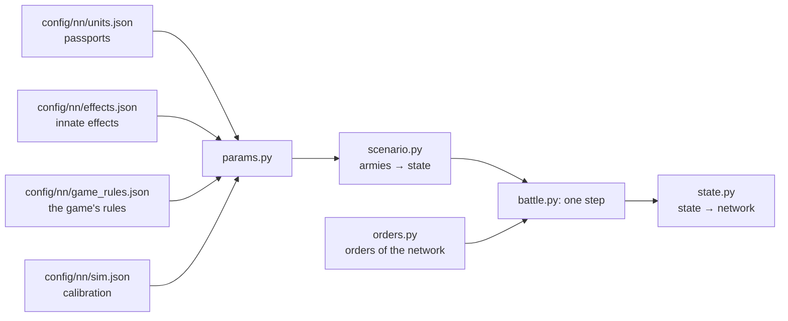

# Battle simulator

[← Back](README.md) · [Documentation](../README.md) › [Data for training](README.md) › Battle simulator · [Русский](../../ru/training/simulator.md)

Step 3 of the path ([network model](network.md)): a simulator of the game's battle in which
the network trains. It plays thousands of battles at once on the GPU. Each unit is one
object (men, health, place, facing, morale, fatigue, projectiles), not every soldier. The
numbers come from the [unit passports](units.md) and the [game's rules](../game/database.md);
where the game behaves differently, they are calibrated to the [measurements](measurements.md).
It covers the units of the training pools on a flat empty map.

## How to run it

```bash
bash tools/nn/dock.sh tools.nn.sim.check                     # all checks against the game (CPU and GPU)
bash tools/nn/dock.sh tools.nn.sim.check --device cuda --only battles
.venv/Scripts/python -m pytest -q tests/tools/test_sim_layout.py   # without torch
```

- The code is `tools/nn/sim/` (PyTorch). It needs torch, which is in the `snake-ai-trainer`
  container; the project's `.venv` has none, so `tests/tools/test_sim.py` is skipped there.
  The image has no pytest: to run the tests there, put a copy of pytest (from `.venv`) on
  `PYTHONPATH` and run `python -m pytest -q tests/tools/test_sim.py`.
- The check writes `build/nn-sim/check.json` (not in Git).

```python
from tools.nn.sim import battle, replay, scenario

st = scenario.build([scenario.from_arena("whole_emp_v_skv", "attack")] * 1024, device="cuda")
battle.run(st, replay.nearest_attack)        # policy(state) -> orders, until every battle ends
st.winner, st.t, st.observation()            # [B], [B], dict of [B, N]
```

## What the simulator holds



**The state** (`tools/nn/sim/state.py`, the one source of truth): tensors `[B, N]` — B battles,
N unit slots of both sides (side 1 in the first half, side 2 in the second, a side's lord
first; `side` = 0 is an empty slot). Three groups:

- *observed* — the same fields and names as a recording's `nn_sample`
  ([what a recording holds](README.md#what-a-recording-holds)): `x`, `z`, `b`, `men`, `hp`,
  `mp`, `ms`, `r`, `s`, `w`, `m`, `mv`, `f`, `a`, `fire`, `target` (the recording's `t`),
  `fat` (the fatigue state 0–5), `k`, `ox`, `oz`, `lf`, `rf`, `bf`, `vis`; the battle time
  is `t` `[B]`. So recorded battles and the simulator feed the network the same way;
- *static* — the passport: men, health, speeds, attack, defence, weapon, armour, shield,
  leadership, projectiles, range, reload, cost; the unit's innate effects (`fx`, a bitmask over
  `config/nn/effects.json`'s order; `fxt0`, `fxt1`: its timed ones) and their rule flags;
- *internal* — what only the simulator needs: morale and fatigue points, timers (of the abilities
  and of the timed effects), `fx_on` (the innate effects on at the step's end).

**Orders** (`tools/nn/sim/orders.py`): per unit and decision step `kind` ∈ hold (0), move (1),
attack (2), withdraw (3), keep (4: no new order, the one in force goes on; a unit with no order
holds); the point `x`, `z` for move and withdraw (the unit's centre); `target` — the enemy's
slot for attack; `run` — run or walk; `ability` — the unit's ability slot to use now (−1 none;
optional: orders made without it get −1; independent of `kind`). All `[B, N]`. A unit in melee
leaves the fight on withdraw, or on a move to a point 10 m or more away (`contact.leave_m`, any
unit): it strikes nobody and is not held in place, while the enemies in contact go on striking
it. As in the game: a melee unit moving away deals ~6 % of its attack rate and takes ~1.7× the
damage ([measurements](measurements.md#leaving-melee)); before, the simulator let a unit under
such a move fight on at full rate, and the network learned to use that. A unit without a missile
weapon standing in melee under hold (no attack order) strikes at `contact.hold_rate` 0.5 of its rate,
every enemy it touches: in the game only such a unit's men in contact fight (the network's units,
matched on own and enemy unit keys: 0.80 of the kills of the same unit attacking; with such a unit
touching 2.3 enemy units in the gate battles, calibrated on the kills). Before, holding in melee
struck at full rate and the network held 76 % of its melee seconds. An ability order fires a ready self-cast ability once (not passive,
not active, recharged); otherwise nothing happens. The network reads the abilities' timers from
`State.observation()` (`ab{k}_on`, `ab{k}_cd` [B, N], s) and the innate effects on now (`fx_on`).

## One step (0.5 s)

1. Take the orders (routing units ignore them).
2. Contacts: the units' rectangles (front × depth of the ranks the men fill) touch.
3. Innate effects (attributes, passives, game-fired timed passives) and cast abilities: their
   stats and rule flags hold for this step.
4. Blows in melee and shots.
5. Health, men, kills.
6. Morale: wavering, rout, rally, shattering.
7. Fatigue.
8. Movement: to the order's point or the target, fleeing for routers; the edge of the map.
9. Is the battle over: a side with no standing unit loses; at 60 minutes the defender wins.

## Mechanics and their sources

"DB" — the game's rules or a passport; "measured" — [measurements](measurements.md) and
recordings; "calibrated" — a number fitted so the simulator repeats the game (all of them are in
`config/nn/sim.json` with the reason).

| Mechanic | How | Source |
|---|---|---|
| Speed | walk, run, acceleration, deceleration of the passport; routing units run at 0.86 of the run (before innate effects: a Skaven rout ×1.1 by Scurry Away!) | DB; the routing speed measured (Empire 0.865; Skaven 0.945 below half health, 0.866 above: [innate effects](#innate-effects)) |
| Formation | front of the ordered width, ranks 1.5 m apart; a lord is a circle of his radius | measured: 120 spearmen, 30 m, 6 ranks |
| Contact | edges within 1 m (2 m more for those already fighting); a unit leaves melee on withdraw or a move 10 m or more away (it strikes nobody, the enemies in contact strike it) | measured: centre distance at the first contact; leaving — the network's runs ([measurements](measurements.md#leaving-melee)) |
| Facing | a moving unit faces where it goes, but a step of less than 10 m to its point goes without turning; a formation in melee turns at most 2° a second (a lord turns at once) | measured: infantry in melee turns 1°/s (median; mean 2.3), a free unit struck in the flank turns 8° in 5 s (median) |
| Order point | the game records the front's centre; the simulator goes to the unit's centre, half a depth behind | measured (spearmen 3.3–4.8 m, slaves 6.5–6.9 m) |
| Men fighting | 0.75 of the files in contact; a unit shares out to each side of its formation (front, left, right, back) no more than that side holds; at most 9 men strike a lord in all, however many units, their rates summed; with the enemy lord on him the infantry at 0.35; a unit attacking another enemy strikes a lord it touches at 0.4; a melee unit under hold at 0.5 | calibrated; hold — on the kills of the network's units in the gate battles (above, "Orders"); per side — measured: a unit already fighting hits a newcomer on its flank 2.2× the rule in the first 15 s (with one shared front the simulator gave 1.2×); 9, the sum — measured ([a lord surrounded](../game/units/lord-swarm.md)); 0.35, 0.4 — whole battles (below, "Lords fought by several units") |
| Hit chance | 35 + 0.1 × (attack − defence), within 8–90 %; defence ×0.6 from the flank, ×0.3 from the rear; the defence lost counts 2.0× the rule from the flank, 0.25× from the rear (against a lord: none, measured) | DB numbers; the weights calibrated (see below and [flanks](#flanks-rear-and-charges-in-whole-battles)) |
| Damage of a hit | armour-piercing + base × (1 − 0.75 × armour/100), no more than a man's health | DB (armour stops a random 50–100 %) |
| Time between blows | `attack_interval_s` of the passport | DB |
| A lord's blow | hits up to `splash` (4) men | DB; agrees with the measured 0.36 kills a second |
| Charge | the charge bonus to attack and damage, fading over 13 s; a unit that meets the enemy running hits ×(1 + 1.5 × its speed share) for those 13 s; one that did not charge brings its men in over 20 s. Bracing: a unit with `charge_reflection` (spearmen, clanrats) standing still (under 0.5 m/s) meets an infantry charge within `bracing_attack_angle` (80°) of its front as a charge of the same speed | DB (13 s, 80°, the attribute); 1.5 fitted to the first 15 s of the whole battles and the pairs, 20 s to the pairs; bracing measured (whole battles: a braced unit charged head-on loses 0.8× what its charger loses) |
| Men lost | blows that do not kill wound: men share = max(1 − g × (1 − health share), health share), g = (hits to kill)^−0.5 | calibrated on men against health in the pairs |
| Shooting | from standing only; first shot 3.3 s (arrows) / 4.3 s (sling) after halting; the men reload all the time (moving too) and every loaded man shoots as soon as the unit can, so the first shot after a halt or a pause is a volley of the whole unit, then a shot per man every 11.0 / 11.5 s (every loaded man starts reloading when the unit fires, also those whose line is blocked); range from the formation's edge | measured |
| Hits | 0.42 arrows, 0.47 sling at the edge of range; ×1.29 at 70 m, ×1.12 at 90 m | measured; the distance factor from the range test |
| Shield, resistance | a shield blocks its chance within 60° of the front; missile resistance of the passport | DB |
| A lord as a target | 0.43 of the unit rule | measured: ~33k shots at lords out of melee for the whole flight (General by arrows ~0.5, by sling ~0.37, Warlord by arrows ~0.32) |
| Friendly fire | of the hits aimed at a unit in melee, 0.26 (arrows) / 0.56 (sling) land on the shooter's own units in contact with it, split by their men (a lord among them ×0.43, as a lone target) | measured: the HP those units lose beyond the melee rule while their own side shoots (1.5k + 1.3k seconds) |
| Spill | of the hits aimed at a unit, each unit of the target's side out of melee takes 0.115 within 30 m, 0.034 at 30–60 m, 0.015 at 60–90 m | measured: HP of units nobody shoots at, next to a unit that is shot (15.6k seconds) |
| Spill in melee | of the hits aimed at a unit in melee, each unit of the target's side also in melee takes 0.19 within 15 m, 0.047 at 15–30 m, 0.035 at 30–60 m (centres) | measured (`build/nn-sim/flank/spill_melee.py`): HP of units in melee, not shot at themselves and whose side does not shoot their opponents, regressed on the melee rule and on the hits aimed at their neighbours in melee (74k seconds, 15k with a shot neighbour; 28 game-AI battles 0.23 / 0.09, net runs 0.19 / 0.05) |
| Target at will | the order's target if in range, else the nearest standing enemy | as the game ([missile damage](../game/units/missile-damage.md)) |
| Line of fire (direct fire) | only for direct (flat) fire, the passport's `missile.direct` (trajectory `low`: the Free Company Militia's pistols); the shooter's men aim at the target's centre, a friendly unit between (nearer than the target's edge) blocks the lines passing through its width across the line, widened by 1.2 man radii (friends count 2.2× wider); blocked men do not shoot; at 75 % blocked the unit takes the next target in range, or holds fire. Arrows and slings arc over friends; enemies in the way do not block; no fire over friends from higher ground (flat map) | DB (`projectile_friendly_fire_man_radius_coefficient` 2.2, `unit_firing_line_of_sight_considered_obstructed_ratio` 0.75, trajectory); the knowledge base ([missiles](../game/mechanics/missiles.md)); the geometry is ours, not measured |
| Fire whilst moving | a unit with `mounted_fire_move` (the militia) aims and shoots while it moves | DB attribute |
| Pistols (estimate) | hit rate 0.5 at the edge of range (×1.12–1.29 at 60–90 m), reload 10.8 s, first shot 3.8 s | estimate from the projectile's calibration area (2.0 m at 65 m against the arrow's 3.7 m at 95 m), not measured: `sim.json` missile.musket_why |
| Morale | points: leadership + effects; MoralePercent = points / leadership; moves 1 point or 15 % of the gap per 0.5 s | DB; the step measured (+2 points a second in every recording) |
| Morale effects | lord +4 within 70 m, fading to 0 at 105 m; lord died or shattered: his aura only (`lord_fall` 0 / 0); neighbour within 120 m +5; casualties −2…−74; recent casualties −6…−80 (last 30 s, of the whole health); winning / losing the melee +3/+6/+8, −3/−8 (damage ratio 1.5 / 2.5 / 4); first struck in the flank −6, rear −14 for one 0.5 s tick; the army beaten as a whole (enemy strength ≥ 2.6× own, own ≤ 0.22 of the start) −120; flanks exposed (an enemy threatens the left, right or rear: `lf`, `rf`, `bf`) −3, two or more −6; routing friends −3 each; routing enemies +2.5 each; under fire −5; very tired −2, exhausted −6; a stronger enemy within 70 m −3 | DB points; window, ratios calibrated; attacked in the flank / rear measured ([flanks](#flanks-rear-and-charges-in-whole-battles)); a lord's fall measured in 75 recorded falls ([lords](#lords)) |
| States | wavering below 16 points, rout at 0, shattered at the third rout, no new rout within 10 s of a rally | DB |
| Rally | while no standing enemy is within 90 m the router regains 2 points a second; rallies at MoralePercent 0.23 | measured: 0.23 and 90 m (365 rallies); 2 points calibrated (median rally 44 s) |
| Fatigue | charge +34, melee +19, shooting +18, running +4, walking −1, standing −7, ×5 a second; states by the database thresholds; each state scales speed, melee attack and defence, armour, charge, AP damage and reload (`unit_fatigue_effects_tables`) | DB; ×5 fitted to 1315 recorded changes of state |
| Lord abilities | the side the game's AI plays (`ai`, side 2 by default) fires its lord's active abilities by a rule; the network's side fires them by order (`Orders.ability`; a side the network plays should have `ai` false); passives are innate effects (below). Every number is the ability's passport (`config/nn/abilities.json`, the database; `sim.json` abilities says which are modelled and the AI's triggers); effects on the owner (phase targets self), his side's units within range (friends) and enemies within range (enemies): speed, charge speed, melee attack and defence, damage, AP, charge bonus, morale. Warlord: Deadly Onslaught (31 s, ready 90 s after: melee damage and AP ×1.25, charge bonus ×1.6) in melee; Verminous Valour (17 s / 60 s: speed ×1.25, +8 morale points; its 25 m blast has no damage) with an enemy within 60 m; Rally (14 s / 60 s: +16 to friends within 35 m) when a friend there wavers. General: Stand Your Ground (18 s / 90 s: melee defence +24, +16 within 35 m) in melee; Foe Seeker (25 s / 60 s: speed ×1.25) with an enemy within 60 m | DB (`config/nn/sim.json` abilities; owned per the game's roster readout); when the AI fires them is an assumption |
| Innate effects | every attribute and passive or game-fired ability of a unit (`config/nn/effects.json`), one mechanism: on while its conditions hold, its stats on the owner (an aura also on friends in range), its rules for the step. Unbreakable (Flagellants: morale never below leadership, never wavers or routs), Expendable (its rout scares nobody), Encourage (the lord's aura), Charge Reflection (bracing), Fire Whilst Moving; Strength in Numbers (Skaven infantry: +6 leadership, +8 melee defence, speed ×0.9 while health ≥ 50 %), Scurry Away! (speed ×1.1 while wavering or routing), Hold the Line! (+5 melee defence, +4 leadership within 35 m of a standing General), Frenzy (+10 melee attack, ×1.1 damage, AP and charge while morale ≥ half of leadership), Strength of the Penitent (fired by the game when losing the melee: 20 s of +14 melee defence, +15 % physical resistance, ends out of melee, ready 3 s after). Schema only (the network sees them): Charge Defence vs. Large, Vanguard Deployment, Hide (forest), Immune to Psychology; left out by `sim.json` effects.off: Single Entity (lords: speed ×0.9, damage ×0.8 below 25 % health; no such speed drop in the recordings) | DB: the passports, `special_ability_to_auto_deactivate_flags`, `special_ability_to_recharge_contexts`; the attributes' rules: the knowledge base; measured: rout and running speeds, the morale drop at 50 % health ([below](#innate-effects)) |
| Map | a square ±1020 m; a routing unit that crosses the edge leaves the battle | measured |
| Visibility | everything is visible (`vis`, kept for later) | a flat empty map |

**Why the hit chance is almost flat.** By the database rule the four pairs would need 13 to 43
men striking at once, and a lord ~38 ([measurements](measurements.md)). With a flat ~35 % the
same losses need 12–17 men on a 30 m front in every pair and ~8 around a lord: one number fits
all. So attack − defence counts at 0.1 of the rule. The flank and rear, which the pairs do not
test, are fitted to the whole battles (below).

## Innate effects

`tools/nn/sim/effects.py`: one mechanism for every attribute and every passive or game-fired
ability of a unit. The catalogue is `config/nn/effects.json` (`python -m tools.nn.effects`, from the
passports; [unit passports](units.md#innate-effects)): per effect its stats, rules, conditions,
timers and whether the simulator acts on it (`modelled`). Nothing in the simulator knows a unit or
an effect by its key.

- **Owned.** `params.static` gives each unit `fx`, a bitmask of the effects the catalogue links to
  it, `fxt0` / `fxt1` (its timed effects) and the rule flags of its unconditional effects.
- **Conditions** (each step, from the state at its start): `in_melee` / `out_of_melee` (in contact
  with a standing enemy), `losing_melee` (in melee and HP taken ≥ 1.5 × dealt recently: the morale
  rule's ratio), `morale_below_half` (points < half of leadership), `not_wavering`, `hp_below_half`
  (< 50 % of the start), `hp_below_quarter`. An effect is on while all its `needs` hold and none of
  its `off_when` does; an attribute always.
- **Timed** (Strength of the Penitent): fires by itself for a standing unit when its `fires_when`
  holds and it is ready, lasts `active_s`, ends at once while an `off_when` holds, ready again
  `recharge_s` after it ends. The ability bar slot holding its ability (`ab{k}_on`, `ab{k}_cd`) shows
  the same timers, so the observation reads it as before.
- **Effects.** While on: multipliers multiply, additions add (melee attack, defence, damage, AP,
  charge, speed and charge speed, morale points, physical resistance to the 90 % cap) on the owner,
  and for an aura (`range_m` > 0, stats on friends: Hold the Line!) on the friends within range of a
  standing owner. Rule flags (`unbreakable`, `expendable`, `encourages`, `reflect`, `fire_move`,
  `fatigue_immune`) hold for the step, read by morale, the aura, bracing, shooting and fatigue. An
  effect lies on a unit that is alive, routing too (Scurry Away! speeds a rout). All of it is undone
  at the step's end, as for the cast abilities and fatigue.
- **`fx_on`** (the network's input): the effects whose conditions hold now, whether the simulator
  acts on them or not (Hide (forest) counts as on: in the game it is). The step acts on the
  conditions at its start; `fx_on` is worked out again on the step's final state (in melee = `m`),
  so the network sees what a recording's fields give at the same moment (a unit that wavers in
  this step shows Scurry Away! now, not a step later).
- **Schema only** (`modelled` false, with the reason in the file): Charge Defence vs. Large (no
  large units in our pools), Vanguard Deployment (placements are the army generator's), Hide
  (forest) (no woods), Immune to Psychology (no fear or terror). `sim.json` effects.off leaves out an
  effect the catalogue could model (a calibration switch with its reason): Single Entity, whose
  "speed ×0.9, damage ×0.8 below 25 % health" (our reading of its recharge context) the recordings
  do not show (lords running out of melee: 0.84–0.85 of their run in every health band). A new effect whose stats, rules
  and conditions the simulator has works without code (a test gives the spearmen Perfect Vigour by
  the catalogue alone).

**Measured** (all fair recordings with unit keys; speed over 1 s steps, at least 3 s
into a rout): routing Empire units run at 0.865 of their run (115k s), routing Skaven at 0.945 below
half health (186k s) and 0.866 above it (14k s); running in order, steady, above half health:
Empire 0.97, Skaven 0.88. Scurry Away!'s ×1.1 and Strength in Numbers' ×0.9 (above half health)
give exactly these ratios, so `morale.rout_speed` is the Empire's 0.86. Crossing 50 % health, Skaven
units drop 2.3 points more morale in the next 3 s than Empire units (7.7 against 5.5 over 1 039 and
951 crossings; at 40 % and 60 % both drop the same): Strength in Numbers' +6 switches off there.
The Skaven's former start bonus (`morale.faction_bonus` +6, fitted) was Strength in Numbers: it is 0
now.

## Flanks, rear and charges in whole battles

Measured in the 28 whole battles (18 mirror, 10 Empire-Skaven), and in the simulator's open-loop
replays of them by the same code (`build/nn-sim/flank/flank.py`, not in Git). A contact: an enemy
standing in melee whose formation edge (the simulator's rectangles at the recorded places,
bearings and men) is within 3 m; its sector is the angle of its centre off the unit's facing
(front within 60°, rear beyond 120°), as the simulator counts it. HP lost is set against the
simulator's frontal melee rule for the same contact.

| Infantry in melee, one contact, not shot at | The game | The simulator |
|---|---:|---:|
| Seconds with the worst contact front / flank / rear | 58 / 31 / 11 % | 72 / 23 / 6 % |
| HP lost from the flank, × from the front (10–90 % over runs) | 1.74 (1.56–1.89) | 1.55 |
| HP lost from the rear, × from the front | 1.31 (1.19–1.42) | 1.50 |
| Morale points while fought from the flank / rear (regression*) | −1.0 / −1.8 | −0.8 / −4.0 |
| … one / two or more of `lf`, `rf`, `bf` set | −3.9 / −8.1 | −4.3 / −7.0 |

\* Points − leadership against health lost (and its square), flank, rear, 2+ contacts, the
exposed flags, under fire; infantry melee seconds (the game 30k, the simulator 97k).

New contacts (infantry i struck by infantry j): HP i loses in the first 15 s over HP j loses.

| | Contacts in the game | The game | The simulator |
|---|---:|---:|---:|
| j charges, i stands, from the front | 102 | 0.82 | 1.44 |
| j charges, i runs at it too | 104 | 0.90 | 0.91 |
| j charges i's flank or rear, i free | 206 | 1.11 | 1.65 |
| j charges i's flank or rear, i already fighting | 24 | 1.30 | 2.22 |
| j walks into i's flank or rear, i already fighting | 77 | 1.23 | 1.34 |
| Morale points of i 15 s after it is charged standing | 102 | −6.5 | −11.3 |

- **In the game a charge buys little.** A unit charged while standing loses no more than its
  charger (0.82); braced spearmen (`charge_reflection`, 87 of the 102) 0.80, units without it
  about the same (1.02, 15 contacts). Hence bracing and a charge impact of 1.5.
- **In the game formations do not turn round in melee** (1°/s): an enemy on the flank or rear
  stays there. The simulator turns a unit in melee at 2°/s.
- **The flank costs more than the rear by this count** (1.74 against 1.31), against the database's
  defence ×0.6 / ×0.3; the simulator is fitted to it (`flank_slope` 2.0, `rear_slope` 0.25).
- **A lone attacker from the flank or rear, counted apart**
  ([measurements](measurements.md#flank-and-rear-a-lone-attacker): infantry only, nobody shooting,
  contacts older than 10 s) takes 1.53× (flank) and 1.92× (rear) of what a lone frontal one takes;
  the simulator gives 0.94× / 0.99× (a flank striker brings men by the target's short side, its
  depth: ~4.5 men for a 30 m front instead of 15). The fix is [pending](#pending-changes).
- **"Attacked in the flank / rear" is small in the recordings**: −1 / −2 points over the contact,
  the database's −6 / −14 being one 0.5 s tick at the first strike from that side (the simulator
  gives it so). "Flanks exposed" is there as in the database: −3.9 / −8.1 against −3 / −6.
- Still stronger than in the game: a charge into the flank or rear (1.65–2.22 against 1.1–1.3), and
  the morale drop after a charge (−11 against −6.5). `lf` / `rf` / `bf` are set 1.3–3× as often as
  the game's flags (the game's are noisy: 0.3–0.7 with an enemy within 60 m on that side).

Tactic scan against `nearest` (the training's scripts, `build/nn-sim/flank/scan.py`: 48 battles
per army, role and side; wins of the tactic; Empire / Skaven = the tactic plays that army in the
Empire-Skaven battle):

| Tactic | Mirror | Empire | Skaven |
|---|---:|---:|---:|
| `nearest` itself | 49 % | 26 % | 82 % |
| all on one target | 32 % | 1 % | 65 % |
| archers stand and shoot | 1 % | 1 % | 88 % |
| the lord waits 2 minutes | 18 % | 1 % | 80 % |
| attack at a walk | 0 % | 0 % | 0 % |
| enemies already engaged first | 32 % | 3 % | 46 % |
| a reserve waits until the enemy is engaged | 3 % | 0 % | 7 % |
| `hold_shoot` | 34 % | 5 % | 70 % |
| **flank**: melee units go for an enemy already fighting ours, via a point beside its flank | **69 %** | 17 % | 79 % |
| flank, with a reserve | 15 % | 1 % | 51 % |

The Skaven win the Empire-Skaven battle (`nearest` against `nearest`: 26 % for the Empire, 82 % for
the Skaven; in the game the Skaven won all 10 recorded ones). Flanking beats `nearest` in the
mirror (69 %). Waiting (a reserve, a walk) loses: the side that waits fights outnumbered.

## Lords

- **Fought by several units** (the [lord swarm probe](../game/units/lord-swarm.md), 3 battles in
  the game). A lord in a ring of 1–4 spear units loses the same HP/s however many units there are
  (General 7.8 / 8.3 / 8.7 / 7.4, Warlord 6.2 / 5.8 / 5.1 / 4.8); 4–5 enemy soldiers stand within
  2.5 m of him; his back and flanks give no extra. So at most `lord_max_attackers` (9) men strike a
  lord in all, summed; `lord_direction` 0; an enemy lord among the attackers keeps his blow; with
  the enemy lord on him the infantry counts at `lord_rival_others` 0.35; a unit told to attack
  another enemy strikes a lord it only touches at `lord_incidental` 0.4 (whole battles: 1.7 HP/s
  against 4.1 when he is its target), and an enemy unit it only touches at `unit_incidental` 0.3 (the
  gate battles: an infantry unit fought by one enemy unit while other enemy units stood within 35 m
  took 19.6 HP/s in the game, 33.9 in the simulator without the rule, 22.3 with it). The probe's
  trials replayed (`python -m tools.nn.lord_swarm --sim`; game / simulator): one spear unit 7.8 /
  7.7 and 6.2 / 6.1; four 7.4 / 8.0 and 4.8 / 6.3; halberds 21.5 / 17.1 and 11.2 / 11.7; the other
  lord and three units 29.8 / 21.8 and 27.6 / 22.4; mean error over the 24 layouts 18 %.
- **Lord against lord** (`contact.lord_v_lord` 0.73): a lord fought by the enemy lord alone loses
  14.6 HP/s (General) and 10.0 (Warlord) in the game, 19.4 / 15.0 in the simulator without the
  factor.
- **A lord's fall** (`morale.lord_fall` 0 / 0: his aura only): in all 75 recorded falls the lord
  shattered with 2–50 % of his health (none was killed), and his standing units lost −3 / −4.7 /
  −4.8 points 2 / 6 / 10 s later (mean of 167 unit-falls) — about his aura. The army's collapse is
  the army-destruction rule's (below), not the lord's.
- **Lord abilities** (`tools/nn/sim/abilities.py`). When the game's AI fires them is assumed, not
  measured (only the Warlord's speed in the recordings, 5–6.5 m/s, shows Verminous Valour in use);
  CA's planner on side 1 of the recorded whole battles gets no actives. The network's side fires
  them by order.
- **Shots at a lord in a crowd.** The game's AI slingers shoot a General fighting among his own
  spearmen, and the misses fall on those spearmen: spill reaches the target's units in melee too
  (the table above). One recorded swarm replayed 8 times: ours lost 12.2k HP (the game 14.7k), the
  Warlord 2.5k (the game 1.6k).

## Checks against the game

`python -m tools.nn.sim.check`: every recorded run is replayed in the simulator from the recorded
start with the recorded orders (open-loop: `tools/nn/sim/replay.py`: a target fought or shot →
attack it; in melee without a recorded target → attack the nearest enemy (CA's planner leaves the
target empty in ~70 % of its melee seconds, the game's AI in ~6 %), while the network's unit holds (the
engine target of its attack orders is recorded in 97 % of their melee seconds, so without one it is
under its hold); otherwise → move to the order's
point), written down once a second like a recording and measured by the same code as the game
(`tools/nn/measure.py`). A pair or shooting replay runs on its last recorded orders until a unit
routs; a whole battle stops when its recording ends and is compared then (if it is not over, the
side with more health left in standing units counts as the winner). Each recorded battle is played
8 times from starts moved by up to 2 m; the simulator's winner is the majority's. A unit in melee
without a recorded target whose recorded point is 10 m or more away moves there (it leaves the
fight) only if that point is a move order in force: the network's units and missile units; the
melee units of CA's planner and of the game's AI fight on. The network's battles against the game's
AI (the gate: generated armies) are reported apart; the attacker of a recorded battle comes from its
manifest's roles (`scenario.attacker_of`).

| Same winner: game-AI battles | network's battles (of them the 8 gate battles of one network) | Mechanics within 20 % | HP lost 60 s after contact, mean \|sim − game\|, network's battles |
|---:|---:|---:|---:|
| 20 of 26 (Empire-Skaven 10 of 10, mirror 10 of 16) | 52 of 93 (7 of 8) | 50 of 54 | 0.048 |

Without the two newest rules (any unit leaves melee on a move ≥ 10 m; the first shot after a halt is
a volley) the network's battles were 44 of 93 (4 of 8): the simulator had let a melee unit under
such a move fight on at full rate, and the network had learned to use that.

### Mechanics: the pairs and shooting

The detail behind the mechanics count (measured before the volley rule; the volley moves the
archers' target's wavering after the first shot to 22 s):

| Case | The game | The simulator |
|---|---|---|
| Spearmen — slaves: fight, s | 232 (208–252) | 260 |
| … slaves lose HP/s / spearmen | 22.7 / 12.4 | 23.3 / 14.1 |
| … slaves waver / rout, s | 195 / 232 | 181 / 260 |
| Spearmen — clanrats: fight, s | 275 (219–353) | 290 |
| … spearmen lose / clanrats HP/s | 25.7 / 20.6 | 22.1 / 19.5 |
| … spearmen waver / rout, s | 251 / 275 | 269 / 290 |
| General — clanrats: fight, s | 348 (340–357) | 335 |
| … the General / clanrats lose HP/s | 8.2 / 21.8 | 6.9 / 22.9 |
| … clanrats waver / rout, s | 254 / 348 | 254 / 335 |
| Warlord — spearmen: fight, s | 309 (264–338) | 264 |
| … the Warlord / spearmen lose HP/s | 5.5 / 21.2 | 5.4 / 25.3 |
| … spearmen waver / rout, s | 277 / 309 | 229 / 264 |
| Winner of each pair | 12 of 12 | 12 of 12 |
| Archers → slaves: reload, s / hit rate / HP/s | 11.0 / 0.42 / 66 | 11.6 / 0.43 / 62 |
| … the first shot after halting, s | 3.3 | 3.7 |
| … the target wavers / routs after the first shot, s | 39 / 71 | 41 / 74 |
| Slingers → spearmen: reload, s / hit rate / HP/s | 11.5 / 0.47 / 36 | 11.5 / 0.47 / 37 |
| … the target wavers / routs, s | 154 / 177 | 160 / 183 |

Outside 20 %: the HP lost in the first 15 s of contact (the charge) — the clanrats against the
General (−28 %) and against the spearmen (−33 %), the Warlord (−22 %): the charge is noisy in the
game too; and in the spearmen–clanrats pair the clanrats waver on the last tick of one replay as
the spearmen rout (their Strength in Numbers' +6 is off below half health; the game's clanrats
reached 13 points there, below the 16 of wavering, without wavering).

### Whole battles

| | The game | The simulator |
|---|---|---|
| Empire HP lost 60 / 120 / 180 s after the first contact | 0.25 / 0.41 / 0.53 | 0.29 / 0.49 / 0.63 |
| Skaven HP lost 60 / 120 / 180 s after the first contact | 0.21 / 0.34 / 0.42 | 0.20 / 0.34 / 0.44 |
| Mirror: HP lost by side 1 / side 2 at the end | 0.74 / 0.75 | 0.83 / 0.72 |
| Routs / rallies a battle | 22.5 / 13.0 | 22.2 / 14.8 |
| A rally takes (median), s | 44 | 44 |
| A battle lasts (mean), s | 613 | 579 (stopped at the recording's end) |

(Measured with the flank rules, before the leave and volley rules.)

**Friendly fire and spill** are why the whole battles cost the Skaven more than the pairs suggest.
Replaying the melee rule on the recorded seconds shows the Skaven infantry in whole battles losing
2–3× what the rule gives, the Empire's about 1×, while in the pairs both ~1×. Skaven infantry in
melee lose 3.2× the rule in the seconds their own slingers shoot at the enemy they fight, 1.5×
otherwise (Empire infantry in the mirror 2.2× and 1.15×); and shots at a unit hit its neighbours
(an infantry unit in a whole battle loses ~1.3× per shot aimed at it what the lone target of the
shooting arena does). With both, the casualty curves of both sides match the game within ~10 %.

### Speed

| Where | Battles at once | Battles a second |
|---|---:|---:|
| GPU, RTX 5070 Ti (`torch.compile`) | 4096 | ~590 |
| CPU in the container (no compile) | 1024 | 8 |

A battle here is the Empire-Skaven battle (40 slots) to its end, 430–620 s of game time. On the GPU
the step is compiled by `torch.compile` (about 10× faster); the container has no C++ compiler for
compiling on the CPU.

## Pending changes

Measured, ready as a switch, not in `config/nn/sim.json`:

- **The flank / rear striker by its own front** (`melee.flank_face` "striker", `flank_slope` 3.8,
  `rear_slope` 5.5; the values in `build/sim-pending/flank.json`, the switch and its test in the
  code, default "min": the old rule). A unit striking through the target's flank brings men by its
  own front, not by the target's depth; the replay then gives 1.62× / 1.94× for a lone flank / rear
  attacker (the game 1.53× / 1.92×). On top of the current rules: game-AI battles 22 → 20 of 26
  (mirror 12 → 10), network's battles 47 → 52 of 93, mechanics 51 → 51, but the HP lost 60 s after
  contact got ~40 % less exact (network's 0.043 → 0.061, game-AI 0.049 → 0.071: the simulator went
  from 0.01 slow to 0.02–0.03 fast), and the `counter` drill stopped holding (its naive play won
  0.66). Left out until the early exchange is fixed with it; the `pincer` drill needs it.

## What is missing

- **The game AI's army routs more often than in the game.** On the 8 battles of gate 20261004-071805 a
  game-AI unit routs 0.92 times in the game, 1.9 in the simulator (both sides replaying the game's
  orders) and 1.65 (against network n3). Not morale: there is no AI morale extra at Normal (AI against
  AI, side 2 holds 0.15–0.2 more morale at equal health and the simulator, with no extra, gives the
  same; on the gate the AI's morale at equal health is the game's: 0.73 / 0.91 against 0.72 / 0.90 at
  health 0.4–0.6 / 0.6–0.8). The excess is health: over the recording the AI loses 0.45 of its health
  in melee against the game's 0.38 (24.5 against 21.3 HP a melee second; CA's planner battles 20.2
  against 22.9) — most one against one with our unit (+77 %) and where its own shooters fire into that
  melee (+30–55 %: friendly fire and spill in melee). And the simulator kills a quarter fewer of our men
  than the game for the same health (more wounded).
- **Units pinned in melee.** A caught missile unit is still in melee 3 s later 75–81% of the time in
  the game; in the sim it walks out in about 2 s. ai_like does not hunt shooters as the game AI does
  (twice as often in the game).
- **The enemy lord breaks too easily.** In the sim it breaks in 97% of these battles (game 25%);
  chasers catch skirmishers 57% of the time (game 32%).
- **Order latency** is 0.6–0.8 s of game time in small battles; the sim uses a fixed 0.36 s.
- **The second Empire wave and the Skaven wave are not checked against the game.** Flagellants,
  Greatswords, Free Company Militia, Skavenslaves, Clanrats with shields and Night Runners use
  their passports and the database's rules; the pistol's hit rate is an estimate; the line of fire
  is our geometry; a blocked unit does not step aside to get a clear shot; an enemy in the way does
  not catch the shots; no accuracy loss while firing on the move. Recordings wanted:
  [units](units.md#flagellants-greatswords-free-company-militia).
- **Lords fall too soon** (network battles: 130–145 s earlier, at 4 % health against the game's
  16 %, in melee 53 % of their time against 45 %: the game's lords break off and shatter with health
  left). In the network's gate runs a lord fought by the enemy lord and one unit loses 20.9 HP/s
  against the game's 13.5: not the infantry, partly missile spill; the rest not found.
- **The army collapse.** In the game a losing army breaks all at once — in 68 of 182 recorded sides
  60 % of the standing units lose 0.4 MoralePercent or rout within 3 s, near the end. The
  database's rule (`ume_concerned_army_destruction` −120 at `army_destruction_enemy_strength_ratio`
  2.6 and `…_alliance_strength_ratio` 0.22) is on, with strength = cost × health of the units not
  shattered; it times 32 of the 68 collapses (median 2 s after the trigger), 36 have no trigger. The
  game's own measure (`bop`, recorded every second now: [measurements](measurements.md#morale-events-and-the-army-collapse))
  is to replace that strength.
- **Morale at contact**: units that run into contact gain ~3 points over the last 6 s in the game
  and lose them fast after; the simulator keeps falling (−2) there. Before contact the simulator's
  units stand 6–10 points lower than the game's (its exposed-flank flags fire 1.5–3× as often: in
  melee `lf` / `rf` / `bf` 0.33 / 0.34 / 0.25 against 0.22 / 0.25 / 0.09; no simple
  distance-and-sector rule fits the game's flags, F1 ≤ 0.46).
- **The mirror battles**: in the game the defender wins 15 of 16; the simulator gets 10 of 16. Its
  side 1 (CA's planner) loses too much: its archers get caught in melee for 70 s a battle (21 s in
  the game).
- **Fights break off in the game, not in the simulator.** In whole battles a unit in melee leaves it
  (for 4 s or more, both standing) 0.013 times a second (infantry), 0.030 (lords), 0.033 (missile
  units); melee spells are short (median 17 s, the General's 9 s; in the simulator 21–112 s). In the
  one-against-one pairs it almost never happens. A move order is not the cause for infantry (0.013
  against 0.011 a second for those told to stay); what triggers it is not known.
- **Simulated battles end later**: 54–72 % are not over when their recording ends.
- **Replay is open-loop**: the recorded orders do not react to a battle that went differently.
- **Fatigue** matches the recorded state exactly in 43 % of the samples (off by 0.86 of a state on
  average); its effects come from the database (`unit_fatigue_effects_tables`).
- **Not modelled**: terrain, a turn rate out of melee (a moving unit faces where it goes at once),
  cavalry, monsters, magic, flying, artillery, experience ranks, the scaled "strong enemy near"
  (only −3: its combat power is not in the data), the database's rally timer (meaning unclear).
- `vis` is always true: line of sight is not modelled.

## Tried and rejected

| What | Result | Why not |
|---|---|---|
| The flank / rear striker by its own front (pending, above) | the lone flank / rear attacker right (1.62× / 1.94×), network's winners 47 → 52 of 93 | the early exchange ~40 % less exact (0.043 → 0.061), game-AI winners 22 → 20, the `counter` drill broken |
| A break-off at the measured rates, with the database's 10 s immunity (`melee_breakoff_total_immunity_secs`) | fights in the pairs twice as long | broke the pairs, did not help the mirror; the trigger is unknown |
| The database's 4 s recent and 60 s extended casualty windows | 4 s: the archers' target wavered 90 % late, the slingers' never; 30 s + 60 s: the pairs wavered too early | the calibrated single 30 s window stays |
| The charge's +15 morale (DB `charge_bonus` 15 / `charge_timeout` 60) | after 3343 recorded charges morale over the next 1–4 s falls as after 1500 contacts met standing | no +15 shows in the game |
| The database's hit slope 1, flank ×0.6 / rear ×0.3, sectors 45° / 135°, spacing 1.8 m, bracing ×2 | worse against the pairs and the whole battles | the measured numbers kept (slope 0.1: the pairs need one flat number; flank 2.0 / rear 0.25; 60° / 120°; 1.5 m) |
| The database's lord-fall morale (−16, then −10 to every unit) | the simulator routed 39 % of the army within 10 s of a fall (the game 21 %); the game's units lose −3 to −4.8 points | the fall is only the aura (`lord_fall` 0 / 0) |
| A continuous "attacked in the flank / rear" −1 / −2 | the recordings show a 1–2 s drop of 1.5 / 1.9 points | one 0.5 s tick of the database's −6 / −14 at the first strike |
| A charge impact of 2.5 and instant turning in melee | a unit charged standing lost 2.7× its charger (the game 0.82), a flank attack on a free unit lasted one step | everything left standing when charged lost; now 1.5, bracing and 2°/s |
| The lord rule "the strongest attacker's rate + 0.35 of the others'" (inferred from unit totals) | the lord, a lord and three units took half of what the lord alone took | the measured 9-men cap |
| A Skaven start morale bonus (`faction_bonus` +6, fitted) | it was Strength in Numbers in disguise (Skaven drop 2.3 points more crossing 50 % health) | the effect models it; the bonus is 0 |
| Single Entity's "speed ×0.9, damage ×0.8 below 25 % health" | lords running out of melee keep 0.84–0.85 of their run in every health band | left out (`effects.off`) |
| A lord as a target at 0.9 of the unit rule | its 2-second loss windows overlapped and counted each loss twice | 0.43 over ~33k shots |
| Leaving melee for missile units only | network units under a move away fought on at full rate (the game: ~6 % of the attack rate) | `contact.leave_m` 10 m for every unit |
| Hold in melee at the measured 0.75 (one against one: 0.66–0.80) | n3 against ai_like on the 8 gate battles +0.19 → +0.07 (the game −0.27), but held units still killed 0.26–0.27 a second against the game's 0.17 (they touch 2.3 enemies and strike each), both sides replayed −0.100 → −0.065 | 0.5: kills 0.18, n3 −0.08, replay −0.089 (same winner 7 of 8 in both) |

## Surprises

- A lord loses ~0.43 of the unit rule (his armour, shield, resistance) per projectile aimed at
  him while he is out of melee for the whole flight (~33k shots).
- Missile units hurt their own side: of the hits aimed at an enemy fighting their own infantry,
  0.26 (arrows) and 0.56 (sling) land on their own men. The Skaven slingers shooting over their
  line are why the Skaven lose more in the whole battles than the pairs suggest.
- The arena's close-range damage per arrow (~25 HP at 34 m) is more than an arrow's whole
  damage (19): melee losses are mixed in; the simulator takes the distance factor from the range
  test instead.
- Routing units run slower than their run: the Empire's 0.80–0.86, the Skaven's 0.85–0.96.
