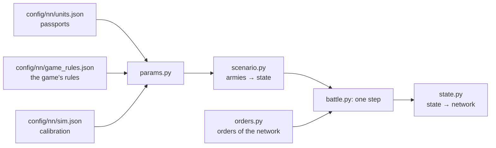

# Battle simulator

[← Back](README.md) · [Documentation](../README.md) › [Data for training](README.md) › Battle simulator · [Русский](../../ru/training/simulator.md)

Step 3 of the path ([network model](network.md)): a simulator of the game's battle in which
the network will train. It plays thousands of battles at once on the GPU. Each unit is one
object (men, health, place, facing, morale, fatigue, projectiles), not every soldier. The
numbers come from the [unit passports](units.md) and the [game's rules](../game/database.md);
where the game behaves differently, they are calibrated to the [measurements](measurements.md).
Version 1, 30.09.2026: the seven v1 units, a flat empty map.

## How to run it

```bash
bash tools/nn/dock.sh tools.nn.sim.check                     # all checks against the game (CPU and GPU)
bash tools/nn/dock.sh tools.nn.sim.check --device cuda --only battles
.venv/Scripts/python -m pytest -q tests/tools/test_sim_layout.py   # without torch
```

- The code is `tools/nn/sim/` (PyTorch). It needs torch, which is in the `snake-ai-trainer`
  container; the project's `.venv` has none, so `tests/tools/test_sim.py` is skipped there.
  The image has no pytest: to run the tests there, put a copy of pytest (from `.venv`) on
  `PYTHONPATH` and run `python -m pytest -q tests/tools/test_sim.py`.
- The check writes `build/nn-sim/check.json` (not in Git).

```python
from tools.nn.sim import battle, replay, scenario

st = scenario.build([scenario.from_arena("whole_emp_v_skv", "attack")] * 1024, device="cuda")
battle.run(st, replay.nearest_attack)        # policy(state) -> orders, until every battle ends
st.winner, st.t, st.observation()            # [B], [B], dict of [B, N]
```

## What the simulator holds



**The state** (`tools/nn/sim/state.py`, the one source of truth): tensors `[B, N]` — B battles,
N unit slots of both sides (side 1 in the first half, side 2 in the second, a side's lord
first; `side` = 0 is an empty slot). Three groups:

- *observed* — the same fields and names as a recording's `nn_sample`
  ([what a recording holds](README.md#what-a-recording-holds)): `x`, `z`, `b`, `men`, `hp`,
  `mp`, `ms`, `r`, `s`, `w`, `m`, `mv`, `f`, `a`, `fire`, `target` (the recording's `t`),
  `fat` (the fatigue state 0–5), `k`, `ox`, `oz`, `lf`, `rf`, `bf`, `vis`; the battle time
  is `t` `[B]`. So recorded battles and the simulator feed the network the same way;
- *static* — the passport: men, health, speeds, attack, defence, weapon, armour, shield,
  leadership, projectiles, range, reload, cost;
- *internal* — what only the simulator needs: morale and fatigue points, timers.

**Orders** (`tools/nn/sim/orders.py`): per unit and decision step `kind` ∈ hold (0), move (1),
attack (2), withdraw (3), keep (4: no new order, the one in force goes on; a unit with no order
holds); the point `x`, `z` for move and withdraw (the unit's centre); `target` — the enemy's
slot for attack; `run` — run or walk; `ability` — the unit's ability slot to use now (−1 none;
optional: orders made without it get −1; independent of `kind`). All `[B, N]`. A move order to a
unit in melee does not take it out: that is what withdraw is for (it breaks off, and the enemies
in contact strike its back). An ability order fires a ready self-cast ability once (not passive,
not active, recharged); otherwise nothing happens. The network reads the abilities' timers from
`State.observation()` (`ab{k}_on`, `ab{k}_cd` [B, N], s).

## One step (0.5 s)

1. Take the orders (routing units ignore them).
2. Contacts: the units' rectangles (front × depth of the ranks the men fill) touch.
3. Blows in melee and shots.
4. Health, men, kills.
5. Morale: wavering, rout, rally, shattering.
6. Fatigue.
7. Movement: to the order's point or the target, fleeing for routers; the edge of the map.
8. Is the battle over: a side with no standing unit loses; at 60 minutes the defender wins.

## Mechanics and their sources

"DB" — the game's rules or a passport; "measured" — [measurements](measurements.md) and
recordings; "calibrated" — a number fitted so the simulator repeats the game (all of them are in
`config/nn/sim.json` with the reason).

| Mechanic | How | Source |
|---|---|---|
| Speed | walk, run, acceleration, deceleration of the passport; routing units run at 0.9 of the run | DB; the routing speed measured (median 0.80–0.96) |
| Formation | front of the ordered width, ranks 1.5 m apart; a lord is a circle of his radius | measured: 120 spearmen, 30 m, 6 ranks |
| Contact | edges within 1 m (2 m more for those already fighting) | measured: centre distance at the first contact |
| Facing | a moving unit faces where it goes, but a step of less than 10 m to its point goes without turning; a formation in melee turns at most 2° a second (a lord turns at once) | measured: infantry in melee turns 1°/s (median; mean 2.3), a free unit struck in the flank turns 8° in 5 s (median) |
| Order point | the game records the front's centre; the simulator goes to the unit's centre, half a depth behind | measured (spearmen 3.3–4.8 m, slaves 6.5–6.9 m) |
| Men fighting | 0.75 of the files in contact; a unit shares out to each side of its formation (front, left, right, back) no more than that side holds; at most 9 men strike a lord in all, however many units, their rates summed; with the enemy lord on him the infantry at 0.35; a unit attacking another enemy strikes a lord it touches at 0.4 | calibrated; per side — measured: a unit already fighting hits a newcomer on its flank 2.2× the rule in the first 15 s (with one shared front the simulator gave 1.2×); 9, the sum — measured ([a lord surrounded](../game/units/lord-swarm.md)); 0.35, 0.4 — whole battles (below, "Lords fought by several units") |
| Hit chance | 35 + 0.1 × (attack − defence), within 8–90 %; defence ×0.6 from the flank, ×0.3 from the rear; the defence lost counts 2.0× the rule from the flank, 0.25× from the rear (against a lord: none, measured) | DB numbers; the weights calibrated (see below and [flanks](#flanks-rear-and-charges-in-whole-battles)) |
| Damage of a hit | armour-piercing + base × (1 − 0.75 × armour/100), no more than a man's health | DB (armour stops a random 50–100 %) |
| Time between blows | `attack_interval_s` of the passport | DB |
| A lord's blow | hits up to `splash` (4) men | DB; agrees with the measured 0.36 kills a second |
| Charge | the charge bonus to attack and damage, fading over 13 s; a unit that meets the enemy running hits ×(1 + 1.5 × its speed share) for those 13 s; one that did not charge brings its men in over 20 s. Bracing: a unit with `charge_reflection` (spearmen, clanrats) standing still (under 0.5 m/s) meets an infantry charge within `bracing_attack_angle` (80°) of its front as a charge of the same speed | DB (13 s, 80°, the attribute); 1.5 fitted to the first 15 s of the whole battles and the pairs, 20 s to the pairs; bracing measured (whole battles: a braced unit charged head-on loses 0.8× what its charger loses) |
| Men lost | blows that do not kill wound: men share = max(1 − g × (1 − health share), health share), g = (hits to kill)^−0.5 | calibrated on men against health in the pairs |
| Shooting | from standing only; first shot 3.3 s (arrows) / 4.3 s (sling) after halting; a shot per man every 11.0 / 11.5 s; range from the formation's edge | measured |
| Hits | 0.42 arrows, 0.47 sling at the edge of range; ×1.29 at 70 m, ×1.12 at 90 m | measured; the distance factor from the range test |
| Shield, resistance | a shield blocks its chance within 60° of the front; missile resistance of the passport | DB |
| A lord as a target | 0.43 of the unit rule | measured: ~33k shots at lords out of melee for the whole flight (General by arrows ~0.5, by sling ~0.37, Warlord by arrows ~0.32) |
| Friendly fire | of the hits aimed at a unit in melee, 0.26 (arrows) / 0.56 (sling) land on the shooter's own units in contact with it, split by their men (a lord among them ×0.43, as a lone target) | measured: the HP those units lose beyond the melee rule while their own side shoots (1.5k + 1.3k seconds) |
| Spill | of the hits aimed at a unit, each unit of the target's side out of melee takes 0.115 within 30 m, 0.034 at 30–60 m, 0.015 at 60–90 m | measured: HP of units nobody shoots at, next to a unit that is shot (15.6k seconds) |
| Spill in melee | of the hits aimed at a unit in melee, each unit of the target's side also in melee takes 0.19 within 15 m, 0.047 at 15–30 m, 0.035 at 30–60 m (centres) | measured (01.10.2026, `build/nn-sim/flank/spill_melee.py`): HP of units in melee, not shot at themselves and whose side does not shoot their opponents, regressed on the melee rule and on the hits aimed at their neighbours in melee (74k seconds, 15k with a shot neighbour; 28 game-AI battles 0.23 / 0.09, net runs 0.19 / 0.05) |
| Target at will | the order's target if in range, else the nearest standing enemy | as the game ([missile damage](../game/units/missile-damage.md)) |
| Line of fire (direct fire) | only for direct (flat) fire, the passport's `missile.direct` (trajectory `low`: the Free Company Militia's pistols); the shooter's men aim at the target's centre, a friendly unit between (nearer than the target's edge) blocks the lines passing through its width across the line, widened by 1.2 man radii (friends count 2.2× wider); blocked men do not shoot; at 75 % blocked the unit takes the next target in range, or holds fire. Arrows and slings arc over friends; enemies in the way do not block; no fire over friends from higher ground (flat map) | DB (`projectile_friendly_fire_man_radius_coefficient` 2.2, `unit_firing_line_of_sight_considered_obstructed_ratio` 0.75, trajectory); the knowledge base ([missiles](../game/mechanics/missiles.md)); the geometry is ours, not measured |
| Fire whilst moving | a unit with `mounted_fire_move` (the militia) aims and shoots while it moves | DB attribute |
| Pistols (estimate) | hit rate 0.5 at the edge of range (×1.12–1.29 at 60–90 m), reload 10.8 s, first shot 3.8 s | estimate from the projectile's calibration area (2.0 m at 65 m against the arrow's 3.7 m at 95 m), not measured: `sim.json` missile.musket_why |
| Morale | points: leadership + effects; MoralePercent = points / leadership; moves 1 point or 15 % of the gap per 0.5 s | DB; the step measured (+2 points a second in every recording) |
| Morale effects | lord +4 within 70 m, fading to 0 at 105 m; lord died or shattered: his aura only (`lord_fall` 0 / 0); neighbour within 120 m +5; casualties −2…−74; recent casualties −6…−80 (last 30 s, of the whole health); winning / losing the melee +3/+6/+8, −3/−8 (damage ratio 1.5 / 2.5 / 4); first struck in the flank −6, rear −14 for one 0.5 s tick; the army beaten as a whole (enemy strength ≥ 2.6× own, own ≤ 0.22 of the start) −120; flanks exposed (an enemy threatens the left, right or rear: `lf`, `rf`, `bf`) −3, two or more −6; routing friends −3 each; routing enemies +2.5 each; under fire −5; very tired −2, exhausted −6; a stronger enemy within 70 m −3 | DB points; window, ratios calibrated; attacked in the flank / rear measured ([flanks](#flanks-rear-and-charges-in-whole-battles)); a shattered lord counts as lost: in the game his whole army drops 0.5–0.6 of its leadership in the second he shatters and routs within ~3 s (gate battles 02.10.2026) |
| Faction | Skaven +6 points at the start | measured: before contact they stand 6 higher than the Empire in the same place |
| States | wavering below 16 points, rout at 0, shattered at the third rout, no new rout within 10 s of a rally | DB |
| Unbreakable | a unit with `unbreakable` (Flagellants) never loses leadership: its points stay at leadership or above, it never wavers or routs (also not on army destruction) | DB attribute; the knowledge base ([abilities](../game/mechanics/abilities.md), [morale](../game/mechanics/morale.md)) |
| Rally | while no standing enemy is within 90 m the router regains 2 points a second; rallies at MoralePercent 0.23 | measured: 0.23 and 90 m (365 rallies); 2 points calibrated (median rally 44 s) |
| Fatigue | charge +34, melee +19, shooting +18, running +4, walking −1, standing −7, ×5 a second; states by the database thresholds; each state scales speed, melee attack and defence, armour, charge, AP damage and reload (`unit_fatigue_effects_tables`) | DB; ×5 fitted to 1315 recorded changes of state |
| Lord abilities | the side the game's AI plays (`ai`, side 2 by default) fires its lord's active abilities by a rule; the network's side fires them by order (`Orders.ability`; a side the network plays should have `ai` false); passives work for both. Every number is the ability's passport (`config/nn/abilities.json`, the database; `sim.json` abilities says which are modelled and the AI's triggers); effects on the owner (phase targets self), his side's units within range (friends) and enemies within range (enemies): speed, charge speed, melee attack and defence, damage, AP, charge bonus, morale. Warlord: Deadly Onslaught (31 s, ready 90 s after: melee damage and AP ×1.25, charge bonus ×1.6) in melee; Verminous Valour (17 s / 60 s: speed ×1.25, +8 morale points; its 25 m blast has no damage) with an enemy within 60 m; Rally (14 s / 60 s: +16 to friends within 35 m) when a friend there wavers. General: Stand Your Ground (18 s / 90 s: melee defence +24, +16 within 35 m) in melee; Foe Seeker (25 s / 60 s: speed ×1.25) with an enemy within 60 m; Hold the Line, passive (defence +5, +4 within 35 m) | DB (`config/nn/sim.json` abilities; owned per the game's roster readout); when the AI fires them is an assumption |
| Unit abilities the game fires itself | Flagellants: Frenzy, passive (+10 melee attack, ×1.1 damage, AP and charge), off while morale is below half of leadership (never for unbreakable men); Strength of the Penitent, a timed passive the game fires by itself for either side when the unit is in melee and losing it (HP taken ≥ 1.5 × dealt, the morale rule's ratio): 20 s of +14 melee defence and +15 % physical resistance, ends out of melee, ready 3 s after. Never ordered by the network (`self_cast` false); the network sees `auto`, its context and switch-off in the ability passport | DB: `special_ability_to_recharge_contexts` (losing_melee_combat), `special_ability_to_auto_deactivate_flags` (out_of_melee; morale_is_lower_than_half_of_base_morale), the phases' effects; 'losing' as the morale rule's 1.5 is ours |
| Map | a square ±1020 m; a routing unit that crosses the edge leaves the battle | measured |
| Visibility | everything is visible (`vis`, kept for later) | a flat empty map |

**Why the hit chance is almost flat.** By the database rule the four pairs would need 13 to 43
men striking at once, and a lord ~38 ([measurements](measurements.md)). With a flat ~35 % the
same losses need 12–17 men on a 30 m front in every pair and ~8 around a lord: one number fits
all. So attack − defence counts at 0.1 of the rule. The flank and rear, which the pairs do not
test, are fitted to the whole battles (below).

## Flanks, rear and charges in whole battles

Measured 01.10.2026 in the 28 whole battles (18 mirror, 10 Empire-Skaven), and in the
simulator's open-loop replays of them by the same code (`build/nn-sim/flank/flank.py`, not in
Git). A contact: an enemy standing in melee whose formation edge (the simulator's rectangles at
the recorded places, bearings and men) is within 3 m; its sector is the angle of its centre off
the unit's facing (front within 60°, rear beyond 120°), as the simulator counts it. HP lost is
set against the simulator's frontal melee rule for the same contact.

| Infantry in melee, one contact, not shot at | The game | Simulator before | Now |
|---|---:|---:|---:|
| Seconds with the worst contact front / flank / rear | 58 / 31 / 11 % | 78 / 18 / 4 % | 72 / 23 / 6 % |
| HP lost from the flank, × from the front (10–90 % over runs) | 1.74 (1.56–1.89) | 1.20 | 1.55 |
| HP lost from the rear, × from the front | 1.31 (1.19–1.42) | 2.04 | 1.50 |
| Morale points while fought from the flank / rear (regression*) | −1.0 / −1.8 | −1.0 / −14.5 | −0.8 / −4.0 |
| … one / two or more of `lf`, `rf`, `bf` set | −3.9 / −8.1 | — | −4.3 / −7.0 |

\* Points − leadership against health lost (and its square), flank, rear, 2+ contacts, the
exposed flags, under fire; infantry melee seconds (the game 30k, the simulator 97k).

New contacts (infantry i struck by infantry j): HP i loses in the first 15 s over HP j loses.

| | Contacts in the game | The game | Before | Now |
|---|---:|---:|---:|---:|
| j charges, i stands, from the front | 102 | 0.82 | 2.69 | 1.44 |
| j charges, i runs at it too | 104 | 0.90 | 0.98 | 0.91 |
| j charges i's flank or rear, i free | 206 | 1.11 | 2.65 | 1.65 |
| j charges i's flank or rear, i already fighting | 24 | 1.30 | 3.30 | 2.22 |
| j walks into i's flank or rear, i already fighting | 77 | 1.23 | 2.00 | 1.34 |
| Morale points of i 15 s after it is charged standing | 102 | −6.5 | −17.5 | −11.3 |

- **In the game a charge buys little.** A unit charged while standing loses no more than its
  charger (0.82); braced spearmen (`charge_reflection`, 87 of the 102) 0.80, units without it
  about the same (1.02, 15 contacts). The simulator gave the charger 2.7×, which is why in it
  every unit left standing when charged lost. Now: bracing, and the charge's impact 1.5 instead
  of 2.5 (the pairs keep within 20 %: 51 of 54).
- **In the game formations do not turn round in melee** (1°/s): an enemy on the flank or rear
  stays there. In the simulator a unit turned to its nearest opponent at once, so a flank attack
  on a free unit lasted one step. Now it turns at 2°/s in melee.
- **The flank costs more than the rear by this count** (1.74 against 1.31), against the
  database's defence ×0.6 / ×0.3. The rear seconds are probably often a lagging recorded
  bearing; the simulator is fitted to the measured numbers (flank_slope 2.0, rear_slope 0.25).
- **"Attacked in the flank / rear" is small in the recordings**: −1 / −2 points, not the
  database's −6 / −14 (the simulator with the database's points shows −14.5 for the rear).
  "Flanks exposed" is there as in the database: −3.9 / −8.1 against −3 / −6.
- Still stronger than in the game: a charge into the flank or rear (1.65–2.22 against 1.1–1.3),
  and the morale drop after a charge (−11 against −6.5). `lf` / `rf` / `bf` are set 1.3–3× as
  often as the game's flags (the game's are noisy: 0.3–0.7 with an enemy within 60 m on that side).

Tactic scan against `nearest` (the training's scripts, `build/nn-sim/flank/scan.py`: 48 battles
per army, role and side; wins of the tactic; Empire / Skaven = the tactic plays that army in the
Empire-Skaven battle):

| Tactic | Mirror: before / now | Empire: before / now | Skaven: before / now |
|---|---:|---:|---:|
| `nearest` itself | 47 / 49 % | 60 / 26 % | 58 / 82 % |
| all on one target | 47 / 32 % | 5 / 1 % | 43 / 65 % |
| archers stand and shoot | 0 / 1 % | 1 / 1 % | 77 / 88 % |
| the lord waits 2 minutes | 11 / 18 % | 3 / 1 % | 80 / 80 % |
| attack at a walk | 0 / 0 % | 0 / 0 % | 0 / 0 % |
| enemies already engaged first | 36 / 32 % | 17 / 3 % | 24 / 46 % |
| a reserve waits until the enemy is engaged | 6 / 3 % | 0 / 0 % | 1 / 7 % |
| `hold_shoot` | 19 / 34 % | 3 / 5 % | 48 / 70 % |
| **flank**: melee units go for an enemy already fighting ours, via a point beside its flank | **61 / 69 %** | 27 / 17 % | 32 / 79 % |
| flank, with a reserve | 6 / 15 % | 0 / 1 % | 18 / 51 % |

Now the Skaven win the Empire-Skaven battle (`nearest` against `nearest`: 26 % for the Empire,
82 % for the Skaven; in the game the Skaven won all 10 recorded ones). Flanking beats `nearest`
in the mirror (69 %) and is no longer punished on the other armies (Skaven 79 % against
`nearest`'s own 82 %; before 32 % against 58 %). Waiting (a reserve, a walk) still loses: the
side that waits fights outnumbered.

## Checks against the game

`python -m tools.nn.sim.check`: every recorded run is replayed in the simulator from the
recorded start with the recorded orders (open-loop: `tools/nn/sim/replay.py`: a target fought
or shot → attack it; in melee without a recorded target → attack the nearest enemy (CA's planner
leaves the target empty in ~70 % of its melee seconds, the game's AI in ~6 %); otherwise → move
to the order's point), written down once a second like a recording and measured by the same code
as the game (`tools/nn/measure.py`). Only the battles of CA's planner against the game's AI
count (not the network's own runs). A pair or shooting replay runs on its last recorded orders
until a unit routs; a whole battle stops when its recording ends and is compared then (if it
is not over, the side with more health left in standing units counts as the winner). Results of
30.09.2026 (third version, the same night):

### Mechanics: 51 of 54 numbers within 20 %

| Case | The game | The simulator |
|---|---|---|
| Spearmen — slaves: fight, s | 232 (208–252) | 260 |
| … slaves lose HP/s / spearmen | 22.7 / 12.4 | 23.3 / 14.1 |
| … slaves waver / rout, s | 195 / 232 | 181 / 260 |
| Spearmen — clanrats: fight, s | 275 (219–353) | 290 |
| … spearmen lose / clanrats HP/s | 25.7 / 20.6 | 22.1 / 19.5 |
| … spearmen waver / rout, s | 251 / 275 | 269 / 290 |
| General — clanrats: fight, s | 348 (340–357) | 335 |
| … the General / clanrats lose HP/s | 8.2 / 21.8 | 6.9 / 22.9 |
| … clanrats waver / rout, s | 254 / 348 | 254 / 335 |
| Warlord — spearmen: fight, s | 309 (264–338) | 264 |
| … the Warlord / spearmen lose HP/s | 5.5 / 21.2 | 5.4 / 25.3 |
| … spearmen waver / rout, s | 277 / 309 | 229 / 264 |
| Winner of each pair | 12 of 12 | 12 of 12 |
| Archers → slaves: reload, s / hit rate / HP/s | 11.0 / 0.42 / 66 | 11.6 / 0.43 / 62 |
| … the first shot after halting, s | 3.3 | 3.7 |
| … the target wavers / routs after the first shot, s | 39 / 71 | 41 / 74 |
| Slingers → spearmen: reload, s / hit rate / HP/s | 11.5 / 0.47 / 36 | 11.5 / 0.47 / 37 |
| … the target wavers / routs, s | 154 / 177 | 160 / 183 |

Outside 20 % (01.10.2026, with the flanks, bracing and turning): the HP lost in the first 15 s
of contact (the charge) in three places: the clanrats against the General (−28 %) and against
the spearmen (−33 %), the Warlord (−22 %) — the charge is noisy in the game too (before: four
places, −28 %… +107 %).

### Whole battles: the same winner in 18 of 26 (69 %)

| | Battles decided | Same winner: v1 | v2 (friendly fire, spill) | v3 (stop at the recording's end) | now (flanks) |
|---|---:|---:|---:|---:|---:|
| Empire against Skaven | 10 | 10 | 9 | 8 | 8 |
| Mirror arena (Empire against Empire) | 16 | 11 | 8 | 9 | 10 |

Each recorded battle is played 8 times from starts moved by up to 2 m; the simulator's winner
is the majority's. Two mirror runs ended on our 900 s limit without a winner and are not counted.

| | The game | v1 | v2 | v3 | now |
|---|---|---|---|---|---|
| Empire HP lost 60 / 120 / 180 s after the first contact | 0.25 / 0.41 / 0.53 | 0.27 / 0.48 / 0.61 | 0.27 / 0.45 / 0.58 | 0.27 / 0.45 / 0.58 | 0.29 / 0.49 / 0.63 |
| Skaven HP lost 60 / 120 / 180 s after the first contact | 0.21 / 0.34 / 0.42 | 0.14 / 0.23 / 0.29 | 0.19 / 0.32 / 0.41 | 0.19 / 0.32 / 0.41 | 0.20 / 0.34 / 0.44 |
| Mirror: HP lost by side 1 / side 2 at the end | 0.74 / 0.75 | 0.85 / 0.73 | 0.88 / 0.76 | 0.81 / 0.68 | 0.83 / 0.72 |
| Routs / rallies a battle | 22.5 / 13.0 | 24.4 / 15.5 | 29.2 / 18.8 | 21.7 / 14.6 | 22.2 / 14.8 |
| A rally takes (median), s | 44 | 47 | 44 | 47 | 44 |
| A battle lasts (mean), s | 613 | 716 | 737 | 590 (stopped at the recording's end) | 579 |
| Not over when the recording ends | — | — | — | 80 % | 72 % |

**Why v1 leaned to the Skaven.** Replaying the melee rule on the recorded seconds (the recorded
places, men and contacts) shows that in the whole battles the Skaven infantry lost 2–3× what the
rule gives, the Empire's about 1×, while in the pairs both ~1×. Two missile effects the pairs do
not have explain it: *friendly fire* — Skaven infantry in melee lose 3.2× the rule in the seconds
their own slingers shoot at the enemy they fight, 1.5× otherwise (Empire infantry in the mirror
2.2× and 1.15×); and *spill* — shots at a unit hit its neighbours (an infantry unit in a whole
battle loses ~1.3× per shot aimed at it what the lone target of the shooting arena does). With
both, the casualty curves of both sides match the game within ~10 %. The mirror battles did not
get better (see "What is missing").

**The network's battles against the game's AI** (the gate: generated armies, `own_ai` "net"),
both sides' recorded orders replayed, are reported apart: the same winner in 4 of 6
(01.10.2026). The attacker of a recorded battle comes from its manifest's roles
(`scenario.attacker_of`); a run the network played had side 2 as the attacker before.

### Speed

| Where | Battles at once | Battles a second |
|---|---:|---:|
| GPU, RTX 5070 Ti (`torch.compile`) | 4096 | ~900 (v1 without friendly fire and spill: 1200–1560) |
| CPU in the container (no compile) | 1024 | 8 |

A battle here is the Empire-Skaven battle (40 slots) to its end, 430–620 s of game time. On
the GPU the step is compiled by `torch.compile` (about 10× faster); the container has no C++
compiler for compiling on the CPU.

## What is missing

- **The second Empire wave (02.10.2026) is not checked against the game yet.** Flagellants,
  Greatswords and Free Company Militia use their passports and the database's rules; the pistol's
  hit rate is an estimate; the line of fire is our geometry (aim at the target's centre, friends as
  rectangles); a blocked unit does not step aside to get a clear shot; an enemy in the way does
  not catch the shots; no accuracy loss while firing on the move. Recordings wanted:
  [units](units.md#flagellants-greatswords-free-company-militia).
- **Task 20: the knowledge-base conflicts, fixed as one set (02.10.2026)** (`build/simacc/kb_eval.py`,
  `kb_events.py`, `kb_lords.py`, `collapse.py`, `fat_db.py`; [conflicts](../game/mechanics/README.md#conflicts-with-our-simulator)).
  Each conflict was checked against the database (`db.pack`) and the recordings (26 decided
  game-AI battles, 71 network battles), then the set was evaluated together (8 replays a battle,
  majority winner):

  | | All off (before) | The set (now) |
  |---|---:|---:|
  | Same winner, game-AI battles | 20 of 26 | 18 of 26 |
  | Same winner, network battles | 43 of 71 | 43 of 71 |
  | Pairs and shooting within 20 % | 51 of 54 (mean error 8.8 %) | 51 of 54 (8.7 %) |
  | HP-lost curve error 60/120/180 s, game-AI / network | 0.063 / 0.088 | 0.058 / 0.088 |
  | Not over when the recording ends, game-AI / network | 66 / 81 % | 54 / 70 % |
  | Lords fallen (of 26 / 48 in the game) | 18.6 / 41.6 | 12.1 / 36.5 |
  | Lord's fall, sim - game (median), game-AI / network | -29 / -129 s | -61 / -145 s |

  In: fatigue effects (`unit_fatigue_effects_tables`, read from `db.pack`: attack x0.95-0.7, speed
  x0.95-0.85, armour, charge, AP, reload); "attacked in the flank / rear" -6 / -14 as a one-tick
  event at the first strike from that side (DB; the recordings: a unit first struck in the flank
  drops 1.5 points more in 1-2 s than one struck in front, in the rear 1.9 - one 0.5 s tick of
  -6 / -14; the old continuous -1 / -2 is gone); the aura fading 70 -> 105 m (DB); army
  destruction -120 (DB rule, strength = cost x health of units not shattered); splash damage
  divided among its targets (no change for today's units: the share still exceeds a man's
  health); and the three earlier switches (`lord_v_lord` 0.73, `lord_fall` 0 / 0, `missile_leave_m`
  10). Each of them alone had lowered the winners; together they hold them (the game-AI 20 -> 18
  is within the replays' noise: other variants of the set gave 18-20), and more battles end as in
  the game. Dropped after the check: the 4 s recent and 60 s extended casualties (DB
  description) - the archers' target wavered 90 % late and the slingers' never (4 s), or the
  pairs wavered too early (30 s + 60 s): the calibrated single 30 s window stays; the charge's
  +15 morale (DB) - after 3343 recorded charges morale over the next 1-4 s falls as after 1500
  contacts met standing, no +15 shows; hit slope 1, flank x0.6 / rear x0.3, sectors 45/135 deg,
  spacing 1.8 m, bracing x2, charge impact - our measured numbers kept (the pairs, the whole
  battles). Not done: the scaled "strong enemy near" (-3...-24 by a combat power not in the data),
  the rally timer (meaning unclear). The targets (83 %, +10 points) are not reached: the errors
  left are elsewhere. **Lords fall too soon** (network battles: 130-145 s earlier, at 4 % health
  against the game's 16 %, in melee 53 % of their time against 45 %: the game's lords break off
  and shatter with health left) and the mirror arena (6-8 wrong of 16, as before). **To record**
  (bridge, every second): `CCO BattleRoot.BalanceOfPowerPercent` (the game's strength for the army
  destruction), `unit:strategic_value()` per unit, and per unit `CCO PercentCasualtiesRecently`,
  `PercentHpLostRecently`, `MoraleGreatestEffect` (the casualty windows and which effect drives a
  rout).
- **Accuracy pass of 02.10.2026** (the scripts in `build/simacc/`, not in Git). The check then:
  pairs 51 of 54, same winner 20 of 26 (Empire-Skaven 9 of 10, mirror 11 of 16), the network's
  battles 40 of 63. Three gaps were measured on the 28 game-AI and 63 network battles and put
  in `sim.json` as switches; none raised the winners, so all three stay off (the old behaviour):
  - *Lord against lord* (`contact.lord_v_lord`, off = 1): a lord fought by the enemy lord alone
    loses 14.6 HP/s (General) and 10.0 (Warlord) in the game, 19.4 / 15.0 in the simulator
    (0.73 of it). Infantry on a lord in these battles is too strong as well (one unit: 3.3 / 2.9
    against 4.7 / 4.1) while the lord swarm probe and the pairs match. At 0.73 the network's
    battles fell from 40 to 36 of 63 (side-balance error 0.165 → 0.176): something else
    compensates for the lords' losses.
  - *A lord's fall* (`morale.lord_fall`, now the database's −16 then −10): in all 75 recorded
    falls the lord shattered with 2–50 % of his health (none was killed), and his standing units
    lost −3 / −4.7 / −4.8 points 2 / 6 / 10 s later (mean of 167 unit-falls; median −3) — about
    his aura; the simulator gives −9 / −17 / −18 and routs 39 % of the army within 10 s of a fall
    (the game 21 %). So the user's "the drop takes seconds in the simulator, ~1 s in the game"
    is the other way round: the simulator's drop is 4× the game's. With 0 / 0 the winners did
    not change (20 of 26, 36 of 63) but more battles stayed undecided at the recording's end
    (76 % against 66 %).
  - *Missile units leaving melee* (`contact.missile_leave_m`, off = 0): in the game a missile
    unit in melee with no target and its order point 10 m or more away is moving 45–78 % of
    those seconds and leaves after 10–12 s (median); the simulator keeps missile units in melee
    284 s a battle against the game's 162 (spells 15 s against 8). At 10 m (with the replay
    moving such units instead of fighting the nearest enemy) the mirror got 1–2 worse.
- **The army collapse** (the biggest gap left, probably why the switches above do not help):
  in the game a losing army breaks all at once — in 68 of 182 recorded sides 60 % of the
  standing units lose 0.4 MoralePercent or rout within 3 s, near the end — and the
  simulator has no such rule (66 % of its battles are not over when the recording ends). The
  database has one: `ume_concerned_army_destruction` −120 at
  `army_destruction_enemy_strength_ratio` 2.6 and `…_alliance_strength_ratio` 0.22; with strength
  = cost × health share it does not time the collapses (8–11 of 58 within 5 s of the trigger),
  so the game's own strength measure is needed (a recording of its balance-of-power value each second would settle it).
- **Morale at contact**: units that run into contact gain ~3 points over the last 6 s in the
  game (the database's morale `charge_bonus` 15 / `charge_timeout` 60, not modelled) and lose
  it fast after; the simulator keeps falling (−2 points) there. And before contact the
  simulator's units stand 6–10 points lower than the game's (its exposed-flank flags fire 1.5–3×
  as often: in melee lf / rf / bf 0.33 / 0.34 / 0.25 against 0.22 / 0.25 / 0.09; no simple
  distance-and-sector rule fits the game's flags, F1 ≤ 0.46).

- **The mirror battles**: in the game the defender wins 15 of 16; the simulator gets 9 of 16.
  Its side 1 (CA's planner) loses too much (0.81 of its health by the recording's end against
  0.75): its archers get caught in melee for 70 s a battle (21 s in the game).
- **Fights break off in the game, not in the simulator.** In the mirror and Empire-Skaven
  battles a unit in melee leaves it (for 4 s or more, both standing) 0.013 times a second
  (infantry), 0.030 (lords), 0.033 (missile units); melee spells are short (median 17 s, the
  General's 9 s; in the simulator 21–112 s). In the one-against-one pairs it almost never
  happens (2 times in 4.9k seconds). A move order is not the cause: infantry with a move order
  10 m or more away from the enemies break off as often as those told to stay (0.013 against
  0.011 a second; they drift ~2 m/s with the fight and lose 1.2× more health); only lords (0.066
  against 0.025) and missile units (0.038 against 0.027) break off more. So the simulator keeps
  "a move order does not take a unit out of melee". A break-off at the measured rates, with the
  database's 10 s of immunity (`melee_breakoff_total_immunity_secs`), was tried and dropped: it
  broke the pairs (fights twice as long) and did not help the mirror. What triggers it in the
  game is not known.
- **Simulated battles end later**: 72 % are not over when their recording ends (80 % before the flanks).
- **Lords fought by several units** (01.10.2026; measured in the game by the
  [lord swarm probe](../game/units/lord-swarm.md), 3 battles). A lord standing in a ring of 1–4
  spear units loses the same HP/s however many units there are (General 7.8 / 8.3 / 8.7 / 7.4,
  Warlord 6.2 / 5.8 / 5.1 / 4.8); 4–5 enemy soldiers stand within 2.5 m of him, shared by the
  units; his back and flanks give no extra; an armour-piercing unit counts by its share. The old
  rule (the strongest attacker's rate and 0.35 of the others', inferred from unit totals of whole
  battles) is replaced: at most `lord_max_attackers` (9) men strike a lord in all, summed;
  `lord_direction` 0 (no flank or rear rule on a lord); an enemy lord among the attackers keeps
  his blow (the cap squeezed him out before: the lord, a lord and three units took half of what
  the lord alone took); with the enemy lord on him the infantry counts at `lord_rival_others`
  0.35; a unit told to attack another enemy strikes a lord it only touches at `lord_incidental`
  0.4 (whole battles: 1.7 HP/s against 4.1 when he is its target), and an enemy unit it only
  touches at `unit_incidental` 0.3 (the gate battles with Skaven replayed open-loop: an infantry
  unit fought by one enemy unit while other enemy units stood within 35 m took 19.6 HP/s in the
  game, 33.9 in the simulator without the rule, 22.3 with it; with no other enemy near 16.5 /
  20.7; the check's whole battles: same winner 22 of 26 against 18, the pairs unchanged). The probe's trials replayed
  (`python -m tools.nn.lord_swarm --sim`; game / old / new): one spear unit 7.8 / 6.8 / 7.7 and
  6.2 / 5.4 / 6.1; four 7.4 / 7.8 / 8.0 and 4.8 / 6.7 / 6.3; halberds 21.5 / 15.2 / 17.1 and
  11.2 / 10.4 / 11.7; the other lord and three units 29.8 / 9.8 / 21.8 and 27.6 / 9.5 / 22.4;
  mean error over the 24 layouts 22 % → 18 % (13 of 24 within 20 %, as before). The pairs stay
  51 of 54 (the lords' steady loss: General −17 % → −6 %, Warlord −2 % → +10 %; the General's
  first 15 s now +27 %); same winner 19 of 26 (20 before; a mirror battle that was 4 : 4 of the
  8 replays) and 17 of 27 network battles (18; one that 6 of 8 replays got right now 5 of 8 get wrong). Lord HP/s in the whole
  battles by contacts (game / now): infantry alone 3.7 / 4.7, two units 4.6 / 4.9; the enemy lord
  alone 16.5 / 18.9, with a unit 17.6 / 19.2. Still high in the network's gate runs: the enemy lord
  and one unit 13.5 against 20.9 — not the infantry (with `lord_rival_others` 0 it is still 19.8),
  partly missile spill on the lord (16.6 without it and the infantry); the rest is the enemy lord's own rate in a
  crowd, not found yet.
- **Lord abilities** (01.10.2026, `tools/nn/sim/abilities.py`, the row in the table above). When
  the game's AI fires them is assumed, not measured (only the Warlord's speed in the recordings,
  5–6.5 m/s, shows Verminous Valour in use). The CA planner's side 1 of the 28 whole battles gets
  no actives (not known whether it uses them). With them: pairs 51 of 54 as before (the Warlord
  pair has the Warlord on side 1, so no actives there; the General's passive moves his pair from
  6.92 to 6.81 HP/s, game 8.19); same winner 19 of 26 (17 before: Empire-Skaven 9 of 10, mirror 10
  of 16), the network's battles 19 of 27 (16 before); the swarm of run 20261001-074420 (8
  replays): ours lost 12.9k (12.2k before, the game 14.7k), the Warlord 2.5k (2.5k, the game 1.6k).
  The simulator now runs ~590 battles/s on the GPU (~675 before).
  Since 01.10.2026 (later) the numbers come from the ability passports, not from `sim.json`
  (the same values), and the network's side fires its abilities by order. The conditional
  passives (Single Entity, Scurry Away, Strength in Numbers) are shown to the network but have no
  effect here (`sim.json` abilities `model`).
- **Shots at a lord in a crowd** (spill in melee, 01.10.2026): the game's AI slingers shoot the
  network's General while he fights among its own spearmen, and the misses fall on those spearmen
  (run 20261001-074420, s 127–240: four spearmen and the General on the Warlord lost 14.7k HP, the
  Warlord 1.6k; both sling units shot the General the whole time). Spill used to reach only units
  out of melee; now it reaches the target's units in melee too. That run replayed 8 times: ours
  lost 9.7k before, 12.2k now (the game 14.7k); the Warlord 2.4k / 2.5k (the game 1.6k). The check:
  pairs 51 of 54 as before; same winner 17 of 26 (18 before: the mirror arena 9 of 16, 10 before),
  the network's battles 16 of 27 (17 before); Empire HP lost 60 / 120 / 180 s after contact 0.30 /
  0.50 / 0.64 (before 0.29 / 0.49 / 0.64, the game 0.25 / 0.41 / 0.53). Not measured: whether the
  shooter's own units in that melee take more than the friendly-fire share.
- **Replay is open-loop**: the recorded orders do not react to a battle that went differently.
- **Fatigue** matches the recorded state exactly in 43 % of the samples (off by 0.86 of a
  state on average). What it does to attack, defence and speed is in the database
  (`unit_fatigue_effects_tables`) and modelled since task 20.
- **Not modelled**: terrain, a turn rate out of melee (a moving unit faces where it goes at
  once), cavalry, monsters, magic, flying, artillery, abilities, experience ranks, the scaled
  "strong enemy near" (only −3).
- `vis` is always true: line of sight is not modelled.

## Surprises

- A lord loses ~0.43 of the unit rule (his armour, shield, resistance) per projectile aimed at
  him while he is out of melee for the whole flight (~33k shots). v1 had 0.9: its 2-second loss
  windows overlapped and counted each loss twice.
- Missile units hurt their own side: of the hits aimed at an enemy fighting their own infantry,
  0.26 (arrows) and 0.56 (sling) land on their own men. The Skaven slingers shooting over their
  line are why the Skaven lose more in the whole battles than the pairs suggest.
- The arena's close-range damage per arrow (~25 HP at 34 m) is more than an arrow's whole
  damage (19): melee losses are mixed in; the simulator takes the distance factor from the range
  test instead.
- Routing units run slower than their run: the Empire's 0.80–0.86, the Skaven's 0.85–0.96.
