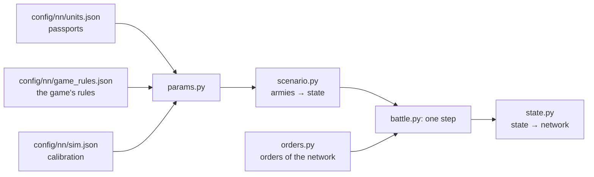

# Battle simulator

[← Back](README.md) · [Documentation](../README.md) › [Data for training](README.md) › Battle simulator · [Русский](../../ru/training/simulator.md)

Step 3 of the path ([network model](network.md)): a simulator of the game's battle in which
the network will train. It plays thousands of battles at once on the GPU. Each unit is one
object (men, health, place, facing, morale, fatigue, projectiles), not every soldier. The
numbers come from the [unit passports](units.md) and the [game's rules](../game/database.md);
where the game behaves differently, they are calibrated to the [measurements](measurements.md).
Version 1, 30.09.2026: the seven v1 units, a flat empty map.

## How to run it

```bash
bash tools/nn/dock.sh tools.nn.sim.check                     # all checks against the game (CPU and GPU)
bash tools/nn/dock.sh tools.nn.sim.check --device cuda --only battles
.venv/Scripts/python -m pytest -q tests/tools/test_sim_layout.py   # without torch
```

- The code is `tools/nn/sim/` (PyTorch). It needs torch, which is in the `snake-ai-trainer`
  container; the project's `.venv` has none, so `tests/tools/test_sim.py` is skipped there.
  The image has no pytest: to run the tests there, put a copy of pytest (from `.venv`) on
  `PYTHONPATH` and run `python -m pytest -q tests/tools/test_sim.py`.
- The check writes `build/nn-sim/check.json` (not in Git).

```python
from tools.nn.sim import battle, replay, scenario

st = scenario.build([scenario.from_arena("whole_emp_v_skv", "attack")] * 1024, device="cuda")
battle.run(st, replay.nearest_attack)        # policy(state) -> orders, until every battle ends
st.winner, st.t, st.observation()            # [B], [B], dict of [B, N]
```

## What the simulator holds



**The state** (`tools/nn/sim/state.py`, the one source of truth): tensors `[B, N]` — B battles,
N unit slots of both sides (side 1 in the first half, side 2 in the second, a side's lord
first; `side` = 0 is an empty slot). Three groups:

- *observed* — the same fields and names as a recording's `nn_sample`
  ([what a recording holds](README.md#what-a-recording-holds)): `x`, `z`, `b`, `men`, `hp`,
  `mp`, `ms`, `r`, `s`, `w`, `m`, `mv`, `f`, `a`, `fire`, `target` (the recording's `t`),
  `fat` (the fatigue state 0–5), `k`, `ox`, `oz`, `lf`, `rf`, `bf`, `vis`; the battle time
  is `t` `[B]`. So recorded battles and the simulator feed the network the same way;
- *static* — the passport: men, health, speeds, attack, defence, weapon, armour, shield,
  leadership, projectiles, range, reload, cost;
- *internal* — what only the simulator needs: morale and fatigue points, timers.

**Orders** (`tools/nn/sim/orders.py`): per unit and decision step `kind` ∈ hold (0), move (1),
attack (2), withdraw (3), keep (4: no new order, the one in force goes on; a unit with no order
holds); the point `x`, `z` for move and withdraw (the unit's centre); `target` — the enemy's
slot for attack; `run` — run or walk. All `[B, N]`. A move order to a unit in melee does not
take it out: that is what withdraw is for (it breaks off, and the enemies in contact strike its
back).

## One step (0.5 s)

1. Take the orders (routing units ignore them).
2. Contacts: the units' rectangles (front × depth of the ranks the men fill) touch.
3. Blows in melee and shots.
4. Health, men, kills.
5. Morale: wavering, rout, rally, shattering.
6. Fatigue.
7. Movement: to the order's point or the target, fleeing for routers; the edge of the map.
8. Is the battle over: a side with no standing unit loses; at 60 minutes the defender wins.

## Mechanics and their sources

"DB" — the game's rules or a passport; "measured" — [measurements](measurements.md) and
recordings; "calibrated" — a number fitted so the simulator repeats the game (all of them are in
`config/nn/sim.json` with the reason).

| Mechanic | How | Source |
|---|---|---|
| Speed | walk, run, acceleration, deceleration of the passport; routing units run at 0.9 of the run | DB; the routing speed measured (median 0.80–0.96) |
| Formation | front of the ordered width, ranks 1.5 m apart; a lord is a circle of his radius | measured: 120 spearmen, 30 m, 6 ranks |
| Contact | edges within 1 m (2 m more for those already fighting) | measured: centre distance at the first contact |
| Order point | the game records the front's centre; the simulator goes to the unit's centre, half a depth behind | measured (spearmen 3.3–4.8 m, slaves 6.5–6.9 m) |
| Men fighting | 0.75 of the files in contact; a unit shares out no more than its front holds; at most 8 around a lord | calibrated; 8 — measured ([melee](../game/units/melee.md)) |
| Hit chance | 35 + 0.1 × (attack − defence), within 8–90 %; defence ×0.6 from the flank, ×0.3 from the rear, lost at the database's full weight | DB numbers; the weight 0.1 calibrated (see below) |
| Damage of a hit | armour-piercing + base × (1 − 0.75 × armour/100), no more than a man's health | DB (armour stops a random 50–100 %) |
| Time between blows | `attack_interval_s` of the passport | DB |
| A lord's blow | hits up to `splash` (4) men | DB; agrees with the measured 0.36 kills a second |
| Charge | the charge bonus to attack and damage, fading over 13 s; a unit that meets the enemy running hits ×(1 + 2.5 × its speed share) for those 13 s; one that did not charge brings its men in over 20 s | DB (13 s); 2.5 and 20 s calibrated on the first 15 s of the pairs |
| Men lost | blows that do not kill wound: men share = max(1 − g × (1 − health share), health share), g = (hits to kill)^−0.5 | calibrated on men against health in the pairs |
| Shooting | from standing only; first shot 3.3 s (arrows) / 4.3 s (sling) after halting; a shot per man every 11.0 / 11.5 s; range from the formation's edge | measured |
| Hits | 0.42 arrows, 0.47 sling at the edge of range; ×1.29 at 70 m, ×1.12 at 90 m | measured; the distance factor from the range test |
| Shield, resistance | a shield blocks its chance within 60° of the front; missile resistance of the passport | DB |
| A lord as a target | 0.9 of the unit rule; in melee he takes 1/(1 + men fighting him) of the hits | measured (26.5k shots); the melee share calibrated on the whole battles |
| Target at will | the order's target if in range, else the nearest standing enemy | as the game ([missile damage](../game/units/missile-damage.md)) |
| Morale | points: leadership + effects; MoralePercent = points / leadership; moves 1 point or 15 % of the gap per 0.5 s | DB; the step measured (+2 points a second in every recording) |
| Morale effects | lord within 70 m +4; lord died −16 then −10; neighbour within 120 m +5; casualties −2…−74; recent casualties −6…−80 (last 30 s, of the whole health); winning / losing the melee +3/+6/+8, −3/−8 (damage ratio 1.5 / 2.5 / 4); attacked in the flank −6, rear −14; routing friends −3 each; routing enemies +2.5 each; under fire −5; very tired −2, exhausted −6; a stronger enemy within 70 m −3 | DB points; window, ratios calibrated |
| Faction | Skaven +6 points at the start | measured: before contact they stand 6 higher than the Empire in the same place |
| States | wavering below 16 points, rout at 0, shattered at the third rout, no new rout within 10 s of a rally | DB |
| Rally | while no standing enemy is within 90 m the router regains 2 points a second; rallies at MoralePercent 0.23 | measured: 0.23 and 90 m (365 rallies); 2 points calibrated (median rally 44 s) |
| Fatigue | charge +34, melee +19, shooting +18, running +4, walking −1, standing −7, ×5 a second; states by the database thresholds | DB; ×5 fitted to 1315 recorded changes of state |
| Map | a square ±1020 m; a routing unit that crosses the edge leaves the battle | measured |
| Visibility | everything is visible (`vis`, kept for later) | a flat empty map |

**Why the hit chance is almost flat.** By the database rule the four pairs would need 13 to 43
men striking at once, and a lord ~38 ([measurements](measurements.md)). With a flat ~35 % the
same losses need 12–17 men on a 30 m front in every pair and ~8 around a lord: one number fits
all. So attack − defence counts at 0.1 of the rule. The flank and rear, which the pairs do not
test, keep the rule's full weight.

## Checks against the game

`python -m tools.nn.sim.check`: every recorded run is replayed in the simulator from the
recorded start with the recorded orders (open-loop: `tools/nn/sim/replay.py`: a target fought
or shot → attack it, otherwise → move to the order's point), written down once a second like
a recording and measured by the same code as the game (`tools/nn/measure.py`). Results of
30.09.2026:

### Mechanics: 49 of 54 numbers within 20 %

| Case | The game | The simulator |
|---|---|---|
| Spearmen — slaves: fight, s | 232 (208–252) | 251 |
| … slaves lose HP/s / spearmen | 22.7 / 12.4 | 23.3 / 14.0 |
| … slaves waver / rout, s | 195 / 232 | 173 / 251 |
| Spearmen — clanrats: fight, s | 275 (219–353) | 282 |
| … spearmen lose / clanrats HP/s | 25.7 / 20.6 | 22.1 / 19.5 |
| … spearmen waver / rout, s | 251 / 275 | 269 / 282 |
| General — clanrats: fight, s | 348 (340–357) | 335 |
| … the General / clanrats lose HP/s | 8.2 / 21.8 | 6.9 / 22.9 |
| … clanrats waver / rout, s | 254 / 348 | 254 / 335 |
| Warlord — spearmen: fight, s | 309 (264–338) | 263 |
| … the Warlord / spearmen lose HP/s | 5.5 / 21.2 | 5.4 / 25.3 |
| … spearmen waver / rout, s | 277 / 309 | 229 / 263 |
| Winner of each pair | 12 of 12 | 12 of 12 |
| Archers → slaves: reload, s / hit rate / HP/s | 11.0 / 0.42 / 66 | 11.8 / 0.43 / 59 |
| … the first shot after halting, s | 3.3 | 3.3 |
| … the target wavers / routs after the first shot, s | 39 / 71 | 49 / 77 |
| Slingers → spearmen: reload, s / hit rate / HP/s | 11.5 / 0.47 / 36 | 12.0 / 0.47 / 35 |
| … the target wavers / routs, s | 154 / 177 | 168 / 192 |

Outside 20 %: the archers' target wavers 27 % later; the HP lost in the first 15 s of contact
(the charge) in four places (−28 %… +35 %) — the charge is noisy in the game too.

### Whole battles: the same winner in 21 of 26 (81 %)

| | Battles decided | Same winner |
|---|---:|---:|
| Empire against Skaven | 10 | 10 |
| Mirror arena (Empire against Empire) | 16 | 11 |

Each recorded battle is played 8 times from starts moved by up to 2 m; the simulator's winner
is the majority's (4 of the 5 misses are 7 or 8 of 8: not chance). Two mirror runs ended on our
900 s limit without a winner and are not counted.

| | The game | The simulator |
|---|---|---|
| Empire HP lost 60 / 120 / 180 s after the first contact | 0.25 / 0.41 / 0.53 | 0.27 / 0.48 / 0.61 |
| Skaven HP lost 60 / 120 / 180 s after the first contact | 0.21 / 0.34 / 0.42 | 0.14 / 0.23 / 0.29 |
| Routs / rallies a battle | 22.5 / 13.0 | 24.4 / 15.5 |
| A rally takes (median), s | 44 | 47 |
| A battle lasts (mean), s | 613 | 716 |

### Speed

| Where | Battles at once | Battles a second |
|---|---:|---:|
| GPU, RTX 5070 Ti (`torch.compile`) | 4096 | 1200–1560 |
| CPU in the container (no compile) | 1024 | 8 |

A battle here is the Empire-Skaven battle (40 slots) to its end, 430–620 s of game time. On
the GPU the step is compiled by `torch.compile` (about 10× faster); the container has no C++
compiler for compiling on the CPU.

## What is missing

- **Whole battles lean to the Skaven**: the simulator's Skaven lose a third less HP in the
  first 3 minutes than in the game, the Empire a sixth more. Not found why; in the game the
  Skaven units take ~50 % more HP a second in melee than in the one-against-one pairs, in the
  simulator about as much as in the pairs.
- **Battles last 17 % longer** than in the game.
- **Replay is open-loop**: the recorded orders do not react to a battle that went differently.
- The mirror battles: in the game the defender wins 15 of 16; the simulator gets 11 of 16.
- **Fatigue** matches the recorded state exactly in 43 % of the samples (off by 0.86 of a
  state on average). What fatigue does to attack, defence and speed is not in the database and
  is not modelled.
- **Not modelled**: friendly fire, terrain, a turn rate (units face where they go at once),
  cavalry, monsters, magic, flying, artillery, abilities, experience ranks, "flanks exposed"
  (−3/−6: not seen in the recordings), the scaled "strong enemy near" (only −3).
- `vis` is always true: line of sight is not modelled.

## Surprises

- A lord loses ~0.9 of the unit rule per projectile aimed at him out of melee (26.5k
  recorded shots), not 0.02–0.1 of the spearmen's damage as
  [missile damage](../game/units/missile-damage.md) says.
- The arena's close-range damage per arrow (~25 HP at 34 m) is more than an arrow's whole
  damage (19): melee losses are mixed in; the simulator takes the distance factor from the range
  test instead.
- Routing units run slower than their run: the Empire's 0.80–0.86, the Skaven's 0.85–0.96.
