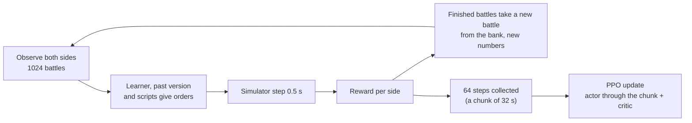

# Training the network

[← Back](README.md) · [Documentation](../README.md) › [Data for training](README.md) › Training · [Русский](../../ru/training/training.md)

Step 3 of the path ([network model](network.md)): PPO training of the [network](model.md) in the
[battle simulator](simulator.md). Built 30.09.2026; on 01.10.2026 reworked so the attacker attacks
(below), with a warm start, memory trained through time and random armies; the same day an
opponent modelled on the game's AI and measures against the policy's collapse to "attack only"
were added ([below](#against-the-games-ai-01102026)). The code is `tools/nn/train/` (PyTorch, runs
in the `snake-ai-trainer` container).

## How to run it

```bash
# 1. warm start: copy the scripts `nearest` and `ai_like` (random armies up to 19 units a side)
bash tools/nn/dock.sh tools.nn.train.imitate --minutes 5 --generated 19 --teacher nearest,ai_like \
  --out build/nn-train/runs/bcmix/bc.pt
# 2. PPO from it on random armies, small armies first; evaluate and record at the end
bash tools/nn/dock.sh tools.nn.train.run --name long_ai --minutes 80 --armies generated \
  --curriculum 5:0.15,10:0.4,19:1 --init build/nn-train/runs/bcmix/bc.pt --critic-warmup 8 \
  --lr 1.5e-4 --entropy 0.005 --entropy-end 0.001 --anchor 0.1 --anchor-end 0 \
  --mix '{"self": 0.1, "past": 0.15, "nearest": 0.2, "hold_shoot": 0.1, "hold": 0.05, "ai_like": 0.4}' \
  --eval-past build/nn-train/runs/long19/latest.pt
# evaluation alone: the fixed scenes, or random battles of EVAL_SEEDS per opponent
bash tools/nn/dock.sh tools.nn.train.evaluate --checkpoint build/nn-train/latest.pt --per-scene 128
bash tools/nn/dock.sh tools.nn.train.evaluate --checkpoint build/nn-train/latest.pt --generated 512 \
  --opponents ai_like,nearest,hold_shoot,past --against build/nn-train/runs/long19/latest.pt
bash tools/nn/dock.sh tools.nn.train.checkpoint                  # write an untrained random.pt
# the standard test of a change (below): before -> after behaviour report in build/nn-train/test5/<label>/
DOCK_NAME=t2-test5 bash tools/nn/dock.sh tools.nn.train.test5 --label mychange [-- run.py options]
```

Main options of `run`: `--name` (the folder under `build/nn-train/runs/`), `--init` (start from a
checkpoint), `--armies` (`scenes` or `generated`), `--curriculum`, `--battles` (at once, 1024),
`--steps` (decisions per chunk, 64), `--limit` (3600 s), `--lr`, `--anchor` and `--anchor-end`,
`--entropy` and `--entropy-end` (linear from the first to the second over the run),
`--critic-warmup`, the reward weights (`--timeout`, `--idle`, `--hp`, `--standing`,
`--order-cost`, `--lord`, `--retarget`, `--idle-ramp`, `--tempo`, `--tempo-after`), per-unit
credit (`--unit-credit`, `--unit-hp`, `--flanked`, `--missile-melee`, `--crowd`, `--flank-attack`, `--idle-near`,
`--neighbour`; [below](#per-unit-credit-01102026)), `--updates` (train that many updates instead of
`--minutes`, which then only caps the time), `--mix`,
`--small share:units` (that share of every bank of random battles with at most `units` a side),
`--eval-every` minutes / `--eval-opponents` / `--eval-battles` (evaluation on `EVAL_SEEDS` during
the run, both roles; the best mean win rate is saved as `best_eval.pt`, the evaluations in
`eval_log.jsonl`, their time not counted as training), `--eval-past` (the network behind "past" in
the final evaluation). The first steps compile for 1–3 minutes; the training time does not count them.

## What it writes

Everything goes to `build/nn-train/` (not in Git):

| File | What |
|---|---|
| `random.pt` | the untrained network (random weights), the untrained opponent |
| `latest.pt` | the network of the last run (the companion's default) |
| `runs/<name>/latest.pt`, `best.pt` | the run's last network; the one with the best window of training battles against the scripts |
| `runs/<name>/pool/v*.pt` | past versions: the opponents of self-play |
| `runs/<name>/log.jsonl` | one line per update: losses, entropy, KL, the weights of entropy and KL in force, reward, win rate by opponent and role, order changes, order kinds, lord deaths, target switches |
| `runs/<name>/eval.json` | the final evaluation |
| `runs/<name>/replays/*/` | battles of the final network, written like the game's recordings |

**A checkpoint** (`tools/nn/train/checkpoint.py`) is one file, a dict saved by `torch.save`:
`format` (2), `kinds` (the order kinds in code order), `preset`, `config` (the network's sizes:
the actor is rebuilt from it), `actor` (its weights — all the game needs), `critic` (training
only), `meta`. `load_policy(path)` gives the actor ready to play; the
[companion](../apps/bridge.md) loads it so.

**Replays** are folders like a recorded run: `manifest.json` and `events.jsonl` with an
`nn_sample` every second and the `result`. `tools.nn.gamedata.load(folder)` reads them as a
game battle. `manifest.json` also says which side the network played and against whom.

## Test protocol (`test5`)

`tools/nn/train/test5.py`: the standard short test of a training change. Every change is closed
with it, so tests can be compared with each other.

1. **Before.** The starting network (`--init`, by default `runs/long_ai/best.pt`, 2 of 4 against
   the game's AI) plays the evaluation: 512 battles of random armies from `EVAL_SEEDS` (up to 19
   units a side) per opponent, 256 in each role, against `ai_like`, `nearest` and `hold_shoot`. All
   1536 battles run in one batch (`evaluate.play(..., together=True)`), the same battles every time.
2. **Training.** 36 PPO updates (`--updates`; ~5 minutes on a free GPU) with the current code and
   the settings of the `long_ai2` continuation (`test5.PROTOCOL`: random armies up to 19 units,
   `--small 0.35:6`, KL to `bcmix` 0.06 → 0.03, entropy 0.003 → 0.001, the attacker's time
   pressure, `long19` among the past versions) and the baseline's `--unit-credit 0` pinned, so
   tests stay comparable when `run.py`'s defaults change. Options after `--` go to `run.py` and
   override them: a task passes its own new settings there (`-- --unit-credit 0.3`);
   `report.json` keeps them all (`protocol`, `options`, `train_args`). A fixed number of updates, not minutes: on a GPU shared with other jobs an update took
   up to 290 s, and a 5-minute test learned 1–2 updates. `build/nn-train/latest.pt` is not touched.
3. **After.** The trained network plays the same evaluation.
4. **The report**, printed and written to `build/nn-train/test5/<label>/report.json` (with
   `before.json` and `after.json`, the whole evaluations): before → after per opponent and role.

| Metric | What is counted (the learner's units; `tools/nn/train/behaviour.py`) |
|---|---|
| win rate | by opponent and role |
| own lord dead | share of battles that ended with the own lord dead |
| missile s in melee / battle, missile time in melee | seconds missile units (range > 0, not a lord) stand in melee, per battle and as a share of their standing time |
| own melee hit flank/rear | share of own melee unit-seconds struck in the flank or rear (the simulator's `flank_hit` ≥ 1; the game: a flank attack costs the defender ~×1.74 losses) |
| decisions with a pile | share of decisions with more than 2 own units on one enemy (attack order or the enemy fought) while another enemy strikes an own unit in the flank or rear |
| own melee into flank/rear | share of own melee unit-seconds striking a standing enemy from its flank or rear (the angle off its facing ≥ `contact.front_deg`, 60°) |
| target switches / min, order changes / min | per standing unit, per opponent |
| order kinds | shares of the learner's unit decisions |
| ability uses / battle | own abilities started (their cooldown set) |
| timeouts | share of battles at the time limit |

The "before" and the "after" each take ~10 minutes (the batch runs until its longest battle ends),
the training ~7: a test takes about half an hour. `--before PATH` reuses a "before" evaluation (only
while the simulator has not changed). Heavy GPU jobs take turns: the test waits while
`build/gpu-train.lock` exists (polled every 30 s), then holds it (its label and start time) until
it ends, also on failure; a test started within 60 s of a release (`build/gpu-train.released`)
waits out those 60 s first, so the jobs already waiting go before it. `DOCK_NAME` names the container (`dock.sh`). Noise: at 256 battles a role a
win rate moves by ±3 points (one standard error); 36 updates move the network little, so the test
shows whether a change breaks something and where the behaviour goes, not a final strength.

**Baseline** (`--label baseline`, the training before per-unit credit: `--unit-credit 0`; 01.10.2026):

| Metric | `ai_like` attack / defend | `nearest` attack / defend | `hold_shoot` attack / defend |
|---|---|---|---|
| win rate | 0.543 → 0.543 / 0.676 → 0.625 | 0.434 → 0.418 / 0.469 → 0.398 | 0.590 → 0.609 / 0.504 → 0.504 |
| own lord dead | 0.27 → 0.17 / 0.07 → 0.10 | 0.09 → 0.07 / 0.09 → 0.08 | 0.22 → 0.22 / 0.13 → 0.16 |
| missile s in melee / battle | 105 → 113 / 94 → 102 | 89 → 95 / 101 → 96 | 158 → 151 / 110 → 123 |
| own melee hit flank/rear | 0.35 → 0.36 / 0.36 → 0.38 | 0.35 → 0.37 / 0.39 → 0.40 | 0.26 → 0.27 / 0.33 → 0.35 |
| decisions with a pile | 0.064 → 0.074 / 0.110 → 0.108 | 0.077 → 0.085 / 0.087 → 0.100 | 0.055 → 0.058 / 0.121 → 0.124 |
| own melee into flank/rear | 0.28 → 0.29 / 0.30 → 0.31 | 0.25 → 0.26 / 0.27 → 0.28 | 0.27 → 0.28 / 0.29 → 0.30 |
| target switches / min | 0.66 → 0.96 | 0.76 → 1.13 | 0.69 → 0.97 |
| kinds hold / move / attack | 0.28 / 0.23 / 0.49 → 0.27 / 0.22 / 0.51 | 0.28 / 0.22 / 0.49 → 0.27 / 0.21 / 0.51 | 0.26 / 0.26 / 0.49 → 0.23 / 0.24 / 0.53 |

`best.pt` loses a third of its melee time struck in the flank or rear, its missile units stand in
melee ~100 s a battle, and in 6–12 % of decisions it piles more than 2 units on one enemy while
another enemy flanks it — the picture seen in the game. Ability uses (~4 a battle) are the lord's
abilities fired by the simulator's AI rule: `scenario.py` marks side 2 as played by the game's AI
by default, also when the learner plays side 2.

## How a training step goes



Modules: `scenes.py` (where battles come from: the arenas or random armies, as a bank of ready
starts), `league.py` (who plays whom, the pool), `opponents.py` (the scripts, `ai_like` among them), `randomise.py`,
`reward.py`, `rollout.py` (the battles and one step), `ppo.py`, `imitate.py` (the warm start),
`evaluate.py` (evaluation and replays), `checkpoint.py`, `run.py`.

## Decisions

**2 decisions a second** — one decision per simulator step (0.5 s). The step is the game's morale
tick ([simulator](simulator.md)); a faster decision would see nothing new. It is also the in-game
rhythm: the state at tick N, the order at tick N + 0.5 s. So a 10-minute battle is ~1200 decisions.

**Battles.** Two sources, both a bank of ready starts from which a finished battle takes a new one:

- the scenes: the Empire mirror arena, Empire against Skaven and Skaven against Empire
  (`config/nn/arenas.json`), each with side 1 attacking and defending;
- random armies of the [army generator](armies.md) (`tools/nn/armies`): equal budget, a lord and
  up to `max_units` units a side, half the bank with side 1 attacking. Training seeds only; the
  bank is renewed every 5 minutes; evaluation uses `EVAL_SEEDS`, never trained on. Curriculum:
  up to 5 units a side for the first quarter of the time, 10 for the second, then 19.

The learner plays side 1 in some battles and side 2 in others: every army in both roles. The
network sees the map as the game shows it (the Crossroads minimap frame, as the companion), not
the simulator's square.

**Opponents** (shares of the long run `long_ai`; `long19` before it: `nearest` 40 %, `hold_shoot` 25 %, `hold` 10 %, no `ai_like`):

| Opponent | Share | What it does |
|---|---:|---|
| itself | 10 % | the learner on both sides; both give training data |
| a past version | 15 % | one network from the pool, drawn again every 2 updates; the untrained one stays in the pool |
| `ai_like` | 40 % | modelled on the game's AI ([below](#the-opponent-ai_like)): a line that runs in together, missile units halt at range and shoot the enemy lord first, the lord in the line and never first, a charge from 80 m (attacker) or counter-charge from 100 m (defender), free units against enemies already fighting (via their flank) and missile units |
| `nearest` | 20 % | every unit attacks the nearest standing enemy, running |
| `hold_shoot` | 10 % | holds and shoots; a melee unit counter-charges an enemy within 80 m; as the attacker it attacks after 5 minutes |
| `hold` | 5 % | holds (shoots at will, fights back); met only as the defender — as the attacker it would only wait out the hour |

The game's AI takes no part in training: it stays an independent check ([network model](network.md#readiness)).

**Reward** (`reward.py`) of a side:

| Term | Weight | Why |
|---|---:|---|
| win / loss | +1 / −1 | the goal |
| time limit (both sides still stand) | defender +1, attacker **−1.5** | worse than losing a fight: an attacker that only stands must lose more than one that attacks and fails |
| enemy health lost − own health lost, per step, as a share of the side's start | 0.5 | a steady signal long before the end |
| enemy army (by cost) that stopped standing − own, per step | 0.5 | routs, not health, decide battles; a rally gives it back |
| the attacker, each decision none of its units fights in melee or shoots | 0.0002 (`long_ai2`: × (1 + t / 300 s), at most × 4) | standing has a price from the first second, not only at the limit an hour later (an idle hour: −1.44) |
| the attacker, each decision once the battle is older than 600 s (`long_ai2`) | 0.0003 | the −1.5 at the limit an hour away counts 0.9997^7200 ≈ 0.11 and is hardly seen; this cost is seen every step (10 minutes more: −0.36) |
| each real order change of a unit, divided by the side's units | 0.001 | against jitter (below) |
| the enemy lord died − own lord died | 0.3 | the game's morale rule makes it decisive (−16, then −10 points to every unit); the lord's cost share alone (in "stopped standing") does not show it; in the gate battles the network sent its lord in alone |
| each switch of an attack to another target while the old one still stands, divided by the side's units | 0.003 | hysteresis: in the gate battles units switched between two targets every 1–2 s |

The win, health, standing and lord terms are zero-sum (side 2 gets minus side 1's) except at the time
limit. Both shaping terms are potential differences: they do not change which outcome is best.
No style terms yet: the faction characters are placeholders. Beside the side's reward each unit has
its own (`reward.unit_step`, [per-unit credit](#per-unit-credit-01102026)); it does not enter the
side's reward.

**The order `keep`.** The network may give a unit no new order: `keep` (kind code 4) leaves the
order in force; a unit with no order holds. A real change is a new kind, a new attack target, or a
move point more than 10 m from the one in force; `keep` and the same order again cost nothing. With
0.001, a unit that changes its order every decision costs its side ~1.2 in a 10-minute battle, more
than a win; one change every 5 s costs ~0.12.

**Warm start** (`imitate.py`): before PPO the network copies scripts (behaviour cloning) in
battles where each side plays a random script (the teachers 70 % of the time); the sides a teacher
plays are copied: order kind (hold, move, attack, withdraw), target, the move point (the nearest
point bin of the network) and run. `long19` copied `nearest` alone (6 minutes: 100 % of the kinds,
99 % of the targets); `long_ai` copies `nearest` and `ai_like` together (5 minutes: 99 % / 98 %) —
see [below](#against-the-games-ai-01102026) why. From random
weights PPO did not get an army that fights as one in 10 minutes (the rounds below); the copy
starts where the best script is. The teacher is our own script, not the game's AI, so the check
against the game stays independent. Then PPO: the critic learns alone for 8 updates (it starts
from nothing while the actor already plays), and a KL term holds the policy near the copy
(`--anchor`, 0.1) so PPO's noisy steps do not wash it out; in `long_ai` it fades to 0 over the run
(`--anchor-end`), so the copy does not lock the policy.

**PPO** (`ppo.py`), MAPPO style: each own unit is an agent with its own probability ratio; all
units of a side share its advantage, and each adds its own ([per-unit credit](#per-unit-credit-01102026));
the critic sees the whole field (and is never shipped).

| Setting | Value | Why |
|---|---|---|
| discount γ | 0.9997 per decision | a horizon of ~3300 decisions (~28 min): a win 10 minutes away still counts 0.7 (with 0.999, 0.3) |
| GAE λ | 0.95 | the usual |
| clip | 0.2 | the usual |
| learning rate | 1.5e-4, Adam (eps 1e-5) | from the copy, larger steps without the anchor drifted to standing within 15 minutes |
| epochs, minibatch | 1, 4096 decisions (whole chunks) | the update costs more than the battles; the memory of a 16 GB card |
| stop at KL | 0.05 per unit | a guard against a too large step |
| entropy of the order kind | `long19` 0; `long_ai` 0.005 → 0.001 | with only `nearest` copied a bonus of 0.01 pushed the policy off attacking and lost it half its wins; from a copy of two scripts it keeps hold / move / withdraw alive |
| KL to the copy | `long19` 0.1; `long_ai` 0.1 → 0 | see the warm start |
| value loss, gradient norm | 0.5, 0.5 | the usual |

- **Memory (GRU) through time.** A rollout is a chunk of 64 decisions (32 s of battle) of every
  battle; the update runs the actor over each chunk from the memory stored when the chunk began,
  emptied where a new battle begins (recurrent PPO, R2D2's stored state). Only the GRU steps one
  by one; the layers before and after it run on the whole chunk at once.
- **Events in the input** ([inputs](model.md)): per unit how lately it fought in melee and routed
  (enemies: while seen); own and enemy lord slain and how lately (the game announces it).
- **Masks.** Dead, routing and padding units give no loss; invalid orders are masked by the
  network itself (attack without a visible enemy, orders to a unit that cannot take them).
- **Time limit 60 minutes**, as in the game: the defender wins at it.
- **Domain randomisation** (`randomise.py`): per battle, damage, speed and leadership are
  multiplied by 1 ± 15 % (the same for both sides) and by 1 ± 5 % per side; the start places move
  by up to 5 m. The network does not see the factors.
- **Speed.** The observation is compiled with `torch.compile` (8 ms → 0.6 ms for 1024 battles):
  one decision of 1024 battles, both sides, with the simulator step, takes ~32 ms.

**Evaluation** (`evaluate.py`): whole battles to the end against each opponent, the learner's side
alternating (both roles), the simulator's own numbers, starts moved by up to 2 m, orders sampled as
in training; `hold` only as the defender. Scenes: `--per-scene` battles per scene; random armies:
`--generated` battles of `EVAL_SEEDS`. Per opponent and role also the share of battles that ended
with the own / the enemy lord dead, the order kinds and attack target switches a minute.

## Per-unit credit, 01.10.2026

In the game: 4 infantry units piled on one enemy while 2 Skaven infantry units flanked them, and 2
archer units were stuck in melee. Every unit shared the side's advantage, so one unit's mistake
was lost in the battle's total: its gradient was the same whether it piled on or covered the flank.

**Each unit's own return** (`reward.unit_step`, per decision, per unit; not in the side's reward):

| Term | Weight | Why |
|---|---:|---|
| its health trade: n_own × (HP it dealt / the enemy's starting HP − HP it lost / own starting HP) | 0.05 | what happens to the unit itself; summed over the side it is 0.05 × n_own × the side's trade, about the side's `hp` term (0.5 at 10 units); dealt = melee HP from the simulator's `dealt`, missiles = men killed × the target's HP a man |
| struck in the flank or rear in melee | −0.0002 | the game: ~×1.74 losses; the trade sees the losses, this sees the position before they pile up |
| a missile unit in melee | −0.0002 | archers stuck in melee |
| a pile: more than 2 own units on one enemy while another enemy strikes an own unit in flank or rear, by the excess share (n − 2) / n | −0.0002 | the whole pile pays n − 2 units' worth: the units over 2 should turn to the flanker |
| a melee unit without an attack order out of melee while a fellow within 60 m fights (`idle_near`) | 0 | tried at −0.0004 (below): the units piled instead |
| striking a standing enemy's flank or rear | +0.0002 | as large as the penalty: a flank exchange is zero-sum between the two units |
| + 0.5 × the mean of the same of own units within 40 m | | what happens next to it: a unit that leaves its neighbour flanked pays for it |

`behaviour.facts` finds these from the simulator's state (the same as the [test protocol](#test-protocol-test5)).
Bounds: each shaped term is at most 0.0002 × 1200 = 0.24 a unit over a 10-minute battle, a quarter
of a win, and the unit's credit is weighted below the side's (below). In battles of `best.pt` against
`ai_like` and `nearest` (256 battles, 1200 decisions) the mean size per unit-decision: trade 6.4e-5,
flanked 2.0e-5 (10 % of unit-decisions), flank attack 7.7e-6 (8 %), pile 6.2e-6, missile in melee
4.2e-6 (2 %) — the trade leads and the shaped terms are ~40 % of the total.

**The critic** has a second head (`critic.Critic(..., per_unit=True)`): per unit token over the full
state, the value of that unit's own return × 100 (`unit_scale`: about the side's size, so the shared
layers feel it). Its last layer starts at zero, so an older checkpoint loads (`Critic.load`). GAE
runs per unit on its own return. **The advantage** of unit i: A_i = A_side + `unit_credit` ×
A_unit_i. A_unit is centred per decision over the side's units that take orders — it only says
which unit did better than its fellows and never pushes the whole side one way — then both are
normalised over the minibatch (a unit's return is ~100 times smaller than the side's and would
vanish beside it otherwise). `--unit-credit` 0.3 keeps the side's win and loss the main signal; 0
(the default for now) is the old training exactly. The per-unit value learns with the side's (loss weight
0.5); the log has `unit_value_loss` and `unit_adv_share` (the unit part's share of the advantage's
size, ~0.27 at 0.3).

**Tuning** (the [test protocol](#test-protocol-test5), 36 updates each, from `best.pt`; the same
"before" for all; win rates after training, `ai_like` / `nearest` / `hold_shoot`, attack / defend):

| Run | Settings | Win rate after | Kind hold | Piles, `ai_like` att / def | Flanked, `ai_like` att / def |
|---|---|---|---|---|---|
| before (`best.pt`) | — | 0.54 / 0.68, 0.43 / 0.47, 0.59 / 0.50 | 0.28 / 0.28 / 0.26 | 0.064 / 0.110 | 0.35 / 0.36 |
| `baseline` | `--unit-credit 0` | 0.54 / 0.63, 0.42 / 0.40, 0.61 / 0.50 | 0.27 / 0.27 / 0.23 | 0.074 / 0.108 | 0.36 / 0.38 |
| `u03` | 0.3, not centred, flank bonus 1e-4 | 0.51 / 0.61, 0.38 / 0.43, 0.57 / 0.50 | 0.31 / 0.27 / 0.28 | 0.076 / 0.120 | 0.35 / 0.37 |
| `u06x2` | 0.6, not centred, shaped terms × 2 | 0.18 / 0.31, 0.18 / 0.21, 0.09 / 0.20 | **0.73 / 0.52 / 0.84** | 0.016 / 0.044 | 0.45 / 0.46 |
| `u03c` | 0.3, centred (the task's settings) | 0.51 / 0.65, 0.44 / 0.50, 0.56 / 0.44 | 0.33 / 0.29 / 0.33 | 0.069 / 0.121 | 0.36 / 0.39 |
| `u06c` | 0.6, centred | 0.28 / 0.36, 0.22 / 0.21, 0.19 / 0.29 | **0.70 / 0.46 / 0.85** | 0.026 / 0.066 | 0.41 / 0.46 |
| `u06ci` | 0.6, centred, `--idle-near 4e-4` | 0.48 / 0.58, 0.33 / 0.39, 0.55 / 0.47 | 0.33 / 0.20 / 0.36 | **0.114 / 0.205** | 0.39 / 0.42 |

- **A strong unit credit teaches the side to stand.** At 0.6 the policy went to "hold" (0.7–0.85 of
  the decisions) within 36 updates and lost half its wins (66–77 % of its attacks on `hold_shoot`
  ran out the hour): a unit that stays out of the fight takes no losses, no flank and no pile, so
  it looks better than its fellows that fight. Piles fell 2–4 times, but by not fighting. Centring
  per decision (it cannot push the whole side) did not stop it: it is a unit's choice against its
  fellows, not the side's.
- **A cost for standing by** (`idle_near`: a melee unit without an attack order out of melee while a
  fellow within 60 m fights) stops the standing, and the units pile instead: piles doubled
  (0.11–0.23 of decisions). The unit terms pull between "stay out" and "join in"; with no term that
  says *where* to join, a unit joins the nearest fight. `idle_near` stays in the code, weight 0.
- **At 0.3** the policy keeps its order kinds, and its win rates and behaviour stay within the
  noise of the baseline (36 updates move little): no harm shown, and no gain yet. Hold creeps up
  (0.28 → 0.33), the first sign of the same pull. `run.py` keeps 0 by default for now (test5
  pins it); use `--unit-credit 0.3` and watch the hold share in longer runs.

**`task2`** (the test that closes the task: `--unit-credit 0.3`, the weights above; its own fresh
"before": the simulator had changed since the baseline — other work on melee and lords — and
`best.pt`'s win rates moved by up to 10 points, so compare the changes, not the numbers):

| Metric | `ai_like` attack / defend | `nearest` attack / defend | `hold_shoot` attack / defend |
|---|---|---|---|
| win rate | 0.516 → 0.523 / 0.578 → 0.652 | 0.352 → 0.395 / 0.418 → 0.449 | 0.539 → 0.539 / 0.414 → 0.512 |
| own lord dead | 0.27 → 0.28 / 0.10 → 0.07 | 0.08 → 0.10 / 0.11 → 0.08 | 0.25 → 0.42 / 0.11 → 0.15 |
| missile time in melee | 0.068 → 0.043 / 0.086 → 0.084 | 0.087 → 0.083 / 0.087 → 0.089 | 0.080 → 0.044 / 0.087 → 0.079 |
| own melee hit flank/rear | 0.35 → 0.36 / 0.37 → 0.39 | 0.35 → 0.37 / 0.38 → 0.40 | 0.26 → 0.27 / 0.34 → 0.35 |
| decisions with a pile | 0.064 → 0.073 / 0.111 → 0.127 | 0.076 → 0.117 / 0.094 → 0.122 | 0.055 → 0.036 / 0.117 → 0.105 |
| own melee into flank/rear | 0.28 → 0.29 / 0.31 → 0.31 | 0.25 → 0.26 / 0.27 → 0.28 | 0.28 → 0.29 / 0.30 → 0.30 |
| timeouts | 0.012 → 0.066 / 0 → 0.004 | 0 → 0 / 0 → 0 | 0.016 → 0.102 / 0 → 0 |
| kinds hold / move / attack | 0.28 / 0.23 / 0.49 → 0.37 / 0.18 / 0.45 | 0.29 / 0.22 / 0.50 → 0.27 / 0.19 / 0.54 | 0.25 / 0.26 / 0.49 → 0.39 / 0.20 / 0.40 |
| target switches / min | 0.66 → 0.75 | 0.78 → 0.97 | 0.72 → 0.67 |

Win rates rose in 4 of the 6 (opponent, role) pairs by 3–10 points (the baseline: down in 3, by
up to 7), within the noise each but all one way; missile units attacking spend half as much of
their time in melee (0.068 → 0.043, 0.080 → 0.044). Piles and flank hits did not fall (36 updates),
"hold" rose to 0.37–0.39 against the waiting opponents, attacks on `hold_shoot` ran out the hour
more often (10 %), and the own lord died more often attacking it (0.25 → 0.42). So per-unit credit
at 0.3 is harmless and slightly helpful in 36 updates, but it has not yet taught the piling
infantry to turn to the flank; its pull towards standing must be watched in longer runs.

## Against the game's AI, 01.10.2026

The in-game gate ([launch](../launch/gate.md)) lost 3 of 4 battles to the game's AI with `long19`.
The recordings (`build/gate-analysis/`: `timeline.py`, `target_rank.py`, `missile_duty.py`, `lords.py`)
show a network that only does "every unit attacks the nearest enemy": 100 % attack orders, zero
entropy of the kind; it sent its lord in alone, charged out of defence, ran 350 m into prepared
missile fire, never withdrew or covered its missile units; 21–61 % of its attacks went at the enemy
lord, and units switched between two targets every 1–2 s. The game's AI: the defender waits
~60–80 s and shoots first (first volleys at 108–134 m, 63–68 s), its missile units focus the enemy
lord, its lord stays in the line, it counter-charges at ~100 m and sends free units at enemy missile
units and flanks; the attacker advances in line (110 m in the first 30 s, then 83 m: the line
keeping together), its missile units halt at range.

### The opponent `ai_like`

`tools/nn/train/opponents.py`, numbers in `Line` (from the recordings where they show them):

| Rule | Number | Source |
|---|---|---|
| the attacker's line advances together at a run (a point 30 m ahead); a unit more than 15 m ahead of its line's centre waits | run, 15 m | battle 4: 3.6 m/s, then 2.8 m/s (the simulator's infantry walks 1.5, runs 3–3.4) |
| a defender with no missile units advances too | — | battle 2: 80 m in 30 s |
| the attacker charges from | 80 m | battle 4: targets at ~80 m, contact 11 s later |
| the defender counter-charges from | 100 m | battles 1 and 3: ~100 m, 78–87 s into the battle |
| an enemy that wavers is charged from; once own units fight, the rest join enemies within | 150 m | ours |
| missile units halt at a share of range and shoot; the enemy lord first when in range and not in melee | 0.9 | battles 3–4: first volleys at 108–134 m; battles 1–3: slings and archers on the lord (not in melee: friendly fire, ours) |
| missile units step back 50 m from an enemy melee unit within | 40 m | battle 3: slings stepped back and aside |
| the lord stays behind its line's centre, never charges first: goes in with the line or at an enemy within 50 m that already fights; withdraws below 30 % health | 10 m | battle 4: in the line from contact on; 50 m and 30 % ours |
| targets: nearest, pulled 30 m towards enemies already fighting, 25 m towards missile units, 60 m towards enemies on own missile units; a new target must be 15 m better | — | battles 3–4 retargets; hysteresis ours |
| a free unit goes for an enemy already fighting via a point 12 m beside its flank | 12 m | the simulator's tactic scan |

Scripts against each other (random armies of `EVAL_SEEDS`, 256 battles per pairing and side, wins of the first):

| | attacking | defending | own / enemy lord dead |
|---|---:|---:|---|
| `ai_like` v `nearest` | 31 % | 36 % | 2–3 % / 3–6 % |
| `ai_like` v `hold_shoot` | 48 % | 38 % | 6–8 % / 12–15 % |
| `nearest` v `hold_shoot` | 74 % | 61 % | 4 % / 7–8 % |

`ai_like` is weaker than `nearest` here, as everything that waits is in this simulator ("Why not
80 % against nearest"); the variants that come closer to the game's numbers (the lord behind the
line, walking, longer counter-charge distances) were weaker still. **`long19` against `ai_like`**:
66.0 % attacking, 70.7 % defending (512 battles of `EVAL_SEEDS`), its own lord dead in 7 % / 2 %,
100 % attack orders.

### Against the collapse to "attack only"

- **A richer warm start.** `imitate.py` copies several teachers with all order parts (kind, target,
  move point, run); `bcmix` copies `nearest` and `ai_like` together. A copy of the mixture plays
  hold 0.26, move 0.18, attack 0.55, withdraw 0.01 — but weaker than either teacher (31 / 36 % v
  `ai_like`, 28 / 24 % v `nearest`): the network recognises from its own orders in force which
  teacher it is, and the two styles do not mix well.
- **Exploration on the kind:** `--entropy` → `--entropy-end` (linear), on the kind only.
- **The KL to the copy fades** (`--anchor` → `--anchor-end` 0) with an explicit `--reference`.
- **Rewards:** the lord term (0.3) and the target-switch cost (0.003), above.
- **`--kind-temperature`:** divides a collapsed actor's kind logits once (long19 at 4: attack 0.92,
  each other kind ~2 %).
- `ai_like` at 40 % of the league; `--pool-extra` keeps `long19` among the past opponents.

Short runs (9 minutes, up to 10 then 19 units a side; training windows of the last minutes,
attacking / defending):

| Run | Start | Settings | v `ai_like` | v `nearest` | kinds at the end (hold / move / attack) |
|---|---|---|---|---|---|
| s1 | `long19` | entropy 0.01 → 0.002, no KL | 0.61 / 0.71 | 0.46 / 0.43 | 0 / 0 / 1.00: the entropy's gradient vanishes at 1.000 |
| s3 | `long19` softened ×4 | entropy 0.003 → 0.001 | 0.43 / 0.49 | 0.24 / 0.32 | 0.01 / 0.00 / 0.98 within 3 minutes: the random other kinds lose, PPO collapses it again |
| s2 | `bcmix` | entropy 0.005 → 0.001, KL 0.1 → 0 | 0.42 → 0.46 / 0.41 → 0.53 | 0.30 / 0.39 | 0.44 / 0.18 / 0.39 |

s2 on `EVAL_SEEDS` (256 per opponent): `ai_like` 39 / 48 %, `nearest` 25 / 26 %, `hold_shoot`
41 / 35 % (25 % of its attacks ran into the time limit), `long19` 31 / 33 %; its own lord dead in
27–30 % against `ai_like`. Only the start from the mixed copy keeps the other kinds and improves
against `ai_like`; from `long19` PPO goes back to attacking.

### The long run `long_ai`

From `bcmix`: 21 minutes (`--entropy 0.005`, `--anchor 0.1`, up to 5 then 10 units; by then
`ai_like` 0.51 / 0.63, `nearest` 0.41 / 0.44 in the training windows), stopped for the short run
s3 and resumed from its checkpoint for 70 minutes (`--anchor 0.075 → 0` to `bcmix`,
`--entropy 0.004 → 0.001`, 10 then 19 units, `long19` in the pool).

In the training windows (the learner's own battles, attacking / defending) `ai_like` went
0.43 / 0.51 (the first 7 minutes from `bcmix`) → 0.50 / 0.58 (the first 10 minutes of the resumed run)
→ 0.47–0.52 / 0.57–0.65 with up to 19 units; `nearest` stayed at 0.34–0.42 / 0.39–0.44. Order kinds
hold 0.22–0.31, move 0.19–0.23, attack 0.46–0.58, withdraw and keep ~0; own lord dead at the end of
13–17 % of battles (the enemy's 13–16 %); attack target switches 0.65–1.3 a minute per unit. In the
last ~10 minutes (the KL weight near 0) moves grew to 0.36 and the final network got worse: on
`EVAL_SEEDS` it ran into the time limit in 53–57 % of its attacks on `hold_shoot` and `hold`.
`best.pt` (update 440 of 523, minute 58; the best worst-case window against the scripts, 0.44) is
the one to check in the game.

`EVAL_SEEDS`, up to 19 units a side, 512 battles per opponent (256 per role; `hold` 512 attacking):

| Opponent | Role | `long_ai/best.pt` | `long_ai/latest.pt` | `long19` |
|---|---|---:|---:|---:|
| `ai_like` | attack / defend | 52.3 / 60.9 % | 35.5 / 47.7 % | 66.0 / 70.7 % |
| `nearest` | attack / defend | 46.5 / 44.1 % | 31.2 / 30.5 % | 53.1 / 46.5 % |
| `hold_shoot` | attack / defend | 65.6 / 54.7 % | 23.0 / 35.2 % | 79.3 / 71.1 % |
| `hold` | attack | 96.3 % | 40.2 % (57 % on time) | — |
| `long19` | attack / defend | 47.7 / 44.9 % | 31.6 / 28.9 % | — |
| order kinds | hold / move / attack | 0.25 / 0.22 / 0.52 | 0.16 / 0.54 / 0.30 | 0 / 0 / 1.00 |
| own lord dead v `ai_like` | attack / defend | 19 / 4 % | 36 / 30 % | 7 / 2 % |
| own lord dead v `nearest` | attack / defend | 3 / 5 % | 19 / 26 % | 0 / 0 % |

`best.pt` is the first network that holds and moves (a quarter of its orders each) and does not
change targets back and forth; head to head with `long19` it is close to even (48 / 45 %), against
the scripts it is weaker than `long19` (it gave up part of the copied `nearest`'s edge), and its
lord dies more often when attacking `ai_like` (whose missile units aim at it). The run wrote its
final network to `build/nn-train/latest.pt`; that file was put back to `long19`.

Next: keep a floor under the KL to the copy (or stop by evaluation) — at 0 the policy drifted to
moving about; the attacker's time limit is weak at γ = 0.9997 (−1.5 an hour away counts
0.9997^7200 ≈ 0.11), so an attacker that moves and shoots without closing pays little.

### The gate, and `long_ai2`

In the game (4 battles each, Normal): `long_ai/best.pt` won 2 of 4 (lost a 2 v 2 attack and a 6 v 4
Skaven v Empire defence; won 11 v 10 Skaven v Skaven attacking and 19 v 20 Empire v Skaven
defending), `long19` 1 of 4. So `long_ai2` went on from `best.pt` for 50 minutes of training
(59 with its evaluations): the KL to `bcmix` 0.06 → a floor of 0.03; entropy 0.003 → 0.001; the
attacker's time pressure (idle cost × (1 + t / 300 s), at most × 4; 0.0003 a decision past 600 s);
35 % of every bank with at most 6 units a side (`--small 0.35:6`); `best.pt` and `long19` in the
pool; every 10 minutes an evaluation against `ai_like` and `nearest` (128 battles of `EVAL_SEEDS`
each, both roles), the best mean saved as `best_eval.pt`.

| Evaluation (mean of 4 win rates) | update 74 | 136 | 206 | 278 |
|---|---:|---:|---:|---:|
| `ai_like` + `nearest`, attack and defend | **0.535** | 0.523 | 0.473 | 0.465 |

The training windows stayed flat (`ai_like` 0.52–0.56 / 0.60–0.65, `nearest` 0.38–0.45 / 0.39–0.43;
hold 0.22–0.27, move 0.18–0.21, attack 0.52–0.60; own lord dead 9–14 %); the evaluations fell after
the first 10 minutes. `best_eval.pt` is update 74 (copied as `best_eval_u74.pt`).

`EVAL_SEEDS`, 512 battles per opponent (256 per role); small armies: up to 6 units a side, 256 per
opponent:

| Opponent | Role | `long_ai2/best_eval_u74.pt` | `long_ai/best.pt` | ≤ 6 units: `u74` | ≤ 6 units: `best.pt` |
|---|---|---:|---:|---:|---:|
| `ai_like` | attack / defend | 49.6 / 64.5 % | 52.3 / 60.9 % | 57.8 / 68.0 % | 52.3 / 68.8 % |
| `nearest` | attack / defend | 44.9 / 39.8 % | 46.5 / 44.1 % | 49.2 / 54.7 % | 43.8 / 53.9 % |
| `hold_shoot` | attack / defend | 72.7 / 54.7 % | 65.6 / 54.7 % | 64.1 / 58.6 % | 65.6 / 55.5 % |
| `hold` | attack | 97.9 % (no time limit) | 96.3 % (2 % on time) | — | — |
| `long19` | attack / defend | 45.7 / 48.0 % | 47.7 / 44.9 % | 45.3 / 52.3 % | 39.1 / 46.1 % |
| order kinds | hold / move / attack | 0.20 / 0.20 / 0.60 | 0.25 / 0.22 / 0.52 | 0.18 / 0.18 / 0.65 | 0.20 / 0.20 / 0.60 |
| own lord dead v `ai_like` | attack / defend | 13 / 5 % | 19 / 4 % | 9 / 3 % | 11 / 5 % |

Within the noise of these counts (±3–4 points at 256 battles) the two are level: `u74` is better on
small armies and against `hold_shoot` attacking, worse against `nearest`; by the selection score
(`ai_like` and `nearest`, 512 battles) 49.7 % against `best.pt`'s 51.0 %. `build/nn-train/latest.pt`
stays `long19`. More PPO from `best.pt` did not add anything the evaluation sees: the gains, if any,
come from the opponents and the simulator, not from more of the same training.

## Winning as the attacker, 01.10.2026

The first run learned to stand: at the time limit the attacker got −1, the same as a lost fight, so
standing beat a failing attack; γ = 0.999 over up to 1800 decisions hid the end; the limit was cut
to 900 s. What was tried, 10–25 minutes each (win rate in the training battles at the end):

| Run | Start | What changed | `nearest` | `hold_shoot` | `hold` (attack) |
|---|---|---|---|---|---|
| r1 | random | new reward, γ 0.9997, 60 min, memory through time, lr 2e-4 | 0 % | 0 % | 0 % (timeouts) |
| r2 | random | lr 1e-3 | 0 % | 0 % | ~40 % |
| r3 | copy of `nearest` | entropy 0.01, lr 3e-4 | 52 → 18 → 40 % | 70 → 30 → 60 % | 100 % |
| r4 | copy | entropy 0.003, lr 3e-4, 20 min | 50 %, then 20 % | 80 %, then 40 % | 100 %, then 40 % (it stopped attacking) |
| r5 | copy | no entropy, KL to the copy 0.3, lr 1e-4, 20 min | 53 % | 76 % | 100 % |
| long | copy on random armies | KL 0.1, lr 1.5e-4, random armies 5 → 10 → 19 units, 29 + 25 min | 49 % | 72 % | 98 % |

**What fixed the attack:** the copy of `nearest` (an army that charges together) together with the
KL term that keeps PPO from washing it out. From random weights PPO did not get there in 10
minutes; without the KL term the policy drifted back to standing in 15. The reward changes (−1.5
on time, the idle attacker's cost, the standing share) made standing the worst choice, but alone
they did not teach an army to fight as one.

**The final network** `build/nn-train/runs/long19/latest.pt` (copied to `build/nn-train/latest.pt`):
the long run: 29 minutes on up to 5, then 10 units a side; then 25 minutes on up to 19 (40 slots)
from its checkpoint (the first switch to 19 units ran out of the card's memory and was stopped;
the minibatch now shrinks with the slots).
~8 400 battle steps a second at 40 slots (11 500–15 800 at 12–22), 13 088 battles in the last 25
minutes, no battle ended on time.

The fixed scenes, 128 battles per scene and opponent (768 per opponent; `hold` only as the defender):

| Opponent | Role of the network | Wins | Health lost own / enemy | Battle, s |
|---|---|---:|---|---:|
| `nearest` | attack | 57.8 % | 0.78 / 0.80 | 391 |
| `nearest` | defend | 52.9 % | 0.79 / 0.80 | 393 |
| `hold_shoot` | attack | **89.6 %** | 0.75 / 0.84 | 625 |
| `hold_shoot` | defend | **80.7 %** | 0.74 / 0.83 | 472 |
| `hold` | attack | **100 %** | 0.64 / 0.83 | 662 |
| the untrained network | attack / defend | 100 % / 100 % | 0.34 / 0.83 | 578 |

By army against `nearest`: the mirror 59 % / 59 % (attack / defend), Empire against Skaven 41 % /
27 %, Skaven against Empire 73 % / 72 %.

Random armies, `EVAL_SEEDS` (never trained on), up to 19 units a side, 512 battles per opponent:

| Opponent | Role | The copy alone | The final network |
|---|---|---:|---:|
| `nearest` | attack / defend | 45.7 % / 48.4 % | 44.9 % / 48.0 % |
| `hold_shoot` | attack / defend | 79.7 % / 67.2 % | 77.7 % / 64.8 % |
| `hold` | attack | 97.3 % | 96.7 % |
| the untrained network | attack / defend | 99.6 % / 100 % | 100 % / 100 % |

PPO added nothing measurable over the copy on random armies; on the scenes it gained ~10 points
against `hold_shoot`.

**Order changes:** 2.0–2.9 per standing unit per minute (the untrained network: 75.7). Every
decision is an attack; the network re-issues the same attack (it costs nothing) instead of `keep`.

**What the network does** (48 replays in `build/nn-train/runs/long19/replays/`): the whole army
runs at the nearest enemy from the first second (90–120 m in the first 30 s), missile units too
(they close to range and shoot); contact after ~50–60 s against `nearest`, ~80–120 s against a
holding enemy. It keeps the same target while it stands, never withdraws, never waits.

### Why not 80 % against `nearest`

In this simulator the side that meets the enemy running hits much harder for 13 s (charge ×(1 +
2.5 × speed share)), and everyone who charges at once gets it. Hand tactics against `nearest`
(48 battles per army and role; wins of the tactic):

| Tactic | Mirror | Empire v Skaven | Skaven v Empire |
|---|---:|---:|---:|
| `nearest` itself | 53 % | 50 % | 44 % |
| all units on one target | 53 % | 7 % | 48 % |
| missile units hold and shoot | 0 % | 2 % | 71 % |
| the lord waits 2 minutes | 12 % | 2 % | 74 % |
| attack walking | 0 % | 0 % | 0 % |
| first the enemies already in melee | 38 % | 17 % | 24 % |
| a reserve waits for the enemy to engage, then charges | 5–7 % | 0 % | 2–3 % |
| `hold_shoot` | 19 % | 4 % | 45 % |

Everything that leaves a unit standing when the enemy charges it loses. Against `nearest` the
battle is decided by the matchup, and the network plays it as `nearest` does. 80 % against it needs
a tactic neither the scripts nor 75 minutes of PPO found, or a simulator where the flank and a
charge into an engaged enemy weigh more (in the game they do). The simulator changed during this
work (friendly fire, the lord's missile factor), so these numbers are of 01.10.2026.

## The first run, 30.09.2026 (the old settings)

`bash tools/nn/dock.sh tools.nn.train.run --minutes 5`: the `small` network (0.78 M weights in the
actor), 1024 battles at once, RTX 5070 Ti.

- 5 minutes of training (and 46 s to compile the simulator's step): 138 updates, 2.26 M battle
  steps (~7500 a second), 1109 finished battles. A simulated battle takes 800–1800 decisions, so
  most battles ended only in the last two minutes, and each battle slot played about one battle.
- The evaluation took 7 more minutes for the trained network and 4 for the untrained one
  (3072 battles per opponent, 512 per scene).

**Win rate in the training battles**, by minute (wins / finished battles):

| Minute | `nearest` | `hold_shoot` | `hold` | past versions | the untrained one |
|---|---|---|---|---|---|
| 1–2 | 0/71 | 0/1 | 0/1 | — | — |
| 2–3 | 0/81 | 0/30 | — | — | — |
| 3–4 | 0/106 | 0/53 | — | 2/2 | 5/5 |
| 4–5 | 0/29 | 17/122 | 50/101 | 145/298 | 2/2 |

**The final evaluation** (`build/nn-train/eval.json`), 3072 whole battles per opponent:

| Opponent | Untrained: wins | Trained: wins | Trained: own / enemy health lost | Trained: ended on time |
|---|---:|---:|---|---:|
| `nearest` | 0.0 % (1) | **4.0 %** (124) | 0.83 / 0.37 | 8 % |
| `hold_shoot` | 6.3 % | **26.8 %** | 0.40 / 0.18 | 77 % |
| `hold` | 50 % | 50 % | 0.00 / 0.00 | 100 % |
| the untrained network | — | 50 % | 0.36 / 0.55 | 100 % |

Every win comes from defence: as the attacker the trained network won nothing; as the defender it
won 100 % against `hold` and the untrained network (on time); against `hold_shoot` 60 % in the
mirror, 100 % with the Skaven, 0 % with the Empire against the Skaven; against `nearest` 24 % with
the Skaven and 0 % elsewhere. 50 % against `hold` and the untrained network is exactly
"the defender wins".

**Order changes** per standing unit per minute: the untrained network 75.7, the trained 17.8
(29.5 against `nearest`, 12.9 against `hold_shoot`, 6.6 against `hold`). Share of decisions:

| | hold | move | attack | withdraw | keep |
|---|---:|---:|---:|---:|---:|
| untrained | 0.12 | 0.17 | 0.27 | 0.11 | 0.33 |
| trained | 0.65 | 0.05 | 0.01 | 0.05 | 0.25 |

**What the network does** (24 replays in `build/nn-train/replays/` and the evaluation):

- It stands where it started: the army's centre moves 0–7 m in the first two minutes (a little
  back). It almost never orders an attack (1 % of decisions).
- Missile units shoot at will once the enemy comes into range; in melee the units fight back, but
  nobody counter-charges or helps a neighbour.
- Against `nearest` the whole army routs (7 of 7 or 11 of 11 units) while the enemy loses a
  quarter to a half of its health.
- Against `hold`, itself and the untrained network nobody moves: the battle ends on time and the
  defender wins.
- It stopped jittering: orders change 4 times less often, mostly by holding (a hold once in force
  costs nothing) and `keep`.

So in 5 minutes the network learnt one thing: stand, shoot, and do not waste orders. That beats
the untrained network's random running about (the win rate moved: 0 → 4 % against `nearest`,
6 → 27 % against `hold_shoot`), but it is a passive policy. The rules push to it: the defender
wins on time, standing gives no order costs, and a charge first costs health. Longer training has
to show whether it grows out of this; if not, the attacker needs pressure (the reward or the
opponent mix).

## What is missing

- A way past the `nearest` script (see "Why not 80 % against nearest"); the simulator now has
  flanks, bracing and slow turning in melee, where a flanking script beats `nearest` in the mirror
  ([simulator](simulator.md#flanks-rear-and-charges-in-whole-battles)).
- `ai_like` is weaker than `nearest` in the simulator (below), while the game's AI won 3 of the 4
  gate battles: what it does better in the game is not in the script or not in the simulator.
- The `target` network, longer runs.
- A per-unit signal that says *where* to join a fight (the flanker, not the pile): per-unit
  credit alone moves units out of fights or into the nearest one ([above](#per-unit-credit-01102026)).
- More factions and unit kinds in the army generator.
- Style rewards from the faction character; the LoRA adapters per faction and role.
- A check in the game against the game's AI (`tools/launcher/gate.ps1`).

## Tests

`tests/tools/test_nn_train.py` (torch; skipped in `.venv`, run in the container like
`tests/tools/test_sim.py`): GAE, clipping, reward (the time limit, the idle attacker, a lord's
death), order changes and target switches, schedules, a move point turned back into its bin, the
layout (`hold` only defends, `ai_like` in both roles), randomisation (level 1); the memory through
a chunk equals step by step, masks, `keep`, rewards symmetric between the sides, battles starting
again, random armies with the setup following the new army, `ai_like` (the attacker advances in
line with its lord behind, the defender holds, counter-charges close enemies and shoots the lord in
range, a lord in front goes back to its line) (level 2); a training step on the CPU, behaviour
cloning of one and of two teachers, checkpoints, replays readable by `gamedata`, evaluation
(level 3). Per-unit credit and the protocol: `behaviour.facts` sees a rear attack, a flanked unit, a
pile (and none without a flanker) and a missile unit in melee; `unit_step` counts the unit's own
losses, the shaped terms and its neighbours; GAE per unit stops at the end of a battle; per-unit
advantages reach the policy loss; the critic loads a checkpoint from before its per-unit head; a
rollout gives the per-unit reward and value; several opponents in one evaluation batch are counted
apart, with the behaviour metrics; the GPU lock is held, waited for and freed after a failure; the
report table.
`tests/tools/test_nn_observation.py`: the lord known from the passport; a slain enemy lord is
known unseen and fades; an enemy's melee and rout count only while seen.
