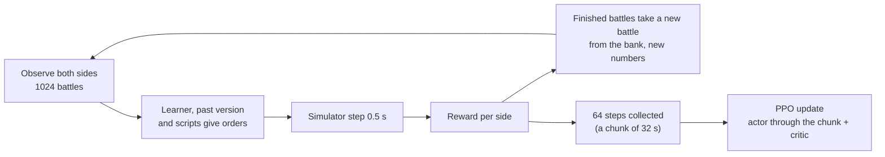

# Training the network

[← Back](README.md) · [Documentation](../README.md) › [Data for training](README.md) › Training · [Русский](../../ru/training/training.md)

Step 3 of the path ([network model](network.md)): PPO training of the [network](model.md) in the
[battle simulator](simulator.md). Built 30.09.2026; on 01.10.2026 reworked so the attacker attacks
(below), with a warm start, memory trained through time and random armies; the same day an
opponent modelled on the game's AI and measures against the policy's collapse to "attack only"
were added ([below](#against-the-games-ai-01102026)). The code is `tools/nn/train/` (PyTorch, runs
in the `snake-ai-trainer` container).

## How to run it

```bash
# 1. warm start: copy the scripts `nearest` and `ai_like` (random armies up to 19 units a side)
bash tools/nn/dock.sh tools.nn.train.imitate --minutes 5 --generated 19 --teacher nearest,ai_like \
  --out build/nn-train/runs/bcmix/bc.pt
# 2. PPO from it on random armies, small armies first; evaluate and record at the end
bash tools/nn/dock.sh tools.nn.train.run --name long_ai --minutes 80 --armies generated \
  --curriculum 5:0.15,10:0.4,19:1 --init build/nn-train/runs/bcmix/bc.pt --critic-warmup 8 \
  --lr 1.5e-4 --entropy 0.005 --entropy-end 0.001 --anchor 0.1 --anchor-end 0 \
  --mix '{"self": 0.1, "past": 0.15, "nearest": 0.2, "hold_shoot": 0.1, "hold": 0.05, "ai_like": 0.4}' \
  --eval-past build/nn-train/runs/long19/latest.pt
# evaluation alone: the fixed scenes, or random battles of EVAL_SEEDS per opponent (in swapped pairs,
# with the script baseline and the rating: "Network evaluation: fair metrics" below)
bash tools/nn/dock.sh tools.nn.train.evaluate --checkpoint build/nn-train/latest.pt --per-scene 128
bash tools/nn/dock.sh tools.nn.train.evaluate --checkpoint build/nn-train/latest.pt --generated 512 \
  --opponents ai_like,nearest,hold_shoot,past --against build/nn-train/runs/long19/latest.pt
bash tools/nn/dock.sh tools.nn.train.checkpoint                  # write an untrained random.pt
# the standard test of a change (below): before -> after behaviour report in build/nn-train/test5/<label>/
DOCK_NAME=t2-test5 bash tools/nn/dock.sh tools.nn.train.test5 --label mychange [-- run.py options]
```

Main options of `run`: `--name` (the folder under `build/nn-train/runs/`), `--init` (start from a
checkpoint), `--armies` (`scenes` or `generated`), `--curriculum`, `--battles` (at once, 1024),
`--steps` (decisions per chunk, 64), `--limit` (3600 s), `--lr`, `--anchor` and `--anchor-end`,
`--entropy` and `--entropy-end` (linear from the first to the second over the run),
`--critic-warmup`, the reward weights (`--timeout`, `--gold`, `--rout-share`, `--idle`,
`--idle-tau`, `--idle-pause`, `--idle-step`, `--idle-cap`, `--idle-share`, `--idle-rate`, `--idle-window`, `--hp`, `--standing`, `--order-cost`, `--lord`, `--lord-rout`,
`--retarget`; [gold](#losses-in-gold-and-the-attackers-idle-cost-01102026), [the loophole](#night-01100210-why-the-network-falls-apart-without-the-leash)), `--adv-norm`, `--reference self` and `--reference-every`, `--critic-init`, per-unit
credit (`--unit-credit` and `--unit-credit-end`, `--unit-gold`, `--unit-attrib`, `--shirk`, `--shirk-m`, `--shirk-side`, `--flanked`, `--missile-melee`, `--crowd`, `--flank-attack`, `--idle-near`, `--unit-idle`, `--lord-exposed`, `--lord-exposed-hp`,
`--neighbour`; [below](#per-unit-credit-01102026)), `--updates` (train that many updates instead of
`--minutes`, which then only caps the time), `--mix`,
`--small share:units` (that share of every bank of random battles with at most `units` a side),
`--eval-every` minutes / `--eval-opponents` / `--eval-battles` (evaluation on `EVAL_SEEDS` during
the run, both roles; the best mean win rate is saved as `best_eval.pt`, the evaluations in
`eval_log.jsonl`, their time not counted as training), `--eval-past` (the network behind "past" in
the final evaluation). The first steps compile for 1–3 minutes (seconds once a run of the same shapes
compiled them: [training speed](#training-speed)); the training time does not count them.

## What it writes

Everything goes to `build/nn-train/` (not in Git):

| File | What |
|---|---|
| `random.pt` | the untrained network (random weights), the untrained opponent |
| `latest.pt` | the network of the last run (the companion's default) |
| `runs/<name>/latest.pt`, `best.pt` | the run's last network; the one with the best window of training battles against the scripts |
| `runs/<name>/pool/v*.pt` | past versions: the opponents of self-play |
| `runs/<name>/log.jsonl` | one line per update: losses, entropy, KL, the weights of entropy and KL in force, reward and the same by term a minute of battle per role (`reward_parts`), the critic's quality (`ev`, per role), win rate by opponent and role, order changes, order kinds, lord deaths, target switches |
| `runs/<name>/eval.json` | the final evaluation |
| `runs/<name>/replays/*/` | battles of the final network, written like the game's recordings |
| `baselines/<opponent>_<units>u_<limit>s_<version>.json` | the script baselines of the evaluation ([fair metrics](#network-evaluation-fair-metrics)) |

**A checkpoint** (`tools/nn/train/checkpoint.py`) is one file, a dict saved by `torch.save`:
`format` (2), `kinds` (the order kinds in code order), `preset`, `config` (the network's sizes:
the actor is rebuilt from it), `actor` (its weights — all the game needs), `critic` (training
only), `meta`. `load_policy(path)` gives the actor ready to play; the
[companion](../apps/bridge.md) loads it so.

**Replays** are folders like a recorded run: `manifest.json` and `events.jsonl` with an
`nn_sample` every second and the `result`. `tools.nn.gamedata.load(folder)` reads them as a
game battle. `manifest.json` also says which side the network played and against whom.

## Test protocol (`test5`)

`tools/nn/train/test5.py`: the standard short test of a training change. Every change is closed
with it, so tests can be compared with each other.

1. **Before.** The starting network (`--init`, by default `runs/long_ai/best.pt`, 2 of 4 against
   the game's AI) plays the evaluation: 512 battles of random armies from `EVAL_SEEDS` (up to 19
   units a side) per opponent, 256 in each role, against `ai_like`, `nearest` and `hold_shoot`: 256
   seeds, each played twice, the network on either side ([swapped pairs](#network-evaluation-fair-metrics)),
   and the script baselines of the same battles (cached). All 1536 battles run in one batch
   (`evaluate.play(..., together=True)`), the same battles every time.
2. **Training.** 36 PPO updates (`--updates`; ~5 minutes on a free GPU) with the current code and
   the settings of the `long_ai2` continuation (`test5.PROTOCOL`: random armies up to 19 units,
   `--small 0.35:6`, KL to `bcmix` 0.06 → 0.03, entropy 0.003 → 0.001, the attacker's
   idle cost at `run.py`'s defaults, `long19` among the past versions) and the baseline's `--unit-credit 0` pinned, so
   tests stay comparable when `run.py`'s defaults change. Options after `--` go to `run.py` and
   override them: a task passes its own new settings there (`-- --unit-credit 0.3`);
   `report.json` keeps them all (`protocol`, `options`, `train_args`). A fixed number of updates, not minutes: on a GPU shared with other jobs an update took
   up to 290 s, and a 5-minute test learned 1–2 updates. `build/nn-train/latest.pt` is not touched.
3. **After.** The trained network plays the same evaluation.
4. **The report**, printed and written to `build/nn-train/test5/<label>/report.json` (with
   `before.json` and `after.json`, the whole evaluations): before → after per opponent and role.
   A trend run (`--updates 0 --minutes M --every K`) evaluates every K minutes of training too
   (their time not counted), keeps each network (`m<minute>.pt`) and evaluation
   (`eval_m<minute>.json`) and writes the table minute 0 / K / … / M (`trend.md`, `report.json`).
   Under the skill block it shows the **distance from the start** next to the overall rating:
   `start_kl`, the mean per-unit KL (order kind and target) of the actor to the network the run
   started from, on one minibatch of every update's training batch (`ppo.distance`, the `log.jsonl`
   field `start_kl`; mean and last value of the updates since the previous point), the mean anchor
   KL to the leash's reference, and how many times `--anchor-roll` renewed that reference
   (`test5.distance`, `distance` in each evaluation's json). A distance that grows while the rating
   rises means the search works; a rating flat while the distance stalls, a leash too short.

| Metric | What is counted (the learner's units; `tools/nn/train/behaviour.py`) |
|---|---|
| skill (the first block) | the [fair metrics](#network-evaluation-fair-metrics): the rating ± 95 % overall and per opponent, the fitted faction and attack edges, the pair score, the advantage over the script per matchup, the margin per matchup (`skill` of `metrics()`) |
| win rate | by opponent and role |
| by faction | per opponent: win rate of our faction (EMP, SKV) by role and of each matchup, ours first (EMP-EMP, EMP-SKV, SKV-EMP, SKV-SKV), with the battle count and the matchup's gold exchange ratio (`factions`, `matchups` of the evaluation; `tools/nn/train/matchups.py`); one block in `trend.md` |
| enemy gold destroyed, own gold lost / battle; gold exchange ratio | the gold of the reward ([below](#losses-in-gold-and-the-attackers-idle-cost-01102026)) at the end of the battle, mean per battle; the ratio is destroyed / lost over all the battles of the cell |
| own lord dead | share of battles that ended with the own lord dead |
| missile s in melee / battle, missile time in melee | seconds missile units (range > 0, not a lord) stand in melee, per battle and as a share of their standing time |
| own melee hit flank/rear | share of own melee unit-seconds struck in the flank or rear (the simulator's `flank_hit` ≥ 1; the game: a flank attack costs the defender ~×1.74 losses) |
| decisions with a pile | share of decisions with more than 2 own units on one enemy (attack order or the enemy fought) while another enemy strikes an own unit in the flank or rear |
| own melee into flank/rear | share of own melee unit-seconds striking a standing enemy from its flank or rear (the angle off its facing ≥ `contact.front_deg`, 60°) |
| target switches / min, order changes / min | per standing unit, per opponent |
| order kinds | shares of the learner's unit decisions |
| ability uses / battle | own abilities started (their cooldown set) |
| timeouts | share of battles at the time limit |

The "before" and the "after" each take ~10 minutes (the batch runs until its longest battle ends),
the training ~7: a test takes about half an hour. `--before PATH` reuses a "before" evaluation (only
while the simulator has not changed). Heavy GPU jobs take turns: the test waits while
`build/gpu-train.lock` exists (polled every 30 s), then holds it (its label and start time) until
it ends, also on failure; a test started within 60 s of a release (`build/gpu-train.released`)
waits out those 60 s first, so the jobs already waiting go before it. `DOCK_NAME` names the container (`dock.sh`). Noise: at 256 battles a role a
win rate moves by ±3 points (one standard error); 36 updates move the network little, so the test
shows whether a change breaks something and where the behaviour goes, not a final strength.

**Baseline** (`--label baseline`, the training before per-unit credit: `--unit-credit 0`; 01.10.2026):

| Metric | `ai_like` attack / defend | `nearest` attack / defend | `hold_shoot` attack / defend |
|---|---|---|---|
| win rate | 0.543 → 0.543 / 0.676 → 0.625 | 0.434 → 0.418 / 0.469 → 0.398 | 0.590 → 0.609 / 0.504 → 0.504 |
| own lord dead | 0.27 → 0.17 / 0.07 → 0.10 | 0.09 → 0.07 / 0.09 → 0.08 | 0.22 → 0.22 / 0.13 → 0.16 |
| missile s in melee / battle | 105 → 113 / 94 → 102 | 89 → 95 / 101 → 96 | 158 → 151 / 110 → 123 |
| own melee hit flank/rear | 0.35 → 0.36 / 0.36 → 0.38 | 0.35 → 0.37 / 0.39 → 0.40 | 0.26 → 0.27 / 0.33 → 0.35 |
| decisions with a pile | 0.064 → 0.074 / 0.110 → 0.108 | 0.077 → 0.085 / 0.087 → 0.100 | 0.055 → 0.058 / 0.121 → 0.124 |
| own melee into flank/rear | 0.28 → 0.29 / 0.30 → 0.31 | 0.25 → 0.26 / 0.27 → 0.28 | 0.27 → 0.28 / 0.29 → 0.30 |
| target switches / min | 0.66 → 0.96 | 0.76 → 1.13 | 0.69 → 0.97 |
| kinds hold / move / attack | 0.28 / 0.23 / 0.49 → 0.27 / 0.22 / 0.51 | 0.28 / 0.22 / 0.49 → 0.27 / 0.21 / 0.51 | 0.26 / 0.26 / 0.49 → 0.23 / 0.24 / 0.53 |

`best.pt` loses a third of its melee time struck in the flank or rear, its missile units stand in
melee ~100 s a battle, and in 6–12 % of decisions it piles more than 2 units on one enemy while
another enemy flanks it — the picture seen in the game. Ability uses (~4 a battle) are the lord's
abilities fired by the simulator's AI rule: `scenario.py` marks side 2 as played by the game's AI
by default, also when the learner plays side 2 (fixed: [lord abilities](#lord-abilities-01102026)).

## Network evaluation: fair metrics

The factions are unequal, and that is fine: the game is rock-paper-scissors. But it spoils the
measurements: in Empire–Skaven battles the faction decides most outcomes (at equal gold the network
won 59–79 % as the Skaven against the Empire and 24–50 % as the Empire against the Skaven; mirrors
~45–55 %), so a win rate says more about the matchups drawn than about the network. The evaluation
(`tools/nn/train/evaluate.py`, `test5`, the [gate](../launch/gate.md)) adds measures that take
the matchup out (`tools/nn/train/skill.py`, plain numpy); the old fields stay as they were.

| Measure | How it is counted |
|---|---|
| **Swapped pairs**, `pairs` | Every generated evaluation battle is played twice on the same armies: the network on side 1, then on side 2 (the opponent takes the other). The same army attacks in both, so the network's role swaps too. A pair is won both / split / lost both; `pair_score` = P(won both) − P(lost both). `generated` battles an opponent are `generated / 2` seeds × 2 (`pair_count`: even, at least 2). The scenes already play each scene from both sides: their pairs are counted too. `hold` (attack-only) has no pairs. |
| **Advantage over the script**, `baseline` | The same battles played by the opponent script against itself (`ai_like` against `ai_like`, …): the matchup's natural edge. Per battle the network minus the script, same armies, same side: the win and the gold exchange (`trade` = (enemy gold destroyed − own gold lost) / budget), per matchup and overall (`win_adv`, `gold_adv`, with `win_net`, `win_script`, …). The script plays both sides, so both battles of a pair are one script battle: one per seed. |
| **Rating**, `skill` | One ridge logistic (Bradley–Terry) fit over all battles of the evaluation: P(win) = σ(r_opponent + edge(ours, theirs) + a · (+1 attack, −1 defend)), r = skill_net − skill_opponent in logits; the faction edge is antisymmetric (EMP-SKV = −SKV-EMP, 0 in mirrors); a Gaussian prior with sd 3 on every parameter keeps all-wins finite; the 95 % interval from the inverse Hessian. `overall` = the mean of the opponents' ratings: **the single trend number**. 0 is even with that opponent in a mirror, roles balanced; +0.4 ≈ 60 %. |
| **Margin**, `margin` | The winner's gold left / its starting gold (the reward's gold: health lost, a routing unit by `rout_share`), + when we win, − when we lose: a continuous score; the mean per opponent and per matchup (`matchups[...]["margin"]`). |
| **Pair gold**, `pair_gold` | Most pairs are split 1:1, which hides the skill; the gold does not. In a pair the network plays army A in one battle and army B in the other, the opponent the other way round, so both pairs of hands get the same two armies. `pair_gold` = (enemy gold destroyed by us in both battles − by the opponent in both) / budget, the mean ± 95 % over the pairs; it equals our trade with an army minus the opponent's with the same army, for either army. `exchange`: the same as a factor, exp(mean log(our destroyed / lost with an army) − log(the opponent's with it)) with its 95 % interval (gold floored at 1 % of the budget; ×1 = even hands). `weak` / `strong`: the army we did worse with (the lower margin; in a split pair the one that lost both), its destroyed / lost summed over the pairs and its mean trade in our hands vs the opponent's (`ratio_net`, `ratio_opp`, `trade_net`, `trade_opp`): how well each pair of hands gets value out of a losing army. In the [gate](../launch/gate.md) the gold comes from each unit's end state (the last `nn_final`, else `nn_sample`, of `events.jsonl`) × its passport cost (`config/nn/units.json`), counted as the reward counts it. |

`evaluate.play(..., paired=True, baseline=False)`: pairs are the default for generated battles
(`paired=False`, `--no-pairs`: each battle once, as before); the baseline is on in `test5` and in
`python -m tools.nn.train.evaluate` (`--no-baseline`), off in `run.py`'s evaluations, never with
`--small` (the armies' sizes would differ). The result keeps the per-battle lists (`battles`: won,
factions, role, side, pair, seed, margin, trade, destroyed, lost, budget) for a refit.

**Pairs in the batch.** `scenes.Generated` sets a battle's role (side 1 attacks at even positions)
and size (`small`: the first share of the bank) by its position, so the batch is laid out in blocks
of four battles `[p, q, p, q]` (two pairs; the network on side 1, then on side 2), the blocks cycling
through the opponents (`paired_order`); with `small` the bank is padded at its end so the small
share ends at a block (`padded`).

**The baseline cache.** `build/nn-train/baselines/<opponent>_<units>u_<limit>s_<version>.json`, per
battle: seed, winner, gold lost and starting gold per side, budget, factions, attacker. `version`
is a hash of what a script battle depends on (`evaluate.VERSION_FILES`: the simulator, the army
generator, the scripts, the reward, `config/nn`; and the budget factors as loaded), so a change
there plays the baselines again; a file of more seeds serves a prefix. The 768 script battles (256
seeds × 3 opponents) take a fraction of the network's own evaluation time.

**The report.** `evaluate` prints the skill block after its table; `test5`'s `report.json`
(`before`, `after`, `trend`: `skill`) and `trend.md` start with it:

```
| skill | min 0 | min 10 |
| rating, overall (logit, ± 95%) | -0.05 ± 0.12 | ... |
| rating, ai_like | +0.25 ± 0.21 | ... |
| faction edge EMP-SKV (fitted) | -0.70 | ... |
| pair score (both/split/neither), ai_like (n 192) | +0.120 (0.21/0.69/0.09) | ... |
| vs script win / gold adv, ai_like EMP-SKV (n 86) | +0.047 / +0.008 | ... |
| margin, ai_like all / EMP-EMP / EMP-SKV / SKV-EMP / SKV-SKV | +0.019 / +0.052 / -0.165 / +0.177 / +0.005 | ... |
```

**The check, 02.10.2026.** `build/nn-train/test5/it1/m10.pt`, 384 battles per opponent (192 pairs)
against `ai_like`, `nearest` and `hold_shoot`, the Skaven budget factor 1.0 and 0.9 (overridden in
memory; `build/eval_fair/`; the pools of 02.10 with the Empire's shielded units):

| | Skaven ×1.0 | Skaven ×0.9 |
|---|---|---|
| win rate EMP-SKV / SKV-EMP, `ai_like` | 0.314 / 0.733 | 0.686 / 0.407 |
| win rate, the network on the Empire / on the Skaven (all opponents) | 0.419 / 0.558 | 0.581 / 0.407 |
| win rate, all (paired) | 0.488 | 0.495 |
| faction edge EMP-SKV (fitted) | −0.70 | +0.72 |
| **rating, overall** | **−0.05 ± 0.12** | **−0.02 ± 0.12** |
| rating fitted on the Empire's battles / on the Skaven's | −0.04 ± 0.22 / −0.06 ± 0.23 | +0.00 ± 0.22 / −0.14 ± 0.22 |
| rating `ai_like` / `nearest` / `hold_shoot` | +0.25 / −0.55 / +0.13 (± 0.21) | +0.24 / −0.30 / −0.01 (± 0.21) |
| pair score `ai_like` / `nearest` / `hold_shoot` | +0.12 / −0.26 / +0.06 | +0.12 / −0.14 / −0.01 |
| win advantage over the script `ai_like` / `nearest` / `hold_shoot` | +0.06 / −0.13 / +0.03 | +0.06 / −0.07 / −0.00 |

10 % of the Skaven's gold flips the cross matchups: a matchup's win rate moves by up to 0.37, the
win rate of the network's battles on one faction by 0.16. The fitted faction edge takes it
(−0.70 → +0.72); the overall rating moves by 0.03 (its interval ±0.12), fitted on one faction's
battles alone by 0.04–0.08 (±0.22). Within one run the win rates of the mixes (the Empire's side,
the Skaven's side, cross matchups, mirrors) span 0.42–0.56, their ratings −0.06…−0.04. The paired
overall win rate holds too (0.488 → 0.495), because the pairs balance the sides; an unbalanced mix
does not. Per opponent the measures move within about 1.5 of their intervals (`nearest`
−0.55 → −0.30; the armies, so the battles, differ between the two runs). What it says about `m10`:
about even with the scripts overall, ahead of `ai_like` (+0.25; +6 points over `ai_like` playing
itself), behind `nearest` (−13 points against `nearest` playing itself).

### Liveliness

Units that change orders and targets too often look artificial. Measured only (no reward), per
opponent and role, in every evaluation (`tools/nn/train/behaviour.py` Tracker; `test5`'s report and
trend.md, block "liveliness") and in the gate from the game's recordings (`tools/nn/gate.py`):

| Number | What |
|---|---|
| order changes / unit-min | a new kind, a new attack target or a move point more than 10 m away (as the order cost counts them); the simulator's own attack → hold when the target dies is not one |
| attack-target switches / unit-min | a new attack target while the old one still stands |
| flips A→B→A / unit-min | a change back to the order before the previous one within 10 s |
| move-point jitter, m | the mean distance between successive points of a unit that keeps moving (more than 5 m apart: the bridge gives no nearer one); re-points per moving minute |
| changes out of melee / unit-min; units twitching | the changes of a standing unit out of melee; the share of units with 30 s or more out of melee that change orders there 6 times a minute or more |
| own target switches / unit-min (1 s) | the unit's current target (whom it fights or shoots) changing between whole seconds, as the game samples it; also the opponent's units: in the game the game's AI is the reference band |

In the game (gate of `it2/m15`, 8 battles, attack / defend): 15.4 / 16.1 order changes a unit-minute,
5.8 / 4.9 attack-target switches, 6.4 / 5.9 flips, move jitter 18 / 36 m, every unit twitching; the
units' own target switches 3.19 a unit-minute (battles 0.53–6.84) against the game's AI's 1.26
(0.38–2.76). The same network in the simulator (32 battles an opponent, CPU): 5.1–5.9 order
changes, 0.7–1.4 switches, 0.9–1.4 flips, jitter 61–89 m, 43–57 % of units twitching, own target
switches 0.6–1.1 (the scripts' 0.5–1.0): in the game it changes orders about three times as often.

### Capacity and forgetting

When to widen the network (×2): `tools/nn/train/capacity.py`, at the end of every `test5` run (block
"capacity and forgetting", report.json `capacity`), or on a finished folder in `.venv`:
`python -m tools.nn.train.capacity build/nn-train/test5/<label> [--prev <folder or report.json>]`.
Nothing is played.

- Forgetting: the final evaluation against the previous iteration's (`--prev-report`, else the
  folder of `--init`, else the label with its number one less) and against minute 0 of this one:
  per opponent the pair score and pair gold, per matchup the win rate and gold trade, per our
  faction and role the win rate (higher is better; 5 points = 0.05). Same battles are matched
  (opponent, seed, side) and the noise is the paired difference's error; an older evaluation
  without the per-battle lists is compared with its own errors. A drop of 5 points or more beyond
  2.58 standard errors (about 40 numbers are compared) is "forgetting", a drop of 5+ within the
  noise "drop?". Against the previous iteration it counts only with the same simulator version
  (the script baseline's cache name), else it is "drop?".
- The training log: explained variance, value and policy loss (the late half's slope: a plateau
  within 2 errors of 0), entropy, grad norm (`ppo.update` logs `grad_norm`, the actor's norm before
  clipping, and `grad_norm_critic`, from 02.10), kl, clip; early third → late third.
- Verdict: **widen-candidate** when old numbers drop beyond noise while others rise beyond noise
  and the overall rating does not (interference: new skill at the cost of old); **watch** for
  forgetting with a rising rating (a trade-off), forgetting with nothing rising (the training loses
  skill: settings first), drops within the noise, a plateau of rating and value loss, a falling
  critic, an entropy collapse, a rising grad norm; else **ok**.

On `it2` (02.10): within the iteration 3 of 51 numbers drop beyond noise (worst `hold_shoot` EMP
defend −15.6 points ± 12.4), none rises, the rating −0.06 → −0.16 (± 0.15) — **watch**: the
training loses skill, the size is not the first suspect; against `it1` only "drop?" (its
evaluation has no simulator version, and the Skaven budget and the armies changed since).

## Drills

Curriculum battles that teach one skill each (02.10.2026; code `tools/nn/train/drills/`). A drill is
a **frame** — a condition — and every battle inside it is generated from a seed: random rosters and
unit types that satisfy the condition, sizes, distances, the place and bearing of the whole battle on
the map (within 700 m of the centre), and which side we play (half side 1, half side 2). The drill's
enemy is a script (a league opponent `drill_<name>`); the network plays it on that drill's battles
only. Drills change *which battles* the network plays: there is no imitation term (a teacher acts as
a leash). Each drill keeps a `skilled` script, so an annealed imitation term per drill can be added
later with it as the teacher.

**Verification before a drill trains anything** (`tools/nn/train/drills/verify.py`): two scripts of
ours play ≥ 256 generated battles of the drill against its enemy, with the training's randomised
numbers (`randomise.Spread()`); the naive script must lose clearly (win rate ≤ 0.25), the script
that uses the skill must win clearly (≥ 0.75), else the frame is retuned. Only drills that pass are
in `drills.READY`, the default of `--drills`.

```bash
bash tools/nn/dock.sh tools.nn.train.drills.verify --drill pincer,kiting --battles 256 --show 4
# training: 8 % of the battles are drills, equally (or --drill-weights '{"kiting": 2, "defend": 1}')
... tools.nn.train.run ... --armies generated --drills 0.08
```

How it plugs in: `league.with_drills` takes `--drills` of the mix from the other opponents in
proportion and shares it by `--drill-weights`; `drills/source.py` `Mixed` builds one bank of the
generated battles and every drill's battles (`--drill-bank` per drill, renewed with the bank), and a
drill row restarts as a battle of its drill with our side = the side the learner plays in that row.
A drill battle runs under the standard battle limit, as every training battle (the user's rule, 03.10.2026: the network sees no time limit, so a drill must be won or lost by the fight; per-drill limits were a crutch: the counter drill's naive play lost only on its 300 s clock and won at 900 s). In the training log the drills appear as opponents (`drill_pincer/attack`
...). `test5` evaluates every verified drill (`--drill-eval`, 128 battles each on
`DRILL_EVAL_SEEDS`): win rate and gold trade per drill, with the two check scripts on the same
battles beside them, in the report and in `trend.md` — so the trend shows whether the network
learns each skill.

| drill | frame | enemy | naive (win / gold trade) | skilled (win / gold trade) | status |
|---|---|---|---|---|---|
| `counter` | Empire v Empire, two pairs in random order along the line, 110–200 m apart, 20–60 m between the pairs: our X opposite its counter C (its nearest enemy), our Z (which beats C) opposite Y; (X, Z, C, Y): spearmen + flagellants v flagellants + shield spearmen / swordsmen; shield spearmen or swordsmen + greatswords v greatswords + flagellants; spearmen + greatswords v greatswords + swordsmen (picked from all same-faction pairings run 2 v 2 in the simulator); we attack, the standard limit | holds; a unit whose opponent broke presses the nearest of ours | `nearest`: 0.215 / +0.06 (X breaks on its counter, which joins the other fight) | each unit on the enemy it beats (passport matchup: the scarcest, then the most dangerous): 0.867 / +0.22 | verified, 256 battles, decided by the fight (no timeouts); on the evaluation seeds the skilled script attacks its correct target 98 % of the time, naive 53 % (36 % on its counter), first correct order 0.5 s v 150 s; in `READY` |
| `pincer` | 2–3 Empire greatswords holding 120–180 m apart (each its own fight); two of ours per greatsword in a column opposite it (the second 35–55 m behind), 140–240 m away, all Empire swordsmen or all Skaven clanrats (clanrats: at most 2 greatswords); we attack (verified with a 420 s limit: to re-check at the standard limit). Piled on the front two of ours lose to a greatsword unit, front + flank beat it | `hold` | `nearest`: 0.223 / +0.06 (the pair piles on the front) | the nearer unit pins in front and waits, the other goes round to the open flank, then both attack: 0.922 / +0.40 | needs the flank rule (`build/sim-pending/flank.json`, left out of the simulator): with the current simulator both 0.00 (a flank attacker strikes no harder than a frontal one); with the flank rule 0.281 / 0.922 (256 battles: naive above 0.25, fails); not in `READY` |
| `hold_fire` | our infantry unit (spearmen, shield spearmen, swordsmen; clanrat spearmen, clanrats) in contact with the enemy's lord; 2–3 of our shooters 70–95 m behind it — Empire archers (with 2 free enemies), Skaven Night Runners (1–2) or slave slingers (1); the free enemies: missile units of the enemy's faction 65–95 m beyond the end of our shooters' line; we attack, the standard limit (900 / 1800 s: naive 0.10, skilled 0.83, no timeouts). In the simulator fire into the melee around a lord costs us 1.5–3.5x what it costs him (slings worst); into an ordinary or armoured unit it pays | melee units attack the nearest, missile units hold | our shooters focus the lord in the melee: 0.066 / −0.59 | our shooters shoot the free enemies; with none left they step out of range of the melee and hold: 0.848 / +0.37 | verified, 256 battles, current simulator; in `READY` |
| `kiting` | 1–2 Skaven Night Runners (run 5.4 m/s, sling 140 m) against Empire melee infantry (run 3.0 m/s): one swordsmen unit against one of ours; against two, two swordsmen or three of spearmen, shield spearmen, swordsmen; a line apart, facing; we attack (running away until the limit loses), the standard limit | every unit runs at our nearest missile unit | `hold`, stand and shoot: 0.059 / −0.24 (the chasers reach us and win the melee) | shoot while the nearest chaser is far, run back when it comes near, halt and shoot again (each halt gives a volley of the men reloaded meanwhile): 1.000 / +0.86 | verified, 256 battles, current simulator (needs the volley rule, in since the batch); in `READY` |
| `defend` | built, being tuned | | | | not in `READY` |

`READY` = `kiting`, `counter`, `hold_fire`: `--drills 0.08` gives each ~2.7 % (the chain's runs name their drills with `--drill-weights`).

## How a training step goes



Modules: `scenes.py` (where battles come from: the arenas or random armies, as a bank of ready
starts), `league.py` (who plays whom, the pool), `opponents.py` (the scripts, `ai_like` among them), `randomise.py`,
`reward.py`, `rollout.py` (the battles and one step), `ppo.py`, `imitate.py` (the warm start),
`evaluate.py` (evaluation and replays), `checkpoint.py`, `run.py`.

## Training speed

Measured 02.10.2026 on the RTX 5070 Ti with the chain's settings (`fix45d`: 1024 battles, up to
19 units a side, 64 decisions per update, `--unit-credit 0.3`, KL to a reference; scripts
`build/speed/` outside Git):

| | before | after |
|---|---:|---:|
| one update: collecting 64 decisions | 3.5 s | 1.4 s |
| one update: PPO (31 minibatches) | 4.8 s | 4.2–4.4 s |
| battle steps a second | ~7 850 | ~11 300–11 700 |
| updates a minute | 7.2 | ~10.3 |
| warm-up (compiling) of a run | ~100 s | 13 s once compiled before (cold: 160–170 s) |
| a standard evaluation (512 battles × 3 opponents) | 290–400 s | 155 s (cold compile: 260–270 s) |
| `test5` trend run, 45 minutes of training, 3 evaluations | ~69 min, 274 updates | ~56 min with ~460 updates; the same 274 updates in ~37 min |

Where the time went (one update before the change; regions timed with a synchronisation each):
collecting was launch-bound (GPU ~45 % busy): the scripted opponents uncompiled 0.88 s, the
actor's / critic's / past version's passes 1.3 s, rewards and counters 0.7 s, sampling 0.24 s,
while the simulator's step (0.23 s) and the observation (0.17 s) were already compiled. The PPO
update was GPU-bound (~85 %): the backward pass 2.9 s, the actor's forward 0.86 s, the reference's
0.79 s, the critic's 0.47 s.

What changed (none of it changes the numbers beyond float rounding; checked below):

- **Compiled bookkeeping** (`rollout.fast()`, CUDA only): the scripts and the assembly of orders,
  the order costs, the rewards and their counters, the per-unit reward, `reward.measure`, the
  actor's decision (forward, sampling, orders) and the critic's values in collection, the
  log-probability, and the behaviour tracker of evaluation. Inside a compiled graph the ability
  encoder and head take every slot and mask the unowned (`torch.compiler.is_compiling()`); eager,
  they still pick the owned slots with `nonzero`.
- **No reads of GPU values in the hot loop:** `torch.distributions` without argument validation
  (it synchronised ~10 times a decision), battle and timeout counters kept on the GPU, order
  placement by index tensors made once, kind counts by comparison instead of `bincount` /
  `one_hot`.
- **The memory through the chunk** (`TokenMemory.scan`): the norm, the masks and the residual of
  the GRU run on all 64 steps at once, only the cell steps one by one; `unbind` instead of `x[t]`
  (the backward of each `x[t]` filled a zero tensor of the whole chunk). Exactly the same numbers.
- **The attention bias** is made once in memory aligned for the attention kernel (it was copied in
  every layer, forward and backward).
- **The compile cache:** `tools/nn/dock.sh` keeps `torch.compile`'s kernels in the Docker volume
  `tww3-torch-cache` (`TORCHINDUCTOR_CACHE_DIR`, `TRITON_CACHE_DIR`).

Tried and not kept: bf16 autocast in the update was slower (5.06 s against 4.62 s) and moved the
log-probabilities from the rollout's by ~2·10⁻³ on average (TF32: 2·10⁻⁵), as much as a real
update's KL; compiling the actor's blocks and the critic for the update gave nothing (4.60 s); the
GRU's input weights hoisted out of the loop through the fused cell were slower. TF32 was already on
in training (`allow_tf32`).

**Same in distribution.** The compiled functions against the eager ones on the same states (300
decisions of 512 battles): rewards, order costs, counters, orders equal to ~10⁻⁴; the critic's
values within TF32 rounding. Sampling of the compiled decision against the logits: kind 0.0408 /
0.9592 against probabilities 0.0408 / 0.9592. Short fixed-seed runs (6 updates, seeds 1–3, the
old code against the new): value mean after 6 updates 0.208 / 0.136 / 0.061 against 0.293 / 0.203 /
−0.025, the per-unit value loss 20–26 against 21–25, the rest alike; two runs of the old code with
the same seed already part after 4 updates. Evaluation of `fix45d/m45` (512 battles a role and
opponent): `ai_like` 0.531 / 0.574 before, 0.547 / 0.551, 0.512 / 0.551 after; `nearest` 0.457 /
0.395 → 0.438 / 0.426, 0.449 / 0.402; `hold_shoot` 0.547 / 0.449 → 0.570 / 0.426, 0.562 / 0.430 —
within the ±3 points of noise.

**Evaluation: only the running battles (02.10.2026).** An evaluation runs until its longest battle
ends: after ~1 600 decisions fewer than 5 % of the battles are alive (often stand-offs to the
60-minute limit), and every decision still cost ~22 ms for the whole batch. Now, once at most 64 are
left, the batch shrinks to them (`rollout.Battles.narrow`: the state, setup, memories, the pending
observation per battle; padded with ended battles, which stay frozen; `evaluate.BUCKETS`, one fixed
size so the compiled graphs stay few), and the shrunk batch's decision is replayed as one CUDA graph
(`evaluate.Graphed`: at 64 battles a decision was ~10 ms of kernel launches, the replay ~2.8 ms). The
results read the whole batch back (`evaluate._Full`); the script baselines shrink the same way.
`play(compact=False, cuda_graph=False)` steps as before.

| `test5` evaluation (1536 battles, `it2/m15.pt`, warm compile cache, baselines from cache) | wall time |
|---|---:|
| before: the whole batch to the end | 180 s |
| shrunk to 64 | 133 s |
| shrunk to 64 + CUDA graph | 65 s |

The same seeds give the same battles: the simulator is deterministic and an ended battle frozen; the
graph's replay gives bit for bit the same battles as stepping (sampled and greedy); against the whole
batch only the tail's random draws differ (the batch's shape sets them): 1533 of 1536 outcomes the
same, win rates 0.520 / 0.361 / 0.447 against 0.520 / 0.361 / 0.441. Cost: a new code version
compiles the 64-battle graphs once (~75–100 s, then in the torch cache). Not tried: a graph for any
batch size (`dynamic=True`) does not build — the simulator's step then needs a C++ compiler the
container lacks. The whole-batch phase (~35 s, ~22 ms a decision, GPU-bound) is unchanged. In the
update, the GRU's 64 steps and the attention's float32 backward remain the main cost.

## Decisions

**2 decisions a second** — one decision per simulator step (0.5 s). The step is the game's morale
tick ([simulator](simulator.md)); a faster decision would see nothing new. It is also the in-game
rhythm: the state at tick N, the order at tick N + 0.5 s. So a 10-minute battle is ~1200 decisions.

**Battles.** Two sources, both a bank of ready starts from which a finished battle takes a new one:

- the scenes: the Empire mirror arena, Empire against Skaven and Skaven against Empire
  (`config/nn/arenas.json`), each with side 1 attacking and defending;
- random armies of the [army generator](armies.md) (`tools/nn/armies`): equal budget (Skaven 0.8 of it), a lord and
  up to `max_units` units a side, half the bank with side 1 attacking. Training seeds only; the
  bank is renewed every 5 minutes; evaluation uses `EVAL_SEEDS`, never trained on. Curriculum:
  up to 5 units a side for the first quarter of the time, 10 for the second, then 19.

The learner plays side 1 in some battles and side 2 in others: every army in both roles. The
network sees the map as the game shows it (the Crossroads minimap frame, as the companion), not
the simulator's square.

**Opponents** (shares of the long run `long_ai`; `long19` before it: `nearest` 40 %, `hold_shoot` 25 %, `hold` 10 %, no `ai_like`):

| Opponent | Share | What it does |
|---|---:|---|
| itself | 10 % | the learner on both sides; both give training data |
| a past version | 15 % | one network from the pool, drawn again every 2 updates; the untrained one stays in the pool |
| `ai_like` | 40 % | modelled on the game's AI ([below](#the-opponent-ai_like)): a line that runs in together, missile units halt at range and shoot the enemy lord first, the lord in the line and never first, a charge from 80 m (attacker) or counter-charge from 100 m (defender), free units against enemies already fighting (via their flank) and missile units |
| `nearest` | 20 % | every unit attacks the nearest standing enemy, running |
| `hold_shoot` | 10 % | holds and shoots; a melee unit counter-charges an enemy within 80 m; as the attacker it attacks after 5 minutes |
| `hold` | 5 % | holds (shoots at will, fights back); met only as the defender — as the attacker it would only wait out the hour |

The game's AI takes no part in training: it stays an independent check ([network model](network.md#readiness)).

**Reward** (`reward.py`) of a side:

| Term | Weight | Why |
|---|---:|---|
| win / loss | +1 / −1 | the goal |
| time limit (both sides still stand) | defender +1, attacker **−1.5** | worse than losing a fight: an attacker that only stands must lose more than one that attacks and fails |
| (enemy gold destroyed − own gold lost) / budget, per step ([gold](#losses-in-gold-and-the-attackers-idle-cost-01102026)) | 1.0 | a steady signal long before the end, by what the units are worth; replaces the two terms below |
| enemy health lost − own health lost, per step, as a share of the side's start | 0 (was 0.5) | in gold now |
| enemy army (by cost) that stopped standing − own, per step | 0 (was 0.5) | in gold now (a routing unit counts half of what it has left) |
| the attacker, each decision none of its units fights in melee or shoots (marching too) | 0.0002 × m: before its first damage m = exp(t / 150 s) − 1; after it 0 while it deals damage, then a step up every 30 s without damage, m = exp(0.5 k) − 1; m at most 20 ([below](#losses-in-gold-and-the-attackers-idle-cost-01102026)) | deploying and marching are nearly free (3 minutes: −0.07), standing on is not (10 minutes without damage: −2.2, more than the −1.5 at the limit); a pause in the fight costs little only while it is short |
| each real order change of a unit, divided by the side's units | 0.001 | against jitter (below) |
| the enemy lord died − own lord died | 0.3 | the game's morale rule makes it decisive (−16, then −10 points to every unit); the lord's cost share alone (in "stopped standing") does not show it; in the gate battles the network sent its lord in alone |
| each switch of an attack to another target while the old one still stands, divided by the side's units | 0.003 | hysteresis: in the gate battles units switched between two targets every 1–2 s |

The win, gold and lord terms are zero-sum (side 2 gets minus side 1's) except at the time
limit. The shaping terms are potential differences: they do not change which outcome is best.
No style terms yet: the faction characters are placeholders. Beside the side's reward each unit has
its own (`reward.unit_step`, [per-unit credit](#per-unit-credit-01102026)); it does not enter the
side's reward.

**The order `keep`.** The network may give a unit no new order: `keep` (kind code 4) leaves the
order in force; a unit with no order holds. A real change is a new kind, a new attack target, or a
move point more than 10 m from the one in force; `keep` and the same order again cost nothing. With
0.001, a unit that changes its order every decision costs its side ~1.2 in a 10-minute battle, more
than a win; one change every 5 s costs ~0.12.

**Warm start** (`imitate.py`): before PPO the network copies scripts (behaviour cloning) in
battles where each side plays a random script (the teachers 70 % of the time); the sides a teacher
plays are copied: order kind (hold, move, attack, withdraw), target, the move point (the nearest
point bin of the network) and run. `long19` copied `nearest` alone (6 minutes: 100 % of the kinds,
99 % of the targets); `long_ai` copies `nearest` and `ai_like` together (5 minutes: 99 % / 98 %) —
see [below](#against-the-games-ai-01102026) why. From random
weights PPO did not get an army that fights as one in 10 minutes (the rounds below); the copy
starts where the best script is. The teacher is our own script, not the game's AI, so the check
against the game stays independent. Then PPO: the critic learns alone for 8 updates (it starts
from nothing while the actor already plays), and a KL term holds the policy near the copy
(`--anchor`, 0.1) so PPO's noisy steps do not wash it out; in `long_ai` it fades to 0 over the run
(`--anchor-end`), so the copy does not lock the policy.

**PPO** (`ppo.py`), MAPPO style: each own unit is an agent with its own probability ratio; all
units of a side share its advantage, and each adds its own ([per-unit credit](#per-unit-credit-01102026));
the critic sees the whole field (and is never shipped).

| Setting | Value | Why |
|---|---|---|
| discount γ | 0.9997 per decision | a horizon of ~3300 decisions (~28 min): a win 10 minutes away still counts 0.7 (with 0.999, 0.3) |
| GAE λ | 0.95 | the usual |
| clip | 0.2 | the usual |
| learning rate | 1.5e-4, Adam (eps 1e-5) | from the copy, larger steps without the anchor drifted to standing within 15 minutes |
| epochs, minibatch | 1, 4096 decisions (whole chunks) | the update costs more than the battles; the memory of a 16 GB card |
| stop at KL | 0.05 per unit | a guard against a too large step |
| entropy of the order kind | `long19` 0; `long_ai` 0.005 → 0.001 | with only `nearest` copied a bonus of 0.01 pushed the policy off attacking and lost it half its wins; from a copy of two scripts it keeps hold / move / withdraw alive |
| KL to the copy | `long19` 0.1; `long_ai` 0.1 → 0 | see the warm start |
| value loss, gradient norm | 0.5, 0.5 | the usual |

- **Memory (GRU) through time.** A rollout is a chunk of 64 decisions (32 s of battle) of every
  battle; the update runs the actor over each chunk from the memory stored when the chunk began,
  emptied where a new battle begins (recurrent PPO, R2D2's stored state). Only the GRU steps one
  by one; the layers before and after it run on the whole chunk at once.
- **Events in the input** ([inputs](model.md)): per unit how lately it fought in melee and routed
  (enemies: while seen); own and enemy lord slain and how lately (the game announces it).
- **Masks.** Dead, routing and padding units give no loss; invalid orders are masked by the
  network itself (attack without a visible enemy, orders to a unit that cannot take them).
- **Time limit 60 minutes**, as in the game: the defender wins at it.
- **Domain randomisation** (`randomise.py`): per battle, damage, speed and leadership are
  multiplied by 1 ± 15 % (the same for both sides) and by 1 ± 5 % per side; the start places move
  by up to 5 m. The network does not see the factors.
- **Speed.** The observation is compiled with `torch.compile` (8 ms → 0.6 ms for 1024 battles):
  one decision of 1024 battles, both sides, with the simulator step, takes ~32 ms.

**Evaluation** (`evaluate.py`): whole battles to the end against each opponent, the learner's side
alternating (both roles), the simulator's own numbers, starts moved by up to 2 m, orders sampled as
in training; `hold` only as the defender. Scenes: `--per-scene` battles per scene; random armies:
`--generated` battles of `EVAL_SEEDS`. Per opponent and role also the share of battles that ended
with the own / the enemy lord dead, the order kinds and attack target switches a minute.

## Losses in gold and the attacker's idle cost, 01.10.2026

**Losses by gold, not health** (`reward.gold_lost`, `gold_sides`, `budget`). A unit is worth its
`multiplayer_cost` (`config/nn/units.json`); the gold it has lost is that cost × the share of it lost:

| The unit | Share lost | Why |
|---|---|---|
| fighting | its health lost (`1 − hp_abs / hp0`) | for a unit of many men health and men fall together (kills take men as damage takes health), so it is about the men lost, without the step of a whole man; for a single entity (a lord, a monster) men drop 1 → 0 only at its death, health shows the damage before |
| dead, gone off the map, shattered | 1 | it never comes back |
| routing (not shattered) | health lost + 0.5 × what is left (`--rout-share`) | it is out of the fight now, but it may rally; a rally gives the half back (the term is not clamped: a potential difference) |

The side's term, per step: `gold` × (enemy gold destroyed − own gold lost) / budget, budget = the
mean of the two armies' starting cost (the same for both sides, so the term is exactly zero-sum).
Weight 1.0: the old `hp` 0.5 + `standing` 0.5, the same scale — a battle's worth of shaping is at
most about ±1, the win stays the main signal. `hp` and `standing` are 0 by default: the gold term
holds both the health and the routs, and keeping them would count the same loss twice. The lord
term (0.3) stays: it is the morale shock of the lord's death (−16, then −10 points to every unit),
not his gold. The per-unit term (`--unit-credit`) is in gold too (`unit_gold`, the table below).
Friendly fire (02.10.2026, `Weights.friendly_fire` 1): in `unit_gold` the gold a unit's projectiles
take from its own side is the shooter's loss, not the loss of the unit hit (simulator `missile.friendly`:
`ff_dealt` / `ff_taken`); the side's reward pays it either way. Gate it4: four slinger units shot the
enemy Warlord in melee with our spearmen for 119 s; ~2 HP of our own per shot in the game and in the
simulator alike (game 2.3 / 1.8, simulator 2.3 / 1.8 for the game's AI's and our shooters).

**The attacker's idle cost: exponential in time, set back by damage** (`reward.idle_cost`,
`idle_scale`, `struck`). The attacker pays 0.0002 (`--idle`) × m each decision in which none of its
units fights in melee or shoots — marching at the enemy too (the morning's waiver for closing in,
`reward.closing` and `--close-speed`, is gone; so is the linear `--idle-ramp`). m:

- before its first damage: m = exp(t / 150 s) − 1 (`--idle-tau`): almost nothing for the first
  minutes (time to deploy and march), then sharply more;
- after it: 0 while it deals damage; with no damage for 30 s (`--idle-pause`), k = ⌊seconds since
  the last damage / 30 s⌋ and m = exp(0.5 k) − 1 (`--idle-step`): a step up every 30 s, faster than
  the first curve at the same seconds and without its grace; new damage sets it back to 0;
- at most 20 (`--idle-cap`): 0.004 a decision, 0.48 a minute.

Damage is any health the defender loses in a step (`reward.struck`, `measure` column 0: only the
attacker's melee, missiles and abilities take it). `rollout.Battles.last_hit` [B] keeps the battle
time of the attacker's last damage per battle (−1 before the first) and clears it when the battle
starts again. The defender never pays. The cost, 2 decisions a second:

| No damage from the start | a decision | so far |
|---|---:|---:|
| 1 min | 0.0001 | 0.006 |
| 3 min | 0.0005 | 0.07 |
| 5 min | 0.0013 | 0.26 |
| 10 min | 0.004 (the cap from 7.6 min) | 2.2 |
| 15 min | 0.004 | 4.6 |

| A pause after damage | a decision from then | the pause so far | the first curve at as many seconds |
|---|---:|---:|---:|
| 30 s | 0.00013 | 0.000 | 0.001 |
| 60 s | 0.00034 | 0.008 | 0.006 |
| 90 s | 0.0007 | 0.03 | 0.013 |
| 120 s | 0.0013 | 0.07 | 0.03 |
| 180 s | 0.0038 | 0.28 | 0.07 |

Against the outcome (win +1, loss −1, the attacker at the limit −1.5): 3 minutes of deploying and
marching cost 0.07, a fourteenth of a loss (contact against `nearest` comes after ~50–120 s); an
attacker that has dealt no damage by minute 10 has paid 2.2 — more than the −1.5 at the limit
itself, so standing on is worse than attacking and losing (−1, and its gold lost); every further
minute is −0.48. The limit an hour away counts 0.9997^7200 ≈ 0.11, the idle
cost is paid now. Short pauses in the fight (reforming, a charge's recoil) cost little (90 s: 0.03),
3 minutes without damage 0.28. An attacker that never strikes faces up to 0.004 / (1 − 0.9997) ≈ 13
at the cap: the critic sees that scale only in battles that stall. The late tempo cost (`--tempo`,
`--tempo-after`: 0.0003 a decision past 600 s whatever the attacker did, in `long_ai2` and
`test5.PROTOCOL`) is removed: the idle cost alone presses the attacker.

**Metrics** (evaluate, test5): enemy gold destroyed and own gold lost per battle (the reward's gold at
the end of the battle), their ratio (over all battles of the cell) and the mean trade
(destroyed − lost) / budget, per opponent and role.

**Trend run** (`test5 --updates 0 --minutes 30 --every 10 --eval 256`): from `long_ai/best.pt`, the
protocol's settings and the new reward, 30 minutes of training with the full evaluation (256
`EVAL_SEEDS` battles per opponent, both roles, against `ai_like`, `nearest`, `hold_shoot`) every 10
minutes; the networks are kept as `m10.pt`, `m20.pt`, `m30.pt` in `build/nn-train/test5/<label>/`.

The run `t0_gold30` (01.10.2026; 181 updates, 12 615 training battles; 256 battles per opponent,
128 per role, so ±4–5 points per cell; minute 30 is `after.json`):

| Metric (attack / defend) | min 0 (`best.pt`) | min 10 | min 20 | min 30 |
|---|---|---|---|---|
| win rate, `ai_like` | 0.52 / 0.59 | 0.57 / 0.41 | 0.48 / 0.66 | 0.51 / 0.58 |
| win rate, `nearest` | 0.41 / 0.39 | 0.37 / 0.30 | 0.41 / 0.46 | 0.46 / 0.40 |
| win rate, `hold_shoot` | 0.55 / 0.45 | 0.57 / 0.39 | 0.55 / 0.48 | 0.52 / 0.45 |
| mean of the 6 win rates | 0.487 | 0.435 | **0.504** | 0.487 |
| gold exchange ratio, `ai_like` | 1.02 / 1.09 | 1.01 / 0.94 | 0.96 / 1.10 | 1.01 / 1.05 |
| gold exchange ratio, `nearest` | 0.97 / 0.96 | 0.94 / 0.88 | 0.94 / 0.99 | 0.98 / 0.94 |
| gold exchange ratio, `hold_shoot` | 1.06 / 1.00 | 1.04 / 0.95 | 1.04 / 1.02 | 1.03 / 1.00 |
| mean gold trade / budget | +0.014 | −0.024 | +0.013 | +0.008 |
| own lord dead, `ai_like` | 0.30 / 0.10 | 0.29 / 0.26 | 0.27 / 0.07 | 0.36 / 0.18 |
| own lord dead, `hold_shoot` | 0.27 / 0.20 | 0.23 / 0.24 | 0.20 / 0.15 | 0.37 / 0.20 |
| timeouts attacking `ai_like` / `hold_shoot` | 0 / 0.01 | 0 / 0.01 | 0 / 0 | 0.04 / 0.06 |
| order changes / min (`ai_like`) | 3.1 | 5.3 | 4.8 | 4.3 |
| target switches / min (`ai_like`) | 0.66 | 1.21 | 1.01 | 1.03 |
| kinds hold / move / attack (`ai_like`) | 0.30 / 0.22 / 0.48 | 0.34 / 0.20 / 0.46 | 0.22 / 0.22 / 0.56 | 0.34 / 0.18 / 0.49 |

Flat: the mean win rate goes 0.487 → 0.435 → 0.504 → 0.487 and the gold exchange stays at ~1.0
(0.96–1.02 on the mean); the dip at minute 10 (the defence: −18 points against `ai_like`, its lord
dead in a quarter of the defences) came back by minute 20. The best network is `m20.pt` (update 122:
0.504, its worst cell 0.41 against 0.39 at minute 0), within the noise of `best.pt`. What did move:
order changes and target switches +40–80 % (the 0.003 switch cost against a gold term that pays for
striking the dearer enemy), and at minute 30 the attacker's lord died more often (0.36–0.37) and
4–6 % of the attacks on `ai_like` / `hold_shoot` ran into the time limit (none before) — to watch:
the march exemption must not let an attacker walk about without engaging. 30 minutes of PPO from
`best.pt` with the gold reward neither helped nor hurt measurably; `long_ai2` with the old reward
was flat or falling too.

## Per-unit credit, 01.10.2026

In the game: 4 infantry units piled on one enemy while 2 Skaven infantry units flanked them, and 2
archer units were stuck in melee. Every unit shared the side's advantage, so one unit's mistake
was lost in the battle's total: its gradient was the same whether it piled on or covered the flank.

**Each unit's own return** (`reward.unit_step`, per decision, per unit; not in the side's reward):

| Term | Weight | Why |
|---|---:|---|
| its gold trade: n_own × (gold it destroyed − gold it lost) / budget (was its health trade) | 0.05 | what happens to the unit itself; destroyed (`--unit-attrib 1`, `reward.attributed`) = every enemy unit's gold lost in the step (health, a rout, shattering, death; less its own side's friendly fire) split among the units that fight or shoot it, by the HP each dealt; lost = the change of its own lost gold (a rout and a rally too), its friendly fire charged to the shooter. Until 02.10 destroyed was the HP it dealt × the target's gold a HP (`--unit-attrib 0`; [why replaced](#per-unit-reward-contribution-not-self-preservation-0210)) |
| struck in the flank or rear in melee | −0.0002 | the game: ~×1.74 losses; the trade sees the losses, this sees the position before they pile up |
| a missile unit in melee | −0.0002 | archers stuck in melee |
| a pile: more than 2 own units on one enemy while another enemy strikes an own unit in flank or rear, by the excess share (n − 2) / n | −0.0002 | the whole pile pays n − 2 units' worth: the units over 2 should turn to the flanker |
| a melee unit without an attack order out of melee while a fellow within 60 m fights (`idle_near`) | 0 | tried at −0.0004 (below): the units piled instead |
| a melee unit (not missile, not a lord) not contributing - out of melee, not shooting and not closing on the enemy (at least 1 m/s towards the nearest standing enemy or its attack target: `Weights.shirk_close`, `reward.closing`) - while its side fights in melee and an enemy is within 300 m (`shirk`, `--shirk`, `--shirk-m`; `reward.shirking`) | 0 | standing by is no longer free ([below](#per-unit-reward-contribution-not-self-preservation-0210)); until iteration 7 any movement excused it, and the network learned to walk about ([below](#iteration-7-per-unit-credit-05-walks-away-from-the-fight-0210)) |
| striking a standing enemy's flank or rear | +0.0002 | as large as the penalty: a flank exchange is zero-sum between the two units |
| + 0.5 × the mean of the same of own units within 40 m | | what happens next to it: a unit that leaves its neighbour flanked pays for it |

`behaviour.facts` finds these from the simulator's state (the same as the [test protocol](#test-protocol-test5)).
Bounds: each shaped term is at most 0.0002 × 1200 = 0.24 a unit over a 10-minute battle, a quarter
of a win, and the unit's credit is weighted below the side's (below). In battles of `best.pt` against
`ai_like` and `nearest` (256 battles, 1200 decisions) the mean size per unit-decision: trade 6.4e-5,
flanked 2.0e-5 (10 % of unit-decisions), flank attack 7.7e-6 (8 %), pile 6.2e-6, missile in melee
4.2e-6 (2 %) — the trade leads and the shaped terms are ~40 % of the total.

**The critic** has a second head (`critic.Critic(..., per_unit=True)`): per unit token over the full
state, the value of that unit's own return × 100 (`unit_scale`: about the side's size, so the shared
layers feel it). Its last layer starts at zero, so an older checkpoint loads (`Critic.load`). GAE
runs per unit on its own return. **The advantage** of unit i: A_i = A_side + `unit_credit` ×
A_unit_i. A_unit is centred per decision over the side's units that take orders — it only says
which unit did better than its fellows and never pushes the whole side one way — then both are
normalised over the minibatch (a unit's return is ~100 times smaller than the side's and would
vanish beside it otherwise). `--unit-credit` 0.3 keeps the side's win and loss the main signal; 0
(the default for now) is the old training exactly. The per-unit value learns with the side's (loss weight
0.5); the log has `unit_value_loss` and `unit_adv_share` (the unit part's share of the advantage's
size, ~0.27 at 0.3).

**Tuning** (the [test protocol](#test-protocol-test5), 36 updates each, from `best.pt`; the same
"before" for all; win rates after training, `ai_like` / `nearest` / `hold_shoot`, attack / defend):

| Run | Settings | Win rate after | Kind hold | Piles, `ai_like` att / def | Flanked, `ai_like` att / def |
|---|---|---|---|---|---|
| before (`best.pt`) | — | 0.54 / 0.68, 0.43 / 0.47, 0.59 / 0.50 | 0.28 / 0.28 / 0.26 | 0.064 / 0.110 | 0.35 / 0.36 |
| `baseline` | `--unit-credit 0` | 0.54 / 0.63, 0.42 / 0.40, 0.61 / 0.50 | 0.27 / 0.27 / 0.23 | 0.074 / 0.108 | 0.36 / 0.38 |
| `u03` | 0.3, not centred, flank bonus 1e-4 | 0.51 / 0.61, 0.38 / 0.43, 0.57 / 0.50 | 0.31 / 0.27 / 0.28 | 0.076 / 0.120 | 0.35 / 0.37 |
| `u06x2` | 0.6, not centred, shaped terms × 2 | 0.18 / 0.31, 0.18 / 0.21, 0.09 / 0.20 | **0.73 / 0.52 / 0.84** | 0.016 / 0.044 | 0.45 / 0.46 |
| `u03c` | 0.3, centred (the task's settings) | 0.51 / 0.65, 0.44 / 0.50, 0.56 / 0.44 | 0.33 / 0.29 / 0.33 | 0.069 / 0.121 | 0.36 / 0.39 |
| `u06c` | 0.6, centred | 0.28 / 0.36, 0.22 / 0.21, 0.19 / 0.29 | **0.70 / 0.46 / 0.85** | 0.026 / 0.066 | 0.41 / 0.46 |
| `u06ci` | 0.6, centred, `--idle-near 4e-4` | 0.48 / 0.58, 0.33 / 0.39, 0.55 / 0.47 | 0.33 / 0.20 / 0.36 | **0.114 / 0.205** | 0.39 / 0.42 |

- **A strong unit credit teaches the side to stand.** At 0.6 the policy went to "hold" (0.7–0.85 of
  the decisions) within 36 updates and lost half its wins (66–77 % of its attacks on `hold_shoot`
  ran out the hour): a unit that stays out of the fight takes no losses, no flank and no pile, so
  it looks better than its fellows that fight. Piles fell 2–4 times, but by not fighting. Centring
  per decision (it cannot push the whole side) did not stop it: it is a unit's choice against its
  fellows, not the side's.
- **A cost for standing by** (`idle_near`: a melee unit without an attack order out of melee while a
  fellow within 60 m fights) stops the standing, and the units pile instead: piles doubled
  (0.11–0.23 of decisions). The unit terms pull between "stay out" and "join in"; with no term that
  says *where* to join, a unit joins the nearest fight. `idle_near` stays in the code, weight 0.
- **At 0.3** the policy keeps its order kinds, and its win rates and behaviour stay within the
  noise of the baseline (36 updates move little): no harm shown, and no gain yet. Hold creeps up
  (0.28 → 0.33), the first sign of the same pull. `run.py` keeps 0 by default for now (test5
  pins it); use `--unit-credit 0.3` and watch the hold share in longer runs.

**`task2`** (the test that closes the task: `--unit-credit 0.3`, the weights above; its own fresh
"before": the simulator had changed since the baseline — other work on melee and lords — and
`best.pt`'s win rates moved by up to 10 points, so compare the changes, not the numbers):

| Metric | `ai_like` attack / defend | `nearest` attack / defend | `hold_shoot` attack / defend |
|---|---|---|---|
| win rate | 0.516 → 0.523 / 0.578 → 0.652 | 0.352 → 0.395 / 0.418 → 0.449 | 0.539 → 0.539 / 0.414 → 0.512 |
| own lord dead | 0.27 → 0.28 / 0.10 → 0.07 | 0.08 → 0.10 / 0.11 → 0.08 | 0.25 → 0.42 / 0.11 → 0.15 |
| missile time in melee | 0.068 → 0.043 / 0.086 → 0.084 | 0.087 → 0.083 / 0.087 → 0.089 | 0.080 → 0.044 / 0.087 → 0.079 |
| own melee hit flank/rear | 0.35 → 0.36 / 0.37 → 0.39 | 0.35 → 0.37 / 0.38 → 0.40 | 0.26 → 0.27 / 0.34 → 0.35 |
| decisions with a pile | 0.064 → 0.073 / 0.111 → 0.127 | 0.076 → 0.117 / 0.094 → 0.122 | 0.055 → 0.036 / 0.117 → 0.105 |
| own melee into flank/rear | 0.28 → 0.29 / 0.31 → 0.31 | 0.25 → 0.26 / 0.27 → 0.28 | 0.28 → 0.29 / 0.30 → 0.30 |
| timeouts | 0.012 → 0.066 / 0 → 0.004 | 0 → 0 / 0 → 0 | 0.016 → 0.102 / 0 → 0 |
| kinds hold / move / attack | 0.28 / 0.23 / 0.49 → 0.37 / 0.18 / 0.45 | 0.29 / 0.22 / 0.50 → 0.27 / 0.19 / 0.54 | 0.25 / 0.26 / 0.49 → 0.39 / 0.20 / 0.40 |
| target switches / min | 0.66 → 0.75 | 0.78 → 0.97 | 0.72 → 0.67 |

Win rates rose in 4 of the 6 (opponent, role) pairs by 3–10 points (the baseline: down in 3, by
up to 7), within the noise each but all one way; missile units attacking spend half as much of
their time in melee (0.068 → 0.043, 0.080 → 0.044). Piles and flank hits did not fall (36 updates),
"hold" rose to 0.37–0.39 against the waiting opponents, attacks on `hold_shoot` ran out the hour
more often (10 %), and the own lord died more often attacking it (0.25 → 0.42). So per-unit credit
at 0.3 is harmless and slightly helpful in 36 updates, but it has not yet taught the piling
infantry to turn to the flank; its pull towards standing must be watched in longer runs.

### Per-unit reward: contribution, not self-preservation, 02.10

Per-unit credit at 0.3 taught melee units to stand out of the fight (iteration 3, [below](#iteration-3-the-policy-took-no-step--the-gradient-clip-0210)).
**Diagnosis** (`it5/m20` against `nearest`, 256 battles, every unit's reward by term; the probe
`build/unitrew/measure.py`, not in Git). The unit advantage is centred over the side's units, so what
counts is a unit's reward against its fellows' mean, per decision (× 1e-5):

| Melee unit (not missile, not a lord) | old reward | contribution (`--unit-attrib 1`) | + `--shirk 1e-4` |
|---|---:|---:|---:|
| fighting in melee | −16.4 | −1.5 | −1.4 |
| moving, out of melee, while its side fights | −21.0 | +3.3 | +3.6 |
| standing still out of melee while its side fights, an enemy within 150 m | −15.7 | **+5.0** | −2.4 |

- **The old "destroyed" paid the missile units 7.6 times their part.** It was the men a unit's
  volley killed × the HP a man of *its target*, and the kills count the spill on the target's
  neighbours: a volley at a lord or a monster counted every infantryman it killed nearby at the
  lord's HP a man. The units' destroyed summed to 3.6 × the enemy's real loss, the missile units'
  alone 3.1 × (their attributed part: 0.41). The centred mean of the side sat high, every melee
  unit below it, and the least bad for a melee unit was to stand (−15.7 against −16.4 fighting).
- **Its losses held routs and death, its kills did not.** Lost: 88 % health, 12 % rout,
  shattering, death; destroyed: health only.
- **Even with the losses counted fairly, the one that takes none looks best.** In a losing trade
  (gold −0.07 against `nearest`) a fighting unit's own trade is negative (per battle, units engaged
  40 % of the time or more: destroyed 0.024 against lost 0.042 in reward units), a standing unit's
  is 0 — above its fellows' mean: +5.0 against −1.5. Per-unit credit pays for self-preservation
  unless standing by costs something.

**Fix** (`tools/nn/train/reward.py`, `run.py`):

- `reward.attributed` (`--unit-attrib 1`, the default): a unit's destroyed is every enemy unit's
  gold lost in the step (health, a rout, shattering, death, less its own side's friendly fire) split
  among the units that fight or shoot it, by the HP each dealt (its target before the step counts
  for the enemy it struck down). The units' sum is now 0.84 of the enemy's loss (the rest: routs
  that spread by morale, with no unit engaged). A pile splits one enemy's gold among more units.
  Friendly fire stays the shooter's loss.
- `shirk` (`--shirk`, per unit, `--unit-credit` > 0) and `shirk_side` (`--shirk-side`, the side's
  reward in either role, works at `--unit-credit 0`), `reward.shirking`: a melee unit (not missile,
  not a lord) standing still out of melee (no fight, no move) while its side fights in melee and a
  standing enemy is within `--shirk-m` (300 m: gate 02.10, `it6/m40`: 37 of 102 rallied units held
  30 s or more 75–255 m from the enemy, the network giving such a unit HOLD at 0.999). Per unit: the
  weight per decision; per side: the weight × the shirking share of its standing army by cost.
  Until iteration 7 a moving unit did not pay; since then only one closing on the enemy is excused
  (marching on the enemy or round a flank to its target is not standing by, walking about is:
  [iteration 7](#iteration-7-per-unit-credit-05-walks-away-from-the-fight-0210)).
- `--unit-credit-end`: `--unit-credit` goes linearly to it over the run (OpenAI Five's "team
  spirit": a unit's own credit early, the side's later). With the centring, mixing the side's mean
  into each unit's reward is the same as a lower credit, so the schedule is on the credit.

**Probes** (25 updates each from `it5/m20`, the `it6` settings otherwise, seed 0; paired evaluation,
256 pairs an opponent; idle melee: the share of the standing army's cost in melee units standing
still out of melee, against `nearest`, 256 battles):

| Probe | Options | `nearest` pair gold / win | `ai_like` pair gold / win | hold `nearest` / `ai_like` | idle melee |
|---|---|---|---|---|---:|
| start (`it5/m20`) | — | −0.139 ± 0.016 / 0.37 | −0.124 ± 0.018 / 0.41 | 0.23 / 0.15 | 0.038 |
| A | `--unit-credit 0` | −0.157 ± 0.018 / 0.38 | −0.106 ± 0.016 / 0.42 | 0.46 / 0.40 | 0.096 |
| B | `--unit-credit 0.3 --unit-attrib 0` (the old reward) | −0.079 ± 0.017 / 0.43 | −0.092 ± 0.015 / 0.42 | 0.23 / 0.18 | 0.089 |
| D | `--unit-credit 0.3 --shirk 2e-4` | −0.122 ± 0.019 / 0.39 | −0.074 ± 0.017 / 0.41 | 0.47 / 0.43 | 0.120 |
| G | D + `--shirk-side 2e-3` | −0.140 ± 0.018 / 0.41 | −0.091 ± 0.016 / 0.44 | 0.51 / 0.45 | 0.115 |
| F | `--unit-credit 0 --shirk-side 2e-3` | −0.116 ± 0.018 / 0.39 | −0.109 ± 0.016 / 0.41 | 0.38 / 0.31 | 0.069 |
| **E** | `--unit-credit 0.5 --unit-credit-end 0 --shirk 2e-4` | **−0.058 ± 0.016 / 0.44** | **−0.051 ± 0.015 / 0.44** | 0.30 / 0.23 | **0.052** |
| H | E + `--shirk-side 2e-3` | −0.124 ± 0.018 / 0.40 | −0.121 ± 0.016 / 0.41 | 0.43 / 0.36 | 0.066 |
| I | `--unit-credit 0.5 --unit-credit-end 0 --unit-attrib 0` (annealed, the old reward) | −0.100 ± 0.015 / 0.40 | −0.115 ± 0.015 / 0.41 | 0.27 / 0.23 | 0.067 |

All probes stand more than the start (25 updates of this setting raise "hold" even at credit 0: A).
The units' damage share did not tell them apart: 93–97 % of the units dealt 10 % of their own cost
or more, the top unit 36 % of its side's damage, in every probe. Probes of one seed: H differs from E
by one option and lost 0.07 pair gold on both opponents, so a single probe's pair gold is noisy;
idle melee is the steadier signal.

- **Annealed credit stands least:** idle melee 0.052–0.067 (E, H, I) against 0.096 at credit 0 (A)
  and 0.115–0.120 at a constant 0.3 (D, G); E is the best probe on every column.
- **The side's `shirk_side` at credit 0** (F) cut idle melee 0.096 → 0.069 and hold 0.46 → 0.38;
  on top of E (H) it did not help.
- **Tried and rejected:** a constant `--unit-credit 0.3`, also with the contribution reward and
  `--shirk 2e-4` (D, G: the most standing of all, idle melee 0.12, hold 0.47–0.51); the old
  "destroyed" (`--unit-attrib 0`: kept only for comparison).

For the next iteration: `--unit-credit 0.5 --unit-credit-end 0 --shirk 2e-4` in place of
`--unit-credit 0` (`--unit-attrib 1` is the default); watch idle melee and hold at each trend minute.
(Rejected by iteration 7, below: a 25-update probe that anneals 0.5 → 0 spends ~12 updates above
0.25; a 20-minute run spends ~70.)

### Iteration 7: per-unit credit 0.5 walks away from the fight, 02.10

**Run** (`it7`, 20 min from `it6/m40`, `--unit-credit 0.5 --unit-credit-end 0 --shirk 2e-4`): the
best probe (E) collapsed in a full run. In 5 minutes the order kinds went from attack 63 % / move 24 %
to move 41 % (70 % by minute 10), own lord dead 0.32 → 0.60, rating −0.25 → −1.05, pair gold against
`ai_like` −0.06 → −0.22; as the credit annealed to 0 it came back to −0.43 (worse than the start).

**Diagnosis** (`build/shirkfix/shirkdiag.py`, not in Git: 128 battles against `ai_like`, every
melee unit, not a lord, of the learner while its side fights in melee and an enemy is within 300 m;
reward per unit-decision, centred over the side's standing units as in PPO, × 1e-5):

| Melee unit, its side fighting | `it6/m40`: share | centred | `it7/m5`: share | centred |
|---|---:|---:|---:|---:|
| in melee | 0.70 | −0.5 | 0.59 | −2.7 |
| standing still (charged by `--shirk`) | 0.035 | −9.0 | 0.063 | −13.4 |
| moving, closing on the enemy (≥ 1 m/s) | 0.22 | +4.4 | 0.13 | +6.4 |
| moving, not closing (sideways, away) | 0.047 | **+1.9** | **0.21** | +3.9 |

- **The loophole:** `shirk` charged "standing still", so walking about was free and paid above a
  fighting unit (+1.9 against −0.5); the walking share grew 4.5 times in 5 minutes, the melee share
  fell 0.70 → 0.59, the move orders 0.25 → 0.60 of the decisions.
- **Under it, the credit itself pays for not fighting:** a fighting unit takes losses, and in a losing
  trade its own reward sits below its fellows' mean (centred −0.5, −2.7 after 5 minutes); any state
  out of melee that costs nothing is above it. The per-unit part of the advantage is not small: the
  log's `unit_adv_share` (|credit × A_unit| / |A|) was 0.40 at credit 0.5 (0.20 at 0.25).

**Fix** (`reward.shirking`, `reward.closing`, `Weights.shirk_close` = 1 m/s; 0 is the old rule):
what costs is not contributing - out of melee, not shooting, and not closing on the enemy at
1 m/s or more (towards the nearest standing enemy or towards the attack order's target while it
stands) - not "not moving". Marching on the enemy is not idling; walking sideways or away is. The
same definition serves `shirk_side`.

**Probes** (40 updates, 4.5 min each from `it6/m40`, the `it7` settings, the new `shirk`; credit
annealed as in the first 5 minutes of a 25-minute run; paired evaluation, 256 pairs an opponent;
the kinds and the shares of the table above from the evaluation against `ai_like`):

| Probe | Options | pair gold `nearest` / `ai_like` | own lord dead `nearest` / `ai_like` | hold / move / attack (`ai_like`) | in melee / standing / walking |
|---|---|---|---|---|---|
| start (`it6/m40`, `it7` minute 0) | — | −0.110 / −0.063 | 0.22 / 0.31 | 0.12 / 0.25 / 0.62 | 0.70 / 0.035 / 0.047 |
| `it7` minute 5 (old `shirk`) | `--unit-credit 0.5 → 0` | −0.232 / −0.216 | 0.50 / 0.55 | 0.19 / 0.60 / 0.20 | 0.59 / 0.063 / 0.21 |
| P1 | `--unit-credit 0.5 --unit-credit-end 0.4 --shirk 2e-4` | **−0.682 / −0.588** | 0.45 / 0.51 | 0.23 / 0.62 / 0.11 | 0.36 / 0.35 / 0.13 |
| P2 | `--unit-credit 0.25 --unit-credit-end 0.2 --shirk 2e-4` | −0.106 / −0.087 | 0.32 / 0.38 | 0.31 / 0.26 / 0.42 | 0.64 / 0.11 / 0.07 |
| **P0** | `--unit-credit 0` | **−0.068 / −0.060** | **0.25 / 0.36** | **0.17 / 0.24 / 0.59** | **0.67 / 0.056 / 0.061** |

(± 0.015–0.022 on pair gold; the same network evaluated twice differs by up to 0.04: `it6/m40` was
−0.102 / −0.122 in the `it6` trend. A first P1 ran on a simulator with an unreviewed missile change
and gave −0.31 / −0.23: the same direction.)

- **The fix closes the loophole** (walking is charged: the walking share's centred reward −8.6 to −10.3
  in every probe) **but not the pull out of the fight**: at credit 0.5 the units stood and walked
  instead (melee 0.36, standing 0.35, battles unfinished after 13 minutes) and P1 was the worst
  probe; at 0.25 hold doubled (0.15 → 0.31) and standing tripled. The order follows the credit:
  0 > 0.25 > 0.5 on every column.
- **Tried and rejected:** per-unit credit in this form (centred unit reward, normalised beside the
  side's advantage) for the next runs - `--unit-credit 0.5 --unit-credit-end 0` (iteration 7:
  collapse to move orders, rating −0.25 → −1.05), and 0.5 or 0.25 with the fixed `shirk` (P1, P2).
  A unit's own reward pays self-preservation as long as its losses count against it and its share
  of a win does not; a fix would be a reward with no gain from staying out of the fight, not a larger
  charge on one way of staying out.

For the next run: `--unit-credit 0` (the `it6` setting) from `it6/m40`.

## Lord abilities, 01.10.2026

The network decides itself when its lord uses an ability, like a player
([model](model.md#abilities-each-unit-each-of-its-ability-slots), [bridge](../apps/bridge.md)).
In training (`rollout.py`, `ppo.py`):

- the learner and the past version choose abilities (`heads.sample(..., abilities=True)`); the
  rollout keeps `Action.ability`, the update counts it in the log-probability;
- only the scripted opponents' lords fire by the simulator's game-AI rule: `Battles.by_rule`
  (`tools/nn/sim/abilities.py` `set_rule`), set again after every restart, because a battle from
  the bank brings `scenario.build`'s default (side 2 by the rule). Before, a learner on side 2 had
  its lord fire by that rule (the ~4 uses a battle of the baseline);
- the LiveSetup carries the ability passports; a stored decision keeps only the slots' state (5
  numbers) and the battle's bank row, `rollout.full_obs` puts the passports back in the update
  (the whole input would be ~3 GB for 1024 battles × 64 decisions);
- `run.py` logs `abilities_per_battle` (the learner's uses per its ended battle).

Memory: the slice of the stored state must be a copy (a view kept every step's whole input:
collect peaked at 9.9 GB instead of 6.6), and the ability encoder and head work only on owned /
usable slots. The critic's warm-up updates now run the actor without a graph: they peaked at
13.5 GB, left 14 GB reserved on the 16 GB card, and with the abilities' extra the training spilled
over (the first test5 run: updates of 146 s; then 10–14 s). Now 10.7 GB reserved; collect ~4 s
and update ~5.5 s per update (3.3 / 5.2 s without the ability input).

Test (`test5 --label task1`, 01.10.2026; `long_ai/best.pt`, whose ability parts start fresh, so
"before" uses every ready ability at random; 36 updates in 732 s, slowed by the spill above; 512
EVAL_SEEDS battles per opponent):

| metric | ai_like attack | ai_like defend | nearest attack | nearest defend | hold_shoot attack | hold_shoot defend |
|---|---|---|---|---|---|---|
| win rate | 0.512 → 0.547 | 0.625 → 0.645 | 0.406 → 0.438 | 0.449 → 0.500 | 0.602 → 0.617 | 0.496 → 0.449 |
| own lord dead | 0.336 → 0.238 | 0.102 → 0.094 | 0.121 → 0.102 | 0.109 → 0.113 | 0.285 → 0.148 | 0.160 → 0.137 |
| ability uses / battle | 11.77 → 11.59 | 11.70 → 11.33 | 10.87 → 10.61 | 11.26 → 11.18 | 14.79 → 14.91 | 13.08 → 13.02 |
| decisions with a pile | 0.054 → 0.101 | 0.110 → 0.127 | 0.081 → 0.088 | 0.098 → 0.115 | 0.052 → 0.079 | 0.111 → 0.149 |

The baseline test (the same network, its lord on side 2 by the AI rule, side 1 never): before
0.54 / 0.68 / 0.43 / 0.47 / 0.59 / 0.50 wins, own lord dead 0.27 / 0.07 / 0.09 / 0.09 / 0.22 /
0.12, ~4 uses a battle. With the network's own (still random) choice the lord uses ~3 times as
many abilities — every ability as soon as it is ready — and dies more as the attacker before
training (0.34 against 0.27 against `ai_like`); 36 updates bring that to 0.24 (the baseline's
after: 0.17) and the wins to the baseline's level or above (5 of 6). The ability head itself
hardly moved in 36 updates (11.8 → 11.6 uses): what it learns needs a longer run.

## Against the game's AI, 01.10.2026

The in-game gate ([launch](../launch/gate.md)) lost 3 of 4 battles to the game's AI with `long19`.
The recordings (`build/gate-analysis/`: `timeline.py`, `target_rank.py`, `missile_duty.py`, `lords.py`)
show a network that only does "every unit attacks the nearest enemy": 100 % attack orders, zero
entropy of the kind; it sent its lord in alone, charged out of defence, ran 350 m into prepared
missile fire, never withdrew or covered its missile units; 21–61 % of its attacks went at the enemy
lord, and units switched between two targets every 1–2 s. The game's AI: the defender waits
~60–80 s and shoots first (first volleys at 108–134 m, 63–68 s), its missile units focus the enemy
lord, its lord stays in the line, it counter-charges at ~100 m and sends free units at enemy missile
units and flanks; the attacker advances in line (110 m in the first 30 s, then 83 m: the line
keeping together), its missile units halt at range.

### The opponent `ai_like`

`tools/nn/train/opponents.py`, numbers in `Line` (from the recordings where they show them):

| Rule | Number | Source |
|---|---|---|
| the attacker's line advances together at a run (a point 30 m ahead); a unit more than 15 m ahead of its line's centre waits | run, 15 m | battle 4: 3.6 m/s, then 2.8 m/s (the simulator's infantry walks 1.5, runs 3–3.4) |
| a defender with no missile units advances too | — | battle 2: 80 m in 30 s |
| the attacker charges from | 80 m | battle 4: targets at ~80 m, contact 11 s later |
| the defender counter-charges from | 100 m | battles 1 and 3: ~100 m, 78–87 s into the battle |
| an enemy that wavers is charged from; once own units fight, the rest join enemies within | 150 m | ours |
| missile units halt at a share of range and shoot; the enemy lord first when in range, in melee too | 0.9 | battles 3–4: first volleys at 108–134 m; the 63 network gate battles: with our lord in range the game's missile units shot him 89 % of their firing seconds (91 % while he was in melee, 86 % free). Before 02.10.2026 `ai_like` spared a lord in melee and put 34 % of its fire on him, now 64 % (the game's AI 62 %, median of the battles; side 1 replayed, side 2 scripted, `build/simacc/opp_gap.py`) |
| missile units step back 50 m from an enemy melee unit within | 40 m | battle 3: slings stepped back and aside |
| the lord stays behind its line's centre, never charges first: goes in with the line or at an enemy within 50 m that already fights; withdraws below 30 % health | 10 m | battle 4: in the line from contact on; 50 m and 30 % ours |
| targets: nearest, pulled 30 m towards enemies already fighting, 25 m towards missile units, 60 m towards enemies on own missile units; a new target must be 15 m better | — | battles 3–4 retargets; hysteresis ours |
| a free unit goes for an enemy already fighting via a point 12 m beside its flank | 12 m | the simulator's tactic scan |

Scripts against each other (random armies of `EVAL_SEEDS`, 256 battles per pairing and side, wins of the first):

| | attacking | defending | own / enemy lord dead |
|---|---:|---:|---|
| `ai_like` v `nearest` | 31 % | 36 % | 2–3 % / 3–6 % |
| `ai_like` v `hold_shoot` | 48 % | 38 % | 6–8 % / 12–15 % |
| `nearest` v `hold_shoot` | 74 % | 61 % | 4 % / 7–8 % |

`ai_like` is weaker than `nearest` here, as everything that waits is in this simulator ("Why not
80 % against nearest"); the variants that come closer to the game's numbers (the lord behind the
line, walking, longer counter-charge distances) were weaker still. **`long19` against `ai_like`**:
66.0 % attacking, 70.7 % defending (512 battles of `EVAL_SEEDS`), its own lord dead in 7 % / 2 %,
100 % attack orders.

### Against the collapse to "attack only"

- **A richer warm start.** `imitate.py` copies several teachers with all order parts (kind, target,
  move point, run); `bcmix` copies `nearest` and `ai_like` together. A copy of the mixture plays
  hold 0.26, move 0.18, attack 0.55, withdraw 0.01 — but weaker than either teacher (31 / 36 % v
  `ai_like`, 28 / 24 % v `nearest`): the network recognises from its own orders in force which
  teacher it is, and the two styles do not mix well.
- **Exploration on the kind:** `--entropy` → `--entropy-end` (linear), on the kind only.
- **The KL to the copy fades** (`--anchor` → `--anchor-end` 0) with an explicit `--reference`.
- **Rewards:** the lord term (0.3) and the target-switch cost (0.003), above.
- **`--kind-temperature`:** divides a collapsed actor's kind logits once (long19 at 4: attack 0.92,
  each other kind ~2 %).
- `ai_like` at 40 % of the league; `--pool-extra` keeps `long19` among the past opponents.

Short runs (9 minutes, up to 10 then 19 units a side; training windows of the last minutes,
attacking / defending):

| Run | Start | Settings | v `ai_like` | v `nearest` | kinds at the end (hold / move / attack) |
|---|---|---|---|---|---|
| s1 | `long19` | entropy 0.01 → 0.002, no KL | 0.61 / 0.71 | 0.46 / 0.43 | 0 / 0 / 1.00: the entropy's gradient vanishes at 1.000 |
| s3 | `long19` softened ×4 | entropy 0.003 → 0.001 | 0.43 / 0.49 | 0.24 / 0.32 | 0.01 / 0.00 / 0.98 within 3 minutes: the random other kinds lose, PPO collapses it again |
| s2 | `bcmix` | entropy 0.005 → 0.001, KL 0.1 → 0 | 0.42 → 0.46 / 0.41 → 0.53 | 0.30 / 0.39 | 0.44 / 0.18 / 0.39 |

s2 on `EVAL_SEEDS` (256 per opponent): `ai_like` 39 / 48 %, `nearest` 25 / 26 %, `hold_shoot`
41 / 35 % (25 % of its attacks ran into the time limit), `long19` 31 / 33 %; its own lord dead in
27–30 % against `ai_like`. Only the start from the mixed copy keeps the other kinds and improves
against `ai_like`; from `long19` PPO goes back to attacking.

### The long run `long_ai`

From `bcmix`: 21 minutes (`--entropy 0.005`, `--anchor 0.1`, up to 5 then 10 units; by then
`ai_like` 0.51 / 0.63, `nearest` 0.41 / 0.44 in the training windows), stopped for the short run
s3 and resumed from its checkpoint for 70 minutes (`--anchor 0.075 → 0` to `bcmix`,
`--entropy 0.004 → 0.001`, 10 then 19 units, `long19` in the pool).

In the training windows (the learner's own battles, attacking / defending) `ai_like` went
0.43 / 0.51 (the first 7 minutes from `bcmix`) → 0.50 / 0.58 (the first 10 minutes of the resumed run)
→ 0.47–0.52 / 0.57–0.65 with up to 19 units; `nearest` stayed at 0.34–0.42 / 0.39–0.44. Order kinds
hold 0.22–0.31, move 0.19–0.23, attack 0.46–0.58, withdraw and keep ~0; own lord dead at the end of
13–17 % of battles (the enemy's 13–16 %); attack target switches 0.65–1.3 a minute per unit. In the
last ~10 minutes (the KL weight near 0) moves grew to 0.36 and the final network got worse: on
`EVAL_SEEDS` it ran into the time limit in 53–57 % of its attacks on `hold_shoot` and `hold`.
`best.pt` (update 440 of 523, minute 58; the best worst-case window against the scripts, 0.44) is
the one to check in the game.

`EVAL_SEEDS`, up to 19 units a side, 512 battles per opponent (256 per role; `hold` 512 attacking):

| Opponent | Role | `long_ai/best.pt` | `long_ai/latest.pt` | `long19` |
|---|---|---:|---:|---:|
| `ai_like` | attack / defend | 52.3 / 60.9 % | 35.5 / 47.7 % | 66.0 / 70.7 % |
| `nearest` | attack / defend | 46.5 / 44.1 % | 31.2 / 30.5 % | 53.1 / 46.5 % |
| `hold_shoot` | attack / defend | 65.6 / 54.7 % | 23.0 / 35.2 % | 79.3 / 71.1 % |
| `hold` | attack | 96.3 % | 40.2 % (57 % on time) | — |
| `long19` | attack / defend | 47.7 / 44.9 % | 31.6 / 28.9 % | — |
| order kinds | hold / move / attack | 0.25 / 0.22 / 0.52 | 0.16 / 0.54 / 0.30 | 0 / 0 / 1.00 |
| own lord dead v `ai_like` | attack / defend | 19 / 4 % | 36 / 30 % | 7 / 2 % |
| own lord dead v `nearest` | attack / defend | 3 / 5 % | 19 / 26 % | 0 / 0 % |

`best.pt` is the first network that holds and moves (a quarter of its orders each) and does not
change targets back and forth; head to head with `long19` it is close to even (48 / 45 %), against
the scripts it is weaker than `long19` (it gave up part of the copied `nearest`'s edge), and its
lord dies more often when attacking `ai_like` (whose missile units aim at it). The run wrote its
final network to `build/nn-train/latest.pt`; that file was put back to `long19`.

Next: keep a floor under the KL to the copy (or stop by evaluation) — at 0 the policy drifted to
moving about; the attacker's time limit is weak at γ = 0.9997 (−1.5 an hour away counts
0.9997^7200 ≈ 0.11), so an attacker that moves and shoots without closing pays little.

### The gate, and `long_ai2`

In the game (4 battles each, Normal): `long_ai/best.pt` won 2 of 4 (lost a 2 v 2 attack and a 6 v 4
Skaven v Empire defence; won 11 v 10 Skaven v Skaven attacking and 19 v 20 Empire v Skaven
defending), `long19` 1 of 4. So `long_ai2` went on from `best.pt` for 50 minutes of training
(59 with its evaluations): the KL to `bcmix` 0.06 → a floor of 0.03; entropy 0.003 → 0.001; the
attacker's time pressure (idle cost × (1 + t / 300 s), at most × 4; 0.0003 a decision past 600 s);
35 % of every bank with at most 6 units a side (`--small 0.35:6`); `best.pt` and `long19` in the
pool; every 10 minutes an evaluation against `ai_like` and `nearest` (128 battles of `EVAL_SEEDS`
each, both roles), the best mean saved as `best_eval.pt`.

| Evaluation (mean of 4 win rates) | update 74 | 136 | 206 | 278 |
|---|---:|---:|---:|---:|
| `ai_like` + `nearest`, attack and defend | **0.535** | 0.523 | 0.473 | 0.465 |

The training windows stayed flat (`ai_like` 0.52–0.56 / 0.60–0.65, `nearest` 0.38–0.45 / 0.39–0.43;
hold 0.22–0.27, move 0.18–0.21, attack 0.52–0.60; own lord dead 9–14 %); the evaluations fell after
the first 10 minutes. `best_eval.pt` is update 74 (copied as `best_eval_u74.pt`).

`EVAL_SEEDS`, 512 battles per opponent (256 per role); small armies: up to 6 units a side, 256 per
opponent:

| Opponent | Role | `long_ai2/best_eval_u74.pt` | `long_ai/best.pt` | ≤ 6 units: `u74` | ≤ 6 units: `best.pt` |
|---|---|---:|---:|---:|---:|
| `ai_like` | attack / defend | 49.6 / 64.5 % | 52.3 / 60.9 % | 57.8 / 68.0 % | 52.3 / 68.8 % |
| `nearest` | attack / defend | 44.9 / 39.8 % | 46.5 / 44.1 % | 49.2 / 54.7 % | 43.8 / 53.9 % |
| `hold_shoot` | attack / defend | 72.7 / 54.7 % | 65.6 / 54.7 % | 64.1 / 58.6 % | 65.6 / 55.5 % |
| `hold` | attack | 97.9 % (no time limit) | 96.3 % (2 % on time) | — | — |
| `long19` | attack / defend | 45.7 / 48.0 % | 47.7 / 44.9 % | 45.3 / 52.3 % | 39.1 / 46.1 % |
| order kinds | hold / move / attack | 0.20 / 0.20 / 0.60 | 0.25 / 0.22 / 0.52 | 0.18 / 0.18 / 0.65 | 0.20 / 0.20 / 0.60 |
| own lord dead v `ai_like` | attack / defend | 13 / 5 % | 19 / 4 % | 9 / 3 % | 11 / 5 % |

Within the noise of these counts (±3–4 points at 256 battles) the two are level: `u74` is better on
small armies and against `hold_shoot` attacking, worse against `nearest`; by the selection score
(`ai_like` and `nearest`, 512 battles) 49.7 % against `best.pt`'s 51.0 %. `build/nn-train/latest.pt`
stays `long19`. More PPO from `best.pt` did not add anything the evaluation sees: the gains, if any,
come from the opponents and the simulator, not from more of the same training.

## Winning as the attacker, 01.10.2026

The first run learned to stand: at the time limit the attacker got −1, the same as a lost fight, so
standing beat a failing attack; γ = 0.999 over up to 1800 decisions hid the end; the limit was cut
to 900 s. What was tried, 10–25 minutes each (win rate in the training battles at the end):

| Run | Start | What changed | `nearest` | `hold_shoot` | `hold` (attack) |
|---|---|---|---|---|---|
| r1 | random | new reward, γ 0.9997, 60 min, memory through time, lr 2e-4 | 0 % | 0 % | 0 % (timeouts) |
| r2 | random | lr 1e-3 | 0 % | 0 % | ~40 % |
| r3 | copy of `nearest` | entropy 0.01, lr 3e-4 | 52 → 18 → 40 % | 70 → 30 → 60 % | 100 % |
| r4 | copy | entropy 0.003, lr 3e-4, 20 min | 50 %, then 20 % | 80 %, then 40 % | 100 %, then 40 % (it stopped attacking) |
| r5 | copy | no entropy, KL to the copy 0.3, lr 1e-4, 20 min | 53 % | 76 % | 100 % |
| long | copy on random armies | KL 0.1, lr 1.5e-4, random armies 5 → 10 → 19 units, 29 + 25 min | 49 % | 72 % | 98 % |

**What fixed the attack:** the copy of `nearest` (an army that charges together) together with the
KL term that keeps PPO from washing it out. From random weights PPO did not get there in 10
minutes; without the KL term the policy drifted back to standing in 15. The reward changes (−1.5
on time, the idle attacker's cost, the standing share) made standing the worst choice, but alone
they did not teach an army to fight as one.

**The final network** `build/nn-train/runs/long19/latest.pt` (copied to `build/nn-train/latest.pt`):
the long run: 29 minutes on up to 5, then 10 units a side; then 25 minutes on up to 19 (40 slots)
from its checkpoint (the first switch to 19 units ran out of the card's memory and was stopped;
the minibatch now shrinks with the slots).
~8 400 battle steps a second at 40 slots (11 500–15 800 at 12–22), 13 088 battles in the last 25
minutes, no battle ended on time.

The fixed scenes, 128 battles per scene and opponent (768 per opponent; `hold` only as the defender):

| Opponent | Role of the network | Wins | Health lost own / enemy | Battle, s |
|---|---|---:|---|---:|
| `nearest` | attack | 57.8 % | 0.78 / 0.80 | 391 |
| `nearest` | defend | 52.9 % | 0.79 / 0.80 | 393 |
| `hold_shoot` | attack | **89.6 %** | 0.75 / 0.84 | 625 |
| `hold_shoot` | defend | **80.7 %** | 0.74 / 0.83 | 472 |
| `hold` | attack | **100 %** | 0.64 / 0.83 | 662 |
| the untrained network | attack / defend | 100 % / 100 % | 0.34 / 0.83 | 578 |

By army against `nearest`: the mirror 59 % / 59 % (attack / defend), Empire against Skaven 41 % /
27 %, Skaven against Empire 73 % / 72 %.

Random armies, `EVAL_SEEDS` (never trained on), up to 19 units a side, 512 battles per opponent:

| Opponent | Role | The copy alone | The final network |
|---|---|---:|---:|
| `nearest` | attack / defend | 45.7 % / 48.4 % | 44.9 % / 48.0 % |
| `hold_shoot` | attack / defend | 79.7 % / 67.2 % | 77.7 % / 64.8 % |
| `hold` | attack | 97.3 % | 96.7 % |
| the untrained network | attack / defend | 99.6 % / 100 % | 100 % / 100 % |

PPO added nothing measurable over the copy on random armies; on the scenes it gained ~10 points
against `hold_shoot`.

**Order changes:** 2.0–2.9 per standing unit per minute (the untrained network: 75.7). Every
decision is an attack; the network re-issues the same attack (it costs nothing) instead of `keep`.

**What the network does** (48 replays in `build/nn-train/runs/long19/replays/`): the whole army
runs at the nearest enemy from the first second (90–120 m in the first 30 s), missile units too
(they close to range and shoot); contact after ~50–60 s against `nearest`, ~80–120 s against a
holding enemy. It keeps the same target while it stands, never withdraws, never waits.

### Why not 80 % against `nearest`

In this simulator the side that meets the enemy running hits much harder for 13 s (charge ×(1 +
2.5 × speed share)), and everyone who charges at once gets it. Hand tactics against `nearest`
(48 battles per army and role; wins of the tactic):

| Tactic | Mirror | Empire v Skaven | Skaven v Empire |
|---|---:|---:|---:|
| `nearest` itself | 53 % | 50 % | 44 % |
| all units on one target | 53 % | 7 % | 48 % |
| missile units hold and shoot | 0 % | 2 % | 71 % |
| the lord waits 2 minutes | 12 % | 2 % | 74 % |
| attack walking | 0 % | 0 % | 0 % |
| first the enemies already in melee | 38 % | 17 % | 24 % |
| a reserve waits for the enemy to engage, then charges | 5–7 % | 0 % | 2–3 % |
| `hold_shoot` | 19 % | 4 % | 45 % |

Everything that leaves a unit standing when the enemy charges it loses. Against `nearest` the
battle is decided by the matchup, and the network plays it as `nearest` does. 80 % against it needs
a tactic neither the scripts nor 75 minutes of PPO found, or a simulator where the flank and a
charge into an engaged enemy weigh more (in the game they do). The simulator changed during this
work (friendly fire, the lord's missile factor), so these numbers are of 01.10.2026.

## The first run, 30.09.2026 (the old settings)

`bash tools/nn/dock.sh tools.nn.train.run --minutes 5`: the `small` network (0.78 M weights in the
actor), 1024 battles at once, RTX 5070 Ti.

- 5 minutes of training (and 46 s to compile the simulator's step): 138 updates, 2.26 M battle
  steps (~7500 a second), 1109 finished battles. A simulated battle takes 800–1800 decisions, so
  most battles ended only in the last two minutes, and each battle slot played about one battle.
- The evaluation took 7 more minutes for the trained network and 4 for the untrained one
  (3072 battles per opponent, 512 per scene).

**Win rate in the training battles**, by minute (wins / finished battles):

| Minute | `nearest` | `hold_shoot` | `hold` | past versions | the untrained one |
|---|---|---|---|---|---|
| 1–2 | 0/71 | 0/1 | 0/1 | — | — |
| 2–3 | 0/81 | 0/30 | — | — | — |
| 3–4 | 0/106 | 0/53 | — | 2/2 | 5/5 |
| 4–5 | 0/29 | 17/122 | 50/101 | 145/298 | 2/2 |

**The final evaluation** (`build/nn-train/eval.json`), 3072 whole battles per opponent:

| Opponent | Untrained: wins | Trained: wins | Trained: own / enemy health lost | Trained: ended on time |
|---|---:|---:|---|---:|
| `nearest` | 0.0 % (1) | **4.0 %** (124) | 0.83 / 0.37 | 8 % |
| `hold_shoot` | 6.3 % | **26.8 %** | 0.40 / 0.18 | 77 % |
| `hold` | 50 % | 50 % | 0.00 / 0.00 | 100 % |
| the untrained network | — | 50 % | 0.36 / 0.55 | 100 % |

Every win comes from defence: as the attacker the trained network won nothing; as the defender it
won 100 % against `hold` and the untrained network (on time); against `hold_shoot` 60 % in the
mirror, 100 % with the Skaven, 0 % with the Empire against the Skaven; against `nearest` 24 % with
the Skaven and 0 % elsewhere. 50 % against `hold` and the untrained network is exactly
"the defender wins".

**Order changes** per standing unit per minute: the untrained network 75.7, the trained 17.8
(29.5 against `nearest`, 12.9 against `hold_shoot`, 6.6 against `hold`). Share of decisions:

| | hold | move | attack | withdraw | keep |
|---|---:|---:|---:|---:|---:|
| untrained | 0.12 | 0.17 | 0.27 | 0.11 | 0.33 |
| trained | 0.65 | 0.05 | 0.01 | 0.05 | 0.25 |

**What the network does** (24 replays in `build/nn-train/replays/` and the evaluation):

- It stands where it started: the army's centre moves 0–7 m in the first two minutes (a little
  back). It almost never orders an attack (1 % of decisions).
- Missile units shoot at will once the enemy comes into range; in melee the units fight back, but
  nobody counter-charges or helps a neighbour.
- Against `nearest` the whole army routs (7 of 7 or 11 of 11 units) while the enemy loses a
  quarter to a half of its health.
- Against `hold`, itself and the untrained network nobody moves: the battle ends on time and the
  defender wins.
- It stopped jittering: orders change 4 times less often, mostly by holding (a hold once in force
  costs nothing) and `keep`.

So in 5 minutes the network learnt one thing: stand, shoot, and do not waste orders. That beats
the untrained network's random running about (the win rate moved: 0 → 4 % against `nearest`,
6 → 27 % against `hold_shoot`), but it is a passive policy. The rules push to it: the defender
wins on time, standing gives no order costs, and a charge first costs health. Longer training has
to show whether it grows out of this; if not, the attacker needs pressure (the reward or the
opponent mix).

## Night 01.10→02.10: why the network falls apart without the leash

**What is seen.** Without the KL to the script copy (`--anchor 0`) the network slid down every time:
`noleash10`, `noleash20`, then the hour-long `free60` (test5, 411 updates from
`test5/noleash20/m10.pt`): win rates against `ai_like` 0.44 / 0.50 → 0.07 / 0.16 (attacking /
defending), against `nearest` 0.37 / 0.34 → 0.11 / 0.11, against `hold_shoot` 0.46 / 0.41 → 0.14 /
0.07, gold exchange 0.94 → 0.68, own lord dead 3–4 times as often
(`build/nn-train/test5/free60/trend.md`). With the leash (0.06 → 0.03 to `bcmix/bc.pt`) runs were
flat — but did not rise either. In the training log (`runs/test5_free60/log.jsonl`, per 50
updates) battles grew longer, the critic's value fell, and the network stood more and more:

| Updates | 0–50 | 100–150 | 200–250 | 400–411 |
|---|---:|---:|---:|---:|
| battle against itself, s | 444 | 1124 | 2304 | 2351 |
| attacking `hold`, s | 668 | 2074 | 2777 | 2342 |
| attacking `hold_shoot`, s | 528 | 1628 | 1664 | 1663 |
| the critic's mean value (update 21 / 101 / 201 / 411) | −0.05 | −0.75 | −2.05 | −1.30 |

**Cause 1 — a loophole in the attacker's idle cost.** The cost was paid only while *no* unit fought
or shot, and *any* damage reset the timer m. One unit skirmishing or fighting while the rest stand
keeps the whole army free of the cost; the time limit (−1.5 an hour away) is hardly seen at γ 0.9997.
The network learned exactly that. Measured on the CPU (`build/nn-train/diag_night/loophole.py`, 128
battles × 20 minutes of battle, the same battles, the learner against the training mix),
`noleash20/m10.pt` → `free60/m60.pt`:

| The learner attacks… | `ai_like` | `hold` | `hold_shoot` | itself |
|---|---|---|---|---|
| share of standing units that fight or shoot | 0.54 → 0.26 | 0.42 → 0.24 | 0.52 → 0.32 | 0.58 → 0.26 |
| decisions with 1–2 units busy out of 6 or more | 0.04 → 0.11 | 0.12 → 0.14 | 0.03 → 0.11 | 0.04 → 0.19 |
| "hold" orders | 0.02 → 0.57 | 0.01 → 0.38 | 0.10 → 0.35 | 0.13 → 0.37 |
| decisions after minute 15 of the battle | 0.01 → 0.10 | 0.00 → 0.22 | 0.00 → 0.14 | 0.02 → 0.23 |

The defender holds almost always: "hold" 0.11 → 0.89 (`ai_like`), 0.11 → 0.88 (itself): the
attacker (in self-play and against past versions, the same network) does not attack, and the time
limit is the defender's win. The reward by term (`diag.py`, `free60/m45.pt`, minutes 6–9 of battle,
per minute, attacking): idle −0.008…−0.055, gold ±0.01, order changes −0.003…−0.008; the critic's
mean value attacking −1.8…−2.3 (`m10`: ≈ 0), defending −0.6.

The damage rate (`rate.py`; the defender's gold lost, share of the budget a minute, mean over 30 s):
with the army fighting (≥ 30 % of units busy) the median is 0.10–0.19, ≥ 0.05 in 82–95 % of decisions;
`m60` skirmishing with one or two units out of 6+: median 0.04, ≥ 0.05 in 39 %. So a threshold of
0.05 a minute (the whole budget in 20 minutes) tells a fight from scratches.

**Cause 2 — a PPO step is nearly all noise.** `snr.py`: 4 independent batches of 128 battles × 64
decisions from `m10`; the mean cosine between the policy gradients of different batches is 0.065
(γ 0.9997, λ 0.95) — with *random* advantages 0.073, i.e. indistinguishable; with λ 0.99 and 1, γ
0.999 and 0.995, per-role normalisation: −0.05 to +0.05. The critic's explained variance of
0.97–0.99 says little: it is the spread between battles. One update's signal drowns in noise; without
the leash nothing holds the policy, and over hundreds of updates a steady bias wins — the loophole
above. At `m45` the attacker's advantage (σ 0.07–0.21) is 2–3 times as wide as the defender's
(0.04–0.08): with one normalisation the attacker's rows weigh two to three times as much.

**What changed** (new options; the defaults keep the old behaviour):

| Option | What | Suggested |
|---|---|---|
| `--idle-share` (`reward.Weights.idle_share`, 0) | 1: the attacker pays × the share of its standing army (by cost) that neither fights nor shoots, instead of "no unit busy" | 1 |
| `--idle-rate` (`idle_rate`, 0), `--idle-window` (30 s) | > 0: only a damage rate of at least this share of the budget a minute resets the timer m (`reward.hit_rate`, an exponential mean over the window), not any damage | 0.05 |
| `--adv-norm` (`PPOConfig.adv_norm`, `batch`) | `role`: the advantage is normalised over the attacking and the defending rows apart | `role` |
| `--reference self`, `--reference-every` (10) | the KL (`--anchor`) not to the script copy but to the network's own copy, renewed every N updates: a trust region, not a leash | `--anchor 0.05 --reference self` |
| `--anchor-roll` (0 s) | a rolling anchor: every that many seconds of training the KL reference (`--reference`, else `--init`) becomes the current actor (console "anchor roll", `anchor_rolls` in `log.jsonl`); the leash bounds the drift within a window, not over the whole run. 0: the reference stays fixed | `600` (a 30–40 minute run) |
| `--critic-init` | the critic from another checkpoint; a `--init` without a critic starts a fresh one (with a warning) | `runs/test5_free60/latest.pt` |

The same idle cost on the same battles (`compare.py`, first 10 minutes, per minute, the learner
attacking): the healthy `m10` 0.0003–0.0035 → 0.001–0.004 (almost unchanged); the standing `m60`
against `hold` 0.010 → 0.096, `hold_shoot` 0.014 → 0.091, `nearest` 0.0016 → 0.019, itself 0.017 →
0.036: half an hour of such standing costs ~3, more than a loss.

Also: `log.jsonl` and the console get the reward by term a minute of battle per learner role
(`reward_parts`: `trade`, `lord`, `end`, `idle`, `orders`; `reward.parts`,
`rollout.Battles.reward_parts`) and the critic's quality (`ev`, `ev_attack`/`ev_defend`, the std of
the return, the advantage and the reward per role; `ppo.critic_stats`); `test5` writes the final
`m<minute>.pt` with its critic (before without, and `run.py --init m60.pt` failed). The network
sees the reward's timer: the attacker's progress in the context (`observation.PROGRESS`: its damage
rate, the threshold reached, seconds since; [model](model.md)), the same rule in the companion.

The next run of the chain starts from the last network, `free60/m60.pt` (its actor equals
`runs/test5_free60/latest.pt`, update 411; the critic comes from there); the critic learns alone
for 10 updates, as the old standing world's values (−2 attacking) do not fit the new cost:

```bash
DOCK_NAME=t0-fix45 bash tools/nn/dock.sh tools.nn.train.test5 --label fix45 --init build/nn-train/test5/free60/m60.pt \
  --updates 0 --minutes 45 --every 15 -- --critic-init build/nn-train/runs/test5_free60/latest.pt \
  --critic-warmup 10 --anchor 0.05 --anchor-end 0.05 --reference self --reference-every 10 --adv-norm role \
  --idle-share 1 --idle-rate 0.05
```

That is how `fix45` ran (below).

### The run `fix45`, and why it did not leave "hold", 02.10

`fix45` (45 minutes, 275 updates from `free60/m60.pt` with the options above) stopped the fall but
recovered nothing: against `ai_like` 0.09 / 0.15 → 0.10 / 0.15, `nearest` 0.12 / 0.11 → 0.10 / 0.12,
`hold_shoot` 0.12 / 0.08 → 0.19 / 0.09, gold exchange 0.67–0.82; "hold" 0.84 (`ai_like`), 0.99
(`nearest`), 0.73 (`hold_shoot`); time limit against `hold_shoot` 0.39 → 0.03. From the log
(`runs/test5_fix45/log.jsonl`):

- the attacker's reward a minute: idle −0.09…−0.18 (the new cost works and dominates), gold −0.01,
  outcome −0.03; the defender's: gold −0.02, outcome −0.05: standing, both roles lose;
- the order kind's entropy 0.004–0.012 (of 1.6): the policy is deterministic; KL per update
  0.0003–0.006, clipping 0.2–0.6 %, KL to its own copy 0.0002–0.027 at weight 0.05 — the self-leash
  held almost nothing, the steps are small by themselves (at a nearly deterministic policy the
  gradient of the probabilities vanishes, and a rare one-decision "attack" is cancelled at once by
  the next "hold");
- the "hold" share per update wanders 0.68–0.88 without a trend; explained variance 0.97–0.99, the
  advantage std 0.08–0.12 attacking, 0.03–0.05 defending.

**Can `m45` get out by shifting the order-kind head?** No — more than the kind choice is broken. A
CPU check (`diag_night/probe.py`, 64 battles per role against `ai_like`, `EVAL_SEEDS`, limit 1800 s):

| Network | kinds hold / attack | wins attacking / defending | gold exchange |
|---|---|---|---|
| `noleash20/m10`, kind temperature 3 | 0.03 / 0.84 | 0.44 / 0.39 | 0.95 / 0.90 |
| `fix45/m45` as is (trend, 256 battles) | 0.84 / 0.09 | 0.10 / 0.15 | 0.68 / 0.73 |
| `fix45/m45`, kind temperature 3 | 0.35 / 0.53 | 0.14 / 0.09 | 0.70 / 0.72 |
| `fix45/m45`, "hold" − 3 | 0.64 / 0.24 | 0.06 / 0.13 | 0.63 / 0.71 |
| `fix45/m45`, "hold" − 8 | 0.05 / 0.72 | **0.02 / 0.03** | 0.60 / 0.61 |

The healthy `m10` with a softened kind plays as before; `m45` made to attack as much as `m10` loses
even worse than standing: its targets, points and coordination are unlearned, not just outweighed by
"hold". PPO cannot relearn them: a step is nearly all noise (gradient cosine 0.065 — as with random
advantages, above), and a deterministic policy does not explore. So the chain should continue not
from `m45` but from the line's last healthy network, `noleash20/m10.pt` (minute 0 of `free60`: 0.44 /
0.50, 0.37 / 0.34, 0.46 / 0.41; with its critic).

**Added:** `--unit-idle` (`reward.Weights.unit_idle`, 0): per-unit credit (`reward.unit_step`, needs
`--unit-credit` > 0) — every standing unit of the attacker that neither fights nor shoots pays
`unit_idle` × m (the same idle multiplier `idle_scale` as the side's cost; ≈ 0 early in the battle).
The side's cost could not tell a standing unit from a fighting one; the unit's own can, and the
centring over the decision's units says directly who stands for nothing. It is also a counterweight to
the earlier pull of per-unit credit toward standing (`u06c`, above).

The next run starts from `m10`, with the loophole closed, the per-unit idle cost, a KL to `m10` itself
(0.03: noise does not carry it off, a real signal can still move it) and less self-play and
past-version play (where stalling was worst: self-play battles up to 2300 s):

```bash
DOCK_NAME=t0-fix45b bash tools/nn/dock.sh tools.nn.train.test5 --label fix45b --init build/nn-train/test5/noleash20/m10.pt \
  --updates 0 --minutes 45 --every 15 -- --critic-warmup 5 --anchor 0.03 --anchor-end 0.03 \
  --reference build/nn-train/test5/noleash20/m10.pt --adv-norm role --idle-share 1 --idle-rate 0.05 \
  --unit-credit 0.3 --unit-idle 1e-4 \
  --mix '{"self": 0.05, "past": 0.1, "nearest": 0.25, "hold_shoot": 0.15, "hold": 0.05, "ai_like": 0.4}'
```

Checked by the tests and a short CPU run (3 updates from `m10`: the unit part's share of the
advantage 0.14–0.21, all finite), not by training.

### The gate with `fix45b/m45`: the lord decides, 02.10

Gate `build/nn-gate/20261002-032919` (Normal, 2 of 4); timelines from `gamedata` and the companion
logs (runs `build/nn-arena/runs/20261002-03*`):

| Battle | What decided it |
|---|---|
| 1, 2v2 Empire mirror, attack (lord + archers) — lost 46 / 86 men | lord and archers marched together (move orders) up to 50 m from the enemy archers; ours shot first at t ≈ 90 s (311 arrows of 1800, the enemy 856), at the enemy lord in melee with ours. Our lord charged 25 m in front of the enemy archers, fought 70 s under their fire, routed at 162 s; the archers routed at 186 s |
| 2, 7v5 Skaven slaves vs Empire spearmen, defence — lost with 605 / 340 men | the defender ran 185 m forward and met the attacker mid-map; lord 7 m ahead of its line at contact (the game's lord 12 m behind); 1:1 and 2:1 frontal pairs, no flank used despite 2.2× the men. Lord routed at 213 s (19 % health), was sent back into melee three times (61 s in melee below 40 % health), routed a third time and shattered at 365 s: that second every own unit lost 0.5–0.6 of its leadership in morale, all seven routed by 368 s — no unit standing, a loss whatever the men |
| 3, 4 — won | the enemy lord shattered at 535 s (end 538 s) and 515 s (end 515 s) |

So in the game a shattered lord ends the battle (3 of 4 within 3 s), and men left count for nothing.
The simulator and the reward do not know this: `sim/battle.py` gives the −16 / −10 lord morale only
for a dead lord (`alive` = men and not gone), and the lord term pays only death; a routing or
shattered lord costs only its gold. The "attack 82 %" shows in the game as the lord leading (7–15 m
ahead of its line at contact in all four battles) and re-engaging when weak, and as the defender
leaving its ground (185 m and 146 m forward in battles 2 and 4); in-game attack share 0.46 / 0.74 /
0.68 / 0.83.

**Added** (default off):

| Option | What | Proposed |
|---|---|---|
| `--lord-rout` (`reward.Weights.lord_rout`, 0) | the lord term counts a shattered lord as dead and a routing one as this share of a death, given back on a rally (`measure()` column 4; the "lord dead" statistic stays death only) | 0.5 |
| `--lord-exposed`, `--lord-exposed-hp` (`lord_exposed` 0, `lord_exposed_hp` 0.5) | per unit (`unit_step`, needs `--unit-credit`): a lord in melee below that share of its health pays this per decision | 5e-4, 0.5 |

Not done (simulator): a shattered lord should count as dead for morale (`lord_dead_s`), as in the game.

### Iteration 1: why training is flat, 02.10

`it1` (10 minutes, 95 updates from `fix45d/m45.pt`, KL 0.03 to it): against `ai_like` 0.51 / 0.55 →
0.50 / 0.56, `nearest` 0.43 / 0.41 → 0.45 / 0.38, `hold_shoot` 0.57 / 0.43 → 0.56 / 0.44; the gate 2 of 4.
Diagnosis (`runs/test5_it1/log.jsonl` and GPU probes; scripts in `build/nn-train/diag_it1/`, not in Git):

- **The policy is deterministic.** Kind entropy 0.0004–0.027 of 1.61; 87–99.7 % of the units' decisions
  give the chosen kind a probability above 0.99, the target (attack) entropy is 0.004–0.1. The entropy
  bonus's gradient at weight 0.003 is 1e-4 to 1e-2 of the policy's: no exploration.
- **The step is noise.** KL per update 0.0002–0.0008, clipping 0.1–0.35 %; the cosine of the policy
  gradient with the previous update's from −0.47 to +0.56, about 0 on average (as `snr.py` before).
- **The leash is not the brake.** The gradient of the KL to the reference (× 0.03) is ~10 times smaller
  than the policy's (0.01–0.05 against 0.13–0.44) but steady; the KL to the reference levels at 0.007
  within ~30 updates: it holds a random walk, not a signal — there is no signal.
- **The critic is fine:** explained variance 0.98–0.99 per role, advantage σ ~0.1 at a return σ ~1;
  reward a minute: outcome ±0.05, lord ±0.01, gold ±0.005, the attacker's idle −0.007, orders −0.0035.

**The lost gate battles** (`build/nn-arena/runs/20261002-091548`, `-091736`) show the same pattern: in
the 2v2 our lord, 45 m ahead of its archers, fights the enemy lord under fire and routs at 200 s; in
the 7v5 our lord is 10–23 m ahead of the centre of its units (the game's lord 3 m behind its own), in
melee from 59 s down to 0.25 health, routs at 274 s and shatters at 282 s — all six units rout within
4 s with 685 men against 399; the defender again left its ground, 193 m.

**The simulator does not teach it** (`sim_lord.py`, 512 battles against `ai_like`): `ai_like`'s lord is
as far forward in a fight as ours (34 m ahead of its units' centre, more than 10 m in 0.67–0.72 of the
decisions, in melee 0.76) and shatters as often (0.33 / 0.40 against our 0.39 / 0.30). The only
differences: attacking, our lord is in melee before the army in 29 % of battles (`ai_like` 0), and our
defender walks 164 m before contact (`ai_like` 24 m), harmless in the simulator (0.55 wins).

**Added** (default off):

| Option | What | For iteration 2 |
|---|---|---|
| `--entropy-target`, `--entropy-max` (0.1), `--entropy-rate` (1.25) | an entropy floor on the kind: the bonus's weight × rate every update while the entropy is below the target, back down to the schedule above it (`ppo.entropy_weight`) | 0.1, 0.1 |
| `--kind-temperature` | now softens the `--reference` actor too (otherwise the KL pulls the softened kind straight back to the sharp one) | 2 |
| `--lord-lead`, `--lord-lead-m` (10), `--lord-lead-near` (100) | per unit: a lord standing more than m ahead of the centre of its side's standing units (towards the enemy's centre) while an enemy is within `near` pays weight × (lead − m) / m, at most the weight (`reward.lord_lead`) | 2e-4 |

A short GPU run (26 updates from `it1/m10`, all of it together): kind entropy 0.03 → 0.1–0.21 in ~17
updates (weight 0.003 → 0.085 and back to 0.011), decisions with a probability above 0.99 13–30 %
instead of 87–99 %; order changes a minute 2.9 → 10 (the price of exploring, paid by the order cost);
KL to the reference 0.03–0.04; the unit reward with `lord_lead` 2e-4 has σ 0.0012–0.0034 a step (the
size of the other terms); training win rates unchanged. Not verified by training.

### Iteration 2: the entropy floor and the lord, 02.10

`it2` (15 minutes, 137 updates from `it1/m10.pt`, the iteration-2 settings above, two new Empire units in
the pools; `build/nn-train/test5/it2/`, 512 battles an opponent):

- **Rating** −0.06 → −0.28 → −0.13 → −0.16 (± 0.11; minutes 0/5/10/15): no gain. `ai_like` +0.20 → +0.17,
  `nearest` −0.46 → −0.59, `hold_shoot` +0.07 → −0.05; the attack edge +0.14 → +0.28 (defending got
  worse: against `hold_shoot` 0.44 → 0.36, as the Empire 0.39 → 0.24).
- **The floor works, exploration does not.** Kind entropy 0.009 → 0.10 within ~20 updates (weight
  0.009–0.017 after that), but no new kind was learnt: hold, withdraw and keep stay at ≤ 0.01, move
  falls 0.14 → 0.06, attack 0.86 → 0.93. The randomness is churn: order changes a minute 2.6 → 5.2–6.8,
  target switches 0.86 → 1.01, struck in flank or rear 0.42 → 0.47, the order cost a minute −0.0035 →
  −0.006 per role. The evaluation samples (not greedy), so it pays for the noise too.
- Reward a minute (thirds of the run): attack `end` −0.002 → +0.008, `idle` −0.003 → −0.008; defence
  `end` −0.002 → −0.003; lord ±0.002. Explained variance 0.98–0.99; KL a step 0.0004–0.0017.
- Own lord dead (`ai_like`, attack / defend) 0.29 / 0.26 → 0.26 / 0.24 (within the noise).

**The gate** (`build/nn-gate/20261002-105113`, 4 swapped pairs): **3 of 8**, pair score −0.25, gold
exchange 0.77. Our lord routed or shattered in 4 of the 5 losses (at 179–372 s, and 736 s in the fifth) and
in none of the 3 wins, where the enemy's lord routed (205–280 s); it fought in melee in all 8 (114–600 s),
38–273 s of it below half health (`lord_exposed` 5e-4 did not stop it), 0.9–4 enemies on it. Its lead over
its line: median 6–58 m (the game's −3–50 m), more than 10 m in 0.24–0.97 of the time near the enemy: the
lead alone does not tell a loss. Defending, our army walked 160–275 m before contact, the attacker 59–155 m
(it1 139–197 m), in the 2 wins as in the 2 losses. Missile units fired 0.30–0.71 of their time, in melee
27–262 s. The new units (Empire 18v20 attack, won; 2v2 defence, won): attack orders 0.7–0.9, in melee
0.6–0.8 of their time, the swordsmen on the enemy lord 141–162 s; 3 of 5 routed late (500–533 s).

**Added** (default off):

| Option | What | For iteration 3 |
|---|---|---|
| `--lord-fall` | per unit: the lord pays weight × its fall in the step (`reward.lord_up`: 1 standing, 1 − `--lord-rout` (0.5 when 0) routing, 0 shattered, dead or gone; a rally gives it back): the army's price of its rout on the lord's own credit, which saw only its gold (~0.06 for a whole lord in a 19-unit army) against ~0.2 for the gold it kills | 0.2 |

### Iteration 3: the policy took no step — the gradient clip, 02.10

`it3` (10 minutes from `it2/m15`, `--unit-credit 0.3`) was flat: rating −0.12 → −0.13, against `nearest`
pair gold −0.14 ± 0.02 at every minute, KL an update 0.0002, anchor KL ~0.007. Probe on the `it3`
settings (`build/analyst/probe.py`, not in Git; per term gradient norms on one minibatch, 6 updates):

- **The cause.** `ppo.update` clipped the actor's and the critic's gradients *together* to norm 0.5. The
  per-unit value loss (targets × `unit_scale` 100, loss 20–50) had gradient norm 200–900 (total
  400–2000), the actor's (policy 0.16–0.5, anchor 0.01–0.07, entropy 0.003) 0.2–0.5. The clip
  multiplied everything by 0.0006–0.0025: the actor's gradient per parameter ~1e-8, Adam's
  √v for every actor parameter below its eps 1e-5, so its step was ~lr × g / eps ≈ 0: the actor's
  parameters moved 6e-5–1.4e-4 (relative) an update, the full KL of an update ≤ 3e-5 (kind) and
  2e-4–2e-3 (target). Iterations 1–3 ("the step is noise", "no signal") trained only the critic,
  and every per-unit term (`lord_lead`, `lord_fall`, `lord_exposed`, ...) never reached the policy.
- **Fix** (`tools/nn/train/ppo.py`): the actor and the critic are clipped apart (each to `max_grad`), and
  the per-unit value loss has its own weight `unit_value` 1e-3 (`--unit-value`) beside the side's, so
  its gradient (~0.5–1) no longer drowns the side's value (0.1–0.7) inside the critic. `grad_norm` is
  now the actor's norm, `grad_norm_critic` the critic's. After it (3-minute runs from `it3/m10`, 23–27
  updates): KL an update 0.004–0.011, clip fraction 0.012–0.019, actor grad norm 0.3–1.1, critic 0.3–1.1,
  explained variance 0.985–0.99, anchor KL 0.005 → 0.06–0.08: the policy moves at a normal PPO pace.

**Per-unit credit pulls to standing once the policy can move.** The same 3 minutes, paired evaluation
(256 pairs an opponent, the same simulator; pair gold ± s.e.):

| Network | `nearest` pair gold / win | `ai_like` pair gold / win | kind hold | idle melee units (share of army cost, vs `nearest`) |
|---|---|---|---|---|
| `it3/m10` (start) | −0.146 ± 0.014 / 0.39 | +0.008 ± 0.014 / 0.54 | 0.01 | 0.008 |
| + fix, `--unit-credit 0.3` | −0.183 ± 0.014 / 0.34 | −0.030 ± 0.014 / 0.49 | 0.03–0.06 | 0.107 |
| + fix, `--unit-credit 0` | **−0.114 ± 0.013** / 0.40 | **+0.028 ± 0.014** / 0.55 | 0.01–0.02 | 0.014 |

At 0.3 melee units learn to stand out of the fight (a unit that does not fight looks better than its
fellows that trade at a loss, as `u06c` above); without it the side's win and gold teach. For
iteration 4: `--unit-credit 0` (the per-unit lord terms are then off; the side's `lord` term with
`--lord-rout 0.5` stays), more `nearest` in the mix (0.35, `ai_like` 0.3): it is the weakest matchup.

**Against `nearest`** (`build/analyst/battles.py`, 256 battles, `it3/m10`, our side against its side in
the same battles): losses run equal for 2 minutes (lost share of the army 0.32 / 0.31 at 120 s), then
ours outrun its (0.78 / 0.71 at 300 s; in our lost battles 0.84 / 0.65). In melee our units are
outnumbered (two or more enemies on one) in 23 % of unit-steps against its 14 %, outnumber in 39 % against
51 %, are struck in flank or rear in 57 % against 45 %; 7 % of our army's cost stands idle (missile units
with or without ammunition) against its 1 %; our lord stands 28 m ahead of its line (its 19 m) and is in
melee 62 % of the time (its 56 %). `nearest` wins by committing everything at once into local
superiority; ours spreads and leaves part of the army out.

## A failed experiment: two networks, attack and defence, 01.10.2026

Instead of one shared network we tried two — attack and defence — each twice as wide (`wide`,
3.2 M weights against 0.84 M). The code is **removed** (owner's decision); the runs stay in
`build/nn-train/runs/t4b/`, `test5_t4b_pair10/`, `pair40/` (not in Git).

- **Size is not needed.** The small network copies both teachers (`nearest` + `ai_like`) as
  accurately as the wide one: order kind 98.5%, target 98%.
- **The attack network** is at the level of `long_ai/best.pt` (vs `ai_like` 44–54%, vs
  `nearest` 28–42%), not better; 98% attack orders, piles three times as often.
- **The defence network** failed: after the warm start copying the scripts 25/16% (vs
  `ai_like` / `nearest`), after 10/20/30 minutes of PPO 22/17 → 34/28 → 14/6% on held-out armies;
  `best.pt` has 64/42%. It grows on its own battles but doesn't carry over to new armies.
- **The only plus:** the attacker's pressure no longer leaks into defence (`best.pt` gives more
  attack orders when defending than when attacking: 0.54 against 0.44).
- **Conclusion:** the base is one network (`long_ai/best.pt`). The comparison was unfair
  (`best.pt` had ~80 min of practice, the defence net a weak start from the scripts); roles are
  to be separated by LoRA adapters on one network, not by two networks.

## What is missing

- A way past the `nearest` script (see "Why not 80 % against nearest"); the simulator now has
  flanks, bracing and slow turning in melee, where a flanking script beats `nearest` in the mirror
  ([simulator](simulator.md#flanks-rear-and-charges-in-whole-battles)).
- `ai_like` is weaker than `nearest` in the simulator (below), while the game's AI won 3 of the 4
  gate battles: what it does better in the game is not in the script or not in the simulator.
- The `target` network, longer runs.
- A per-unit signal that says *where* to join a fight (the flanker, not the pile): per-unit
  credit alone moves units out of fights or into the nearest one ([above](#per-unit-credit-01102026)).
- More factions and unit kinds in the army generator.
- Style rewards from the faction character; the LoRA adapters per faction and role.
- A check in the game against the game's AI (`tools/launcher/gate.ps1`).

## Tests

Fair metrics: `tests/tools/test_nn_skill.py` (numpy): pairs (won both / split / lost both, the score,
incomplete pairs; a faction edge that decides single battles leaves only splits), the margin, the
advantage over the script per matchup, the rating fitted on synthetic battles with a known rating,
faction edge and role (they come back; the rating stays when the matchup mix moves the win rate;
per opponent and their mean; all wins stay finite), the report rows; `tests/tools/test_nn_eval_pairs.py`
(torch, in the container): the pairs' layout (one bank battle, both sides, the same role), the small
share padded to a block, a paired evaluation (pairs, swapped armies and roles, `hold` without pairs,
margins, the baselines and their cache, the rating), the script's view from the network's side, the
version hash, the skill block in `test5`'s report and trend, a shrunk batch (`Battles.narrow`) playing
its battles as the whole one does, script battles ending the same in a shrinking batch; `tests/tools/test_nn_gate.py`: the gate's
swapped pairs, `--army-swap`, the pair outcomes.
Capacity and liveliness: `tests/tools/test_nn_capacity.py` (numpy): a paired drop beyond noise is
forgetting, a small one is not, an older evaluation from its summary and scene rows, the training
log's plateau / entropy collapse / grad norm, the verdict (interference, trade-off, losing skill),
the previous iteration found and doubted under another simulator; `tests/tools/test_nn_gate.py`
`TestLiveliness`: our orders and both sides' targets from a recording, the per-role summary and the
game AI's band; in `test_nn_train.py` the Tracker's changes, switches, flips, jitter and own target
switches, and the trend's liveliness block.

`tests/tools/test_nn_train.py` (torch; skipped in `.venv`, run in the container like
`tests/tools/test_sim.py`): GAE, clipping, reward (the time limit, the idle attacker, a lord's
death), order changes and target switches, schedules, a move point turned back into its bin, the
layout (`hold` only defends, `ai_like` in both roles), randomisation (level 1); the memory through
a chunk equals step by step, masks, `keep`, rewards symmetric between the sides, battles starting
again, random armies with the setup following the new army, `ai_like` (the attacker advances in
line with its lord behind, the defender holds, counter-charges close enemies and shoots the lord in
range, a lord in front goes back to its line) (level 2); a training step on the CPU, behaviour
cloning of one and of two teachers, checkpoints, replays readable by `gamedata`, evaluation
(level 3). Per-unit credit and the protocol: `behaviour.facts` sees a rear attack, a flanked unit, a
pile (and none without a flanker) and a missile unit in melee; `unit_step` counts the unit's own
losses, the shaped terms and its neighbours; GAE per unit stops at the end of a battle; per-unit
advantages reach the policy loss; the critic loads a checkpoint from before its per-unit head; a
rollout gives the per-unit reward and value; several opponents in one evaluation batch are counted
apart, with the behaviour metrics; the GPU lock is held, waited for and freed after a failure; the
report table. Abilities: only the scripted sides fire by the AI rule, also after a restart; a
stored decision keeps only the slots' state and `full_obs` gives the observation back; a network
lord uses abilities by order and PPO trains the head.
Gold and the idle cost: the gold lost is the cost × the health lost, a routing unit 0.75 at half health,
a shattered, gone or dead one whole, empty slots nothing; the budget is the mean of the armies; the
gold term is zero-sum and a rally gives it back; `hp` and `standing` are off by default; the
attacker's idle cost before its first damage is exponential in time (≈ 0 early, growing, capped);
after damage 0 for 30 s, then a step up every 30 s, faster than the first curve, capped, and new
damage sets it back to 0; a marching attacker pays (also in a simulated battle); late in the
battle there is no cost beside the idle cost; the defender never pays, in either role; `struck` is the
defender's health falling; `Battles` keeps the last damage per battle and clears it on a restart;
evaluation gives
the gold metrics; the trend table has a column per minute. Night 01.10→02.10: the reward terms add up to the step, and the ones logged per role to the collected reward; with `idle_share` one shooting unit no longer lifts the idle cost (the idle share of the army by cost pays); the damage rate is the defender's gold lost, a share of the budget a minute, a rally is no damage; with `idle_rate` a scratch does not reset the timer, a real blow does; per-role normalisation; a run with `--reference self`, `--adv-norm role`, the new idle cost and the critic from another checkpoint (`--critic-init`, a `--init` without a critic); `unit_idle` charges every standing unit of the attacker the idle multiplier, a shooting one and the defender nothing. Iteration 1: the entropy floor raises the weight below the target and lowers it above, within the schedule and the ceiling; `lord_lead` is 1 for a lord 2 m or more ahead of its units' centre with an enemy near, a share between m and 2 m, 0 with no enemy near and for other units. Iteration 2: `lord_fall` charges the lord half its weight when it routs, the other half when it shatters, all of it when it dies standing, gives it back on a rally, and never another unit. Per-unit contribution: an enemy's gold loss (its rout too) is split among the units engaging it by the HP each dealt, a kill goes to the units whose target it was before the step (the old estimate missed it); `shirking` marks melee units standing still, or walking without closing on the enemy, while their side fights with an enemy in reach (not one closing on its nearest enemy or its attack target, nor with nobody fighting), `shirk` charges them per unit and `shirk_side` charges either side its shirking share by cost.
`tests/tools/test_nn_observation.py`: the lord known from the passport; a slain enemy lord is
known unseen and fades; an enemy's melee and rout count only while seen.
