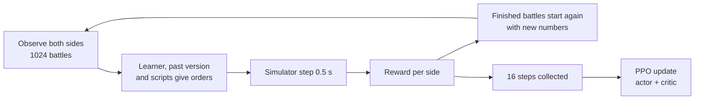

# Training the network

[← Back](README.md) · [Documentation](../README.md) › [Data for training](README.md) › Training · [Русский](../../ru/training/training.md)

Step 3 of the path ([network model](network.md)): PPO training of the [network](model.md) in the
[battle simulator](simulator.md). Built 30.09.2026 with a first 5-minute run of the `small` network.
The code is `tools/nn/train/` (PyTorch, runs in the `snake-ai-trainer` container).

## How to run it

```bash
bash tools/nn/dock.sh tools.nn.train.run --minutes 5            # train, then evaluate and record
bash tools/nn/dock.sh tools.nn.train.run --minutes 60 --no-eval
bash tools/nn/dock.sh tools.nn.train.evaluate --checkpoint build/nn-train/latest.pt
bash tools/nn/dock.sh tools.nn.train.checkpoint                  # write an untrained random.pt
```

Options of `run`: `--battles` (battles at once, 1024), `--steps` (decisions between updates, 16),
`--preset` (`small` or `target`), `--limit` (the battle's time limit, 900 s), `--lr`,
`--order-cost`, `--eval-per-scene` (512). The first simulator step compiles for ~45 s; the
training time does not count it.

## What it writes

Everything goes to `build/nn-train/` (not in Git):

| File | What |
|---|---|
| `random.pt` | the untrained network (random weights); the first file, the untrained opponent |
| `latest.pt` | the last trained network |
| `pool/v*.pt` | past versions: the opponents of self-play |
| `log.jsonl` | one line per update: losses, entropy, KL, reward, win rate per opponent, order changes |
| `eval.json` | the final evaluation: the trained and the untrained network against each opponent |
| `replays/*/` | battles of the final network, written like the game's recordings |

**A checkpoint** (`tools/nn/train/checkpoint.py`) is one file, a dict saved by `torch.save`:
`format` (2), `kinds` (the order kinds in code order), `preset`, `config` (the network's sizes:
the actor is rebuilt from it), `actor` (its weights — all the game needs), `critic` (training
only), `meta` (update, battles, seconds). `load_policy(path)` gives the actor ready to play; the
[companion](../apps/bridge.md) loads it so.

**Replays** are folders like a recorded run: `manifest.json` and `events.jsonl` with an
`nn_sample` every second and the `result`. `tools.nn.gamedata.load(folder)` reads them as a
game battle. `manifest.json` also says which side the network played and against whom.

## How a training step goes



Modules: `scenes.py` (the arenas and roles), `league.py` (who plays whom, the pool),
`opponents.py` (the scripts), `randomise.py`, `reward.py`, `rollout.py` (the battles and one
step), `ppo.py`, `evaluate.py` (evaluation and replays), `checkpoint.py`, `run.py`.

## Decisions

**2 decisions a second** — one decision per simulator step (0.5 s). The step is the game's morale
tick ([simulator](simulator.md)); a faster decision would see nothing new. It is also the in-game
rhythm: the state at tick N, the order at tick N + 0.5 s. So a 10-minute battle is ~1200 decisions.

**Scenes.** The Empire mirror arena, Empire against Skaven and Skaven against Empire
(`config/nn/arenas.json`), each with side 1 attacking and defending, and the learner on side 1 or
side 2: the network plays every army in both roles. There is no army generator yet.

**Opponents.** Of the 1024 battles:

| Opponent | Share | What it does |
|---|---:|---|
| itself | 20 % | the learner on both sides; both give training data |
| a past version | 30 % | one network from the pool, drawn again every 2 updates; the untrained one stays in the pool |
| `nearest` | 20 % | every unit attacks the nearest standing enemy, running |
| `hold_shoot` | 20 % | holds and shoots; a melee unit counter-charges an enemy within 80 m; as the attacker it attacks after 5 minutes |
| `hold` | 10 % | holds (shoots at will, fights back) |

The game's AI takes no part in training: it stays an independent check ([network model](network.md#readiness)).

**Reward** (`reward.py`) of a side:

| Term | Weight | Why |
|---|---:|---|
| win / loss | +1 / −1 | the goal; at the time limit the defender wins |
| enemy health lost − own health lost, per step, as a share of the side's start | 0.5 | a steady signal long before the end; over a battle it sums to −0.5…+0.5, less than a win |
| each real order change of a unit, divided by the side's units | 0.001 | against jitter (below) |

The first two are zero-sum: side 2 gets minus side 1's. No style terms yet: the faction characters
are placeholders.

**The order `keep`.** The network may give a unit no new order: `keep` (kind code 4) leaves the
order in force; a unit with no order holds. A real change is a new kind, a new attack target, or a
move point more than 10 m from the one in force; `keep` and the same order again cost nothing. With
0.001, a unit that changes its order every decision costs its side ~1.2 in a 10-minute battle, more
than a win; one change every 5 s costs ~0.12. The in-game test showed the untrained network
changing orders almost every second and the units jittering.

**PPO** (`ppo.py`), MAPPO style: each own unit is an agent with its own probability ratio; all
units of a side share its advantage; the critic sees the whole field (and is never shipped).

| Setting | Value | Why |
|---|---|---|
| discount γ | 0.999 per decision | a horizon of ~1000 decisions (~8 min), about a battle; 0.99 would forget the win 30 s before it |
| GAE λ | 0.95 | the usual |
| clip | 0.2 | the usual |
| learning rate | 1e-4, Adam (eps 1e-5) | 3e-4 moved the policy too far on one batch (KL 0.14 per unit) |
| epochs × minibatches | 2 × 4 | the update costs more than the battles: more epochs slow the loop |
| stop at KL | 0.05 per unit | a guard against a too large step |
| entropy | 0.01 | keeps the choices open early |
| value loss | 0.5 | the usual |
| gradient norm | 0.5 | the usual |

- **Memory (GRU)** is not unrolled through time in the update: each sample keeps the memory it
  had when it acted. Cheaper; the memory learns one step at a time.
- **Masks.** Dead, routing and padding units give no loss and no entropy; invalid orders are
  masked by the network itself (attack without a visible enemy, orders to a unit that cannot take
  them).
- **Time limit 900 s** (the recorded game battles used 900 s too), not the game's 60 minutes:
  simulated battles end in 430–720 s, and a stalled battle would hold a slot for 7200 steps. The
  defender wins at the limit as in the game. Later training should use the full 60 minutes.
- **Domain randomisation** (`randomise.py`): per battle, damage, speed and leadership are
  multiplied by 1 ± 15 % (the same for both sides) and by 1 ± 5 % per side; the start places move
  by up to 5 m. The network does not see the factors.

**Evaluation** (`evaluate.py`): 512 battles per scene against each opponent (the learner's side
alternating), whole battles to the end, the simulator's own numbers, starts moved by up to 2 m,
orders sampled as in training.

## The first run, 30.09.2026

`bash tools/nn/dock.sh tools.nn.train.run --minutes 5`: the `small` network (0.78 M weights in the
actor), 1024 battles at once, RTX 5070 Ti.

- 5 minutes of training (and 46 s to compile the simulator's step): 138 updates, 2.26 M battle
  steps (~7500 a second), 1109 finished battles. A simulated battle takes 800–1800 decisions, so
  most battles ended only in the last two minutes, and each battle slot played about one battle.
- The evaluation took 7 more minutes for the trained network and 4 for the untrained one
  (3072 battles per opponent, 512 per scene).

**Win rate in the training battles**, by minute (wins / finished battles):

| Minute | `nearest` | `hold_shoot` | `hold` | past versions | the untrained one |
|---|---|---|---|---|---|
| 1–2 | 0/71 | 0/1 | 0/1 | — | — |
| 2–3 | 0/81 | 0/30 | — | — | — |
| 3–4 | 0/106 | 0/53 | — | 2/2 | 5/5 |
| 4–5 | 0/29 | 17/122 | 50/101 | 145/298 | 2/2 |

**The final evaluation** (`build/nn-train/eval.json`), 3072 whole battles per opponent:

| Opponent | Untrained: wins | Trained: wins | Trained: own / enemy health lost | Trained: ended on time |
|---|---:|---:|---|---:|
| `nearest` | 0.0 % (1) | **4.0 %** (124) | 0.83 / 0.37 | 8 % |
| `hold_shoot` | 6.3 % | **26.8 %** | 0.40 / 0.18 | 77 % |
| `hold` | 50 % | 50 % | 0.00 / 0.00 | 100 % |
| the untrained network | — | 50 % | 0.36 / 0.55 | 100 % |

Every win comes from defence: as the attacker the trained network won nothing; as the defender it
won 100 % against `hold` and the untrained network (on time); against `hold_shoot` 60 % in the
mirror, 100 % with the Skaven, 0 % with the Empire against the Skaven; against `nearest` 24 % with
the Skaven and 0 % elsewhere. 50 % against `hold` and the untrained network is exactly
"the defender wins".

**Order changes** per standing unit per minute: the untrained network 75.7, the trained 17.8
(29.5 against `nearest`, 12.9 against `hold_shoot`, 6.6 against `hold`). Share of decisions:

| | hold | move | attack | withdraw | keep |
|---|---:|---:|---:|---:|---:|
| untrained | 0.12 | 0.17 | 0.27 | 0.11 | 0.33 |
| trained | 0.65 | 0.05 | 0.01 | 0.05 | 0.25 |

**What the network does** (24 replays in `build/nn-train/replays/` and the evaluation):

- It stands where it started: the army's centre moves 0–7 m in the first two minutes (a little
  back). It almost never orders an attack (1 % of decisions).
- Missile units shoot at will once the enemy comes into range; in melee the units fight back, but
  nobody counter-charges or helps a neighbour.
- Against `nearest` the whole army routs (7 of 7 or 11 of 11 units) while the enemy loses a
  quarter to a half of its health.
- Against `hold`, itself and the untrained network nobody moves: the battle ends on time and the
  defender wins.
- It stopped jittering: orders change 4 times less often, mostly by holding (a hold once in force
  costs nothing) and `keep`.

So in 5 minutes the network learnt one thing: stand, shoot, and do not waste orders. That beats
the untrained network's random running about (the win rate moved: 0 → 4 % against `nearest`,
6 → 27 % against `hold_shoot`), but it is a passive policy. The rules push to it: the defender
wins on time, standing gives no order costs, and a charge first costs health. Longer training has
to show whether it grows out of this; if not, the attacker needs pressure (the reward or the
opponent mix).

## What is missing

- The `target` network, longer runs, the full 60-minute limit.
- An army generator (1–20 units, equal budget), more factions.
- Style rewards from the faction character; the LoRA adapters per faction and role.
- A check in the game against the game's AI.

## Tests

`tests/tools/test_nn_train.py` (torch; skipped in `.venv`, run in the container like
`tests/tools/test_sim.py`): GAE, clipping, reward, order changes, the layout, randomisation
(level 1); masks, `keep`, rewards symmetric between the sides, battles starting again (level 2);
a training step on the CPU, checkpoints, replays readable by `gamedata`, evaluation (level 3).
