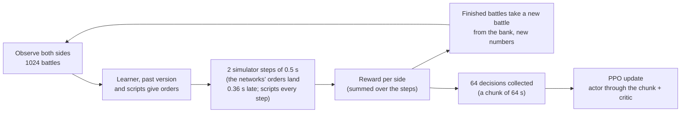

# Training the network

[← Back](README.md) · [Documentation](../README.md) › [Data for training](README.md) › Training · [Русский](../../ru/training/training.md)

Step 3 of the path ([network model](network.md)): PPO training of the [network](model.md) in the
[battle simulator](simulator.md) on [random armies](armies.md), against itself, its past versions,
scripted opponents and drills. Code: `tools/nn/train/` (PyTorch, runs in the `snake-ai-trainer`
container through `tools/nn/dock.sh`). This page says how it works now; what was tried and dropped
is at the end ([tried and rejected](#tried-and-rejected)).

## How to run it

```bash
# the standard test of a change (below): before -> training -> after, in build/nn-train/test5/<label>/
DOCK_NAME=t2-test5 bash tools/nn/dock.sh tools.nn.train.test5 --label mychange [-- run.py options]
# a trend run of the chain: 15 minutes from the last network, the full evaluation every 5 minutes
DOCK_NAME=orch-x bash tools/nn/dock.sh tools.nn.train.test5 --label x --init <last m*.pt> \
  --updates 0 --minutes 15 --every 5 -- <the chain's options, below>
# a plain run: PPO, then the final evaluation and replays
bash tools/nn/dock.sh tools.nn.train.run --name r1 --minutes 30 --init <checkpoint>
# evaluation alone: random battles of EVAL_SEEDS per opponent, in swapped pairs with the script baseline
bash tools/nn/dock.sh tools.nn.train.evaluate --checkpoint build/nn-train/latest.pt --generated 512 \
  --opponents ai_like,nearest,hold_shoot
bash tools/nn/dock.sh tools.nn.train.checkpoint                  # write an untrained random.pt
```

The first steps compile for 1–3 minutes (seconds once a run of the same shapes compiled them:
[training speed](#training-speed)); training time does not count them.

### Options of `run.py`

| Group | Options (default) |
|---|---|
| run | `--name` (folder under `build/nn-train/runs/`), `--init` (start checkpoint; default `random.pt`), `--minutes` (5; wall time of training), `--updates` (0; if set, train that many updates and `--minutes` only caps the time; schedules follow the updates), `--seed`, `--device`, `--no-eval`, `--print-every` (5), `--snapshot-every` (20) |
| battles | `--battles` (1024 at once), `--steps` (64 decisions per update), `--max-units` (19 units a side), `--small share:units` (that share of every bank with at most `units` a side), `--bank` (2048 ready battles), `--bank-refresh` (5 min), `--limit` (3600 s) |
| cadence | `--decide-s` (1.0 s of battle between decisions), `--order-latency` (0.36 s): [decisions](#decisions) |
| PPO | `--lr` (1e-4), `--gamma` (0.9997 per 0.5 s), `--epochs` (1), `--minibatch` (4096 decisions), `--adv-norm` (`batch` or `role`), `--critic-warmup` (0 updates that train the critic alone), `--critic-init` (the critic from another checkpoint) |
| exploration | `--entropy` (0.01) and `--entropy-end` (linear over the run), `--entropy-target` (0: off), `--entropy-max` (0.1), `--entropy-rate` (1.25) |
| leash | `--anchor` (0: KL weight to the reference) and `--anchor-end`, `--reference` (default `--init`), `--anchor-roll` (0 s: seconds of training between renewals of the reference), `--anchor-ema` (0 s: instead, the reference follows the actor with this half-life) |
| reward | `--gold` (1.0), `--rout-share` (0.5), `--lord` (0.3), `--lord-rout` (0), `--idle` (2e-4), `--idle-tau` (150 s), `--idle-pause` (30 s), `--idle-step` (0.5), `--idle-cap` (20), `--idle-rate` (0), `--idle-window` (30 s), `--order-cost` (0.001), `--retarget` (0.003): [reward](#reward) |
| opponents | `--mix` (json shares), `--pool` (8 past versions), `--pool-extra` (more checkpoints for the pool), `--eval-past`, `--eval-generated` (512) |
| drills | `--drills` (0: share of the battles), `--drill-weights` (json; default the `TRAIN` drills equally: kiting, hold_fire), `--drill-bank` (256 per drill), `--drill-embed` (1: share of the embedded frame, for the drills that have one), `--drill-broad` (0.5: of the rest, share of the broad frame), `--drill-teach` (`auto` or json {drill: weight}: the teacher, off by default), `--drill-teach-minutes` (10: manual), `--drill-teach-k` (0.5), `--drill-teach-cap` (0.25), `--drill-teach-weight` (0.15: auto), `--teach-normal` (`auto`, names or json {drill: share}: the teacher in normal battles, off by default), `--teach-normal-k` (0.5), `--teach-normal-cap` (0.15), `--teach-normal-weight` (0.1), `--teach-normal-match` (0.1): [drills](#drills) |

### The chain's settings

Training goes as a chain: each run starts from the last checkpoint of the previous one (its
`m<minute>.pt`, with the critic of its `runs/test5_<label>/latest.pt`). The options the chain
passes after `--`:

```bash
--critic-init <previous runs/test5_<label>/latest.pt> --critic-warmup 3 \
--reference <init> --anchor 0.03 --anchor-end 0.03 --anchor-roll 600 --adv-norm role \
--idle-rate 0.05 --lord-rout 0.5 --entropy-target 0.05 --entropy-max 0.03 \
--drills 0.1 --drill-weights '{"counter": 1}' \
--mix '{"self": 0.05, "past": 0.1, "nearest": 0.35, "hold_shoot": 0.15, "hold": 0.05, "ai_like": 0.3}'
```

The reasons: a small KL to the network's own start that rolls forward every 10 minutes (training
without any leash collapses: [tried and rejected](#no-leash-and-a-leash-only-for-new-networks));
advantages normalised per role (the attacker's, wider with its idle cost, no longer outweigh the
defender's); the progress clock at 0.05 of the budget a minute (the network sees it:
[model](model.md)); a shattered lord counted as dead; drills at 10 % (30 % made the small
network forget: [drills](#drills)).

### Training a widened network

A network widened by `tools/nn/model/widen.py` ([widening](model.md#widening)) continues the chain
with the same command and options; only `--init`, `--critic-init` and `--reference` are the wide
files:

```bash
DOCK_NAME=orch-w2 bash tools/nn/dock.sh tools.nn.train.test5 --label w2_wide --init build/nn-train/wide/w0.pt \
  --updates 0 --minutes 25 --every 5 -- \
  --critic-init build/nn-train/wide/w0_critic.pt --critic-warmup 3 \
  --reference build/nn-train/wide/w0.pt --anchor 0.03 --anchor-end 0.03 --anchor-roll 600 --adv-norm role \
  --idle-rate 0.05 --lord-rout 0.5 --entropy-target 0.05 --entropy-max 0.03 \
  --drills 0.1 --drill-weights '{"counter": 1}' \
  --mix '{"self": 0.05, "past": 0.1, "nearest": 0.35, "hold_shoot": 0.15, "hold": 0.05, "ai_like": 0.3}'
```

`run.py` sees the width (the token width / the small network's 128) and does two things so that an
update moves the wide network as far as the small one would:

- **The same optimizer steps per update.** The wide network's minibatch does not fit in 16 GB, so
  it is computed in `ceil(width)` parts whose gradients add up (gradient accumulation,
  `PPOConfig.accum`; `run.sized`); the minibatch and the number of Adam steps stay the small
  network's (31 an update at 40 slots).
- **The learning rate / width on the weights that read the copied stream** (`widen.stream_readers`:
  attention q/k/v, feed-forward in, the GRU, the heads, the critic's value). Each copy gets the
  gradient the small weight got and Adam moves every copy about lr, so their sum, what the network
  computes, moved width times as far (as muP's learning rate ~ 1 / fan-in).

Why (03.10). The first wide run (`w1_wide`, before the fix) halved the minibatch to fit the memory:
63 Adam steps an update instead of 31. Adam's step is about lr whatever the gradient, so the policy
moved ~2 times as far and the KL, quadratic in the step, ~4 times. On the same batch (its first
policy update, measured over all its rows): the small network 0.0073, the wide one with the halved
minibatch 0.033 (the target pointer 0.027 against 0.003), with accumulation 0.010, with accumulation
and the readers at lr / 2 0.0093; after a second pass 0.0082 / 0.016 / 0.015 / 0.010. In the run the
per-update KL was 3 times the small network's while its logged mean (over the minibatches) looked
normal, the KL stop (0.05) cut 30-90 % of the updates, the KL to the anchor climbed to 0.08 in 25
updates (the small network's 0.02), and the rating fell +0.05 -> -2.48 in 5 minutes, before the anchor
first rolled; the roll at 10 minutes then tied the leash to the collapsed policy. With the fix, under
the same command: 31 steps every update, no KL stop, KL 0.003 an update and to the anchor at most
0.033 (as the small network's: `wfix_small5`, +0.05 -> +0.08 in 5 minutes), the rating +0.05 -> +0.02
(5 min) -> +0.18 ± 0.11 (10 min), pair gold against `ai_like` +0.018 -> +0.032 (`wfix_wide10`). The wide
network trains ~half as fast (4 900 against 9 000 s of battle a second).

**A slow leash, `--anchor-ema S`** (instead of `--anchor-roll`): after every update the reference
moves towards the actor by the share that halves their distance in S seconds of training (Polyak
averaging of the weights; `run.follow`), so a sudden collapse moves the anchor only a little while
steady progress is followed. Measured once on the wide network, the same command with
`--anchor-ema 450`: the rating +0.05 -> +0.12 -> +0.05 ± 0.11 (5, 10 min), KL to the anchor at most
0.029 (`wfix_ema10`) against +0.02 -> +0.18 with the fixed anchor: both stable, the difference
within the noise; the roll it replaces comes only at minute 10, so a longer pair of runs is needed to
choose. The chain keeps `--anchor-roll 600`.

## What it writes

Everything goes to `build/nn-train/` (not in Git):

| File | What |
|---|---|
| `random.pt` | the untrained network (random weights), the untrained opponent |
| `latest.pt` | the network of the last `run.py` (the companion's default) |
| `runs/<name>/latest.pt`, `best.pt` | the run's last network; the one with the best window of training battles against the scripts (the worst opponent-role win rate with ≥ 20 battles, over ≥ 5 of them) |
| `runs/<name>/pool/v*.pt` | past versions: the opponents of self-play |
| `runs/<name>/log.jsonl` | one line per update: losses, entropy, KL, the entropy and KL weights in force, `start_kl` (distance from the start), `anchor_rolls`, reward and the same by term a minute of battle per role (`reward_parts`), the critic's quality (`ev`, per role), win rate by opponent and role, order changes, order kinds, lord deaths, target switches, ability uses, speed |
| `runs/<name>/eval.json`, `replays/*/` | the final evaluation; battles of the final network written like the game's recordings |
| `test5/<label>/` | `report.json`, `before.json`, `after.json`, a trend's `m<minute>.pt`, `eval_m<minute>.json`, `trend.md` |
| `baselines/<opponent>_<units>u_<limit>s_<version>.json` | the script baselines of the evaluation ([fair metrics](#network-evaluation-fair-metrics)) |

**A checkpoint** (`tools/nn/train/checkpoint.py`) is one file, a dict saved by `torch.save`:
`format` (2), `kinds` (the order kinds in code order), `preset`, `config` (the network's sizes: the
actor is rebuilt from it), `actor` (all the game needs), `critic` (training only), `meta` (with the
`cadence` it was trained at). `load_policy(path)` gives the actor ready to play; the
[companion](../apps/bridge.md) loads it so.

**Replays** are folders like a recorded run: `manifest.json` and `events.jsonl` with an `nn_sample`
every second and the `result`. `tools.nn.gamedata.load(folder)` reads them as a game battle.

## How a training step goes



Modules: `scenes.py` (where battles come from: a bank of ready starts), `league.py` (who plays whom,
the pool), `opponents.py` (the scripts), `drills/` (drill frames, their banks and checks),
`randomise.py`, `reward.py`, `rollout.py` (the battles and one decision), `cadence.py` (how often
the networks decide), `ppo.py`, `evaluate.py` (evaluation and replays), `skill.py` (the rating),
`behaviour.py` (behaviour and liveliness), `capacity.py`, `matchups.py`, `checkpoint.py`, `run.py`,
`test5.py`.

## Battles and opponents

**Battles.** Random armies of the [army generator](armies.md): equal budget, a lord and up to
`--max-units` units a side, half the bank with side 1 attacking. Training seeds only; the bank
(`--bank` battles) is renewed every `--bank-refresh` minutes; evaluation uses `EVAL_SEEDS`, never
trained on. `--small 0.35:6` keeps 35 % of every bank at ≤ 6 units a side. A finished battle takes
a new one from the bank with new randomised numbers. The learner plays side 1 in some battles and
side 2 in others: every army in both roles. The network sees the map as the game shows it (the
Crossroads minimap frame, as the companion), not the simulator's square. The fixed arenas
(`config/nn/arenas.json`) remain only as scenes of `evaluate --per-scene`.

**Domain randomisation** (`randomise.py`): per battle, damage, speed and leadership are multiplied
by 1 ± 15 % (the same for both sides) and by 1 ± 5 % per side; start places move by up to 5 m. The
network does not see the factors.

**Opponents** (`league.py`; `--mix` shares; the default `MIX` in brackets, the chain's above):

| Opponent | Default share | What it does |
|---|---:|---|
| `self` | 10 % | the learner on both sides; both give training data |
| `past` | 15 % | one network from the pool (`--pool` 8, the untrained one always in it, `--pool-extra` more), drawn again every 2 updates |
| `ai_like` | 40 % | modelled on the game's AI ([below](#the-opponent-ai_like)) |
| `nearest` | 20 % | every unit attacks the nearest standing enemy, running |
| `hold_shoot` | 10 % | holds and shoots; a melee unit counter-charges an enemy within 80 m; as the attacker everyone attacks after 5 minutes |
| `hold` | 5 % | holds (shoots at will, fights back); met only as the defender |
| `drill_<name>` | `--drills` | a drill's enemy on that drill's battles ([drills](#drills)) |

Within each opponent's share the layout cycles the learner's side, so every opponent meets every
army in both roles. The game's AI takes no part in training: it stays an independent check
([network model](network.md#readiness)).

### The opponent `ai_like`

`tools/nn/train/opponents.py`, numbers in `Line`, fitted to the game's AI in 110 recorded
network-vs-game-AI gate battles ("pool"; the analysis scripts in `build/ail/`, not in Git):

| Rule | Number | Source |
|---|---|---|
| the attacker's line advances together at a run (a point 30 m ahead); a unit more than 15 m ahead of its line's rearmost free melee unit waits (the march goes at the slowest unit's pace); after the side's first fight nobody waits | run, 15 m | pool: the game's attacking line marched at 2.8–2.9 m/s, 16–17 m deep |
| a defender with no missile units advances too | — | the gate battles |
| once own units have fought, the free units go forward and join enemies within 150 m, missile units up to their range | 150 m | pool: after the first contact the game's units stand idle 1.6 % (melee) / 8.7 % (missile) of the time |
| the attacker charges from | 95 m | pool: an attacking melee unit's first target at 87 m median (q10–q90 68–105 m) |
| the defender counter-charges from | 100 m | pool: first targets at ~100 m |
| an enemy that wavers is charged from | 150 m | ours |
| missile units halt at a share of range and shoot; the enemy lord first when in range, in melee too | 0.9 | gate battles: with our lord in range the game's missile units shot him 89 % of their firing seconds |
| missile units withdraw 50 m from an enemy melee unit within | 50 m | pool: a free missile unit moves away from a closing melee unit in 52–58 % of the seconds within 40 m, 42 % at 40–60 m |
| a missile unit caught in melee breaks off (withdraw) for its first | 15 s | pool: the game's missile units in melee move 52 % of their first 5 s |
| the lord stays behind his line's centre, never charges first: goes in when the line does, at his target within 90 m, or at an enemy within 50 m that already fights; withdraws below 30 % health | 20 m, 90 m | pool: 20–22 m behind the centre before contact, his first target at 90 m |
| melee targets: score = distance − 20 m if the enemy is in melee (+30 m back if the unit stands within 40 m of an own fight) + 25 m for the enemy lord + 6 m for each other own unit already on it (up to 3) − 10 m × cos(the side's forward, the enemy) + 15 m if it wavers − 27 m × a fixed Gumbel draw per (battle row, unit, enemy); the lowest wins, a new one must be 15 m better | see left | a conditional logit fitted on the game AI's 3 397 new targets of melee units out of melee (`build/ail/choice.py`); hysteresis ours |
| a free unit goes for an enemy already fighting via a point 12 m beside its flank | 12 m | the simulator's tactic scan |

The random part is an integer hash of (battle row, unit slot, enemy slot): the same every step,
nothing to replay. Fitted against the game on the same 8 gate battle starts (side 2's behaviour;
game AI / `ai_like` with these rules): missile units' time in melee 0.11 / 0.10; melee target
distance (median) 91 / 93 m, the nearest enemy taken 0.48 / 0.49; new melee targets a battle 27 /
33; idle after contact 0.045 / 0.031; the lord 22 / 27 m behind the centre. The simulator's
prediction of the network's in-game trade on those battles: −0.245 (the game −0.333). Left:
`ai_like` piles two or more units on one of ours 0.26 of the time (the game 0.10), and its lord
goes in sooner (6 s after the first contact against 12 s).

**Local superiority is still not reproduced.** The `build/gangup/` check (scripts and JSON
outside Git) covers all completed fair recordings with unit keys: 158 network battles, 40
game-AI mirrors (both sides), and 6 hold battles with no observed attacks. Gate recordings
are counted once by run name. The game AI's target is its observed engine target, not an
accessible order log; the simulator uses ATTACK targets and, as in `build/ail/estats.py`,
infers a flank MOVE's target when its destination is within 35 m of an engaged enemy.
A "new target" is a target change by a standing melee unit, excluding lords and missile units,
free both now and one second earlier. Isolation means the greatest distance to the target's
nearest standing ally; weakness means the lowest health fraction among standing enemies;
ties count. A melee entry is a transition into melee: flank 60–120°, rear ≥120° relative to
the target's facing (nearest enemy if no target is available).

| Metric | Game AI vs network, game | Game AI mirrors, game | `ai_like` vs `s4b_nolat/m15`, 64 pairs |
|---|---:|---:|---:|
| new target already in melee | 0.426 | 0.223 | 0.383 |
| most isolated / weakest target | 0.120 / 0.197 | 0.227 / 0.197 | 0.147 / 0.250 |
| nearest target / missile unit | 0.420 / 0.255 | 0.428 / 0.364 | 0.449 / 0.245 |
| after first contact: join a fight / open a new one | 0.527 / 0.473 | 0.263 / 0.737 | 0.507 / 0.493 |
| flank / rear entry | 0.266 / 0.224 | 0.237 / 0.205 | 0.371 / 0.124 |
| local enemy power / support faced by the other side, 95% CI | 1.471 [1.364, 1.589] | 1.249 [1.196, 1.314] | 1.108 [1.032, 1.181] |
| same ratio: first 120 s after contact / later | 1.357 / 1.534 | 1.208 / 1.277 | 1.162 / 1.057 |
| share of melee time targeting missile units | 0.146 | 0.015 | 0.121 |

Power = cost × health within 70 m; support includes the unit itself; numerator and denominator
each add 1. Ratio sample: standing units in melee, excluding lords and unbreakable units,
30–80% health. These are pooled unit-seconds, **not** the unit-key/health-bin matching of
`build/gap7/sol56` (1.57); the two requested gates give 1.589 / 1.615 here.
CIs use a battle-cluster percentile bootstrap, keeping both mirror sides or both generated
pair sides in one cluster. Every simulation uses `s4b_nolat/m15.pt` at game cadence, 1 s / 0.36 s.
Increasing joins alone does not close the gap: [rejected variants](#ai_like-local-superiority).

## Decisions

**Cadence: a decision a second, the orders 0.36 s late, as in the game** (`cadence.py`;
`--decide-s 1 --order-latency 0.36`, the same in `run.py`, `test5` and `evaluate.py`). The
companion decides once a second of battle time (the bridge's `decide_ms` 1000) and its orders reach
the units later: in the gate recordings (`nn_orders` `wait_model_ms`, 9251 decisions) median 0.3 s,
mean 0.36 s, p10–p90 0.2–0.6 s of battle time.

- The simulator's step stays 0.5 s (the game's morale tick); one decision (`Battles.step`) plays
  `decide_s / 0.5` = 2 of them.
- The networks' orders (the learner's and the past version's) land after the latency, rounded to
  whole steps at random so that its mean is 0.36 s: one step late with probability 0.72, at once
  otherwise; until then the orders in force go on (`KEEP`), as in the game between ticks.
- The scripts (`nearest`, `ai_like`, the drills' enemies) give orders every simulator step: they
  stand in for the game's AI, which has no tick of ours.
- The observation and its memory are taken only at decisions, as the companion reads the state
  once a second; the GRU steps once a decision.
- The reward of a decision is the sum of its steps'; a battle that ends within a decision ends it.
- `--steps` 64 decisions per update = 64 s of battle a chunk.
- `--gamma` (0.9997) and GAE's λ (0.95) are given per 0.5 s; per decision they are γ^(decide_s / 0.5)
  (0.99940 at 1 s) and λ^(decide_s / 0.5) (0.9025): the horizon in seconds (~28 min) stays.
- Evaluation decides as training does; its per-step counts (behaviour, drill metrics, recordings)
  still see every simulator step. `--decide-s 0.5 --order-latency 0` gives a decision every step
  with the orders at once (numbers of the two cadences are not comparable).

A 10-minute battle is ~600 decisions. Every checkpoint plays at either cadence.

**The order `keep`.** The network may give a unit no new order: `keep` (kind code 4) leaves the
order in force; a unit with no order holds. A real change is a new kind, a new attack target, or a
move point more than 10 m from the one in force; `keep` and the same order again cost nothing.

**Masks.** Dead, routing and padding units give no loss; invalid orders are masked by the network
itself (attack without a visible enemy, orders to a unit that cannot take them).

**Time limit 60 minutes**, as in the game: the defender wins at it. The network sees no time limit
(no input refers to it: a campaign battle may have none).

## Reward

`reward.py`, per side. The live terms:

| Term | Weight (option) | Why |
|---|---:|---|
| win / loss | ±1 | the goal; at the time limit the defender wins and the attacker gets the normal −1 |
| (enemy gold destroyed − own gold lost) / budget, per step | 1.0 (`--gold`) | a steady signal long before the end, by what the units are worth |
| the enemy lord fell − own lord fell, per step | 0.3 (`--lord`) | in the game a lord's fall breaks the army (3 of 4 lost gate battles ended within 3 s of our lord shattering); his gold alone does not show it. With `--lord-rout` r > 0 a shattered lord counts as dead and a routing one as r of a death, given back on a rally (the chain: 0.5) |
| the attacker's idle cost, per 0.5 s step | 2e-4 × m (`--idle`) | the time limit an hour away is hardly seen at γ 0.9997 (0.9997^7200 ≈ 0.11); this is seen every step. The defender never pays |
| each real order change of a unit, divided by the side's units | 0.001 (`--order-cost`) | against jitter |
| each switch of an attack to another target while the old one still stands, divided by the side's units | 0.003 (`--retarget`) | hysteresis: units dithering between two enemies |

The win, gold and lord terms are zero-sum (side 2 gets minus side 1's). The shaping terms are
potential differences: they do not change which outcome is best. No style terms yet: the faction
characters are placeholders.

**Gold lost** (`reward.gold_lost`, `gold_sides`, `budget`). A unit is worth its `multiplayer_cost`
(`config/nn/units.json`); the gold it has lost is that cost × the worst share of it lost so far:

| The unit | Share lost now | Why |
|---|---|---|
| fighting | its health lost (`1 − hp_abs / hp0`) | for a unit of many men health and men fall together; for a single entity (a lord) health shows the damage before its death |
| dead, gone off the map, shattered | 1 | it never comes back |
| routing (not shattered) | health lost + `rout_share` (0.5) × what is left | out of the fight now, but it may rally |

**A loss counts once.** The state keeps each unit's worst share lost so far (`lost_worst`, stored
by `rollout.Battles` after every simulator step, also in `evaluate.script_battles` and
`drills/verify.py`); gold lost = cost × that worst share. A rally gives nothing back; a rout after a
rally adds nothing until the unit loses more than at its worst (routing at half health: 0.75;
rallied: still 0.75; hit to 60 % lost and routing again: 0.8, +0.05). Without it, a defender unit
that routed, rallied and routed again counted as new damage each time: in 89–92 % of battles, ~7 %
of the damage the progress clock counted (up to 22 %), with false progress shown in 38–59 % of
battles. One rule for the trade, the idle clock, the gold metrics and the network's progress inputs
(the companion runs the same code on the game's states). The budget is the mean of the two armies'
starting cost (the same for both sides, so the trade is exactly zero-sum).

**The attacker's idle cost** (`reward.idle_cost`, `idle_scale`): the attacker pays 2e-4 × m every
step, whichever of its units are busy (progress only: a reserve, a second line or a lord kept back
cost nothing while the army as a whole makes progress); m depends on its damage:

- before its first damage: m = exp(t / 150 s) − 1 (`--idle-tau`): almost nothing for the first
  minutes (time to deploy and march), then sharply more;
- after it: 0 while it deals damage; after 30 s without damage (`--idle-pause`), k = ⌊seconds since
  the last damage / 30 s⌋ and m = exp(0.5 k) − 1 (`--idle-step`): a step up every 30 s, faster than
  the first curve and without its grace; new damage sets it back to 0;
- at most 20 (`--idle-cap`): 0.004 a step, 0.48 a minute.

What counts as damage: with `--idle-rate` 0 any health the defender loses (`reward.struck`); with
`--idle-rate` x > 0 (the chain: 0.05) only a damage rate of at least x — the defender's gold lost, a
share of the budget a minute, an exponential mean over `--idle-window` 30 s (`reward.hit_rate`).
0.05 a minute (the whole budget in 20 minutes) tells a fight from scratches: with the army fighting
the median rate is 0.10–0.19 and ≥ 0.05 in 82–95 % of decisions; one or two units skirmishing out of
6+, median 0.04. `rollout.Battles.last_hit` keeps the battle time of the last damage per battle (−1
before the first). The network sees this clock (the rate / 0.05, reached yet, seconds since:
`observation.PROGRESS`, [model](model.md)); it matches the reward only at 0.05, 30 s and a rout
share of 0.5 (`rollout.Battles` warns otherwise).

| No damage from the start | a step | so far |
|---|---:|---:|
| 1 min | 0.0001 | 0.006 |
| 3 min | 0.0005 | 0.07 |
| 5 min | 0.0013 | 0.26 |
| 10 min | 0.004 (the cap from 7.6 min) | 2.2 |
| 15 min | 0.004 | 4.6 |

| A pause after damage | a step from then | the pause so far |
|---|---:|---:|
| 30 s | 0.00013 | 0.000 |
| 60 s | 0.00034 | 0.008 |
| 90 s | 0.0007 | 0.03 |
| 120 s | 0.0013 | 0.07 |
| 180 s | 0.0038 | 0.28 |

Against the outcome (±1): 3 minutes of deploying and marching cost 0.07; an attacker that has dealt
no damage by minute 10 has paid 2.2, more than a lost fight, so standing on is worse than attacking
and losing; every further minute is −0.48. Short pauses in the fight cost little (90 s: 0.03).

**Order costs.** With 0.001 a unit that changes its order every decision (1 s) costs its side ~0.6
over a 10-minute battle; one change every 5 s ~0.12. The costs restrain flipping: without them the
A→B→A flips rose by 60–80 % ([tried and rejected](#removing-the-order-costs)).

`log.jsonl` and the console show the reward by term a minute of battle per learner role
(`reward_parts`: `trade`, `lord`, `end`, `idle`, `orders`).

## PPO

`ppo.py`, MAPPO style: each own unit is an agent with its own probability ratio; all units of a
side share the side's advantage; the critic sees the whole field (and is never shipped).

| Setting | Value | Why |
|---|---|---|
| discount γ | 0.9997 per 0.5 s (0.99940 per 1 s decision) | a horizon of ~28 min: a win 10 minutes away still counts 0.7 |
| GAE λ | 0.95 per 0.5 s (0.9025 per decision) | the usual |
| clip | 0.2 | the usual |
| learning rate | 1e-4 (`test5` and the chain: 1.5e-4), Adam (eps 1e-5); in a widened network lr / width on the weights that read the copied stream (`run.optimizer`) | [a widened network](#training-a-widened-network) |
| epochs, minibatch | 1, 4096 decisions of whole chunks (fewer for battles of more than 22 slots: `run.sized`); a widened network computes it in parts (`accum`) | the update costs more than the battles; the memory of a 16 GB card; [a widened network](#training-a-widened-network) |
| stop at KL | 0.05 per unit | a guard against a too large step |
| entropy | on the order kind only; `--entropy` → `--entropy-end` linearly; with `--entropy-target` a floor: the weight × `--entropy-rate` every update while the kind's entropy is below the target, back down to the schedule above it, at most `--entropy-max` | a bonus on the move point's 128 bins would pay for moving |
| KL to a reference | `--anchor` → `--anchor-end` on the order kind and target; the reference is `--reference` (default `--init`); `--anchor-roll` S: every S seconds of training the reference becomes the current actor (`anchor_rolls` in the log) | a leash that bounds drift within a window, not over the whole run |
| advantage normalisation | `batch`, or `role`: the attacking and defending rows apart | the attacker's advantage is 2–3 times as wide |
| value loss, gradient norm | 0.5; actor and critic clipped apart, each to 0.5 | clipped together, a large critic gradient shrank the actor's step below Adam's eps: the actor did not train at all |
| critic warm-up | `--critic-warmup` N: the first N updates train the critic alone | a fresh or foreign critic does not fit the actor's values |

- **Memory (GRU) through time.** A rollout is a chunk of 64 decisions of every battle; the update
  runs the actor over each chunk from the memory stored when the chunk began, emptied where a new
  battle begins (recurrent PPO, R2D2's stored state). Only the GRU steps one by one.
- **Events in the input** ([inputs](model.md)): per unit how lately it fought in melee and routed
  (enemies: while seen); own and enemy lord slain and how lately; the damage timers and the
  attacker's progress clock.
- **Distance from the start.** `ppo.distance`: the mean per-unit KL (kind and target) of the actor
  to the network the run started from, on one minibatch of every update (`start_kl` in the log). A
  distance that grows while the rating rises means the search works; a flat rating with a stalled
  distance, a leash too short.

## Lord abilities

The network decides itself when its lord uses an ability, like a player
([model](model.md#abilities-each-unit-each-of-its-ability-slots), [bridge](../apps/bridge.md)):

- the learner and the past version choose abilities (`heads.sample(..., abilities=True)`); the
  rollout keeps `Action.ability`, the update counts it in the log-probability;
- only the scripted opponents' lords fire by the simulator's game-AI rule: `Battles.by_rule`
  (`tools/nn/sim/abilities.py` `set_rule`), set again after every restart, because a battle from
  the bank brings `scenario.build`'s default (side 2 by the rule);
- a stored decision keeps only the slots' state (5 numbers) and the battle's bank row;
  `rollout.full_obs` puts the passports back in the update (the whole input would be ~3 GB for 1024
  battles × 64 decisions); the slice of the stored state is a copy;
- the critic's warm-up updates run the actor without a graph (memory);
- `run.py` logs `abilities_per_battle`.

## Drills

Curriculum battles that teach one skill each (`tools/nn/train/drills/`). A drill is a **frame** — a
condition — and every battle inside it is generated from a seed: random rosters and unit types that
satisfy the condition, sizes, distances, the place and bearing of the whole battle on the map
(within 700 m of the centre), and which side we play (half side 1, half side 2). The drill's enemy
is a script (a league opponent `drill_<name>`); the network plays it on that drill's battles only.
Drills change *which battles* the network plays; only a drill given to the teacher (below,
`--drill-teach`) also adds an annealed imitation term of its `skilled` script.

Every drill battle runs under the standard battle limit, as every training battle: the network sees
no time limit, so a drill must be won or lost by the fight, not by the clock.

**Verification before a drill trains anything** (`drills/verify.py`): two scripts of ours play
≥ 256 generated battles of the drill against its enemy, with the training's randomised numbers; the
naive script must lose clearly (win rate ≤ 0.25), the script that uses the skill must win clearly
(≥ 0.75), else the frame is retuned. Only drills that pass are in `drills.READY`, the default of
`--drill-weights`.

```bash
bash tools/nn/dock.sh tools.nn.train.drills.verify --drill pincer,kiting --battles 256 --show 4
# training: 10 % of the battles are drills, all of them counter
... tools.nn.train.run ... --drills 0.1 --drill-weights '{"counter": 1}'
```

How it plugs in: `league.with_drills` takes `--drills` of the mix from the other opponents in
proportion and shares it by `--drill-weights`; `drills/source.py` `Mixed` builds one bank of the
generated battles and every drill's battles (`--drill-bank` per drill, renewed with the bank), and a
drill row restarts as a battle of its drill with our side = the side the learner plays in that row.
In the training log the drills appear as opponents (`drill_counter/attack`, ...).

| drill | frame | enemy | naive (win / gold trade) | skilled (win / gold trade) | status |
|---|---|---|---|---|---|
| `counter` | Empire v Empire, two pairs in random order along the line, 110–200 m apart, 20–60 m between the pairs: our X opposite its counter C, our Z (which beats C) opposite Y; (X, Z, C, Y) from the same-faction pairings run 2 v 2 in the simulator; we attack | holds; a unit whose opponent broke presses the nearest of ours | `nearest`: 0.215 / +0.06 (X breaks on its counter, which joins the other fight) | each unit on the enemy it beats (passport matchup): 0.867 / +0.22 | `READY`; on the evaluation seeds the skilled script attacks its correct target 98 % of the time, naive 53 % |
| `hold_fire` | our infantry unit in contact with the enemy's lord; 2–3 of our shooters 70–95 m behind it (Empire archers, Skaven Night Runners or slave slingers); free enemy missile units 65–95 m beyond our shooters' line; we attack | melee units attack the nearest, missile units hold | our shooters focus the lord in the melee: 0.066 / −0.59 | shoot the free enemies; with none left step out of range of the melee and hold: 0.848 / +0.37 | `READY` (fire into the melee around a lord costs us 1.5–3.5× what it costs him; into an ordinary unit it pays) |
| `kiting` | 1–2 Skaven Night Runners (run 5.4 m/s, sling 140 m) against Empire melee infantry (run 3.0 m/s); we attack | every unit runs at our nearest missile unit | `hold`, stand and shoot: 0.059 / −0.24 | shoot while the nearest chaser is far, run back when it comes near, halt and shoot again (each halt gives a volley): 1.000 / +0.86 | `READY` (needs the volley rule of the simulator) |
| `pincer` | 2–3 Empire greatswords holding 120–180 m apart; two of ours per greatsword in a column opposite it, 140–240 m away; we attack | `hold` | `nearest`: 0.223 (the pair piles on the front) | front pin + flank: 0.922 | needs the pending flank rule ([simulator](simulator.md#pending-changes)): with the current simulator both 0.00; with the flank rule 0.281 / 0.922 (naive above 0.25); not in `READY` |
| `defend` | Skaven defenders (a line + 4 missile units) against L + 2 stronger attackers playing `ai_like` | `ai_like` | marching out | holding the line and shooting | built, being tuned; not in `READY` |
| `reserve` | a reserve that must intercept flankers instead of joining the main melee | scripted flankers | joins the melee | intercepts | module written, not in `NAMES` (not loaded) |

`READY` = `kiting`, `counter`, `hold_fire` (verified; test5 evaluates them); the drills trained by
default (`--drill-weights`) are `drills.TRAIN` = `kiting`, `hold_fire` — `counter` costs in normal battles
(below, "Default training drills"). The chain trained `counter` at 10 % of the battles:
with it the network learned the counter-pick (drill win 0.40 → 0.65–0.73, time on the correct
target 0.60 → 0.72, first correct order 44 → 26–40 s). At 30 % the same skill came at a cost:
capacity verdict "widen-candidate", 17 older numbers dropped beyond noise, the overall rating
−0.41 → −0.60.

**Teacher** (`drills/teach.py`; `--drill-teach '{"kiting": 0.5}' --drill-teach-minutes 10`): an
optional imitation term, only for a drill PPO does not find on its own, annealed to zero so it is a
hint, not a leash. In the battles of a taught drill the network plays as always; the drill's
`skilled` script does not act, it only labels: at every decision the rollout runs it on the same state
and maps its orders for our units to the network's action — the order kind; the move point as the
bin whose point (the unit's position + the bin's offset) is nearest the script's; the attack target as
the pointer to the same slot; run. PPO's loss gets λ(t) × the cross-entropy of the policy against the
label (the kind, the point for move / withdraw, the target for attack, run for move / attack; no
ability) on those units only (they take orders, the battle runs, an attack's target may be attacked
now), λ going linearly from the given value to 0 over `--drill-teach-minutes` of training. A drill
the run does not play (`--drills`, `--drill-weights`) is refused. Logged per drill and update
(`log.jsonl` "teach", a "teacher" line under every printed update): the weight, the term's
cross-entropy, the agreement (the policy's most likely action = the label), on the kind alone and on
the active labels alone (any kind but hold: for kiting the run-back, which the many hold labels of the
approach would hide), and the labelled unit-decisions; `test5` puts the same per evaluation point in a
"teacher" block (mean weight and cross-entropy, agreement first / last update, on the kind, on the
active labels). Checks (`tests/tools/test_nn_drill_teach.py`): on kiting states the labels decode
back to the script's orders (the kind, run, the move point to the nearest bin's, within 0.35 of the
distance; the chasers' attack orders to the same slot), only the taught drill's rows are labelled, and
pure imitation on kiting battles for a short CPU run raises the agreement on new rollouts from 0.00 to
0.54 (on the kind 0.19 → 0.87, on the run-back 0.00 → 0.45).

**Adaptive teacher** (`--drill-teach auto`; `tools/nn/train/teach_auto.py`): the teacher for every
`READY` drill the run plays, as much as the network still needs. After every evaluation (test5's drill
block: the network's and the drill's skilled script's win rates on the same battles), per drill
deficit = max(0, skilled − net) / skilled and share = 0 when deficit ≤ 0.05 (about one standard error of
a 128-battle win rate: the network matches the script), else min(`--drill-teach-cap`,
`--drill-teach-k` × deficit). The share is the part of the drill's battles the script labels: each
battle draws a number when it starts and is labelled, whole, while the number is below its drill's
share (a larger share keeps the battles a smaller one had); battles of no drill are never labelled.
The weight on a labelled unit is a fixed `--drill-teach-weight`, and the term is summed over the
labelled units / *all* the drill's units, so the pull is weight × share (share 1 = the manual teacher at
that weight); the agreement is logged over all the drill's units, labelled or not. Until the run's
first evaluation the shares come from the previous numbers: test5's "before" evaluation of the
starting network, else the init checkpoint's own test5 evaluation (`m<minute>.pt` → its
`eval_m<minute>.json` / report.json's trend / after.json; a test5 run's `latest.pt` → that folder's
after.json), else half the cap. The defaults come from the manual kiting run (w 0.15 → 0 over 15 min on
every kiting battle): kiting went from win 0.02 to 0.98 within 5 min — in the training log between
updates 13 and 19, ~3.5 min at w ≈ 0.13, about 0.47 weight-minutes of pull — and stayed 1.00 after the
weight reached 0, with no loss in normal play: a push, not a leash, is all a drill needs, and that run
gave ~2.4× the pull it needed. Weight 0.15 is what worked; cap 0.25 gives a drill as far behind as
kiting 0.0375 of pull (~0.47 weight-minutes in ~12.5 min, within one 15-min run) while ≥ 75 % of every
drill's battles stay pure PPO; k 0.5 reaches the cap from a deficit of 0.5, below it the pull falls with
the gap (counter's 0.30 → 0.15). If a kiting-like gap does not close within ~15 min, the cap goes up
first. Reported: at the start of the run and under every printed update ("teacher … share … labelled"),
and in test5 a table per evaluation point — drill | net win | skilled win | deficit | teacher share
(was → now) | agreement (since the last point) — in report.json / trend.md and the evaluation's json
("teach_auto"). Checks: `tests/tools/test_nn_teach_auto.py` (the rule, the cap, the dead zone, the
state across evaluations, the prior's files, the table; .venv) and `test_nn_drill_teach.py` (torch:
only drill battles are labelled, whole battles, the share's draw, the term's normalisation, a run whose
evaluation hook switches a matched drill off).

**Drill metrics** (`drills/metrics.py`): per battle, over our standing units' seconds, the share
attacking the correct target / a bad one (its hard counter) / another enemy, the other order kinds,
the share in melee, and the median battle time a unit's attack order first goes to its correct
target; the same over the last 100 s before the limit. `test5` evaluates every `READY` drill
(`--drill-eval`, 128 battles each on `DRILL_EVAL_SEEDS`): win rate, gold trade and these metrics,
with the two check scripts on the same battles beside them, in the report and in `trend.md`.

**Transfer to normal battles** (`drills/transfer.py`): a drill mastered in its own battles is not yet a
skill — after the kiting teacher the network won the kiting drill 1.00 and still never kited in a normal
battle. So every drill also gives a detector of its situation in an *ordinary* battle
(`Drill.transfer(st) -> (situation, applied, mistake)` per unit and simulator step), and the normal
evaluation (`evaluate.play`: test5's battles against `ai_like`, `nearest`, `hold_shoot`) sums, per side,
the unit-seconds in the situation, applying the skill and making the drill's mistake: the network's
units and the opponent script's — the units of `ai_like` in the same battles are the reference.
**Applied share** (the "transfer share", key `share`) = applied / situation unit-seconds — the skill used
where it applies, HIGHER is better; **mistake share** (key `mistake`) = mistake / situation unit-seconds — the
drill's mistake made there, LOWER is better (for hold_fire the two add up to 1: applied = not firing at the
lord in melee). test5 shows both, labelled so ("TRANSFER … APPLIED share (higher is better)", "… MISTAKE
share (lower is better)"), and `transfer.py` prints "applied … (higher is better), mistake … (lower is
better)".

| drill | situation (any battle) | applied | mistake |
|---|---|---|---|
| `kiting` | a standing missile unit (with ammunition, not a lord) with a melee enemy at least 1.0 m/s slower (run speeds) within 60 m that comes at it (≥ 0.5 m/s towards it) or holds it in melee | it runs back: out of melee, moving away from that enemy at ≥ 1 m/s | it is in melee |
| `counter` | a standing melee unit (not a lord) with, within 200 m, a hard counter (an enemy taking its health ≥ 1.5× faster than it takes the enemy's: the skilled script's matchup without the charge) and a free (not in melee) better target, one that beats it ≥ 1.5× less than that counter (the drill's X: spearmen with flagellants opposite, ×3.2, swordsmen free, ×1.5) | it goes for any other enemy | its attack order (else its melee opponent) is a hard counter while a target 1.5× better is free |
| `hold_fire` | a standing missile unit (not a lord) with an enemy single entity (lord, hero) in melee with one of its side's units (within 30 m) inside its range + 10 m | it does not fire at that single entity | it fires at it |

The detectors were checked on the drills' own battles (64 each, clean frame, the share of the
situation's unit-steps): kiting naive 0.00 / skilled 0.64 applied (naive caught in melee 0.90 of them);
counter naive 0.00 / skilled 0.97 (naive: a hard counter in all of them); hold_fire naive 0.33 / skilled 0.99.

Reported as `res["transfer"]` (`{drill: {network, ai_like, by_opponent: {opponent: {network, script}}}}`,
each `{share, mistake, unit_s (situation unit-seconds a battle), battles (share of the battles where it
came up)}`), in test5's drill block ("TRANSFER to normal battles, network / ai_like") and report.json
(`before` / `after` / `trend` → `transfer`). Alone, without training:

```bash
bash tools/nn/dock.sh tools.nn.train.drills.transfer --checkpoint build/nn-train/test5/w5_kiting_teach/m25.pt
```

Baseline (03.10.2026, `w5_kiting_teach/m25.pt` — the wide network that wins the kiting drill 1.00; 512
battles per opponent, 99 s; an earlier run gave kiting and hold_fire within ±0.02):

| drill | network: applied ↑ / mistake ↓ (unit-s a battle) | `ai_like`: applied ↑ / mistake ↓ (unit-s a battle) |
|---|---|---|
| `kiting` | **0.003** / 0.88 (107; in 32 % of the battles) | **0.71** / 0.07 (113) |
| `counter` | **0.38** / 0.20 (985; in 95 % of the battles) | **0.52** / 0.25 (725) |
| `hold_fire` | **0.84** / 0.16 (303; in 77 % of the battles) | **0.39** / 0.61 (225) |

Kiting does not transfer at all (the network's missile units stand and get caught: 0.88 of the
situation's seconds in melee, against `ai_like`'s 0.07); counter-picking transfers partly (the network
goes for a hard counter less often than `ai_like` but for a good target less often too: it holds more);
holding fire into a lord's melee is already the network's habit (0.84 against `ai_like`'s 0.39), drill or
not. `nearest` and `hold_shoot` never kite (0.00), as expected.

**Broad frames** (`Drill.broad`; `--drill-broad`, default `drills.BROAD` = 0.5): the same situation
embedded in a messier battle, so the network meets the skill's cue among what normal battles look like —
more unit types, uninvolved units on both sides, lords, other sizes. `drills.battles` draws, per seed, the
broad frame with the share `--drill-broad` (its own draw: the clean battles of a seed stay what they were),
the clean one otherwise; the description carries `"broad": true`. The share applies to training
(`drills/source.py`) and to test5's drill evaluation, which reports the win rate clean / broad apart
(the scripts' beside). `verify.py --broad 1` checks the broad frame alone. The broad battles are longer
(kiting skilled 836 s of battle against 311 s clean), so the check scripts' numbers on the drill evaluation's
battles (~15 min of GPU at a test5 start) are cached on disk: `build/nn-train/baselines/drill_<name>_<n>_broad<share>[_embed<share>]_<version>.json`,
the version a hash of the simulator's files and `tools/nn/train/drills`.

| drill | broad frame | verify, broad only (naive / skilled) | verify, 50 % mix |
|---|---|---|---|
| `kiting` | 2–3 Night Runners (+ slave slingers with 0.35, then 2 more swordsmen chasers); chasers as the clean frame, 3 kiters: 2 swordsmen + 2 random; 0–2 Skaven slave units and the Warlord (0.5) 70–150 m behind our kiters, guarding (attack an enemy within 60 m), each slave unit meets one more spearmen chaser, the Warlord the Empire general | **0.125 / 0.871** | 0.070 / 0.910 (clean 0.056 / 1.000, broad 0.085 / 0.823) |
| `counter` | one combo or two (0.4: two 2 v 2 fights 250–350 m apart); the general 120–200 m behind each line (0.5): ours a reserve in both check scripts (holds until the enemy line is gone), the enemy's holds and presses as its line; the skilled script sends the line only at line units while any stand | **0.191 / 0.785** | 0.188 / 0.859 (clean 0.183 / 0.889, broad 0.192 / 0.831) |
| `hold_fire` | the clean frame + one of our shooters of another kind (0.5: militia, which shoots on the move; Night Runners ↔ slave slingers), our lord 30–60 m behind the shooters holding (0.5), a second melee 150–250 m to the side of ours v an ordinary enemy unit (0.5: fire into it pays — the naive script still focuses the lord, the skilled one shoots it when no free enemy is left), an enemy melee unit 150–250 m behind his lord (0.3) | **0.164 / 0.855** (naive: 10 % timeouts) | 0.117 / 0.848 (clean 0.063 / 0.817, broad 0.169 / 0.877) |

Tried in the broad frames and dropped: flagellants among the kiting chasers (unbreakable: kiting cannot
break them); clanrats as the kiting background (they beat the tired chasers: naive 0.32); the general
plus a swordsmen unit for the Warlord (skilled 0.54); more counter pairings (flagellants as X's counter,
greatswords as Z: naive won 0.56 without any extras); archers behind both counter lines (the attacker's
tired winners walk into the enemy archers' fire at the end: skilled 0.79 → 0.17–0.30; the enemy's
archers as a reserve too: naive 0.42).

**Embedded frames** (`Drill.embedded`; `--drill-embed`, default `drills.EMBED` = 1 — the default for
`kiting` and `hold_fire`; 0 gives the old clean / broad mix): the drill's situation *inside a normal
battle*. Why: on the clean and broad frames the actor told drill battles from normal ones perfectly (a
linear probe on its own representation, AUC 1.00 at decisions 0, 30 and 90 s: 76 % of the drill battles
had no lord of ours, 1–5 units against ~8), so a skill mastered in the drill stayed a drill-only habit
(kiting drill 1.00, kiting in normal battles 0.004 of the situation's time). An embedded battle is a
normal generated battle (`drills.generated`: `tools/nn/armies`, the budget, templates, both lords, normal
sizes, the arena's deployment — no turn or move on the map; attacking or defending, one half each) with the
drill's units inserted and marked by a `tag` (state STATIC `tag`: 1 our unit of the situation, 2 the
enemy's; the simulator and the observation never read it, only the drill's scripts do); each side's
formation is shifted sideways by half its inserted block; for every inserted unit its side gives up the
unit of nearest cost (not the lord) and is deployed again without them (`drills.generated(swap=)`: a normal
battle's unit count and gold, no hole in the lines), and the gold is evened (`drills.balance`: the richer side
drops the untagged non-lord unit that brings the difference nearest zero, until within 5 %, as the generator's
tolerance; else redrawn, up to 40 times). With our side 2 the battle is also turned half
round the map's centre, so our army deploys where side 2 does in a normal battle. The enemy plays `ai_like`
except its tagged units (the drill's enemy rule); the check scripts play `ai_like` for our army except the
tagged units (naive: the drill's mistake, skilled: the skill), so the two differ only where the skill acts,
on the same battles. The rest of the battle is a normal one, so the measure is the **paired gold trade**
(skilled − naive on the same seeds and randomised numbers), not the win rate: `verify.py` passes an
embedded frame when that difference is ≥ 0.05 and above 0 at 95 % (`EMBED_PASS_TRADE`); the adaptive
teacher uses the gold-trade score (net − naive) / (skilled − naive) for a drill evaluated mostly on its
embedded frame.

| drill | embedded frame | verify, 256 battles: naive / skilled win, gold trade | skilled − naive, paired |
|---|---|---|---|
| `kiting` | Skaven (ours) v Empire — the only pair with a missile unit ≥ 1 m/s faster than the other side's infantry; 1–2 Night Runners 6–20 m beyond the end of our line, 0–25 m behind our front; the clean frame's chasers for that number (1 swordsmen; 2 swordsmen or 3 of spearmen / shielded spearmen / swordsmen) at the end of the enemy's front line on the same flank (~340–370 m apart); the chasers march in `ai_like`'s line until one of our kiters is within 180 m (`EMB_CHASE_M`; sling 140 m), then CHASE it | naive 0.727 / +0.162, skilled 0.840 / +0.307 | **+0.145 ± 0.025** trade, +0.113 ± 0.048 win; skilled better in 66 % of the battles, worse in 8 % |
| `hold_fire` | factions at random; our infantry unit 20–50 m beyond the end of our line, 10–30 m ahead of our front, in contact with the enemy's OWN lord (taken out of his army); 2–3 of our shooters 70–95 m behind it; 1–2 free enemy missile units 65–95 m beyond the outer end of our shooters' line; the lord keeps fighting, the free missile units hold and shoot | naive 0.152 / −0.266, skilled 0.766 / +0.218 | **+0.484 ± 0.030** trade, +0.613 ± 0.061 win; better in 98 %, worse in 2 % |

Is the cue gone? The same probe (`build/embed/cues.py`, the n1 network, 256 embedded battles of each drill
against the normal evaluation battles): 5-fold AUC at decisions 0 / 30 / 90 s (the probe's floor, two random halves of the normal
battles: 0.52 / 0.52 / 0.47):

| embedded drill against | 0 s | 30 s | 90 s |
|---|---|---|---|
| (clean + broad frames, 04.10 before: every drill v normal) | 1.00 | 1.00 | 1.00 |
| `kiting` v every normal battle | 0.90 | 0.82 | 0.93 |
| `kiting` v normal Skaven-v-Empire battles | 0.76 | 0.77 | 0.84 |
| `kiting` v normal Skaven-v-Empire battles with our Night Runners | **0.68** | **0.72** | **0.83** |
| `hold_fire` v every normal battle | 1.00 | 1.00 | 1.00 |

Army cues are gone (both lords in every battle; gold difference ≤ 5 %, mean 2 %; unit counts those of
normal battles of the same factions — the first embedded version, with the drill's units added on top, had
+3 units and the probe at 0.83–0.94). What is left for kiting is the situation itself: Skaven against the
Empire with Night Runners on a flank (the only pair where it exists), and by 90 s the chasers leaving the line
for our shooters; a skill the network is to use exactly there is allowed to see that. hold_fire keeps an
inherent cue: the enemy's lord engaged at our line from the first second, far from his army, and enemy
shooters behind our flank — hold_fire already transfers (0.84 against ai_like's 0.39), so it stays as it is
(embedded still gives it normal armies and both lords).

The teacher in embedded battles: `rollout.Battles` takes the drills as `Drill` objects; their `teacher`
script labels (tag-blind: `kiting.kite`, `hold_fire.spare` — the clean frame's skilled rules) and, in an
embedded battle, only at the drill's `moments` (kiting: the transfer detector's situation and the run-back
it keeps going; hold_fire: the situation) — never `ai_like`'s orders for the rest of our army. Clean and
broad battles are labelled on every unit, as before.

**The teacher in normal battles** (`--teach-normal`; `teach_auto.Transfer`; `rollout.Battles(teach_normal=)`):
the counterfactual check (`build/why`) showed kiting *pays* in normal sim battles — our unit overridden by
the kiting script at the detector's moments: +0.014…+0.041 gold trade a battle, +4 pp win when it keeps
running until clear — while the network applies it 0.004 of the situation's time (ai_like 0.71). So the
drill's teacher script may also label our units in the ORDINARY training battles (the rows of no drill),
at the drill's moments only, under the name `<drill>@normal` with a share of its own (the per-battle
draw, as the drills' teacher). Adaptive by the transfer gap, after every test5 evaluation (its transfer
block): gap = max(0, ai_like's applied share − the network's) / ai_like's; share = 0 while gap ≤
`--teach-normal-match` (0.1), else min(`--teach-normal-cap` 0.15, `--teach-normal-k` 0.5 × gap); the weight
`--teach-normal-weight` 0.1 on a labelled unit, so the pull is at most 0.015 (the drills' 0.0375): it acts
on the battles the network is judged by, and it switches itself off when the transfer catches up (and stays
off for a skill the network already applies more than ai_like: hold_fire 0.84 v 0.39 → share 0). Before the
first evaluation the shares come from test5's "before" transfer block (else the init's evaluation files,
else half the cap). `--teach-normal auto` = every `drills.TRAIN` drill with moments (kiting, hold_fire);
`--teach-normal kiting` = those names, adaptive; `--teach-normal '{"kiting": 0.1}'` = fixed shares.
Logged as the drills' teacher (the "teacher" line, `log.jsonl` "teach" → `kiting@normal`) and in test5 a
table per evaluation point (drill | net applied | ai_like applied | deficit | share was → now | agreement).
Smoke: 2.5 min from `n1_teach_broad/m25` (`--drills 0.2 --drill-teach auto --teach-normal auto
--gpu-duty 0.9`, wide network, 12 updates, 264 s of wall time with the warm-up; the first embedded version of the
frames): the prior from n1's transfer numbers gave `kiting@normal` share 0.15 (the cap: gap 0.99) and
`hold_fire@normal` 0 (the network applies it more than ai_like); 0.15–0.25 of the situation's unit-decisions
labelled, ~5–7 k a batch; the agreement on them 0.002 → 0.25 (on the kind 0.48 → 0.83) in 12 updates; the
embedded drills labelled at their moments only (kiting 1.7–8.5 k unit-decisions a batch); ~4.4 k battle-steps/s
(the teachers' scripts and `ai_like` in the embedded battles cost ~30 %). A first update's start-KL jump (0.42, back
to ~0.1 by update 4) came without `--critic-warmup` (the chain's options have it).

**Default training drills**: `drills.TRAIN` = `kiting`, `hold_fire` (the default of `--drill-weights`).
`counter` stays `READY` (verified, evaluated by test5, its code kept) but is not trained by default: the
same check showed counter-picking as the drill defines it COSTS in normal battles (−0.09 gold trade, −12 pp
win: it pulls units out of their fights).

## Evaluation

`evaluate.py`: whole battles to the end against each opponent, the learner's side alternating (both
roles), orders sampled as in training; `hold` only as the defender. `--generated N`: N battles of
`EVAL_SEEDS` per opponent (in swapped pairs by default, `--no-pairs` once each; with the script
baseline, `--no-baseline` without); `--per-scene N`: the fixed arenas; `--opponents`, `--against`
(the network behind `past`), `--together` (all opponents in one batch), `--greedy`, `--out`. Per
opponent and role: win rate, gold destroyed and lost, timeouts, own / enemy lord dead, order kinds,
target switches, the behaviour and liveliness metrics.

**Only the running battles.** An evaluation runs until its longest battle ends. Once at most 64
battles are left, the batch shrinks to them (`rollout.Battles.narrow`: padded with ended battles,
which stay frozen; `evaluate.BUCKETS`) and the shrunk batch's decision is replayed as one CUDA graph
(`evaluate.Graphed`). The same seeds give the same battles; the graph's replay gives bit for bit
the battles of stepping. `play(compact=False, cuda_graph=False)` steps the whole batch.

### Test protocol (`test5`)

`tools/nn/train/test5.py`: the standard short test of a training change. Every change is closed
with it, so tests can be compared with each other.

1. **Before.** The starting network (`--init`) plays the evaluation: `--eval` (512) battles of random
   armies from `EVAL_SEEDS` (up to 19 units a side) per opponent against `ai_like`, `nearest` and
   `hold_shoot`: 256 seeds, each played twice, the network on either side, with the script
   baselines of the same battles (cached) and the `READY` drills (with the drills' transfer to these
   normal battles, [drills](#drills)). All in one batch, the same battles every time.
2. **Training.** 36 PPO updates (`--updates`; ~5 minutes on a free GPU) with the current code and
   `test5.PROTOCOL` (`--small 0.35:6 --critic-warmup 3 --lr 1.5e-4 --entropy 0.003 --entropy-end
   0.001 --anchor 0.06 --anchor-end 0.03`, `long19` in the pool, `--snapshot-every 10 --no-eval`).
   Options after `--` go to `run.py` and override them; `report.json` keeps them all (`protocol`,
   `options`, `train_args`). A fixed number of updates, not minutes: on a shared GPU an update can
   take minutes. `build/nn-train/latest.pt` is not touched.
3. **After.** The trained network plays the same evaluation.
4. **The report**, printed and written to `build/nn-train/test5/<label>/report.json` (with
   `before.json` and `after.json`).

A **trend run** (`--updates 0 --minutes M --every K`) evaluates every K minutes of training (their
time not counted), keeps each network (`m<minute>.pt`, the last with its critic) and evaluation
(`eval_m<minute>.json`) and writes the table minute 0 / K / … / M (`trend.md`, `report.json`).
`--before PATH` reuses a "before" evaluation (only while the simulator has not changed);
`--report-only` rebuilds the report of a finished label without the GPU; `--prev-report` names the
previous iteration for the capacity block. `--baseline-canary N` (the chain passes 32): on a
baseline cache miss the scripts play the first N pairs first, and when they are identical in every
field to an older version's file that file is adopted — a change that cannot touch a script battle
no longer costs the ~25 minutes of the whole baseline ([workflow](workflow.md#the-baselines-cache-and-the-canary)).

The report's blocks: skill (the [fair metrics](#network-evaluation-fair-metrics), with the distance
from the start: `start_kl`, the anchor KL, the anchor rolls), drills, win rate by opponent and role,
by faction and matchup (with the gold exchange ratio; `matchups.py`), behaviour, liveliness, and
capacity and forgetting.

| Behaviour metric | What is counted (the learner's units; `behaviour.py`) |
|---|---|
| enemy gold destroyed, own gold lost / battle; gold exchange ratio | the reward's gold at the end of the battle; the ratio is destroyed / lost over all battles of the cell |
| own lord dead | share of battles that ended with the own lord dead |
| missile s in melee / battle, missile time in melee | seconds missile units (not a lord) stand in melee, per battle and as a share of their standing time |
| own melee hit flank/rear | share of own melee unit-seconds struck in the flank or rear (the simulator's `flank_hit`) |
| decisions with a pile | share of decisions with more than 2 own units on one enemy while another enemy strikes an own unit in the flank or rear |
| own melee into flank/rear | share of own melee unit-seconds striking a standing enemy from its flank or rear |
| target switches / min, order changes / min, order kinds | per standing unit, per opponent |
| ability uses / battle, timeouts | own abilities started; share of battles at the time limit |

Heavy GPU jobs take turns: the test waits while `build/gpu-train.lock` exists (polled every 30 s),
then holds it (its label and start time) until it ends, also on failure; a test started within 60 s
of a release (`build/gpu-train.released`) waits out those 60 s first. `DOCK_NAME` names the
container. Noise: at 256 battles a role a win rate moves by ±3 points (one standard error); 36
updates move the network little, so the test shows whether a change breaks something and where the
behaviour goes, not a final strength.

### Network evaluation: fair metrics

The factions are unequal, and that is fine: the game is rock-paper-scissors. But in Empire–Skaven
battles the faction decides most outcomes (at equal gold the network won 59–79 % as the Skaven
against the Empire and 24–50 % as the Empire against the Skaven; mirrors ~45–55 %), so a win rate
says more about the matchups drawn than about the network. `skill.py` (plain numpy) takes the
matchup out:

| Measure | How it is counted |
|---|---|
| **Swapped pairs**, `pairs` | Every generated evaluation battle is played twice on the same armies: the network on side 1, then on side 2. The same army attacks in both, so the network's role swaps too. A pair is won both / split / lost both; `pair_score` = P(won both) − P(lost both). `hold` has no pairs. |
| **Advantage over the script**, `baseline` | The same battles played by the opponent script against itself: the matchup's natural edge. Per battle the network minus the script, same armies, same side: the win and the gold trade ((enemy gold destroyed − own gold lost) / budget), per matchup and overall (`win_adv`, `gold_adv`). |
| **Rating**, `skill` | One ridge logistic (Bradley–Terry) fit over all battles: P(win) = σ(r_opponent + edge(ours, theirs) + a · (+1 attack, −1 defend)), r = skill_net − skill_opponent in logits; the faction edge antisymmetric; a Gaussian prior with sd 3; the 95 % interval from the inverse Hessian. `overall` = the mean of the opponents' ratings: **the single trend number**. 0 is even with that opponent; +0.4 ≈ 60 %. |
| **Margin**, `margin` | The winner's gold left / its starting gold, + when we win, − when we lose; per opponent and per matchup. |
| **Pair gold**, `pair_gold` | In a pair both pairs of hands get the same two armies. `pair_gold` = (enemy gold destroyed by us in both battles − by the opponent in both) / budget, the mean ± 95 % over the pairs; `exchange`: the same as a factor; `weak` / `strong`: the army we did worse / better with, in our hands vs the opponent's. In the [gate](../launch/gate.md) the gold comes from each unit's end state × its passport cost, counted as the reward counts it. |

Pairs are the default for generated battles; the baseline is on in `test5` and in
`python -m tools.nn.train.evaluate`, off in `run.py`'s final evaluation, never with `--small`. The
result keeps the per-battle lists (`battles`) for a refit. `scenes.Generated` lays the batch out in
blocks of four battles `[p, q, p, q]` (two pairs; the network on side 1, then on side 2), cycling
through the opponents (`paired_order`). The baseline cache
(`build/nn-train/baselines/<opponent>_<units>u_<limit>s_<version>.json`) is keyed by a hash of what a
script battle depends on (`evaluate.VERSION_FILES`: the simulator, the army generator, the scripts,
the reward, `config/nn`), so a change there plays the baselines again.

Why the rating: 10 % of the Skaven's gold (budget ×1.0 against ×0.9, the same network, 384 battles
per opponent) flips the cross matchups — a matchup's win rate moves by up to 0.37, the network's win
rate on one faction by 0.16 — while the fitted faction edge takes it (−0.70 → +0.72) and the overall
rating moves by 0.03 (its interval ±0.12).

### Liveliness

Units that change orders and targets too often look artificial. Measured only (no reward), per
opponent and role, in every evaluation (`behaviour.py` Tracker; `test5`'s block "liveliness") and in
the gate from the game's recordings (`tools/nn/gate.py`):

| Number | What |
|---|---|
| order changes / unit-min | a new kind, a new attack target or a move point more than 10 m away (as the order cost counts them) |
| attack-target switches / unit-min | a new attack target while the old one still stands |
| flips A→B→A / unit-min | a change back to the order before the previous one within 10 s |
| move-point jitter, m | the mean distance between successive points of a unit that keeps moving; re-points per moving minute |
| changes out of melee / unit-min; units twitching | the changes of a standing unit out of melee; the share of units with 30 s or more out of melee that change orders there 6 times a minute or more |
| own target switches / unit-min (1 s) | the unit's current target changing between whole seconds, as the game samples it; also the opponent's units (in the game the game's AI is the reference band) |

In the game the companion gives the network the simulator's order point, so the network recognises
its own order in force: 4.4 order changes a unit-minute, target switches as the game AI's
([bridge](../apps/bridge.md)).

### Capacity and forgetting

When to widen the network: `capacity.py`, at the end of every `test5` run (block "capacity and
forgetting", `report.json` `capacity`), or on a finished folder:
`python -m tools.nn.train.capacity build/nn-train/test5/<label> [--prev <folder or report.json>]`.
Nothing is played.

- Forgetting: the final evaluation against the previous iteration's (`--prev-report`, else the
  folder of `--init`, else the label with its number one less) and against minute 0: per opponent
  the pair score and pair gold, per matchup the win rate and gold trade, per our faction and role the
  win rate. Same battles are matched (opponent, seed, side) and the noise is the paired difference's
  error. A drop of 5 points or more beyond 2.58 standard errors is "forgetting", within the noise
  "drop?". Against the previous iteration it counts only with the same simulator version.
- The training log: explained variance, value and policy loss (a plateau: the late half's slope
  within 2 errors of 0), entropy, grad norms (`grad_norm` the actor's, `grad_norm_critic`), KL, clip.
- Verdict: **widen-candidate** when old numbers drop beyond noise while others rise beyond noise
  and the overall rating does not (interference: new skill at the cost of old); **watch** for
  forgetting with a rising rating, forgetting with nothing rising (the settings first), drops within
  the noise, a plateau, a falling critic, an entropy collapse, a rising grad norm; else **ok**.
- To widen the network keeping its skills: `tools/nn/model/widen.py` ([widening](model.md#widening)).

## Training speed

RTX 5070 Ti, 1024 battles, up to 19 units a side, 64 decisions an update, at the game's cadence:
~9 900 s of battle a second of training; warm-up 13 s once compiled before (cold: 160–170 s); the
`test5` evaluation with 128 battles per opponent and 64 per drill ~81 s. How:

- **Compiled bookkeeping** (`rollout.fast()`, CUDA only): the scripts and the assembly of orders,
  the order costs, the rewards and their counters, `reward.measure`, the actor's decision (forward,
  sampling, orders) and the critic's values in collection, the log-probability, and the behaviour
  tracker. Inside a compiled graph the ability encoder and head take every slot and mask the
  unowned; eager, they pick the owned slots with `nonzero`.
- **No reads of GPU values in the hot loop:** `torch.distributions` without argument validation,
  battle and timeout counters kept on the GPU, order placement by index tensors made once, kind
  counts by comparison.
- **The memory through the chunk** (`TokenMemory.scan`): the norm, the masks and the residual of the
  GRU run on all 64 steps at once, only the cell steps one by one; `unbind` instead of `x[t]`.
- **The attention bias** is made once, aligned for the attention kernel.
- **The observation** is compiled (8 ms → 0.6 ms for 1024 battles).
- **The compile cache:** `tools/nn/dock.sh` keeps `torch.compile`'s kernels in the Docker volume
  `tww3-torch-cache`.
- **One decision a second** plays two simulator steps for one observation and one network pass
  (5 700 → 9 900 s of battle a second against a decision every step).
- **Evaluation** shrinks to the running battles with a CUDA graph (above): a 1536-battle evaluation
  180 s → 65 s.

In the update, the GRU's 64 steps and the attention's float32 backward remain the main cost. TF32 is
on (`allow_tf32`).

## What is missing

- A wider network that beats the small one: the `small` preset (0.84 M) shows interference (new
  skills at the cost of old). The ×2 network (`wide`, weight surgery: [widening](model.md#widening))
  trains stably since 03.10 ([a widened network](#training-a-widened-network)); whether it learns
  more than the small one is for a longer chain to show.
- Unit-anchored orders (attack enemy N from the flank, stand behind own unit M, cover its flank):
  the move point is a 16 × 8 grid relative to the enemy direction, so flanking a given enemy needs
  the network to compute the cell itself.
- The `pincer`, `defend` and `reserve` drills; the flank rule in the simulator for `pincer`.
- `ai_like` still piles more and sends its lord in sooner than the game's AI.
- More factions and unit kinds in the army generator; style rewards from the faction character.

## Tried and rejected

### `ai_like` local superiority

Target-selection and approach changes were tested on the same 64 generated pairs with
`s4b_nolat/m15.pt`, game cadence, no training or simulator-rule changes. All were rejected;
the original `opponents.py` was restored. Positive pair gold favours the network; this task
requires a decrease alongside greater local enemy power and preserved game-AI behavior.

| Variant | Local enemy power, 95% CI | Network pair gold, 95% CI | Post-contact joins |
|---|---:|---:|---:|
| original | 1.108 [1.032, 1.181] | +0.119 [+0.078, +0.161] | 0.507 |
| support: −60 m × clipped log local power ratio, counting the arriving unit once; approach point 15 m behind | 1.110 [1.043, 1.188] | +0.135 [+0.095, +0.174] | 0.550 |
| no flank MOVE | 1.075 [1.007, 1.148] | +0.107 [+0.071, +0.142] | 0.317 |
| engaged-target bonus 60 m; nearby-own-fight and already-targeted penalties 0 | 1.067 [1.000, 1.141] | +0.137 [+0.102, +0.173] | 0.702 |
| preceding variant without flank MOVE, bonus 10 m per existing attacker | 1.066 [0.994, 1.141] | +0.121 [+0.082, +0.159] | 0.660 |
| finish the approach once; point 30 m behind; engaged bonus 40 m, nearby-own-fight penalty 15 m, already-targeted penalty 0 | 1.057 [0.986, 1.129] | +0.107 [+0.072, +0.143] | 0.463 |

The support variant's paired ratio difference is +0.002 [−0.061, +0.062], pair gold +0.015
[−0.008, +0.038]; melee time targeting missile units falls from 0.121 to 0.086. Finishing
the approach gives ratio −0.051 [−0.108, +0.005], pair gold −0.012 [−0.038, +0.015].
On starts from gates `20261004-230630` / `20261005-031306`, 8 copies of each of 6 battles,
predicted network trade is: original +0.131 / +0.071, support +0.156 / +0.102, finish the
approach +0.091 / +0.077; game −0.306 / −0.329. The second gate does not improve.
As requested, these simulations all use `s4b_nolat/m15`; the recorded gates used other
checkpoints, so the comparison with the game does not isolate opponent effects.
The local-power deficit remains; these probes do not establish that increasing the tendency
to join existing fights can remove it. Analysis: `build/gangup/`, outside Git.

What was tried, the result in numbers, and why it is not used. Git keeps the code of each.

### Two networks, attack and defence

Two networks instead of one, each twice as wide (3.2 M weights against 0.84 M), warm-started from
the scripts. The attack network came out at the level of the single network (vs `ai_like` 44–54 %,
vs `nearest` 28–42 %), with 98 % attack orders and three times as many piles. The defence network
failed: after 10 / 20 / 30 minutes of PPO 22 / 17 → 34 / 28 → 14 / 6 % on held-out armies (vs
`ai_like` / `nearest`), against the single network's 64 / 42 %: it grew on its own battles and did
not carry over to new armies. The only plus: the attacker's pressure no longer leaked into defence.
The small network copies both teachers as accurately as the wide one (kind 98.5 %, target 98 %), so
size was not the limit. One network with the role as an input.

### No leash, and a leash only for new networks

The rule "the KL leash to the script copy is only for a network started from random weights" was
tried: without any leash (`--anchor 0`) training collapsed every time. 10 minutes: vs `ai_like`
54 / 66 → 28 / 47 % (attack / defend), `nearest` 40 / 48 → 21 / 21 %, lord deaths ×2, 52 % of the
attacks on `hold_shoot` ran out the hour. An hour (411 updates): vs `ai_like` 0.44 / 0.50 → 0.07 /
0.16, gold exchange 0.94 → 0.68, "hold" when attacking 2 % → 57 %, battles up to 40 minutes, 0 of 4
in the game. Two causes: (1) a loophole in the idle cost of the time (waived while any one unit
fought: the network kept 1–2 units skirmishing while the rest stood), now closed by the progress
clock; (2) a PPO step is nearly all noise: the cosine between the policy gradients of independent
batches was 0.065, with random advantages 0.073. Without a leash a steady bias wins over hundreds of
updates. The collapsed network could not be brought back: made to attack as often as a healthy one,
it lost even worse (2–6 % wins): its targets and coordination were unlearned. A leash to its own
copy renewed every 10 updates (`--reference self`) held almost nothing (KL to it 0.0002–0.027) and
was removed. Used now: a small KL (0.03) to the network the run started from, rolled forward every
600 s (`--anchor-roll`).

### Warm start by imitating the scripts (`bcmix`)

Before PPO the network copied `nearest` (and later `nearest` + `ai_like`) by behaviour cloning
(99–100 % of kinds, 98–99 % of targets), and a KL leash held it near the copy. From random weights
PPO alone did not learn to attack in 10 minutes (0 % wins as the attacker), so the copy did get an
army that fights. But the copy of the mixture was weaker than either teacher (31 / 36 % vs
`ai_like`, 28 / 24 % vs `nearest`: the network told the teacher from its own orders in force), and
the habits it copied were the scripts' dumb ones: the `nearest` copy played 100 % attack orders,
sent its lord in alone, ran 350 m into prepared missile fire and never withdrew — 1 of 4 against
the game's AI. `imitate.py` is deleted; networks continue from the chain, and a new wider network
is grown from the current one by weight surgery, not by imitation.

### Per-unit credit

Each unit got its own return beside the side's, a second critic head valued it, and the unit's
advantage (centred over the side's units each decision) was added to the side's: A_i = A_side +
c × A_unit_i. Three designs:

| Design | What a unit's own reward was | Result |
|---|---|---|
| own trade + shaped terms | the gold it destroyed (HP it dealt × its target's gold per HP) − the gold it lost; −2e-4 when struck in the flank / a missile unit in melee / piling, +2e-4 striking a flank; half its neighbours' | c 0.6: "hold" 0.70–0.85 of decisions within 36 updates, half the wins lost, 66–77 % of attacks on `hold_shoot` ran out the hour. "Destroyed" paid missile units 7.6× their part (the kill spill on neighbours counted at the target's HP per man) |
| contribution + `shirk` | the enemy's gold loss split among the units engaging it by the HP each dealt; −2e-4 for a melee unit standing still out of melee while its side fights | the best 25-update probe (c 0.5 → 0) collapsed in a full run: move orders 24 % → 70 %, own lord dead 0.32 → 0.60, rating −0.25 → −1.05. Walking about was free and paid above a fighting unit |
| contribution + `shirk` with closing | standing by charged unless the unit closes on the enemy at ≥ 1 m/s | c 0.5: units stood and walked (in melee 0.36 of the time against 0.70), pair gold vs `nearest` / `ai_like` −0.68 / −0.59 against −0.07 / −0.06 at c 0; c 0.25: "hold" doubled. The order was 0 > 0.25 > 0.5 on every column |

Why: a fighting unit takes losses, and in a losing trade its own reward sits below its fellows'
mean; any state out of the fight that costs nothing is above it. A unit's own account pays
self-preservation as long as its losses count against it and its share of a win does not; each
charge on one way of staying out (standing, walking) moved the units to another. The per-unit lord
terms (`lord_lead`, `lord_exposed`, `lord_fall`) went with it. The code is deleted; a future design
starts from scratch, with no gain from staying out of the fight.

### Charging units that stand by (`shirk`, side `shirk`)

A side-level cost for its melee units standing out of melee while the side fights with an enemy
within 300 m (`--shirk-side 2e-3`, also at credit 0): idle melee 0.096 → 0.069 of the army's cost,
"hold" 0.46 → 0.38 in a 25-update probe, no gain on top of anything else. The run with it was
stopped: it contradicts positional play — a reserve, a flank guard, a defender holding its line
wait legitimately (the `reserve` drill depends on it). The idle cost by army progress covers the
attacker without charging waiting units.

### The idle cost by the share of the army, and its march exemption

- **The attacker pays × the share of its army (by cost) that neither fights nor shoots**
  (`--idle-share 1`) closed the skirmisher loophole but charged every waiting unit — a reserve, a
  second line, the lord kept back — and pushed the lord into melee (lord deaths 0.28 → 0.43).
  Against it, the progress-only cost (15 minutes each from the same start): rating −0.31 / −0.23,
  pair gold vs `ai_like` −0.025 / −0.010, `nearest` −0.058 / −0.038, `hold_shoot` −0.057 / −0.010.
  Progress-only kept.
- **No idle cost while closing in on the enemy** (`--close-speed`): marching is not idling, the idea
  went. In the 30-minute run with it 4–6 % of the attacks on `ai_like` / `hold_shoot` ran out the
  hour (none before); an exemption for moving can be gamed by walking about without engaging (the
  same hole `shirk` had). The cost counts while marching; the exponential start (3 minutes ≈ 0.07)
  leaves the time to deploy and march.
- **`--idle-rate` 0.02** instead of 0.05: not run. It would lower the pressure while the "hold"
  share was rising (0.30 → 0.55 after the progress inputs).

### Removing the order costs

`--order-cost 0 --retarget 0` (15 minutes against the same run with the costs): the quality was
equal, but the A→B→A flips against `nearest` and `hold_shoot` were 60–80 % higher at the end. The
costs stay.

### Other reward terms replaced

- **The health and standing terms** (`hp`, `standing`, 0.5 each): replaced by the gold trade, which
  holds both; a health share counts a lord as much as a unit of cheap infantry.
- **The attacker's extra loss at the time limit** (−1.5 instead of −1): timeouts were ~0 in
  practice, and the idle cost already presses the attacker. A timeout is the normal −1.
- **A late tempo cost** (0.0003 a decision past 600 s whatever the attacker did): the idle cost
  alone presses the attacker.

### Exploration tricks

- **The entropy floor as exploration** (target 0.1, ceiling 0.1): the kind's entropy rose 0.009 →
  0.10 within ~20 updates, but no new kind was learnt (hold, withdraw, keep stayed ≤ 0.01, move fell
  0.14 → 0.06); the randomness was churn: order changes a minute 2.6 → 5.2–6.8, struck in the flank
  0.42 → 0.47, rating −0.06 → −0.16. The chain keeps only a mild floor (target 0.05, ceiling 0.03)
  against a collapse of the kind.
- **Softening a collapsed actor** (`--kind-temperature`, dividing the kind logits once): a softened
  `nearest` copy collapsed back to 0.98 attack within 3 minutes; a network stuck in "hold", softened,
  attacked more but won 2–6 %. Removed.
- **An entropy bonus on a collapsed policy** (0.01 → 0.002): at 1.000 attack its gradient vanishes;
  nothing changed.

### Inputs about the battle's end

A time-limit input (`t / 3600`, or any "time left") is forbidden: the network must not know when
the battle ends — a campaign battle may have no limit, and a drill decided by the clock teaches
nothing. Only the time elapsed is given (a fine clock for the first minutes). Dropping `t / 3600`
changed 0.1 % of the greedy choices of trained networks.

### Per-drill time limits

The first drills had their own short limits (e.g. 300 s for `counter`). The network learned nothing
from them (8 % drills for 15 minutes: drill win 0.18 → 0.20; 30 % for 25 minutes: 0.21 → 0.20,
first order on the correct target 146 s against the skilled script's 0.5 s): the naive play lost
only on the clock it cannot see — at 900 s it won 1.00. Rebuilt to be decided by the fight under the
standard limit, the `counter` drill was learned (above).

### The Skaven at 0.8 of the budget

At equal gold the Skaven won all 10 whole battles in the game, so the generator gave them 0.8 of
the Empire's budget; in the simulator they then lost ~90 %. Back to 1.0: the faction imbalance is
handled by the fair metrics, not by gold, and the Empire got shielded units
([random armies](armies.md)).

### Speed tricks not kept

bf16 autocast in the update was slower (5.06 s against 4.62 s) and moved the log-probabilities from
the rollout's by ~2·10⁻³ (TF32: 2·10⁻⁵), as much as a real update's KL; compiling the actor's blocks
and the critic for the update gave nothing; the GRU's input weights hoisted out of the loop were
slower; a graph for any batch size (`dynamic=True`) needs a C++ compiler the container lacks.

### Evaluations during the run

`--eval-every` with a `best_eval.pt` chosen by them: the evaluations fell after the first 10
minutes of a 50-minute run and the chosen network won 1 of 8 in the game. The `test5` trend run
does this job.

## Tests

`tests/tools/test_nn_train.py` (torch; skipped in `.venv`, run in the container): GAE, clipping, the
entropy floor; the reward (win and gold and lord differences, the time limit as a lost fight, gold
lost by the worst share, zero-sum, a rout-rally-rout counted once in the trade and the clock, the
idle cost before and after damage, a marching attacker pays, the defender never pays, progress only,
the damage rate and `--idle-rate`, `struck`, the terms adding up to the step and to the logged
reward, order changes and retargets, a lord's death and `--lord-rout`); schedules; the layout
(`ai_like` in both roles, `hold` only defends, every scene from both sides); randomisation; the
behaviour facts and liveliness; `keep`; the memory through a chunk equals step by step; generated
battles restarting with the setup following; `ai_like` (the line, the counter-charge, the lord shot
in range, missile units stepping back and breaking off, the target choice, the lord not charging
alone); the small share of a bank; masks; symmetric rewards; restarts; the attacker's last damage and
progress seen by both sides and by the companion; abilities (only scripted sides by the rule, the
stored input, PPO trains the head); a training step; the actor's step not shrunk by a huge critic
loss; continuing from older checkpoints; `--critic-init`, per-role advantages, `--anchor-roll` and
`start_kl`; checkpoints; replays readable by `gamedata`; evaluation (every battle counted, several
opponents in one batch); `test5`'s report, trend, liveliness and faction blocks, and the GPU lock.
`tests/tools/test_nn_eval_pairs.py` (torch): the pairs' layout, a paired evaluation, the baselines and
their cache, the canary adopting an older version's baseline, the version hash, a shrunk batch playing
its battles as the whole one does. `tests/tools/test_nn_version.py` and `tests/tools/test_ops.py`
(plain Python): the simulator version and the baseline comparison on the host; the working process's
tools — the chain step, the run card, leftovers, the wait with a timeout ([workflow](workflow.md)).
`tests/tools/test_nn_skill.py`, `test_nn_capacity.py`, `test_nn_matchups.py` (numpy): the rating,
pairs, margins, pair gold, forgetting and the verdict, matchups. `tests/tools/test_nn_cadence.py`:
the cadence. `tests/tools/test_nn_drills.py`, `test_nn_drill_*.py` and `test_nn_teach_auto.py`: the drill framework, the teacher, frames,
scripts and metrics. `tests/tools/test_nn_gate.py`: the gate's pairs and liveliness from recordings.
