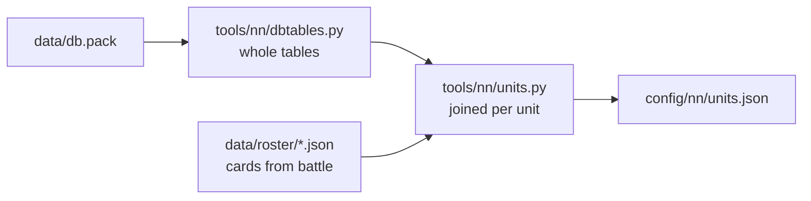

# Unit passports

[← Back](README.md) · [Documentation](../README.md) › [Data for training](README.md) › Unit passports · [Русский](../../ru/training/units.md)

A unit passport is everything that decides a fight, taken from the game's own
database: men, health, mass, speed, attack, defence, weapon, armour, shield,
leadership, shooting, cost. It is step 1 of the battle simulator
([network model](network.md)): both the simulator and the network's input read
the passports. One file for all units — `config/nn/units.json`.

## How to get them

```bash
py -3.14 -m tools.nn.units                  # the units of UNITS (tools/nn/units.py)
py -3.14 -m tools.nn.units --units k1,k2    # other units
```



- `tools/nn/dbtables.py` reads the database tables **whole**, to the last byte.
  If a game update changes a table, reading stops with an error instead of
  reading shifted numbers. How the tables are laid out: [the game's database](../game/database.md).
- `tools/nn/units.py` builds a passport from the unit key (`main_units`) and
  checks it against the unit's card from battle when there is one
  ([roster](../game/units/roster.md)). On any difference the file is not written.
- In the file: `units` — the passports; `_fields` — where each field comes
  from and what it was checked against; `_missing` — what is not there and why;
  `_source` — the `db.pack` that was read.
- Needs Python 3.14 (`compression.zstd`). Tests: `tests/tools/test_units.py`.

## What a passport holds

"Card" — the field equals the unit's card in battle. "Ours" — we worked out the
column's meaning from its values ourselves (see [below](#what-we-inferred)).

| Field | What | From | Checked |
|---|---|---|---|
| `men` | men (Ultra size) | `main_units.num_men` | card |
| `mount`, `num_mounts`, `engine` | mount, how many, war machine; none for all seven — one man = one figure | `land_units` | — |
| `hp_per_man`, `hp_total` | health of a man and of the unit | `battle_entities.hit_points` + `land_units.bonus_hit_points` | card |
| `mass` | a man's mass | `battle_entities.mass` | card |
| `size` | size class: `small`, `large`… | `battle_entities` | ours |
| `height_m`, `radius_m` | a man's height and radius | `battle_entities` | ours |
| `speed.walk`, `speed.run` | walk and run, m/s | `battle_entities` | card (the card's speed = run × 10) |
| `speed.charge`, `acceleration`, `deceleration` | charge, speeding up, slowing down | `battle_entities` | ours |
| `melee.attack`, `defence`, `charge_bonus` | attack, defence, charge | `land_units` | card |
| `melee.damage`, `ap_damage` | weapon damage: normal and armour-piercing | `melee_weapons` | card (the sum) |
| `melee.bonus_v_large`, `bonus_v_infantry` | bonus against large and against infantry | `melee_weapons` | ours |
| `melee.attack_interval_s` | time between a man's blows, s | `melee_weapons` | ours |
| `melee.splash_*` | hitting several: target size, how many, multiplier | `melee_weapons` | ours |
| `armour` | armour | `unit_armour_types` for `land_units.armour` | card |
| `shield` | shield and its chance to block an arrow, % | `unit_shield_types` for `land_units.shield` | ours (the chance) |
| `leadership` | leadership | `land_units.morale` | no (the card's morale is 0) |
| `damage_resist` | resistance: all, physical, missile, magic, fire, % | `land_units.damage_mod_*` | — |
| `attributes` | attributes: `expendable`, `encourages`… | `unit_attributes_to_groups_junctions` | — |
| `abilities` | abilities (keys only) | `land_units_to_unit_abilites_junctions` | card |
| `multiplayer_cost` | multiplayer cost | `main_units` | — |
| `missile.ammo`, `range_m` | projectiles per man, range | `land_units.primary_ammo`, `projectiles` | card |
| `missile.damage`, `ap_damage`, `reload_s` | projectile damage and reload, s | `projectiles` | card: (damage + piercing) × 10 / reload |
| `missile.accuracy` | accuracy | `land_units.accuracy` | — |
| `missile.direct` | direct (flat) fire: trajectory `low`, needs a clear line past friends | `projectiles.trajectory` | ours |
| `missile.trajectory`, `muzzle_velocity`, `max_elevation`, `calibration_*`, `penetration`, `projectile_number`, `shots_per_volley`, `explosion` | the projectile's flight | `projectiles` | ours |

Experience is not in the passport: what a rank adds is the same for everyone —
`config/nn/game_rules.json` (`experience_bonus`, `experience_levels`).

## The seven v1 units

| | Empire General | Spearmen | Archers | Skaven Warlord | Clanrat spearmen | Skavenslave spearmen | Skavenslave slingers |
|---|---:|---:|---:|---:|---:|---:|---:|
| Key | `wh_main_emp_cha_general_0` | `wh_main_emp_inf_spearmen_0` | `wh2_dlc13_emp_inf_archers_0` | `wh2_main_skv_cha_warlord_0` | `wh2_main_skv_inf_clanrat_spearmen_0` | `wh2_main_skv_inf_skavenslave_spearmen_0` | `wh2_main_skv_inf_skavenslave_slingers_0` |
| Men | 1 | 120 | 90 | 1 | 160 | 180 | 140 |
| Health of a man / unit | 4068 / 4068 | 69 / 8280 | 69 / 6210 | 4068 / 4068 | 60 / 9600 | 50 / 9000 | 48 / 6720 |
| Mass | 600 | 100 | 90 | 650 | 100 | 90 | 90 |
| Walk / run / charge, m/s | 1.5 / 3.4 / 4.1 | 1.5 / 3.0 / 3.8 | 1.5 / 3.3 / 4.0 | 1.5 / 4.0 / 4.7 | 1.5 / 4.2 / 4.8 | 1.5 / 4.2 / 4.8 | 1.5 / 4.2 / 4.8 |
| Attack / defence | 55 / 45 | 20 / 34 | 14 / 17 | 50 / 55 | 18 / 24 | 9 / 16 | 6 / 7 |
| Charge | 40 | 4 | 4 | 35 | 6 | 3 | 4 |
| Damage: normal + piercing | 290 + 140 | 19 + 6 | 21 + 3 | 280 + 120 | 18 + 5 | 12 + 4 | 14 + 4 |
| Bonus against large | 0 | 15 | 0 | 0 | 9 | 6 | 0 |
| Hits several | up to 4 | — | — | up to 4 | — | — | — |
| Armour | 85 | 30 | 20 | 90 | 25 | 0 | 0 |
| Shield, blocks arrows | 55 % | none | none | 35 % | none | none | none |
| Leadership | 70 | 60 | 50 | 60 | 45 | 35 | 33 |
| Missile resistance | 15 % | — | — | 15 % | — | — | — |
| Shooting: range, projectiles, damage, reload | — | — | 130 m, 20, 17 + 2, 10 s | — | — | — | 120 m, 22, 7 + 1, 9 s |
| Attributes | encourages | charge_defense_vs_large, charge_reflection | — | encourages | charge_defense_vs_large, charge_reflection | expendable | expendable |
| Cost (multiplayer) | 600 | 300 | 350 | 525 | 325 | 150 | 200 |

All seven also have `hide_forest` (they hide in woods). The size of all seven is
`small`. The lords' and the Skaven's abilities are in the file.

## Spearmen with shields and swordsmen

Added on 02.10.2026 to the Empire's pool: shields block slings and arrows from the
front, the Empire's answer to the Skaven at equal gold ([armies](armies.md)).
The same men as the spearmen without shields (health, mass, speed, armour,
leadership); they differ in the shield, the weapon, attack and defence.

| | Spearmen | Spearmen with shields | Swordsmen |
|---|---:|---:|---:|
| Key | `wh_main_emp_inf_spearmen_0` | `wh_main_emp_inf_spearmen_1` | `wh_main_emp_inf_swordsmen` |
| Men; health of a man / unit | 120; 69 / 8280 | 120; 69 / 8280 | 120; 69 / 8280 |
| Walk / run / charge, m/s | 1.5 / 3.0 / 3.8 | 1.5 / 3.0 / 3.8 | 1.5 / 3.0 / 3.8 |
| Attack / defence | 20 / 34 | 20 / **42** | **32 / 32** |
| Charge | 4 | 4 | **14** |
| Damage: normal + piercing | 19 + 6 | 19 + 6 | **21 + 7** |
| Bonus against large / against infantry | 15 / 0 | 15 / 0 | **0** / 0 |
| Time between blows, s | 5.7 (`wh_main_emp_spear_0`) | **4.4** (`wh_main_emp_spear`) | **4.3** (`wh_main_emp_sword`) |
| Armour | 30 | 30 | 30 |
| Shield, blocks arrows | none | **35 %** (`wh_missile_block_35_metal`) | **35 %** (the same) |
| Leadership | 60 | 60 | 60 |
| Attributes | charge_defense_vs_large, charge_reflection, hide_forest | the same | hide_forest only |
| Cost (multiplayer) | 300 | **350** | **375** |

The swordsmen have no bonus against infantry in the database (`bonus_v_infantry` 0):
their edge over the spearmen against infantry is attack 32, a heavier and faster blow
and the charge. The simulator reads all of it from the passport: no new rule.

Their cards were captured on 02.10.2026 (game v9.0.1, build 50381; each run had only
the General and the unit): the spearmen with shields with list
`config/roster/capture_emp_shields.json` (run `20261002T094315-roster-372`), the swordsmen
with `config/roster/capture_emp_swords.json` (run `20261002T095749-roster-373`). Both equal
their passports. The halberdiers and the stormvermin of the lord swarm probe are in the
file too, without cards.

## Flagellants, Greatswords, Free Company Militia

Added on 02.10.2026 to the Empire's pool (the second wave): cheap chaff that never routs, heavy
armour-piercing infantry, and the first **direct-fire** shooters. Passports from the database;
no cards from battle yet (list `config/roster/capture_emp_wave2.json`, see "Recordings wanted").

| | Flagellants | Greatswords | Free Company Militia |
|---|---:|---:|---:|
| Key | `wh_dlc04_emp_inf_flagellants_0` | `wh_main_emp_inf_greatswords` | `wh_dlc04_emp_inf_free_company_militia_0` |
| Men; health of a man / unit | 120; 73 / 8760 | 120; 76 / 9120 | 120; 61 / 7320 |
| Mass; run / charge, m/s | 100; 3.6 / 4.0 | **120**; **2.8** / 3.5 | 90; 3.6 / 4.0 |
| Attack / defence | 32 / **12** | 32 / 30 | 28 / 25 |
| Charge | **28** | 18 | 14 |
| Damage: normal + piercing | 25 + 8 (mace) | **10 + 25** (greatsword) | 21 + 7 (sword) |
| Bonus against large / infantry | 0 / 0 | 0 / **14** | 0 / 0 |
| Time between blows, s | 4.5 | 4.3 | 4.2 |
| Armour; shield | **0**; none | **95** (plate); none | 25 (leather); none |
| Leadership | **100** | 75 | 55 |
| Attributes | **unbreakable**, hide_forest | hide_forest | **mounted_fire_move**, guerrilla_deploy, hide_forest |
| Abilities | Frenzy, Strength of the Penitent | — | — |
| Shooting | — | — | pistol: **direct** (trajectory `low`), 90 m, 18 shots, 12 + 2, reload 9 s, 90 m/s, calibration 2.0 m at 65 m, penetration low |
| Cost (multiplayer) | 600 | 850 | 450 |

### What each feature does, and where it comes from

| Unit | Feature | What it does | Source | Simulator | Network |
|---|---|---|---|---|---|
| Flagellants | Unbreakable | never loses leadership, never routs (also not when the army is destroyed) | DB attribute `unbreakable`; [abilities](../game/mechanics/abilities.md), [morale](../game/mechanics/morale.md) | morale points never below leadership: never wavers or routs (`morale.py`) | passport attribute `unbreakable` (already an input) |
| Flagellants | Frenzy (passive) | +10 melee attack, ×1.1 damage, AP and charge bonus, Immune to Psychology; off while morale is below half of leadership | DB: `special_ability_phase_stat_effects`, `_attribute_effects`, `special_ability_to_auto_deactivate_flags` (`morale_is_lower_than_half_of_base_morale`); knowledge base | modelled (`sim.json` abilities.model); never off for these unbreakable men; Immune to Psychology has nothing to act on (no fear or terror in the simulator) | ability slot: effects, `immune_to_psychology`, `off_morale_below_half` |
| Flagellants | Strength of the Penitent (timed passive): the "defends better when losing" effect | the game fires it itself when the unit is in melee **and losing it**: 20 s of **+14 melee defence, +15 % physical resistance**, ends at once out of melee, ready again 3 s after | DB: `unit_special_abilities` (20 s, 3 s), `special_ability_to_recharge_contexts` (`losing_melee_combat`), auto-deactivate `out_of_melee`, the phase's effects. The fandom wiki gives 15 s (an older patch): the database wins | modelled for either side; "losing" = HP taken ≥ 1.5 × dealt recently (the morale rule's ratio, ours); physical resistance added to the melee damage rule (cap 90 %) | ability slot: `auto`, `when_losing_melee`, `off_out_of_melee`, the effects; never orderable |
| Flagellants | Very low defence, no armour | the whole base damage of every hit lands, arrows and slings too | passport | the per-hit rule with armour 0 | passport |
| Flagellants | Chaff | cheap and never runs: holds enemies in place | follows from the above | (from the numbers) | — |
| Greatswords | Armour 95, armour-piercing two-handed sword, bonus 14 against infantry | most of their damage ignores armour; their armour stops 71 % of base damage on average | passport (the wiki's 32 / 23 AP / bonus 10 are older; the DB has 35 / 25 / 14); no Stubborn or other special attribute in the WH3 database | already modelled (AP split, bonus against infantry to attack and damage, armour); test: they bring armoured stormvermin down more than 1.5× faster than swordsmen | passport |
| Greatswords | Slow (run 2.8), heavy (mass 120) | slow to reposition | passport | speed from the passport (the simulator does not use mass) | passport |
| Militia | Direct fire | flat, fixed-speed bullets: cannot shoot through or over friends; 75 % of the men blocked = holds fire at that target | DB: `projectiles.trajectory` `low`, `unit_firing_line_of_sight_considered_obstructed_ratio` 0.75, `projectile_friendly_fire_man_radius_coefficient` 2.2; [missiles](../game/mechanics/missiles.md) | line of fire (`missile.py` clear_shot, [simulator](simulator.md)) | passport `direct` |
| Militia | Accuracy, spread | calibration area 2.0 m at 65 m (the arrow 3.7 m at 95 m): tighter, but short-ranged | DB `projectiles` | hit rate 0.5 at the edge of range: an **estimate** (`sim.json` missile.musket_why) | passport `spread` (calibration area / distance × 20), `muzzle_velocity` |
| Militia | Fire whilst moving | shoots on the move | DB attribute `mounted_fire_move`; the wiki says the same | aims and shoots while moving | passport attribute |
| Militia | Decent melee (28 / 25, sword 21 + 7) | can hold a line or finish routers | passport | from the passport | passport |
| Militia | Vanguard deployment | may deploy ahead of the deployment zone | DB attribute `guerrilla_deploy`; the wiki | not modelled (placements come from the army generator) | passport attribute |

The bridge needs nothing for them: a blocked shooter under an attack order stands idle and is
released to fire at will after 4 decisions (`services.missile_duty`), as any shooter; the
Penitent is never ordered (not `self_cast`). In the game the companion cannot count the Penitent's
timers (the bridge knows only the abilities it fired), so there the network sees it as not active.

### Recordings wanted

1. **Cards**: `python -m tools.build roster-capture --capture config/roster/capture_emp_wave2.json`,
   launch, `python -m tools.roster update …/events.jsonl`, then `py -3.14 -m tools.nn.units` (the card
   check) and `py -3.14 -m tools.nn.abilities` (Frenzy and the Penitent must be on the card's passive list).
2. **Pistol hit rate, reload, first shot**: the archer range (`--range-mode damage`) with 120 militia in
   the archers' place against a standing clanrat unit at 60, 75 and 90 m, 3 runs each.
3. **Line of fire**: militia, a friendly spearmen unit 20 m in front of them across the whole line,
   clanrats 80 m away, fire at will, 60 s; then the spearmen moved aside by half their width
   (expected: no shots, then about half).
4. **The Penitent**: flagellants against stormvermin (they lose), the bridge's `ActiveEffectList`
   every second: when the phase comes on (HP taken against dealt), how long it stays.
5. **Fire whilst moving**: militia walking past a standing enemy unit at 70 m: shots while moving.

## How to add a unit

A standing procedure (user, 02.10.2026). The Flagellants, Greatswords and Free Company Militia
above are the worked example.

1. **Key and passport.** Find the main unit key (`main_units`), add it to `UNITS` in
   `tools/nn/units.py`, run `py -3.14 -m tools.nn.units`; its abilities: `py -3.14 -m tools.nn.abilities`.
2. **Research every special feature.** The unit's attributes (the passport's `attributes`), its
   abilities (effects, `auto`, `auto_when`: when the game fires it, `off_when`: when it is off),
   its projectile (trajectory, calibration, penetration) and its in-game description; then the
   web (honga.net's WH3 unit pages, the fandom wiki, guides; older patches' numbers differ: the
   database wins) and the knowledge base `docs/en/game/mechanics/`. Look for conditional bonuses
   ("the worse it goes, the better it defends"), immunities, deployment and movement rules.
3. **Write each feature down** in this page's table for the unit: what it does, its source, how the
   simulator models it (or why not) and how the network sees it.
4. **Model every feature that changes battle outcomes**: in the simulator (a `sim.json` number with
   its `why`; an estimate says so and names the recording that would measure it) and in the
   network's input: a passport feature (`tools/nn/model/passport.py`) or an ability field
   (`tools/nn/model/abilities.py`). New inputs go **at the end** of the passport or ability features
   only: older checkpoints then load with zero weights for them (`encoder.pad_inputs`) and act as before.
5. **Card from battle**: a capture list `config/roster/capture_<name>.json` (the general and up to 4
   units), roster capture, `tools.roster update`, rebuild the passports (they must equal the card).
6. **Pool**: `config/nn/pools.json` (key, slot, width), then `py -3.14 -m tools.nn.armies.templates`
   ([armies](armies.md#a-new-unit-or-faction)).
7. **Tests**: the passport (`tests/tools/test_units.py`), each new mechanic in the simulator
   (`tests/tools/test_sim.py`), the network forward/backward and an old checkpoint loading through the
   conversion (`tests/tools/test_nn_model.py`).
8. **Docs** in both languages: this page, [simulator](simulator.md), [armies](armies.md).

## Checked against the cards

All seven passports equal their cards from battle in every checked field (the
table above, column "Checked"). The slingers' card was captured on 30.09.2026
(game v9.0.1, build 50381; list `config/roster/capture_skaven.json`, the run had
only the warlord and the slingers). The clanrat spearmen's card is from 27.09.2026
(the same game version, run `20260927T212729-roster-56`). The `land_units` and `main_units` columns
of the three Empire units also equal, all 60 + 45 columns, the earlier decode
with a schema from 26.09.2026 (local archive `research/evidence/units/empire-20260926`).

- **Reload.** The slingers' card shows missile damage 8.89, not 7 + 1 = 8: the
  card shows damage per 10 s. 8 × 10 / 9 = 8.89 — so the sling reloads in 9 s.
  The archers: 19 × 10 / 10 = 19.
- **Leadership** on the card in deployment is 0, so it cannot be checked; we
  take it from the database.

## Shields

The three v1 spearmen units have **no shield** (`shield` = `none`), nor do the archers
and the slingers. The lords have one: the General's is metal and blocks
55 % of arrows, the Warlord's is wood, 35 %. Since 02.10.2026 the Empire's pool also has
the spearmen with shields and the swordsmen (metal, 35 % both). A shield covers 60° from the front
([missile damage](../game/units/missile-damage.md)); the simulator blocks that share of
the hits whose shooter stands within 60° of the target's facing, for lords and infantry alike.

## What is not there, and why

- **Projectile bonus against large and infantry.** No column found: the
  archers' "anti-large arrow" row equals the plain arrow in every field.
- **Whether it shoots over friends.** No column of its own: `missile.direct` (trajectory `low`,
  the militia's pistols) cannot; `dual_low_fixed` (arrow, sling) arcs over friends (knowledge base,
  not measured).
- **Fatigue per unit.** Not in `land_units` or `battle_entities`; the fatigue
  rules are shared (`config/nn/game_rules.json`, `fatigue`).
- **A lord's own aura.** The tables give a lord no radius of his own. The aura
  is shared: `general_aura_radius` 70 m and `general_inspire_effect_amount_*` in
  `_kv_morale_tables` ([morale](../game/units/morale.md)). A lord is marked by
  the attribute `encourages`.
- **What attributes do.** Keys only. Abilities: their numbers, when the game fires them and when
  they are off are in the ability passports (`config/nn/abilities.json`).

## What we inferred

We named these columns ourselves, from the values across the whole table:

- `bonus_v_large` — non-zero for spears and halberds; `bonus_v_infantry` — for
  paired swords and chariots.
- `melee_attack_interval` — 3.2–6 s, most often 4.0 (like `melee_attack_interval`
  4 in `_kv_rules_tables`); 5.7 for the Empire spear, 4.3 for the clanrat spear. Whether it works so in
  battle is not checked.
- `splash_*` — heroes "up to 4 targets of size `medium`", infantry 1.
- `charge_speed` is above the run for all seven; `acceleration`, `deceleration`,
  `radius`, `height` — by their size.
- `missile_block_chance` — the number in the shield's key
  (`wh_missile_block_55_metal` → 55).
- In `projectiles`: `minimum_range`, `max_elevation` (88°), `muzzle_velocity`
  (45 m/s the arrow, 50 the sling), `calibration_distance` and `calibration_area`
  (95 m and 3.7 m for the arrow), `penetration` (`very_low`), `trajectory`,
  `projectile_number`, `shots_per_volley` (1 each).

They have to be checked by measuring in battle before the simulator relies on
them.
