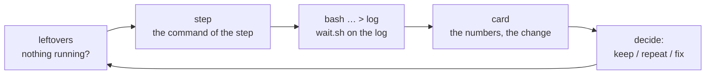

# The working process: a chain step, the run card, leftovers

[← Back](README.md) · [Documentation](../README.md) › [Data for training](README.md) › Workflow · [Русский](../../ru/training/workflow.md)

How a step of the training chain is run and judged, and the small tools that take the chores
out of it (`tools/ops`). The standing rules every agent follows are in the repository's
`CLAUDE.md`; a brief adds only the task.

## One cycle

| What | How | Instead of |
|---|---|---|
| Is anything left from the last step? | `.venv/Scripts/python -m tools.ops.leftovers` — our containers, the GPU lock, wait loops, the game, the GPU's load; exit 1 when something is left; `--kill` ends wait loops older than 10 min, `--unlock` removes a stale lock, `--stop NAME` stops one of our containers | `docker ps`, `ls build/*.lock`, `ps` by hand, and the misses: nine containers at once (training 2x slower), a trap that deleted another job's lock |
| The next step's command | `.venv/Scripts/python -m tools.ops.step --label n4 --from n3_consolidate [--minutes 25] [--set drills=0.1] [--drop teach-normal] [--write build/steps/n4.sh] [-- run.py options]` | sed-editing the previous step's script (a wrong critic or reference goes unnoticed) |
| Waiting for a run or a test | `bash tools/ops/wait.sh -t 5400 build/steps/n4.log '^written:\|Traceback'` — a timeout, case-insensitive, exit 2 on time | `until grep …; do sleep 60; done` — ran for hours when `FAILED` came in capitals |
| A simulator or drill change is ready, the previous step still trains | `.venv/Scripts/python -m tools.ops.baselines --build <main checkout>/build --run` from the worktree with the change — the new version's references on the CPU, ~8 min ([the cache](#the-baselines-cache-and-the-canary)) | the step waited 25–50 min for them at its "before" evaluation |
| Judging the step | `.venv/Scripts/python -m tools.ops.card build/nn-train/test5/n4 --prev build/nn-train/test5/n3_consolidate` | reading ~200 lines of `trend.md` for ten numbers |

## The chain step (`tools/ops/step.py`)

The step takes the previous label and derives what the chain needs
([the chain's settings](training.md#the-chains-settings)): its last `m<minute>.pt` (or the one
named, `--from n3/m15`) is the `--init` and the `--reference`, its run's `runs/test5_<label>/latest.pt`
the `--critic-init`; the standing options come from `config/train-chain.json` (`--set key=value`
overrides one, `--drop key` removes one, options after `--` are appended as given; `run.py` takes the
last value of a repeated option). The container is `orch-<label>`; `--gpu-duty 0.9` sits in the
options file. The tool prints the two-line script (or writes it with `--write`), the init and
critic it chose, whether the references' cache (the script baselines and the drill check scripts)
will hit, and the expected wall time: training + (points + 2) evaluations of ~3.3 min (+ ~10 min on a
cache miss; ahead of it: [`tools.ops.baselines`](#the-baselines-cache-and-the-canary)). It runs
nothing: the orchestrator starts the script in the background and waits on its log.

The options file is outside `config/nn` on purpose: that folder is part of the simulator's
version (below), and an edit there would make the baselines miss.

## The run card (`tools/ops/card.py`)

One table per step, a column per evaluation point: the rating (logit, higher is better), pair
gold per opponent (ours minus the opponent's with the same armies, / budget; positive: we trade
better), the exchange vs `ai_like`, each drill's win rate with the skilled script's beside, each
drill's transfer to normal battles (APPLIED share — higher is better; MISTAKE share — lower is
better; network / `ai_like`), the teachers' shares, own lord dead, the kinds hold / move / attack,
missile time in melee, timeouts, the evaluation's seconds (a cache miss shows here: ~500–600 s
instead of ~190), the KL distance from the start. The last column is the change from the first
point to the last, marked `*` beyond the noise (two standard errors where the number has one:
rating, pair gold, drill wins, lord deaths; |change| ≥ 0.05 otherwise). Below: anomalies (a rating
fall beyond noise between two points, the move share or lord deaths ×1.5, timeouts above 5 %, a
drill's win falling ≥ 0.15), the capacity verdict, the training's minutes and updates. `--prev`
adds the previous step's end point and the change from it; `--json` the data.

It reads `report.json`; while the run goes, `before.json` and the `eval_m<minute>.json` written so
far (the fair metrics computed with `skill.py`, numpy), so the card of a running step is a command
away.

## The baselines' cache and the canary

The fair metrics compare the network with the script playing itself on the same battles
([test protocol](training.md#test-protocol-test5)), and the drill evaluation compares it with the
drill's two check scripts (naive and skilled). These script battles ("references") are cached in
`build/nn-train/baselines/`:

| File | What | Version: a hash of |
|---|---|---|
| `<opponent>_19u_3600s_<version>.json` | `ai_like`, `nearest`, `hold_shoot` against themselves, 256 pairs each | the files a script battle depends on: `tools/nn/train/version.py` `VERSION_FILES` (the simulator, the armies, the scripts, the reward, the model, `config/nn`) |
| `drill_<drill>_128_broad<share>[_embed<share>]_<version>.json` | `kiting`, `counter`, `hold_fire`: naive and skilled, 128 battles each | the simulator version and `tools/nn/train/drills` (`version.drill_version`) |

A change to any of those files misses the cache.

**A miss is played on the CPU.** Before its first evaluation `test5` starts the missing files
(`tools/nn/train/refs.py`): each script's baseline and each drill check script is a process of its own
with one thread (9 jobs, the longest first) while the GPU plays the network's own battles; the
evaluation waits for the files where it reads them. The battles step compacted — only those still
running: on the CPU a step costs in proportion to the battles it steps, and the battles' lengths differ
a lot (kiting: median ~600 s, 10 % to the 3600 s limit). Measured on version `080d6157e23f`, 8 cores:
8 min 6 s from the container's start (ai_like 461 s, hold_shoot 408, kiting 410 + 477, hold_fire 389 +
325, nearest 212, counter 38 + 43). In game mode (5 cores): ~10 min estimated.

**Ahead, so the training never waits.** `.venv/Scripts/python -m tools.ops.baselines` prints the versions
and what is missing; `--run` plays it in the container `orch-baselines` (8 cores, no GPU; wait with
`bash tools/ops/wait.sh` on its log). When a simulator change is ready in an agent's worktree while
the previous step still trains, from that worktree:
`.venv/Scripts/python -m tools.ops.baselines --build <main checkout>/build --run` — the files land under
the new version (the version is a hash of the files' contents, the commit gives the same one) and the
next step finds them. `tools.ops.step` says whether the cache will miss (drills included) and names
this command.

**The canary** (`test5 --baseline-canary 32`, the chain's default; `refs.py` the same): on a miss a
script's baseline plays its first 32 pairs first; when they come out identical in every field (winner,
gold lost, start, budget, factions, attacker) to an older version's file, that file is adopted under
the new version — a change that cannot touch a script battle (the network, a reward term) costs ~1 min
(ai_like: 59 s instead of 461). The 32 pairs come from the whole baseline's batch
(`script_battles(first=…)`): the start places' jitter is drawn over the whole batch
(`randomise.apply`), and the same pairs in a batch of their own are other battles. The CPU repeats
itself exactly (two runs: the same numbers), so the canary compares files made on the CPU; it never
adopts an earlier version's GPU file. The drills have no canary.
`python -m tools.nn.train.version` says the simulator version and whether its files exist (on the
host without torch, the same hash as the container).

**The noise of a recompute.** The rating and the pair gold do not use the baselines. A script's
baseline enters only the network's edge over the script (`baseline`: `gold_adv`, `win_adv`). In the
overall cell every pair is the script's battle from both sides, which sums to exactly 0 trade and 0.5
wins, so the overall cell does not depend on the baseline file (CPU and GPU: equal to 4 digits on
`s6_fatigue/before.json`). The cells by role and faction depend on the realisation: the CPU instead of
the GPU (the same armies, 83 % the same winners, not one battle exactly the same) moved them by
0.2–0.8 standard errors at the median, 2.2 at most (`nearest` attacking: 0.106 → 0.079, error 0.014).
That is the baseline's own noise, no larger than before: the script trade's spread over battles 0.35 /
0.30 / 0.27 against 0.34 / 0.30 / 0.28 on the GPU; any recompute after a simulator change moves these
cells the same way. The drill check scripts, CPU against GPU: kiting naive 0.742 / 0.672 wins, skilled
0.828 / 0.805; hold_fire 0.203 / 0.164 and 0.867 / 0.844; counter 1.0 / 1.0 and 0.992 / 1.0; the trade
within 0.02. The drill teacher takes the gap skilled − network, so its share moves by ~0.01.

## Tried and rejected

- The references on the GPU inside the "before" evaluation: the baselines ~5 min, the drill check
  scripts ~25–37 min (uncompiled and not compacted: a batch of 128 battles stepped until its last one
  ended); a "before" with a miss took 1858–3112 s instead of ~200, and the training waited.
- The canary on a batch of the first 32 pairs alone: the start places' jitter is drawn over the whole
  batch, and in a batch of 32 these are other battles — the canary never matched (6 misses of 6, each
  ~25–50 min).
- A process per drill (naive and skilled in one): 12 min 49 s for everything, kiting alone 762 s. A
  process per drill script: 8 min 6 s.
