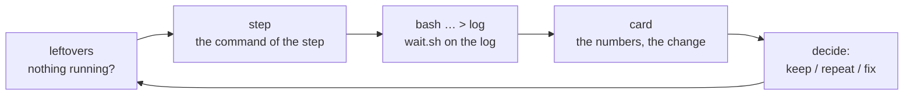

# The working process: a chain step, the run card, leftovers

[← Back](README.md) · [Documentation](../README.md) › [Data for training](README.md) › Workflow · [Русский](../../ru/training/workflow.md)

How a step of the training chain is run and judged, and the small tools that take the chores
out of it (`tools/ops`). The standing rules every agent follows are in the repository's
`CLAUDE.md`; a brief adds only the task.

## One cycle

| What | How | Instead of |
|---|---|---|
| Is anything left from the last step? | `.venv/Scripts/python -m tools.ops.leftovers` — our containers, the GPU lock, wait loops, the game, the GPU's load; exit 1 when something is left; `--kill` ends wait loops older than 10 min, `--unlock` removes a stale lock, `--stop NAME` stops one of our containers | `docker ps`, `ls build/*.lock`, `ps` by hand, and the misses: nine containers at once (training 2x slower), a trap that deleted another job's lock |
| The next step's command | `.venv/Scripts/python -m tools.ops.step --label n4 --from n3_consolidate [--minutes 25] [--set drills=0.1] [--drop teach-normal] [--write build/steps/n4.sh] [-- run.py options]` | sed-editing the previous step's script (a wrong critic or reference goes unnoticed) |
| Waiting for a run or a test | `bash tools/ops/wait.sh -t 5400 build/steps/n4.log '^written:\|Traceback'` — a timeout, case-insensitive, exit 2 on time | `until grep …; do sleep 60; done` — ran for hours when `FAILED` came in capitals |
| Judging the step | `.venv/Scripts/python -m tools.ops.card build/nn-train/test5/n4 --prev build/nn-train/test5/n3_consolidate` | reading ~200 lines of `trend.md` for ten numbers |

## The chain step (`tools/ops/step.py`)

The step takes the previous label and derives what the chain needs
([the chain's settings](training.md#the-chains-settings)): its last `m<minute>.pt` (or the one
named, `--from n3/m15`) is the `--init` and the `--reference`, its run's `runs/test5_<label>/latest.pt`
the `--critic-init`; the standing options come from `config/train-chain.json` (`--set key=value`
overrides one, `--drop key` removes one, options after `--` are appended as given; `run.py` takes the
last value of a repeated option). The container is `orch-<label>`; `--gpu-duty 0.9` sits in the
options file. The tool prints the two-line script (or writes it with `--write`), the init and
critic it chose, whether the baselines' cache will hit, and the expected wall time: training +
(points + 2) evaluations of ~3.3 min (+ ~25 min on a cache miss without the canary). It runs
nothing: the orchestrator starts the script in the background and waits on its log.

The options file is outside `config/nn` on purpose: that folder is part of the simulator's
version (below), and an edit there would make the baselines miss.

## The run card (`tools/ops/card.py`)

One table per step, a column per evaluation point: the rating (logit, higher is better), pair
gold per opponent (ours minus the opponent's with the same armies, / budget; positive: we trade
better), the exchange vs `ai_like`, each drill's win rate with the skilled script's beside, each
drill's transfer to normal battles (APPLIED share — higher is better; MISTAKE share — lower is
better; network / `ai_like`), the teachers' shares, own lord dead, the kinds hold / move / attack,
missile time in melee, timeouts, the evaluation's seconds (a cache miss shows here: 1400–1800 s
instead of ~190), the KL distance from the start. The last column is the change from the first
point to the last, marked `*` beyond the noise (two standard errors where the number has one:
rating, pair gold, drill wins, lord deaths; |change| ≥ 0.05 otherwise). Below: anomalies (a rating
fall beyond noise between two points, the move share or lord deaths ×1.5, timeouts above 5 %, a
drill's win falling ≥ 0.15), the capacity verdict, the training's minutes and updates. `--prev`
adds the previous step's end point and the change from it; `--json` the data.

It reads `report.json`; while the run goes, `before.json` and the `eval_m<minute>.json` written so
far (the fair metrics computed with `skill.py`, numpy), so the card of a running step is a command
away.

## The baselines' cache and the canary

The fair metrics compare the network with the script playing itself on the same battles
([test protocol](training.md#test-protocol-test5)); those script battles are cached in
`build/nn-train/baselines/<opponent>_19u_3600s_<version>.json`, the version a hash of the files a
script battle depends on (`tools/nn/train/version.py` `VERSION_FILES`: the simulator, the armies,
the scripts, the reward, the model, `config/nn`). Any change there misses the cache and the next
"before" evaluation plays 256 pairs × 3 scripts again: 1384–1843 s instead of 194 s.

Measured over 02–04.10: 20 versions, i.e. 20 recomputes, of which only 10 gave different
numbers — half the misses (≈ 10 × 20–25 min) came from changes that cannot touch a script battle
(the network, a reward term, a drill). The canary (`test5 --baseline-canary 32`, the chain's
default): on a miss the scripts play the first 32 pairs; when they come out identical in every
field (winner, gold lost, start, budget, factions, attacker) to an older version's file, that file
is adopted under the new version (~3 min instead of ~25); when no file matches, the whole
baseline is played as before. `python -m tools.nn.train.version` says the current version and
whether its files exist. The check runs on the host without torch and gives the same hash as the
container.

## Tried and rejected

- Nothing yet; rejected approaches to the process go here with numbers.
