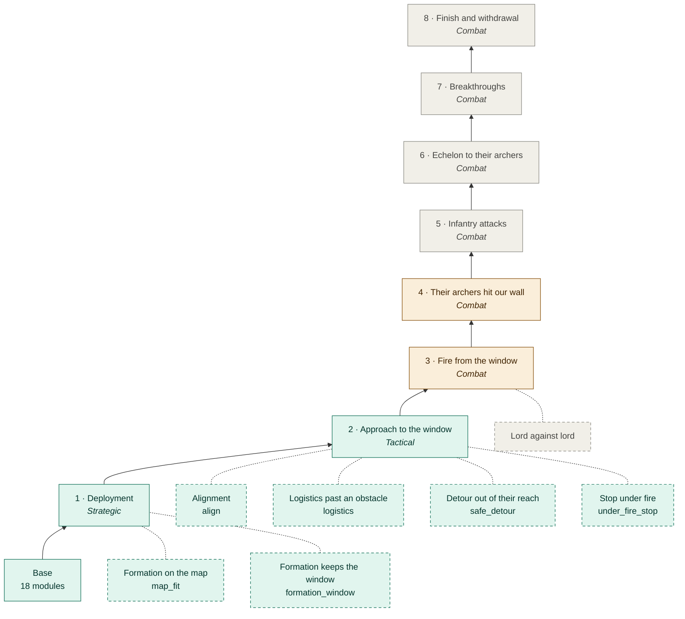
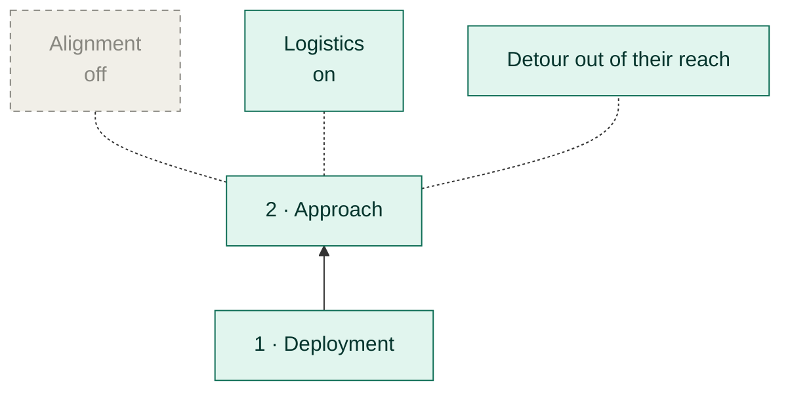
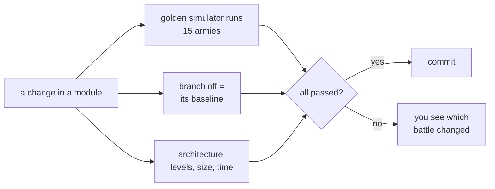

# The AI tree

[← Back](../README.md) · [Documentation](../README.md) › AI tree · [Русский](../../ru/tree/README.md)

Everything our battle AI does is one tree. The **trunk** is the battle's phases in
order: the next starts when its condition holds. **Branches** improve a phase: each
says what happens without it and can be switched off without breaking the trunk.
Read it **bottom up**: from the base (engine and data) to the battle.

## The whole tree

<!-- generated:tree:diagram -->

<!-- /generated -->

Green — done, yellow — started, grey — planned. A solid arrow up is the trunk's
next phase; a dashed line is a branch (a dashed frame — it can be switched off).
Phases 3–8 and "lord against lord" come from the battle theory (Russian only).

## All nodes

<!-- generated:tree:table -->
| Node | Kind | Level | Status | Switch | Without it | Modules |
|---|---|---|---|---|---|---|
| [Deployment](deploy.md) | phase | Strategic | done | — | the tree's root, cannot be off | [plan](../apps/plan.md), [assessment](../apps/assessment.md), [strategy](../apps/strategy.md), [formation](../apps/formation.md) |
| [Formation on the map](map_fit.md) | branch | Strategic | done | `map_fit` (on) | the formation stands where asked; the map is not considered | [formation](../apps/formation.md), [mask](../apps/mask.md) |
| [Formation keeps the window](formation_window.md) | branch | Strategic | done | `formation_window` (on) | the thickest wall; the window is not checked | [formation](../apps/formation.md), [reach](../apps/reach.md) |
| [Approach to the window](approach.md) | phase | Tactical | done | `approach` (on) | the army stands where it was deployed | [tactics](../apps/tactics.md), [approach](../apps/approach.md), [reach](../apps/reach.md), [battlefield](../apps/battlefield.md), [vision](../apps/vision.md), [mask](../apps/mask.md) |
| [Alignment](align.md) | branch | Tactical | done | `align` (on) | no alignment: the army steps along its own facing | [alignment](../apps/alignment.md), [battlefield](../apps/battlefield.md), [vision](../apps/vision.md) |
| [Logistics past an obstacle](logistics.md) | branch | Tactical | done | `logistics` (off) | the engine walks the units round an obstacle by itself | [logistics](../apps/logistics.md), [mask](../apps/mask.md) |
| [Detour out of their reach](safe_detour.md) | branch | Tactical | done | `safe_detour` (on) | a place past an obstacle is searched up to 20 m short of their front | [tactics](../apps/tactics.md), [approach](../apps/approach.md), [reach](../apps/reach.md) |
| [Stop under fire](under_fire_stop.md) | branch | Tactical | done | `under_fire_stop` (on) | one action at a time even under fire | [tactics](../apps/tactics.md), [approach](../apps/approach.md) |
| [Fire from the window](combat.md#3) | phase | Combat | started | comes with the node | — | [missile](../apps/missile.md), [reach](../apps/reach.md) |
| [Their archers hit our wall](combat.md#4) | phase | Combat | started | comes with the node | — | [tactics](../apps/tactics.md) |
| [Infantry attacks](combat.md#5) | phase | Combat | planned | comes with the node | — | — |
| [Echelon to their archers](combat.md#6) | phase | Combat | planned | comes with the node | — | — |
| [Breakthroughs](combat.md#7) | phase | Combat | planned | comes with the node | — | — |
| [Finish and withdrawal](combat.md#8) | phase | Combat | planned | comes with the node | — | — |
| [Lord against lord](combat.md#lord) | parallel branch | Combat | planned | comes with the node | — | — |
<!-- /generated -->

## Switching nodes on and off

The army's `tree` field (`config/armies/*.json`). A node switched off switches off
everything that grows from it and every later phase; its parent does what the
"Without it" column says.

```json
{"tree": {"align": false, "logistics": true}}
```



`{"approach": false}`: the army deploys and stands; alignment, logistics and
everything after phase 2 do not run. The first phase cannot be switched off.

## How we know the tree does not break



More: [tests](../testing/tests.md); modules by level — [module map](modules.md);
how to keep these docs — [rules](../architecture/documentation.md).

## Pages

<!-- generated:docs:index -->
- [Phase 1 · Deployment](deploy.md) — The first phase and the tree's root: from the armies pick a strategy and place the formation
- [Formation on the map](map_fit.md) — A branch of deployment: the formation does not stand on rocks
- [Formation keeps the window](formation_window.md) — A branch of deployment: the wall no thicker than the window allows
- [Phase 2 · Approach to the window](approach.md) — Step up and stand in the **window**: our first echelon reaches their infantry, their archers do not reach our wall
- [Alignment](align.md) — A branch of the approach: stand square opposite the enemy's main group so the wall faces their front
- [Logistics past an obstacle](logistics.md) — A branch of the approach: when a step walks round an obstacle, units pass it in queues, not in a crowd
- [Detour out of their reach](safe_detour.md) — A branch of the approach: when the formation does not fit where a step ends, a place past the obstacle is searched **only where their shooters do not reach**
- [Stop under fire](under_fire_stop.md) — A branch of the approach, the only exception to "one action at a time": if a unit of ours is under fire, the manoeuvre is broken off and nothing new is started …
- [Combat level · phases 3–8](combat.md) — The phases after we stand in the window
- [Module map](modules.md) — Which code modules sit on which level and who uses whom
<!-- /generated -->
