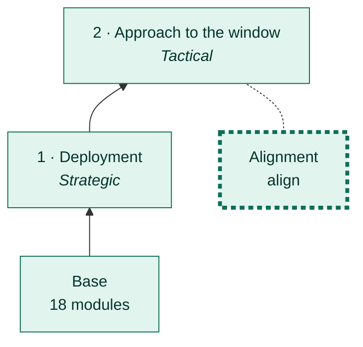
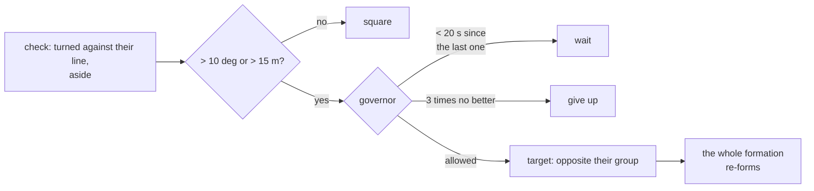

# Alignment

[← Back](README.md) · [Documentation](../README.md) › [AI tree](README.md) › Alignment · [Русский](../../ru/tree/align.md)

A branch of the approach: stand square opposite the enemy's main group so the wall faces their front.

## Place in the tree

<!-- generated:tree:here:align -->

<!-- /generated -->

## Card

<!-- generated:tree:card:align -->
| | |
|---|---|
| What it does | Stand square opposite the enemy's main group: turned <= 10 deg, aside <= 15 m |
| Starts when | turned or aside more than allowed |
| Without it | no alignment: the army steps along its own facing |
| Switch | `align` (on) |
| Kind, level | branch, Tactical |
| Grows from | [Approach to the window](approach.md) |
| Modules | [alignment](../apps/alignment.md), [battlefield](../apps/battlefield.md), [vision](../apps/vision.md) |
| Status | done |
<!-- /generated -->

## How it works

## Known problem (28.09.2026)

Against the game's AI the alignment **chases the enemy's re-forming**: right after
deployment the enemy stands crooked and aside — we turn 32 deg and walk 350 m aside,
the enemy re-forms — we turn back 40 deg. In 2 of 4 battles the new axis took the army
onto rocks and the approach stopped ("no place").

| Decision | Turned | Aside |
|---|---|---|
| right after deployment | 32 deg | −350 m |
| next (500 m from the enemy) | −40 deg | +245 m |
| later | 5–11 deg | 23–70 m |

Proposed: no alignment while the enemy re-forms; coarse limits far away, fine ones
before the window; on "no place" go back to the last direction.

## Checks

- `tests/apps/alignment/`; branch off = no alignment: `tests/tools/test_tree_branches.py`.

Modules: [alignment](../apps/alignment.md) · [battlefield](../apps/battlefield.md) · [vision](../apps/vision.md).
